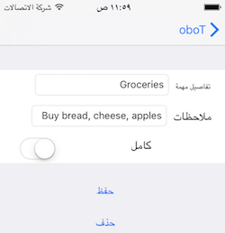
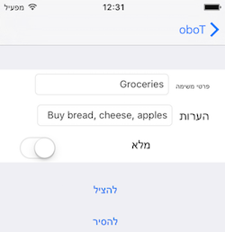
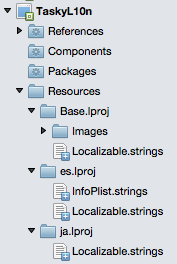
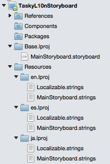
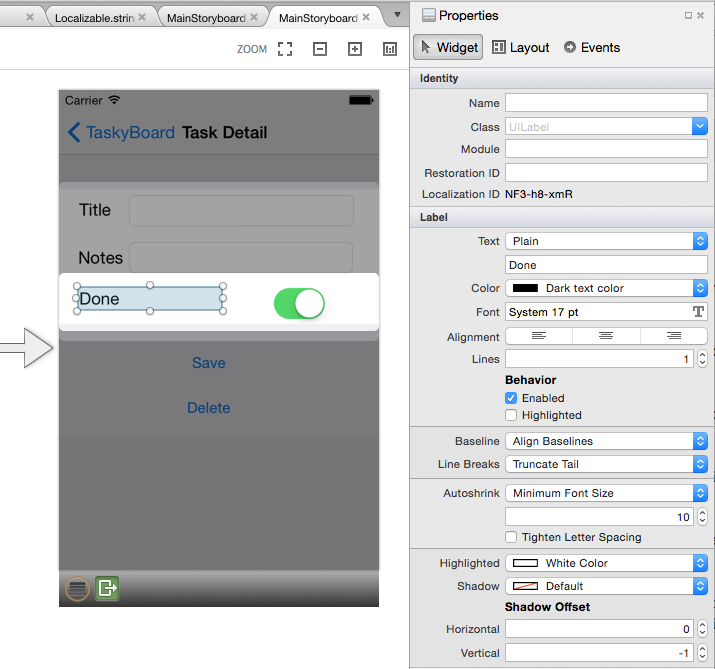
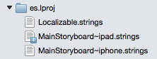

# Localization in Xamarin.iOS

_This document covers the localization features of the iOS SDK and how to access them with Xamarin._

Refer to the [Internationalization Encodings](encodings.md) for instructions on including
character sets/code pages in applications that must process non-Unicode data.

## iOS platform features

This section describes some of the localization features in iOS. Skip to the
[next section](#localization-basics-in-ios) to see specific code and examples.

### Language

Users choose their language in the **Settings** app. This setting affects the
language strings and images displayed by the operating system and in apps.

To determine the language being used in an app, get the first element
of `NSBundle.MainBundle.PreferredLocalizations`:

```csharp
var lang = NSBundle.MainBundle.PreferredLocalizations[0];
```

This value will be a language code such as `en` for English, `es` for Spanish,
`ja` for Japanese, etc. The value returned is restricted to one of the
localizations supported by the application (using fallback rules to
determine the best match).

Application code does not always need to check for this value – Xamarin and iOS both
provide features that help to automatically provide the correct string or resource
for the user's language. These features are described in the remainder of this document.

> [!NOTE]
> Use `NSLocale.PreferredLanguages` to determine the user's language
> preferences, regardless of the localizations supported by
> the app. The values returned by this method changed in iOS 9; see
> [Technical Note TN2418](https://developer.apple.com/library/content/technotes/tn2418/_index.html)
> for details.

### Locale

Users choose their locale in the **Settings** app. This setting affects the way
that dates, times, numbers, and currency are formatted.

This lets users choose whether they see 12-hour or 24-hour time formats, whether
their decimal separator is a comma or a point, and the order of day, month and
year in date display.

With Xamarin you have access to both Apple’s iOS classes (`NSNumberFormatter`) as
well as the .NET classes in System.Globalization. Developers should evaluate
which is better suited to their needs, as there are different features available
in each. In particular, if you are retrieving and displaying In-App Purchase
prices using StoreKit you should use Apple’s formatting classes for
the price information returned.

The current locale can be queried by either of two ways:

- `NSLocale.CurrentLocale.LocaleIdentifier`
- `NSLocale.AutoUpdatingCurrentLocale.LocaleIdentifier`

The first value can be cached by the operating system and so might not always
reflect the user’s currently selected locale. Use the second value to obtain the
currently selected locale.

> [!NOTE]
> Mono (the .NET runtime upon which Xamarin.iOS is based) and Apple’s iOS
> APIs do not support identical sets of language/region combinations.
> Because of this, it’s possible to select a language/region combination in
> the iOS **Settings** app that does not map to a valid value in Mono. For
> example, setting an iPhone’s language to English and its region to Spain
> will cause the following APIs to yield different values:
>
> - `CurrentThead.CurrentCulture`: en-US (Mono API)
> - `CurrentThread.CurrentUICulture`: en-US (Mono API)
> - `NSLocale.CurrentLocale.LocaleIdentifier`: en_ES (Apple API)
>
> Since Mono uses `CurrentThread.CurrentUICulture` to select resources and
> `CurrentThread.CurrentCulture` to format dates and currencies,
> Mono-based localization (for example, with .resx files) may not yield
> expected results for these language/region combinations. In these
> situations, rely on Apple's APIs to localize as necessary.

### NSCurrentLocaleDidChangeNotification

iOS generates an `NSCurrentLocaleDidChangeNotification` when the user updates
their locale. Applications can listen for this notification while they are
running and can make appropriate changes to the UI.

## Localization basics in iOS

The following features of iOS are easily leveraged in Xamarin to provide
localized resources for display to the user. Refer to the [TaskyL10n sample](https://github.com/conceptdev/xamarin-samples/tree/master/TaskyL10n)
to see how to implement these ideas.

### Specifying default and supported languages in Info.plist

In [Technical Q&A QA1828: How iOS Determines the Language For Your App](https://developer.apple.com/library/content/qa/qa1828/_index.html),
Apple describes how iOS selects a language to use in an app. The following
factors impact which language is displayed:

- The user's preferred languages (found in the **Settings** app)
- The localizations bundled with the app (.lproj folders)
- `CFBundleDevelopmentRegion` (**Info.plist** value specifying the default
  language for the app)
- `CFBundleLocalizations` (**Info.plist** array specifying all supported
   localizations)

As indicated in the Technical Q&A, `CFBundleDevelopmentRegion` represents an
app's default region and language. If the app doesn't explicitly support any
of a user's preferred languages, it will use the language specified by this
field.

> [!IMPORTANT]
> iOS 11 applies this language selection mechanism more strictly than did
> previous versions of the operating system. Because of this, any iOS 11 app
> that does not explicitly declare its supported localizations – either by
> including .lproj folders or setting a value for `CFBundleLocalizations` –
> may display a different language in iOS 11 than it did in iOS 10.

If `CFBundleDevelopmentRegion` has not been specified in the **Info.plist**
file, the Xamarin.iOS build tools currently use a default value of
`en_US`. While this may change in a future release, it means that the
default language is English.

To ensure that your app selects an expected language, take the following
steps:

- Specify a default language. Open **Info.plist** and use the **Source**
  view to set a value for the `CFBundleDevelopmentRegion` key; in XML, it
  should look similar to the following:

```xml
<key>CFBundleDevelopmentRegion</key>
<string>es</string>
```

This example uses “es” to specify that when none of a user’s preferred
languages are supported, default to Spanish.

- Declare all supported localizations. In **Info.plist**, use the
  **Source** view to set an array for the `CFBundleLocalizations` key; in
  XML, it should look similar to the following:

```xml
<key>CFBundleLocalizations</key>
<array>
    <string>en</string>
    <string>es</string>
    ...
</array>
```

Xamarin.iOS apps that have been localized using .NET mechanisms such as
.resx files must provide these **Info.plist** values as well.

For more information about these **Info.plist** keys, take a look at Apple's
[Information Property List Key Reference](https://developer.apple.com/library/content/documentation/General/Reference/InfoPlistKeyReference/Articles/CoreFoundationKeys.html).

### GetLocalizedString method

The `NSBundle.MainBundle.GetLocalizedString` method looks up localized text
that has been stored in **.strings** files in the project. These files are
organized by language, in specially named directories with an **.lproj** suffix (note the first letter of the extension is a lower-case "L").

#### .strings file locations

- **Base.lproj** is the directory that contains resources for the default language.
  It is often located in the project root (but can also be placed in the **Resources** folder).
- **&lt;language&gt;.lproj** directories are created for each supported language, usually
  in the **Resources** folder.

There can be a number of different **.strings** files in each language directory:

- **Localizable.strings** – the main list of localized text.
- **InfoPlist.strings** – certain specific keys are allowed in this file to
  translate things such as the application name.
- **\<storyboard-name>.strings** – optional file that contains translations
  for user interface elements in a storyboard.

The **Build Action** for these files should be **Bundle Resource**.

#### .strings file format

The syntax for localized string values is:

```console
/* comment */
"key"="localized-value";
```

You should escape the following characters in strings:

- `\"` quote
- `\\` backslash
- `\n` newline

This is an example **es/Localizable.strings** (ie. Spanish) file from the sample:

```console
"<new task>" = "<new task>";
"Task Details" = "Detalles de la tarea";
"Name" = "Nombre";
"task name" = "nombre de la tarea";
"Notes" = "Notas";
"other task info"= "otra información de tarea";
"Done" = "Completo";
"Save" = "Guardar";
"Delete" = "Eliminar";
```

### Images

To localize an image in iOS:

1. Refer to the image in code, for example:

    ```csharp
    UIImage.FromBundle("flag");
    ```

2. Place the default image file **flag.png** in **Base.lproj**
  (the native development language directory).

3. Optionally place localized versions of the image  in **.lproj**
  folders for each language (eg. **es.lproj**, **ja.lproj**). Use the same
  filename **flag.png** in each language directory.

If an image is not present for a particular language, iOS will fall back to the
default native language folder and load the image from there.

#### Launch images

Use the standard naming conventions for the launch images (and the XIB or
Storyboard for iPhone 6 models) when placing them in
the **.lproj** directories for each language.

```console
Default.png
Default@2x.png
Default-568h@2x.png
LaunchScreen.xib
```

### App name

Placing an **InfoPlist.strings** file in an **.lproj** directory lets you
override some values from the app's **Info.plist**, including the application name:

```console
"CFBundleDisplayName" = "LeónTodo";
```

Other keys that you can use to [localize application-specific strings](https://developer.apple.com/library/ios/documentation/MacOSX/Conceptual/BPInternational/LocalizingYourApp/LocalizingYourApp.html#//apple_ref/doc/uid/10000171i-CH5-SW21) are:

- CFBundleName
- CFBundleShortVersionString
- NSHumanReadableCopyright

### Dates and times

Although it is possible to use the built-in .NET date and time functions
(along with the current `CultureInfo`) to format dates and times for a
locale, this would ignore locale-specific user-settings (which can be set
separately from language).

Use the iOS `NSDateFormatter` to produce output that matches the
user's locale preference. The following sample code demonstrates
the basic date and time formatting options:

```csharp
var date = NSDate.Now;
var df = new NSDateFormatter ();
df.DateStyle = NSDateFormatterStyle.Full;
df.TimeStyle = NSDateFormatterStyle.Long;
Debug.WriteLine ("Full,Long: " + df.StringFor(date));
df.DateStyle = NSDateFormatterStyle.Short;
df.TimeStyle = NSDateFormatterStyle.Short;
Debug.WriteLine ("Short,Short: " + df.StringFor(date));
df.DateStyle = NSDateFormatterStyle.Medium;
df.TimeStyle = NSDateFormatterStyle.None;
Debug.WriteLine ("Medium,None: " + df.StringFor(date));
```

Results for English in the United States:

```console
Full,Long: Friday, August 7, 2015 at 10:29:32 AM PDT
Short,Short: 8/7/15, 10:29 AM
Medium,None: Aug 7, 2015
```

Results for Spanish in Spain:

```console
Full,Long: viernes, 7 de agosto de 2015, 10:26:58 GMT-7
Short,Short: 7/8/15 10:26
Medium,None: 7/8/2015
```

Refer to the Apple [Date Formatters](https://developer.apple.com/library/mac/documentation/Cocoa/Conceptual/DataFormatting/Articles/dfDateFormatting10_4.html) documentation for more information. When testing locale-sensitive
date and time formatting, check both **iPhone Language** and **Region** settings.

<a name="rtl"></a>

### Right-to-Left (RTL) layout

iOS provides a number of features to assist in building RTL-aware apps:

- Use auto layout's `leading` and `trailing` attributes for control alignment
  (which corresponds to left and right for English, but is reversed for RTL languages).
  The [`UIStackView`](~/ios/user-interface/controls/uistackview.md)
  control is particularly useful for laying out controls to be RTL-aware.
- Use `TextAlignment = UITextAlignment.Natural` for text alignment (which will be left
  for most languages but right for RTL).
- `UINavigationController` automatically flips the back button and reverses swipe direction.

The following screenshots show the
[localized Tasky sample](https://github.com/conceptdev/xamarin-samples/tree/master/TaskyL10n)
in Arabic and Hebrew (although English has been entered in the fields):

[](images/rtl-ar.png#lightbox "Arabic")

[](images/rtl-he.png#lightbox "Hebrew")

iOS automatically reverses the `UINavigationController`, and the other controls
are placed inside `UIStackView` or aligned with Auto-Layout.
RTL text is localized using **.strings** files in the same
way as LTR text.

<a name="code"></a>

## Localizing the UI in code

The [Tasky (localized in code)](https://github.com/conceptdev/xamarin-samples/tree/master/TaskyL10n)
sample shows how to localize an application where the user-interface is
built in code (rather than XIBs or storyboards).

### Project Structure



### Localizable.strings file

As described above, the **Localizable.strings** file format
consists of key-value pairs. The key describes the intent of the string
and the value is the translated text to be used in the app.

The Spanish (**es**) localizations for the sample are shown below:

```console
"<new task>" = "<new task>";
"Task Details" = "Detalles de la tarea";
"Name" = "Nombre";
"task name" = "nombre de la tarea";
"Notes" = "Notas";
"other task info"= "otra información de tarea";
"Done" = "Completo";
"Save" = "Guardar";
"Delete" = "Eliminar";
```

### Performing the localization

In the application code, wherever a user interface's display text is
set (whether it is a label's text, or an input's placeholder, etc) the code
uses the iOS `GetLocalizedString` function to retrieve the correct translation
to display:

```csharp
var localizedString = NSBundle.MainBundle.GetLocalizedString ("key", "optional");
someControl.Text = localizedString;
```

<a name="storyboard"></a>

## Localizing storyboard UIs

The sample [Tasky (localized storyboard)](https://github.com/conceptdev/xamarin-samples/tree/master/TaskyL10nStoryboard)
shows how to localize text on controls in a storyboard.

### Project structure

The **Base.lproj** directory contains the storyboard, and should also contain
any images used in the application.

The other language directories contain a **Localizable.strings** file for any
string resources referenced in code, as well as a **MainStoryboard.strings** file
that contains translations for text in the storyboard.



The language directories should contain a copy of any images that
have been localized, to override the one present in **Base.lproj**.

### Object ID / Localization ID

When creating and editing controls in a storyboard, select each control
and check the ID to use for localization:

- In Visual Studio for Mac, it's located in the **Properties Pad** and is called **Localization ID**.
- In Xcode, it's called **Object ID**.

This string value often has a form such as "NF3-h8-xmR", as shown in the
following screenshot:



This value is used in the **.strings** file to assign translated text automatically
to each control.

### MainStoryboard.strings

The format of the storyboard translation file is similar to the **Localizable.strings**
file, except that the key (the value on the left) cannot be user-defined but
instead must have a very specific format: `ObjectID.property`.

In the example **Mainstoryboard.strings** below you can see `UITextField`s have
a `placeholder` text property that can be localized; `UILabel`s have a `text`
property; and `UIButton`s default text is set using `normalTitle`:

```console
"SXg-TT-IwM.placeholder" = "nombre de la tarea";
"Pqa-aa-ury.placeholder"= "otra información de tarea";
"zwR-D9-hM1.text" = "Detalles de la tarea";
"bAM-2j-Rzw.text" = "Notas";           /* Notes */
"NF3-h8-xmR.text" = "Completo";        /* Done */
"MWt-Ya-pMf.normalTitle" = "Guardar";  /* Save */
"IGr-pR-05L.normalTitle" = "Eliminar"; /* Delete */
```

> [!IMPORTANT]
> Using a storyboard with size classes may result in translations that do
> not appear in the application. [Apple's Xcode Release Notes](https://developer.apple.com/library/content/releasenotes/DeveloperTools/RN-Xcode/Chapters/Introduction.html)
> indicate that a storyboard or XIB will not localize correctly if three things
> are true: it uses size classes, the base localization and the build target
> are set to Universal, and the build targets iOS 7.0. The fix is to
> duplicate your  storyboard strings file into two identical files:
> **MainStoryboard~iphone.strings** and **MainStoryboard~ipad.strings**, as
> shown in the following screenshot:
>
> 

<a name="appstore"></a>

## App Store listing

Follows Apple's FAQ on [App Store Localization](https://itunespartner.apple.com/en/apps/faq/App%20Store_Localization)
to enter translations for each country your app is on sale. Note their warning
that the translations will only appear if your app also contains a localized
**.lproj** directory for the language.

## Summary

This article covers the basics of localizing iOS applications using the built-in
resource handling and storyboard features.

You can learn more about i18n and L10n for iOS, Android and cross-platform apps
(including Xamarin.Forms) in [this cross-platform guide](~/cross-platform/app-fundamentals/localization.md).

## Related Links

- [Tasky (localized in code) (sample)](https://github.com/conceptdev/xamarin-samples/tree/master/TaskyL10n)
- [Tasky (localized storyboard) (sample)](https://github.com/conceptdev/xamarin-samples/tree/master/TaskyL10nStoryboard)
- [Apple Localization Guide](https://developer.apple.com/library/ios/documentation/MacOSX/Conceptual/BPInternational/InternationalizingYourUserInterface/InternationalizingYourUserInterface.html)
- [Cross-Platform Localization Overview](~/cross-platform/app-fundamentals/localization.md)
- [Xamarin.Forms Localization](~/xamarin-forms/app-fundamentals/localization/index.md)
- [Android Localization](~/android/app-fundamentals/localization.md)
