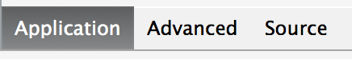
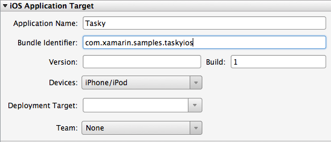
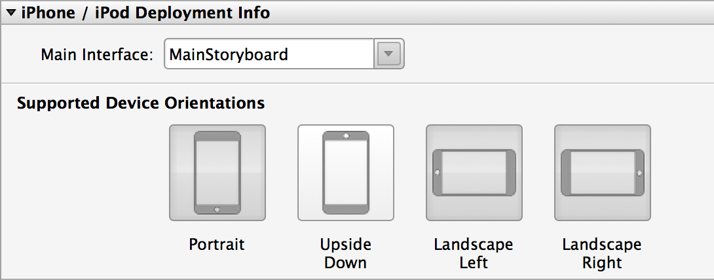
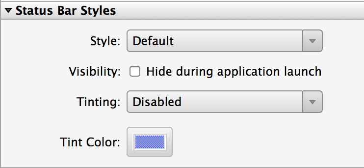
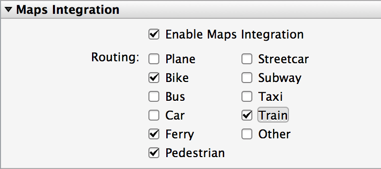
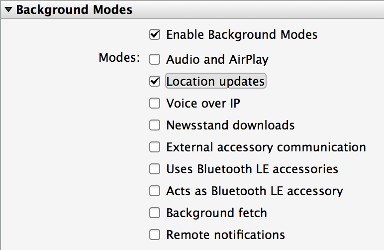
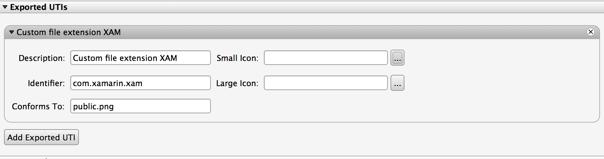
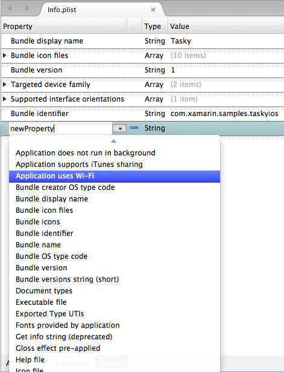
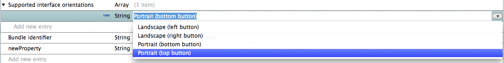
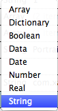

# Working With Property Lists in Xamarin.iOS

_This document introduces Visual Studio for Mac's graphical and advanced property list (.plist) editor for working with Info.plist and Entitlements.plist. It illustrates setting icons and launch images for iOS applications from inside Visual Studio for Mac._

Visual Studio for Mac features a graphical .plist editor that makes editing app properties and capabilities easier. Visual Studio for Mac has two .plists - `Info.plist` for editing app properties and icons, and `Entitlements.plist` for managing app capabilities. This guide introduces the Info.plists and provides an overview of working with them in Visual Studio for Mac. For information on Entitlements.plist, see the [Working with Entitlements](~/ios/deploy-test/provisioning/entitlements.md) guide.

## Info.plist

The Information Property List ( `Info.plist`) is a required iOS file that provides information about your application's configuration to the system. Visual Studio for Mac's custom `Info.plist` editor features three panels controlled by tabs at the bottom left of the editor window:

 

Each panel controls different properties, as outlined below:

- **Application Panel** - A graphical interface to set common application properties as well as icons and launch images; specify maps integration and backgrounding modes.
- **Advanced Panel** - The advanced panel is the place to specify supported document types, UTIs, and URL types.
- **Source Panel** - The source panel controls less common properties as well as custom properties for the application.

The next three sections investigate the features of each panel in more detail.

## Application Panel

Visual Studio for Mac features a graphical interface for editing common `Info.plist` entries for an application:

1. Application properties
1. Supported device types
1. Support orientations for each device type
1. Status bar style and color
1. Icons and start-up screens
1. Maps and Background Modes

These are described in more detail in the next sections.

 

### iOS Application Target

This section contains important information that describes your application.
The **Identifier** stored here must match the Bundle
Identifier that is entered in iTunes Connect (for App Store apps) and also in
the iOS Provisioning Portal App IDs list and Development and Distribution
certificates.

 

### Device Deployment

 

The device **Deployment** info sections are displayed
selectively, depending on the selection in the **Devices** dropdown in the **Application Target** section above. The **Main Interface** drop-down is set to **MainStoryboard** in Storyboard-driven applications. If the user
interface is entirely written in code then this can be left blank.

### Supported Device Orientations

 **Supported Device Orientations** controls how the app responds to device rotation. It is very common for iPhone/iPad apps to
support only **Portrait**, or everything but **Upside Down**. Generally all iPad applications except games should
support all orientations.

### Status Bar Styles

The **Status Bar Styles** section is a graphical interface for editing an application's `UIStatusBarStyle`:

 

 

### Icons, Launch Images, and iTunes Artwork

Information on using icons, images, and artwork in your Info.plist file can be found in the [Working with Images](~/ios/app-fundamentals/images-icons/index.md) guide.

### Maps Integration and Background Modes

The `Info.plist` contains special sections to specify maps integration and backgrounding modes. Choosing the options you want to support will add the required properties to your application for you.

 

For more information on working with maps, refer to the Xamarin [iOS Maps](~/ios/user-interface/controls/ios-maps/index.md) guide.

 

For more information on Background Modes, refer to the Xamarin [Backgrounding in iOS](~/ios/app-fundamentals/backgrounding/introduction-to-backgrounding-in-ios.md) guide.

## Advanced Panel

The advanced panel controls the document types and URL schemes that the application supports.

 

 

## Document Types

For applications that support opening specific types of files, iOS provides the `CFBundleDocumentTypes` key. If we want our application to support certain known file types - for example PDFs - we would add the PDF value to the key. This section provides a convenient way to enter the data that will be stored
in the `CFBundleDocumentTypes` key in the `Info.plist`
file.

Refer to the documentation on [Registering the File Types Your App Supports](https://developer.apple.com/library/ios/#documentation/FileManagement/Conceptual/DocumentInteraction_TopicsForIOS/Articles/RegisteringtheFileTypesYourAppSupports.html) for details on
how to configure these values.

## UTIs

Sometimes an application needs to support opening a custom file type. For example, we may want to open image files with a custom extension *.xam*. To specify a custom file type, we'll create a custom UTI - Universal Type Identifier - using the `UIExportedTypeDeclarations` key. The screenshot below illustrates how to create a custom UTI for the .xam extension:

 

Just as exported type UTIs specify custom UTIs specific to your app, the *imported type UTIs* ( `UIImportedTypeDeclarations` key) specify custom types supported but not owned by your application.

For more information on using custom UTIs, refer to Apple's [Registering File Types Your App Supports](https://developer.apple.com/library/ios/documentation/FileManagement/Conceptual/understanding_utis/understand_utis_declare/understand_utis_declare.html#//apple_ref/doc/uid/TP40001319-CH204-SW1) guide.

## Custom URLs

A URL scheme name (also called protocol) is the first part of the URL. For example, `http://` and `https://` are common URL schemes. You have the option of creating a custom URL scheme for your application. Custom URL schemes are used to communicate and send data back and forth with other applications. The following screenshot illustrates creating a new custom URL scheme called `monkeys://`:

 

For more information on implementing custom URL schemes, refer to Apple's [Implementing Custom URL Schemes section of this guide](https://developer.apple.com/library/ios/documentation/iPhone/Conceptual/iPhoneOSProgrammingGuide/AdvancedAppTricks/AdvancedAppTricks.html)

## Source Panel

The **Source** tab of the `Info.plist` file
allows custom values to be added or edited. Visual Studio for Mac provides a list of the
most common properties:

 

For known properties Visual Studio for Mac will a list of valid values, as illustrated by the following screenshot:

 

Visual Studio for Mac also detects the Property Type, as shown:

 

Review Apple’s [App Related Resources](https://developer.apple.com/library/ios/#DOCUMENTATION/iPhone/Conceptual/iPhoneOSProgrammingGuide/App-RelatedResources/App-RelatedResources.html) links for additional information on optional properties.

 

## Summary

This article demonstrated using the graphical and advanced .plist editors to edit common app configurations as well as to specify icons and launch images. It also introduced the `Entitlements.plist` for adding and managing app capabilities.

## Related Links

- [IDE](https://github.com/xamarin/recipes/tree/master/Recipes/cross-platform/ide)
- [App Related Resources](https://developer.apple.com/library/ios/#DOCUMENTATION/iPhone/Conceptual/iPhoneOSProgrammingGuide/App-RelatedResources/App-RelatedResources.html)
- [Registering the File Types Your App Supports](https://developer.apple.com/library/ios/#documentation/FileManagement/Conceptual/DocumentInteraction_TopicsForIOS/Articles/RegisteringtheFileTypesYourAppSupports.html)
- [Implementing Custom URL Schemes](https://developer.apple.com/library/ios/documentation/iPhone/Conceptual/iPhoneOSProgrammingGuide/AdvancedAppTricks/AdvancedAppTricks.html)
- [Asset Catalog Format Reference](https://developer.apple.com/library/archive/documentation/Xcode/Reference/xcode_ref-Asset_Catalog_Format/index.html#//apple_ref/doc/uid/TP40015170-CH18-SW1)
