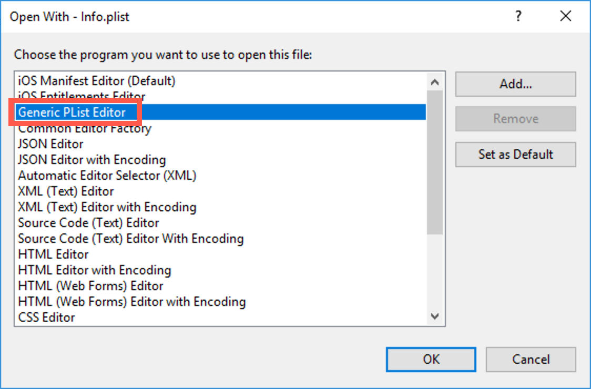
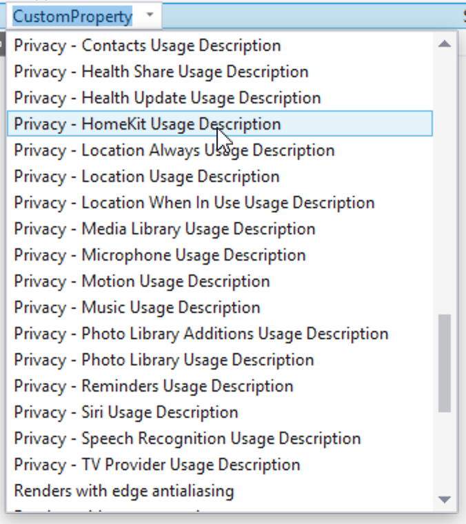
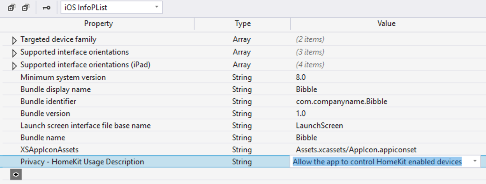
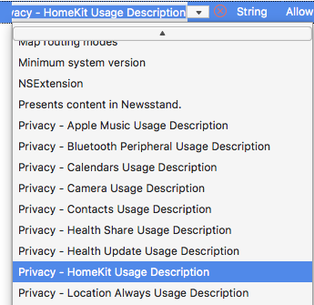
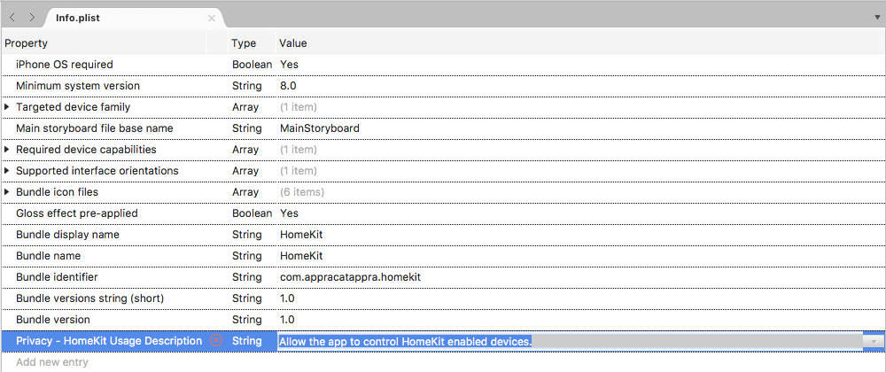

# iOS Security and Privacy Features

_This article covers working with security and privacy in iOS and how they affect a Xamarin.iOS app._

Apple has made several enhancements to both security and privacy in iOS 10 (and greater) that will help the developer improve the security of their apps and ensure the end user's privacy. This article will cover implementing these features in a Xamarin.iOS app.

## General Enhancements

The following general changes have been made to Security and Privacy in iOS 10:

- The Common Data Security Architecture (CDSA) API has been deprecated and should be replaced with the SecKey API to generate asymmetric keys.
- The new `NSAllowsArbitraryLoadsInWebContent` key can be added to the an app's **Info.plist** file and will allow web pages to load correctly while Apple Transport Security (ATS) protection is still enabled for the rest of the app. For more information, please see our [App Transport Security](~/ios/app-fundamentals/ats.md) documentation.
- Because the new Clipboard in iOS 10 and macOS Sierra allows the user to copy and paste between devices, the API has been expanded to allow a clipboard to be limited to a specific device and be timestamped to be cleared automatically at a given point. Additionally, named pasteboards are no longer persisted and should be replaced with the shared pasteboard containers.
- For all SSL/TLS connections, the RC4 symmetric cipher is now disabled by default. Additionally, the Secure Transport API no longer supports SSLv3 and it is recommended that the developer stop using SHA-1 and 3DES cryptography as soon as possible.

## Accessing Private User Data

Apps running on iOS 10 (or later) must statically declare their intent to access specific features or user information by entering one or more Privacy Keys in their **Info.plist** files that explain to the user why the app wishes to gain access.

> [!IMPORTANT]
> Apps that fail to provide the required keys will be silently terminated by the system when they attempt to access one of the restricted features or user information, _without error_! If an app starts unexpectedly failing on iOS 10, ensure that all of the required **Info.plist** have been specified.

The following Privacy related keys are available:

- **Privacy - Apple Music usage Description** (`NSAppleMusicUsageDescription`) - Allows the developer to describe why the app wants to access the user's media library.
- **Privacy - Bluetooth Peripheral Usage Description** (`NSBluetoothPeripheralUsageDescription`) - Allows the developer to describe why the app wants to access Bluetooth on the user's device.
- **Privacy - Calendars Usage Description** (`NSCalendarsUsageDescription`) - Allows the developer to describe why the app wants to access the user's calendar.
- **Privacy - Camera Usage Description** (`NSCameraUsageDescription`) - Allows the developer to describe why the app wants to access the device's camera.
- **Privacy - Contacts Usage Description** (`NSContactsUsageDescription`) - Allows the developer to describe why the app wants to access the user's contacts.
- **Privacy - Health Share Usage Description** (`NSHealthShareUsageDescription`) - Allows the developer to describe why the app wants to access the user's health data. For more information, please see Apple's [HKHealthStore Class Reference](https://developer.apple.com/reference/healthkit/hkhealthstore).
- **Privacy - Health Update Usage Description** (`NSHealthUpdateUsageDescription`) - Allows the developer to describe why the app wants to edit the user's health data. For more information, please see Apple's [HKHealthStore Class Reference](https://developer.apple.com/reference/healthkit/hkhealthstore).
- **Privacy - HomeKit Usage Description** (`NSHomeKitUsageDescription`) - Allows the developer to describe why the app wants to access the user's HomeKit Configuration Data.
- **Privacy - Location Always Usage Description** (`NSLocationAlwaysUsageDescription`) - Allows the developer to describe why the app wants to always have access to the user's location.
- [Deprecated] **Privacy - Location Usage Description** (`NSLocationUsageDescription`) - Allows the developer to describe why the app wants to access the user location. *NOTE: This key has been deprecated in iOS 8 (and greater). Use `NSLocationAlwaysUsageDescription` or `NSLocationWhenInUseUsageDescription` instead.*
- **Privacy - Location When In Use Usage Description** (`NSLocationWhenInUseUsageDescription`) - Allows the developer to describe why the app wants to access the user's location while it is running.
- [Deprecated] **Privacy - Media Library Usage Description** - Allows the developer to describe why the app wants to access to the user's media library. *NOTE: This key has been deprecated in iOS 8 (and greater). Use `NSAppleMusicUsageDescription` instead.*
- **Privacy - Microphone Usage Description** (`NSMicrophoneUsageDescription`) - Allows the developer to describe why the app wants to access the devices microphone.
- **Privacy - Motion Usage Description** (`NSMotionUsageDescription`) - Allows the developer to describe why the app wants to access the device's accelerometer.
- **Privacy - Photo Library Usage Description** (`NSPhotoLibraryUsageDescription`) - Allows the developer to describe why the app wants to access the user's photo library.
- **Privacy - Reminders Usage Description** (`NSRemindersUsageDescription`) - Allows the developer to describe why the app wants to access the user's reminders.
- **Privacy - Siri Usage Description** (`NSSiriUsageDescription`) - Allows the developer to describe why the app wants to send user data to Siri.
- **Privacy - Speech Recognition Usage Description** (`NSSpeechRecognitionUsageDescription`) - Allows the developer to describe why the app wants to send user data to Apple's speech recognition servers.
- **Privacy - TV Provider Usage Description** (`NSVideoSubscriberAccountUsageDescription`) - Allows the developer to describe why the app wants to access the user's TV provider account.

For more information on working with **Info.plist** keys, please see Apple's [Information Property List Key Reference](https://developer.apple.com/library/content/documentation/General/Reference/InfoPlistKeyReference/Introduction/Introduction.html#//apple_ref/doc/uid/TP40009248-SW1).

## Setting Privacy Keys

Take the following example of accessing HomeKit on iOS 10 (and greater), the developer will need to add the `NSHomeKitUsageDescription` key to the app's **Info.plist** file and provide a string declaring why the app wants to access the user's HomeKit database. This string will be presented to the user the first time they run the app:

# [Visual Studio](#tab/windows)

Xamarin.iOS for Visual Studio currently doesn't support editing the **Info.plist** privacy keys from within the default iOS manifest editor. Instead you will need to use the generic PList editor, so do the following:

1. Right-click on the **Info.plist** file in the **Solution Explorer** and select **Open with...**.
2. Select the **Generic PList Editor** from the list of programs to open the file, then click **OK**.

    
3. Click the **+** button on the last row in the editor to add a new entry to the list. This will be called "Custom Property", with the Type set to `String` and an empty value.
4. Click the property name, and a dropdown will appear.
5. From the dropdown list, select a Privacy key (such as **Privacy - HomeKit Usage Description**): 

    
6. Enter a description into the Value column for why the app wants to access the given feature or user information: 

    
7. Save the changes to the file.

# [Visual Studio for Mac](#tab/macos)

To set any of the Privacy keys, do the following:

1. Double-click the **Info.plist** file in the **Solution Explorer** to open it for editing.
2. At the bottom of the screen, switch to the **Source** view.
3. Add a new **Entry** to the list.
4. From the dropdown list, select a Privacy key (such as **Privacy - HomeKit Usage Description**): 

    
5. Enter a description for why the app wants to access the given feature or user information: 

    
6. Save the changes to the file.

-----

> [!IMPORTANT]
> In the example given above, failure to set the `NSHomeKitUsageDescription` key in the **Info.plist** file would result in the app _silently failing_ (being closed by the system at runtime) without error when run in iOS 10 (or greater).

## Summary

This article has covered the security and privacy changes that Apple has made in iOS 10 and how they affect a Xamarin.iOS app.

## Related Links

- [iOS 10 Samples](/samples/browse/?products=xamarin&term=Xamarin.iOS%2biOS10)