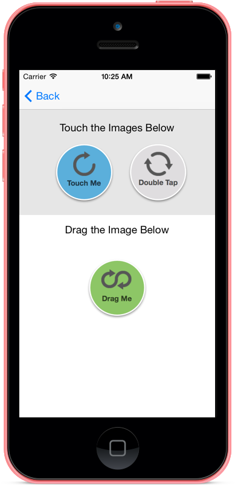
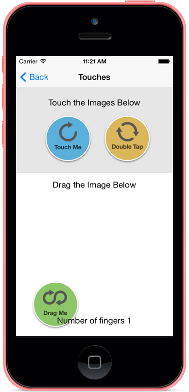
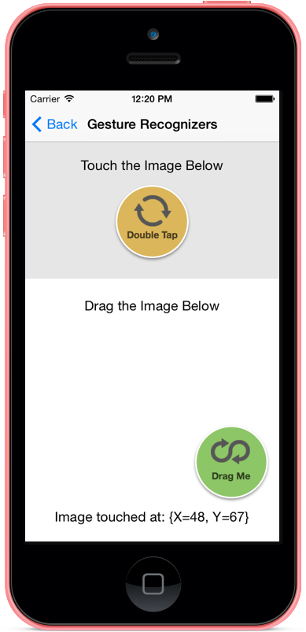
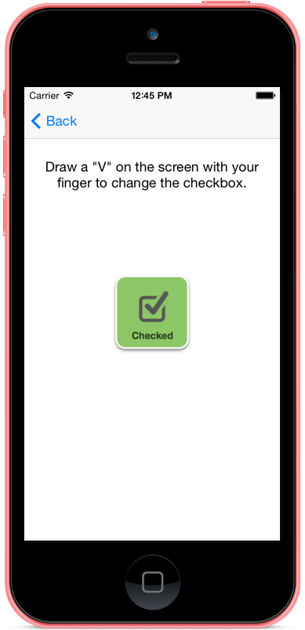

# Walkthrough: Using Touch in Xamarin.iOS

This walkthrough demonstrates how to write code that responds to
different kinds of touch events. Each example is contained in a separate
screen:

- [Touch samples](#Touch_Samples) – how to respond to touch events.
- [Gesture Recognizer samples](#Gesture_Recognizer_Samples) – how to use built-in gesture recognizers.
- [Custom Gesture Recognizer sample](#Custom_Gesture_Recognizer) – how to build a custom gesture recognizer.

Each section contains instructions to write the code from scratch.

Follow the instructions below to add code to the storyboard, and learn about
the different types of touch events available in iOS. Alternatively, open the
[finished sample](/samples/xamarin/ios-samples/applicationfundamentals-touch-final) to
see everything working.

<a name="Touch_Samples"></a>

## Touch Samples

In this sample, we will demonstrate some of the touch APIs. Follow these steps
to add the code required to implement touch events:

1. Open the project **Touch_Start**. First run the project to make sure everything is okay, and touch the **Touch Samples** button. You should see a screen similar to the following (although none of the buttons will work):

    [](ios-touch-walkthrough-images/image4.png#lightbox)

1. Edit the file **TouchViewController.cs** and add the following two
instance variables to the class `TouchViewController`:

    ```csharp
    #region Private Variables
    private bool imageHighlighted = false;
    private bool touchStartedInside;
    #endregion
    ```

1. Implement the `TouchesBegan` method, as shown in the code below:

    ```csharp
    public override void TouchesBegan(NSSet touches, UIEvent evt)
    {
        base.TouchesBegan(touches, evt);

        // If Multitouch is enabled, report the number of fingers down
        TouchStatus.Text = string.Format ("Number of fingers {0}", touches.Count);

        // Get the current touch
        UITouch touch = touches.AnyObject as UITouch;
        if (touch != null)
        {
            // Check to see if any of the images have been touched
            if (TouchImage.Frame.Contains(touch.LocationInView(TouchView)))
            {
                // Fist image touched
                TouchImage.Image = UIImage.FromBundle("TouchMe_Touched.png");
                TouchStatus.Text = "Touches Began";
            } else if (touch.TapCount == 2 && DoubleTouchImage.Frame.Contains(touch.LocationInView(TouchView)))
            {
                // Second image double-tapped, toggle bitmap
                if (imageHighlighted)
                {
                    DoubleTouchImage.Image = UIImage.FromBundle("DoubleTapMe.png");
                    TouchStatus.Text = "Double-Tapped Off";
                }
                else
                {
                    DoubleTouchImage.Image = UIImage.FromBundle("DoubleTapMe_Highlighted.png");
                    TouchStatus.Text = "Double-Tapped On";
                }
                imageHighlighted = !imageHighlighted;
            } else if (DragImage.Frame.Contains(touch.LocationInView(View)))
            {
                // Third image touched, prepare to drag
                touchStartedInside = true;
            }
        }
    }
    ```

    This method works by checking for a `UITouch` object, and if it exists perform some action based on where the touch occurred:

    - _Inside TouchImage_ – display the text `Touches Began` in a label and change the image.
    - _Inside DoubleTouchImage_ – change the image displayed if the gesture was a double-tap.
    - _Inside DragImage_ – set a flag indicating that the touch has started. The method `TouchesMoved` will use this flag to determine if `DragImage` should be moved around the screen or not, as we shall see in the next step.

    The above code only deals with individual touches, there is still no behavior if the user
    is moving their finger on the screen. To respond to movement, implement `TouchesMoved`
    as shown in the code below:

    ```csharp
    public override void TouchesMoved(NSSet touches, UIEvent evt)
    {
        base.TouchesMoved(touches, evt);
        // get the touch
        UITouch touch = touches.AnyObject as UITouch;
        if (touch != null)
        {
            //==== IMAGE TOUCH
            if (TouchImage.Frame.Contains(touch.LocationInView(TouchView)))
            {
                TouchStatus.Text = "Touches Moved";
            }

            //==== IMAGE DRAG
            // check to see if the touch started in the drag me image
            if (touchStartedInside)
            {
                // move the shape
                float offsetX = touch.PreviousLocationInView(View).X - touch.LocationInView(View).X;
                float offsetY = touch.PreviousLocationInView(View).Y - touch.LocationInView(View).Y;
                DragImage.Frame = new RectangleF(new PointF(DragImage.Frame.X - offsetX, DragImage.Frame.Y - offsetY), DragImage.Frame.Size);
            }
        }
    }
    ```

    This method gets a `UITouch` object, and then checks to see where the touch occurred. If the touch occurred in `TouchImage`, then the text Touches Moved is displayed on the screen.

    If `touchStartedInside` is true, then we know that the user has their finger on `DragImage` and is moving it around. The code will move `DragImage` as the user moves their finger around the screen.

1. We need to handle the case when the user lifts his or her finger off the screen, or iOS cancels the touch event. For this, we will implement `TouchesEnded` and `TouchesCancelled` as shown below:

    ```csharp
    public override void TouchesCancelled(NSSet touches, UIEvent evt)
    {
        base.TouchesCancelled(touches, evt);

        // reset our tracking flags
        touchStartedInside = false;
        TouchImage.Image = UIImage.FromBundle("TouchMe.png");
        TouchStatus.Text = "";
    }

    public override void TouchesEnded(NSSet touches, UIEvent evt)
    {
        base.TouchesEnded(touches, evt);
        // get the touch
        UITouch touch = touches.AnyObject as UITouch;
        if (touch != null)
        {
            //==== IMAGE TOUCH
            if (TouchImage.Frame.Contains(touch.LocationInView(TouchView)))
            {
                TouchImage.Image = UIImage.FromBundle("TouchMe.png");
                TouchStatus.Text = "Touches Ended";
            }
        }
        // reset our tracking flags
        touchStartedInside = false;
    }
    ```

    Both of these methods will reset the `touchStartedInside` flag to false. `TouchesEnded` will also display `TouchesEnded` on the screen.

1. At this point the Touch Samples screen is finished. Notice how the screen changes as you interact with each of the images, as shown in the following screenshot:

    [](ios-touch-walkthrough-images/image4.png#lightbox)

    [](ios-touch-walkthrough-images/image5.png#lightbox)

<a name="Gesture_Recognizer_Samples"></a>

## Gesture Recognizer Samples

The [previous section](#Touch_Samples) demonstrated how to drag an object around the screen by using touch events.
In this section we will get rid of the touch events and show how to use the following gesture recognizers:

- The `UIPanGestureRecognizer` for dragging an image around the screen.
- The `UITapGestureRecognizer` to respond to double taps on the screen.

Follow these steps to implement gesture recognizers:

1. Edit the file **GestureViewController.cs** and add the following instance variable:

    ```csharp
    #region Private Variables
    private bool imageHighlighted = false;
    private RectangleF originalImageFrame = RectangleF.Empty;
    #endregion
    ```

    We need this instance variable to keep track of the previous location of the image.
The pan gesture recognizer will use the `originalImageFrame` value to
calculate the offset required to redraw the image on the screen.

1. Add the following method to the controller:

    ```csharp
    private void WireUpDragGestureRecognizer()
    {
        // Create a new tap gesture
        UIPanGestureRecognizer gesture = new UIPanGestureRecognizer();

        // Wire up the event handler (have to use a selector)
        gesture.AddTarget(() => HandleDrag(gesture));  // to be defined

        // Add the gesture recognizer to the view
        DragImage.AddGestureRecognizer(gesture);
    }
    ```

    This code instantiates a `UIPanGestureRecognizer` instance, and adds it to a view.
Notice that we assign a target to the gesture in the form of the method `HandleDrag` –
this method is provided in the next step.

1. To implement HandleDrag, add the following code to the controller:

    ```csharp
    private void HandleDrag(UIPanGestureRecognizer recognizer)
    {
        // If it's just began, cache the location of the image
        if (recognizer.State == UIGestureRecognizerState.Began)
        {
            originalImageFrame = DragImage.Frame;
        }

        // Move the image if the gesture is valid
        if (recognizer.State != (UIGestureRecognizerState.Cancelled | UIGestureRecognizerState.Failed
            | UIGestureRecognizerState.Possible))
        {
            // Move the image by adding the offset to the object's frame
            PointF offset = recognizer.TranslationInView(DragImage);
            RectangleF newFrame = originalImageFrame;
            newFrame.Offset(offset.X, offset.Y);
            DragImage.Frame = newFrame;
        }
    }
    ```

    The code above will first check the state of the gesture recognizer and then
move the image around the screen. With this code in place, the controller can
now support dragging the one image around the screen.

1. Add a `UITapGestureRecognizer` that will change the image being displayed in DoubleTouchImage. Add the following method to the `GestureViewController` controller:

    ```csharp
    private void WireUpTapGestureRecognizer()
    {
        // Create a new tap gesture
        UITapGestureRecognizer tapGesture = null;

        // Report touch
        Action action = () => {
            TouchStatus.Text = string.Format("Image touched at: {0}",tapGesture.LocationOfTouch(0, DoubleTouchImage));

            // Toggle the image
            if (imageHighlighted)
            {
                DoubleTouchImage.Image = UIImage.FromBundle("DoubleTapMe.png");
            }
            else
            {
                DoubleTouchImage.Image = UIImage.FromBundle("DoubleTapMe_Highlighted.png");
            }
            imageHighlighted = !imageHighlighted;
        };

        tapGesture = new UITapGestureRecognizer(action);

        // Configure it
        tapGesture.NumberOfTapsRequired = 2;

        // Add the gesture recognizer to the view
        DoubleTouchImage.AddGestureRecognizer(tapGesture);
    }
    ```

    This code is very similar to the code for the `UIPanGestureRecognizer`
but instead of using a delegate for a target we are using an `Action`.

1. The final thing we need to do is modify `ViewDidLoad` so that it calls the methods we just added. Change ViewDidLoad so it resembles the following code:

    ```csharp
    public override void ViewDidLoad()
    {
        base.ViewDidLoad();

        Title = "Gesture Recognizers";

        // Save initial state
        originalImageFrame = DragImage.Frame;

        WireUpTapGestureRecognizer();
        WireUpDragGestureRecognizer();
    }
    ```

    Notice as well that we initialize the value of `originalImageFrame`.

1. Run the application, and interact with the two images.
The following screenshot is one example of these interactions:

    [](ios-touch-walkthrough-images/image7.png#lightbox)

<a name="Custom_Gesture_Recognizer"></a>

## Custom Gesture Recognizer

In this section we will apply the concepts from previous sections to build a
custom gesture recognizer. The custom gesture recognizer will
subclasses `UIGestureRecognizer`, and will recognize when the user draws a “V” on the screen
then toggle a bitmap. The following screenshot is an example of this screen:

 [](ios-touch-walkthrough-images/image8.png#lightbox)

Follow these steps to create a custom gesture recognizer:

1. Add a new class to the project named `CheckmarkGestureRecognizer`, and make it look like the following code:

    ```csharp
    using System;
    using CoreGraphics;
    using Foundation;
    using UIKit;

    namespace Touch
    {
        public class CheckmarkGestureRecognizer : UIGestureRecognizer
        {
            #region Private Variables
            private CGPoint midpoint = CGPoint.Empty;
            private bool strokeUp = false;
            #endregion

            #region Override Methods
            /// <summary>
            ///   Called when the touches end or the recognizer state fails
            /// </summary>
            public override void Reset()
            {
                base.Reset();

                strokeUp = false;
                midpoint = CGPoint.Empty;
            }

            /// <summary>
            ///   Is called when the fingers touch the screen.
            /// </summary>
            public override void TouchesBegan(NSSet touches, UIEvent evt)
            {
                base.TouchesBegan(touches, evt);

                // we want one and only one finger
                if (touches.Count != 1)
                {
                    base.State = UIGestureRecognizerState.Failed;
                }

                Console.WriteLine(base.State.ToString());
            }

            /// <summary>
            ///   Called when the touches are cancelled due to a phone call, etc.
            /// </summary>
            public override void TouchesCancelled(NSSet touches, UIEvent evt)
            {
                base.TouchesCancelled(touches, evt);
                // we fail the recognizer so that there isn't unexpected behavior
                // if the application comes back into view
                base.State = UIGestureRecognizerState.Failed;
            }

            /// <summary>
            ///   Called when the fingers lift off the screen
            /// </summary>
            public override void TouchesEnded(NSSet touches, UIEvent evt)
            {
                base.TouchesEnded(touches, evt);
                //
                if (base.State == UIGestureRecognizerState.Possible && strokeUp)
                {
                    base.State = UIGestureRecognizerState.Recognized;
                }

                Console.WriteLine(base.State.ToString());
            }

            /// <summary>
            ///   Called when the fingers move
            /// </summary>
            public override void TouchesMoved(NSSet touches, UIEvent evt)
            {
                base.TouchesMoved(touches, evt);

                // if we haven't already failed
                if (base.State != UIGestureRecognizerState.Failed)
                {
                    // get the current and previous touch point
                    CGPoint newPoint = (touches.AnyObject as UITouch).LocationInView(View);
                    CGPoint previousPoint = (touches.AnyObject as UITouch).PreviousLocationInView(View);

                    // if we're not already on the upstroke
                    if (!strokeUp)
                    {
                        // if we're moving down, just continue to set the midpoint at
                        // whatever point we're at. when we start to stroke up, it'll stick
                        // as the last point before we upticked
                        if (newPoint.X >= previousPoint.X && newPoint.Y >= previousPoint.Y)
                        {
                            midpoint = newPoint;
                        }
                        // if we're stroking up (moving right x and up y [y axis is flipped])
                        else if (newPoint.X >= previousPoint.X && newPoint.Y <= previousPoint.Y)
                        {
                            strokeUp = true;
                        }
                        // otherwise, we fail the recognizer
                        else
                        {
                            base.State = UIGestureRecognizerState.Failed;
                        }
                    }
                }

                Console.WriteLine(base.State.ToString());
            }
            #endregion
        }
    }
    ```

    The Reset method is called when the `State` property changes to either `Recognized`
or `Ended`. This is the time to reset any internal state set in the custom gesture recognizer.
Now the class can start fresh next time the user interacts with the application, and be ready to re-attempt recognizing the gesture.

1. Now that we’ve defined a custom gesture recognizer (`CheckmarkGestureRecognizer`) edit
the **CustomGestureViewController.cs** file and add the following two instance variables:

    ```csharp
    #region Private Variables
    private bool isChecked = false;
    private CheckmarkGestureRecognizer checkmarkGesture;
    #endregion
    ```

1. To instantiate and configure our gesture recognizer, add the following method to the controller:

    ```csharp
    private void WireUpCheckmarkGestureRecognizer()
    {
        // Create the recognizer
        checkmarkGesture = new CheckmarkGestureRecognizer();

        // Wire up the event handler
        checkmarkGesture.AddTarget(() => {
            if (checkmarkGesture.State == (UIGestureRecognizerState.Recognized | UIGestureRecognizerState.Ended))
            {
                if (isChecked)
                {
                    CheckboxImage.Image = UIImage.FromBundle("CheckBox_Unchecked.png");
                }
                else
                {
                    CheckboxImage.Image = UIImage.FromBundle("CheckBox_Checked.png");
                }
                isChecked = !isChecked;
            }
        });

        // Add the gesture recognizer to the view
        View.AddGestureRecognizer(checkmarkGesture);
    }
    ```

1. Edit `ViewDidLoad` so that it calls `WireUpCheckmarkGestureRecognizer`, as shown in the following code snippet:

    ```csharp
    public override void ViewDidLoad()
    {
        base.ViewDidLoad();

        // Wire up the gesture recognizer
        WireUpCheckmarkGestureRecognizer();
    }
    ```

1. Run the application, and try drawing a “V” on the screen. You should see the image being displayed change, as shown in the following screenshots:

    [](ios-touch-walkthrough-images/image9.png#lightbox)

    [](ios-touch-walkthrough-images/image10.png#lightbox)

The above three sections demonstrated different ways to respond to touch events in iOS: using
touch events, built-in gesture recognizers, or with a custom gesture recognizer.

## Related Links

- [iOS Touch Final (sample)](/samples/xamarin/ios-samples/applicationfundamentals-touch-final)