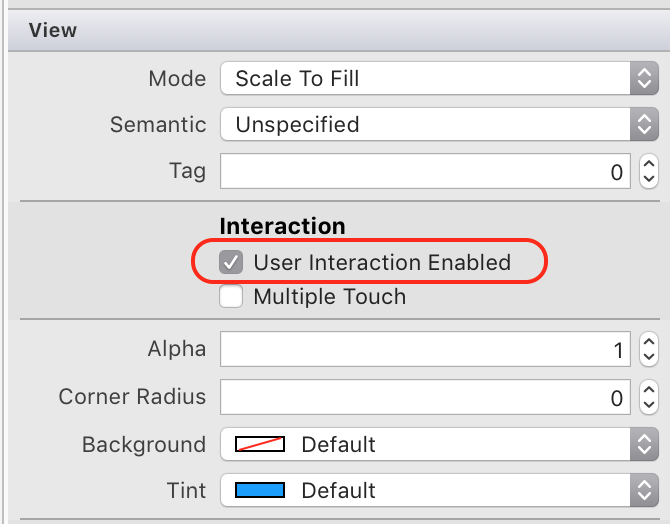

# Touch Events and Gestures in Xamarin.iOS

It is important to understand the touch events and touch APIs in an iOS application, as they are central to all physical interactions with the device. All touch interactions involve a `UITouch` object. In this article we will learn how to use the `UITouch` class and its APIs to support touch. Later, we will expand on our knowledge to learn how to support gestures.

## Enabling Touch

Controls in `UIKit` – those subclassed from UIControl – are so dependent on user interaction that they have gestures built in to UIKit and therefore it is not necessary to enable Touch. It is already enabled.

However, many of the views in `UIKit` do not have touch enabled by default. There are two ways to enable touch on a control. The first way is to check the User Interaction Enabled checkbox in the Property Pad of the iOS Designer, as shown in the following screenshot:

 [](touch-in-ios-images/image1.png#lightbox)

We can also use a controller to set the `UserInteractionEnabled` property to true on a `UIView` class. This is required if the UI is created in code.

The following line of code is an example:

```csharp
imgTouchMe.UserInteractionEnabled = true;
```

## Touch Events

There are three phases of touch that occur when the user touches the screen, moves their finger, or removes their finger. These methods are defined in `UIResponder`, which is the base class for UIView. iOS will override the associated methods on the `UIView` and the `UIViewController` to handle touch:

- `TouchesBegan` – This is called when the screen is first touched.
- `TouchesMoved` – This is called when the location of the touch changes as the user is sliding their fingers around the screen.
- `TouchesEnded` or  `TouchesCancelled` –  `TouchesEnded` is called when the user’s fingers are lifted off the screen.  `TouchesCancelled` gets called if iOS cancels the touch – for example, if a user slides his or her finger away from a button to cancel a press.

Touch events travel recursively down through the stack of UIViews, to check if the touch event is within the bounds of a view object. This is often called _Hit-testing_. They will first be called on the topmost `UIView` or `UIViewController` and then will be called on the `UIView` and `UIViewControllers` below them in the view hierarchy.

A `UITouch` object will be created each time the user touches the screen. The `UITouch` object includes data about the touch, such as when the touch occurred, where it occurred, if the touch was a swipe, etc. The touch events get passed a touches property – an `NSSet` containing one or more touches. We can use this property to obtain a reference to a touch, and determine the application’s response.

Classes that override one of the touch events should first call the base implementation and then get the `UITouch` object associated with the event. To obtain a reference to the first touch, call the `AnyObject` property and cast it as a `UITouch` as show in the following example:

```csharp
public override void TouchesBegan (NSSet touches, UIEvent evt)
{
    base.TouchesBegan (touches, evt);
    UITouch touch = touches.AnyObject as UITouch;
    if (touch != null)
    {
        //code here to handle touch
    }
}
```

iOS automatically recognizes successive quick touches on the screen and will collect them all as one tap in a single `UITouch` object. This makes checking for a double tap as easy as checking the `TapCount` property, as illustrated in the following code:

```csharp
public override void TouchesBegan (NSSet touches, UIEvent evt)
{
    base.TouchesBegan (touches, evt);
    UITouch touch = touches.AnyObject as UITouch;
    if (touch != null)
    {
        if (touch.TapCount == 2)
        {
            // do something with the double touch.
        }
    }
}
```

## Multi-Touch

Multi-touch is not enabled by default on controls. Multi-touch can be enabled in the iOS Designer, as illustrated by the following screenshot:

 [](touch-in-ios-images/image2.png#lightbox)

It is also possible to set multi-touch programmatically by setting the `MultipleTouchEnabled` property as shown in the following line of code:

```csharp
imgTouchMe.MultipleTouchEnabled = true;
```

To determine how many fingers touched the screen, use the `Count` property on the `UITouch` property:

```csharp
public override void TouchesBegan (NSSet touches, UIEvent evt)
{
    base.TouchesBegan (touches, evt);
    lblNumberOfFingers.Text = "Number of fingers: " + touches.Count.ToString();
}
```

## Determining Touch Location

The method `UITouch.LocationInView` returns a CGPoint object that holds the coordinates of the touch within a given view. Additionally, we can test to see if that location is within a control by calling the method `Frame.Contains`. The following code snippet shows an example of this:

```csharp
if (this.imgTouchMe.Frame.Contains (touch.LocationInView (this.View)))
{
    // the touch event happened inside the UIView imgTouchMe.
}
```

Now that we have an understanding of the touch events in iOS, let’s learn about gesture recognizers.

## Gesture Recognizers

Gesture recognizers can greatly simplify and reduce the programming effort to support touch in an application. iOS gesture recognizers aggregate a series of touch events into a single touch event.

Xamarin.iOS provides the class `UIGestureRecognizer` as a base class for the following built-in gesture recognizers:

- *UITapGestureRecognizer* – This is for one or more taps.
- *UIPinchGestureRecognizer* – Pinching and spreading apart fingers.
- *UIPanGestureRecognizer* – Panning or dragging.
- *UISwipeGestureRecognizer* – Swiping in any direction.
- *UIRotationGestureRecognizer* – Rotating two fingers in a clockwise or counter-clockwise motion.
- *UILongPressGestureRecognizer* – Press and hold, sometimes referred to as a long-press or long-click.

The basic pattern to using a gesture recognizer is as follows:

1. **Instantiate the gesture recognizer** – First, instantiate a  `UIGestureRecognizer` subclass. The object that is instantiated will be associated by a view and will be garbage collected when the view is disposed of. It is not necessary to create this view as a class level variable.
1. **Configure any gesture settings** – The next step is to configure the gesture recognizer. Consult Xamarin’s documentation on  `UIGestureRecognizer` and its subclasses for a list of properties that can be set to control the behavior of a  `UIGestureRecognizer` instance.
1. **Configure the target** – Because of its Objective-C heritage, Xamarin.iOS doesn’t raise events when a gesture recognizer matches a gesture.  `UIGestureRecognizer` has a method – `AddTarget` – that can accept an anonymous delegate or an Objective-C selector with the code to execute when the gesture recognizer makes a match.
1. **Enable gesture recognizer** – Just like with touch events, gestures are only recognized if touch interactions are enabled.
1. **Add the gesture recognizer to the view** – The final step is to add the gesture to a view by calling  `View.AddGestureRecognizer` , and passing it a gesture recognizer object.

Refer to the [gesture recognizer samples](~/ios/app-fundamentals/touch/ios-touch-walkthrough.md#Gesture_Recognizer_Samples) for more information on how to implement them in code.

When the gesture’s target is called, it will be passed a reference to the gesture that occurred. This allows the gesture target to obtain information about the gesture that occurred. The extent of information available depends on the type of gesture recognizer that was used. Please see Xamarin’s documentation for information about the data available for each `UIGestureRecognizer` subclass.

It’s important to remember that once a gesture recognizer has been added to a view, the view (and any views below it) will not receive any touch events. To allow touch events simultaneously with gestures, the `CancelsTouchesInView` property must be set to false, as illustrated by the following code:

```csharp
_tapGesture.Recognizer.CancelsTouchesInView = false;
```

Each `UIGestureRecognizer` has a State property that provides important information about the status of the gesture recognizer. Every time the value of this property changes, iOS will call the subscribing method giving it an update. If a custom gesture recognizer never updates the State property, the subscriber is never called, rendering the gesture recognizer useless.

Gestures can be summarized as one of two types:

1. *Discrete* – These gestures only fire the first time they are recognized.
1. *Continuous* – These gestures continue to fire as long as they are recognized.

Gesture recognizers exists in one of the following states:

- *Possible* – This is the initial state of all gesture recognizers. This is the default value the State property.
- *Began* – When a continuous gesture is first recognized, the state is set to Began. This allows subscribes to differentiate between when gesture recognition starts and when it is changed.
- *Changed* – After a continuous gesture has begun, but hasn’t finished, the state will be set to Changed every time a touch moves or changes, as long as it’s still within the expected parameters of the gesture.
- *Cancelled* – This state will be set if the recognizer went from Began to Changed, and then the touches changed in such a way as to no longer fit the pattern of the gesture.
- *Recognized* – The state will be set when the gesture recognizer matches a set of touches and will inform the subscriber that the gesture has finished.
- *Ended* – This is an alias for the Recognized state.
- *Failed* – When the gesture recognizer can no longer match the touches it is listening for, the state will changed to Failed.

Xamarin.iOS represents these values in the `UIGestureRecognizerState` enumeration.

## Working with Multiple Gestures

By default, iOS does not allow default gestures to run simultaneously. Instead, each gesture recognizer will receive touch events in a non-deterministic order. The following code snippet illustrated how to make a gesture recognizer run simultaneously:

```csharp
gesture.ShouldRecognizeSimultaneously += (UIGestureRecognizer r) => { return true; };
```

It is also possible to disable a gesture in iOS. There are two delegate properties that allow a gesture recognizer to examine the state of an application and the current touch events, to make decisions on how and if a gesture should be recognized. The two events are:

1. *ShouldReceiveTouch* – This delegate is called right before the gesture recognizer is passed a touch event, and provides an opportunity to examine the touches and decide which touches will be handled by the gesture recognizer.
1. *ShouldBegin* – This is called when a recognizer attempts to change state from Possible to some other state. Returning false will force the state of the gesture recognizer to be changed to Failed.

You can override these methods with a strongly typed `UIGestureRecognizerDelegate`, a weak delegate, or bind via the event handler syntax, as illustrated by the following code snippet:

```csharp
gesture.ShouldReceiveTouch += (UIGestureRecognizer r, UITouch t) => { return true; };
```

Finally, it is possible to queue up a gesture recognizer so that it will only succeed if another gesture recognizer fails. For example, a single tap gesture recognizer should only succeed when a double tap gesture recognizer fails. The following code snippet provides an example of this:

```csharp
singleTapGesture.RequireGestureRecognizerToFail(doubleTapGesture);
```

## Creating a Custom Gesture

Although iOS provides some default gesture recognizers, it may be necessary to create custom gesture recognizers in certain cases. Creating a custom gesture recognizer involves the following steps:

1. Subclass  `UIGestureRecognizer` .
1. Override the appropriate touch event methods.
1. Bubble up recognition status via the base class’ State property.

A practical example of this will be covered in the [Using Touch in iOS](ios-touch-walkthrough.md) walkthrough.
