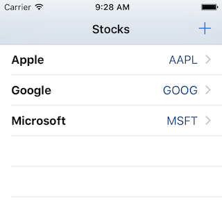
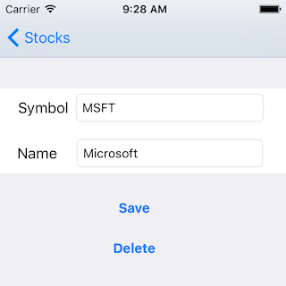
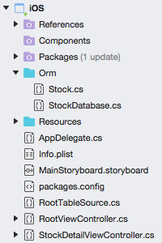

# Using Data in an iOS app

The **DataAccess_Adv** sample shows a working application that allows user input and *CRUD* (Create, Read, Update and Delete) database functionality. The application consists of two screens: a list and a data entry form. All the data access code is re-usable in iOS and Android without modification.

After adding some data the application screens look like this on iOS:

 

 

The iOS Project is shown below – the code shown in this section is contained within the **Orm** directory:

 

The native UI code for the ViewControllers in iOS  is out of scope for this document.
Refer to the [iOS Working with Tables and Cells](~/ios/user-interface/controls/tables/index.md)
guide for more information on the UI controls.

## Read

There are a couple of read operations in the sample:

- Reading the list
- Reading individual records

The two methods in the `StockDatabase` class are:

```csharp
public IEnumerable<Stock> GetStocks ()
{
    lock (locker) {
        return (from i in Table<Stock> () select i).ToList ();
    }
}
public Stock GetStock (int id)
{
    lock (locker) {
        return Table<Stock>().FirstOrDefault(x => x.Id == id);
    }
}
```

iOS renders the data differently as a `UITableView`.

## Create and Update

To simplify the application code, a single save method is provided that does an
Insert or Update depending on whether the PrimaryKey has been set. Because the `Id`
property is marked with a `[PrimaryKey]` attribute you should not set it in your code.
This method will detect whether the value has been previous saved (by checking
the primary key property) and either insert or update the object accordingly:

```csharp
public int SaveStock (Stock item)
{
    lock (locker) {
        if (item.Id != 0) {
            Update (item);
            return item.Id;
    } else {
            return Insert (item);
        }
    }
}
```

Real world applications will usually require some validation
(such as required fields, minimum lengths or other business rules).
Good cross-platform applications implement as much of the validation
logical as possible in shared code, passing validation errors back up to the UI
for display according to the platform’s capabilities.

## Delete

Unlike the `Insert` and `Update` methods, the `Delete<T>` method can accept just the primary key value rather than a complete `Stock` object.
In this example a `Stock` object is passed into the method but only the Id property is passed on to the `Delete<T>` method.

```csharp
public int DeleteStock(Stock stock)
{
    lock (locker) {
        return Delete<Stock> (stock.Id);
    }
}
```

## Using a pre-populated SQLite database file

Some applications are shipped with a database already populated with data.
You can easily accomplish this in your mobile application by shipping an existing
SQLite database file with your app and copying it to a writable directory before
accessing it. Because SQLite is a standard file format that is used on many platforms,
there are a number of tools available to create an SQLite database file:

- **SQLite Manager Firefox Extension** – Works on Mac and Windows and produces files that are compatible with iOS and Android.
- **Command Line** – See  [www.sqlite.org/sqlite.html](https://www.sqlite.org/sqlite.html) .

When creating a database file for distribution with your app, take care with the
naming of tables and columns to ensure they match what your code expects, especially
if you’re using SQLite.NET which will expect the names to match your C# classes
and properties (or the associated custom attributes).

For iOS, include the sqlite file in your application and ensure it is marked with
**Build Action: Content**. Place the code in the
`FinishedLaunching` to copy the file to a writable directory *before* you call
any data methods. The following code will copy an existing database called **data.sqlite**,
only if it doesn’t already exist.

```csharp
// Copy the database across (if it doesn't exist)
var appdir = NSBundle.MainBundle.ResourcePath;
var seedFile = Path.Combine (appdir, "data.sqlite");
if (!File.Exists (Database.DatabaseFilePath))
{
  File.Copy (seedFile, Database.DatabaseFilePath);
}
```

Any data access code (whether ADO.NET or using SQLite.NET) that executes after this has completed will have access to the pre-populated data.

## Related Links

- [DataAccess Basic (sample)](https://github.com/xamarin/mobile-samples/tree/master/DataAccess/Basic)
- [DataAccess Advanced (sample)](https://github.com/xamarin/mobile-samples/tree/master/DataAccess/Advanced)
- [iOS Data Recipes](https://github.com/xamarin/recipes/tree/master/Recipes/ios/data/sqlite)
- [Xamarin.Forms data access](~/xamarin-forms/data-cloud/data/databases.md)
