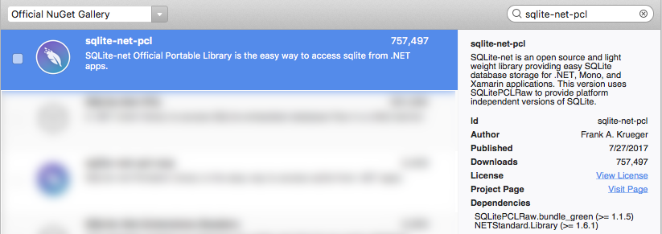
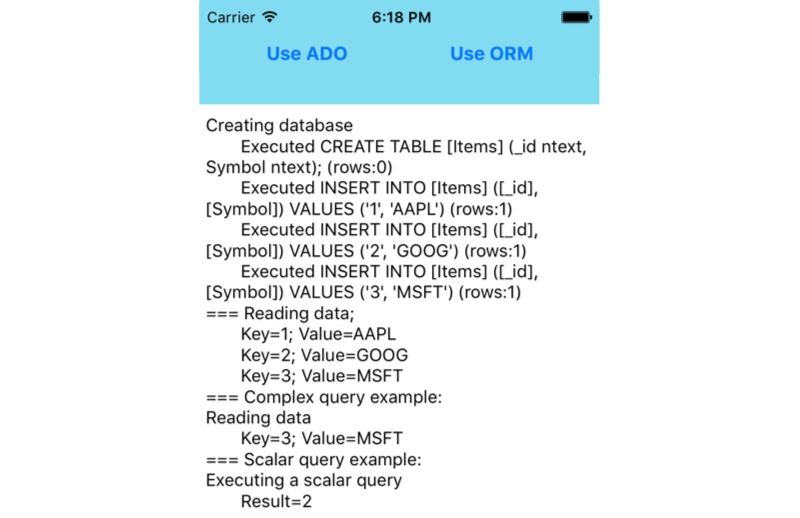

# Using SQLite.NET with Xamarin.iOS

The SQLite.NET library that Xamarin recommends is a basic ORM that lets you  store and retrieve objects in the local SQLite database on an iOS device.
ORM stands for Object Relational Mapping – an API that lets you save and retrieve “objects” from a database without writing SQL statements.

<a name="Usage"></a>

## Usage

To include the SQLite.NET library in a Xamarin app, add the following NuGet package to your project:

- **Package Name:** sqlite-net-pcl
- **Author:** Frank A. Krueger
- **Id:** sqlite-net-pcl
- **Url:** [nuget.org/packages/sqlite-net-pcl](https://www.nuget.org/packages/sqlite-net-pcl/)

[](using-sqlite-orm-images/image1a.png#lightbox)

> [!TIP]
> There are a number of different SQLite packages available – be sure to choose the correct one (it might not be the top result in search).

Once you have the SQLite.NET library available, follow these three steps to use it to access a database:

1. **Add a using statement** - Add the following statement to the C# files where data access is required:

    ```csharp
    using SQLite;
    ```

1. **Create a Blank Database** - A database reference can be created by passing the file path the SQLiteConnection class constructor. You do not need to check if the file already exists – it will automatically be created if required, otherwise the existing database file will be opened.

    ```csharp
    var db = new SQLiteConnection (dbPath);
    ```

    The dbPath variable should be determined according the rules discussed earlier in this document.

1. **Save Data** - Once you have created a SQLiteConnection object, database commands are executed by calling its methods, such as CreateTable and Insert like this:

    ```csharp
    db.CreateTable<Stock> ();
    db.Insert (newStock); // after creating the newStock object
    ```

1. **Retrieve Data** - To retrieve an object (or a list of objects) use the following syntax:

    ```csharp
    var stock = db.Get<Stock>(5); // primary key id of 5
    var stockList = db.Table<Stock>();
    ```

## Basic Data Access Sample

The *DataAccess_Basic* sample code for this document looks like this when running on iOS. The code illustrates how to perform simple SQLite.NET operations and shows the results in as text in the application’s main window.

**iOS**

 [](using-sqlite-orm-images/image2-sml.png#lightbox)

The following code sample shows an entire database interaction using the SQLite.NET library to encapsulate the underlying database access. It shows:

1. Creating the database file
1. Inserting some data by creating objects and then saving them
1. Querying the data

You’ll need to include these namespaces:

```csharp
using SQLite; // from the github SQLite.cs class
```

This requires that you have added SQLite to your project, as highlighted [here](#Usage). Note that the SQLite database table is defined by adding attributes to a class (the `Stock` class) rather than a CREATE TABLE command.

```csharp
[Table("Items")]
public class Stock {
    [PrimaryKey, AutoIncrement, Column("_id")]
    public int Id { get; set; }
    [MaxLength(8)]
    public string Symbol { get; set; }
}
public static void DoSomeDataAccess () {
       Console.WriteLine ("Creating database, if it doesn't already exist");
   string dbPath = Path.Combine (
        Environment.GetFolderPath (Environment.SpecialFolder.Personal),
        "ormdemo.db3");
   var db = new SQLiteConnection (dbPath);
   db.CreateTable<Stock> ();
   if (db.Table<Stock> ().Count() == 0) {
        // only insert the data if it doesn't already exist
        var newStock = new Stock ();
        newStock.Symbol = "AAPL";
        db.Insert (newStock);
        newStock = new Stock ();
        newStock.Symbol = "GOOG";
        db.Insert (newStock);
        newStock = new Stock ();
        newStock.Symbol = "MSFT";
        db.Insert (newStock);
    }
    Console.WriteLine("Reading data");
    var table = db.Table<Stock> ();
    foreach (var s in table) {
        Console.WriteLine (s.Id + " " + s.Symbol);
    }
}
```

Using the `[Table]` attribute without specifying a table name parameter will cause the underlying database table to have the same name as the class (in this case, “Stock”). The actual table name is important if you write SQL queries directly against the database rather than use the ORM data access methods. Similarly the `[Column("_id")]` attribute is optional, and if absent a column will be added to the table with the same name as the property in the class.

## SQLite Attributes

Common attributes that you can apply to your classes to control how they are stored in the underlying database include:

- **[PrimaryKey]** – This attribute can be applied to an integer property to force it to be the underlying table’s primary key. Composite primary keys are not supported.
- **[AutoIncrement]** – This attribute will cause an integer property’s value to be auto-increment for each new object inserted into the database
- **[Column(name)]** &ndash; The `name` parameter
    sets the underlying database column's name.
- **[Table(name)]** – Marks the class as being able to be stored in an underlying SQLite table with the name specified.
- **[MaxLength(value)]** – Restrict the length of a text property, when a database insert is attempted. Consuming code should validate this prior to inserting the object as this attribute is only ‘checked’ when a database insert or update operation is attempted.
- **[Ignore]** – Causes SQLite.NET to ignore this property. This is particularly useful for properties that have a type that cannot be stored in the database, or properties that model collections that cannot be resolved automatically be SQLite.
- **[Unique]** – Ensures that the values in the underlying database column are unique.

Most of these attributes are optional. You should always specify an integer primary key so that selection and deletion queries can be performed efficiently on your data.

## More Complex Queries

The following methods on `SQLiteConnection` can be used to perform other data operations:

- **Insert** – Adds a new object to the database.
- **Get\<T>** – Attempts to retrieve an object using the primary key.
- **Table\<T>** – Returns all the objects in the table.
- **Delete** – Deletes an object using its primary key.
- **Query\<T>** - Perform an SQL query that returns a number of rows (as objects).
- **Execute** – Use this method (and not  `Query` ) when you don’t expect rows back from the SQL (such as INSERT, UPDATE and DELETE instructions).

### Getting an object by the primary key

SQLite.Net provides the Get method to retrieve a single object based on its primary key.

```csharp
var existingItem = db.Get<Stock>(3);
```

### Selecting an object using Linq

Methods that return collections support IEnumerable\<T> so you can use Linq to query or sort the contents of a table. 
The following code shows an example using Linq to filter out all entries that begin with the letter “A”:

```csharp
var apple = from s in db.Table<Stock>()
    where s.Symbol.StartsWith ("A")
    select s;
Console.WriteLine ("-> " + apple.FirstOrDefault ().Symbol);
```

### Selecting an object using SQL

Even though SQLite.Net can provide object-based access to your data, sometimes you might need to do a more complex query than Linq allows (or you may need faster performance). You can use SQL commands with the Query method, as shown here:

```csharp
var stocksStartingWithA = db.Query<Stock>("SELECT * FROM Items WHERE Symbol = ?", "A");
foreach (var s in stocksStartingWithA) {
    Console.WriteLine ("a " + s.Symbol);
}
```

> [!IMPORTANT]
> When writing SQL statements directly you create a dependency on the names of tables and columns in your database, which have been generated from your classes and their attributes. If you change those names in your code you must remember to update any manually written SQL statements.

### Deleting an object

The primary key is used to delete the row, as shown here:

```csharp
var rowcount = db.Delete<Stock>(someStock.Id); // Id is the primary key
```

You can check the `rowcount` to confirm how many rows were affected (deleted in this case).

## Using SQLite.NET with Multiple Threads

SQLite supports three different threading modes: *Single-thread*,
*Multi-thread*, and *Serialized*. If you want to access the database
from multiple threads without any restrictions, you can configure
SQLite to use the **Serialized** threading mode. It's important to set
this mode early in your application (for example, at the beginning of
the `OnCreate` method).

To change the threading mode, call `SqliteConnection.SetConfig` which is in the `Mono.Data.Sqlite` namespace. For example, this line of code configures SQLite for **Serialized** mode:

```csharp
using Mono.Data.Sqlite;
...
SqliteConnection.SetConfig(SQLiteConfig.Serialized);
```

## Related Links

- [DataAccess Basic (sample)](https://github.com/xamarin/mobile-samples/tree/master/DataAccess/Basic)
- [DataAccess Advanced (sample)](https://github.com/xamarin/mobile-samples/tree/master/DataAccess/Advanced)
- [Xamarin.Forms data access](~/xamarin-forms/data-cloud/data/databases.md)
