# CloudKit in Xamarin.iOS

The CloudKit framework streamlines the development of applications that access iCloud. This includes the retrieval of
application data and asset rights as well as being able to securely store application information. This kit gives users a layer
of anonymity by allowing access to applications with their iCloud IDs without sharing personal information.

Developers can focus on their client-side applications and let iCloud eliminate the need to write server-side application logic. CloudKit provides authentication, private and public databases, and structured data and asset storage services.

> [!IMPORTANT]
> Apple [provides tools](https://developer.apple.com/support/allowing-users-to-manage-data/)
> to help developers properly handle the European Union's General Data
> Protection Regulation (GDPR).

## Requirements

The following is required to complete the steps presented in this article:

- **Xcode and the iOS SDK** – Apple's Xcode and iOS 8 APIs need to be installed and configured on the developer's computer.
- **Visual Studio for Mac** – The latest version of Visual Studio for Mac should be installed and configured on the user device.
- **iOS 8 Device** – An iOS device running the latest version of iOS 8 for testing.

## What is CloudKit?

CloudKit is a way to give the developer access to the iCloud Servers. It provides the foundation for both iCloud Drive and
iCloud Photo Library. CloudKit is supported on both macOS and iOS devices.

[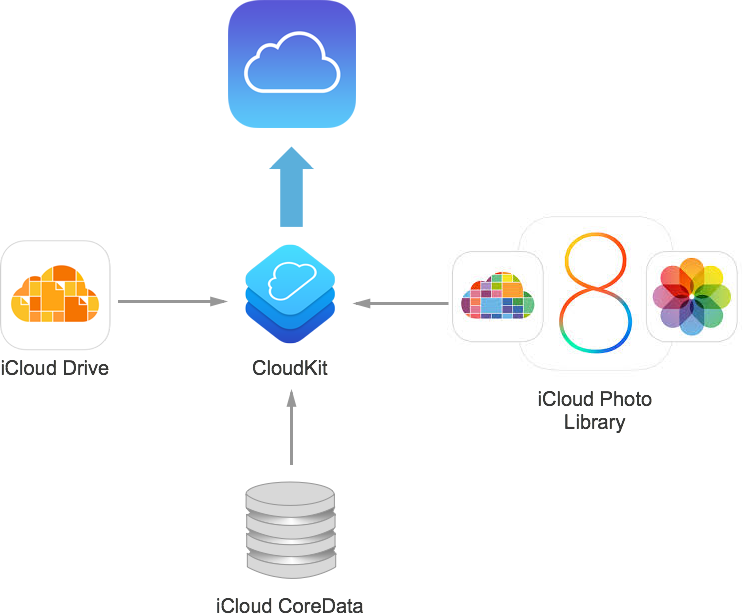](intro-to-cloudkit-images/image1.png#lightbox)

CloudKit uses the iCloud Account infrastructure. If there is a user logged into an iCloud Account on the device, CloudKit
will use their ID to identify the user. If no account is available, then limited read-only access will be provided.

CloudKit supports both the concept of public and private databases. Public databases provide a “soup” of all the data that
the user has access to. Private databases are meant to store the private data bound to a specific user.

CloudKit supports both structured and bulk data. It is capable of handling large file transfers seamlessly. CloudKit takes
care of efficiently transferring large files to and from the iCloud Servers in the background, freeing the developer to
focus on other tasks.

> [!NOTE]
> It is important to note that CloudKit is a _Transport Technology_. It doesn't provide any persistence; it only enables an application to send and receive information from the servers efficiently.

As of this writing, Apple is initially providing CloudKit for free with a high limit on both bandwidth and storage capacity. For larger projects or applications with a large user base, Apple has hinted that an affordable pricing scale will be provided.

## Enabling CloudKit in a Xamarin application

Before a Xamarin application can utilize the CloudKit framework, the application must be correctly provisioned as detailed in the [Working with Capabilities](~/ios/deploy-test/provisioning/capabilities/icloud-capabilities.md) and [Working with Entitlements](~/ios/deploy-test/provisioning/entitlements.md) guides.

To access CloudKit the **Entitlements.plist** file must include **Enable iCloud**, **Key-value storage**, and **CloudKit** permissions.

### Sample app

The [CloudKitAtlas sample](/samples/xamarin/ios-samples/ios8-cloudkitatlas) demonstrates
how to use CloudKit with Xamarin. The steps below show how to configure the sample – it requires additional settings beyond what's require for CloudKit alone:

1. Open the project in Visual Studio for Mac or Visual Studio.
2. In the **Solution Explorer**, open the **Info.plist** file and ensure the **Bundle Identifier** matches the one that was defined in **App ID** created as part of the provisioning set up.
3. Scroll down to the bottom of the **Info.plist** file and select **Enabled Background Modes**, **Location Updates**, and **Remote Notifications**.
4. Right-click the iOS project in the solution and select **Options**.
5. Select **iOS Bundle Signing**, select the **Developer Identity** and **Provisioning Profile** created above.
6. Ensure the **Entitlements.plist** includes **Enable iCloud**, **Key-value storage**, and **CloudKit**.
7. Ensure the **Ubiquity Container** exists for the application. Example: `iCloud.com.your-company.CloudKitAtlas`
8. Save the changes to the file.

With these settings in place, the sample app is now ready to access the CloudKit Framework APIs as well as background, location, and notification services.

## CloudKit API overview

Before implementing CloudKit in a Xamarin iOS application, this article is going to cover the fundamentals of the CloudKit Framework, which will include the following topics:

1. **Containers** – Isolated silos of iCloud communications.
2. **Databases** – Public and private are available to the application.
3. **Records** – The mechanism in which structured data is moved to and from CloudKit.
4. **Record Zones** – Are groups of Records.
5. **Record Identifiers** – Are fully normalized and represent the specific location of the record.
6. **Reference** – Provide parent-child relationships between related Records within a given Database.
7. **Assets** – Allow for file of large, unstructured data to be uploaded to iCloud and associated with a given Record.

### Containers

A given application running on an iOS device is always running along side other applications and services on that device. On the client device, the application is going to be siloed or sandboxed in some way. In some cases, this is a literal sandbox, and in others, the application is simply running in it's own memory space.

The concept of taking a client application and running it separated from other clients is very powerful and provides the following advantages:

1. **Security** – One application cannot interfere with other client apps or the OS itself.
1. **Stability** – If the client application crashes it cannot take out other apps of the OS.
1. **Privacy** – Each client application has limited access to the personal information stored within the device.

CloudKit was designed to provide the same advantages as the above listed, and apply them to working with cloud-based information:

 [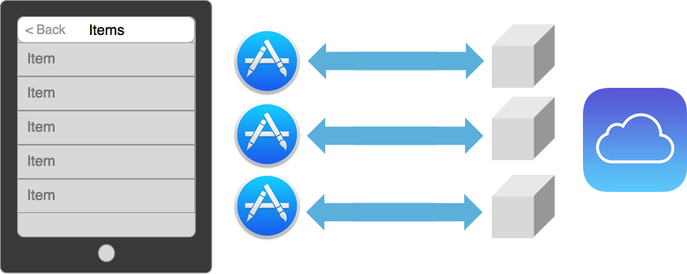](intro-to-cloudkit-images/image31.png#lightbox)

Just like the application being one-of-many running on the device, so is the application's communications with iCloud one-of-many. Each of these different communication silos are called Containers.

Containers are exposed in the CloudKit Framework via the `CKContainer` class. By default, one application talks to one container and this container segregates the data for that application. This means that several applications can be storing information to the same iCloud account, yet this information will never be intermingled.

The containerization of iCloud data also allows CloudKit to encapsulate user information. In this way, the application will have some limited access to the iCloud account and the user information stored within, all while still protecting the privacy and security of the user.

Containers are fully managed by the developer of the application via the WWDR portal. The namespace of the container is global across all Apple developers, so the container must not only be unique to a given developer's applications, but to all Apple developers and applications.

Apple suggests using reverse DNS notation when creating the namespace for application containers. Example: `iCloud.com.company-name.application-name`

While Containers are, by default, bound one-to-one to a given application, they can be shared across applications. So multiple applications can coordinate on a single Container. A single application can also talk to multiple Containers.

### Databases

One of the primary functions of CloudKit is to take an application's data model and replication that model up to the iCloud servers. Some information is intended for the user that created it, other information is public data that could be created by a user for public use (like a restaurant review), or it could be information that the developer has published for the application. In either case, the audience is not just a single user, but is a community of people.

 [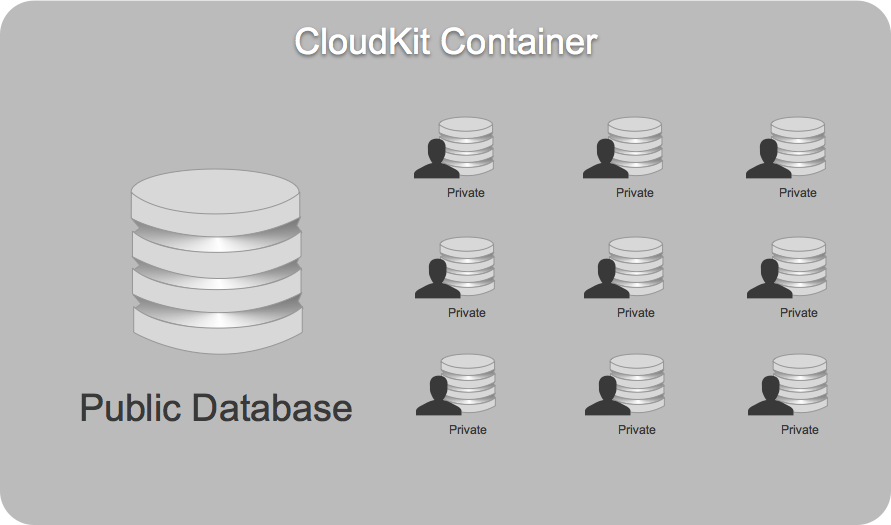](intro-to-cloudkit-images/image32.png#lightbox)

Inside of a Container, first and foremost is the public database. This is where all of the public information lives and co-mingles. Additionally, there are several individual private databases for each user of the application.

When running on an iOS device, the application will only have access to the information for the currently logged-on iCloud user. So the application's view of the container will be as follows:

 [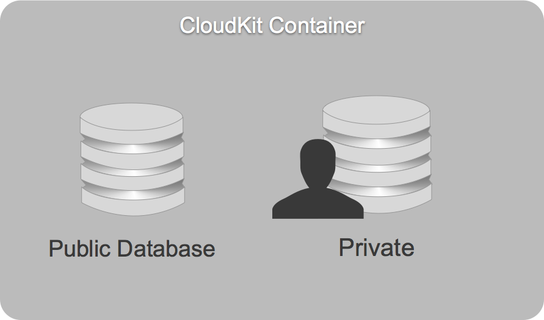](intro-to-cloudkit-images/image33.png#lightbox)

It can only see the public database and the private database associated with the currently logged-on iCloud user.

Databases are exposed in the CloudKit Framework via the `CKDatabase` class. Every application has access to two databases: the public database and the private one.

The Container is the initial entry point into CloudKit. The following code can be used to access the public and private database from the application's default Container:

```csharp
using CloudKit;
//...

public CKDatabase PublicDatabase { get; set; }
public CKDatabase PrivateDatabase { get; set; }
//...

// Get the default public and private databases for
// the application
PublicDatabase = CKContainer.DefaultContainer.PublicCloudDatabase;
PrivateDatabase = CKContainer.DefaultContainer.PrivateCloudDatabase;
```

Here are the differences between the database types:

||Public Database|Private Database|
|---|--- |--- |
|**Data Type**|Shared Data|Current User's Data|
|**Quota**|Accounted for in the Developer's Quota|Accounted for in the User's Quota|
|**Default Permissions**|World Readable|User Readable|
|**Editing Permissions**|iCloud Dashboard Roles via a record-class level|N/A|

### Records

Containers hold databases, and inside databases are records. Records are the mechanism in which structured data is moved to and from CloudKit:

 [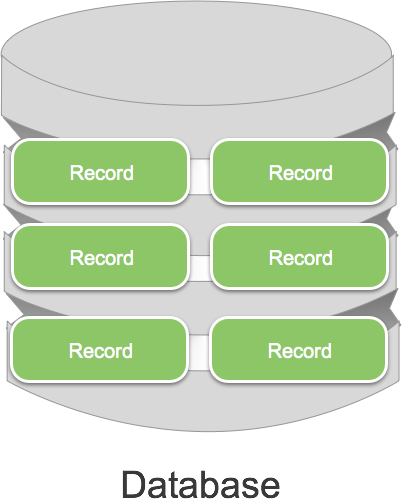](intro-to-cloudkit-images/image34.png#lightbox)

Records are exposed in the CloudKit Framework via the `CKRecord` class, which wraps key-value pairs. An instance of an object in an application is equivalent to a `CKRecord` in CloudKit. In addition, each `CKRecord` possesses a record type, which is equivalent to the class of an object.

Records have a just-in-time schema, so the data is described to CloudKit before being handed off for processing. From that point, CloudKit will interpret the information and handle the logistics of storing and retrieving the record.

The `CKRecord` class also supports a wide range of metadata. For example, a record contains information about when it was created and the user that created it. A record also contains information about when it was last modified and the user that modified it.

Records contain the notion of a Change Tag. This is a previous version of a revision of a given record. The Change Tag is used as a light-weight way of determining if the client and the server have the same version of a given record.

As stated above, `CKRecords` wrap key-value pairs and as such, the following types of data can be stored in a record:

1. `NSString`
1. `NSNumber`
1. `NSData`
1. `NSDate`
1. `CLLocation`
1. `CKReferences`
1. `CKAssets`

In addition to the single value types, a record can contain a homogenous array of any of the above listed types.

The following code can be used to create a new record and store it in a database:

```csharp
using CloudKit;
//...

private const string ReferenceItemRecordName = "ReferenceItems";
//...

var newRecord = new CKRecord (ReferenceItemRecordName);
newRecord ["name"] = (NSString)nameTextField.Text;
await CloudManager.SaveAsync (newRecord);
```

### Record zones

Records don't exist by themselves within a given database – groups of records exist together inside a Record Zone. Record Zones can be thought of as Tables in a traditional relational databases:

 [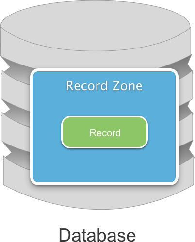](intro-to-cloudkit-images/image35.png#lightbox)

There can be multiple records within a given Record Zone and multiple Record Zones within a given database. Every database contains a Default Record Zone:

 [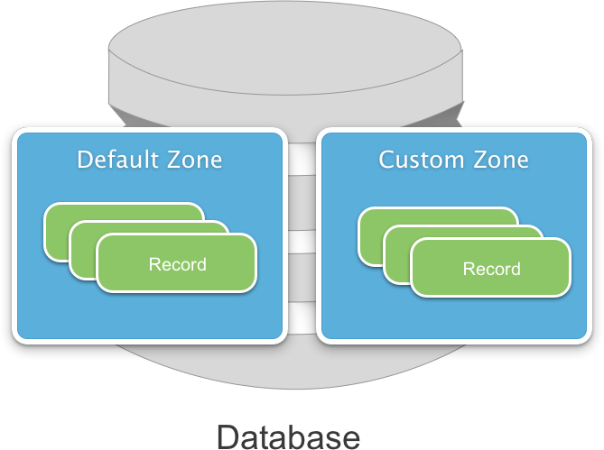](intro-to-cloudkit-images/image36.png#lightbox)

This is where records are stored by default. In addition, Custom Record Zones can be created. Record Zones represent the base granularity at which Atomic Commits and Change Tracking is done.

## Record identifiers

Record Identifiers are represented as a tuple, containing both a client provided Record Name and the zone in which the record exists. Record Identifiers have the following characteristics:

- They are created by the client application.
- They are fully normalized and represent the specific location of the record.
- By assigning the Unique ID of a record in a foreign database to the record name, they can be used to bridge local databases that are not stored within CloudKit.

When developers create new records, they can choose to pass in a Record Identifier. If a Record Identifier is not specified, a UUID will automatically be created and assigned to the record.

When developers create new Record Identifiers, they can choose to specify the Record Zone that each record will belong to. If none is specified, the Default Record Zone will be used.

Record Identifiers are exposed in the CloudKit Framework via the `CKRecordID` class. The following code can be used to create a new Record Identifier:

```csharp
var recordID =  new CKRecordID("My Record");
```

### References

References provide relationships between related Records within a given Database:

 [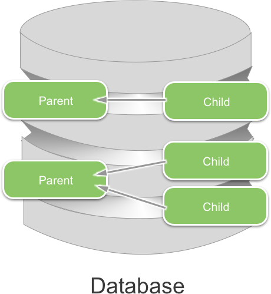](intro-to-cloudkit-images/image37.png#lightbox)

In the above example, Parents own Children so that the Child is a child record of the parent record. The Relationship goes from the child record to the parent record and is referred to as a *Back Reference*.

References are exposed in the CloudKit Framework via the `CKReference` class. They are a way of letting the iCloud server understand the relationship between records.

References provide the mechanism behind Cascading Deletes. If a parent record is deleted from the database, any child records (as specified in a Relationship) will automatically be deleted from the database as well.

> [!NOTE]
> Dangling Pointers are a possibility when using CloudKit. For example, by the time the application has fetched a list of record pointers, selected a record and then asked for the record, the record might no longer exist in the database. An application must be coded to handle this situation gracefully.

While not required, Back References are preferred when working with the CloudKit Framework. Apple has fine-tuned the system to make this the most efficient type of reference.

When creating a Reference, the developer can either provide a record that is already in memory or create a reference to a Record Identifier. If using a Record Identifier, and the specified reference didn't exist in the database, a Dangling Pointer would be created.

The following is an example of creating a reference against a known Record:

```csharp
var reference = new CKReference(newRecord, new CKReferenceAction());
```

### Assets

Assets allow for a file of large, unstructured data to be uploaded to iCloud and associated with a given Record:

 [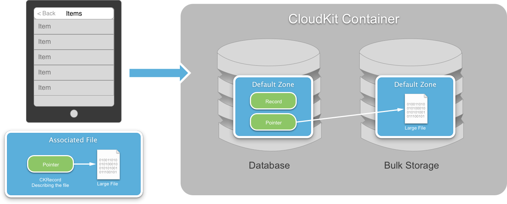](intro-to-cloudkit-images/image38.png#lightbox)

On the client, a `CKRecord` is created that describes the file that is going to be uploaded onto the iCloud server. A `CKAsset` is created to contain the file and is linked to the record describing it.

When the file is uploaded to the server, the record is placed in the database and the file is copied into a special Bulk Storage database. A link is created between the record Pointer and the uploaded file.

Assets are exposed in the CloudKit Framework via the `CKAsset` class and are used to store large, unstructured data. Because the developer never wants to have large, unstructured data in memory, Assets are implemented using files on disk.

Assets are owned by records, which allows the assets to be retrieved from iCloud using the record as a pointer. In this way the server can Garbage Collect Assets when the record that owns the Asset is deleted.

Because `CKAssets` are intended handle large data files, Apple designed CloudKit to efficiently upload and download the Assets.

The following code can be used to create an Asset and associate it with the Record:

```csharp
var fileUrl = new NSUrl("LargeFile.mov");
var asset = new CKAsset(fileUrl);
newRecord ["name"] = asset;
```

We have now covered all of the fundamental objects within CloudKit. Containers are associated to applications and contain Databases. Databases contain Records that are grouped into Record Zones and pointed to by Record Identifiers. Parent-child relationships are defined between Records using References. Finally, large files can be uploaded and associated to Records using Assets.

## CloudKit Convenience API

Apple offers two different API sets for working with CloudKit:

- **Operational API** – Offers every single feature of CloudKit. For more complex applications, this API provides fine-grained control over CloudKit.
- **Convenience API** – Offers a common, pre-configured subset of CloudKit features. It provides a convenient, easy access solution for including CloudKit functionality in an iOS application.

The Convenience API is usually the best choice for most iOS applications and Apple suggests starting with it. The rest of this section will cover the following Convenience API topics:

- Saving a Record.
- Fetching a Record.
- Updating a Record.

### Common setup code

Before getting started with the CloudKit Convenience API, there is some standard setup code required. Start by modifying the application's `AppDelegate.cs` file and make it look like the following:

```csharp
using System;
using System.Collections.Generic;
using System.Linq;
using Foundation;
using UIKit;
using CloudKit;

namespace CloudKitAtlas
{
    [Register ("AppDelegate")]
    public partial class AppDelegate : UIApplicationDelegate
    {
        public override UIWindow Window { get; set;}
        public CKDatabase PublicDatabase { get; set; }
        public CKDatabase PrivateDatabase { get; set; }

        public override bool FinishedLaunching (UIApplication application, NSDictionary launchOptions)
        {
            application.RegisterForRemoteNotifications ();

            // Get the default public and private databases for
            // the application
            PublicDatabase = CKContainer.DefaultContainer.PublicCloudDatabase;
            PrivateDatabase = CKContainer.DefaultContainer.PrivateCloudDatabase;

            return true;
        }

        public override void RegisteredForRemoteNotifications (UIApplication application, NSData deviceToken)
        {
            Console.WriteLine ("Registered for Push notifications with token: {0}", deviceToken);
        }

        public override void FailedToRegisterForRemoteNotifications (UIApplication application, NSError error)
        {
            Console.WriteLine ("Push subscription failed");
        }

        public override void ReceivedRemoteNotification (UIApplication application, NSDictionary userInfo)
        {
            Console.WriteLine ("Push received");
        }
    }
}
```

The above code exposes the public and private CloudKit databases as shortcuts to make them easier to work with in the rest of the application.

Next, add the following code to any view or view container that will be using CloudKit:

```csharp
using CloudKit;
//...

public AppDelegate ThisApp {
    get { return (AppDelegate)UIApplication.SharedApplication.Delegate; }
}
```

This adds a shortcut to get to the `AppDelegate` and access the public and private database shortcuts created above.

With this code in place, let's take a look at implementing the CloudKit Convenience API in a Xamarin iOS 8 application.

### Saving a record

Using the pattern presented above when discussing Records, the following code will create a new record and use the Convenience API to save it to the public database:

```csharp
private const string ReferenceItemRecordName = "ReferenceItems";
...

// Create a new record
var newRecord = new CKRecord (ReferenceItemRecordName);
newRecord ["name"] = (NSString)nameTextField.Text;

// Save it to the database
ThisApp.PublicDatabase.SaveRecord(newRecord, (record, err) => {
    // Was there an error?
    if (err != null) {
        ...
    }
});
```

Three things to note about the above code:

1. By calling the  `SaveRecord` method of the  `PublicDatabase`, the developer doesn't have to specify how the data is sent, what Zone it's being written to, etc. The Convenience API is taking care of all of those details itself.
1. The call is asynchronous and provides a callback routine when the call completes, either with success or failure. If the call fails, an error message will be provided.
1. CloudKit does not provide local storage/persistence; it is a transfer medium only. So when a request is made to save a Record, it is immediately sent to the iCloud servers.

> [!NOTE]
> Because of the “lossy” nature of mobile network communications, where connections are constantly being dropped or interrupted, one of the first considerations the developer must make when working with CloudKit is error handling.

### Fetching a record

With a Record created and successfully stored on the iCloud server, use the following code to retrieve the record:

```csharp
// Create a record ID and fetch the record from the database
var recordID = new CKRecordID("MyRecordName");
ThisApp.PublicDatabase.FetchRecord(recordID, (record, err) => {
    // Was there an error?
    if (err != null) {
        ...
    }
});
```

Just as in saving the Record, the above code is asynchronous, simple and requires great error handling.

### Updating a record

After a Record has been fetched from the iCloud servers, the following code can be used to modify the Record and save the changes back to the database:

```csharp
// Create a record ID and fetch the record from the database
var recordID = new CKRecordID("MyRecordName");
ThisApp.PublicDatabase.FetchRecord(recordID, (record, err) => {
    // Was there an error?
    if (err != null) {

    } else {
        // Modify the record
        record["name"] = (NSString)"New Name";

        // Save changes to database
        ThisApp.PublicDatabase.SaveRecord(record, (r, e) => {
            // Was there an error?
            if (e != null) {
                 ...
            }
        });
    }
});
```

The `FetchRecord` method of the `PublicDatabase` returns a `CKRecord` if the call was successful. The application then modifies the Record and calls `SaveRecord` again to write the changes back to the database.

This section has shown the typical cycle that an application will use when working with the CloudKit Convenience API. The application will save Records to iCloud, retrieve those records from iCloud, modify the Records and save those changes back to iCloud.

## Designing for scalability

So far this article has looked at storing and retrieving an application's entire object model from the iCloud servers, every time it is going to be worked with. While this approach works well with a small amount of data and a very small user base, it does not scale well when the amount of information and/or user base increases.

### Big data, tiny device

The more popular an application becomes, the more data in the database and the less feasible it is to have a cache of that entire data on the device. The following techniques can be used to solve this issue:

- **Keep the large data in the Cloud** – CloudKit was designed to handle large data efficiently.
- **Client should only view a slice of that data** – Bring down the bare minimum of data needed to handle any task at a given time.
- **Client views can change** – Because each user has different preferences, the slice of data being displayed can change from user to user and the user's individual view of any given slice can be different.
- **Client uses queries to focus the viewpoint** – Queries allow the user to view a small subset of a larger dataset that exists within the Cloud.

### Queries

As stated above, queries allow the developer to select a small subset of the larger dataset that exists in the Cloud. Queries are exposed in the CloudKit Framework via the `CKQuery` class.

A query combines three different things: a Record Type ( `RecordType`), a Predicate ( `NSPredicate`) and, optionally, a Sort Descriptor ( `NSSortDescriptors`). CloudKit supports most of `NSPredicate`.

#### Supported predicates

CloudKit supports the following types of `NSPredicates` when working with Queries:

1. Matching Records where the name is equal to a value stored in a variable:

    ```csharp
    NSPredicate.FromFormat(string.Format("name = '{0}'", recordName))
    ```

2. Allows matching to be based on a dynamic key value, so that the key doesn't have to be know at compile time:

    ```csharp
    NSPredicate.FromFormat(string.Format("{0} = '{1}'", key, value))
    ```

3. Matching Records where the Record's value is greater than the given value:

    ```csharp
    NSPredicate.FromFormat(string.Format("start > {0}", (NSDate)date))
    ```

4. Matching Records where Record's location is within 100 meters of the given location:

    ```csharp
    var location = new CLLocation(37.783,-122.404);
    var predicate = NSPredicate.FromFormat(string.Format("distanceToLocation:fromLocation(Location,{0}) < 100", location));
    ```

5. CloudKit supports a tokenized search. This call will create two tokens, one for `after` and another for `session`. It will return a Record that contains those two tokens:

    ```csharp
    NSPredicate.FromFormat(string.Format("ALL tokenize({0}, 'Cdl') IN allTokens", "after session"))
    ```

6. CloudKit supports compound predicates joined using the `AND` operator.

    ```csharp
    NSPredicate.FromFormat(string.Format("start > {0} AND name = '{1}'", (NSDate)date, recordName))
    ```

#### Creating queries

The following code can be used to create a `CKQuery` in a Xamarin iOS 8 application:

```csharp
var recordName = "MyRec";
var predicate = NSPredicate.FromFormat(string.Format("name = '{0}'", recordName));
var query = new CKQuery("CloudRecords", predicate);
```

First, it creates a Predicate to select only records that match a given name. Then it creates a query that will select Records of the given Record Type that match the Predicate.

#### Performing a query

Once a Query has been created, use the following code to perform the query and process the returned records:

```csharp
var recordName = "MyRec";
var predicate = NSPredicate.FromFormat(string.Format("name = {0}", recordName));
var query = new CKQuery("CloudRecords", predicate);

ThisApp.PublicDatabase.PerformQuery(query, CKRecordZone.DefaultRecordZone().ZoneId, (NSArray results, NSError err) => {
    // Was there an error?
    if (err != null) {
       ...
    } else {
        // Process the returned records
        for(nint i = 0; i < results.Count; ++i) {
            var record = (CKRecord)results[i];
        }
    }
});
```

The above code takes the query created above and executes it against the Public Database. Since no Record Zone is specified, all zones are searched. If no errors occurred, an array of `CKRecords` will be returned matching the parameters of the query.

The way to think about Queries is that they are polls, and are great at slicing through large datasets. Queries, however, are not well suited for large, mostly static datasets because of the following reasons:

- They are bad for the device battery life.
- They are bad for network traffic.
- They are bad for user experience because the information they see is limited by how often the application is polling the database. Users today expect push notifications when something changes.

### Subscriptions

When dealing with large, mostly static datasets, the query should not be performed on the client device, it should run on the server on the client's behalf. The query should run in the background and should be executed after every single record save, whether by the current device or another device touching the same database.

Finally, a push notification should be sent to every device attached to the database when the server-side query is run.

Subscriptions are exposed in the CloudKit Framework via the `CKSubscription` class. They combine a Record Type ( `RecordType`), a Predicate ( `NSPredicate`) and an Apple Push Notification ( `Push`).

> [!NOTE]
> CloudKit pushes are slightly augmented as they contain a payload containing CloudKit specific information such as what caused the push to happen.

#### How subscriptions work

Before implementing Subscription in C# code, let's take a quick overview of how subscriptions work:

 [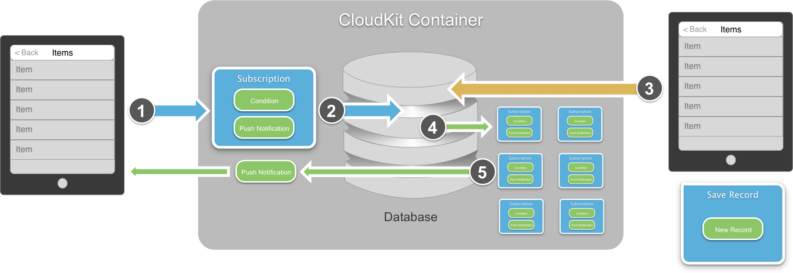](intro-to-cloudkit-images/image39.png#lightbox)

The above graph shows the typical subscription process as follows:

1. The client device creates a new Subscription containing the set of conditions that will trigger the subscription and a Push Notification that will be sent when the trigger occurs.
2. The Subscription is sent to the Database where it is added to the collection of existing subscriptions.
3. A second device creates a new Record and saves that record to the Database.
4. The Database searches through its list of Subscriptions to see if the new Record matches any of their conditions.
5. If a match is found, the Push Notification is sent to the device that registered the Subscription with information about the Record that caused it to be triggered.

With this knowledge in place, let's look at creating Subscriptions in a Xamarin iOS 8 application.

#### Creating subscriptions

The following code can be used to create a Subscription:

```csharp
// Create a new subscription
DateTime date;
var predicate = NSPredicate.FromFormat(string.Format("start > {0}", (NSDate)date));
var subscription = new CKSubscription("RecordType", predicate, CKSubscriptionOptions.FiresOnRecordCreation);

// Describe the type of notification
var notificationInfo = new CKNotificationInfo();
notificationInfo.AlertLocalizationKey = "LOCAL_NOTIFICATION_KEY";
notificationInfo.SoundName = "ping.aiff";
notificationInfo.ShouldBadge = true;

// Attach the notification info to the subscription
subscription.NotificationInfo = notificationInfo;
```

First, it creates a Predicate that provides the condition to trigger the Subscription. Next, it creates the subscription against a specific Record Type and sets the option of when the trigger is tested. Finally, it defines the type of notification that will occur when the Subscription is triggered and attaches it the Subscription.

### Saving subscriptions

With the Subscription created, the following code will save it to the Database:

```csharp
// Save the subscription to the database
ThisApp.PublicDatabase.SaveSubscription(subscription, (s, err) => {
    // Was there an error?
    if (err != null) {

    }
});
```

Using the Convenience API, the call is asynchronous, simple, and provides easy error handling.

#### Handling push notifications

If the developer has previously used Apple Push Notifications (APS), then the process of dealing with Notifications generated by CloudKit should be familiar.

In the `AppDelegate.cs`, override the `ReceivedRemoteNotification` class as follows:

```csharp
public override void ReceivedRemoteNotification (UIApplication application, NSDictionary userInfo)
{
    // Parse the notification into a CloudKit Notification
    var notification = CKNotification.FromRemoteNotificationDictionary (userInfo);

    // Get the body of the message
    var alertBody = notification.AlertBody;

    // Was this a query?
    if (notification.NotificationType == CKNotificationType.Query) {
        // Yes, convert to a query notification and get the record ID
        var query = notification as CKQueryNotification;
        var recordID = query.RecordId;
    }
}
```

The above code asks CloudKit to parse the userInfo into a CloudKit Notification. Next, information is extracted about the alert. Finally, the type of notification is tested and the notification is handled accordingly.

This section has shown how to answer the Big Data, Tiny Device problem presented above by using Queries and Subscriptions. The application will leave its large data in the cloud, and use these technologies to provide views into this dataset.

## CloudKit user accounts

As noted at the start of this article, CloudKit is built on top of the existing iCloud infrastructure. The following section will cover, in detail, how accounts are exposed to a developer using the CloudKit API.

### Authentication

When dealing with user accounts, the first consideration is authentication. CloudKit supports authentication via the currently logged-in iCloud user on the device. Authentication takes place behind the scenes and is handled by iOS. In this way, developers never have to worry about the details of implementing authentication. They only test to see if a user is logged on.

### User account information

CloudKit provides the following user information to the developer:

- **Identity** – a way of uniquely identifying the user.
- **Metadata** – The ability to save and retrieve information about users.
- **Privacy** – All information is handled in a privacy conscious manor. Nothing is exposed unless the user has agreed to it.
- **Discovery** – Gives users the ability to discover their friends that are using the same application.

Next, we will look at these topics in detail.

#### Identity

As stated above, CloudKit provides a way for the application to uniquely identify a given user:

 [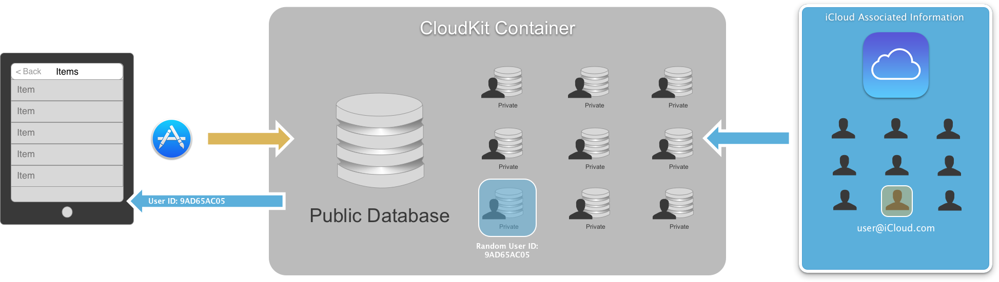](intro-to-cloudkit-images/image40.png#lightbox)

There is a client application running on a user's devices and all of the specific User Private Databases inside the CloudKit Container. The client application is going to be linked to one of those specific users. This is based on the user that is logged into iCloud locally on the device.

Because this is coming from iCloud, there is a rich backing store of User Information. And because iCloud is actually hosting the Container, it can correlate users. In the above graphic, the user whose iCloud account  `user@icloud.com` is linked to the current client.

On a Container by Container basis, a unique, randomly-generated User ID is created and associated with the user's iCloud account (email address). This User ID is returned to the application and can be used in any way the developer sees fit.

> [!NOTE]
> Different applications running on the same device for the same iCloud user will have different User IDs because they are connected to different CloudKit Containers.

The following code gets the CloudKit user ID for the currently logged in iCloud user on the device:

```csharp
public CKRecordID UserID { get; set; }
...

// Get the CloudKit User ID
CKContainer.DefaultContainer.FetchUserRecordId ((recordID, err) => {
    // Was there an error?
    if (err!=null) {
        Console.WriteLine("Error: {0}", err.LocalizedDescription);
    } else {
        // Save user ID
        UserID = recordID;
    }
});
```

The above code is asking the CloudKit Container to provide the ID of the currently logged in user. Since this information is coming from the iCloud Server, the call is asynchronous and error handling is required.

#### Metadata

Each user in CloudKit has specific Metadata that describes them. This Metadata is represented as a CloudKit Record:

 [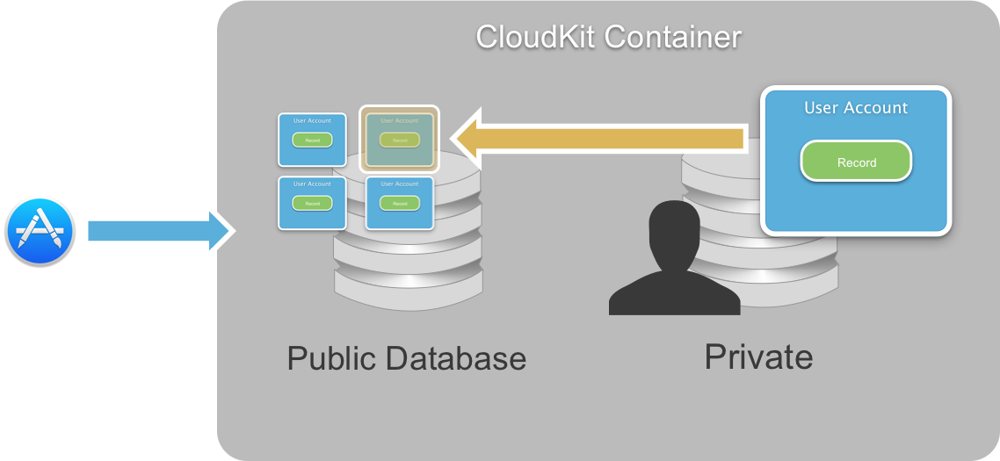](intro-to-cloudkit-images/image41.png#lightbox)

Looking inside the Private Database for a specific user of a Container there is one Record that defines that user. There are many User Records inside the Public Database, one for each user of the Container. One of these will have a record ID that matches the currently logged on user's Record ID.

User Records in the Public Database are world readable. They are treated, for the most part, as an ordinary Record and have a type of `CKRecordTypeUserRecord`. These records are reserved by the system and are not available for queries.

Use the following code to access a User Record:

```csharp
public CKRecord UserRecord { get; set; }
...

// Get the user's record
PublicDatabase.FetchRecord(UserID, (record ,er) => {
    //was there an error?
    if (er != null) {
        Console.WriteLine("Error: {0}", er.LocalizedDescription);
    } else {
        // Save the user record
        UserRecord = record;
    }
});
```

The above code is asking the Public Database to return the User Record for the user who's ID we accessed above. Since this information is coming from the iCloud Server, the call is asynchronous and error handling is required.

#### Privacy

CloudKit was design, by default, to protect the privacy of the currently logged on user. No personally identifying information about the user is exposed by default. There are some cases where the application will require limited information about the user.

In these cases, the application can request that the user disclose this information. A dialog box will be presented to the user asking them to opt-in to exposing their account information.

#### Discovery

Assuming that the user as opted-in to allowing the application limited access to their user account information, they can be discoverable to other users of the application:

 [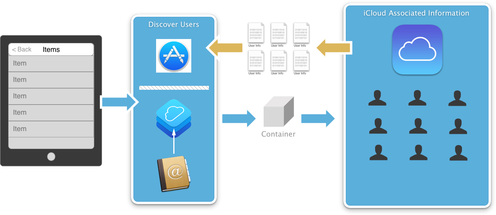](intro-to-cloudkit-images/image42.png#lightbox)

The client application is talking to a Container, and the Container is talking iCloud to access user information. The user can provide an email address and Discovery can be used to get information back about the user. Optionally, the User ID can also be used to discover information about the user.

CloudKit also provides a way to discover information about any user who might be friends of the currently logged on iCloud user by querying the whole Address Book. The CloudKit Process will pull in the user's Contact Book and use the email addresses to see if it can find other user's of the application that match those addresses.

This allows the application to leverage the user's Contact Book without providing access to it or asking the user to approve access to the contacts. At no time is the contact information made available to the application, only the CloudKit Process has access.

To recap, there are three different kinds of inputs available for User Discovery:

- **User Record ID** – Discovery can be done against the User ID of the currently logged in CloudKit user.
- **User Email Address** – The user can provide an email address and it can be used for discovery.
- **Contact Book** – The user's address book can be used to discover users of the application that have the same email address as listed in their contacts.

User Discovery will return the following information:

- **User Record ID** - The unique ID of a user in the Public Database.
- **First and Last Name** - As stored in the Public Database.

This information will only be returned for users that have opted-into Discovery.

The following code will discover information about the user currently logged into iCloud on the device:

```csharp
public CKDiscoveredUserInfo UserInfo { get; set; }
//...

// Get the user's metadata
CKContainer.DefaultContainer.DiscoverUserInfo(UserID, (info, e) => {
    // Was there an error?
    if (e != null) {
        Console.WriteLine("Error: {0}", e.LocalizedDescription);
    } else {
        // Save the user info
        UserInfo = info;
    }
});
```

Use the following code to query all users in the Contact Book:

```csharp
// Ask CloudKit for all of the user's friends information
CKContainer.DefaultContainer.DiscoverAllContactUserInfos((info, er) => {
    // Was there an error
    if (er != null) {
        Console.WriteLine("Error: {0}", er.LocalizedDescription);
    } else {
        // Process all returned records
        for(int i = 0; i < info.Count(); ++i) {
            // Grab a user
            var userInfo = info[i];
        }
    }
});
```

In this section we have covered the four major areas of access to a user's account that CloudKit can provide to an application. From getting the user's Identity and Metadata, to the Privacy policies that are built into CloudKit and finally, the ability to Discover other users of the application.

## The development and production environments

CloudKit provides separate Development and Production environments for an application's record types and data. The Development Environment is a more flexible environment that is available only to members of a development team. When an application adds a new field to a record and saves that record in the Development Environment, the server updates the schema information automatically.

The developer can use this feature to make changes to a schema during development, which saves time. One caveat is that after a field has been added to a record, the data type associated with that field cannot be changed programmatically. To change a field’s type, the developer must delete the field in [CloudKit Dashboard](https://icloud.developer.apple.com/dashboard/) and add it again with the new type.

Prior to deploying the application, the developer can migrate their schema and data to the production environment using **CloudKit Dashboard**. When running against the Production Environment, the server prevents an application from changing the schema programmatically. The developer can still make changes with **CloudKit Dashboard** but attempts to add fields to a record in the Production Environment result in errors.

> [!NOTE]
> The iOS Simulator works only with the **Development Environment**. When the developer is ready to test an application in a **Production Environment**, a physical iOS device is required.

## Shipping a CloudKit enabled app

Before shipping an application that uses CloudKit, it will need to be configured to target the **Production CloudKit Environment** or the application will be rejected by Apple.

Do the following:

1. In Visual Studio for Ma, compile the application for **Release** > **iOS Device**:

    [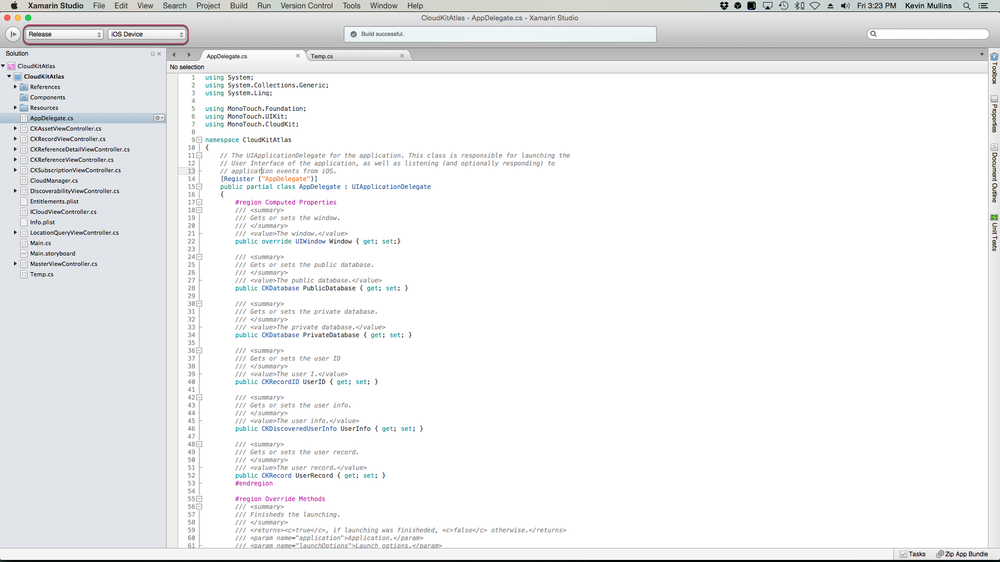](intro-to-cloudkit-images/shipping01.png#lightbox)

2. From the **Build** menu, select **Archive**:

    [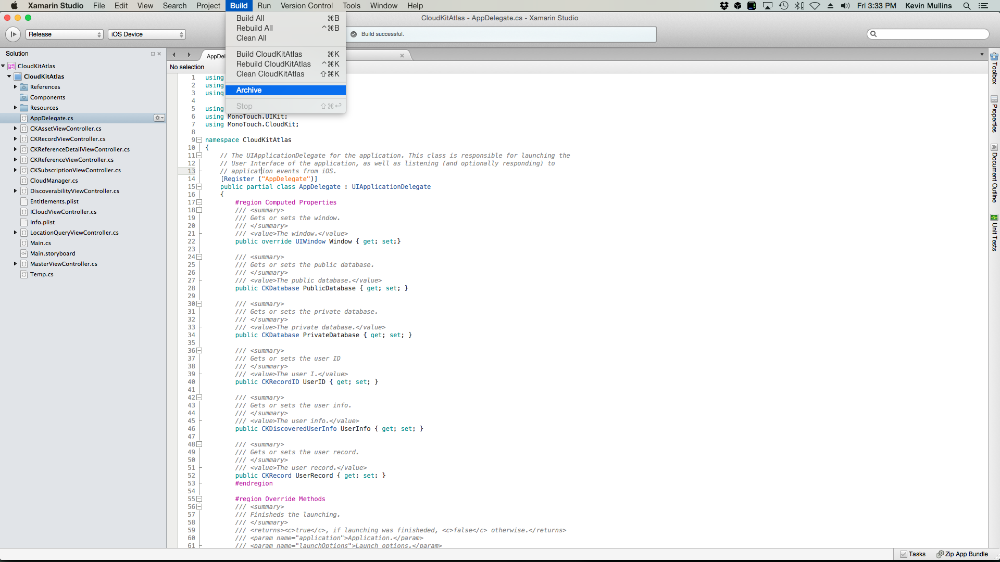](intro-to-cloudkit-images/shipping02.png#lightbox)

3. The **Archive** will be created and displayed in Visual Studio for Mac:

    [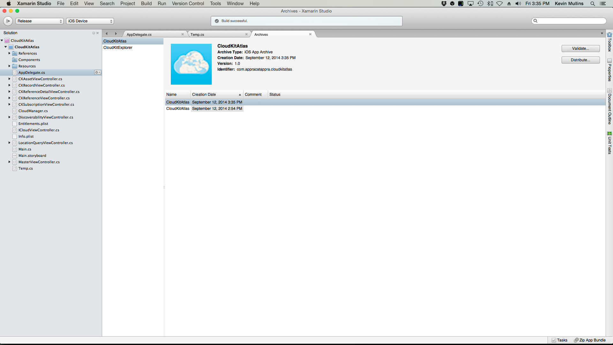](intro-to-cloudkit-images/shipping03.png#lightbox)

4. Start **Xcode**.
5. From the **Window** menu, select **Organizer**:

    [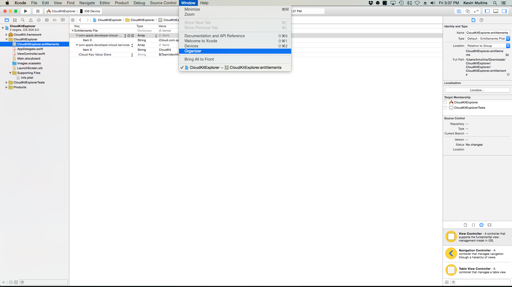](intro-to-cloudkit-images/shipping04.png#lightbox)

6. Select the application's archive and click the **Export...** button:

    [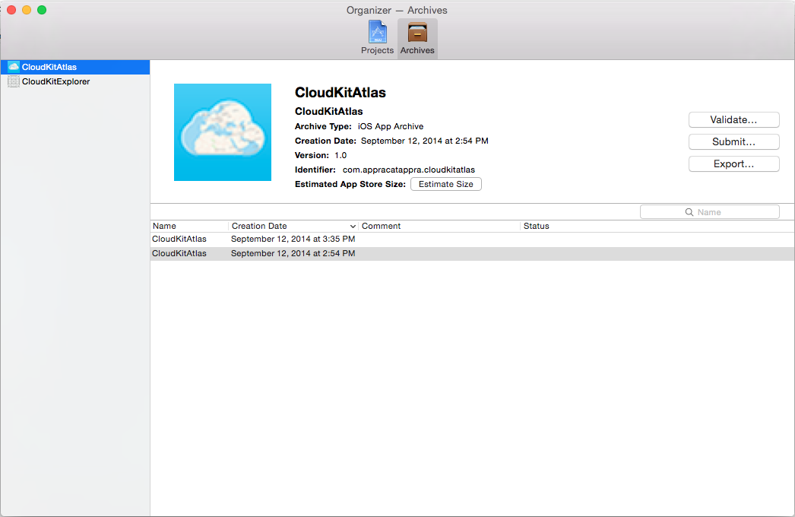](intro-to-cloudkit-images/shipping05.png#lightbox)

7. Select a method for export and click the **Next** button:

    [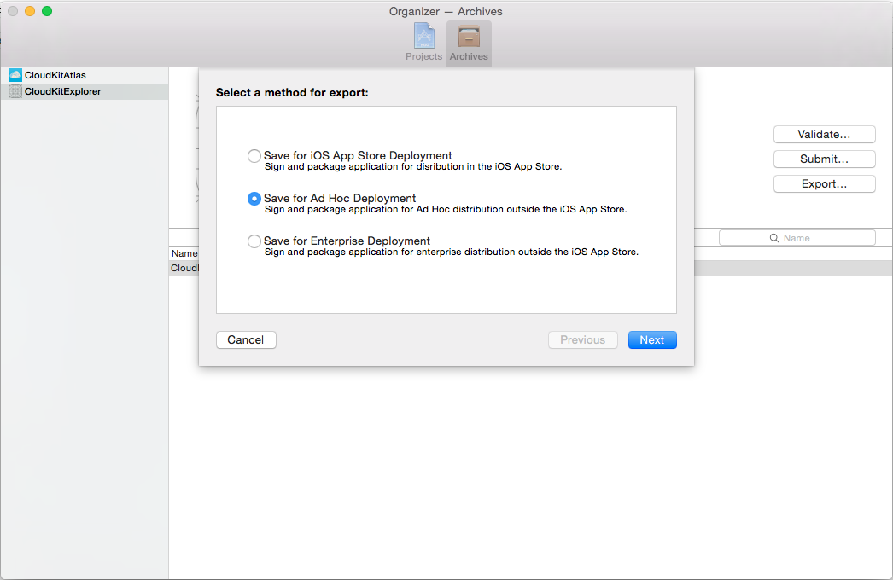](intro-to-cloudkit-images/shipping06.png#lightbox)

8. Select the **Development Team** from the dropdown list and click the **Choose** button:

    [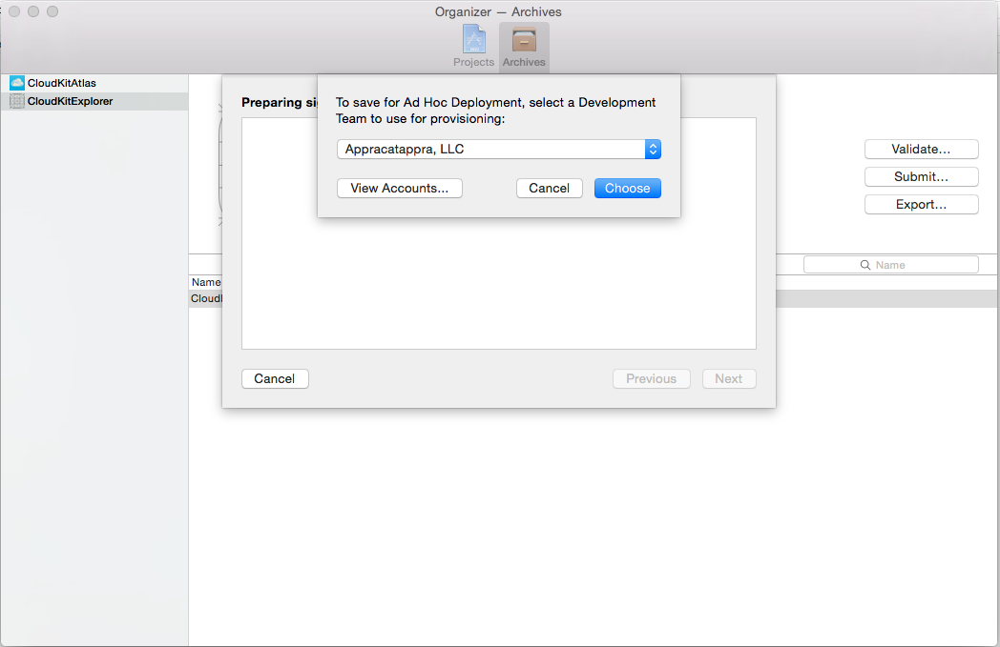](intro-to-cloudkit-images/shipping07.png#lightbox)

9. Select **Production** from the dropdown list and click the **Next** button:

    [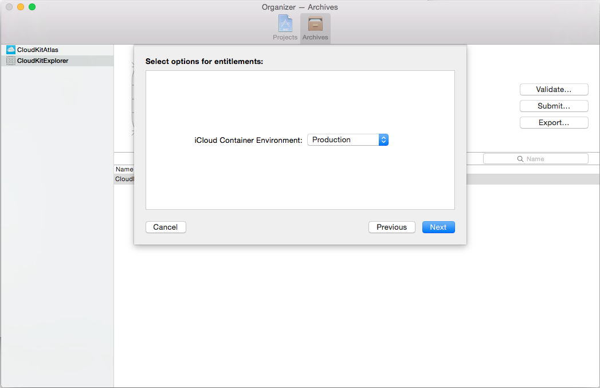](intro-to-cloudkit-images/shipping08.png#lightbox)

10. Review the setting and click the **Export** button:

    [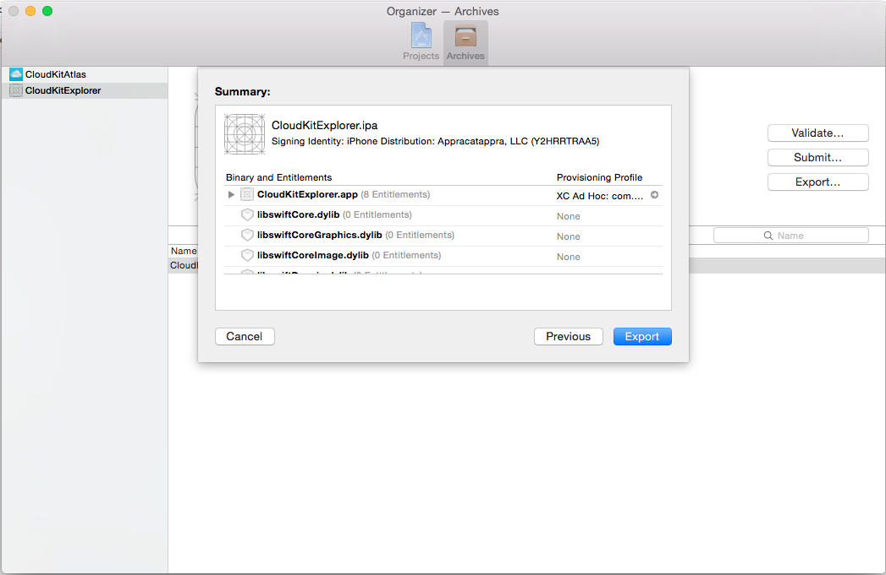](intro-to-cloudkit-images/shipping09.png#lightbox)

11. Choose a location to generate the resulting application `.ipa` file.

The process is similar for submitting the application directly to iTunes Connect, just click the **Submit...** button instead of the Export... after selecting an Archive in the Organizer window.

## When to use CloudKit

As we have seen in this article, CloudKit provides an easy way for an application to store and retrieve information from the iCloud servers. That being said, CloudKit does not obsolete or deprecate any of the existing tools or frameworks.

### Use cases

The following use cases should help the developer decide when to use a specific iCloud framework or technology:

- **iCloud Key-Value Store** – Asynchronously keeps small amount of data up-to-date and is great for working with application preferences. However, it is constrained for a very small amount of information.
- **iCloud Drive** – Built on top of the existing iCloud Documents APIs and provides a simple API to sync unstructured data from the file system. It provides a full offline cache on Mac OS X and is great for document centric applications.
- **iCloud Core Data** – Allows data to be replicated between all of the user's devices. The data is single-user and great for keeping private, structured data in sync.
- **CloudKit** – Provides public data both structure and bulk and is capable of handling both large dataset and large unstructured files. Its tied to the user's iCloud account and provides client directed data transfer.

Keeping these use cases in mind, the developer should pick the correct iCloud technology to provide both the current required application functionality and provide good scalability for future growth.

## Summary

This article has covered a quick introduction to the CloudKit API. It has shown how to provision and configure a Xamarin iOS application to use CloudKit. It has covered the features of the CloudKit Convenience API. It has show how to design a CloudKit enabled application for scalability using Queries and Subscriptions. And finally it has shown the User Account information that is exposed to an application by CloudKit.

## Related links

- [CloudKit (Apple)](https://developer.apple.com/icloud/cloudkit/)
- [CloudKitAtlas (sample)](/samples/xamarin/ios-samples/ios8-cloudkitatlas)
- [Creating a provisioning profile](~/ios/get-started/installation/device-provisioning/index.md)