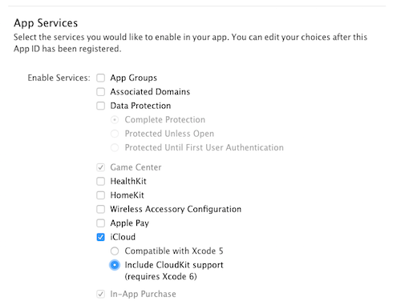
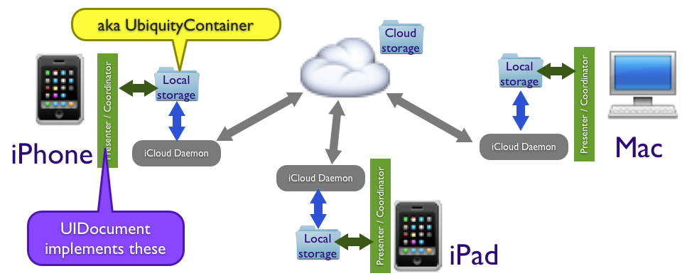
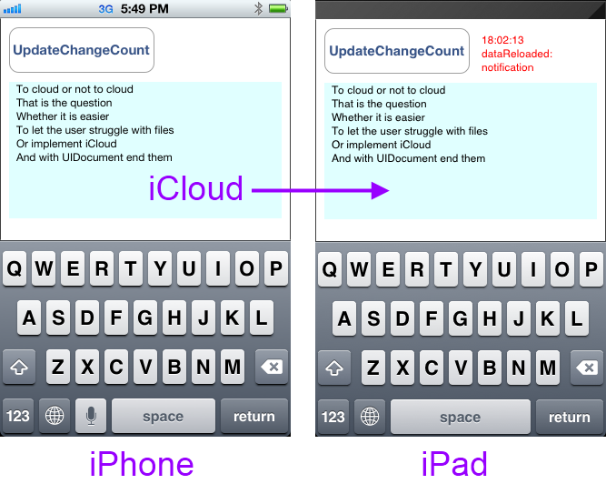
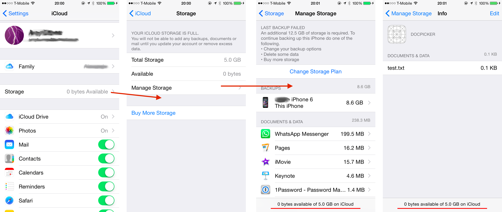
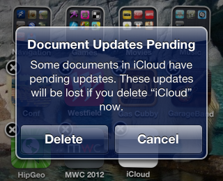
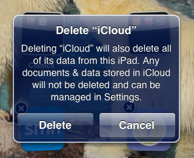

# Using iCloud with Xamarin.iOS

The iCloud storage API in iOS 5 allows applications to save user documents
and application-specific data to a central location and access those items from
all the user's devices.

There are four types of storage available:

- **Key-Value storage** - to share small amounts of data with
your application on a user's other devices.

- **UIDocument storage** - to store documents and other data in
the user's iCloud account using a subclass of UIDocument.

- **CoreData** - SQLite database storage.

- **Individual files and directories** - for managing lots of
different files directly in the file system.

This document discusses the first two types - Key-Value pairs and
UIDocument subclasses - and how to use those features in Xamarin.iOS.

> [!IMPORTANT]
> Apple [provides tools](https://developer.apple.com/support/allowing-users-to-manage-data/) 
> to help developers properly handle the European Union's General Data 
> Protection Regulation (GDPR).

## Requirements

- The latest stable version of Xamarin.iOS
- Xcode 10
- Visual Studio for Mac or Visual Studio 2019.

## Preparing for iCloud development

Applications must be configured to use iCloud both in the [Apple Provisioning Portal](https://developer.apple.com/account/ios/overview.action) and the project itself. Before developing for iCloud (or trying out the samples) follow the steps below.

To correctly configure an application to access iCloud:

- **Find your TeamID** - login to  [developer.apple.com](https://developer.apple.com) and visit the  **Member Center > Your Account > Developer Account Summary** to get your Team ID (or Individual ID for single developers). It will be a 10 character string ( **A93A5CM278** for example) - this forms part of the "container identifier".

- **Create a new App ID** - To create an App ID, follow the steps outlined in the  [Provisioning for Store Technologies section of the Device Provisioning guide](~/ios/deploy-test/provisioning/capabilities/icloud-capabilities.md), and be sure to check **iCloud** as an allowed service:

 [](introduction-to-icloud-images/icloud.png#lightbox)

- **Create a new Provisioning Profile** - To create a Provisioning Profile, follow the steps outlined in the  [Device Provisioning guide](~/ios/get-started/installation/device-provisioning/index.md#provisioning-your-device) .

- **Add the Container Identifier to Entitlements.plist** - the container identifier format is `TeamID.BundleID`. For more information refer to the [Working with Entitlements](~/ios/deploy-test/provisioning/entitlements.md) guide.

- **Configure the project properties** - In the Info.plist file ensure the **Bundle Identifier** matches the **Bundle ID** set when [creating an App ID](~/ios/deploy-test/provisioning/capabilities/index.md); The iOS Bundle
Signing uses a **Provisioning Profile** that contain an App ID with the iCloud App Service, and the **Custom Entitlements** file selected. This can all be done in Visual Studio under the project Properties pane.

- **Enable iCloud on your device** - go to **Settings > iCloud** and ensure that the device is logged in.
Select and turn on the **Documents & Data** option.

- **You must use a device to test iCloud** - it will not work on the Simulator.
In fact, you really need two or more devices all signed in with the same Apple
ID to see iCloud in action.

## Key-Value Storage

Key-value storage is intended for small amounts of data that a user might
like persisted across devices - such as the last page they viewed in a book or
magazine. Key-value storage should not be used for backing-up data.

There are some limitations to be aware of when using key-value storage:

- **Maximum key size** - Key names cannot be longer than 64
bytes.

- **Maximum value size** - You cannot store more than 64
kilobytes in a single value.

- **Maximum key-value store size for an app** - Applications can
only store up to 64 kilobytes of key-value data in total. Attempts to set keys
beyond that limit will fail and the previous value will persist.

- **Data types** - Only basic types like strings, numbers and
booleans can be stored.

The **iCloudKeyValue** example demonstrates how it works. The sample code creates
a key named for each device: you can set this key on one device and watch the
value get propagated to others. It also creates a key called "Shared" which
can be edited on any device - if you edit on many devices at once, iCloud will
decide which value "wins" (using a timestamp on the change) and gets
propagated.

This screenshot shows the sample in use. When change notifications are
received from iCloud they are printed in the scrolling text view at the bottom
of the screen and updated in the input fields.

 [](introduction-to-icloud-images/icloud-kv-arrows.png#lightbox)

### Setting and retrieving data

This code shows how to set a string value.

```csharp
var store = NSUbiquitousKeyValueStore.DefaultStore;
store.SetString("testkey", "VALUE IN THE CLOUD");  // key and value
store.Synchronize();
```

Calling Synchronize ensures the value is persisted to local disk storage
only. The synchronization to iCloud happens in the background and cannot be
"forced" by application code. With good network connectivity the
synchronization will often happen within 5 seconds, however if the network is
poor (or disconnected) an update may take much longer.

You can retrieve a value with this code:

```csharp
var store = NSUbiquitousKeyValueStore.DefaultStore;
display.Text = store.GetString("testkey");
```

The value is retrieved from the local data store - this method does not
attempt to contact iCloud servers to get the "latest" value. iCloud will
update the local data store according to its own schedule.

### Deleting Data

To completely remove a key-value pair, use the Remove method like this:

```csharp
var store = NSUbiquitousKeyValueStore.DefaultStore;
store.Remove("testkey");
store.Synchronize();
```

### Observing Changes

An application can also receive notifications when values are changed by
iCloud by adding an observer to the `NSNotificationCenter.DefaultCenter`.
The following code from **KeyValueViewController.cs** `ViewWillAppear` method
shows how to listen for those notifications and create a list of which keys have
been changed:

```csharp
keyValueNotification =
NSNotificationCenter.DefaultCenter.AddObserver (
    NSUbiquitousKeyValueStore.DidChangeExternallyNotification, notification => {
    Console.WriteLine ("Cloud notification received");
    NSDictionary userInfo = notification.UserInfo;

    var reasonNumber = (NSNumber)userInfo.ObjectForKey (NSUbiquitousKeyValueStore.ChangeReasonKey);
    nint reason = reasonNumber.NIntValue;

    var changedKeys = (NSArray)userInfo.ObjectForKey (NSUbiquitousKeyValueStore.ChangedKeysKey);
    var changedKeysList = new List<string> ();
    for (uint i = 0; i < changedKeys.Count; i++) {
        var key = changedKeys.GetItem<NSString> (i); // resolve key to a string
        changedKeysList.Add (key);
    }
    // now do something with the list...
});
```

Your code can then take some action with the list of changed keys, such as
updating a local copy of them or updating the UI with the new values.

Possible change reasons are: ServerChange (0), InitialSyncChange (1), or
QuotaViolationChange (2). You can access the reason and perform different
processing if required (for example, you might need to remove some keys as a
result of a *QuotaViolationChange*).

## Document Storage

iCloud Document Storage is designed to manage data that is important to your
app (and to the user). It can be used to manage files and other data that your
app needs to run, while at the same time providing iCloud-based backup and
sharing functionality across all the user's devices.

This diagram shows how it all fits together. Each device has data saved on
local storage (the UbiquityContainer) and the operating system's iCloud Daemon
takes care of sending and receiving data in the cloud. All file access to the
UbiquityContainer must be done via FilePresenter/FileCoordinator to prevent
concurrent access. The `UIDocument` class implements those for you; this
example shows how to use UIDocument.

 [](introduction-to-icloud-images/icloud-overview.png#lightbox)

The iCloudUIDoc example implements a simple `UIDocument` subclass that
contains a single text field. The text is rendered in a `UITextView` and
edits are propagated by iCloud to other devices with a notification message
shown in red. The sample code does not deal with more advanced iCloud features
like conflict resolution.

This screenshot shows the sample application - after changing the text and
pressing **UpdateChangeCount** the document is synchronized via
iCloud to other devices.

 [](introduction-to-icloud-images/iclouduidoc.png#lightbox)

There are five parts to the iCloudUIDoc sample:

1. **Accessing the UbiquityContainer** - determine if iCloud is
enabled, and if so the path to your application's iCloud storage area.

1. **Creating a UIDocument subclass** - create a class to
intermediate between iCloud storage and your model objects.

1. **Finding and opening iCloud documents** - use `NSFileManager` and `NSPredicate` to find iCloud documents and open them.

1. **Displaying iCloud documents** - expose properties from your `UIDocument` so that you can interact with UI
controls.

1. **Saving iCloud documents** - ensure that changes made in the UI are persisted to disk and iCloud.

All iCloud operations run (or should run) asynchronously so that they don't
block while waiting for something to happen. You will see three different ways
of accomplishing this in the sample:

 **Threads** - in `AppDelegate.FinishedLaunching` the initial call to `GetUrlForUbiquityContainer` is done on another thread to
prevent blocking the main thread.

 **NotificationCenter** - registering for notifications when
asynchronous operations such as `NSMetadataQuery.StartQuery` complete.

 **Completion Handlers** - passing in methods to run on
completion of asynchronous operations like `UIDocument.Open`.

### Accessing the UbiquityContainer

The first step in using iCloud Document Storage is to determine whether
iCloud is enabled, and if so the location of the "ubiquity container" (the
directory where iCloud-enabled files are stored on the device).

This code is in the `AppDelegate.FinishedLaunching` method of the sample.

```csharp
// GetUrlForUbiquityContainer is blocking, Apple recommends background thread or your UI will freeze
ThreadPool.QueueUserWorkItem (_ => {
    CheckingForiCloud = true;
    Console.WriteLine ("Checking for iCloud");
    var uburl = NSFileManager.DefaultManager.GetUrlForUbiquityContainer (null);
    // OR instead of null you can specify "TEAMID.com.your-company.ApplicationName"

    if (uburl == null) {
        HasiCloud = false;
        Console.WriteLine ("Can't find iCloud container, check your provisioning profile and entitlements");

        InvokeOnMainThread (() => {
            var alertController = UIAlertController.Create ("No \uE049 available",
            "Check your Entitlements.plist, BundleId, TeamId and Provisioning Profile!", UIAlertControllerStyle.Alert);
            alertController.AddAction (UIAlertAction.Create ("OK", UIAlertActionStyle.Destructive, null));
            viewController.PresentViewController (alertController, false, null);
        });
    } else { // iCloud enabled, store the NSURL for later use
        HasiCloud = true;
        iCloudUrl = uburl;
        Console.WriteLine ("yyy Yes iCloud! {0}", uburl.AbsoluteUrl);
    }
    CheckingForiCloud = false;
});
```

Although the sample does not do so, Apple recommends calling
GetUrlForUbiquityContainer whenever an app comes to the foreground.

### Creating a UIDocument Subclass

All iCloud files and directories (ie. anything stored in the
UbiquityContainer directory) must be managed using NSFileManager methods,
implementing the NSFilePresenter protocol and writing via an NSFileCoordinator.
The simplest way to do all of that is not to write it yourself, but subclass
UIDocument which does it all for you.

There are only two methods that you must implement in a UIDocument subclass
to work with iCloud:

- **LoadFromContents** - passes in the NSData of the file's
contents for you to unpack into your model class/es.

- **ContentsForType** - request for you to supply the NSData
representation of your model class/es to save to disk (and the Cloud).

This sample code from **iCloudUIDoc\MonkeyDocument.cs** shows how to implement
UIDocument.

```csharp
public class MonkeyDocument : UIDocument
{
    // the 'model', just a chunk of text in this case; must easily convert to NSData
    NSString dataModel;
    // model is wrapped in a nice .NET-friendly property
    public string DocumentString {
        get {
            return dataModel.ToString ();
        }
        set {
            dataModel = new NSString (value);
        }
    }
    public MonkeyDocument (NSUrl url) : base (url)
    {
        DocumentString = "(default text)";
    }
    // contents supplied by iCloud to display, update local model and display (via notification)
    public override bool LoadFromContents (NSObject contents, string typeName, out NSError outError)
    {
        outError = null;

        Console.WriteLine ("LoadFromContents({0})", typeName);

        if (contents != null)
            dataModel = NSString.FromData ((NSData)contents, NSStringEncoding.UTF8);

        // LoadFromContents called when an update occurs
        NSNotificationCenter.DefaultCenter.PostNotificationName ("monkeyDocumentModified", this);
        return true;
    }
    // return contents for iCloud to save (from the local model)
    public override NSObject ContentsForType (string typeName, out NSError outError)
    {
        outError = null;

        Console.WriteLine ("ContentsForType({0})", typeName);
        Console.WriteLine ("DocumentText:{0}",dataModel);

        NSData docData = dataModel.Encode (NSStringEncoding.UTF8);
        return docData;
    }
}
```

The data model in this case is very simple - a single text field. Your data
model can be as complex as required, such as an Xml document or binary data. The
primary role of the UIDocument implementation is to translate between your model
classes and an NSData representation that can be saved/loaded on disk.

### Finding and Opening iCloud Documents

The sample app only deals with a single file - test.txt - so the code in
**AppDelegate.cs** creates an `NSPredicate` and `NSMetadataQuery` to look specifically
for that filename. The `NSMetadataQuery` runs asynchronously and sends a
notification when it finishes. `DidFinishGathering` gets called by the
notification observer, stops the query and calls LoadDocument, which uses the
`UIDocument.Open` method with a completion handler to attempt to load the file and
display it in a `MonkeyDocumentViewController`.

```csharp
string monkeyDocFilename = "test.txt";
void FindDocument ()
{
    Console.WriteLine ("FindDocument");
    query = new NSMetadataQuery {
        SearchScopes = new NSObject [] { NSMetadataQuery.UbiquitousDocumentsScope }
    };

    var pred = NSPredicate.FromFormat ("%K == %@", new NSObject[] {
        NSMetadataQuery.ItemFSNameKey, new NSString (MonkeyDocFilename)
    });

    Console.WriteLine ("Predicate:{0}", pred.PredicateFormat);
    query.Predicate = pred;

    NSNotificationCenter.DefaultCenter.AddObserver (
        this,
        new Selector ("queryDidFinishGathering:"),
        NSMetadataQuery.DidFinishGatheringNotification,
        query
    );

    query.StartQuery ();
}

[Export ("queryDidFinishGathering:")]
void DidFinishGathering (NSNotification notification)
{
    Console.WriteLine ("DidFinishGathering");
    var metadataQuery = (NSMetadataQuery)notification.Object;
    metadataQuery.DisableUpdates ();
    metadataQuery.StopQuery ();

    NSNotificationCenter.DefaultCenter.RemoveObserver (this, NSMetadataQuery.DidFinishGatheringNotification, metadataQuery);
    LoadDocument (metadataQuery);
}

void LoadDocument (NSMetadataQuery metadataQuery)
{
    Console.WriteLine ("LoadDocument");

    if (metadataQuery.ResultCount == 1) {
        var item = (NSMetadataItem)metadataQuery.ResultAtIndex (0);
        var url = (NSUrl)item.ValueForAttribute (NSMetadataQuery.ItemURLKey);
        doc = new MonkeyDocument (url);

        doc.Open (success => {
            if (success) {
                Console.WriteLine ("iCloud document opened");
                Console.WriteLine (" -- {0}", doc.DocumentString);
                viewController.DisplayDocument (doc);
            } else {
                Console.WriteLine ("failed to open iCloud document");
            }
        });
    } // TODO: if no document, we need to create one
}
```

### Displaying iCloud Documents

Displaying a UIDocument shouldn't be any different to any other model class -
properties are displayed in UI controls, possibly edited by the user and
then written back to the model.

In the example **iCloudUIDoc\MonkeyDocumentViewController.cs** displays the
MonkeyDocument text in a `UITextView`. `ViewDidLoad` listens for the notification
sent in the `MonkeyDocument.LoadFromContents` method. `LoadFromContents` is called
when iCloud has new data for the file, so that notification indicates that the
document has been updated.

```csharp
NSNotificationCenter.DefaultCenter.AddObserver (this,
    new Selector ("dataReloaded:"),
    new NSString ("monkeyDocumentModified"),
    null
);
```

The sample code notification handler calls a method to update the UI - in
this case without any conflict detection or resolution.

```csharp
[Export ("dataReloaded:")]
void DataReloaded (NSNotification notification)
{
    doc = (MonkeyDocument)notification.Object;
    // we just overwrite whatever was being typed, no conflict resolution for now
    docText.Text = doc.DocumentString;
}
```

### Saving iCloud Documents

To add a UIDocument to iCloud you can call `UIDocument.Save` directly (for new
documents only) or move an existing file using
`NSFileManager.DefaultManager.SetUbiquitious`. The example code creates a new
document directly in the ubiquity container with this code (there are two
completion handlers here, one for the `Save` operation and another for the
Open):

```csharp
var docsFolder = Path.Combine (iCloudUrl.Path, "Documents"); // NOTE: Documents folder is user-accessible in Settings
var docPath = Path.Combine (docsFolder, MonkeyDocFilename);
var ubiq = new NSUrl (docPath, false);
var monkeyDoc = new MonkeyDocument (ubiq);
monkeyDoc.Save (monkeyDoc.FileUrl, UIDocumentSaveOperation.ForCreating, saveSuccess => {
Console.WriteLine ("Save completion:" + saveSuccess);
if (saveSuccess) {
    monkeyDoc.Open (openSuccess => {
        Console.WriteLine ("Open completion:" + openSuccess);
        if (openSuccess) {
            Console.WriteLine ("new document for iCloud");
            Console.WriteLine (" == " + monkeyDoc.DocumentString);
            viewController.DisplayDocument (monkeyDoc);
        } else {
            Console.WriteLine ("couldn't open");
        }
    });
} else {
    Console.WriteLine ("couldn't save");
}
```

Subsequent changes to the document are not "saved" directly, instead we
tell the `UIDocument` that it has changed with `UpdateChangeCount`, and it will
automatically schedule a save to disk operation:

```csharp
doc.UpdateChangeCount (UIDocumentChangeKind.Done);
```

### Managing iCloud Documents

Users can manage iCloud documents in the **Documents** directory of the
"ubiquity container" outside of your application via Settings; they can view
the file list and swipe to delete. Application code should be able to handle the
situation where documents are deleted by the user. Do not store internal
application data in the **Documents** directory.

 [](introduction-to-icloud-images/icloudstorage.png#lightbox)

Users will also receive different warnings when they attempt to remove an
iCloud-enabled application from their device, to inform them of the status of
iCloud documents related to that application.

 [](introduction-to-icloud-images/icloud-delete1.png#lightbox)

 [](introduction-to-icloud-images/icloud-delete2.png#lightbox)

## iCloud Backup

While backing up to iCloud isn't a feature that is directly accessed by
developers, the way you design your application can affect the user experience.
Apple provides [iOS Data Storage Guidelines](https://developer.apple.com/icloud/documentation/data-storage/)
for developers to follow in their iOS applications.

The most important consideration is whether your app stores large files that
are not user-generated (for example, a magazine reader application that stores
hundred-plus megabytes of content per issue). Apple prefers that you do not
store this sort of data where it will be backed-up to iCloud and unnecessarily
fill the user's iCloud quota.

Applications that store large amounts of data like this should either store
it in one of the user directories that is not backed-up (eg. Caches or tmp) or
use `NSFileManager.SetSkipBackupAttribute` to apply a flag to those files so that
iCloud ignores them during backup operations.

## Summary

This article introduced the new iCloud feature included in iOS 5. It examined
the steps required to configure your project to use iCloud and then provided
examples of how to implement iCloud features.

The key-value storage example demonstrated how iCloud can be used to store a
small amount of data similar to the way NSUserPreferences are stored. The
UIDocument example showed how more complex data can be stored and synchronized
across multiple devices via iCloud.

Finally it included a brief discussion on how the addition of iCloud Backup should influence your application design.

## Related Links

- [Introduction To iCloud (sample)](/samples/xamarin/ios-samples/introductiontoicloud)
- [iCloud Seminar Sample Code](https://github.com/xamarin/Seminars/tree/master/2012-03-22-iCloud)
- [iCloud Seminar Slides](https://www.slideshare.net/Xamarin/using-icloud-with-monotouch)
- [iCloud NSUbiquitousKeyValueStore](https://developer.apple.com/library/prerelease/ios/)
- [iCloud Storage](https://support.apple.com/kb/HT4847)