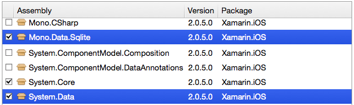

# System.Data in Xamarin.iOS

Xamarin.iOS 8.10 adds support for [System.Data](xref:System.Data), including the `Mono.Data.Sqlite.dll` ADO.NET provider. Support includes the addition of the following [assemblies](~/cross-platform/internals/available-assemblies.md):

- `System.Data.dll`
- `System.Data.Service.Client.dll`
- `System.Transactions.dll`
- `Mono.Data.Tds.dll`
- `Mono.Data.Sqlite.dll`

<a name="Example"></a>

## Example

The following program creates a database in `Documents/mydb.db3`, and if the database doesn't previously exist it is populated with sample data. The database is then queried, with the output written to `stderr`.

### Add References

First, right-click on the **References** node and choose **Edit References...**
  then select `System.Data` and `Mono.Data.Sqlite`:

[](system.data-images/edit-references.png#lightbox)

### Sample Code

The following code shows a simple example of creating a table
  and inserting rows using embedded SQL commands:

```csharp
using System;
using System.Data;
using System.IO;
using Mono.Data.Sqlite;

class Demo {
    static void Main (string [] args)
    {
        var connection = GetConnection ();
        using (var cmd = connection.CreateCommand ()) {
            connection.Open ();
            cmd.CommandText = "SELECT * FROM People";
            using (var reader = cmd.ExecuteReader ()) {
                while (reader.Read ()) {
                    Console.Error.Write ("(Row ");
                    Write (reader, 0);
                    for (nint i = 1; i < reader.FieldCount; ++i) {
                        Console.Error.Write(" ");
                        Write (reader, i);
                    }
                    Console.Error.WriteLine(")");
                }
            }
            connection.Close ();
        }
    }

    static SqliteConnection GetConnection()
    {
        var documents = Environment.GetFolderPath (
                Environment.SpecialFolder.Personal);
        string db = Path.Combine (documents, "mydb.db3");
        bool exists = File.Exists (db);
        if (!exists)
            SqliteConnection.CreateFile (db);
        var conn = new SqliteConnection("Data Source=" + db);
        if (!exists) {
            var commands = new[] {
            "CREATE TABLE People (PersonID INTEGER NOT NULL, FirstName ntext, LastName ntext)",
            // WARNING: never insert user-entered data with embedded parameter values
            "INSERT INTO People (PersonID, FirstName, LastName) VALUES (1, 'First', 'Last')",
            "INSERT INTO People (PersonID, FirstName, LastName) VALUES (2, 'Dewey', 'Cheatem')",
            "INSERT INTO People (PersonID, FirstName, LastName) VALUES (3, 'And', 'How')",
            };
            conn.Open ();
            foreach (var cmd in commands) {
                using (var c = conn.CreateCommand()) {
                    c.CommandText = cmd;
                    c.CommandType = CommandType.Text;
                    c.ExecuteNonQuery ();
                }
            }
            conn.Close ();
        }
        return conn;
    }

    static void Write(SqliteDataReader reader, int index)
    {
        Console.Error.Write("({0} '{1}')",
                reader.GetName(index),
                reader [index]);
    }
}
```

> [!IMPORTANT]
> As mentioned in the code sample above, it is bad practice to embed strings in SQL commands because it makes your code vulnerable to [SQL injection](https://en.wikipedia.org/wiki/SQL_injection).

### Using Command Parameters

The following code shows how to use command parameters
  to insert user-entered text safely into the database (even
  if the text contains special SQL characters like single-apostrophe):

```csharp
// user input from Textbox control
var fname = fnameTextbox.Text;
var lname = lnameTextbox.Text;
// use command parameters to safely insert into database
using (var addCmd = conn.CreateCommand ()) {
    addCmd.CommandText = "INSERT INTO [People] (PersonID, FirstName, LastName) VALUES (@COL1, @COL2, @COL3)";
    addCmd.CommandType = System.Data.CommandType.Text;
    addCmd.AddParameterWithValue ("@COL1", 1);
    addCmd.AddParameterWithValue ("@COL2", fname);
    addCmd.AddParameterWithValue ("@COL3", lname);
    addCmd.ExecuteNonQuery ();
}
```

<a name="Missing_Functionality"></a>

## Missing Functionality

Both **System.Data** and **Mono.Data.Sqlite** are missing some functionality.

<a name="System.Data"></a>

### System.Data

Functionality missing from **System.Data.dll** consists of:

- Anything requiring  [System.CodeDom](xref:System.CodeDom) (e.g.  [System.Data.TypedDataSetGenerator](xref:System.Data.TypedDataSetGenerator) )
- XML config file support (e.g.  [System.Data.Common.DbProviderConfigurationHandler](xref:System.Data.Common.DbProviderConfigurationHandler) )
- [System.Data.Common.DbProviderFactories](xref:System.Data.Common.DbProviderFactories) (depends on XML config file support)
- [System.Data.OleDb](xref:System.Data.OleDb)
- [System.Data.Odbc](xref:System.Data.Odbc)
- The  `System.EnterpriseServices.dll` dependency was  *removed* from  `System.Data.dll` , resulting in the removal of the  [SqlConnection.EnlistDistributedTransaction(ITransaction)](xref:System.Data.SqlClient.SqlConnection.EnlistDistributedTransaction*) method.

<a name="Mono.Data.Sqlite"></a>

### Mono.Data.Sqlite

Meanwhile, **Mono.Data.Sqlite.dll** suffered no source code changes, but instead may be host to a number of *runtime* issues since `Mono.Data.Sqlite.dll` binds SQLite 3.5. iOS 8, meanwhile, ships with SQLite 3.8.5. Suffice it to say, some things have changed between the two versions.

Older version of iOS ship with the following versions of SQLite:

- **iOS 7** - version 3.7.13.
- **iOS 6** - version 3.7.13.
- **iOS 5** - version 3.7.7.
- **iOS 4** - version 3.6.22.

The most common issues appear to be related to database schema querying, e.g. determining at runtime which columns exist on a given table, such as `Mono.Data.Sqlite.SqliteConnection.GetSchema` (overriding [DbConnection.GetSchema](xref:System.Data.Common.DbConnection.GetSchema) and `Mono.Data.Sqlite.SqliteDataReader.GetSchemaTable` (overriding [DbDataReader.GetSchemaTable](xref:System.Data.Common.DbDataReader.GetSchemaTable). In short, it seems that
anything using [DataTable](xref:System.Data.DataTable) is unlikely to work.

<a name="Data_Binding"></a>

## Data Binding

Data Binding is not supported at this time.
