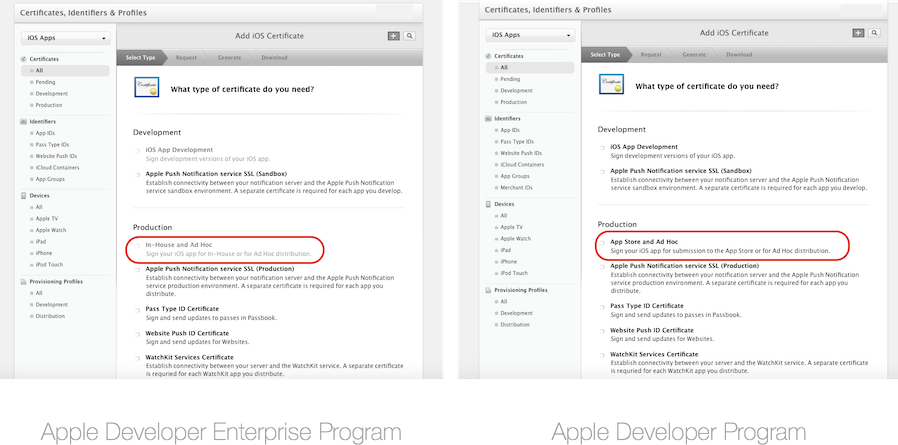
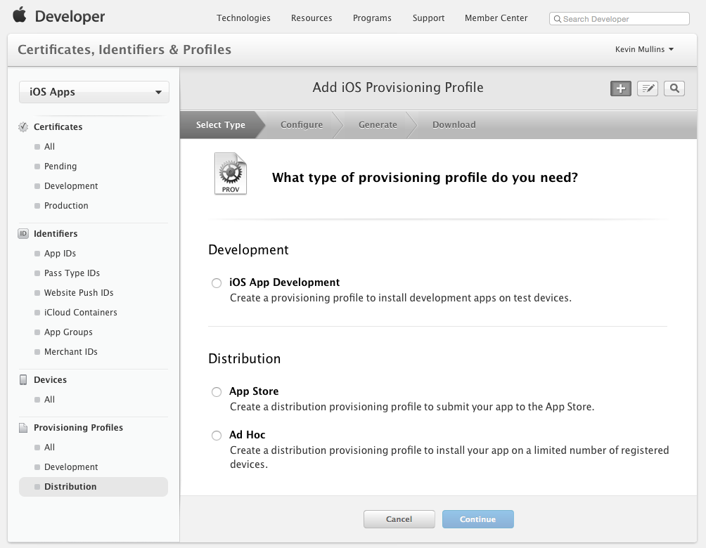
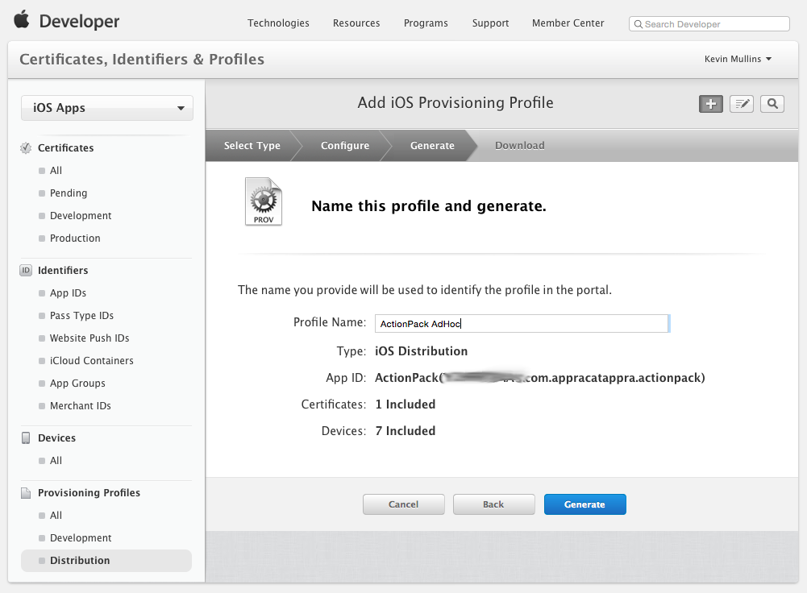
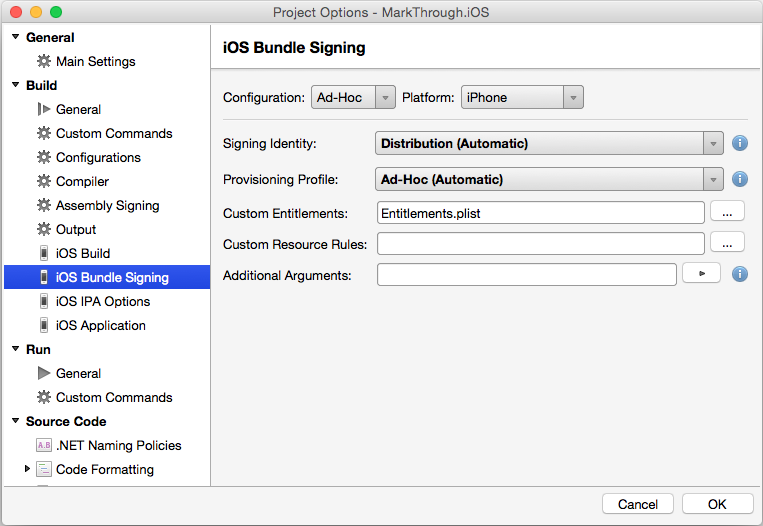
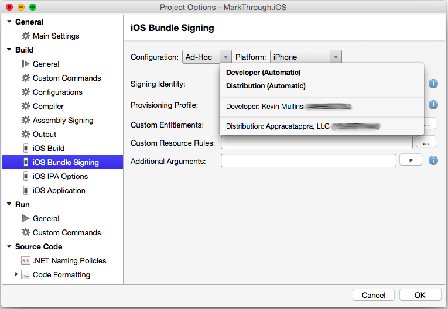
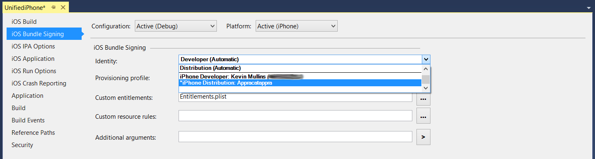

# Ad-Hoc Distribution for Xamarin.iOS Apps

_This document gives an overview of the Ad Hoc distribution techniques that are primarily used for testing an Xamarin.iOS applications with a wide group of people._

Once an Xamarin.iOS app has been developed, the next step in the software development lifecycle is to distribute the app to users for testing.

iTunes Connect is one option for managing app testing and is described more in the [TestFlight](~/ios/deploy-test/testflight.md) guide. However, members of the Apple Developer Enterprise Program do not have access to iTunes connect, so *Ad Hoc* distribution is the best method of testing these apps.

Xamarin.iOS applications can be user-tested via *ad hoc* distribution, which is available on both the Apple Developer Program and the Apple Developer Enterprise Program, and allows up to 100 iOS devices to be tested.

Ad hoc distribution has the advantage of not requiring App Store approval, and it can be installed over-the-air from a web server, or via iTunes. It is, however, limited to **100** devices per membership year, for both development and distribution, and these must be manually added in the Member Center by their UDID. For more information on adding devices, visit the [Device Provisioning](~/ios/get-started/installation/device-provisioning/manual-provisioning.md#adddevice) guide.

Ad hoc distribution requires that applications be provisioned using an Ad Hoc *provisioning profile* containing code signing information, as well as the identity of the application and the devices that can install the application.

This guide will provide information on Provisioning for Ad Hoc distribution, and information on how to distribute a Xamarin.iOS app.

## Setting Up for Distribution

Even if you plan to release a Xamarin.iOS application for In-House Deployment, for testing purposes, you'll need to build an Ad Hoc Distribution Provisioning Profile specific to it. This profile allows an application to be digitally signed for release so that it can be installed on an iOS device.

The next section will describe how to get set up with a Distribution Certificate and a Distribution Provisioning Profile.

> [!NOTE]
> Only Team Agents and Admins can create Distribution Certificates and Provisioning Profiles.

## Create a Distribution Certificate

1. Browse to the *Certificates, Identifiers & Profiles* section of the Apple Developer Member Center.
2. Under *Certificates*, select **Production**.
3. Click the **+** button to create a new Certificate.
4. Under the *Production* heading, select **In-House and Ad Hoc**, or **App Store and Ad Hoc**, depending on your program membership:

   

5. Click Continue, and follow the instructions to create a Certificate Signing Request via Keychain Access:

   

6. Once you have created the CSR as instructed, click Continue, and upload the CSR to the Member Center:

   

7. Click Generate to create a certificate.
8. Finally, Download the completed certificate and double-click on the file to install it.
9. At this point, the certificate should be installed on the machine, but you may need to [Refresh your profiles](~/ios/get-started/installation/device-provisioning/manual-provisioning.md#download) to ensure that they are visible in Xcode.

Alternatively, it is possible to request a Certificate via the Preferences dialog in Xcode. To do this, follow the steps below:

1. Select your team, and click **Manage Certificates…**:
    

2. Next, click the **plus (+)** button and select **iOS App Store**:
    

## Create a Distribution Provisioning Profile

### Create an App ID
As with any other Provisioning Profile you create, an App ID will be required to identify the App that will be distributed to the user's device. If you haven't already created this, follow the steps below to create one:

1. In the [Apple Developer Center](https://developer.apple.com/account/overview.action) browse to the *Certificate, Identifiers and Profiles* section. Select **App IDs** under **Identifiers**.
2. Click the **+** button and provide a **Name** which will identify it in the Portal.
3. The App prefix should be already set as your Team ID, and cannot be changed. Select either an Explicit or Wildcard App ID, and enter a Bundle ID in a reverse DNS format like:
    - **Explicit**: `com.[DomainName].[AppName]`
    - **Wildcard**: `com.[DomainName].*`
4. Select any [App Services](~/ios/get-started/installation/device-provisioning/manual-provisioning.md#provisioning-for-application-services) that your app requires.
5. Click the **Continue** button and follow the on screen instructions to create the new App ID.

Once you have the required components needed for creating a Distribution Profile, follow the steps below to create it:

1. Return to the Apple Provisioning Portal and select **Provisioning > Distribution**:
    

2. Click the **+** button and select the type of Distribution Profile that you want to create as **Ad-Hoc**:

    

3. Click the **Continue** button and select App ID from the dropdown list that you want to create a Distribution Profile for:

    

4. Click the **Continue** button and select distribution certificate required to sign the application:

    

5. Click the **Continue** button and enter a **Name** for the new Distribution Profile:

    

6. Click the **Generate** button to create the new profile and finalize the process.

# [Visual Studio for Mac](#tab/macos)

You may have to quit Visual Studio for Mac and have Xcode refresh its list of available Signing Identities and Provisioning Profiles (by following the instructions in the [Downloading Profiles and Certificates in Xcode](~/ios/get-started/installation/device-provisioning/manual-provisioning.md#download) section) before a new Distribution Profile is available in Visual Studio for Mac.

# [Visual Studio](#tab/windows)

You may have to quit Visual Studio and have Xcode (on the Build Host's Mac) refresh its list of available Signing Identities and Provisioning Profiles (by following the instructions in the [Downloading Profiles and Certificates in Xcode](~/ios/get-started/installation/device-provisioning/manual-provisioning.md#download) section) before a new Distribution Profile is available in Visual Studio.

-----

## Selecting a Distribution Profile in a Xamarin.iOS Project

When you are ready to do a final build of a Xamarin.iOS application, select the Distribution Profile that was created above.

# [Visual Studio for Mac](#tab/macos)

 In Visual Studio for Mac, do the following:

1. Double-click the project name in the **Solution Explorer** to open it for edit.
2. Select **iOS Bundle Signing** and the type of build from the **Configuration** dropdown:

    
3. In most cases, the **Signing Identity** and the **Provisioning Profile** can be left as a default values of **Automatic** and Visual Studio for Mac will choose the correct profile, based on the Bundle Identifier in the Info.plist:

    
4. If required, select the Signing Identity and Distribution Profile (the one created above) from the drop-downs:

    
5. Click the **OK** button to save the changes.

# [Visual Studio](#tab/windows)
 In Visual Studio, do the following:

1. Right-click the project name in the **Solution Explorer** and select **Properties** to open it for edit.
2. Select **iOS Bundle Signing** and the type of build from the **Configuration** dropdown:

    
3. In most cases, the **Signing Identity** and the **Provisioning Profile** can be left as a default values of **Automatic** and Visual Studio will choose the correct profile, based on the Bundle Identifier in the Info.plist:

    
4. If required, select the Signing Identity and Distribution Profile (the one created above) from the drop-downs:

    
5. Save the changes to the project's Properties.

-----

## Ad Hoc Distribution

While [TestFlight](~/ios/deploy-test/testflight.md) is a popular means of beta testing and distribution, it is part of iTunes Connect, and is therefore unavailable to members of the **Apple Developer Enterprise Program**.

Ad Hoc Distribution allows developers to beta test apps on a wide range of devices when iTunes connect is not an option. Ad-Hoc works in a similar way to In-House Distribution, and requires an IPA to be created, which can then be distributed either over-the-air, or manually via iTunes.

### IPA Support for Ad Hoc Deployment

Once provisioned, applications can be packaged into a file known as an *IPA*. This is a zip file that contains the application, along with additional metadata and icons. The IPA is used to add an application locally into iTunes so that it can be synced directly to a device that is included in the provisioning profile.

For more information on creating an IPA,
see [IPA Support](~/ios/deploy-test/app-distribution/ipa-support.md) guide.

## Summary

This article explained the Ad Hoc distribution mechanisms, which are required for testing Xamarin.iOS applications.

## Related Links

- [App Store Distribution](~/ios/deploy-test/app-distribution/app-store-distribution/index.md)
- [In-House Distribution](~/ios/deploy-test/app-distribution/in-house-distribution.md)
- [The iTunesMetadata.plist File](~/ios/deploy-test/app-distribution/itunesmetadata.md)
- [IPA Support](~/ios/deploy-test/app-distribution/ipa-support.md)
