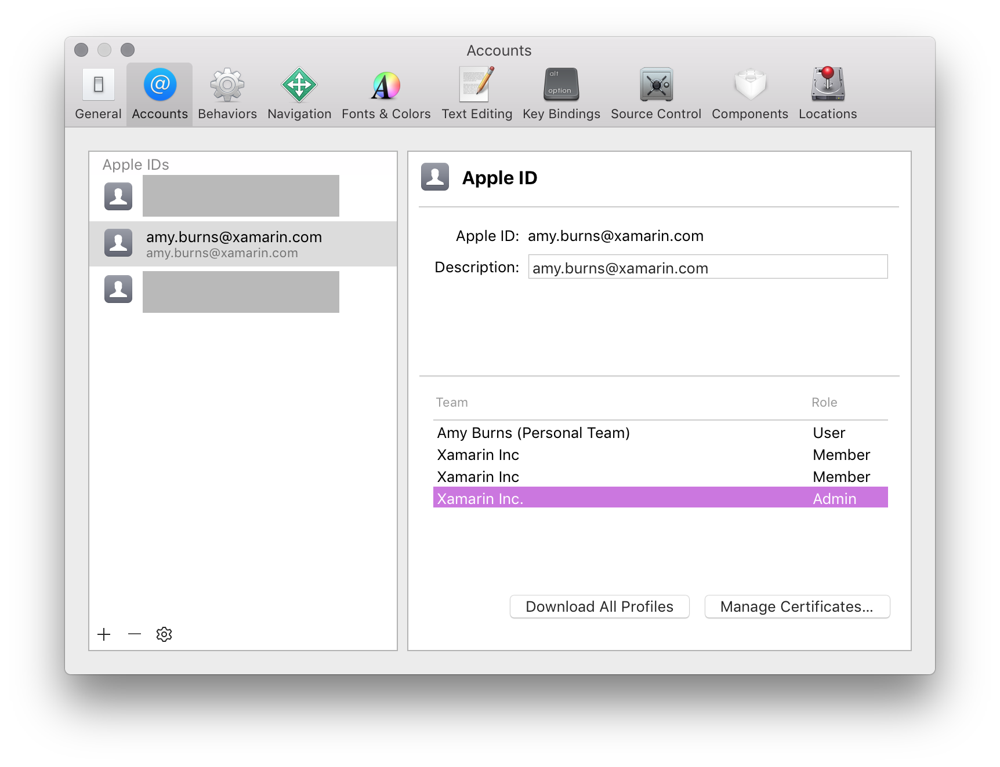
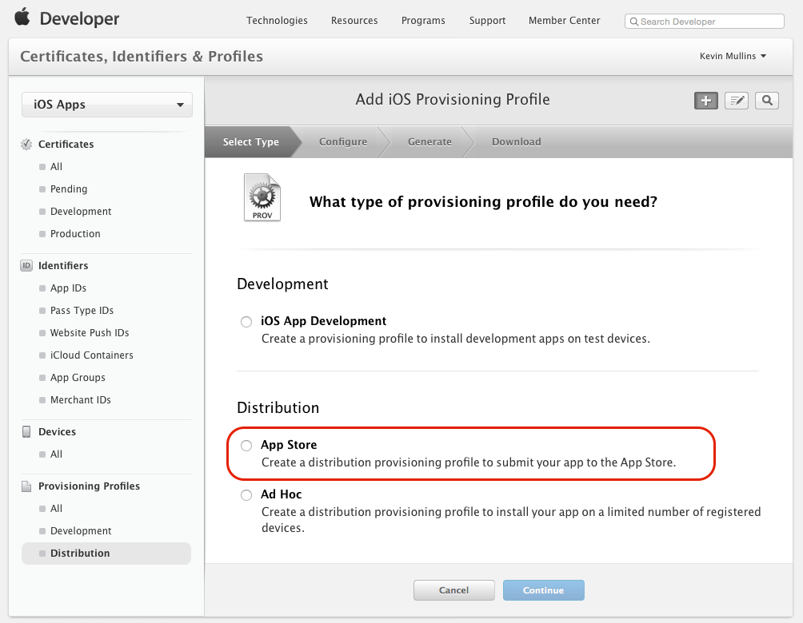
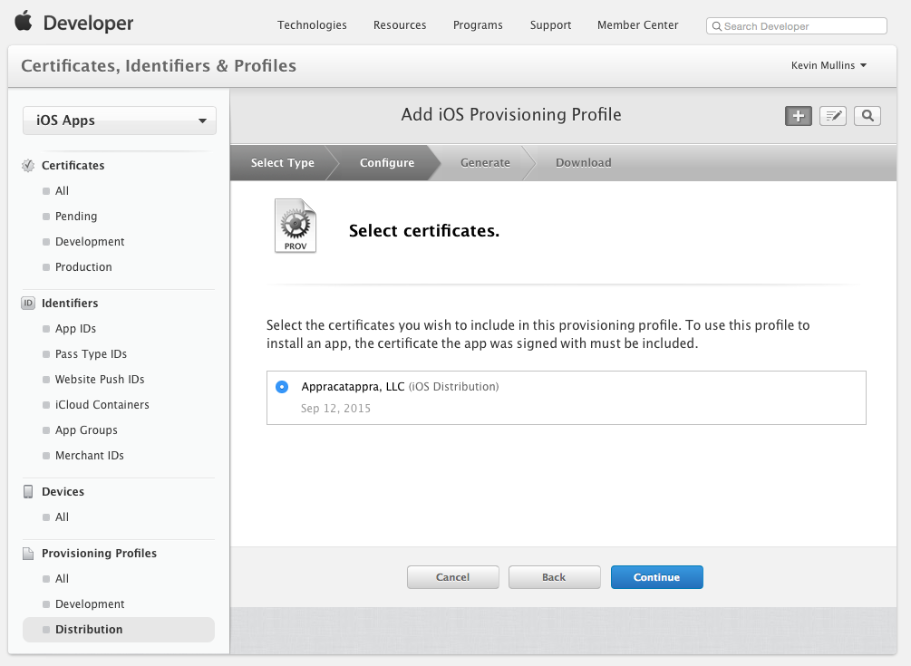
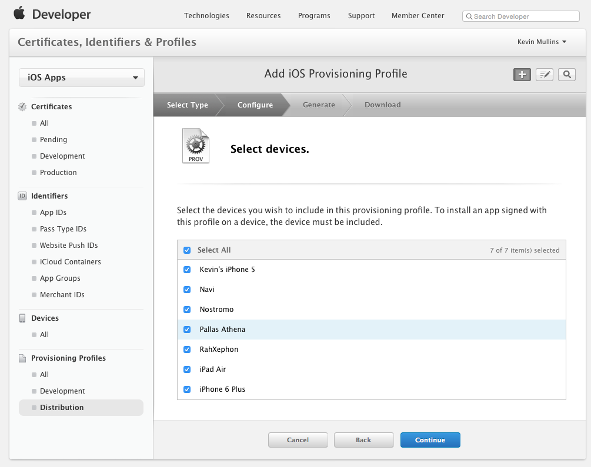
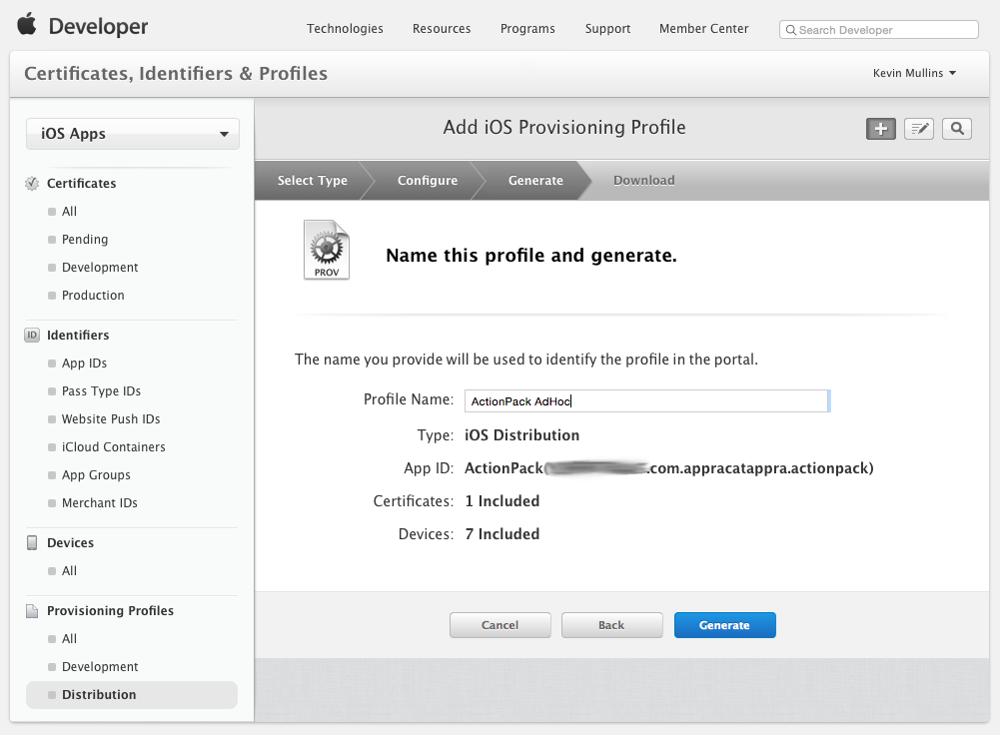
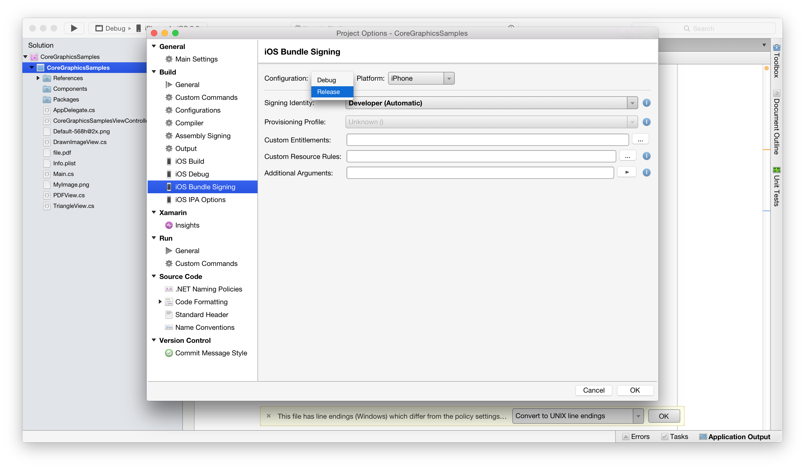
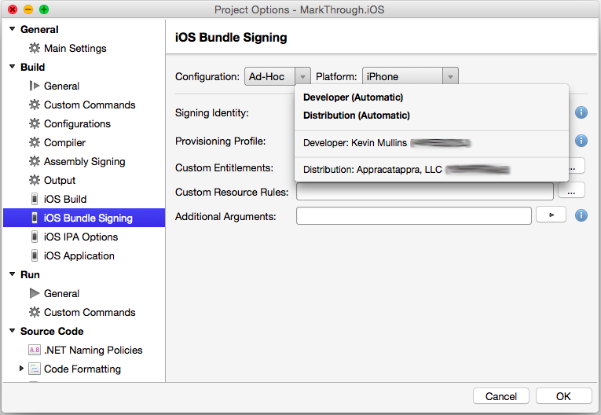
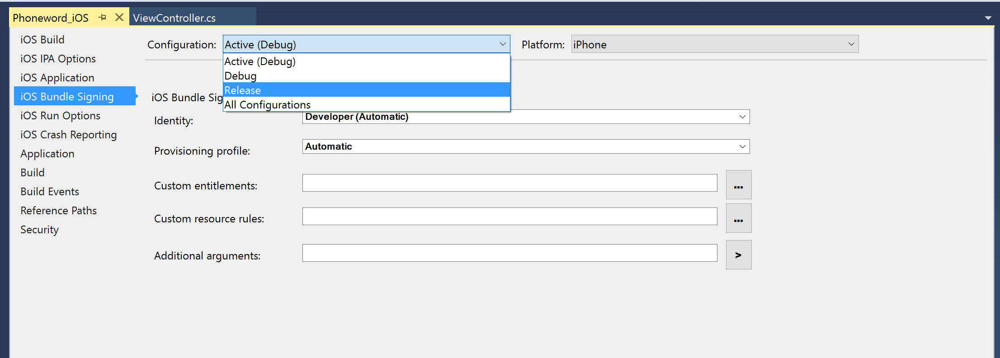

# App Store Distribution

Once a Xamarin.iOS app has been developed, the next step in the software development lifecycle is to distribute the app to users using the iTunes App Store. This is the most common way of distributing applications. By publishing an application in Apple’s App Store, it can be made available to consumers worldwide.

> [!IMPORTANT]
> Apple [has indicated](https://developer.apple.com/ios/submit/) that
> starting in March 2019, all apps and updates submitted to the App Store
> must have been built with the iOS 12.1 SDK or later, included in Xcode 10.1 or later.
> Apps should also support the iPhone XS and 12.9" iPad Pro screen sizes.

> [!IMPORTANT]
> If you are looking for resources in regard to the `UIWebView` deprecation warning (ITMS-90809) while using Xamarin.Forms, please refer to the [Xamarin.Forms WebView](~/xamarin-forms/user-interface/webview.md#uiwebview-deprecation-and-app-store-rejection-itms-90809) documentation.

Distributing an application – just as with developing an application – requires that applications be provisioned using the appropriate *provisioning profile*. Provisioning profiles are files that contain code signing information, as well as the identity of the application and the intended distribution mechanism. They also contain information about what devices the app can be deployed to for the non-App Store distribution.

> [!IMPORTANT]
> To use iTunes Connect, and therefore publish an app to the App Store, you **must** be part of either an individual or organizational Apple Developer Program. You will not be able to follow the steps on this page if you are a member of an Apple Developer **Enterprise** Program.

## Provisioning an App for App Store Distribution

Regardless of how you plan to release a Xamarin.iOS application, you'll need to build a *Distribution Provisioning Profile* specific to it. This profile allows the application to be digitally signed for release so that it can be installed on an iOS device. Similar to a Development provisioning profile, a Distribution Profile will contain the following:

- An App ID
- A Distribution Certificate

You can select the same **App ID** and **Devices** that you used for your development provisioning profile, but if you don't already have one, you will need to create a Distribution Certificate to identify your organization when submitting the app to the app store. The steps on how to create a Distribution Certificate are described in the section below.

> [!NOTE]
> Only Team Agents and Admins can create Distribution Certificates and Provisioning Profiles.

## Creating a Distribution Certificate

1. Browse to the *Certificates, Identifiers & Profiles* section of the Apple Developer Member Center.
2. Under *Certificates*, select **Production**.
3. Click the **+** button to create a new Certificate.
4. Under the *Production* heading, select **App Store and Ad Hoc**:

    
5. Click **Continue**, and follow the instructions to create a Certificate Signing Request via Keychain Access:

    
6. Once you have created the CSR as instructed, click **Continue**, and upload the CSR to the Member Center:

    

7. Click **Generate** to create the certificate.
8. Finally, **Download** the completed certificate and double-click on the file to install it.
9. At this point, the certificate should be installed on the machine, but you may need to [Refresh your profiles](~/ios/get-started/installation/device-provisioning/manual-provisioning.md#download), to ensure that they are visible in Xcode.

Alternatively, it is possible to request a Certificate via the Preferences dialog in Xcode. To do this, follow the steps below:

1. Select your team, and click **Manage Certificates…**:
    

2. Next, click the **Create** button next to **iOS Distribution Certificate**:
    

3. Depending on your team privileges, the signing identity will be generated, as shown below, or you may have to wait until a team agent or admin approves it:
    

## Creating a Distribution Profile

### Creating an App ID

As with any other Provisioning Profile you create, an App ID is required to identify the App that you are distributing to the user's device. If you haven't already created this, follow the steps below to create one:

1. In the [Apple Developer Center](https://developer.apple.com/account/overview.action) browse to the *Certificate, Identifiers and Profiles* section. Select **App IDs** under **Identifiers**.
2. Click the **+** button and provide a **Name** which will identify it in the Portal.
3. The App prefix should be already set as your Team ID, and cannot be changed. Select either an Explicit or Wildcard App ID, and enter a Bundle ID in a reverse DNS format like:
    - **Explicit**: com.[DomainName].[AppName]
    - **Wildcard**:com.[DomainName].*
4. Select any [App Services](~/ios/get-started/installation/device-provisioning/manual-provisioning.md#provisioning-for-application-services) that the app requires.
5. Click the **Continue** button and following the on screen instructions to create the new App ID.

### Creating a Provisioning Profile

Once you have the required components needed for creating a Distribution Profile, follow the steps below to create it:

1. Return to the Apple Provisioning Portal and select **Provisioning** > **Distribution**:

    

2. Click the **+** button and select the type of Distribution Profile that you want to create as **App Store**:

    

3. Click the **Continue** button and select App ID from the dropdown list that you want to create a Distribution Profile for:

    

4. Click the **Continue** button and select the certificate required to sign the application:

    

5. Click the **Continue** button and select the iOS devices that the Xamarin.iOS application will be allowed to run on:

    

6. Click the **Continue** button and enter a **Name** for the new Distribution Profile:

    

7. Click the **Generate** button to create the new profile and finalize the process.

# [Visual Studio for Mac](#tab/macos)

 You may have to quit Visual Studio for Mac and have Xcode refresh its list of available Signing Identities and Provisioning Profiles (by following the instructions in the [Requesting Signing Identities](~/ios/get-started/installation/device-provisioning/manual-provisioning.md#download) section) before a new Distribution Profile is available in Visual Studio for Mac.

# [Visual Studio](#tab/windows)

 You may have to quit Visual Studio and have Xcode (on the Build Host's Mac) refresh it's list of available Signing Identities and Provisioning Profiles (by following the instructions in the [Requesting Signing Identities](~/ios/get-started/installation/device-provisioning/manual-provisioning.md#download) section) before a new Distribution Profile is available in Visual Studio.

-----

## Selecting a Distribution Profile in a Xamarin.iOS Project

When you are ready to do a final build of a Xamarin.iOS application for sale in the iTunes App Store, select the Distribution Profile that was created above.

# [Visual Studio for Mac](#tab/macos)

 In Visual Studio for Mac, do the following:

1. Double-click the project name in the **Solution Explorer** to open it for edit.
2. Select **iOS Bundle Signing** and **Release | iPhone** from the **Configuration** dropdown:

    
3. In most cases, the **Signing Identity** and the **Provisioning Profile** can be left as their default values of **Automatic** and Visual Studio for Mac will choose the correct profile, based on the Bundle Identifier in the Info.plist:

    
4. If required, select the Signing Identity and Distribution Profile (the one created above) from the drop-downs:

    
5. Click the **OK** button to save the changes.

# [Visual Studio](#tab/windows)

 In Visual Studio, do the following:

1. Right-click the project name in the **Solution Explorer** and select **Properties** to open it for edit.
2. Select **iOS Bundle Signing** and **Release | iPhone** from the **Configuration** dropdown:

    
3. In most cases, the **Signing Identity** and the **Provisioning Profile** can be left as their default values of **Automatic** and Visual Studio will choose the correct profile, based on the Bundle Identifier in the Info.plist

    
4. If required, select the Signing Identity and Distribution Profile (the one created above) from the drop-downs:

    
5. Save the changes to the project's Properties.

-----

## Configuring your Application in iTunes Connect

Once the application is successfully been provisioned, the next step is to configure the apps in [iTunes Connect](https://itunesconnect.apple.com/WebObjects/iTunesConnect.woa), which is a suite of web based tools for, among other things, managing iOS applications in the App Store.

Your Xamarin.iOS application will need to be properly setup and configured in iTunes Connect before it can be submitted to Apple for review and ultimately, be released for sale or as a free app in the App Store.

For more details, please see our [Configuring an App in iTunes Connect](~/ios/deploy-test/app-distribution/app-store-distribution/itunesconnect.md) documentation.

## Submitting an App to iTunes Connect

Once the application is signed using the Distribution Provisioning Profile and the app is created in iTunes Connect, the application binary is uploaded to Apple for review. Upon a successful review by Apple, it is made available in the App Store.

For more information on publishing applications to the App Store, see [Publishing to the App Store](~/ios/deploy-test/app-distribution/app-store-distribution/publishing-to-the-app-store.md).

## Automatically copy .app bundles back to Windows

[!include]

## Summary

This article covered the key components in preparing a Xamarin.iOS application for distribution in the App Store.

## Related Links

- [Configuring an App in iTunes Connect](~/ios/deploy-test/app-distribution/app-store-distribution/itunesconnect.md)
- [Publishing to the App Store](~/ios/deploy-test/app-distribution/app-store-distribution/publishing-to-the-app-store.md)
- [In-House Distribution](~/ios/deploy-test/app-distribution/in-house-distribution.md)
- [Ad Hoc Distribution](~/ios/deploy-test/app-distribution/ad-hoc-distribution.md)
- [The iTunesMetadata.plist File](~/ios/deploy-test/app-distribution/itunesmetadata.md)
- [IPA Support](~/ios/deploy-test/app-distribution/ipa-support.md)
