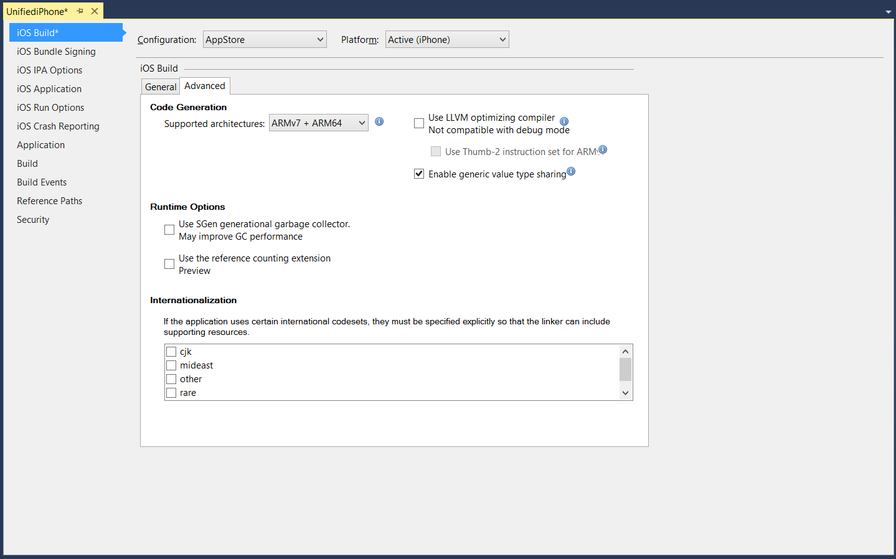
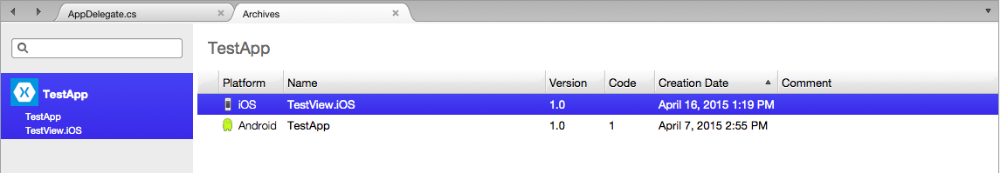
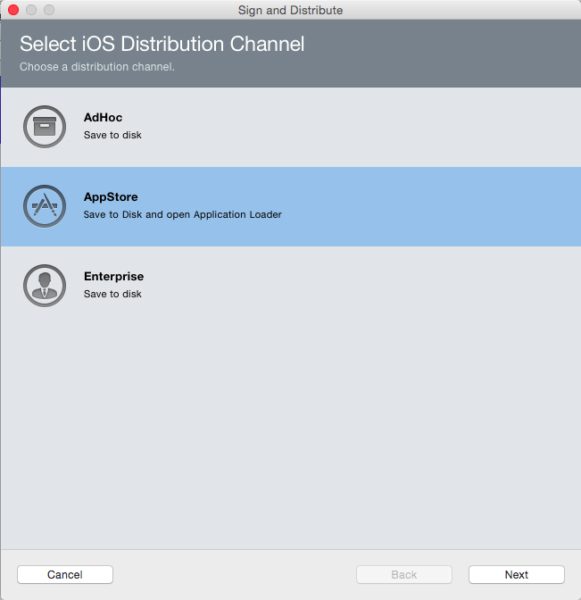
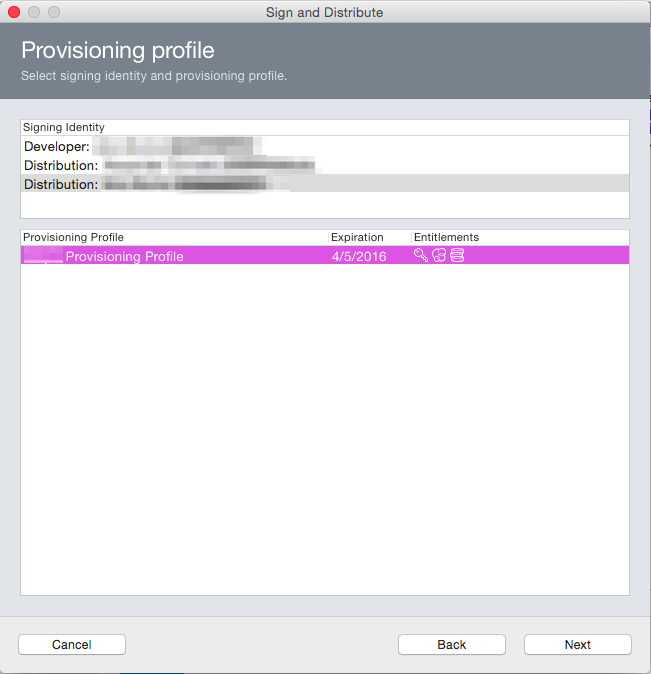
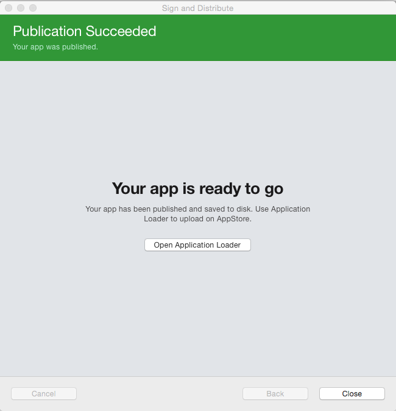
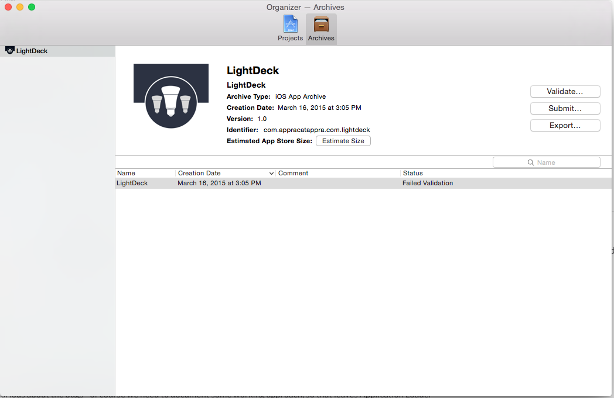
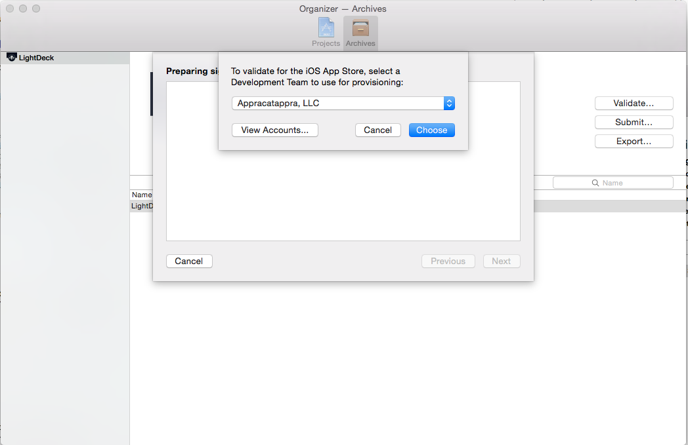
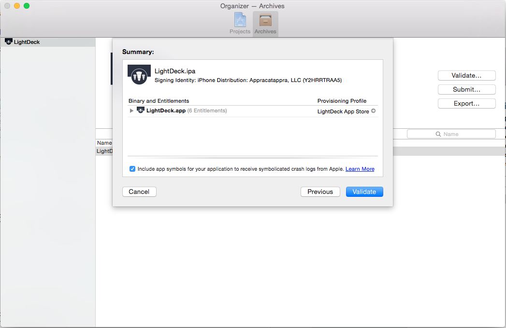
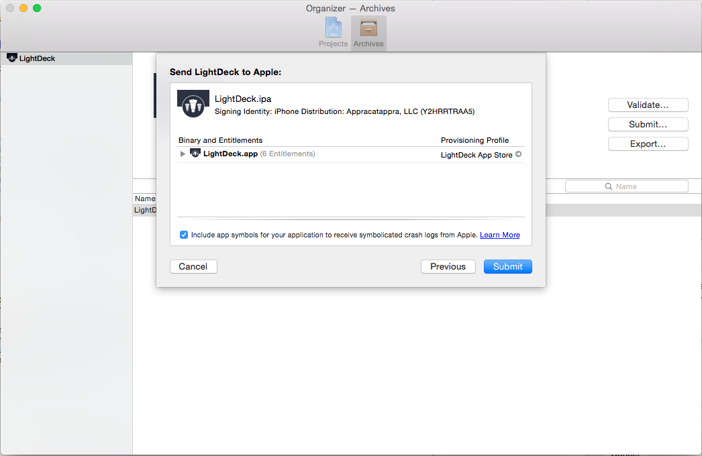

# Publishing Xamarin.iOS Apps to the App Store

In order distribute applications to all iOS devices, Apple requires apps to be published through the *App Store*, making the App Store the one-stop shopping location for iOS applications. With over 500,000 applications in the store, developers of many types of applications capitalized on the massive success of this single point of distribution. The App Store is a turnkey solution, offering app developers both distribution and payment systems.

The process of submitting an application to the App Store involves:

1. Creating an **App ID** and selecting **Entitlements**.
2. Creating a  **Distribution Provisioning Profile**.
3. Using this profile to build your application.
4. Submitting your application through  **iTunes Connect**.


This article covers all the steps needed to provision, build, and submit an application for App Store distribution.

## Before You Submit an Application

After you submit an app for publication to the App Store, it  goes through a review process by Apple to insure that it meets Apple’s guidelines for quality and content. If your application fails to meet these guidelines, Apple will reject it, at which time you will need to address the non-conformance cited by Apple, and then resubmit.
Therefore, you stand the best chance of making it through Apple review by familiarizing yourself with these guidelines and trying to adapt your application to them. Apple’s guidelines are available at: [App Store Review Guidelines](https://developer.apple.com/appstore/resources/approval/guidelines.html).

A couple of things to watch out for when submitting an app are:

1. Make sure the application’s description matches the functionality included in the app.
2. Test that the application doesn’t crash under normal usage. This includes usage on every iOS device you support.


Apple also maintains a list of App Store submission tips. You can read these at [Distributing on the App Store](https://developer.apple.com/appstore/resources/submission/tips.html).

## Configuring your Application in iTunes Connect

[iTunes Connect](https://itunesconnect.apple.com/WebObjects/iTunesConnect.woa) is a suite of web based tools for, among other things, managing your iOS applications on the App Store. Your Xamarin.iOS application will need to be properly setup and configured in iTunes Connect before it can be submitted to Apple for review and ultimately, be released for sale or as a free app in the App Store.

Do the following:

1. Verify that the proper agreements are in place and up to date in the **Agreements, Tax, and Banking** section of iTunes Connect to release an iOS application for free or for sale.
2. Create a new **iTunes Connect Record** for the application and specify its **Display Name** (as seen in the App Store).
3. Select a **Sale Price** or specify that the application will be released for free.
5. Provide a clear, succinct **Description** of the application including its features and benefit to the end user.
6. Provide **Categories**, **Sub Categories**, and **Keywords** to help the user find your app in the App Store.
7. Provide **Contact** and **Support** URLs to your website required by Apple.
8. Set your application's **Rating**, which is used by parental controls on the App Store.
9. Configure optional App Store technologies, such as **Game Center** and **In-App Purchase**.

For more details, please see our [Configuring an App in iTunes Connect](~/ios/deploy-test/app-distribution/app-store-distribution/itunesconnect.md) documentation.

## Preparing for App Store Distribution

To publish an application to the App Store, you first need to build it for distribution, which involves many steps. The following sections covers everything required to prepare a Xamarin.iOS application for publication so that it can be built and submit it to the App Store for review and release.

### Provisioning for Application Services

Apple provides a selection of special Application Services, also called entitlements, that can be activated for your iOS application when you create a unique ID for it. Whether you are using custom entitlements or not, you'll still need to create a unique ID for your Xamarin.iOS application before it can be published on the App Store.

Creating an App ID and optionally selecting entitlements involves the following steps using Apple's web-based iOS Provisioning Portal:

1. In the **Certificates, Identifiers & Profiles** section select **Identifiers** > **App ID**.
2. Click the **+** button and provide a **Name** and **Bundle ID** for the new application.
3. Scroll to the bottom of the screen and select any **App Services** that will be required by your Xamarin.iOS application.
4. Click the **Continue** button and following the on-screen instructions to create the new App ID.

In addition to selecting and configuring the required Application Services when defining your App ID, you also need to configure the App ID and entitlements in your Xamarin.iOS project by editing both the `Info.plist` and `Entitlements.plist` files.

Do the following:

1. In the **Solution Explorer**, double-click the `Info.plist` file to open it for editing.
2. In the **iOS Application Target** section, fill in a name for your application and enter the **Bundle Identifier** that you created when you defined the App ID.
3. Save the changes to the `Info.plist` file.
4. In the **Solution Explorer**, double-click the `Entitlements.plist` file to open it for editing.
5. Select and configure the entitlements required for you Xamarin.iOS application so that they match the setup you performed above when you defined the App ID.
6. Save the changes to the `Entitlements.plist` file.

For detailed instructions, please see our [Provisioning for Application Services](~/ios/get-started/installation/device-provisioning/manual-provisioning.md#appservices) documentation.

### Setting the Store Icons

Application Store icons should now be delivered by an asset catalog. To add an App Store icon, first locate the **AppIcon** image set in the **Assets.xcassets** file of your project.

The required icon in the Asset Catalog is named **App Store** and should be **1024 x 1024** in size. Apple have stated that the app store icon in the asset catalog can't be transparent nor contain an alpha channel.

For information on setting the store icon refer to the [App Store Icon](~/ios/app-fundamentals/images-icons/app-store-icon.md) guide.

### Setting the Apps Icons and Launch Screens

For an iOS application to be accepted by Apple for inclusion in the App Store, it requires proper icons and launch screens for all of the iOS devices that it will be running on. App icons are added to your projects in an asset catalog, through an **AppIcon** image set in the **Assets.xcassets** file. Launch screens are added through a Storyboard.

For detailed instructions on creating app icons and launch screens, see the [Application Icon](~/ios/app-fundamentals/images-icons/app-icons.md) and [Launch Screens](~/ios/app-fundamentals/images-icons/launch-screens.md) guides.

### Creating and Installing a Distribution Profile

iOS uses *provisioning profiles* to control how a particular application build can be deployed. These are files that contain information about the certificate used to sign an app, the *Application ID*, and where the app can be installed. For development and ad-hoc distribution, the provisioning profile also includes the list of allowed devices to which you can
deploy the app. However, for App Store distribution, only certificate and app ID information are included, since the only mechanism for public distribution is through the App Store.

Provisioning involves the following steps using Apple's web based iOS Provisioning Portal:

1.  Select **Provisioning** > **Distribution**.
2.  Click the **+** button and select the type of Distribution Profile that you want to create as **App Store**.
3.  Select **App ID** from the dropdown list that you want to create a Distribution Profile for.
4.  Select a valid Production (Distribution) certificate to sign the application.
5.  Enter a **Name** for the new **Distribution Profile** and generate the profile.
6.  On the Mac, open to Xcode and browse to **Preferences > [select your Apple ID]> View Details...**. Download All available profiles in Xcode on the Mac.
7.  Return to the IDE and under the **iOS Bundle Signing** options select the Distribution Provisioning Profile for the correct _Build Configuration_ (This will either be **App Store** or **Release**).

For detailed instructions, please see the [Creating a Distribution Profile](~/ios/get-started/installation/device-provisioning/manual-provisioning.md#provisioningprofile) and [Selecting a Distribution Profile in a Xamarin.iOS Project](~/ios/deploy-test/app-distribution/app-store-distribution/index.md#selectprofile).

## Setting the Build Configuration for your Application

# [Visual Studio for Mac](#tab/vsmac)

Do the following:

1. Right-click on the **Project Name** in the **Solution Pad** and selection **Option** to open them for editing.
2. Select **iOS Build** and select **Release | iPhone** from the **Configuration** dropdown:

	

3. If you have a specific iOS version that you are targeting, you can select it from the **SDK version** dropdown list, else leave this value at the default setting.
4. Linking reduces the overall size of your application's distributable by stripping out unused Methods, Properties, Classes, etc. and in most cases should be left to the default value of **Link SDK assemblies only**. In some situations, such as when using some specific 3rd party libraries, you may be forced to set this value to **Don't link** to keep required elements from being removed. For more information, refer to the [iOS Build Mechanics](~/ios/deploy-test/ios-build-mechanics.md) guide.
5. The **Optimize PNG image files for iOS** checkbox should be checked as this will help to further decrease your application's deliverable size.
6. Debugging should _not_ be enabled as it will make the build unnecessarily large.
8. For iOS 11, you'll need to select one of the device architectures that supports **ARM64**. For more information on building for 64 bit iOS devices, please see the **Enabling 64 Bit Builds of Xamarin.iOS Apps** section of the [32/64 bit Platform Considerations](~/cross-platform/macios/32-and-64/index.md) documentation.
9. You may wish to optionally use the **LLVM** compiler which creates smaller and faster code, however it will take longer to compile.
10. Based on your application's needs, you may also wish to adjust the type of **Garbage Collection** being used and setup for **Internationalization**.
11. Save your changes to the build configuration.

# [Visual Studio](#tab/vswin)

By default, when you create a new Xamarin.iOS application in Visual Studio, _Build Configurations_ are automatically created for both **Ad Hoc** and **App Store** deployment. Before doing the final build of your application that you will be submitting to Apple, there are a few modification that you will need to make to the base configuration.

Do the following:

1. Right-click on the **Project Name** in the **Solution Explorer** and selection **Properties** to open them for editing.
2. Select **iOS Build** and **AppStore** (or **Release** if AppStore is not available) from the **Configuration** dropdown:

	

3. If you have a specific iOS version that you are targeting, you can select it from the **SDK version** dropdown list, else leave this value at the default setting.
4. Linking reduces the overall size of your application's distributable by stripping out unused Methods, Properties, Classes, etc. and in most cases should be left to the default value of **Link SDK assemblies only**. In some situations, such as when using some specific 3rd party libraries, you may be forced to set this value to **Don't link** to keep required elements from being removed. For more information, refer to the [iOS Build Mechanics](~/ios/deploy-test/ios-build-mechanics.md) guide.
5. The **Optimize PNG image files for iOS** checkbox should be checked as this will help to further decrease your application's deliverable size.
6. Debugging should _not_ be enabled as it will make the build unnecessarily large.
7. Click on the **Advanced** tab:

	

8. If your Xamarin.iOS application is targeting iOS 8 and 64 bit iOS devices, you'll need to select one of the device architectures that supports **ARM64**. For more information on building for 64 bit iOS devices, please see the **Enabling 64 Bit Builds of Xamarin.iOS Apps** section of the [32/64 bit Platform Considerations](~/cross-platform/macios/32-and-64/index.md) documentation.
9. You may wish to optionally use the **LLVM** compiler which creates smaller and faster code, however it will take longer to compile.
10. Based on your application's needs, you may also wish to adjust the type of **Garbage Collection** being used and setup for **Internationalization**.
11. Save your changes to the build configuration.

-----

## Building and Submitting the Distributable

With your Xamarin.iOS application properly configured, you are now ready to do the final distribution build that you will be submitting to Apple for review and release.

# [Visual Studio for Mac](#tab/vsmac)

### Build your Archive

1. Select the **Release | Device** configuration in Visual Studio for Mac:

	
1. From the **Build** menu, select **Archive for Publishing**:

	

1. Once the archive has been created, the **Archives** view will be displayed:

	


> [!NOTE]
> While the old _App Store_ and _Ad Hoc_ configurations have now been removed from all of the Visual Studio for Mac template projects, you may find that older projects still include these configurations. If this is the case, you can continue to use the **App Store | Device** configuration in step 1 of the list above.

### Sign and Distribute your App

 Each time you build your application for Archive, it will automatically open the **Archives View**, displaying all archived projects; grouped by solution. By default this view only shows the current, open solution. To see all solutions that have archives, click on the **Show all archives** option.

 It is recommended that archives deployed to customers (either App Store or Enterprise deployments) be kept, so that any debug information that is generated can be symbolized at a later date.

 To sign your app and prepare it for distribution:


1. Select **Sign and Distribute...**, illustrated below:

	

1. This will open the publishing wizard. Select the **App Store** distribution channel to create a package, and open Application Loader:

	

1. On the Provisioning Profile screen, select your signing identity and corresponding provisioning profile, or re-sign with another identity:

	

1. Verify the details of your package, and click **Publish** to save your `.ipa` package:

	

1. Once your `.ipa` has been saved, your App is ready to be uploaded to iTunes Connect via the Application Loader:

	

# [Visual Studio](#tab/vswin)

The Xamarin plugin for Visual Studio does not currently support the Archiving workflow for publishing iOS applications to the App Store. As a result, you have upload an IPA created via the **Build Ad hoc IPA** command, which is described below.


## Build an IPA

 This section describes building an IPA, similar to the workflow when using Ad Hoc or Enterprise Distribution. However, it will be signed using the App Store provisioning profile that was created above.

 Do the following:

1. In the **Solution Explorer**, right-click the Xamarin.iOS project name and select **Properties** to open them for editing:

	
1. Select **iOS Bundle Signing** and change the provisioning profile to an App Store provisioning profile:

	
1. Select **iOS IPA Options** and select **Ad-Hoc** from the **Configuration** dropdown list (If Ad-Hoc does not appear, select **Release** instead):

	

1. You can optionally specify a **Package Name** for the IPA, if not specified it will have the same name as the Xamarin.iOS project.
1. Save your changes to the Project Properties.
1. Select **Ad Hoc** from the Visual Studio for Mac **Build Configuration** dropdown:

	
1. Build the project to create the IPA package.
1. The IPA will be built in the `Bin` > _iOS Device_ > `Ad Hoc` folder:

	

-----


## Customizing the IPA Location

A new **MSBuild** property `IpaPackageDir` has been added to make it easy to customize the `.ipa` file output location. If `IpaPackageDir` is set to a custom location, the `.ipa` file will be placed in that location instead of the default timestamped subdirectory. This can be useful when creating automated builds that rely on a specific directory path to work correctly, such as those used for Continuous Integration (CI) builds.

There are several possible ways to use the new property:

For example, to output the `.ipa` file to the old default directory (as in Xamarin.iOS 9.6 and lower), you can set the `IpaPackageDir` property to `$(OutputPath)` using one of the following approaches. Both approaches are compatible with all Unified API Xamarin.iOS builds, including IDE builds as well as command line builds that use `xbuild`, `msbuild`, or `mdtool`:

  - The first option is to set the `IpaPackageDir` property within a `<PropertyGroup>` element in an **MSBuild** file. For example, you could add the following `<PropertyGroup>` to the bottom of the iOS app project `.csproj` file (just before the closing `</Project>` tag):

      ```xml
        <PropertyGroup>
            <IpaPackageDir>$(OutputPath)</IpaPackageDir>
        </PropertyGroup>
      ```
  - A better approach is to add a `<IpaPackageDir>` element to the bottom of the existing `<PropertyGroup>` that corresponds to the configuration used to build the `.ipa` file. This is better because it will prepare the project for future compatibility with a planned setting on the iOS IPA Options project properties page. If you currently use the `Release|iPhone` configuration to build the `.ipa` file, the complete updated property group might look similar to the following:

      ```xml
      <PropertyGroup Condition=" '$(Configuration)|$(Platform)' == 'Release|iPhone' )
        <Optimize>true</Optimize>
        <OutputPath>bin\iPhone\Release</OutputPath>
        <ErrorReport>prompt</ErrorReport>
        <WarningLevel>4</WarningLevel>
        <ConsolePause>false</ConsolePause>
        <CodesignKey>iPhone Developer</CodesignKey>
        <MtouchUseSGen>true</MtouchUseSGen>
        <MtouchUseRefCounting>true</MtouchUseRefCounting>
        <MtouchFloat32>true</MtouchFloat32>
        <CodesignEntitlements>Entitlements.plist</CodesignEntitlements>
        <MtouchLink>SdkOnly</MtouchLink>
        <MtouchArch>;ARMv7, ARM64</MtouchArch>
        <MtouchHttpClientHandler>HttpClientHandler</MtouchHttpClientHandler>
        <MtouchTlsProvider>Default</MtouchTlsProvider>
        <PlatformTarget>x86&</PlatformTarget>
        <BuildIpa>true</BuildIpa>
        <IpaPackageDir>$(OutputPath</IpaPackageDir>
      </PropertyGroup>
      ```
An alternate technique for `msbuild` or `xbuild` command line builds is to add a `/p:` command line argument to set the `IpaPackageDir` property. In this case note that `msbuild` does not expand `$()` expressions passed in on the command line, so it is not possible to use the `$(OutputPath)` syntax. You must instead provide a full path name. Mono's `xbuild` command does expand `$()` expressions, but it is still preferable to use a full path name because `xbuild` will eventually be deprecated in favor of the [cross-platform version of `msbuild`](http://www.mono-project.com/docs/about-mono/releases/4.4.0/#msbuild-preview-for-os-x) in future releases. A complete example that uses this approach might look similar to the following on Windows:

```bash
msbuild /p:Configuration="Release" /p:Platform="iPhone" /p:ServerAddress="192.168.1.3" /p:ServerUser="macuser" /p:IpaPackageDir="%USERPROFILE%\Builds" /t:Build SingleViewIphone1.sln
```

Or the following on Mac:

```bash
xbuild /p:Configuration="Release" /p:Platform="iPhone" /p:IpaPackageDir="$HOME/Builds" /t:Build SingleViewIphone1.sln
```

With your distribution build created and archived, you are now ready to submit your application to iTunes Connect.

### Automatically copy .app bundles back to Windows

[!include[](~/ios/includes/copy-app-bundle-to-windows.md)]

## Submitting Your App to Apple

> [!NOTE]
> Apple has recently changed its verification process for iOS applications, and may reject apps with the `iTunesMetadata.plist` included in the IPA. If you encounter the error `ERROR: ERROR ITMS-90047: "Disallowed paths ( "iTunesMetadata.plist" ) found at: Payload/iPhoneApp1.app"`the workaround described [here](https://forums.xamarin.com/discussion/40388/disallowed-paths-itunesmetadata-plist-found-at-when-submitting-to-app-store/p1) should resolve the issue.

With the distribution build completed, you are ready to submit your iOS application to Apple for review and release on the App Store.

# [Visual Studio for Mac](#tab/vsmac)

 Do the following:

1. Start **Xcode**.
2. From the **Window** menu select **Organizer**.
3. Click on the **Archives** tab and select the archive that was built above:

	
4. Click on the **Validate...** button.
5. Select the account to verify against and click the **Choose** button:

	
6. Click the **Validate** button:

	
7. If there were any issues with the bundle, they will be displayed.
8. Correct any issues and rebuild the archive in Visual Studio for Mac.
9. Click on the **Submit...** button.
10. Select the account to verify against and click the **Choose** button:

	
11. Click the **Submit** button:

	
12. Xcode will inform you when it is finished uploading the file to iTunes Connect.


The archive workflow in Visual Studio for Mac will open Application Loader automatically, once you have saved the _.ipa_:

# [Visual Studio](#tab/vswin)

Submitting your application to Apple for review is done by using the Application Loader app. These steps must be done on the Mac build host. You can download a copy of the Application Loader from [here](https://itunesconnect.apple.com/apploader/ApplicationLoader_3.0.dmg).

-----

1. Select *Deliver Your App* and click the *Choose* button:

	[](publishing-to-the-app-store-images/publishvs01.png#lightbox)

2. Select the zip or IPA file you created above and click the **OK** button.

3. The Application Loader will validate the file:

	[](publishing-to-the-app-store-images/publishvs02.png#lightbox)
4. Click the *Next* button and the application will be validated against the App Store:

	[](publishing-to-the-app-store-images/publishvs03.png#lightbox)
5. Click the **Send** button to send the application to Apple for review.
6. The Application Loader will inform you when the file has been successfully uploaded.

## iTunes Connect Status

If you log back into iTunes Connect and select your application from the list of available apps, the status in iTunes Connect should now show that it is **Waiting for Review** (it may temporarily read **Upload Received** while it is processed):

[](publishing-to-the-app-store-images/image21.png#lightbox)

## Summary

This article presented a step-by-step guide to configuring, building, and submitting an application for App Store publication. First, it covered the steps needed to create and install a distribution provisioning profile. Next, it walked through how to use Visual Studio and Visual Studio for Mac to create a distribution build. Finally, it showed you how to use iTunes Connect and the tool to submit an application to the App Store.


## Related Links

- [Working with Images](~/ios/app-fundamentals/images-icons/index.md)
- [iOS App Development Workflow Guide: Distributing Applications](http://developer.apple.com/library/ios/#documentation/Xcode/Conceptual/ios_development_workflow/35-Distributing_Applications/distributing_applications.html)
- [App Store Submission Tips](https://developer.apple.com/appstore/resources/submission/tips.html)
- [Common App Rejections](https://developer.apple.com/app-store/review/rejections/)
- [App Store Review Guidelines](https://developer.apple.com/appstore/resources/approval/guidelines.html)
