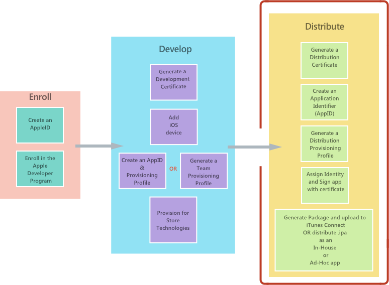

# Xamarin.iOS app distribution overview

_This document gives an overview of the distribution techniques that are available for Xamarin.iOS applications and serves as a pointer to more detailed documents on the topic._

Once an Xamarin.iOS app has been developed, the next step in the software development lifecycle is to distribute the app to users, as shown in the highlighted section of the diagram below:

Apple provides the following ways to distribute an iOS application:

- [**App Store**](#app-store-distribution)
- [**In-house (enterprise)**](#in-house-distribution)
- [**Ad hoc**](#ad-hoc-distribution)
- [**Custom apps for business**](#custom-apps-for-business)

All these scenarios require that applications be provisioned using the appropriate *provisioning profile*. Provisioning profiles are files that contain code signing information, as well as the identity of the application and the intended distribution mechanism. For the non-App Store distribution they also contain information about what devices the app can be deployed to.

## App Store distribution

> [!IMPORTANT]
> Apple [has indicated](https://developer.apple.com/ios/submit/) that
> starting in March 2019, all apps and updates submitted to the App Store
> must have been built with the iOS 12.1 SDK or later, included in Xcode 10.1 or later.
> Apps should also support the iPhone XS and 12.9" iPad Pro screen sizes.

This is the main way that iOS applications are distributed to consumers on iOS devices. All apps submitted to the App Store require approval by Apple.

Apps are submitted to the App Store through a portal called *iTunes Connect*. The [Configure your App in iTunes Connect](~/ios/deploy-test/app-distribution/app-store-distribution/itunesconnect.md) guide provides more information on how to set up and use this portal to prepare a Xamarin.iOS app for publishing in the App Store.

It is important to note that only developers who belong to the **Apple Developer Program** have access to iTunes Connect. Members of the **Apple Developer Enterprise Program** do not have access.

For more information, please visit the [App Store Distribution](~/ios/deploy-test/app-distribution/app-store-distribution/index.md) guide.

## In-house distribution

Sometimes called *Enterprise Distribution*, in-house distribution allows members of the **Apple Developer Enterprise Program** to distribute apps internally to other members of the same organization. In-house distribution has the advantages of not requiring an App Store review, and having no limit on the number of devices on which an application can be installed. However, it is important to note that **Apple Developer Enterprise Program** members do **not** have access to iTunes Connect, and therefore the licensee is responsible for distributing the app.

For more information on getting set-up and how to distribute an application In-House, please refer to the [In-House distribution guide](~/ios/deploy-test/app-distribution/in-house-distribution.md).

## Ad-hoc distribution

Xamarin.iOS applications can be user-tested via ad hoc distribution, which is available on both the **Apple Developer Program**, and the **Apple Developer Enterprise Program**, and allows up to 100 iOS devices to be tested. The best use case for ad hoc distribution is distribution within a company when iTunes Connect is not an option.

For more information on getting set-up and how to distribute an application In-House, please refer to the [Ad-hoc distribution guide](~/ios/deploy-test/app-distribution/ad-hoc-distribution.md).

## Custom apps for business

Apple allows [custom distribution](https://developer.apple.com/business/custom-apps/) of apps to businesses and education. Review the [Apple Business Manager User Guide](https://support.apple.com/guide/apple-business-manager/welcome/web) for information.

## Related links

- [App Store distribution](~/ios/deploy-test/app-distribution/app-store-distribution/index.md)
- [Configuring an app in iTunes Connect](~/ios/deploy-test/app-distribution/app-store-distribution/itunesconnect.md)
- [Publishing to the App Store](~/ios/deploy-test/app-distribution/app-store-distribution/publishing-to-the-app-store.md)
- [In-house distribution](~/ios/deploy-test/app-distribution/in-house-distribution.md)
- [Ad-hoc distribution](~/ios/deploy-test/app-distribution/ad-hoc-distribution.md)
- [The iTunesMetadata.plist File](~/ios/deploy-test/app-distribution/itunesmetadata.md)
- [IPA support](~/ios/deploy-test/app-distribution/ipa-support.md)
- [Troubleshooting](~/ios/deploy-test/troubleshooting.md)
