# IPA Support in Xamarin.iOS

_This article covers how to create an IPA file that can be used to deploy an application using Ad Hoc distribution, either for testing, or for In-House distribution of internal applications._

In addition to releasing an application for sale through the iTunes App Store, it can be deployed for the following uses:

- **Ad Hoc Testing** — An iOS application can be deployed to up to 100 users (identified by specific iOS device UUIDs) for Alpha and Beta testing purposes. See our [Provisioning an iOS Device for Development](~/ios/get-started/installation/device-provisioning/manual-provisioning.md#provisioning) documentation for detailed information on adding test iOS devices to your Apple developer account, and the [Ad-Hoc](~/ios/deploy-test/app-distribution/ad-hoc-distribution.md) guide, for more information on how to distribute in this way.
- **In House / Enterprise Deployment** — An iOS application can be deployed internally, within a company, which requires  membership of Apple's Developer Enterprise program. More information on In House Distribution is detailed in the [In House Distribution](~/ios/deploy-test/app-distribution/in-house-distribution.md) guide.

In either case, an IPA package (a special type of zip file) must be created and digitally signed with the correct Distribution Provisioning Profile. This article covers the steps required to build the IPA package and install the package on an iOS device using iTunes on a Mac or Windows PC.

<a name="iTunesMetadata"></a>

## The iTunesMetadata.plist File

When an iOS application is created in iTunes Connect (either for sale or free release from the iTunes App Store), the developer can specify information such as the application's genre, sub genre, copyright notice, supported iOS devices and required device capabilities.

iOS applications that are delivered either via Ad Hoc or In-House distribution, need to have some way to support this information so that it can be visible on iTunes and the user's device. By default, a small iTunesMetadata.plist file is created every time you build your project and is stored in the project directory.

A custom **iTunesMetadata.plist** can also be created to supply the additional information to a distribution. To find out more about the content of this file and how to create it, please see our [The iTunesMetadata.plist Contents](~/ios/deploy-test/app-distribution/itunesmetadata.md#iTunesMetadata_contents) and [Creating an iTunesMetadata.plist File](~/ios/deploy-test/app-distribution/itunesmetadata.md#iTunesMetadata_creating) documentation.

<a name="iTunesArtwork"></a>

## iTunes Artwork

When delivering your app through non-App Store means, you also need to include a 512x512 and a 1024x1024 image that will be used to represent your application in iTunes.

To specify the iTunes Artwork, do the following:

1. Double-click the **Info.plist** file in the **Solution Explorer** to open it for editing.
2. Scroll to the **iTunes Artwork** section of the editor.
3. For any missing image, click on the thumbnail in the editor, select the image file for the desired iTunes artwork from the **Open File** dialog box and click the **OK** or **Open** button.
4. Repeat this step until all needed images have been specified for your application.

Please see the [iTunes Artwork](~/ios/app-fundamentals/images-icons/app-icons.md) documentation for more details.

<a name="createipa"></a>

## Creating an IPA

# [Visual Studio for Mac](#tab/macos)

Creating an IPA is now built into the new publishing workflow. To do this, follow the instructions below to archive your app, sign it, and save your IPA.

Before starting to create an IPA for a cross-platform solution, ensure that you have selected the iOS project as your startup project:

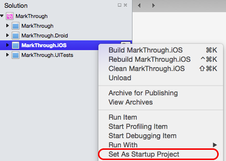

### Build your Archive

To build an IPA, an _archive_ of a release build of our application needs to be created. This Archive contains our app and identifying information about it.

1. Select the **Release | Device** configuration in Visual Studio for Mac:  !

    

1. From the **Build** menu, select **Archive for Publishing**:

    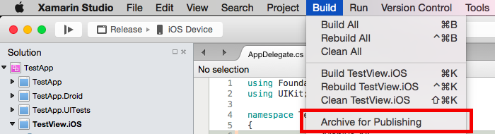

1. Once the archive has been created, the **Archives** view will be displayed:

    

### Sign and Distribute your App

Each time you build your application for Archive, it will automatically open the **Archives View**, displaying all archived projects; grouped by solution. By default, this view only shows the current, open solution. To see all solutions that have archives, click on the **Show all archives** option.

It is recommended that archives deployed to customers (either Ad-Hoc or In-House deployments) be kept, so that any debug information that is generated can be symbolized at a later date.

Note that for non-App Store builds the **iTunesMetadata.plist** file, and iTunes artwork set will automatically be included in your IPA if they are found in the archive.

To sign your app and prepare it for distribution:

1. Select the **Sign and Distribute...** button, illustrated below:

    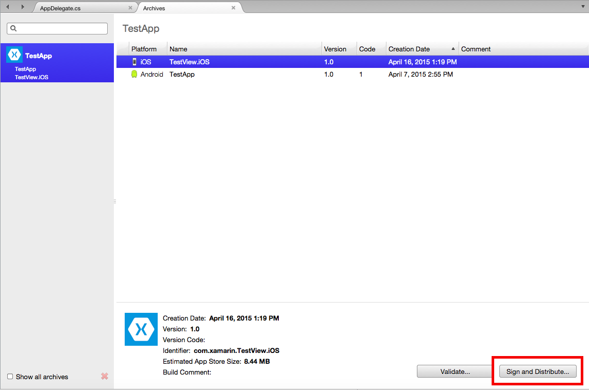

1. This will open the publishing wizard. Select the **Ad-Hoc** or **Enterprise**(In-House) distribution channel to create a package:

    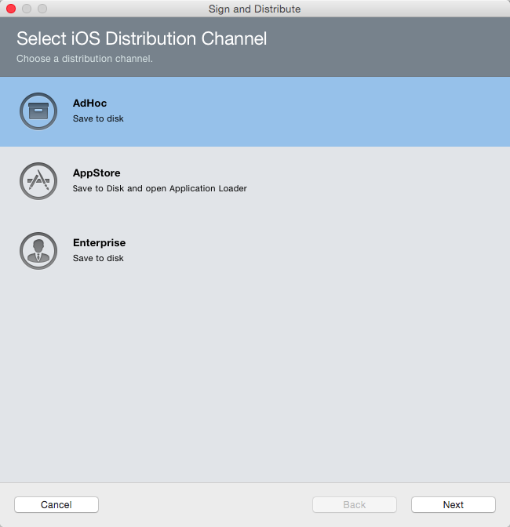

1. On the Provisioning Profile screen, select your signing identity and corresponding provisioning profile, or re-sign with another identity:

    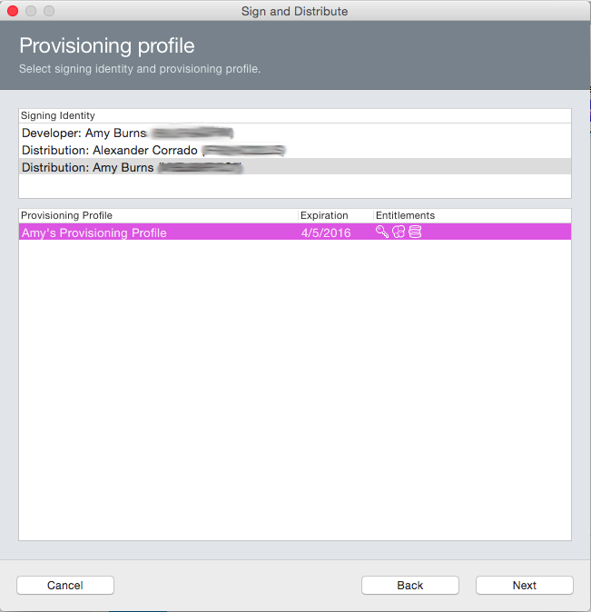

1. Verify the details of your package, and click **Publish**:

    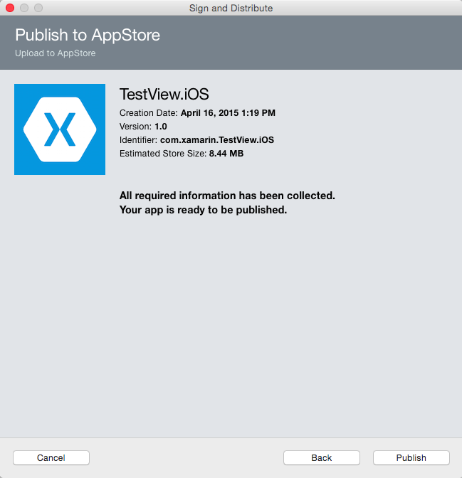

1. Finally, save your IPA to your machine:

    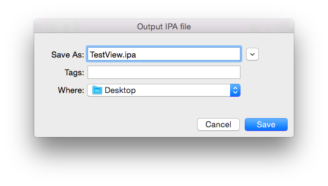

### Building via the Command Line (On Mac)

In certain cases, such as in a CI environment, it may be necessary to build you IPA via the command line. Follow the steps below to achieve this:

1. Ensure **Project Options > iOS IPA Options > Include iTunesArtwork images** is checked and **Build ad-hoc/enterprise package (IPA)** is checked:

    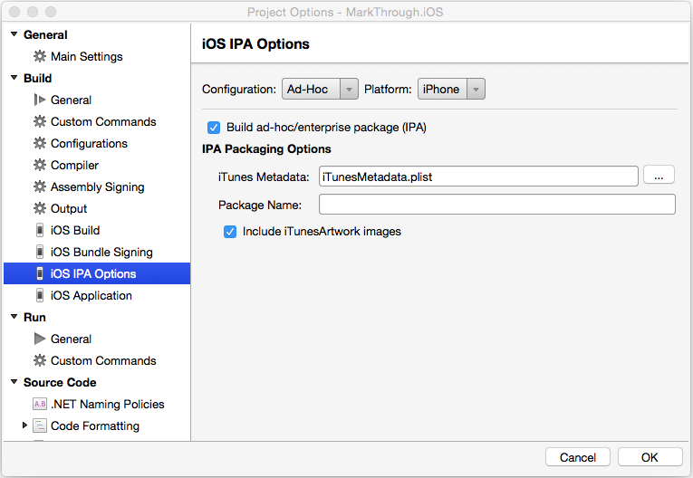

    If you prefer, you can instead edit the **.csproj** file in a text editor and manually add the two corresponding properties to the `PropertyGroup` for the configuration that will be used to build the app:

    ```xml
    <BuildIpa>true</BuildIpa>
    <IpaIncludeArtwork>false</IpaIncludeArtwork>
    ```

1. If you are including an optional **iTunesMetadata.plist** file, click the **...** button, select it from the list and click the **OK** button:

     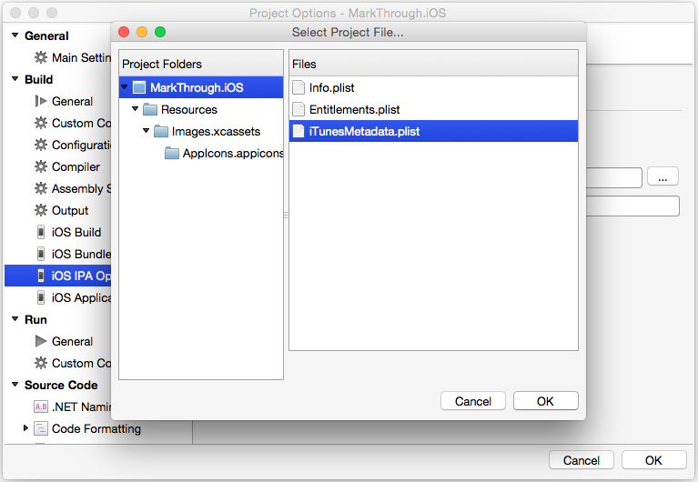

1. Call **msbuild** directly and pass this property on the command line:

    ```bash
    /Library/Frameworks/Mono.framework/Commands/msbuild YourSolution.sln /p:Configuration=Ad-Hoc /p:Platform=iPhone /p:BuildIpa=true
    ```

# [Visual Studio](#tab/windows)

Once the provisioning profile has been created and selected, the optional **iTunesMetadata.plist** file has been created and the iTunes Artwork set in Visual Studio, you can build an IPA for distribution. Next, you'll need to configure your project. Do the following:

1. In the **Solution Explorer**, right-click the Xamarin.iOS project name and select **Properties** to open them for editing:

    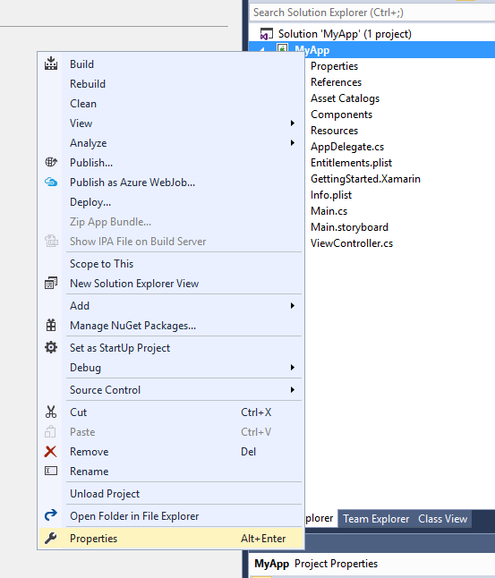

2. Select **iOS IPA Options** and select **Ad-Hoc** from the **Configuration** dropdown list:

    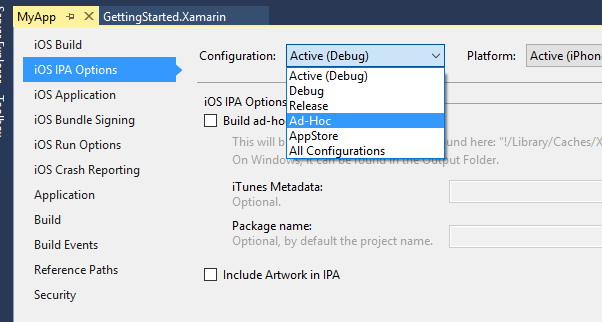

    > [!NOTE]
    > An Ad-Hoc configuration may not be available for newer Xamarin.iOS projects. If it's not available, select the **Release** configuration.

3. If you are including an option **iTunesMetadata.plist** file, click the **...** button, select it from the list and click the **Open** button:

    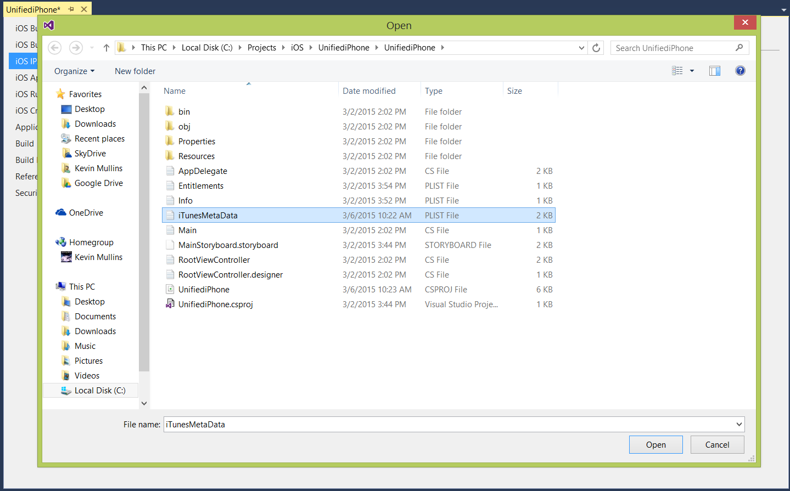

4. You can optionally specify a **Package Name** for the IPA, if not specified it will have the same name as the Xamarin.iOS project.
5. Save your changes to the Project Properties.
6. Select **Ad Hoc** from the **Build Configuration** dropdown if it is available. Otherwise select **Release**:

    

7. Build the project to create the IPA package.
8. The IPA will be build in the **Bin > iOS Device > Ad Hoc (or Release)** folder:

    

-----

<a name="Customizing-the-IPA-Location"></a>

## Customizing the IPA Location

A new **MSBuild** property `IpaPackageDir` has been added to make it easy to customize the **.ipa** file output location. If `IpaPackageDir` is set to a custom location, the **.ipa** file will be placed in that location instead of the default timestamped subdirectory. This can be useful when creating automated builds that rely on a specific directory path to work correctly, such as those used for Continuous Integration (CI) builds.

There are several possible ways to use the new property:

For example, to output the **.ipa** file to the old default directory (as in Xamarin.iOS 9.6 and lower), you can set the `IpaPackageDir` property to `$(OutputPath)` using one of the following approaches. Both approaches are compatible with all Unified API Xamarin.iOS builds, including IDE builds as well as command-line builds that use **msbuild**, **xbuild**, or **mdtool**:

- The first option is to set the `IpaPackageDir` property within a `<PropertyGroup>` element in an **MSBuild** file. For example, you could add the following `<PropertyGroup>` to the bottom of the iOS app project **.csproj** file (just before the closing `</Project>` tag):

    ```xml
    <PropertyGroup>
        <IpaPackageDir>$(OutputPath)</IpaPackageDir>
    </PropertyGroup>
    ```

- A better approach is to add a `<IpaPackageDir>` element to the bottom of the existing `<PropertyGroup>` that corresponds to the configuration used to build the **.ipa** file. This is better because it will prepare the project for future compatibility with a planned setting on the iOS IPA Options project properties page. If you currently use the `Release|iPhone` configuration to build the **.ipa** file, the complete updated property group might look similar to the following:

    ```xml
    <PropertyGroup Condition=" '$(Configuration)|$(Platform)' == 'Release|iPhone' ">
        <Optimize>true</Optimize>
        <OutputPath>bin\iPhone\Release</OutputPath>
        <ErrorReport>prompt</ErrorReport>
        <WarningLevel>4</WarningLevel>
        <ConsolePause>false</ConsolePause>
        <CodesignKey>iPhone Developer</CodesignKey>
        <MtouchUseSGen>true</MtouchUseSGen>
        <MtouchUseRefCounting>true</MtouchUseRefCounting>
        <MtouchFloat32>true</MtouchFloat32>
        <CodesignEntitlements>Entitlements.plist</CodesignEntitlements>
        <MtouchLink>SdkOnly</MtouchLink>
        <MtouchArch>;ARMv7, ARM64</MtouchArch>
        <MtouchHttpClientHandler>HttpClientHandler</MtouchHttpClientHandler>
        <MtouchTlsProvider>Default</MtouchTlsProvider>
        <PlatformTarget>x86&</PlatformTarget>
        <BuildIpa>true</BuildIpa>
        <IpaPackageDir>$(OutputPath</IpaPackageDir>
    </PropertyGroup>
    ```

An alternate technique for **msbuild** or **xbuild** command-line builds is to add a `/p:` argument to set the `IpaPackageDir` property. In this case note that **msbuild** does not expand `$()` expressions passed in on the command line, so it is not possible to use the `$(OutputPath)` syntax. You must instead provide a full path name. Mono's **xbuild** command does expand `$()` expressions, but it is still preferable to use a full path name because **xbuild** has been deprecated in favor of the [cross-platform version of **msbuild**](https://www.mono-project.com/docs/about-mono/releases/5.0.0/#msbuild).

A complete example that uses this approach might look similar to the following on Windows:

```bash
msbuild /p:Configuration="Release" /p:Platform="iPhone" /p:ServerAddress="192.168.1.3" /p:ServerUser="macuser" /p:IpaPackageDir="%USERPROFILE%\Builds" /t:Build SingleViewIphone1.sln
```

Or the following on Mac:

```bash
msbuild /p:Configuration="Release" /p:Platform="iPhone" /p:IpaPackageDir="$HOME/Builds" /t:Build SingleViewIphone1.sln
```

<a name="installipa"></a>

## Installing an IPA using iTunes

The resulting IPA Package can be delivered to your test users for installing on their iOS devices or shipped for Enterprise deployment. No matter which method is chosen, the end user will install the package in their iTunes application on their Mac or Windows PC by double-clicking the IPA file (or dragging it onto the open iTunes window).

The new iOS application will be shown in the **My Apps** section, where you can right-click on it and get information about the application:

# [Visual Studio for Mac](#tab/macos)

 

# [Visual Studio](#tab/windows)

 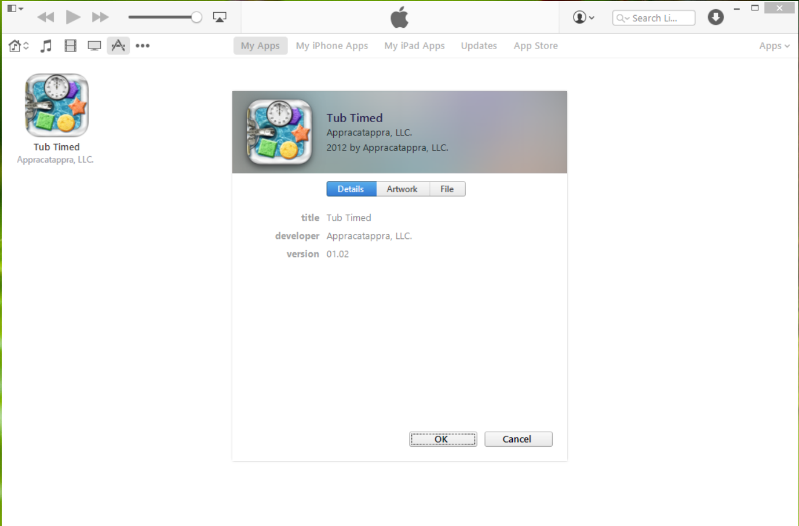

-----

The user can now sync iTunes with their device to install the new iOS application.

<a name="Summary"></a>

## Summary

This article covered the setup required to prepare a Xamarin.iOS application for a non-App Store build. It showed how to create an IPA Package and has how to install the resulting iOS application on the end user's iOS device for testing or In-House Distribution.

## Related Links

- [App Store Distribution](~/ios/deploy-test/app-distribution/app-store-distribution/index.md)
- [Configuring an App in iTunes Connect](~/ios/deploy-test/app-distribution/app-store-distribution/itunesconnect.md)
- [Publishing to the App Store](~/ios/deploy-test/app-distribution/app-store-distribution/publishing-to-the-app-store.md)
- [In-House Distribution](~/ios/deploy-test/app-distribution/in-house-distribution.md)
- [Ad Hoc Distribution](~/ios/deploy-test/app-distribution/ad-hoc-distribution.md)
- [The iTunesMetadata.plist File](~/ios/deploy-test/app-distribution/itunesmetadata.md)
- [Troubleshooting](~/ios/deploy-test/troubleshooting.md)
- [iTunes Artwork](~/ios/app-fundamentals/images-icons/app-icons.md#itunes)
- [Develop and distribute enterprise apps (Apple)](https://help.apple.com/xcode/mac/current/#/devba5e7054d)
- [Distributing Enterprise Apps (WWDC Video)](https://developer.apple.com/videos/play/wwdc2014/705/)
