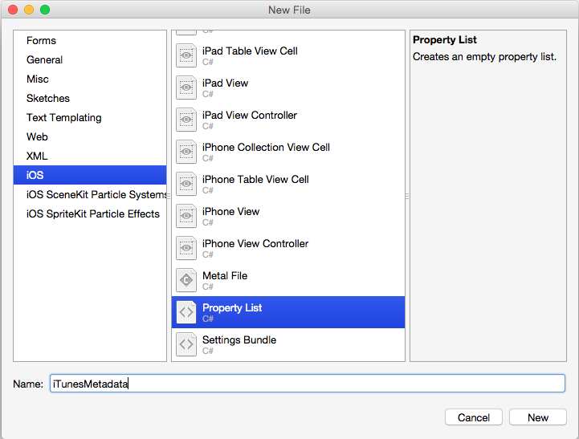
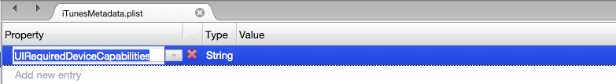
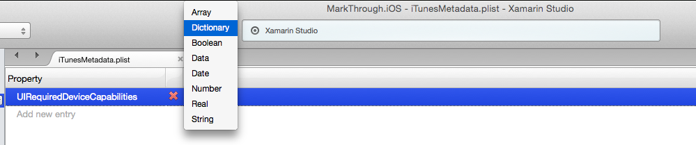
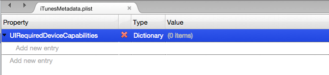
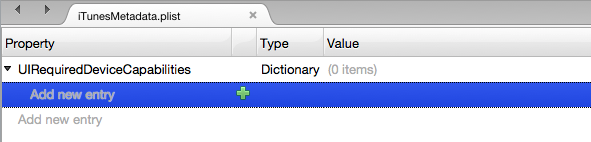
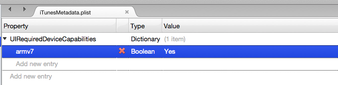

# The iTunesMetadata.plist File in Xamarin.iOS Apps

_This article covers the iTunesMetadata.plist file used to provide information to iTunes about an iOS application using Ad Hoc distribution for either testing or Enterprise deployment._

When an iOS application is created in iTune Connect (either for sale or free release from the iTunes App Store), the developer can specify information such as the application's genre, sub genre, copyright notice, supported iOS devices and required device capabilities. For iOS applications that are delivered either to testers or Enterprise user via ad hoc distribution, this information is missing.

To supply the missing information to an Ad Hoc distribution, an optional `iTunesMetadata.plist` file can be created and included in the applications IPA file. This plist file is a specially formatted XML file (see Apple's [Property List Programming Guide](https://developer.apple.com/library/mac/documentation/Cocoa/Conceptual/PropertyLists/Introduction/Introduction.html) for more information) that contains key/value pairs defining information about a given iOS application.

<a name="iTunesMetadata_contents"></a>

## The iTunesMetadata.plist Contents

The following is an example of typical `iTunesMetadata.plist` file used to define the iTunes information for an Ad Hoc distribution:

```xml
<?xml version="1.0" encoding="UTF-8"?>
<!DOCTYPE plist PUBLIC "-//Apple//DTD PLIST 1.0//EN" "http://www.apple.com/DTDs/PropertyList-1.0.dtd">
<plist version="1.0">
<dict>
    <key>UIRequiredDeviceCapabilities</key>
    <dict>
        <key>armv7</key>
        <true/>
        <key>front-facing-camera</key>
        <true/>
    </dict>
    <key>artistName</key>
    <string>Company, Inc.</string>
    <key>bundleDisplayName</key>
    <string>App Name</string>
    <key>bundleShortVersionString</key>
    <string>1.5.1</string>
    <key>bundleVersion</key>
    <string>1.5.1</string>
    <key>copyright</key>
    <string>© 2015 Company, Inc.</string>
    <key>drmVersionNumber</key>
    <integer>0</integer>
    <key>fileExtension</key>
    <string>.app</string>
    <key>gameCenterEnabled</key>
    <false/>
    <key>gameCenterEverEnabled</key>
    <false/>
    <key>genre</key>
    <string>Games</string>
    <key>genreId</key>
    <integer>6014</integer>
    <key>itemName</key>
    <string>App Name</string>
    <key>kind</key>
    <string>software</string>
    <key>playlistArtistName</key>
    <string>Company, Inc.</string>
    <key>playlistName</key>
    <string>App Name</string>
    <key>releaseDate</key>
    <string>2015-11-18T03:23:10Z</string>
    <key>s</key>
    <integer>143441</integer>
    <key>softwareIconNeedsShine</key>
    <false/>
    <key>softwareSupportedDeviceIds</key>
    <array>
        <integer>9</integer>
    </array>
    <key>softwareVersionBundleId</key>
    <string>com.company.appid</string>
    <key>subgenres</key>
    <array>
        <dict>
            <key>genre</key>
            <string>Puzzle</string>
            <key>genreId</key>
            <integer>7012</integer>
        </dict>
        <dict>
            <key>genre</key>
            <string>Word</string>
            <key>genreId</key>
            <integer>7019</integer>
        </dict>
    </array>
    <key>versionRestrictions</key>
    <integer>16843008</integer>
</dict>
</plist>

```

The values for the individual keys will be covered in detail below.

### UIRequiredDeviceCapabilities

The `UIRequiredDeviceCapabilities` key lets iTunes know which device specific features an iOS application requires before it can be installed on a given iOS device. It is provided as a dictionary (`<dict>...</dict>`) of features (`<key>...</key>`) and a boolean value for each feature. If the value of a feature is `true`, then that feature must be present. If it is `false` the feature must not be present on the device. For example:

```xml
<key>UIRequiredDeviceCapabilities</key>
<dict>
    <key>armv7</key>
    <true/>
    <key>front-facing-camera</key>
    <true/>
</dict>
```

Specifies that the iOS device must support the ARM7 instruction set and have a front-facing camera before this application can be installed on the device. For a complete list of allowed values, please see Apple's [UIRequiredDeviceCapabilities](https://developer.apple.com/library/ios/documentation/General/Reference/InfoPlistKeyReference/Articles/iPhoneOSKeys.html#//apple_ref/doc/uid/TP40009252-SW3) documentation.

### artistName and playlistArtistName

Use the `artistName` and `playlistArtistName` keys to define the name of the company that created the iOS application that will be displayed in iTunes. Example:

```xml
<key>artistName</key>
<string>Company, Inc.</string>
...
<key>playlistArtistName</key>
<string>Company, Inc.</string>
```

### bundleDisplayName, itemName, and playlistName

Use the `bundleDisplayName`, `itemName`, and `playlistName` keys to define the name of the iOS application that will be displayed inside of iTunes. Example:

```xml
<key>bundleDisplayName</key>
<string>App Name</string>
...
<key>itemName</key>
<string>App Name</string>
...
<key>playlistName</key>
<string>App Name</string>
```

### bundleShortVersionString and bundleVersion

Use the `bundleShortVersionString` and `bundleVersion` keys to define the iOS application version number that will be displayed in iTunes. Example:

```xml
<key>bundleShortVersionString</key>
<string>1.5.1</string>
<key>bundleVersion</key>
<string>1.5.1</string>
```

### softwareVersionBundleId

Use the `softwareVersionBundleId` key to specify the Bundle ID for the iOS application. Example:

```xml
<key>softwareVersionBundleId</key>
<string>com.company.appid</string>
```

### copyright

Use the `copyright` key to define the copyright notice that is displayed in iTunes. Example:

```xml
<key>copyright</key>
<string>© 2015 Company, Inc.</string>
```

### releaseDate

Use the `releaseDate` key to provide a release date for the iOS application that will be displayed in iTunes. Example:

```xml
<key>releaseDate</key>
<string>2015-11-18T03:23:10Z</string>
```

### softwareIconNeedsShine

Use the `softwareIconNeedsShine` key to tell iTunes if the iOS Application's icon requires a _shine highlight_ for iOS 6 (and prior). Example:

```xml
<key>softwareIconNeedsShine</key>
<false/>
```

### gameCenterEnabled and gameCenterEverEnabled

Use the `gameCenterEnabled` and `gameCenterEverEnabled` keys to tell iTunes is this iOS application supports Apple's Game Center. Example:

```xml
<key>gameCenterEnabled</key>
<false/>
<key>gameCenterEverEnabled</key>
<false/>
```

### genre, genreId, and subgenres

Use the `genre` and `genreId` keys to tell iTunes what genre the iOS application belongs to. Example:

```xml
<key>genre</key>
<string>Games</string>
<key>genreId</key>
<integer>6014</integer>
```

Optionally the `subgenres` key can be used to further define up to two sub genres for the iOS application. Example:

```xml
<key>subgenres</key>
<array>
    <dict>
        <key>genre</key>
        <string>Puzzle</string>
        <key>genreId</key>
        <integer>7012</integer>
    </dict>
    <dict>
        <key>genre</key>
        <string>Word</string>
        <key>genreId</key>
        <integer>7019</integer>
    </dict>
</array>
```

For iOS applications, Apple currently defines the following genres and genre IDs:

[!include[](~/ios/includes/table-appstore.md)]

### softwareSupportedDeviceIds

Use the `softwareSupportedDeviceIds` key to tell iTunes what iOS devices this iOS application supports. Example:

```xml
<key>softwareSupportedDeviceIds</key>
<array>
    <integer>9</integer>
</array>
```

Where the following values are available:

- 1 – Classic iPhones
- 2 – iPod Touch
- 4 – iPad
- 9 – Modern iPhones

### Standard Keys

The following keys are included in all `iTunesMetadata.plist` files for iOS applications and always have the same values:

```xml
<key>drmVersionNumber</key>
<integer>0</integer>
<key>fileExtension</key>
<string>.app</string>
...
<key>kind</key>
<string>software</string>
...
<key>s</key>
<integer>143441</integer>
...
<key>versionRestrictions</key>
<integer>16843008</integer>
```

<a name="iTunesMetadata_creating"></a>

## Creating an iTunesMetadata.plist File

# [Visual Studio for Mac](#tab/macos)

 When working with an `iTunesMetadata.plist` file in Visual Studio for Mac, you have two options:

- Create and maintain the file using Visual Studio for Mac's visual plist editor.
- Create and maintain the file in a plain text editor.

 Both options will be covered in detail below.

### Using the Visual Plist Editor

Do the following:

1. In the **Solution Explorer**, right-click the Xamarin.iOS project file and select **Add** > **New File...**
2. From the New File Dialog, select **iOS** > **Property List**:

    
3. Enter `iTunesMetadata` for the **Name** and click the **New** button.
4. Double-click the `iTunesMetadata.plist` file in the **Solution Explorer** to open it for editing:

    
5. Click the green **+** to create a new entry and enter `UIRequiredDeviceCapabilities` as the key name:

    
6. Click on the **String** value type and select **Dictionary** from the popup list:

    
7. Click the turndown at the left of the Property's name to reveal the dictionary's entries:

    
8. Click on the **Add new entry** text, then click the green **+** to add an entry to the dictionary:

    
9. Enter `armv7` for the key name, select a type of **Boolean** and enter **Yes** as the value:

    
10. Repeat the steps above until you have filled out the `iTunesMetadata.plist` file with all of the key/value pairs required (see the [The iTunesMetadata.plist Contents](#iTunesMetadata_contents) section above for more details).

11. Save the changes to the plist file.

### Using a Plain Text Editor

Do the following:

1. In a plain text editor, create a new text file and name it `iTunesMetadata.plist`.
2. Copy the example contents from the [The iTunesMetadata.plist Contents](#iTunesMetadata_contents) section above.
3. Paste the contents in the file and edit them as required.
4. Save the file and return to Visual Studio for Mac.
5. In the **Solution Explorer**, right-click on the Xamarin.iOS project file and select **Add** > **Existing Files...**.
6. In the Open File Dialog, select the `iTunesMetadata.plist` file that was created above and click the **OK** button.
7. Leave the **Build Action** of this file set to **None**.

# [Visual Studio](#tab/windows)

The Xamarin plugin for Visual Studio only supports a visual editor for `Info.plist` and `Entitlement.plist` files, so you'll need to create your `iTunesMetadata.plist` file in a standard text editor and manually include it in your Xamarin.iOS project.

Do the following:

1. In a plain text editor, create a new text file and name it `iTunesMetadata.plist`.
2. Copy the example contents from the [The iTunesMetadata.plist Contents](#iTunesMetadata_contents) section above.
3. Paste the contents in the file and edit them as required.
4. Save the file and return to Visual Studio.
5. In the **Solution Explorer**, right-click on the Xamarin.iOS project file and select **Add** > **Existing Files...**.
6. In the Open File Dialog, select the `iTunesMetadata.plist` file that you created above and click the **Open** button.
7. Leave the **Build Action** of this file set to **None**.

-----

Later, select this `iTunesMetadata.plist` file when you prepare to build your IPA in the IDE.

## Summary

This article has covered the `iTunesMetadata.plist` file that can be used to tell iTunes about an ad hoc delivered iOS application. It has discussed the standard key in the plist file and how to create and maintain the file in Visual Studio and Visual Studio for Mac.

## Related Links

- [App Store Distribution](~/ios/deploy-test/app-distribution/app-store-distribution/index.md)
- [Configuring an App in iTunes Connect](~/ios/deploy-test/app-distribution/app-store-distribution/itunesconnect.md)
- [Publishing to the App Store](~/ios/deploy-test/app-distribution/app-store-distribution/publishing-to-the-app-store.md)
- [In-House Distribution](~/ios/deploy-test/app-distribution/in-house-distribution.md)
- [Ad Hoc Distribution](~/ios/deploy-test/app-distribution/ad-hoc-distribution.md)
- [IPA Support](~/ios/deploy-test/app-distribution/ipa-support.md)
- [Troubleshooting](~/ios/deploy-test/troubleshooting.md)
