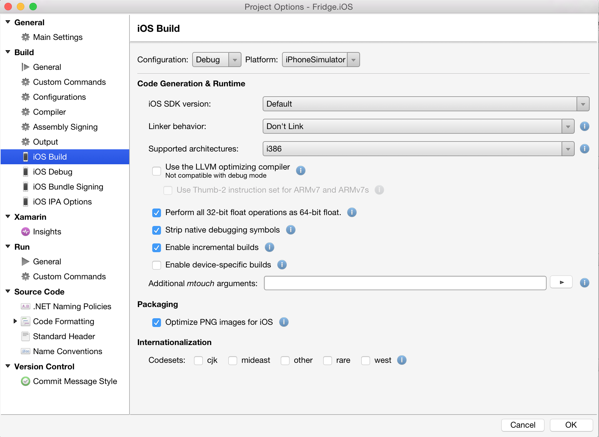
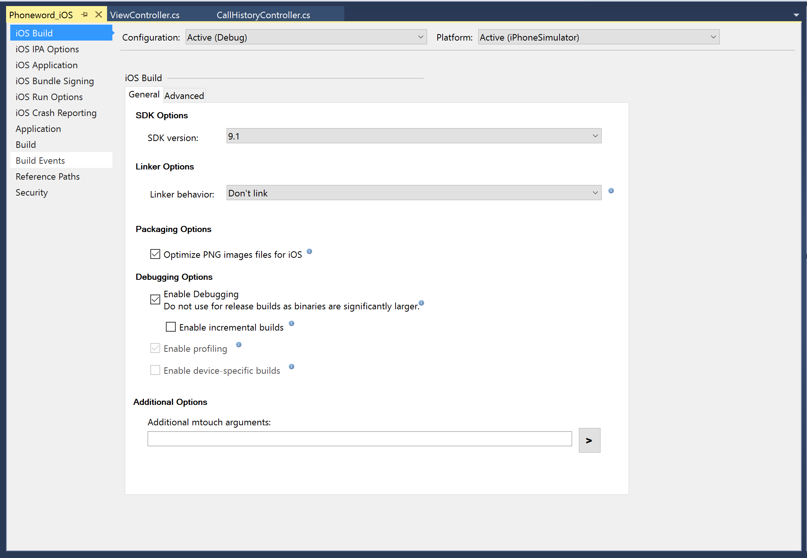
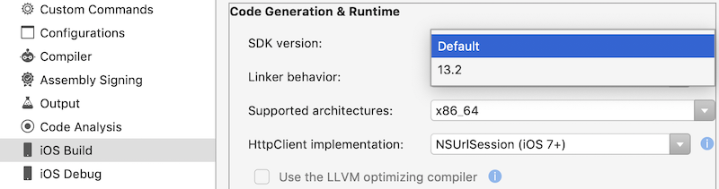
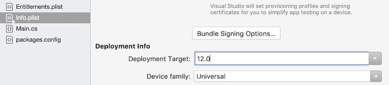
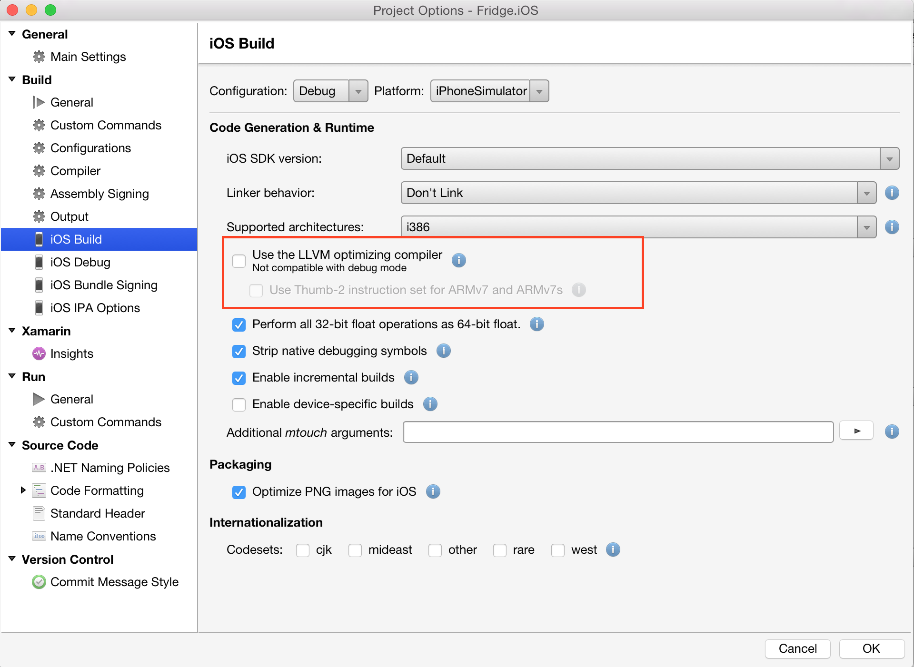
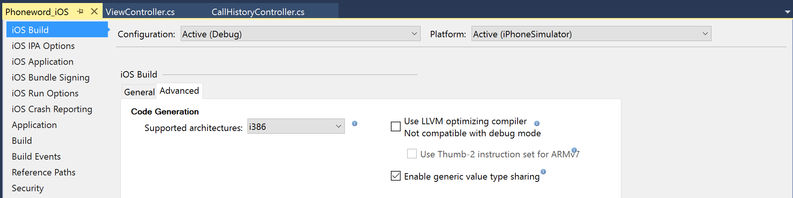

# Compiling for different devices in Xamarin.iOS

The build properties of your executable can be configured from the Project's **iOS Build** properties page, which is found by right-clicking on the Project name and browsing to **Options > iOS Build** in Visual Studio for Mac, and **Properties** in Visual Studio:

# [Visual Studio for Mac](#tab/macos)

 

# [Visual Studio](#tab/windows)

-----

In addition to the configuration options available on the UI, you can also pass
your own set of command line options to the [Xamarin.iOS build tool (mtouch)](~/ios/deploy-test/mtouch.md).

## SDK options

Visual Studio for Mac lets you configure two important properties related to the SDK: the iOS SDK version used to build your software and the Deployment Target (or the minimum required iOS version).

The iOS **SDK version** option lets you use different
versions of an Apple published SDK, this directs Xamarin.iOS to the compilers,
linkers and libraries it should reference during your build. Right-click on the project and choose **Options**, then **iOS Build** in the options window:

The **Deployment Target** setting is used to select the minimum
required version of the operating system on which your application will run. This is set in your project's **Info.plist** file. You should pick the
minimum version that has all the APIs that you need to run your application.

In general, the Xamarin.iOS API exposes all the methods available in the latest
version of the SDK, and when necessary, we provide convenience properties that
allow you to detect if the functionality is available at runtime (for example,
`UIDevice.UserInterfaceIdiom` and `UIDevice.IsMultitaskingSupported` always work on
Xamarin.iOS, we do all the work behind the scenes).

## Linking

See our dedicated page on the [Linker](~/ios/deploy-test/linker.md) to learn more about how the
linker helps you reduce the size of your executables and to find out how to use
it effectively.

## Code generation engine

Starting with Xamarin.iOS 4.0, there are two code generation backends to
Xamarin.iOS. The regular Mono code generation engine and one based on the LLVM
Optimizing Compiler. Each engine has its pros and cons.

Typically, during the development process, you will likely use the Mono code
generation engine as it will let you iterate quickly. For release builds and
AppStore deployment, you will want to switch to the LLVM code generation
engine.

The LLVM optimizing backend engine produces both faster and tighter code than
the Mono engine does, at the cost of long compile times.

You can enable these from iOS Build options in Visual Studio for Mac or Visual Studio.

## Architecture support

### ARMv6 (Xamarin.iOS discontinued support for ARMv6 with v8.10)

- iPhone (original), 3G
- iPod 1st, 2nd generation

### ARMv7

- iPhone 3GS, 4, 4S
- iPad 1, 2, 3, Mini
- iPod 3, 4, 5th generation

### ARMv7s

- iPhone 5
- iPhone 5c
- iPad 4

If you target only the ARMv7s processor, the code generated will be slightly faster, but it will no longer run on ARMv7 or ARMv6 systems unless you compile a fat binary that contains multiple executables in your package.

### ARM64 (Xamarin.iOS started supporting ARM64 in v8.6)

- iPhone 5s
- iPhone SE
- iPhone 6, 6 Plus
- iPhone 6s, 6s Plus
- iPhone 7, 7 Plus
- iPhone 8, 8 Plus
- iPhone X
- iPad Air
- iPad Air 2
- iPad Mini 2, 3, 4
- iPad Pro (all)

Note that any builds submitted to the App Store must contain 64 bit support, this is a requirement set by [Apple](https://developer.apple.com/news/?id=12172014b). Additionally, iOS 11 only supports 64-bit applications.

### ARM Thumb-2 support

Thumb is a more compact instruction set used by ARM processors. By enabling
the Thumb support, you can reduce the size of your executable, at the expense of
slower execution times. Thumb is supported on ARMv7 and ARMv7s.

## Conditional framework usage

If your project wants to leverage some of the features in the newer iOS
releases, you may need to conditionally rely on certain new frameworks. A prime
example of this is wanting to use iAd when running on iOS 4.0 or greater, but
still support 3.x devices. To accomplish this you need to let Xamarin.iOS know
that you need to link against the iAd framework "weakly". Weak bindings ensure
that the framework is only loaded on demand the first time a class from the
framework is required.

To do this you should take the following steps:

- Open your **Project Options** and navigate to the **iOS Build** pane.
- Add  `'-gcc_flags "-weak_framework iAd"'` to the **Additional Options** for each configuration you wish to weakly link on:

In addition to this you will need to guard your usage of the types from
running on older versions of iOS where they may not exist. There are several
methods to accomplish this, but one of which is parsing
`UIDevice.CurrentDevice.SystemVersion`.

## Related links

- [Linker](~/ios/deploy-test/linker.md)
