# Debugging Xamarin.iOS Apps

_Xamarin.iOS applications can be debugged with the built-in debugger in Visual Studio for Mac or Visual Studio._

Use Visual Studio for Mac's native debugging support for debugging C# and other managed
languages code and use [LLDB](https://lldb.llvm.org/tutorial.html) when you need to debug C, C++ or Objective C codethat you might be linking with your Xamarin.iOS project.

> [!NOTE]
> When you compile applications in Debug mode, Xamarin.iOS will generate
> slower and much larger applications as every line of code must be
> instrumented. Before releasing, make sure that you do a Release build.

The Xamarin.iOS debugger is integrated into your IDE and it allows
developers to debug Xamarin.iOS applications built with any of the managed
languages supported by Xamarin.iOS in the simulator and on the device.

The Xamarin.iOS debugger uses the [Mono Soft Debugger](https://www.mono-project.com/docs/advanced/runtime/docs/soft-debugger/), which means that the generated code
and the Mono runtime cooperate with the IDE to provide a debugging
experience. This is different than hard debuggers like LLDB or MDB which control
a program without the knowledge or cooperation from the debugged program.

## Setting Breakpoints

When you are ready to start debugging your application the first step is to [set breakpoints your application](https://github.com/xamarin/recipes/tree/master/Recipes/cross-platform/ide/debugging/set_a_breakpoint). This is done by clicking in the margin area of the editor, next to the line number of code you want to break at:

# [Visual Studio for Mac](#tab/macos)

[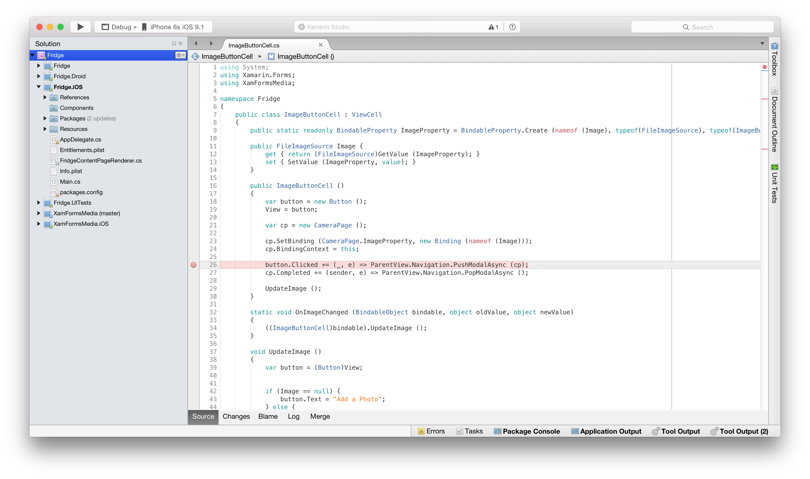](debugging-in-xamarin-ios-images/debugging1.png#lightbox)

# [Visual Studio](#tab/windows)

[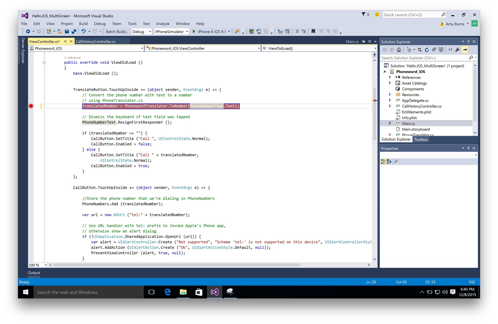](debugging-in-xamarin-ios-images/debugging1a.png#lightbox)

-----

You can view all the breakpoints that have been set in your code by going to the **Breakpoints pad**:

# [Visual Studio for Mac](#tab/macos)

 If the Breakpoints pad does not display automatically, you can make it visible by selecting _View > Debug Windows > Breakpoints_

# [Visual Studio](#tab/windows)

[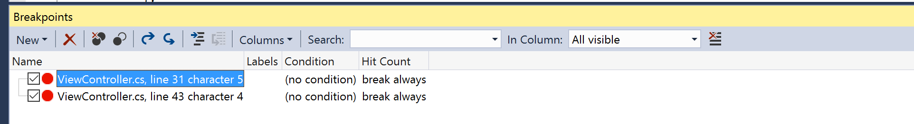](debugging-in-xamarin-ios-images/image0.png#lightbox)

 If the Breakpoints pad does not display automatically, you can make it visible by selecting _Debug > Windows > Breakpoints_

-----

Before you begin debugging any application, always ensure that the configuration is set to **Debug**, as this contains a helpful set of tools to support debugging such as breakpoints, using data visualizers, and viewing the call stack:

# [Visual Studio for Mac](#tab/macos)

[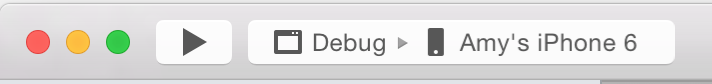](debugging-in-xamarin-ios-images/debugging7a.png#lightbox)

# [Visual Studio](#tab/windows)

[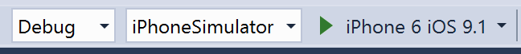](debugging-in-xamarin-ios-images/debugging7c.png#lightbox)

-----

## Start Debugging
To start debugging, select the target device or similar in your IDE:

# [Visual Studio for Mac](#tab/macos)

[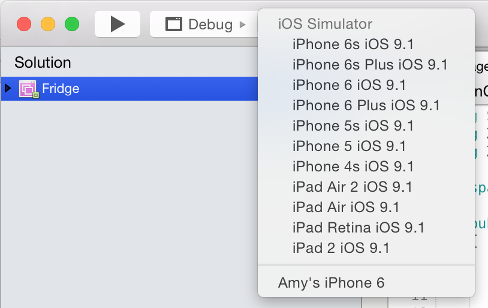](debugging-in-xamarin-ios-images/debugging7b.png#lightbox)

# [Visual Studio](#tab/windows)

[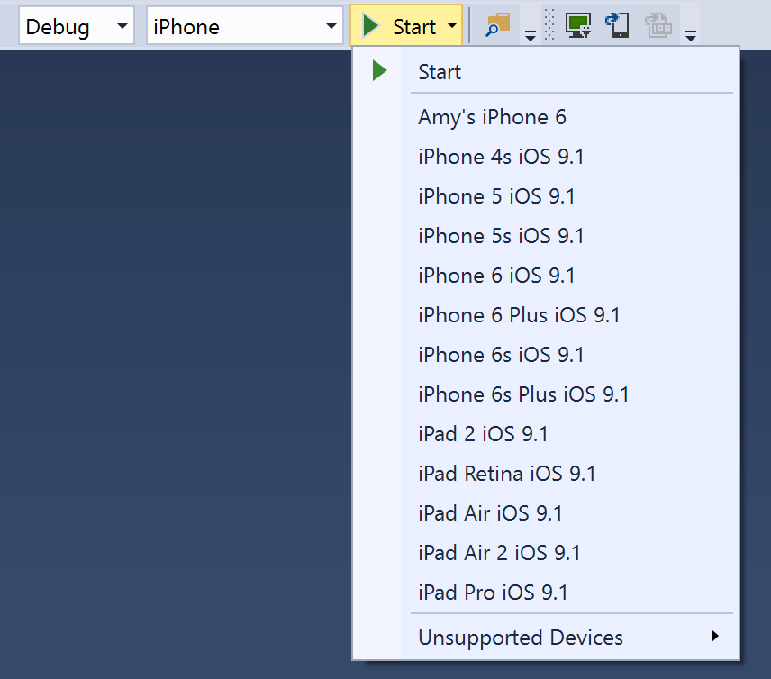](debugging-in-xamarin-ios-images/debugging7e.png#lightbox)

-----

Then deploy your application by pressing the  **Play** button.

When you hit a breakpoint, the code will be highlighted yellow:

Debugging tools, such as inspecting the values of objects, can be used at this point to get more information about what is happening in your code:

## Conditional Breakpoints

You can also set rules dictating the circumstances under which a breakpoint should occur, this is know as adding a *conditional breakpoint*.

# [Visual Studio for Mac](#tab/macos)

To set a conditional breakpoint, access the  **Breakpoint Properties window**, which can be done in two ways:

- To add a new conditional breakpoint, right-click on the editor margin, to the left of the line number for the code you wish to set a breakpoint on, and select New Breakpoint:

  

- To add a condition to an existing breakpoint, right-click on the breakpoint and select  **Breakpoint Properties** or in the  **Breakpoints Pad** select the properties button illustrated below:

  

You can then enter the condition under which you want to breakpoint to occur:

# [Visual Studio](#tab/windows)

To set a conditional breakpoint in Visual Studio, first [set a regular breakpoint](https://github.com/xamarin/recipes/tree/master/Recipes/cross-platform/ide/debugging/set_a_breakpoint). Right-click on the breakpoint to display its context menu:

 [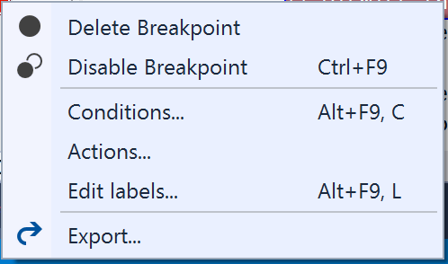](debugging-in-xamarin-ios-images/image4vs.png#lightbox)

Select **Conditions...** to display the _Breakpoint Settings_ menu:

 [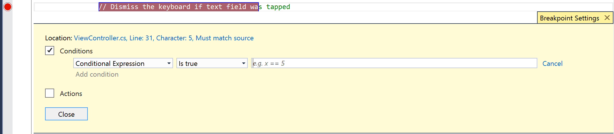](debugging-in-xamarin-ios-images/image6vs.png#lightbox)

Here, you can enter the conditions under which you want the breakpoint to occur

For more information on using breakpoint conditions in earlier versions of Visual Studio, refer to [Visual Studio's documentation](/visualstudio/debugger/using-breakpoints) on this topic.

-----

## Navigating through code

When a breakpoint has been reached, the Debug tools enable you to get control over the program’s execution. The IDE will display four buttons, allowing you to run and step through the code.

# [Visual Studio for Mac](#tab/macos)

In Visual Studio for Mac they will look like the following:

 

These are:

- **Play/Stop** – This will begin/stop executing the code, until the next breakpoint.
- **Step Over** – This will execute the next line of code. If the next line is a function call, step over will execute the function, and will stop at the next line of code _after_ the function.
- **Step Into** – This will also execute the next line of code. If the next line is a function call, Step Into will stop at the first line of the function, allowing you to continue line-by-line debugging of the function. If the next line is not a function, it will behave the same as Step Over.
- **Step Out** – This will return to the line where the current function was called.

# [Visual Studio](#tab/windows)

In Visual Studio they will look like the following:

These are:

- **Play/Stop** – This will begin/stop executing the code, until the next breakpoint.
- **Step Over (F11)** – This will execute the next line of code. If the next line is a function call, step over will execute the function, and will stop at the next line of code _after_ the function.
- **Step Into (F10)** – This will also execute the next line of code. If the next line is a function call, Step Into will stop at the first line of the function, allowing you to continue line-by-line debugging of the function. If the next line is not a function, it will behave the same as Step Over.
- **Step Out (Shift + F11)** – This will return to the line where the current function was called.

For more in depth documentation on Debugging, see the [Navigate Code with the Visual Studio Debugger](/visualstudio/debugger/navigating-through-code-with-the-debugger).

-----

### Breakpoints

It is important to point out that the iOS gives
applications only a handful of seconds (10) to startup and complete the
`FinishedLaunching` method in the Application delegate. If the application does
not complete this method in 10 seconds, then iOS will kill the process.

This means that it is almost impossible to set breakpoints on the startup
code of your program. If you want to debug your startup code, you should delay
some of its initialization and put that into a timer-invoked method, or in some
other form of callback method that is executed after FinishedLaunching has
terminated.

## Device Diagnostics

If there is an error setting up the debugger, you can enable detailed
diagnostics by adding "-v -v -v" to the additional mtouch arguments in your Project Options. This will
print detailed error information to the device console.

 

## Wireless Debugging

The default in Xamarin.iOS is to debug your application on your devices over
the USB connection. Sometimes the USB device might be needed to test
plugging/unplugging of the cable for developing ExternalAccessory-powered
applications. In those cases, you can use debugging over the wireless
network.

For more information on Wireless Deployment and Debugging, refer to the [Wireless Deployment](~/ios/deploy-test/wireless-deployment.md) guide.

## Technical Details

Xamarin.iOS uses the new Mono soft debugger. Unlike the standard Mono debugger
which is a program that controls a separate process by using operating system
interfaces to control a separate process, the soft debugger works by having the
Mono runtime expose the debugging functionality through a wire protocol.

On startup, an application that is to be debugged contacts the debugger and
the debugger starts to operate. In Xamarin.iOS for Visual Studio, the Xamarin Mac Agent
acts as the middle-man between the application (in Visual Studio) and the debugger.

This soft debugger requires a cooperative debugging scheme when running on
the device. This means that your binary builds when debugging will be larger as
the code is instrumented to contain extra code at every sequence point to
support debugging.

## Accessing the Console

Crash logs and the output of the Console class will be sent to the iPhone
console. You can access this console with Xcode using the "Organizer" and
selecting your device from the organizer.

Alternatively, if you do not want to start up Xcode, you can use the Apple's iPhone Configuration Utility to directly access the console. This
has the added bonus that you can access the console logs from a Windows machine if you are debugging a problem in the field.

For Visual Studio users, there are a few logs available in the Output window, but you
should switch over to your Mac for more thorough and detailed logs.

-----

## Debugging Mono's Class Libraries

Xamarin.iOS ships with the source code for Mono's class libraries, and you can
use this to single step from the debugger to see how things are working under
the hood.

# [Visual Studio for Mac](#tab/macos)

Since this feature consumes more memory during debugging, this is turned off
by default.

To enable this feature, make sure the **Debug project code only; do not step into framework code** option is deselected under the _Visual Studio for Mac > Preferences > Debugger_ menu as illustrated below:

[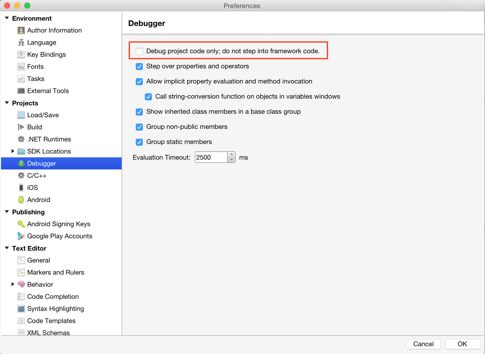](debugging-in-xamarin-ios-images/debugging6.png#lightbox)

# [Visual Studio](#tab/windows)

To debug the class libraries in Visual Studio, you must disable **Just My Code** under the _Debug > Options_ menu. In the _Debugging > General_ node, clear the **Enable Just My Code** checkbox:

[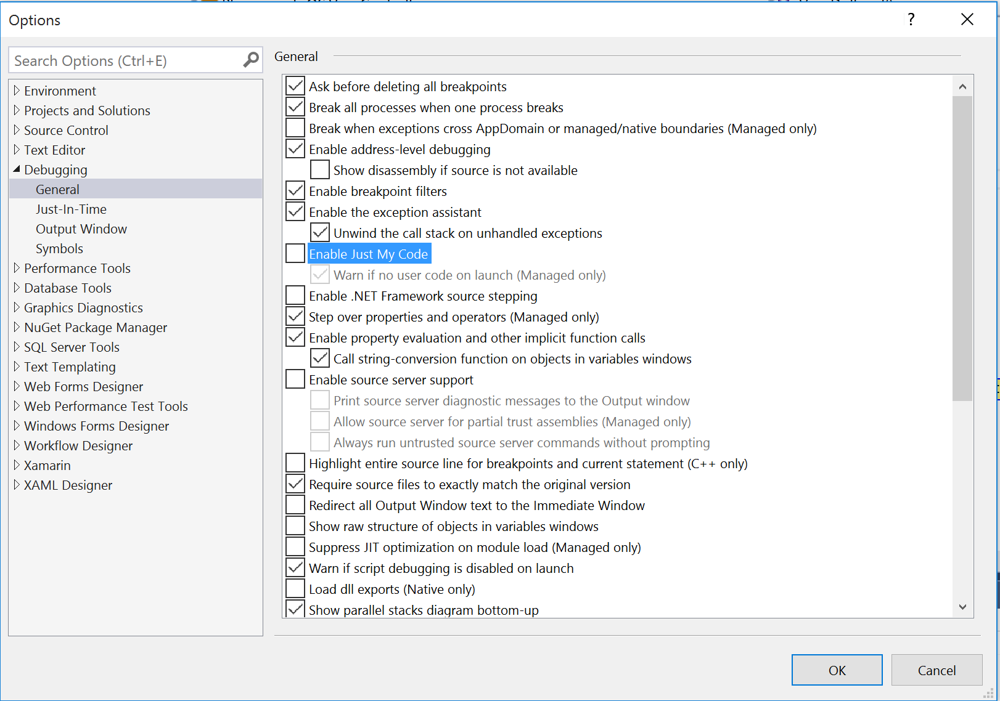](debugging-in-xamarin-ios-images/debugging6vs.png#lightbox)

-----

Once you do this, you can start your application and single step into any of
Mono's core class libraries.

## Related Links

- [Debugging with Xamarin](/visualstudio/mac/debugging/)
- [Data Visualizations](/visualstudio/mac/data-visualizations/)
- [Set A Breakpoint](https://github.com/xamarin/recipes/tree/master/Recipes/cross-platform/ide/debugging/set_a_breakpoint)
- [Step Through Code](https://github.com/xamarin/recipes/tree/master/Recipes/cross-platform/ide/debugging/step_through_code)
- [Output Information to Log Window](https://github.com/xamarin/recipes/tree/master/Recipes/cross-platform/ide/debugging/output_information_to_log_window)