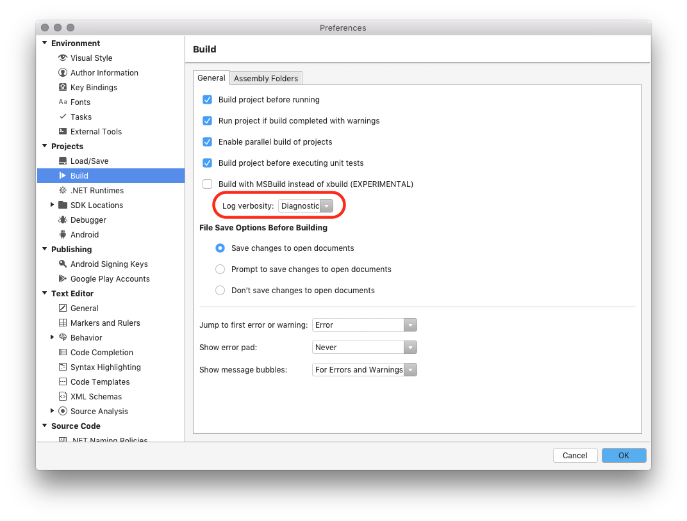
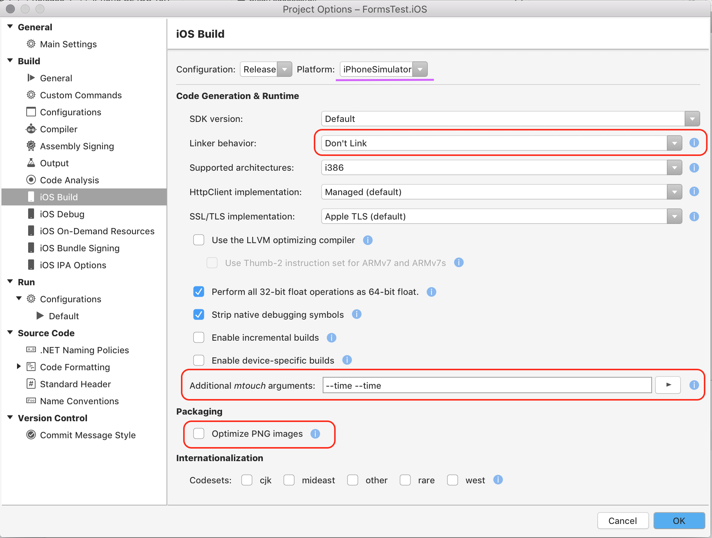
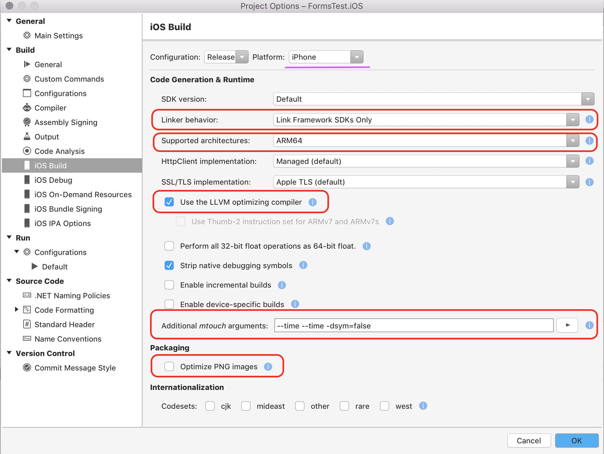

# iOS Build Mechanics

_This guide explores how to time your apps and how to use methods that can be employed for quicker builds for all build configurations._

Developing great applications is more than just writing code that works. A well-written app should contain optimizations that accomplish quicker builds with apps that are smaller and faster running. These optimizations will not only result in a better experience for the user, but also for you or any developer working on the project. It is essential to ensure that when dealing with your app everything is timed often. 

Remember that the default options are safe and fast, but are not optimal for every situation. In addition, many options can either slow down or speed up the development cycle depending on the individual project. For instance, native stripping takes time, but if very little size is gained then the time spent stripping will not be recovered by a faster deploy. On the other hand, native stripping can shrink the app significantly, in which case it will be faster to deploy. This varies between projects, and the only way to know is to test.

Xamarin build speeds can also be affected by various capacities and capabilities of a computer than can affect performance: processor capabilities, bus speeds, the amount of physical memory, disk speed, network speed. These performance limitations are beyond the scope of this document and are the responsibility of the developer.

## Timing apps

# [Visual Studio for Mac](#tab/macos)

To enable diagnostic MSBuild output within Visual Studio for Mac:

1. Click **Visual Studio for Mac > Preferences...**
2. In the left-hand tree view, select **Projects > Build**
3. In the right-hand panel, set the Log verbosity drop-down to **Diagnostic**:
    [](ios-build-mechanics-images/image2.png#lightbox)
4. Click **OK**
5. Restart Visual Studio for Mac
6. Clean and rebuild your package
7. View diagnostic output within the Errors Pad ( View > Pads > Errors ) by clicking the Build Output button

# [Visual Studio](#tab/windows)

To enable diagnostic MSBuild output within Visual Studio:

1. Click **Tools > Options...**
2. In the left-hand tree view, select **Projects and Solutions > Build and Run**
3. In the right-hand panel, set the *MSBuild build output verbosity dropdown* to **Diagnostic**:
    [](ios-build-mechanics-images/image2-vs.png#lightbox)
4. Click **OK**
5. Clean and rebuild your package.
6. Diagnostic output is visible in the Output panel.

-----

## Timing mtouch

To display information specific to the mtouch build process, pass `--time --time` to the mtouch arguments in your **Project Options**. The results are found in the Build Output, by searching for the `MTouch` task:

```csharp
Setup: 36 ms
Resolve References: 982 ms
Extracted native link info: 987 ms
...
Total time: 1554 ms
```

## Connecting from Visual Studio with Build Host

Xamarin tooling technically works on any Mac that can run OS X 10.10 Yosemite or later. However, developer experiences and build times can be hindered by the performance of the Mac.

In the disconnected state, Visual Studio on Windows only performs the C# compilation phase and does not attempt to perform linking or AOT compilation, package the app into a _.app_ Bundle, or sign the app bundle. (The C# compilation phase is rarely a performance bottleneck.)
Attempt to pinpoint where in the pipeline the build is slowing down by building directly on the Mac build host in Visual Studio for Mac.

In addition, one of the more common places for sluggishness is the network connection between the Windows machine and the Mac build host. This could be due to a physical impediment on the network, using a wireless connection, or having to travel through a saturated machine (such as a Mac-in-the-cloud service).

## Simulator Tricks

When developing mobile applications, it is essential to deploy code rapidly. For a variety of reasons including speed and a lack of device provisioning requirements, developers often choose to deploy to a pre-installed simulator or emulator. For manufacturers of developer tools, the decision to provide a simulator or emulator comes down to a trade-off between speed and compatibility. 

Apple provides a simulator for iOS development, promoting speed over compatibility by creating a less restrictive environment for running code. This less restrictive environment allows Xamarin to use the Just In Time (JIT) compiler for the simulator (as opposed to [AOT](~/ios/internals/architecture.md) on a device), which means that the build is compiled to native code at runtime. As the Mac is much faster than a device, this allows for better performance.

The simulator uses a shared application launcher, allowing the launcher to be reused, as opposed to being built each time, as is required on the device.

While taking into account the information above, the list below gives some information on steps to take when building and deploying your app on the simulator to provide the best performance.

### Tips

- For Builds: 
  - De-select the **Optimize PNG images** option in the Project Options. This optimization is not necessary for builds on the simulator.
  - Set the linker to **Don't Link**. Disabling the linker is faster because executing it takes a significant amount of time.
  - Disabling the shared application launcher by using the `--nofastsim` flag causes simulator builds to be much slower. Remove this flag when it is no longer required.
  - Using native libraries is slower because the shared simlauncher main executable cannot be reused in such cases and an application-specific executable has to be compiled for every build.
- For Deployment
  - Always keep the simulator running when possible. It can take up to 12 seconds to cold start the simulator.
- Additional Tips
  - Prefer Build over Rebuild, because Rebuild cleans before building. Cleaning can take a long time as it removes references which could be used.
  - Take advantage of the fact that the simulator does not enforce the sandbox. Having large resources such as videos or other assets included into your project can create costly file copy operations every time the app is launched in the simulator. Avoid these costly operations by placing these files in the home directory, and reference them in your application by the full file path.  
  - When in doubt, use the `--time --time` flag to measure your change

The screenshot below illustrates how to set these options for the simulator in your iOS options:

[](ios-build-mechanics-images/image3.png#lightbox)

## Device Tricks

Deploying to the device is similar to deploying to the simulator, as the simulator is a small subset of the build used for the iOS device. Building for device requires many more steps, but has the advantage of providing additional opportunities to optimize your app.

### Build Configurations

There are a number of build configurations provided when deploying iOS apps. It is important to have a good understanding of each configuration, to know when and why you should be optimizing.

- Debug
  - This is the main configuration that should be used while an app is under development, and should, therefore, be as quick as possible.
- Release
  - Release builds are those that are shipped to your users and a focus on performance is paramount. When using the Release configuration, you might want to use the LLVM optimizing compiler and optimize PNG files.

It is also important to understand the relationship between building and deploying. The deployment time is a function of the application size. A larger application takes a longer time to deploy. By minimizing the app size, you can reduce the deployment time.

Minimizing the app size can also reduce the build time. This is because removing code from the application takes less time than natively compiling the code that won't be used. Smaller object files mean faster linking, which creates a smaller executable with fewer symbols to generate. Saving space, therefore, has a double payoff, which is why **Link SDK** is the default for all device builds. 

> [!NOTE]
> The **Link SDK** option may appear as Link Framework SDKs Only or Link SDK assemblies only, depending on the IDE that is being used.

### Tips

- Build: 
  - Building a single architecture (e.g. ARM64) is faster than a FAT binary (e.g. ARMv7 + ARM64)
  - Avoid optimizing PNG files when debugging
  - Consider Linking all assemblies. Optimize every assembly 
  - Disabling the creation of debug symbols by using `--dsym=false`. However, you should be aware that disabling this will mean that crash reports can only be symbolicated on that machine that built the app, and only if the app wasn't stripped.

Some things that should be avoided are:

- Fat Binaries (debug) 
- Disable the linker `--nolink` 
- Disabling stripping 
  - Symbols `--nosymbolstrip` 
  - IL (release) `--nostrip`.  

Additional tips 

- As on the simulator, prefer Build over Rebuild 
  - AOT'd assemblies (object files) are cached 
- Debug builds take longer because of symbols, running dsymutil and since it ends up being larger, extra time to upload to devices. 
- Release builds will, by default, do an IL strip of the assemblies. That takes only a bit of time and is likely gained back when deploying a smaller .app to the device.
- Avoid deploying large static files on every build (debug) 
  - Use UIFileSharingEnabled (info.plist) 
    - Assets can be uploaded once 
- When in doubt, use the `--time --time` flag to measure your change

The screenshot below illustrates how to set these options for the simulator in your iOS options:

[](ios-build-mechanics-images/image4.png#lightbox)

## Using the Linker

When building your application, mtouch uses a linker for managed code, which removes code that the application is not using. In theory, this provides smaller, and therefore quicker builds. For more information on the linker refer to the [Linking on iOS](~/ios/deploy-test/linker.md) guide.

Consider the following options when using the Linker:

- Selecting **Don't Link** for a Device build takes a greater amount of time, and also generates a larger app. 
  - Apple will reject apps if they are larger than the size limit. Dependent  on the `MinimumOSVersion`, this can be as small as 60MB. 
  - The native executable is being included. 
  - Using Don't link is faster for simulator builds because JIT compilation is used (as opposed to AOT on a device).
- Link SDK is the default option.
- Link All may not be safe to use, particularly if you using code that is not your own such a NuGets or Components. If you choose not to link assemblies all the code from these services are included with your application, potentially creating bigger apps. 
  - However, if you choose **Link All** the application can crash, particularly if external components are used. This is due to some components using Reflection on certain types.
  - Static analysis and reflection do not work together. 

The tools can be instructed to keep things inside the application by using the [`[Preserve]` attribute](~/ios/deploy-test/linker.md). 

If you do not have access to the source code, or it is generated by a tool and you do not want to change it, it can still be linked by creating an XML file that describes all the types and members that need to be preserved. You can then add the flag `--xml={file.name}.xml` to your project options, which processed code exactly as though you were using Attributes.

### Partially Linking Applications 

It is also possible to partially link applications, to help optimize the build time of your application:

- Use `Link All` and skip some assemblies 
  - Some of the application size optimization is lost.
  - No access to the source code is required.
  - For example `--linkall --linkskip=fieldserviceiOS` .

- Use `Link SDK` option and use the  `[LinkerSafe]` attribute on the assemblies you need 
  - Access to the source code required.
  - Tells the system that the assembly is safe to link, and is processed as though it was a Xamarin SDK.

### Objective-C Bindings 

- Using the `[Assembly: LinkerSafe]` attribute on your bindings can save time and size.

- SmartLink 
  - Done on Native side 
  - Use the `[LinkWith (SmartLink=true)]` attribute
  - This helps the native linker to eliminate native code from the library you are linking against. 
  - Note that dynamic lookup of symbols will not work with this. 

## Summary

This guide explored how to time an iOS application and options to consider that are dependent on the project's build configuration and options. 

<!-----
# Benchmarks

## Layer 1: building again after making modifications, but _without_ cleaning should be faster 

The app should build a bit more quickly if you have only made changes to a subset of the libraries and you do not clean the build before re-deploying. 

### Clean build time 
178 seconds 

### Build again (without cleaning) after making _no changes_ 
12.5 seconds 

### Build again (without cleaning) after changing 1 line in "ViewIOS/ImageResourcesHelper.cs" 
3 trials: 45 seconds, 43 seconds, 43 seconds 

### Build again (without cleaning) after changing 1 line in each of the following files 

- ViewIOS/ImageResourcesHelper.cs 
- Sales.Native.Core.Tools/UIComponents/ListView/IListView.cs 
- View.Models/Mailing/MailingModel.cs 

3 trials: 45 seconds, 45 seconds, 45 seconds 

### Build again (without cleaning) after changing 1 line in each of the following files 

- ViewIOS/ImageResourcesHelper.cs 
- Sales.Native.Core.Tools/UIComponents/ListView/IListView.cs 
- View.Models/Mailing/MailingModel.cs 
- Sales.Native.Core.IOS.Ext/ServiceInterfaces/AlertDialog/Dialog.cs 
- Sales.Native.Core.Tools.IOS.Ext/BaseViews/BaseNavigationViewController.cs 
- View.Common/Services/DataTransferResult.cs 

45 seconds 

## Layer 2: "app thinning" aka "device specific builds" 

The idea of "app thinning" is that the IDE will only build the 1 architecture needed for the specific device that you're deploying to (rather than _both_ 32-bit and 64-bit architectures). 

As of the latest "Xamarin 4" builds, you can now enable "app thinning" in Visual Studio via the "Project Options -> iOS Build -> Enable device-specific builds" setting. 

Or if you prefer you can achieve a similar result by changing the "Project Options -> iOS Build -> Advanced [tab] -> Supported architectures" to select just _one_ architecture (for example ARM64 if you are developing on a 64-bit device). 

(Caveat: I ran the following builds in Visual Studio for Mac on the Mac rather than on the command line.) 

### Clean build time without "device specific builds" 
177 seconds 

### Clean build time _with_ "device specific builds"  
2 trials: 106 seconds, 98 seconds 

### Build again (without cleaning) after changing 1 line in "ViewIOS/ImageResourcesHelper.cs" 
2 trials: 31 seconds, 31 seconds 

* * * 

## Using the same strategy, but explicitly setting "Supported architectures" to select ARM64 _only_ (rather than using "device specific builds") 

(These builds were again run on the command line using `xbuild`.) 

### Clean build time with "Supported architectures" set to ARM64 _only_ 
2 trials: 80 seconds, 91 seconds 

### Build again (without cleaning) after changing 1 line in "ViewIOS/ImageResourcesHelper.cs" 
2 trials: 26 seconds, 26 seconds 

[1] Mac system used for testing: MacBookAir5,2 

- 2.0 GHz Core i7 (I7-3667U) 

2 Cores with hyper-threading 

L2 Cache (per Core): 256 KB 
L3 Cache: 4 MB 

- Standard MacBook soldered-in solid-state storage 

- 8 GB RAM 
---->

## Related Links

- [Blog Post](https://blog.xamarin.com/xamarin-ios-build-improvements/)
- [Linking on iOS](~/ios/deploy-test/linker.md)
- [Custom Linker Configuration](~/cross-platform/deploy-test/linker.md)
