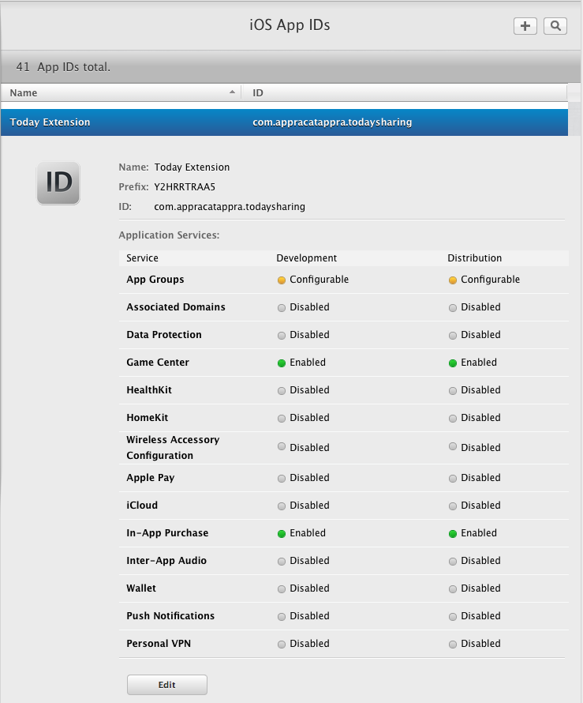
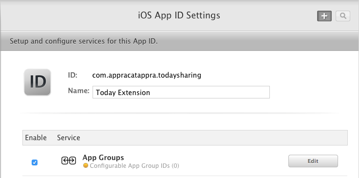

# App Group Capabilities in Xamarin.iOS

_Adding capabilities to an application often requires additional provisioning setup. This guide explains the setup needed for App Group capabilities._

An App Group allows different applications (or an application and its extensions) to access a shared file storage location. App Groups can be used for data like:

* [Apple Watch Settings](~/ios/watchos/app-fundamentals/settings.md)
* [Shared NSUserDefaults](~/ios/app-fundamentals/user-defaults.md)
* [Shared Files](~/ios/watchos/app-fundamentals/parent-app.md#files)

## Configure a new App Group

The shared location is configured using an [App Group](https://developer.apple.com/library/content/documentation/Miscellaneous/Reference/EntitlementKeyReference/Chapters/EnablingAppSandbox.html#//apple_ref/doc/uid/TP40011195-CH4-SW19), which is configured in the **Certificates, Identifiers & Profiles** section on [Apple Developer Center](https://developer.apple.com/account/). This value must also be referenced in each project's Entitlements.plist.

The app group will have an identifier, which is typically the Bundle ID with a group. prefix. For example, the Bundle ID `com.xamarin.WatchSettings` would have the app group `group.com.xamarin.WatchSettings`.

To create a new App Group, do the following:

1. Visit Apple's [iOS Developer Center](https://developer.apple.com/account/), open your **Account** and log in.
2. Select **Certificates, IDs & Profiles**.
3. Under **Identifiers** select **App Groups** and click the **+** button to create a new group.
4. Enter a **Name** and an **Identifier** for the new group and click the **Continue** button: 
   
    

5. Click the **Register** button to create the group and the **Done** to return to the list of registered App Groups.

## Configure an App to use App Groups

With the App Group created, configure the App IDs so that the apps can use it.

Do the following:

1. Visit Apple's [iOS Developer Center](https://developer.apple.com/account/), and log in with an Apple Developer Account.
2. From the **Program Resources** menu, select **Certificates, IDs & Profiles**.
3. Under **Identifiers** select **App IDs** and click the **+** button to create a new ID.
4. Enter a Name for the App ID and give it an Explicit App ID.
5. Under **App Services** enable **App Groups**, then click the Continue button:

    

6. Verify the settings and click the **Register** button to create the App ID.
7. Click the **Done** button to return to the list of registered App IDs.
8. Select the newly created App ID from the list and click the **Edit** button:

    

9. Under Service **App Group**, click the **Edit** button:

    

10. Select the App Group that was created above and click the **Continue** button:

    

11. Click the **Assign** button, then the **Done** button to return to the list of registered App IDs.
12. Repeat these steps for any Apps (or Extensions) that will be using the App Group.

## Next Steps

The list below describes additional steps that may need to be taken:

* Use the framework namespace in your app.
* Add the required entitlements to your App. Information on the entitlements required and how to add them is detailed in the [Working with Entitlements](~/ios/deploy-test/provisioning/entitlements.md) guide.
* In the App's **iOS Bundle Signing**, ensure that the **Custom Entitlements** is set to **Entitlements.plist**. This is _not_ the default setting for Debug and iOS Simulator builds.

If you encounter issues with app services, refer to the [Troubleshooting](~/ios/deploy-test/provisioning/capabilities/index.md) section of the main guide.
