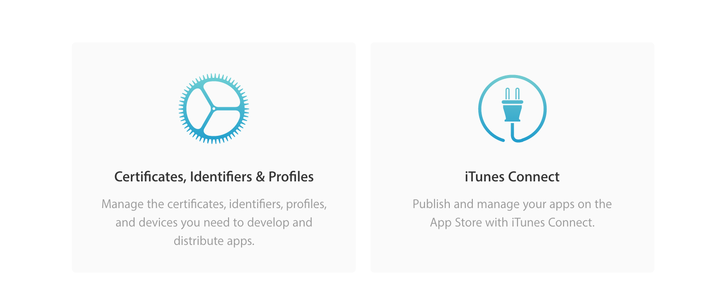
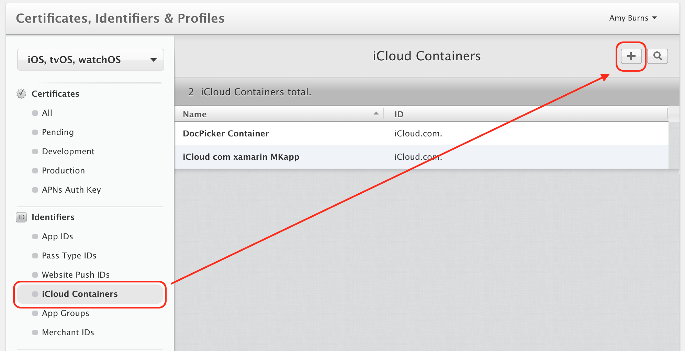
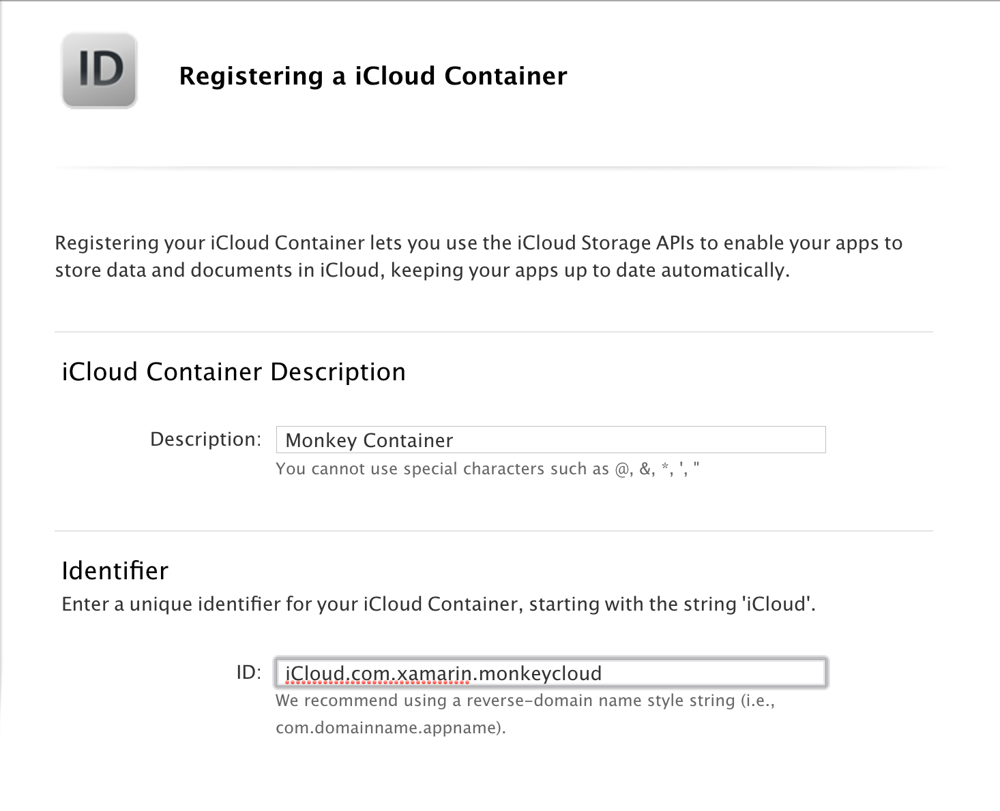
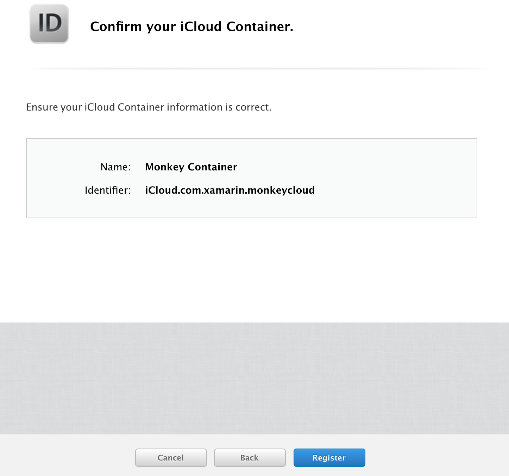
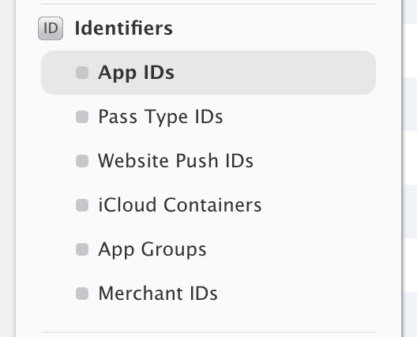
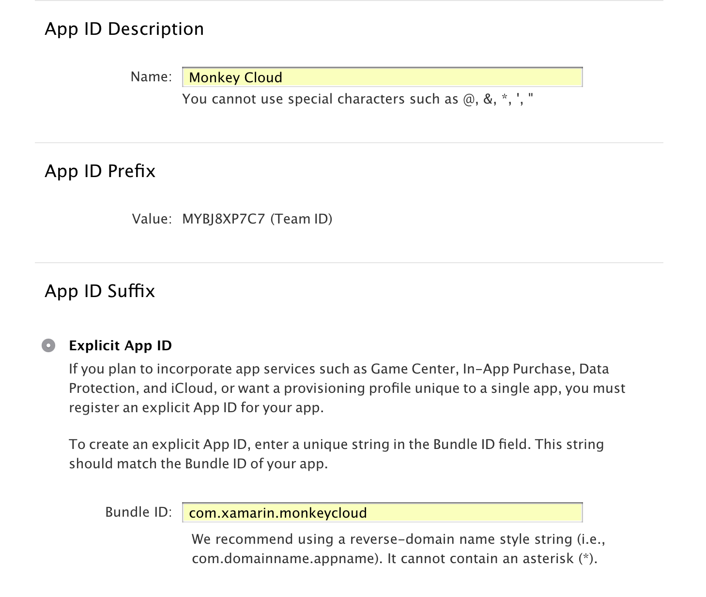
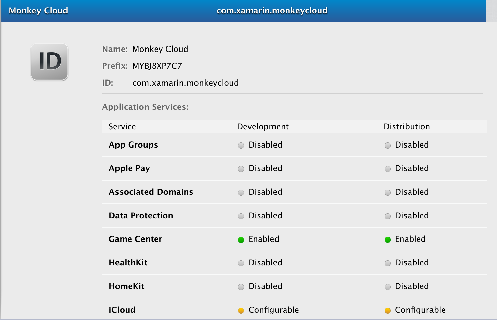
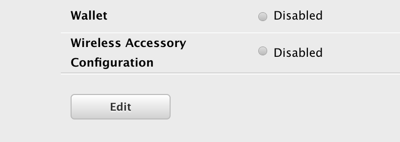
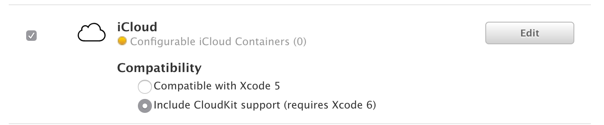
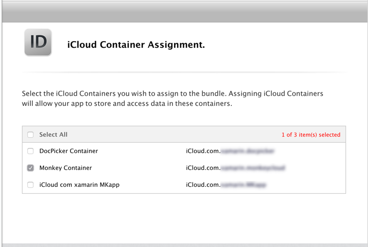

# iCloud Capabilities in Xamarin.iOS

_Adding capabilities to an application often requires additional provisioning setup. This guide explains the setup needed for iCloud capabilities._

iCloud provides iOS users with a convenient and simple way to store their content and share it between devices. There are four ways that developers can use iCloud to provide a means of storage for their users: Key-Value storage, UIDocument Storage, CoreData, and using CloudKit directly to provide storage for Individual files and directories. For more information on these, refer to the [Introduction to iCloud](~/ios/data-cloud/introduction-to-icloud.md) guide.

Adding the iCloud capability to an application is slightly more difficult than other App Services because of _containers_. Containers are used in iCloud to store information for an app, and allow all information contained in a single iCloud account to be segregated – like the sandboxing on a user’s iOS device. For more information on containers, refer to the [Introduction to CloudKit](~/ios/data-cloud/intro-to-cloudkit.md) guide.

> [!IMPORTANT]
> Apple [provides tools](https://developer.apple.com/support/allowing-users-to-manage-data/) 
> to help developers properly handle the European Union's General Data 
> Protection Regulation (GDPR).

## Developer Center

When provisioning a new app through the developer center there are two steps that need to be taken:

1. Create a container.
2. Create an App ID with the iCloud capability and add the container to it.
3. Create a Provisioning profile that includes this App ID

The steps below will guide you through these steps:

1. Browse to the [Apple Developer Center](https://developer.apple.com/account/) and go to the Certificates, Identifier, and Profiles section: 
    
     

2. Under **Identifiers** select **iCloud Containers**, and then select the **+** to create a new container:  
    
    

3. Enter a **Description** and a unique **Identifier** for the iCloud container: 
    
    

4. Press **Continue**, ensure that the information is correct, and press **Register** to create the iCloud Container:  
    
    

To create a new App ID and add a container to it, do the following:

1. In the [Developer Center](https://developer.apple.com/account/), click on **App IDs** under **Identifiers**: 
    
    

2. Select the **+** button to add a new App ID: 
    
    

3. Enter a **Name** for the App ID and give it an **Explicit App ID**:
    
    

4. Under **App Services** select **iCloud** and choose **Include CloudKit support**:
    
    

5. Select **Continue** and then **Register**. Note that on the confirmation screen, iCloud will display with Configurable selected, with a yellow symbol:   
    
    

6. Return to the list of App IDs and select the one that you have just created: 
    
    

7. Scroll down to the bottom of this expanded section and click **Edit**:
    
    

8. Scroll down the list to iCloud and click the **Edit** button:  
    
    

9. Select the Container to use with this App ID:  
    
    

10. Confirm the Container assignments, and press **Assign**.

This App ID can now be used to generate, or to re-generate, a new provisioning profile, as described in the [Working with Capabilities](~/ios/deploy-test/provisioning/capabilities/index.md) guide. 

For more information on using iCloud, refer to the following guides:

* [Introduction to iCloud](~/ios/data-cloud/introduction-to-icloud.md)
* [Introduction to CloudKit](~/ios/data-cloud/intro-to-cloudkit.md)
* [Introduction to Document Picker](~/ios/platform/document-picker.md)

## Next Steps

The list below describes additional steps that may need to be taken:

* Use the framework namespace in your app.
* Add the required entitlements to your App. Information on the entitlements required and how to add them is detailed in the [Working with Entitlements](~/ios/deploy-test/provisioning/entitlements.md) guide.
* In the App's **iOS Bundle Signing**, ensure that the **Custom Entitlements** is set to **Entitlements.plist**. This is _not_ the default setting for Debug and iOS Simulator builds.

If you encounter issues with app services, refer to the [Troubleshooting](~/ios/deploy-test/provisioning/capabilities/index.md) section of the main guide.
