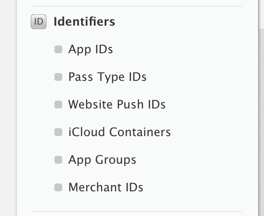
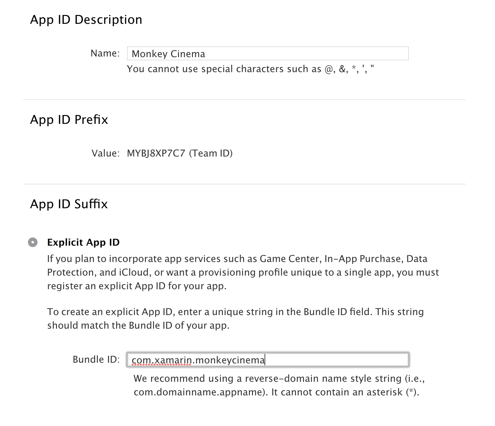
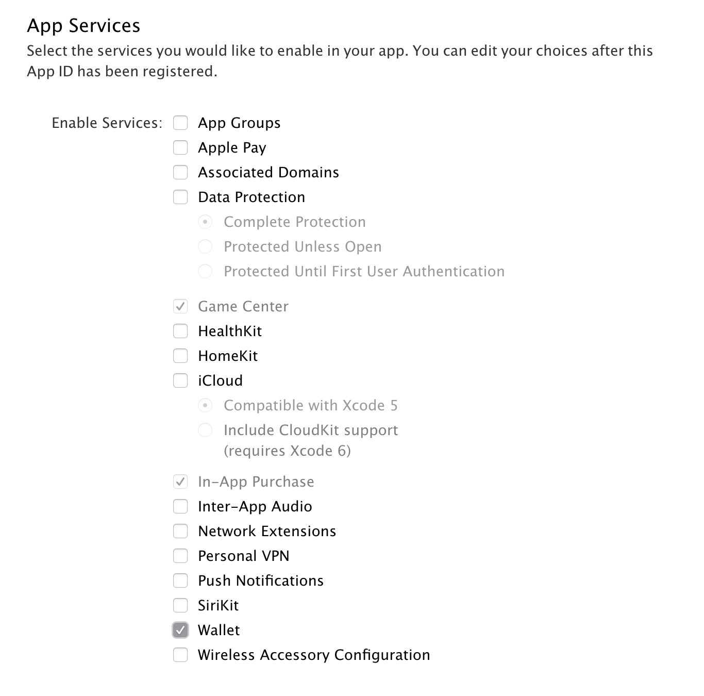
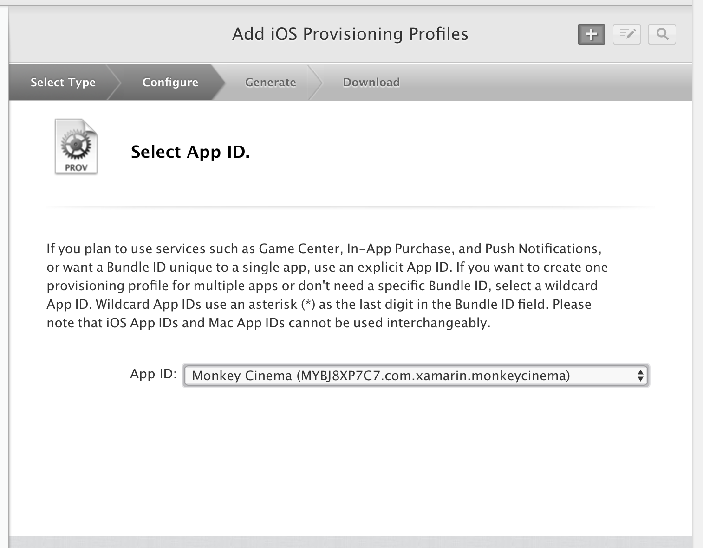

# Wallet Capabilities in Xamarin.iOS

_Adding capabilities to an application often requires additional provisioning setup. This guide explains the setup needed for Wallet capabilities._

Wallet is an app that stores and displays barcodes and other content allowing users to display tickets, boarding passes, and coupons right from their device. This information is stored on a _pass_. For example, a boarding pass or a single ticket would be a singular pass. 

Developers can work with Wallet in a variety of ways:

*	To create a pass, an application does not need to be built. A Passfile is a zipped archive that contains some JSON files and optional metadata files. To prepare this, a [Pass Type ID](~/ios/platform/passkit.md) and a [Pass certificate](~/ios/platform/passkit.md) is required. This information is then declared in a JSON file. More information on provisioning a Passfile can be found in the [Introduction to PassKit](~/ios/platform/passkit.md) guide.

*	Companion Apps are written to distribute passes. They also have the functionality to create, edit, and update passes and then to add them to the Wallet app. A good example of this kind of app would be a cinema app – once a user purchases a ticket through the app, that ticket can be added directly from the app to Wallet. To use a companion app, your provisioning profile must include an App ID with the Wallet features, which can be set by following the steps below. Your app must also include the required entitlements.

*	Conduit Apps are apps which do not manipulate passes directly. They have minimum interaction with the pass beyond receiving it and giving the user the option of adding them to Wallet. These apps do not need any special provisioning or entitlements, but will use some methods from the PassKit Framework.

## Developer Center

To create a new provisioning profile for use with Wallet, do the following:

1.	Browse to the [Certificates, Identifiers, and Profiles](https://developer.apple.com/account/ios/certificate/) section of the Apple Developer Portal.
2.	Under **Identifiers**, browse to **App IDs**: 
    
    

3.	Click the **+** icon in the top right of the page.
4.	Register a new App ID by giving it a **Name** and a bundle identifier. (Note that this bundle identifier must match the bundle ID in your project):
   
    

5.	Select the **Wallet** App Service from the list of services:
    
    

6.	Press **Continue**, and then **Register** to create the App ID.

If required, existing App IDs can be edited to add the Wallet capability.

This App ID can now be used to generate, or to re-generate, a new provisioning profile, as described in the [Working with Capabilities](~/ios/deploy-test/provisioning/capabilities/index.md) guide:

For more information on using Wallet refer to the following guides:

*	[Introduction to PassKit](~/ios/platform/passkit.md)
 
## Next Steps
 
The list below describes additional steps that may need to be taken:

* Use the framework namespace in your app.
* Add the required entitlements to your App. Information on the entitlements required and how to add them is detailed in the [Working with Entitlements](~/ios/deploy-test/provisioning/entitlements.md) guide.
* In the App's **iOS Bundle Signing**, ensure that the **Custom Entitlements** is set to **Entitlements.plist**. This is _not_ the default setting for Debug and iOS Simulator builds.

If you encounter issues with app services, refer to the [Troubleshooting](~/ios/deploy-test/provisioning/capabilities/index.md) section of the main guide.