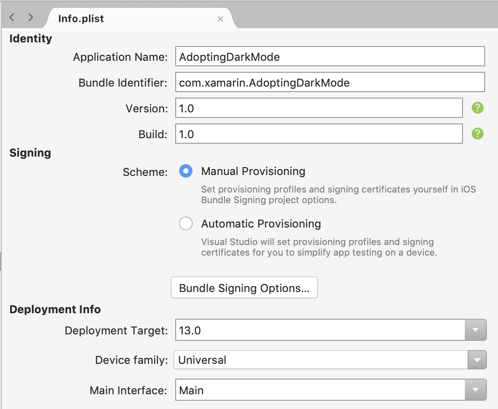
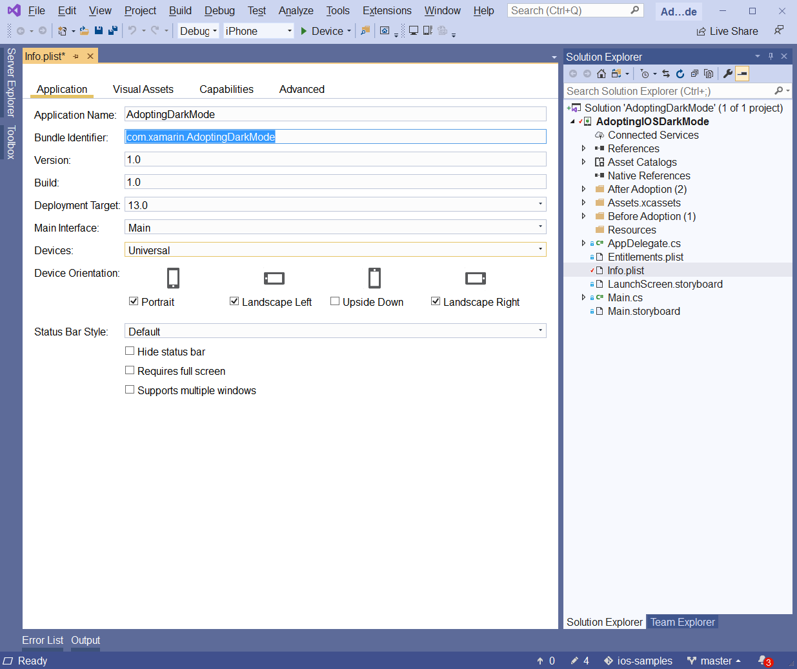
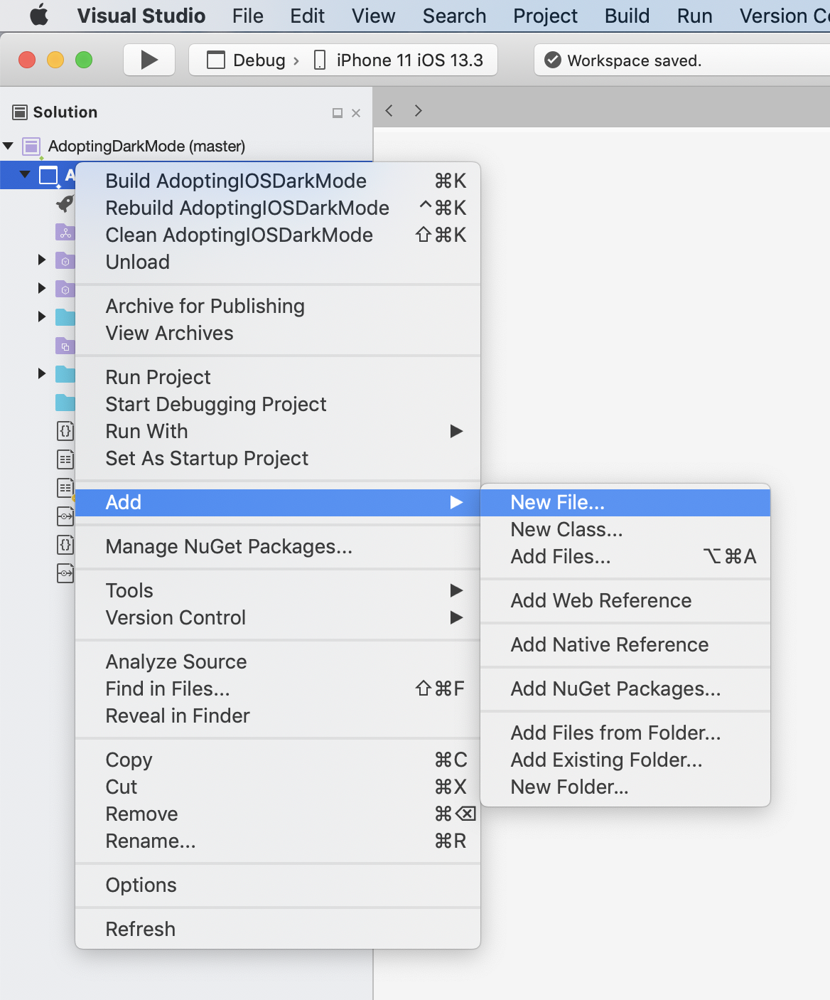

# Working with entitlements in Xamarin.iOS

_Entitlements are special app capabilities and security permissions granted to applications that are correctly configured to use them._

In iOS, apps run in a _sandbox_, which provides a set of rules that limit access between the application and certain system resources or user data. _Entitlements_ are used to request that the system expand the sandbox to give your app additional capabilities.

To extend the capabilities of your app, an entitlement must be provided in your app’s Entitlements.plist file. Only certain capabilities can be extended and these are listed in the [Working with Capabilities](~/ios/deploy-test/provisioning/capabilities/index.md) guide and described [below](#entitlement-key-reference). Entitlements are passed to the system as a Key/Value pair, and generally only one is required per capability. The specific Keys and Values are described in the [Entitlement key reference](#entitlement-key-reference) section later in this guide.
Visual Studio for Mac and Visual Studio provide a clear interface for adding entitlements in a Xamarin.iOS app through the Entitlements.plist editor.
This guide introduces the Entitlements.plist editor and how to use it. It also provides a reference of all the entitlements that can be added to an iOS project for each capability.

## Entitlements and provisioning

The Entitlements.plist file is used to specify entitlements and is used to sign the application bundle.

However, some additional provisioning is required to ensure that the app is code signed correctly. The provisioning profile used must contain an App ID that has the required capability enabled. For information on how to do this, refer to the [Working with Capabilities](~/ios/deploy-test/provisioning/capabilities/index.md) guide.

> [!IMPORTANT]
> The Entitlements.plist file helps fill in the correct properties for an application using capabilities, but it can't generate a provisioning profile as it is not linked to an Apple developer account. You will still need to generate a provisioning profile using the developer portal to deploy and distribute the application.

## Set entitlements in a Xamarin.iOS project

In addition to selecting and configuring the required application services when defining the App ID, the entitlements must also be configured in the Xamarin.iOS project by editing the **Info.plist** and **Entitlements.plist** files.

# [Visual Studio for Mac](#tab/macos)

To configure the entitlements in Visual Studio for Mac, do the following:

1. In the **Solution Explorer**, double-click the **Info.plist** file to open it for editing.
2. In the **iOS Application Target** section, fill in a name for the application and enter the **Bundle Identifier** that was created when the App ID was defined:

  

3. Save the changes to the **Info.plist** file.
4. In the **Solution Explorer**, double-click the **Entitlements.plist** file to open it for editing:

    

5. Select and configure any entitlements required for the Xamarin.iOS application so that they match the setup that was defined when the App ID was created.
6. Save the changes to the **Entitlements.plist** file.

# [Visual Studio](#tab/windows)

To configure the entitlements in Visual Studio, do the following:

1. In the **Solution Explorer**, right-click the **Info.plist**, select **Open With…** and **Property List Editor** file to open it for editing.
2. In the **iOS Application Target** section, fill in a name for the application and enter the **Bundle Identifier** that was created when the App ID was defined:

  

3. Save the changes to the **Info.plist** file.
4. In the **Solution Explorer**, right-click on the **Entitlements.plist** file, select **Open With…** and **Property List Editor** to open it for editing:

    

    Alternatively, double-clicking on the **Entitlements.plist** file will open the XML Source editor which will allow you to set the Entitlement property and key value as detailed in the [Entitlements Reference](#keyreference) section below.

5. Select and configure any entitlements required for the Xamarin.iOS application so that they match the setup that was defined when the App ID was created.
6. Save the changes to the **Entitlements.plist** file.

-----

## Adding a new Entitlements.plist file

Entitlements are added to an app via the Entitlements.plist file. This file is included in Xamarin.iOS projects by default but may be missing from older projects.

To add an Entitlements.plist file to your Xamarin.iOS do the following:

1.	Right-click on the project file and browse to **Add > New File…**:

	
2.	In the New File dialog select **iOS > Property List** and name it Entitlements:

	

## Entitlement key reference

Entitlement keys can be added via the Source panel of the Entitlements.plist editor. The required keys will normally be added when using the Entitlements.plist editor but are listed below for reference.

### Wallet

*	**Description**: Formally known as Passbook, wallet is an app that stores and manages passes. These passes may be credit cards, store cards, boarding passes, or tickets.

    - **Pass Type Identifier**
        * **Keys**: com.apple.developer.pass-type-identifiers
        * **String**: `$(TeamIdentifierPrefix)*`

* **Notes**:
    - This will enable your app to allow all pass types. To restrict your app and only allow a subset of team pass types, set the string value to:
        `$(TeamIdentifierPrefix)pass.$(CFBundleIdentifier)`

    Where pass.$(CFBundleIdentifier) is the Pass ID that has been created [above](~/ios/platform/passkit.md)

<a name="icloud" />

### iCloud

*	**Description**: iCloud provides iOS users with a convenient and simple way to store their content and share it between devices. There are four ways developers can use iCloud to provide a means of storage for their users: Key-Value storage, UIDocument Storage, CoreData, and using CloudKit directly to provide storage for Individual files and directories. For more information on these, refer to the Introduction to iCloud guide.

    - **iCloud Documents & CloudKit**
        - **Keys**: com.apple.developer.ubiquity-container-identifiers
        - **String**: `$(TeamIdentifierPrefix)$(CFBundleIdentifier)`
    - **iCloud KeyValue Storage**
        - **Key**: com.apple.developer.ubiquity-kvstore-identifier
        - **String**: `$(TeamIdentifierPrefix)$(CFBundleIdentifier)`

* **Notes**:
    - The `$(TeamIdentifierPrefix)` string can be located by logging to developer.apple.com and visit the **Member Center > Your Account > Developer Account Summary** to get your Team ID (or Individual ID for single developers). It will be a 10 character string ( A93A5CM278 for example).
    - The `$(CFBundleIdentifier)` string begins with `iCloud` and is set when the iCloud container is crated as per the steps in the [Working with Capabilities](~/ios/deploy-test/provisioning/capabilities/icloud-capabilities.md) guide.
    - The $`(TeamIdentifierPrefix)` and `$(CFBundleIdentifier)` placeholders can be used and will be substituted for the correct values at build time.

> [!IMPORTANT]
> Apple [provides tools](https://developer.apple.com/support/allowing-users-to-manage-data/) 
> to help developers properly handle the European Union's General Data 
> Protection Regulation (GDPR).

### App Groups

- **Description**: An App Group allows different applications (or an application and its extensions) to access a shared file storage location.

    - **Key**: com.apple.security.application-groups
    - **String**: group.$(CFBundleIdentifier)

<a name="apple-pay" />

### Apple Pay

- **Description**: Apple pay enables users to pay for physical goods via their iOS device.
    - **Key**: com.apple.developer.in-app-payments
    - **String**: merchant.your.mechantid

### Push Notifications

- **Key**: aps-environment
- **String**: `development` or `production`

### Siri

- **Description**: SiriKit allows an iOS app to provide services that are accessible to Siri and the Maps app on an iOS device using App Extensions and the new Intents and Intents UI frameworks. For more information, refer to the Introduction to SiriKit guide.
    - **Key**: com.apple.developer.siri

### Personal VPN

- **Key**: com.apple.developer.networking.vpn.api
- **String**: allow-vpn

### Keychain Sharing

- **Description**: Keychain sharing enables app developers to share passwords that are stored in the device keychain with other apps developed by the same team. Access can be restricted by passing a keychain access group identifier in the string.
    - **Key**: keychain-access-groups
    - **String**: $(AppIdentifierPrefix) $(CFBundleIdentifier)

### Inter-App Audio

- **Description**: Inter-App Audio enables developers to stream audio between apps.
    - **Key**: inter-app-audio
    - **Boolean**: YES

### Associated Domains

- **Description**: Associated domains that should be handled as universal links should be passed with this entitlement. Universal links can be implemented to allow deep linking between your app and website. You should provide an entry to each domain that your app supports and each entry should begin with `applinks:`
    - **Key**: com.apple.developer.associated-domains
    - **String**: webcredentials:example.com

### Data Protection

- **Description**: Enabling data protection uses built-in encryption hardware to store sensitive data used in your app in an encrypted format. By default, the level of protection is set to complete protection (files are only accessible when then device is unlocked).
    - **Key**: com.apple.developer.default-data-protection
    - **String**: NSFileProtectionComplete

### HomeKit

- **Description**: The HomeKit framework provides a platform for setting up, configuring, and managing supported home automation devices – all from an iOS device. For more information on using HomeKit, refer to the Introduction to HomeKit guide.
    - **Key**: com.apple.developer.homekit
    - **Boolean**: YES

### HealthKit

- **Description**: HealthKit is a framework introduced in iOS 8 that provides a centralized, coordinated, and secure data store for health-related information. For more information on using HealthKit, refer to the Introduction to HealthKit guide.
    - **Key**: com.apple.developer.healthkit
    - **Boolean**: YES

### Wireless Accessory Configuration

- **Description**: Using the Wireless Accessory Configuration allows your app to configure MFi Wi-Fi accessories
    - **Key**: com.apple.external-accessory.wireless-configuration
    - **Boolean**: YES

### ClassKit

- **Description**: ClassKit enables teachers to view student progress on 
assigned activities in your app.
    - **Key**: com.apple.developer.ClassKit-environment
    - **String**: `development` or `production`

## Summary

This guide introduced entitlements and how to use them in Visual Studio for Mac and in Visual Studio. It also provided a reference of the Key/Value pairs for each capability.
