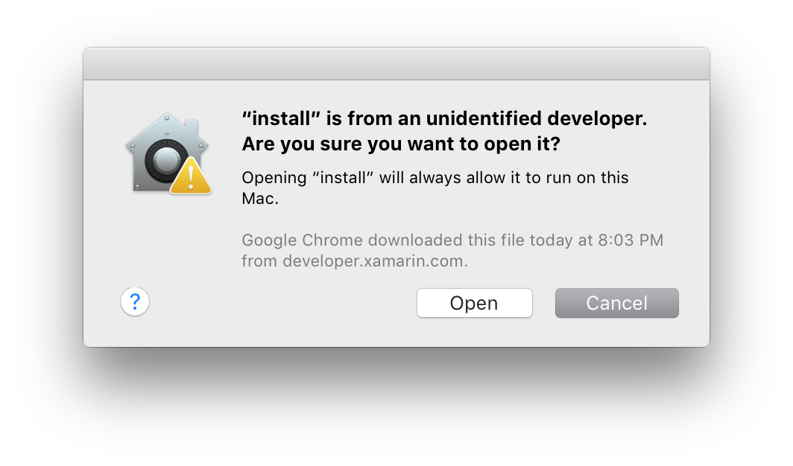
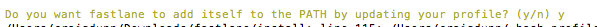

# Introduction to fastlane for iOS

fastlane is an open source project, created to simplify the confusing and often tedious process of releasing iOS and Android apps. It comprises of several utilities that each handle a specific aspect of app release, such as:

- [deliver](https://github.com/fastlane/fastlane/tree/master/deliver#readme) – Manages and uploads screenshots, metadata, and application bundles to iTunes Connect.
- [produce](https://github.com/fastlane/fastlane/tree/master/produce#readme) – Creates and app in iTunes Connect and the Developer Portal (often known as AppID). It also includes support for App Groups and application services.
- [pem](https://github.com/fastlane/fastlane/tree/master/pem#readme) – Creates and manages Push Notification Provisioning Profiles.
- [gym](https://github.com/fastlane/fastlane/tree/master/gym#readme) – This can be used to build and sign an iOS application. (Xamarin apps already use MSBuild to build, sign, and archive apps)
- [cert](https://github.com/fastlane/fastlane/tree/master/cert#readme) – Creates and manages code signing certificates 
- [sigh](https://github.com/fastlane/fastlane/tree/master/sigh#readme) – Creates and manages provisioning profiles
- [match](https://github.com/fastlane/fastlane/tree/master/match#readme) – Creates and maintains certificates and profiles and stores them in a git repository so that they can be synced across a development team.

fastlane can be used in different ways: through terminal commands, through file based means, or by using environment variables for continuous integration builds. 

This guide deals specifically with setting up a device for development with iOS apps, and focuses on the **cert**, **sigh** and **match** utilities. 

The content provided can be used as a springboard to aid with app distribution, including fully automating the process on a continuous integration server. However, it's important to note that fastlane is a 3rd party who make tools to support Xcode projects and therefore some tools or commands such as `fastlane init` may not work as expected with csproj files. For more information on using fastlane, additional tools, or releasing for Android using fastlane, refer to [https://fastlane.tools/](https://fastlane.tools/)

<a name="Installation" />

## Installation

1. Make sure that Xcode command line tools are installed on the macOS machine. To install the tools, use the command `xcode-select --install` in Terminal. If they are already installed, the following error will be displayed:

    ```bash
    error: command line tools are already installed, use "Software Update" to install updates
    ```

2. Download the fastlane tools from [https://download.fastlane.tools](https://download.fastlane.tools). 

    > [!NOTE]
    > It is possible to install fastlane tools from Homebrew using `brew cask install fastlane` or via Rubygems (2.0 or above) using `sudo gem install fastlane –NV`. However using the installer will ensure that the correct dependencies are available. 

3. Install fastlane by unzipping the file, and double-click on the `install` executable. If you get an error advising that the file "can't be opened because it is from an unidentified developer", press OK and do the following:
    - Control + Click on the `install` executable. This will display the dialog below:

	  
	
    - Press OK to start installing fastlane tools

4. Terminal will prompt you with the dialog illustrated below. Press `y`:

  
 
4. Run `which fastlane` before using fastlane for the first time. The path should look like the following: 

    ```bash
    /Users/[user]/.fastlane/bin
    ```

5. If the path matches the above, you're ready to get started.

     If not, do the following:
    On macOS open `.bash_profile`, which is a hidden plaintext file in the home directory, with the following command:

    ```bash
    open ~/.bash_profile
    ```

6. Add the following PATH environment variable, and save it: 

    ```bash
    export PATH="$HOME/.fastlane/bin:$PATH"
    ```

7.  Run `which fastlane` again, to confirm the path looks like `/Users/[user]/.fastlane/bin`


## Updating fastlane

fastlane is a very active open source project that regularly pushes new releases. When a new version of fastlane is available, you will be advised when you run any fastlane command:

[](images/fastlane-image0.png#lightbox)


To update to a new version of fastlane, download the latest package from [here](https://download.fastlane.tools) and double-click on the install package to run it:

[](images/fastlane-image0a.png#lightbox)


## Contents

This series of guides presents some of the tools that fastlane uses for code signing your iOS app in preparation for development or distribution. The tools currently covered are:

- [cert](~/ios/deploy-test/provisioning/fastlane/cert.md)
- [sigh](~/ios/deploy-test/provisioning/fastlane/sigh.md)
- [match](~/ios/deploy-test/provisioning/fastlane/match.md)

cert and sigh deal with creating and managing signing certificates and provisioning profiles on a local machine. match takes this process a step further. It creates and manages certificates and provisioning profiles, and stores them in a git repository, allowing them to be accessible by all members of a development team. Read through each section to find out how they work and how you can use them.

## Using fastlane tools with Xamarin

Once you have created a signing identity and provisioning profiles with fastlane, setting the bundle signing options in Visual Studio for Mac should be straightforward, providing that the certificates and private keys are in the macOS Keychain and that provisioning profiles are in the folder `~/Library/MobileDevice/Provisioning Profiles`.

To set the code signing options for a Xamarin.iOS application, right-click on the project name, select **Project Options > Build > iOS Bundle Signing** and set the Signing Identity and Provisioning Profile explicitly, as demonstrated below:

[](images/fastlane-image11.png#lightbox)

## Related Links

- [fastlane Docs](https://fastlane.tools/)
- [fastlane Code Signing Docs](https://docs.fastlane.tools/codesigning/getting-started/)
- [Code Signing guide](https://codesigning.guide/)
