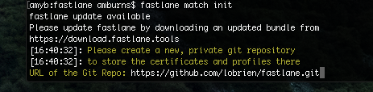

# fastlane for iOS - match

Traditionally, device provisioning has been done by each member of a development team via Xcode or on the Apple Developer Portal. It consists of several steps:

- Requesting a development certificate
- Adding a device to the portal
- Creating an App ID
- Creating a provisioning profile
- Downloading profiles and certificates

More information on the steps required to set up a device for development either manually or via Xcode can be found in the [Device Povisioning](~/ios/get-started/installation/device-provisioning/index.md) guide.

This guide introduces how to use fastlane tools as an alternative to using Xcode.

## Installation

For information on installing fastlane, refer to the Introduction to [fastlane](~/ios/deploy-test/provisioning/fastlane/index.md#Installation) guide.

<a name="whatismatch" />

## What is match?

match takes care of creating and maintaining code signing certificates and provisioning profiles, and allows an iOS development team to share one code signing identity across all developers.

When deploying an app to the App Store, conducting beta testing, or installing the app on a device, each member of a development team has their own signing identity. This can result in conflicting identities and profiles, and the need to manually create, rotate, and manage profiles and App IDs.

Instead, match creates and maintains all certificates and profiles for you and stores them in a private git repo. This allows all developers in a team to access and use these credentials. In turn, this provides extra security for your certificates: in addition to being in a private git repository, they also are also encrypted with a [passphrase](#passphrase). Storing code signing artifacts in a repository enables team agents and administrators to update and rotate certificates as needed, meaning less time is spent distributing new certificates to each developer.

> [!IMPORTANT]
> match does not currently support In-House Enterprise profiles.

<a name="initializing" />

## Initializing Your Project with match

If you are the team administrator, create a private git repo, either through github.com or bitbucket.com ensure you add all team members as contributors to the repo.

Using your terminal, change directory to the project directory and run:

    fastlane match init

When prompted, enter the URL of the git repo:

 

The URL can be found and copied by clicking the **Clone or Download** button on github.com, as illustrated below:

Initializing the project creates a matchfile – a text file which can be edited to pass environment variables to the match tool. An matchfile example is illustrated below:

<a name="running" />

## Running match

> [!NOTE]
> fastlane recommends that before running match for the first time, you should consider clearing your existing profiles and certificates using the [match nuke command](#using).

Depending on what environment you require you can use any of the following commands to create a new certificate and provisioning profile and store it in your new git repo:

    fastlane match appstore

    fastlane match adhoc

    fastlane match development

In addition to creating new certificates and profiles, using any of these commands will add (or update, if they already exist) the following items to your git repo:

- Certificates folder
- Profiles folder
- A readme with basic instructions
- A match version

Provisioning profiles are installed in `~/Library/MobileDevice/Provisioning Profiles`. Certificates and private keys are installed directly in your Keychain.

<a name="using" />

### Using the `nuke` command

If you have untidy certificates you can use `nuke` to revoke certificates and profiles for each environment using the following commands:

    fastlane match nuke

To revoke all certificates and provisioning profiles for a specific environment:

    fastlane match nuke development

 or

    fastlane match nuke distribution

fastlane will confirm the files that will be removed before anything is deleted.

<a name="passphrase" />

### Passphrase

When running `match` for the first time, you will be asked to set a passphrase for the git repo. Make sure to remember the password, as you'll need it when you run match on a different machine. This is an additional layer of security: each of the files will be encrypted using OpenSSL. Each subsequent running of `match` on a new machine will prompt for this passphrase – after initially entering it the passphrase will be added to the local keychain.

To set the passphrase to decrypt your profiles using an environment variable, use `MATCH_PASSWORD`.

<a name="options" />

## Additional options

The following options can be used to give additional support when using match:

- Use the `-–help` flag for a list of all available commands:

        fastlane match cert --help

- Use the `-–verbose` flag to increase the verbosity of the output:

        fastlane match --development --verbose

- Use the `--force_for_new_devices` flag to force the provisioning profiles to renew if the device count on the developer portal has changed"

        fastlane match development --force_for_new_devices

## Related Links

- [fastlane - match](https://github.com/fastlane/fastlane/blob/master/match/README.md)
