# Using TestFlight to Distribute Xamarin.iOS Apps

_TestFlight is now owned by Apple, and is the primary way to beta test your Xamarin.iOS apps. This article will guide you through all steps of the TestFlight Process – from uploading your app, to working with iTunes Connect._

Beta testing is an integral part of the software development cycle, and there are many cross-platform applications offering to streamline this process such as [HockeyApp](https://hockeyapp.net/features/), [Applause](https://www.applause.com/mobile-app-testing), and of course Google Play’s Native App Beta Testing for Android apps. This document focuses on Apple’s TestFlight.

TestFlight is Apple’s beta testing service for iOS apps, and is accessible only through [iTunes Connect](https://itunesconnect.apple.com/). It is currently available for iOS 8.0 apps and above. TestFlight allows for beta testing with both internal and external users, and due to a Beta app review for the latter, ensures a much easier process in your final review when publishing to the App Store.

Previously, the binary was generated within Visual Studio for Mac and uploaded to the TestFlightApp website for distribution to testers. With the new process there are a number of improvements that will allow you to have high quality, well tested apps in the App Store. For example:

- The Beta App review needed for external testing ensures a higher chance of success for your final App Store Review, as both require adherence to Apple’s guidelines.
- Prior to uploading, the app needs to be registered with iTunes Connect. This ensures that there will be no mismatch between provisioning profiles, names and certificates.
- The TestFlight app is now a real iOS app, so it operates more quickly.
- Once beta testing is complete, the process to move the app to review is quick and efficient; just one button click.

## Requirements

Only apps that are iOS 8.0 or above can be tested through TestFlight.

All testers must test the app on, at least, an iOS 8 device. However, best practice dictates that your app should be tested on all iOS versions

## Provisioning

To test your builds with TestFlight, you will need to create an **App Store distribution profile** with the new beta entitlement. This entitlement allows beta testing through TestFlight, and any **new** App Store distribution profile automatically contains this entitlement. You can follow the step-by-step instructions in the [Creating a Distribution Profile](~/ios/get-started/installation/device-provisioning/manual-provisioning.md#provisioningprofile) guide to generate a new profile.

You can confirm that your distribution profile contains the beta entitlement when [validating your build in Xcode](~/ios/deploy-test/app-distribution/app-store-distribution/publishing-to-the-app-store.md), as illustrated below:

1. Open XCode on the Mac build host after archiving the app
2. Select the **Window > Organizer** menu
3. Select **Archives** on the left
4. Select the Archive you want to validate and click the **Validate** button

[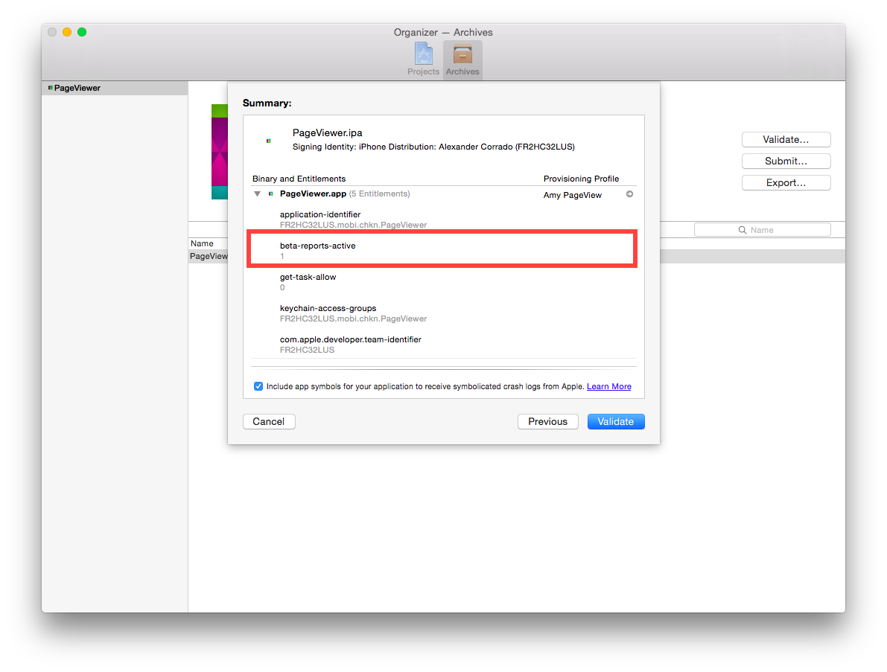](testflight-images/validate-build.png#lightbox)

## TestFlight Workflow

The following workflow describes the steps needed to start using TestFlight for Beta testing of your app:

1. For new apps, create an [iTunes Connect record](~/ios/deploy-test/app-distribution/app-store-distribution/itunesconnect.md).
2. [Archive and Publish](~/ios/deploy-test/app-distribution/app-store-distribution/publishing-to-the-app-store.md) your application to iTunes Connect.
3. Manage Beta Testing:
    - Add Metadata.
    - Add Internal Users:
      - Max 100 users, each user can test on up to 30 devices.
    - Add External Users:
      - Max 10000 users.
      - Requires a beta test review, which requires compliance with Apple's guidelines.
4. Receive Feedback from users, act upon it, and return to step 2.

## Create an iTunes Connect record

1. Login to the [iTunes Connect Portal](https://itunesconnect.apple.com/) using your Apple developer credentials.
2. Select **My Apps**:

    [](testflight-images/my-apps.png#lightbox)

3. On the **My Apps** screen, click on the **+** button at the top-left corner of the screen to add a new app. If you have Mac and iOS developer accounts, you will be prompted to choose the new app type here.

You will be presented with the **New iOS App** submission window, which needs to contain exactly the same information as your app's Info.plist

For more information on creating a new iTunes Connect record, refer to the [Creating an iTunes Connect Record](~/ios/deploy-test/app-distribution/app-store-distribution/itunesconnect.md) guide.

### Completing the New iOS App Submission form

The form should reflect exactly the information in your app's Info.plist file, as illustrated below:

[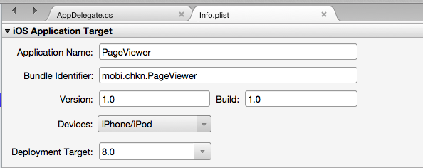](testflight-images/infoplist.png#lightbox)
[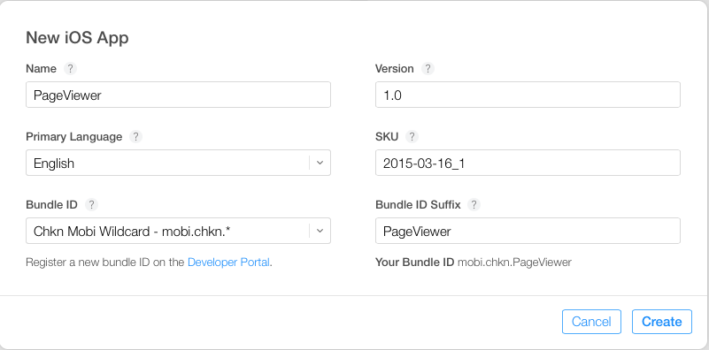](testflight-images/newiosapp.png#lightbox)

- **Name** — The descriptive name used when setting up the App Bundle. This must be an exact match to the **Application name** entry in your `Info.plist`.
- **Primary Language** — The base language used within the app. This is usually whatever language you speak.
- **Bundle ID** — A drop down menu listing all the App IDs created on your developer account.
  - **Bundle ID Suffix** — If you have selected a wild card Bundle ID (i.e. ending with a *, as in our example above), an additional box will appear, prompting for the Bundle ID suffix. In the example the **Bundle ID** is `mobi.chkn.*`, the Suffix is **PageView**. Together these make up the **Bundle Identifier** in our `Info.plist`.
- **Version** — The Version number of the app being uploaded. This is chosen by the developer.
- **SKU** — The SKU is a unique ID for your app, that will not be seen by users. It can be thought of in a similar way as a product ID. In the example above I have chosen the date along with a version number for that date.

## Upload your App

Once the iTunes Connect record has been created, you will be able to upload new builds. Remember that builds must have the new beta entitlement.

First, build your [final distributable](~/ios/deploy-test/app-distribution/app-store-distribution/publishing-to-the-app-store.md) in the IDE, then [submit your app to Apple](~/ios/deploy-test/app-distribution/app-store-distribution/publishing-to-the-app-store.md) through either the Application Loader, or the archive function in Xcode.

<!-- markdownlint-disable MD001 -->

# [Visual Studio for Mac](#tab/macos)

### Create an Archive

 To build a binary in Visual Studio for Mac, you will need to use the _Archive_ function. Right-Click on the project, and select **Archive for Publishing**, as illustrated below:

 [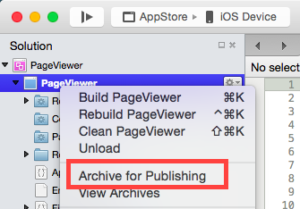](testflight-images/new-archive.png#lightbox)

 Refer to the [Building the Distributable](~/ios/deploy-test/app-distribution/app-store-distribution/publishing-to-the-app-store.md) guide for more information.

### Sign and Distribute your App

 Creating an archive will automatically open the **Archives View**, displaying all archived projects, grouped by solution. To sign your app and prepare it for distribution, select the **Sign and Distribute...**, shown below:

[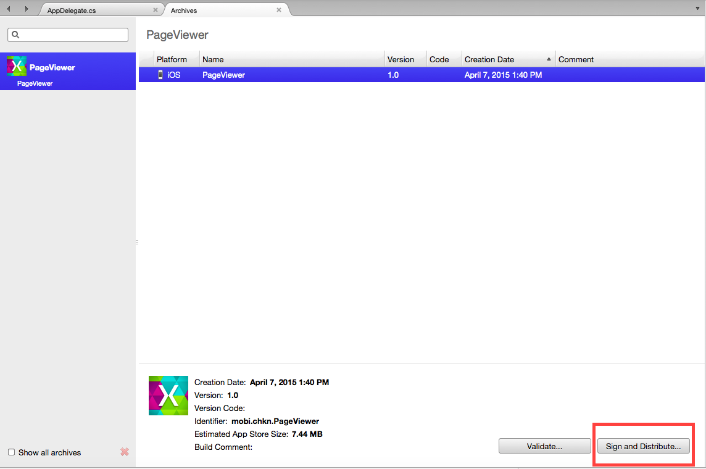](testflight-images/archive-view.png#lightbox)

 This will open the publishing wizard. Select the **App Store** distribution channel to create a package, and open Application Loader. On the Provisioning Profile screen, select your signing identity and provisioning profile, or re-sign with another identity. Verify the details of your package, and click **Publish** to save your `.ipa`

[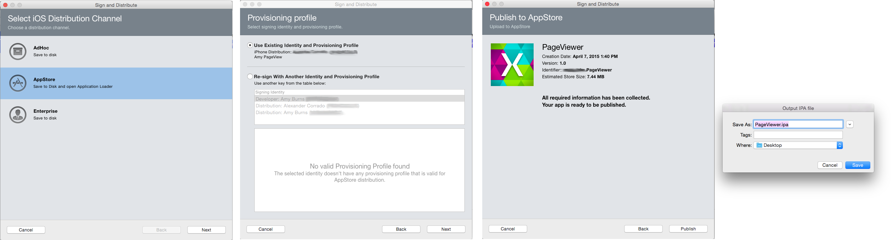](testflight-images/group.png#lightbox)

 Refer to the [Submitting your App to Apple](~/ios/deploy-test/app-distribution/app-store-distribution/publishing-to-the-app-store.md) section for more information on these steps.

### Submitting your Build
 The publishing wizard will open the Application Loader program to all you to upload your build to iTunes Connect. Select the **Deliver Your App** option, and upload the `.ipa` file created above. The Application Loader will validate and upload your build to iTunes Connect.

 Refer to the [Submitting your App to Apple](~/ios/deploy-test/app-distribution/app-store-distribution/publishing-to-the-app-store.md) section for more information on these steps.

# [Visual Studio](#tab/windows)

### Building your final distributable
 As the Xamarin plugin for Visual Studio does not support archiving Xamarin.iOS apps for publishing to the App Store, there are two options for publishing an iOS application from Visual Studio. These are:

1. Upload an IPA created via the Build Adhoc IPA command.
1. Upload a zipped `.app` bundle.

 The [Building the Distributable](~/ios/deploy-test/app-distribution/app-store-distribution/publishing-to-the-app-store.md) guide has instructions for both of these options.

### Submitting your Build
 To submit your app to Apple, you will have to move to your Build Host and use the Application Loader program, which is installed as part of Xcode. For more information on accessing the Application Loader, see to Apple's [Access Application Loader](https://help.apple.com/itc/apploader/#/apdATD1E927-D1E1A1303-D1E927A1126) guide.

Once opened, select the **Deliver Your App** option, and upload the zip or `.ipa` file created above. The Application Loader will validate and upload your build to iTunes Connect.

 Refer to the [Submitting your App to Apple](~/ios/deploy-test/app-distribution/app-store-distribution/publishing-to-the-app-store.md) section for more information on these steps.

-----

The [Publishing to the App Store](~/ios/deploy-test/app-distribution/app-store-distribution/publishing-to-the-app-store.md) guide describes all of the above steps in more detail, refer to this for a more in-depth look into the App Store submission process.

Upon returning to the **My Apps** section of iTunes Connect, you should find that your application has been uploaded successfully. At this point you are now ready to do some Beta Testing!

## Manage Beta Testing

### Add Metadata

To start using TestFlight, browse to the **Prerelease** tab of your app. You should see three tabs showing a list of Builds, Internal Testers, and External Testers, as illustrated below:

[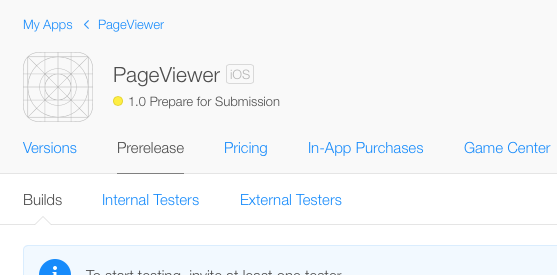](testflight-images/app-uploaded.png#lightbox)

To add metadata to your app, click on the build number, and then TestFlight:

[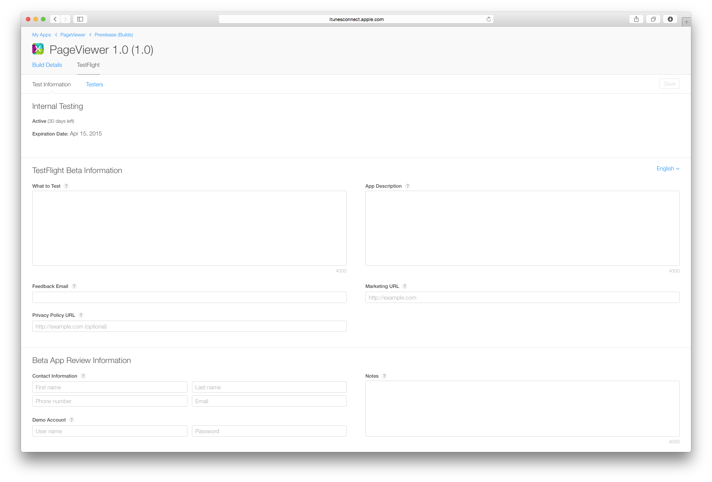](testflight-images/metadata.png#lightbox)

Under **Test Information**, you can provide testers with significant information concerning your app, for instance:

- What to Test
- Description of your App.
- Marketing URL — this will give information about the app you are adding.
- Privacy Policy URL — A URL giving information as to your company's privacy policy.
- Feedback Email.

Note that this metadata **is not** required for internal testers, but **is** required for external testers.

<a name="beta-testing"></a>

### Enable Beta Testing

When you are ready to start testing your app, turn on the **TestFlight Beta Testing** switch for your version:

[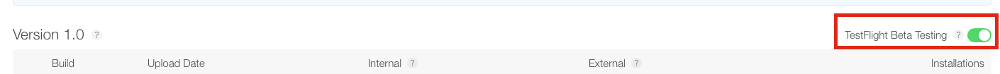](testflight-images/turn-on-testing.png#lightbox)

Each build is active for **60 days** from the date you turned on the TestFlight Beta Switch. You can see how many days there are left for each build on the **Test Information** page:

[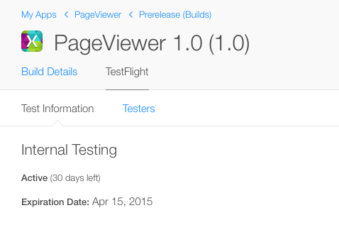](testflight-images/daysleft.png#lightbox)

Testing can be turned off at any time.

### Internal Testers

Internal Testers are members of your development team who have been assigned one of the following roles in iTunes Connect:

- **Admin** – An admin is responsible for adding and managing new users in iTunes Connect.
- **Legal** – The Team Agent is the only admin user that will be assigned the Legal role. It allows them to sign legal contracts.
- **Technical** – A technical user can change most properties regarding an app. For example, edit app information, upload a binary and send an app for review.

Each build can be shared with a maximum of 100 members, who can each test on up to 30 devices.

To add testers, browse to **Users and Roles** on the main iTunes Connect screen:

[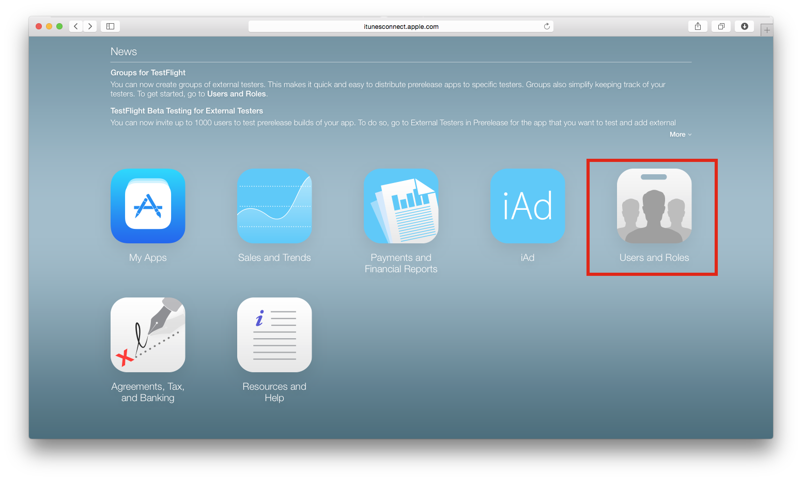](testflight-images/users-and-roles.png#lightbox)

Existing iTunes Connect users will appear in the list. To select them, click on their name, turn on the **Internal Tester** switch, and click **Save**:

[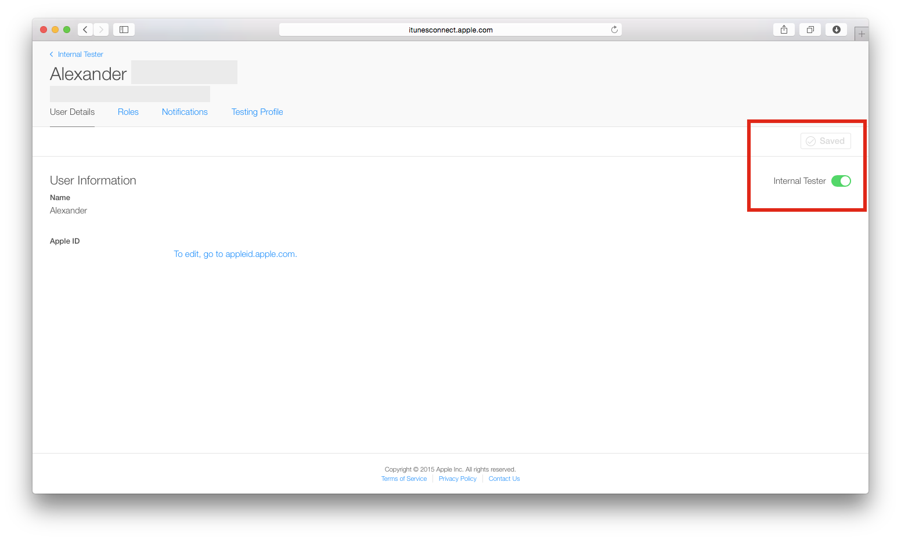](testflight-images/internal-tester.png#lightbox)

To add a user that is not on the list, select the **+** button next to *Users*, and provide a First Name, Last Name and email address to create an account. The user will need to confirm their email to activate the account:

[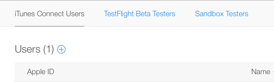](testflight-images/add-new-user.png#lightbox)

If you return to **My Apps > Prerelease > Internal Testers**, you will now see the user(s) that have been added for TestFlight Internal beta testing:

[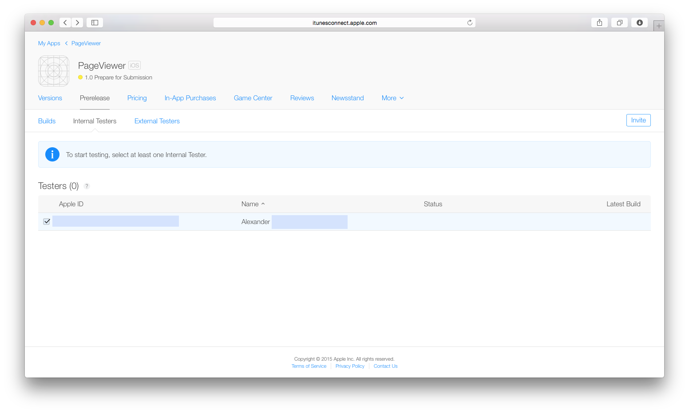](testflight-images/select-users.png#lightbox)

You can invite these testers by selecting their name and clicking the **Invite** button. They will receive an email with an invitation to test your app.

You can see the status of their invitation in the status column of the Internal Testers page:

[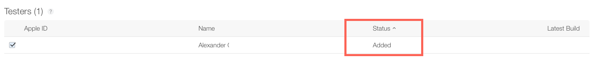](testflight-images/status-added.png#lightbox)

### External Testers

Before inviting External Testers to beta test your app, it needs to go through a Beta App Review and, therefore, needs to conform to the [App Store review guidelines](https://developer.apple.com/app-store/review/guidelines/).

To submit your app for review, click the **Submit For Beta App Review** text next to your build, as shown in the image below:

[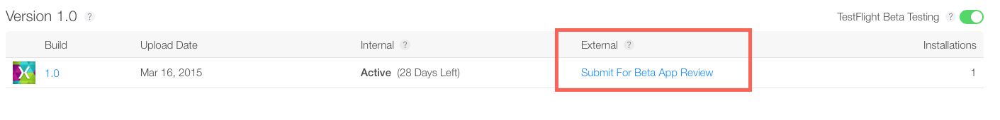](testflight-images/beta-app-review.png#lightbox)

For your app to pass the review, you must enter all of the required metadata on the TestFlight Beta Information page.

You can now start to prepare invitations and add up to 10000 external testers through the External Testers tab, by entering their email, First Name, and Last Name, as illustrated in the screenshot below. The email you enter does not have to be their Apple ID; this is just the email they will receive the invitation on.

[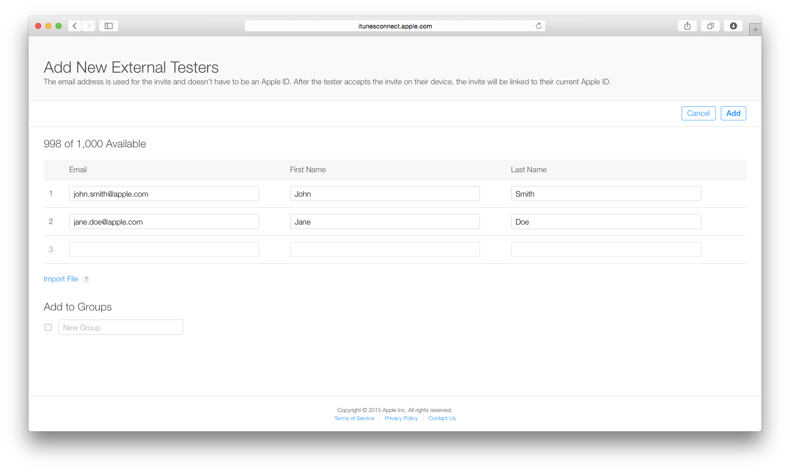](testflight-images/add-external.png#lightbox)

If you have a large number of external testers, you can use the **Import File** link to import a `CSV` file with the following format per line:

```
first name, last name, email address
```

You can also add external testers to different groups to help keep your testers organized.

Once you have entered the details of the external testers, click **Add** and confirm you have the users consent to invite them:

[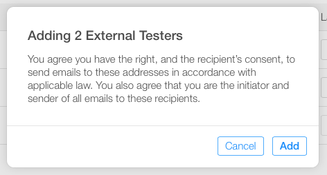](testflight-images/confirm-consent.png#lightbox)

Only after a successful Beta App review will you be able to send invitations to external testers. At this point, the text under **External** on the build page will change to **Send Invites**. Click this to send invitations to all the testers you have already added.

If your app has been rejected, you will need to fix the issues shown in the **Resolution Center**, and resubmit the entire updated binary for review.

## As a Beta Tester

Once you invite your tester, they will receive an email similar to that in the screenshot below:

[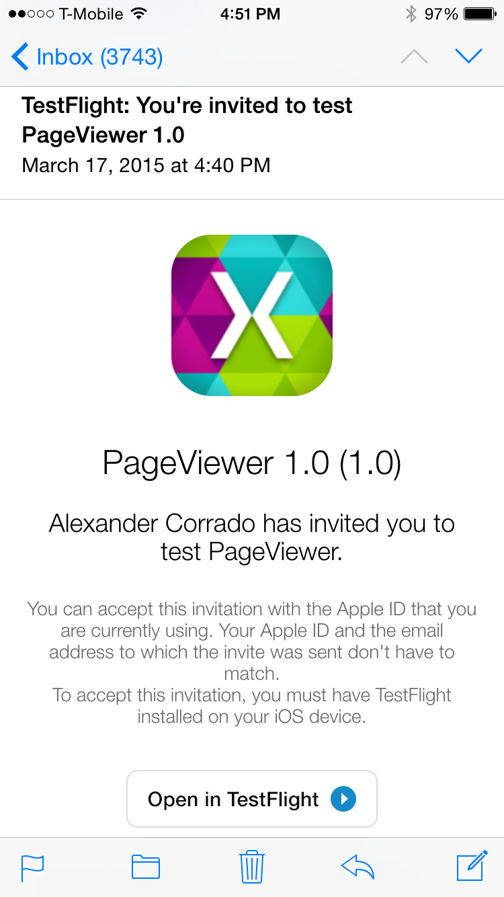](testflight-images/tester-email.png#lightbox)

Once they click the **Open in TestFlight** button your app will open in the TestFlight application, or if it hasn't already been downloaded, will direct to the App Store and allow them to download it.

Once your app opens in TestFlight, it will show details of what to test for, and will prompt the tester to install your application to their iOS 8.0 (or above) device:

[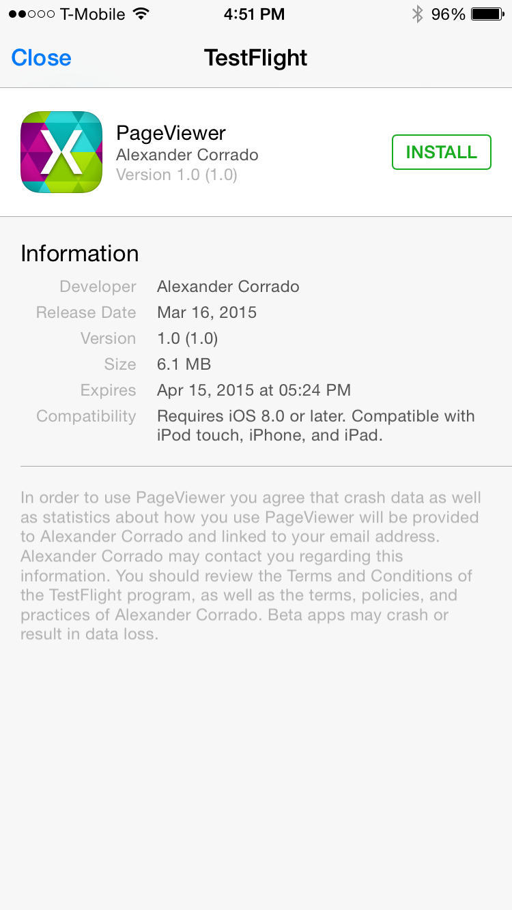](testflight-images/install-app.png#lightbox)

Test builds will be indicated on the device's home screen by an orange dot preceding the application name.

Testers can give feedback through the TestFlight app, and you will relieve this information at the email address provided in the metadata.

### Beta Testing Complete

Once beta testing has been completed, you can now submit your app for App Store review by Apple. This process is done very straightforwardly in iTunes Connect by clicking the **Submit for Review** button, as illustrated below:

[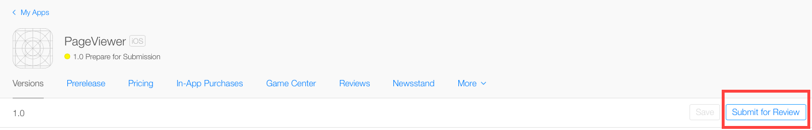](testflight-images/submit-for-review.png#lightbox)

## Summary

This article looked at how to use Apple’s TestFlight Beta Testing through iTunes Connect. It covered how to upload a new build to iTunes Connect, and how to invite internal and external Beta testers to use our app.

## Related Links

- [Creating an iTunes Connect Record](~/ios/deploy-test/app-distribution/app-store-distribution/itunesconnect.md#creating)
- [Publishing to the App Store](~/ios/deploy-test/app-distribution/app-store-distribution/publishing-to-the-app-store.md)
- [Provisioning an App for App Store distribution](~/ios/deploy-test/app-distribution/app-store-distribution/index.md#provisioning)
- [Using the Apple TestFlight Beta](https://developer.apple.com/library/ios/documentation/LanguagesUtilities/Conceptual/iTunesConnect_Guide/Chapters/BetaTestingTheApp.html#//apple_ref/doc/uid/TP40011225-CH35-SW2)
