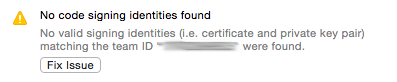

# Xamarin.iOS Testing and Deployment - Troubleshooting

## Code Signing & Provisioning

Code Signing & Provisioning with iOS can be quite awkward, and so it is important to make sure that the code signing certificates and provisioning profiles are in order.

- Large teams should refrain from using the "Fix issue" button in Xcode, illustrated here:

    

    This will create new provisioning profiles and certificates. At best this will create a provisioning profile every time a team member clicks it, causing disorganization with profiles. At worst, it will revoke certificates for everyone else in the company, causing their apps to stop working.

- Keep Keychain Access organized and delete expired certificates and profiles. Enterprise certificates last for three years, while others last only a year. Certificates cannot be renewed, so it will be necessary to create new certificates just before the old ones expire. Make sure to revoke and delete old certificates, and re-sign apps with new certificates.

- Remove the old provisioning profiles as the new ones are installed. This means that Visual Studio for Mac is not in a position where it has to decide which profile to use. To achieve this, first make sure to delete the profile in the Apple developer center, and then browse to *Preferences > Your Account > View Details...*. Select the provisioning profile and click **Show in Finder**. This will reveal the location of the profile in the Mac file system, where it can then be deleted using Finder.

- Ensure that all the required certificates and the corresponding private keys are available. For each team  will need a developer certificate (to install apps on a own device), and a distribution certificate (to install on other devices)

- Relaunch Xcode and Visual Studio for Mac / Visual Studio when a new Provisioning Profile or Certificate is installed.

## TestFlight

Sometimes, testing doesn’t go quite as smoothly as planned.  The following steps can help with resolve issues with TestFlight:

- TestFlight is only available for apps targeting iOS 8 and above.

- There must be an *App Store distribution profile* with the beta entitlement.

- The **New iOS App submission** window must contain exactly the same information as the app's **Info.plist**, and all sections must be filled in. Icons must specified for the app prior to uploading to TestFlight.

- When uploading a new build it will take somewhere between 1 and 5 minutes until the build appears in iTunes Connect.

- The [TestFlight Beta Testing switch](~/ios/deploy-test/testflight.md#beta-testing) must be turned on for each Version of your app.

- Each member of the developer team that is also an internal tester must have the **Internal Tester** switch turned on.

- Users that belong to or own a another iTunes Connect account cannot be internal testers. They only can be added as external testers.

- Internal and External users are added, selected, and invited separately. Each list must be separately managed.

- Apple must approve each build that will be distributed to external testers. If the version of a build changes, a new beta review by Apple is required. If the build number changes, then the review is optional.

- Meta data must be added to builds that are distributed to external testers. This can be accessed by clicking on the build number in **My Apps > Prerelease**.

- Only two builds can be submitted for review each day. Since changing the version forces a review, this means that version numbers can only be changed twice per day.

## Automatically copy .app bundles back to Windows

[!include]
