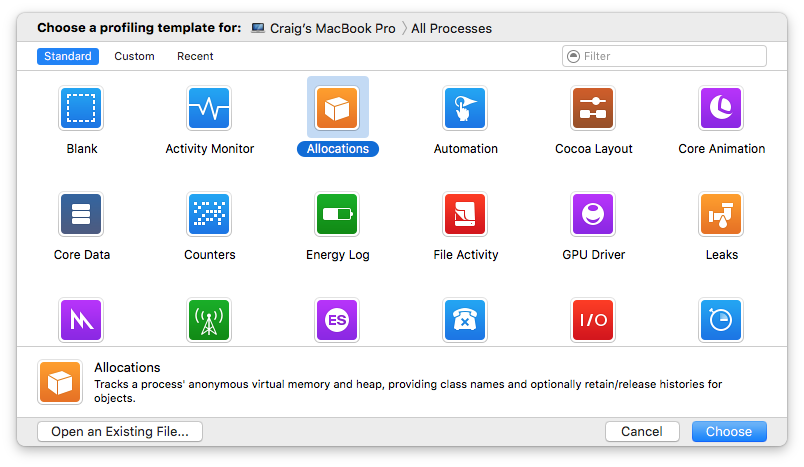
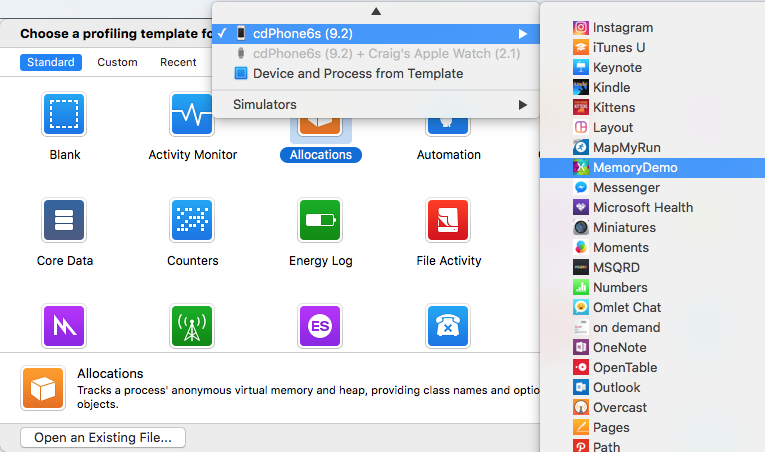
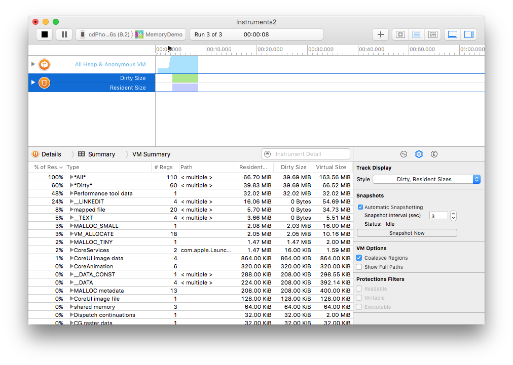
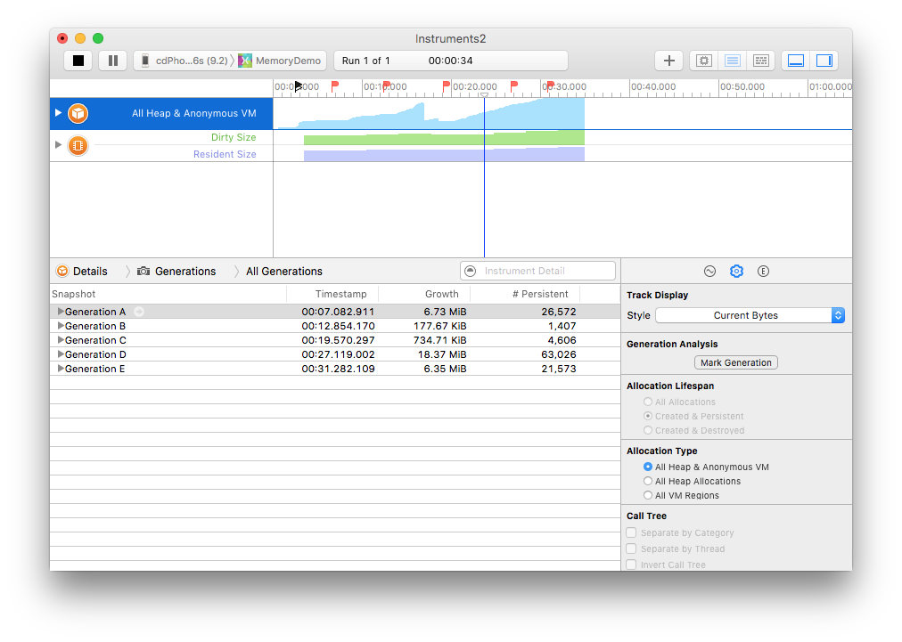
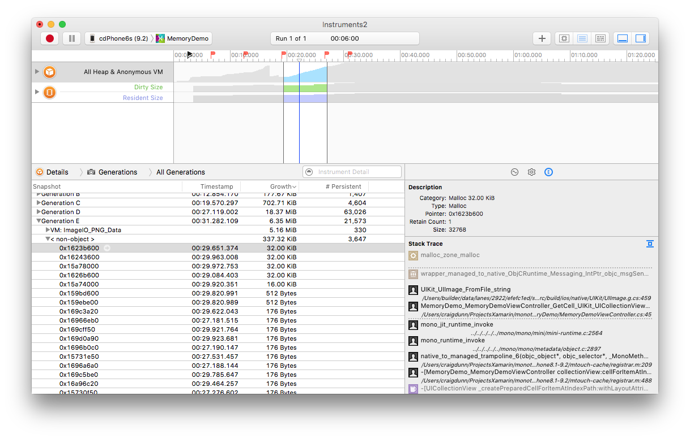
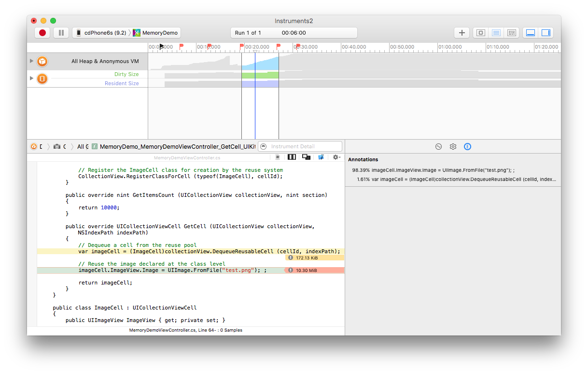
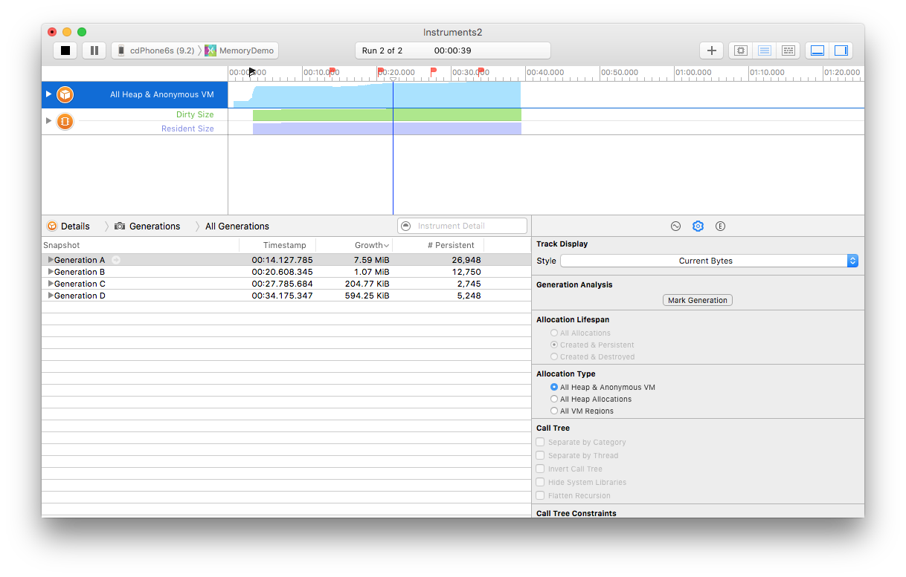

# Walkthrough - Using Apple's Instruments Tool

_This article walks through how to use Apple’s Instruments tool to diagnose memory issues in an iOS application built with Xamarin. It demonstrates how to launch Instruments, take heap snapshots and analyze memory growth. It also shows how to use Instruments to display and pinpoint the exact lines of code that cause the memory issue._

This page demonstrates how to use **Xcode's Instruments tool** to diagnose a memory issue in an iOS application.
First, download the [MemoryDemo Sample](/samples/xamarin/ios-samples/profiling-memorydemo) and open the
**before** solution in Visual Studio for Mac.

## Diagnosing the Memory Issues

1. From Visual Studio for Mac, launch **Instruments** from the  **Tools > Launch Instruments** menu item.
2. Upload the application to the device by choosing the  **Run > Upload to Device** menu item.
3. Choose the **Allocations** template (orange icon with white box)

    

4. Select the **Memory Demo** application in the **Choose a profiling template for:** list at the top of the window. Click on the iOS device first to expand the menu that shows installed applications.

    

5. Press **Choose** button (bottom right of window) to start **Instruments**. ThiJs template will show two items in the top pane: Allocations and VM Tracker.

6. Press the **Record** button (red circle at the top-left) in Instruments, which will launch the application.

7. Select the **VM Tracker** row in the top pane (now that the app is running, it will contain two sections: Dirty and Resident Size). In the **Inspector** pane, choose the **Show Display Settings** option (the gear icon) then tick the **Automatic Snapshotting** checkbox, shown in the bottom-right of this screenshot:

    

8. Select **Allocations** row in the top pane (now that the app is running, it will say *All Heap and Anonymous VM*)
9. In the **Inspector** pane, choose the **Show Display Settings** option (the gear icon) then click the press **Mark Generation** button to establish a baseline. A small red flag will appear in the timeline at the top of the window
10. Scroll the application, then select **Mark Generation** again (repeat a few times)
11. Click the  **Stop** button.
12. Expand the **Generation** node with the largest **Growth** and sort by **Growth** (descending).
13. Change the **Inspector** pane to **Show Extended Detail** (the "E"), which shows the **Stack Trace**.

14. Notice the  **&lt;non-object>** node shows excessive memory growth. Click the arrow next to this node to see more details - right click in the stack trace to add **Source Location** to the pane:

    

15. Sort by **Size** and display the  **Extended Detail** view:

    

16. Click on the desired entry in the call stack to see the related code:

    

In this case, a new image is created and stored in a collection for each cell, nor are the existing collection view cells being reused.

## Resolving the Memory Issues

It is possible to resolve these issues and rerun the application through Instruments.

By declaring a single instance at the class level, the image can be reused and the cell object can be reused from an existing pool instead of being created every time, as shown below:

```csharp
public override UICollectionViewCell GetCell (UICollectionView collectionView, NSIndexPath indexPath)
{
    // Dequeue a cell from the reuse pool
    var imageCell = (ImageCell)collectionView.DequeueReusableCell (cellId, indexPath);

    // Reuse the image declared at the class level
    imageCell.ImageView.Image = image;

    return imageCell;
}
```

Now, when the application is run, memory usage is greatly reduced -- the **Growth** between
generations is now measured in Kib (kilobytes) rather than MiB (megabytes) as it was before
fixing the code:



The improved code is available in the [MemoryDemo Sample](/samples/xamarin/ios-samples/profiling-memorydemo) in the
**after** solution in Visual Studio for Mac.

The article [Xamarin.iOS Garbage Collection](/xamarin/android/internals/garbage-collection)
is a useful reference for dealing with memory issues with Xamarin.iOS.

## Summary

This article demonstrated how to use Instruments to diagnose memory issues.
It described how to launch Instruments from within Visual Studio for Mac, load the memory allocation template, and
step use snapshots to pinpoint memory issues.
Finally, the application was re-examined to verify the problem was corrected.

## Related Links

- [MemoryDemo Sample](/samples/xamarin/ios-samples/profiling-memorydemo)
- [Xamarin.iOS Garbage Collection](/xamarin/android/internals/garbage-collection)