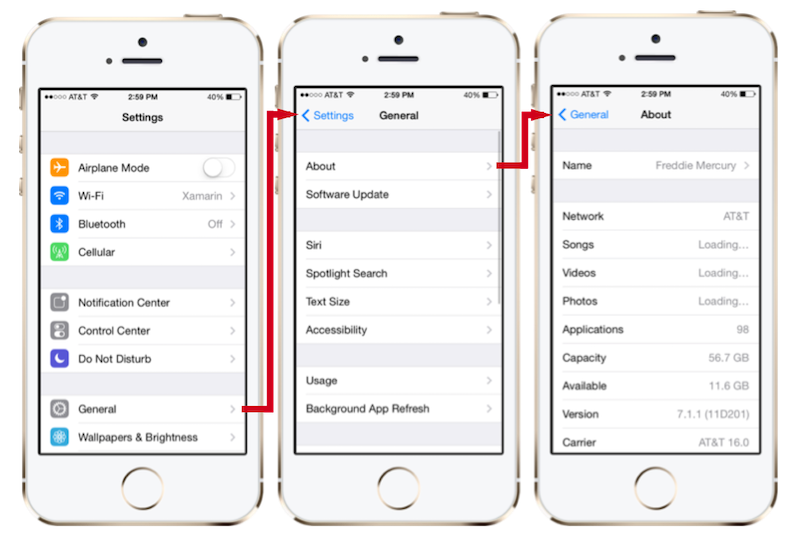
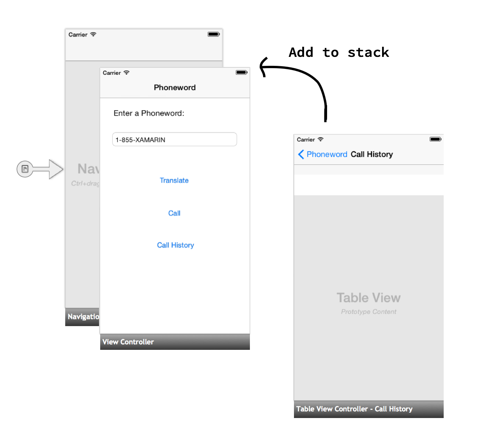
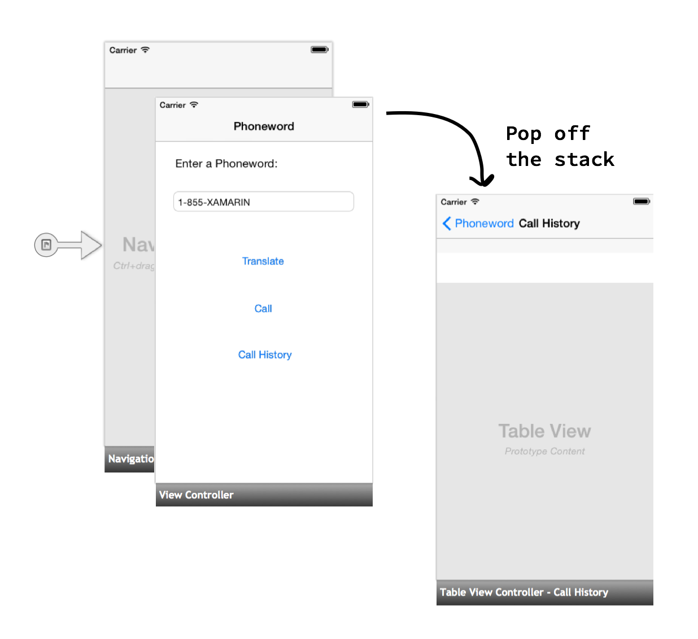

# Hello, iOS Multiscreen – deep dive
> [!WARNING]
> The iOS Designer was deprecated in Visual Studio 2019 version 16.8 and Visual Studio 2019 for Mac version 8.8, and 
> removed in Visual Studio 2019 version 16.9 and Visual Studio for Mac version 8.9.
> The recommended way to build iOS user interfaces is directly on a Mac running Xcode's Interface Builder. For more information, see [Designing user interfaces with Xcode](~/ios/user-interface/storyboards/index.md). 

In the Quickstart walkthrough, we built and ran our first multi-screen Xamarin.iOS application. Now it’s time to develop a
deeper understanding of iOS navigation and architecture.

In this guide we introduce the *Model, View, Controller (MVC)* pattern and its role in iOS architecture and navigation.
Then we dive into the navigation controller and learn to use it to provide a familiar navigation experience in iOS.

## Model-View-Controller (MVC)

In the [Hello, iOS](~/ios/get-started/hello-ios/index.md) tutorial, we learned that iOS applications have only one *Window* that view controllers are in charge of loading their *Content View Hierarchies* into the Window. In the second
Phoneword walkthrough, we added a second screen to our application and passed some data – a list of phone numbers –
between the two screens, as illustrated by the diagram below:

 [](hello-ios-multiscreen-deepdive-images/08.png#lightbox)

In our example, data was collected in the first screen, passed from the first view controller to the second, and displayed by
the second screen. This separation of screens, view controllers, and data follows the *Model, View, Controller (MVC)* pattern. In
the next few sections, we discuss the benefits of the pattern, its components, and how we use it in our Phoneword application.

### Benefits of the MVC pattern

Model-View-Controller is a *design pattern* – a reusable architectural solution to a common problem or use case in code. MVC is an
architecture for applications with a *Graphical User Interface (GUI)*. It assigns objects in the application one of three roles -
the *Model* (data or application logic), the *View* (user interface), and the *Controller* (code behind). The diagram
below illustrates the relationships between the three pieces of the MVC pattern and the user:

 [](hello-ios-multiscreen-deepdive-images/00.png#lightbox)

The MVC pattern is useful because it provides logical separation between different parts of a GUI application and makes it easier for us to
reuse code and views. Let’s jump in and take a look at each of the three roles in more detail.

> [!NOTE]
> The MVC pattern is loosely analogous to the structure of ASP.NET pages or WPF applications. In these examples, the View is the component that is actually responsible for describing the UI and corresponds to the ASPX (HTML) page in ASP.NET or to XAML in a WPF application. The Controller is the component that is responsible for managing the View, which corresponds to the code-behind in ASP.NET or WPF.

### Model

The Model object is typically an application-specific representation of data that is to be displayed or entered into View. The Model is often
loosely defined - for example, in our **Phoneword_iOS** app, the list of phone numbers (represented as a list of strings) is the Model. If we were
building a cross-platform application, we could choose to share the **PhonewordTranslator** code between our iOS and Android applications. We could
think of that shared code as the Model as well.

MVC is completely agnostic of the *data persistence* and *access* of the Model. In other words, MVC doesn’t care what our data looks like or how it’s stored,
only how the data is *represented*. For example, we could choose to store our data in a SQL database, or persist it in some cloud storage mechanism, or simply use a `List<string>`. For MVC purposes, only the data representation itself is included in the pattern.

In some cases, the Model portion of the MVC may be empty. For example, we might choose to add some static pages to our app explaining how the phone translator
works, why we built it, and how to get in touch with us to report bugs. These app screens would still be created using Views and Controllers, but they would
not have any real Model data.

> [!NOTE]
> In some literature, the Model portion of the MVC pattern can refer to the entire application backend, not just the data that is displayed on the UI. In this guide we use a modern interpretation of the Model, but the distinction is not particularly important.

### View

A View is the component that’s responsible for rendering the user interface. In nearly all platforms that use the MVC pattern, the user interface is composed of a hierarchy of views. We can think of a View in MVC as a view hierarchy with a single view – known as the root view - at the top of the hierarchy and any number of child views (known as or subviews) below it. In iOS, a screen’s Content View hierarchy corresponds to the View component in MVC.

### Controller

The Controller object is the component that wires everything together and is represented in iOS by the `UIViewController`. We can think of the Controller as
the backing code for a screen or a set of views. The Controller is responsible for listening for requests from the user and returning the appropriate view
hierarchy. It listens to requests from the View (button clicks, text input, etc.) and performs the appropriate processing, View modification, and reloading
of the View. The Controller is also responsible for creating or retrieving the Model from whatever backing data store exists in the application, and
populating the View with its data.

Controllers can also manage other Controllers. For example, one Controller might load another Controller if it needs to display a different screen, or manage a stack
of Controllers to monitor their order and the transitions between them. In the next section, we’ll see an example of a Controller that manages other Controllers as we
introduce a special type of iOS view controller called a *navigation controller*.

## Navigation controller

In the Phoneword application, we used a navigation controller to help manage navigation between multiple screens. The navigation controller is a
specialized `UIViewController` represented by the `UINavigationController` class. Instead of managing a single Content View hierarchy, the
navigation controller manages other view controllers, as well as its own special Content View hierarchy in the form of a navigation
toolbar that includes a title, back button, and other optional features.

The navigation controller is common in iOS applications and provides navigation for staple iOS applications like the **Settings** app,
as illustrated by the screenshot below:

 [](hello-ios-multiscreen-deepdive-images/01.png#lightbox)

The navigation controller serves three primary functions:

- **Provides Hooks for Forward Navigation** – The navigation controller uses a hierarchal navigation metaphor where Content View Hierarchies are  *pushed* onto a  *navigation stack* . You can think of a navigation stack as a stack of playing cards, in which only the top most card is visible, as illustrated by the diagram below:  

    [](hello-ios-multiscreen-deepdive-images/02.png#lightbox)

- **Optionally Provides a Back Button** - When we push a new item onto the navigation stack, the title bar can automatically display a  *back button* that allows the user to navigate backwards. Pressing the back button  *pops* the current view controller off the navigation stack, and loads the previous Content View hierarchy into the Window:  

    [](hello-ios-multiscreen-deepdive-images/03.png#lightbox)

- **Provides a Title Bar** – The top portion of the  navigation controller is called the  *Title Bar* . It’s responsible for displaying the view controller title, as illustrated by the diagram below:  

    [](hello-ios-multiscreen-deepdive-images/04.png#lightbox)

### Root view controller

A navigation controller doesn’t manage a Content View hierarchy, so it has nothing to display on its own.
Instead, a navigation controller is paired with a *Root view controller*:

 [](hello-ios-multiscreen-deepdive-images/05.png#lightbox)

The Root view controller represents the first view controller in the navigation controller’s stack, and the Root view controller’s
Content View hierarchy is the first Content View hierarchy to be loaded into the Window. If we want to put our entire application on the
navigation controller’s stack, we can move the Sourceless Segue to the navigation controller and set our first screen’s view controller as the
Root view controller, like we did in the Phoneword app:

 [](hello-ios-multiscreen-deepdive-images/06.png#lightbox)

### Additional navigation options

The navigation controller is a common way of handling navigation in
iOS, but it is not the only option. For example, a
[Tab Bar Controller](~/ios/user-interface/controls/creating-tabbed-applications.md)
can split an application into different functional areas and a
[Split view controller](https://github.com/xamarin/recipes/tree/master/Recipes/ios/content_controls/split_view/use_split_view_to_show_two_controllers)
can be used to create master/detail views. Combining navigation controllers
with these other navigation paradigms allows for many flexible ways to
present and navigate content in iOS.

## Handling transitions

In the Phoneword walkthrough, we handled the transition between the two view controllers in two different ways – first with a Storyboard Segue and
then programmatically. Let’s explore both these options in more detail.

### PrepareForSegue

When we add a Segue with a **Show** action to the Storyboard, we instruct iOS to push the second view controller onto the
navigation controller’s stack:

 [](hello-ios-multiscreen-deepdive-images/09.png#lightbox)

Adding a Segue to the Storyboard is enough to create a simple transition between screens. If we want to pass data between view controllers,
we have to override the `PrepareForSegue` method and handle the data ourselves:

```csharp
public override void PrepareForSegue (UIStoryboardSegue segue, NSObject sender)
{
    base.PrepareForSegue (segue, sender);
    ...
}
```

iOS calls `PrepareForSegue` right before the transition occurs and passes the Segue that we created in the Storyboard into the method.
At this point, we have to manually set the Segue’s destination view controller. The following code gets a handle to the Destination view controller and casts it to the proper class - CallHistoryController, in this case:

```csharp
CallHistoryController callHistoryController = segue.DestinationViewController as CallHistoryController;
```

Finally, we pass the list of phone numbers (the Model) from the `ViewController` to the `CallHistoryController` by setting
the `PhoneHistory` property of the `CallHistoryController` to the list of dialed phone numbers:

```csharp
callHistoryController.PhoneNumbers = PhoneNumbers;
```

The complete code for passing data using a Segue is as follows:

```csharp
public override void PrepareForSegue (UIStoryboardSegue segue, NSObject sender)
{
    base.PrepareForSegue (segue, sender);

    var callHistoryController = segue.DestinationViewController as CallHistoryController;

    if (callHistoryController != null) {
         callHistoryController.PhoneNumbers = PhoneNumbers;
    }
 }
```

### Navigation without segues

Transitioning from the first view controller to the second in code is the same process as with a Segue, but several steps have to be done manually.
First, we use `this.NavigationController` to get a reference to the navigation controller whose stack we are currently on. Then, we use the Navigation
Controller’s `PushViewController` method to manually push the next view controller onto the stack, passing in the view controller and an option to animate
the transition (we set this to `true`).

The following code handles the transition from the Phoneword screen to the Call History screen:

```csharp
this.NavigationController.PushViewController (callHistory, true);
```

Before we can transition to the next view controller, we have to instantiate it manually from the Storyboard by calling `this.Storyboard.InstantiateViewController`
and passing in the Storyboard ID of the `CallHistoryController`:

```csharp
CallHistoryController callHistory =
this.Storyboard.InstantiateViewController
("CallHistoryController") as CallHistoryController;
```

Finally, we pass the list of phone numbers (the Model) from the `ViewController` to the `CallHistoryController` by setting the `PhoneHistory`
property of the `CallHistoryController` to the list of dialed phone numbers, just like we did when we handled the transition with a Segue:

```csharp
callHistory.PhoneNumbers = PhoneNumbers;
```

The complete code for the programmatic transition is as follows:

```csharp
CallHistoryButton.TouchUpInside += (object sender, EventArgs e) => {
    // Launches a new instance of CallHistoryController
    CallHistoryController callHistory = this.Storyboard.InstantiateViewController ("CallHistoryController") as CallHistoryController;
    if (callHistory != null) {
     callHistory.PhoneNumbers = PhoneNumbers;
     this.NavigationController.PushViewController (callHistory, true);
    }
};
```

## Additional concepts introduced in Phoneword

The Phoneword application introduced several concepts not covered in this guide. These concepts include:

- **Automatic Creation of view controllers** – When we enter a class name for the view controller in the  **Properties Pad** , the iOS designer checks if that class exists and then generates the view controller backing class for us. For more information on this and other iOS designer features, refer to the  [Introduction to the iOS Designer](~/ios/user-interface/designer/introduction.md) guide.
- **Table view controller** – The  `CallHistoryController` is a Table view controller. A Table view controller contains a Table View, the most common layout and data display tool in iOS. Tables are beyond the scope of this guide. For more information on Table view controllers, please refer to the  [Working with Tables and Cells](~/ios/user-interface/controls/tables/index.md) guide.
- **Storyboard ID** – Setting the Storyboard ID creates a view controller class in Objective-C containing the code-behind for the view controller in the Storyboard. We use the Storyboard ID to find the Objective-C class and instantiate the view controller in the Storyboard. For more information on Storyboard IDs, please refer to the  [Introduction to Storyboards](~/ios/user-interface/storyboards/index.md) guide.

## Summary

Congratulations, you’ve completed your first multi-screen iOS application!

In this guide we introduced the MVC pattern and used it to create a multi-screened application. We also explored navigation controllers and their
role in powering iOS navigation. You now have the solid foundation you need to start developing your own Xamarin.iOS applications.

Next, let’s learn to build cross-platform applications with Xamarin with the [Introduction to Mobile Development](~/cross-platform/get-started/introduction-to-mobile-development.md) and [Building Cross-Platform Applications](~/cross-platform/app-fundamentals/building-cross-platform-applications/index.md) guides.

## Related links

- [Hello, iOS (sample)](/samples/xamarin/ios-samples/hello-ios)
- [iOS Human Interface Guidelines](https://developer.apple.com/library/ios/#documentation/UserExperience/Conceptual/MobileHIG/Introduction/Introduction.html)