# Hello, iOS Multiscreen – Quickstart
> [!WARNING]
> The iOS Designer was deprecated in Visual Studio 2019 version 16.8 and Visual Studio 2019 for Mac version 8.8, and 
> removed in Visual Studio 2019 version 16.9 and Visual Studio for Mac version 8.9.
> The recommended way to build iOS user interfaces is directly on a Mac running Xcode's Interface Builder. For more information, see [Designing user interfaces with Xcode](~/ios/user-interface/storyboards/index.md). 

This part of the walkthrough will add a second screen to the Phoneword application that displays a history of the phone numbers that were called with the app. The final application will have a second screen that displays the call history, as illustrated by the following screenshot:

[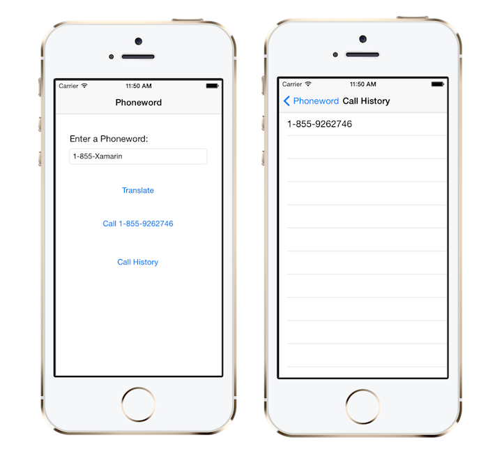](hello-ios-multiscreen-quickstart-images/00.png#lightbox)

The [accompanying Deep Dive](~/ios/get-started/hello-ios-multiscreen/hello-ios-multiscreen-deepdive.md), will review the application that is build built and discuss architecture, navigation, and other new iOS concepts that we encounter along the way.

## Requirements

This guide resumes where the Hello, iOS document left off, and requires completion of the [Hello, iOS Quickstart](~/ios/get-started/hello-ios/index.md). Download the completed version of the Phoneword app from the [Hello, iOS sample](/samples/xamarin/ios-samples/hello-ios).

::: zone pivot="macos"

## Walkthrough on macOS

This walkthrough will add a Call History screen to our **Phoneword** application.

1. Open the **Phoneword** application in Visual Studio for Mac. If necessary, the completed Phoneword application from the [Hello, iOS walkthrough](~/ios/get-started/hello-ios/index.md) guide can be downloaded from [here](/samples/xamarin/ios-samples/hello-ios).

2. Open the **Main.storyboard** file from the **Solution Pad**:

    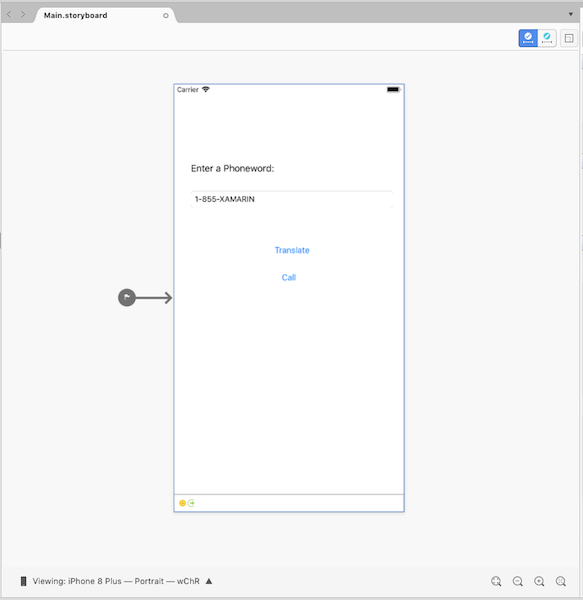

3. Drag a **navigation controller** from the **Toolbox** onto the design surface (You might need to zoom out to fit these all on the design surface!):

    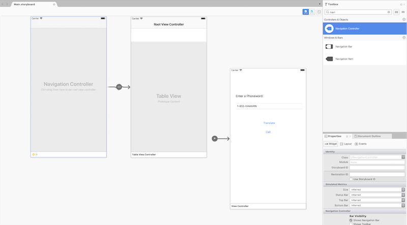

4. Drag the **sourceless segue** (that’s the gray arrow to the left of single view controller) to the **navigation controller** to change the starting point of the application:

    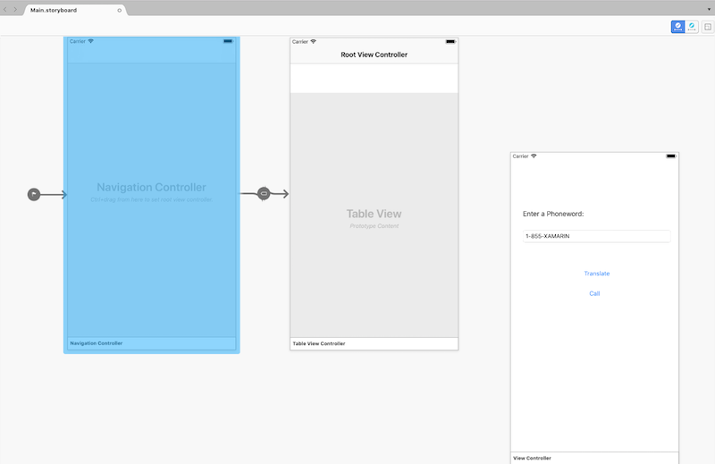

5. Select the existing **root view controller** by clicking on the bottom bar, and press **Delete** to remove it from the design surface.
Then, move the **Phoneword** scene next to the **navigation controller**:

    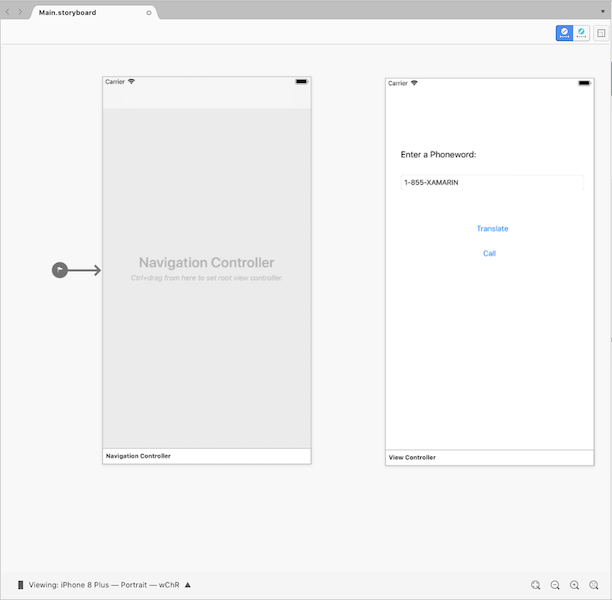

6. Set the **ViewController** as the navigation controller’s **Root view controller**. Press down the
**Ctrl** key and click inside the **navigation controller**. A blue line should appear. Then, still holding down the **Ctrl**
 key, drag from the **navigation controller** to the **Phoneword** scene and release. This is called _Ctrl-dragging_:

    

7. From the popover, set the relationship to **Root**:

    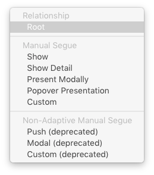

    The **ViewController** is now the **navigation controller’s Root view controller:**

    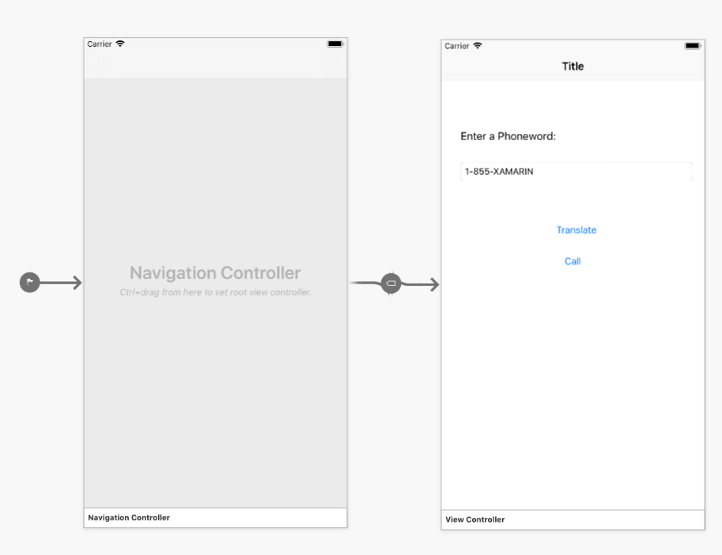

8. Double-click on the **Phoneword** screen’s **Title** bar and change the **Title** to **Phoneword**:

    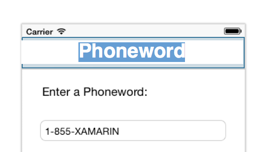

9. Drag a **Button** from the **Toolbox** and place it under the **Call Button**. Drag the
handles to make the new **Button** the same width as the **Call Button**:

    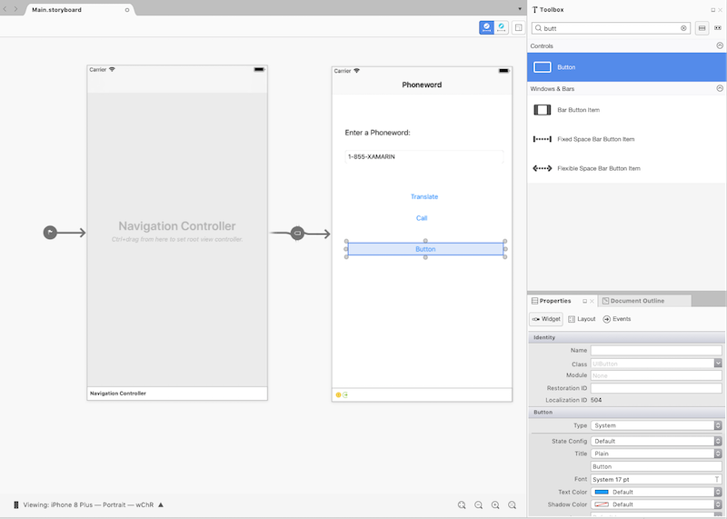

10. In the **Properties Pad**, change the **Name** of the button to **CallHistoryButton**
 and change the **Title** to **Call History**:

    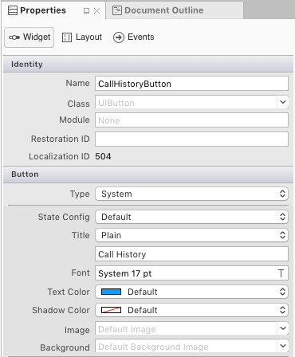

11. Create the **Call History** screen. From the **Toolbox**, drag a **table view controller**
    onto the design surface:

    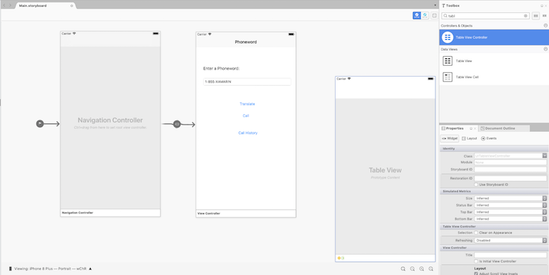

12. Next, select the **table view controller** by clicking on the black bar at the bottom of the scene. In the **Properties Pad**,
    change the **table view controller’s** class to `CallHistoryController` and press **Enter**:

    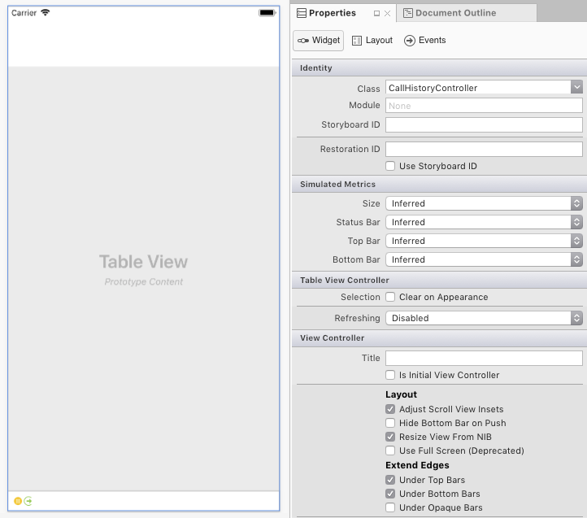

    The iOS Designer will generate a custom backing class called `CallHistoryController` to manage this screen’s content view hierarchy. The **CallHistoryController.cs** file will appear in the **Solution Pad**:

    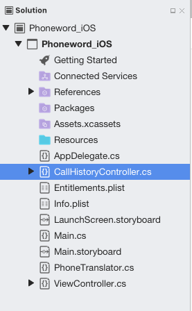

13. Double-click on the **CallHistoryController.cs** file to open it and replace the contents with the following code:

    ```csharp
    using System;
    using Foundation;
    using UIKit;
    using System.Collections.Generic;

    namespace Phoneword_iOS
    {
        public partial class CallHistoryController : UITableViewController
        {
            public List<string> PhoneNumbers { get; set; }

            static NSString callHistoryCellId = new NSString ("CallHistoryCell");

            public CallHistoryController (IntPtr handle) : base (handle)
            {
                TableView.RegisterClassForCellReuse (typeof(UITableViewCell), callHistoryCellId);
                TableView.Source = new CallHistoryDataSource (this);
                PhoneNumbers = new List<string> ();
            }

            class CallHistoryDataSource : UITableViewSource
            {
                CallHistoryController controller;

                public CallHistoryDataSource (CallHistoryController controller)
                {
                    this.controller = controller;
                }

                public override nint RowsInSection (UITableView tableView, nint section)
                {
                    return controller.PhoneNumbers.Count;
                }

                public override UITableViewCell GetCell (UITableView tableView, NSIndexPath indexPath)
                {
                    var cell = tableView.DequeueReusableCell (CallHistoryController.callHistoryCellId);

                    int row = indexPath.Row;
                    cell.TextLabel.Text = controller.PhoneNumbers [row];
                    return cell;
                }
            }
        }
    }
    ```

    Save the application (**⌘ + s**) and build it (**⌘ + b**) to ensure there are no errors.

14. Create a _segue_ (transition) between the **Phoneword** scene and the **Call History** scene.
  In the **Phoneword scene**, select the **Call History Button** and Ctrl-drag from the
  **Button** to the **Call History** scene:

    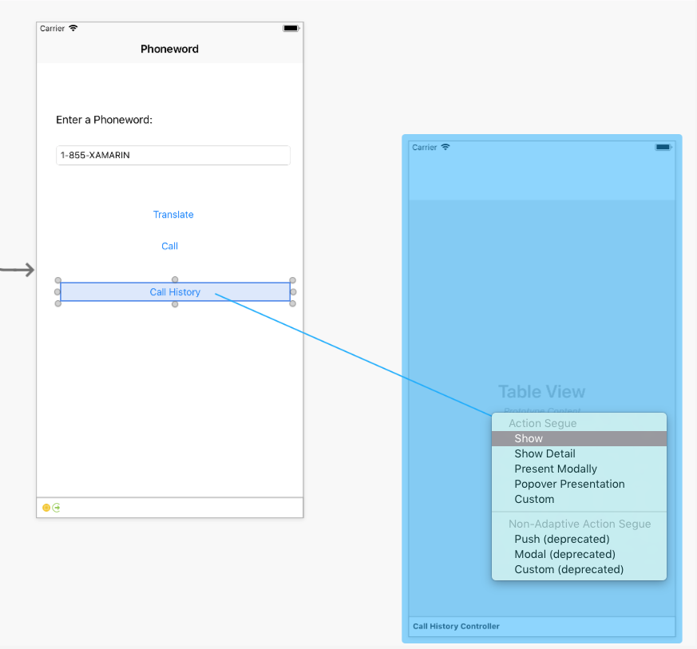

    From the **Action Segue** popover, select **Show**

    The iOS Designer will add a Segue between the two scenes:

    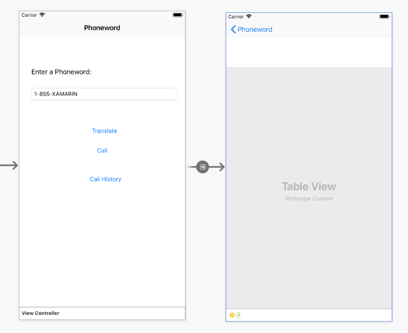

15. Add a **Title** to the **table view controller** by selecting the black bar at the bottom of the scene
    and changing the **view controller Title** to **Call History** in the **Properties Pad**:

    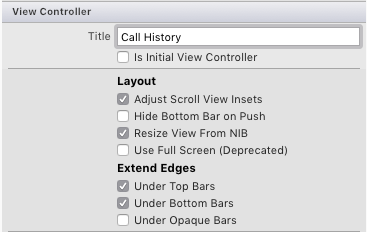

16. When the application is run, the **Call History Button** will open the **Call History** screen,
    but the table view will be empty because there is no code to keep track of and display the phone numbers.

    This app will store the phone numbers as a list of strings.

    Add  a `using` directive for `System.Collections.Generic`  at the top of **ViewController**:

    ```csharp
    using System.Collections.Generic;
    ```

17. Modify the `ViewController` class with the following code:

    ```csharp
    using System;
    using System.Collections.Generic;
    using Foundation;
    using UIKit;

    namespace Phoneword_iOS
    {
      public partial class ViewController : UIViewController
      {
        string translatedNumber = "";

        public List<string> PhoneNumbers { get; set; }

        protected ViewController(IntPtr handle) : base(handle)
        {
          //initialize list of phone numbers called for Call History screen
          PhoneNumbers = new List<string>();
        }

        public override void ViewDidLoad()
        {
          base.ViewDidLoad();
          // Perform any additional setup after loading the view, typically from a nib.

          TranslateButton.TouchUpInside += (object sender, EventArgs e) => {
            // Convert the phone number with text to a number
            // using PhoneTranslator.cs
            translatedNumber = PhoneTranslator.ToNumber(
              PhoneNumberText.Text);

            // Dismiss the keyboard if text field was tapped
            PhoneNumberText.ResignFirstResponder();

            if (translatedNumber == "")
            {
              CallButton.SetTitle("Call ", UIControlState.Normal);
              CallButton.Enabled = false;
            }
            else
            {
              CallButton.SetTitle("Call " + translatedNumber,
                UIControlState.Normal);
              CallButton.Enabled = true;
            }
          };

          CallButton.TouchUpInside += (object sender, EventArgs e) => {

            //Store the phone number that we're dialing in PhoneNumbers
            PhoneNumbers.Add(translatedNumber);

            // Use URL handler with tel: prefix to invoke Apple's Phone app...
            var url = new NSUrl("tel:" + translatedNumber);

            // otherwise show an alert dialog
            if (!UIApplication.SharedApplication.OpenUrl(url))
            {
              var alert = UIAlertController.Create("Not supported", "Scheme 'tel:' is not supported on this device", UIAlertControllerStyle.Alert);
              alert.AddAction(UIAlertAction.Create("Ok", UIAlertActionStyle.Default, null));
              PresentViewController(alert, true, null);
            }
          };
        }

        public override void PrepareForSegue(UIStoryboardSegue segue, NSObject sender)
        {
          base.PrepareForSegue(segue, sender);

          // set the view controller that’s powering the screen we’re
          // transitioning to

          var callHistoryController = segue.DestinationViewController as CallHistoryController;

          //set the table view controller’s list of phone numbers to the
          // list of dialed phone numbers

          if (callHistoryController != null)
          {
            callHistoryController.PhoneNumbers = PhoneNumbers;
          }
        }
      }
    }
    ```

    There are a few things happening here:

    - The variable `translatedNumber` moved from the `ViewDidLoad` method to a _class-level variable_.
    - The  **CallButton** code was modified to add dialed numbers to the list of phone numbers by calling `PhoneNumbers.Add(translatedNumber)`.
    - The `PrepareForSegue` method was added.

    Save and build the application to make sure there are no errors.

18. Press the **Start** button to launch the application inside the **iOS Simulator**:

    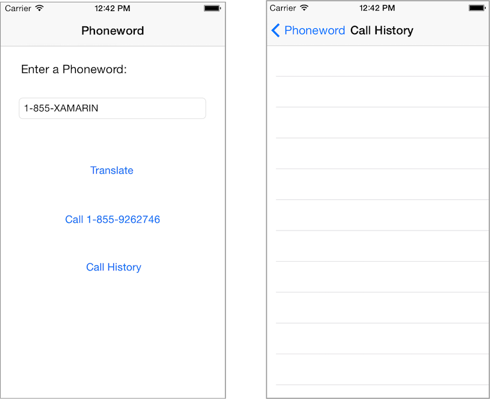

Congratulations on completing your first multi-screen Xamarin.iOS application!

::: zone-end
::: zone pivot="windows"

## Walkthrough on Windows

This walkthrough will add a Call History screen to our **Phoneword** application.

1. Open the **Phoneword** application in Visual Studio. If necessary, download the [completed Phoneword application](/samples/xamarin/ios-samples/hello-ios) from the [Hello, iOS walkthrough](~/ios/get-started/hello-ios/index.md) guide. Recall that it is necessary to connect to a [Mac](~/ios/get-started/installation/windows/connecting-to-mac/index.md) to use the iOS Designer, and iOS simulator.

2. Start by editing the user interface. Open the **Main.storyboard** file from the **Solution Explorer**, making sure that **View As** is set to _iPhone 6_:

    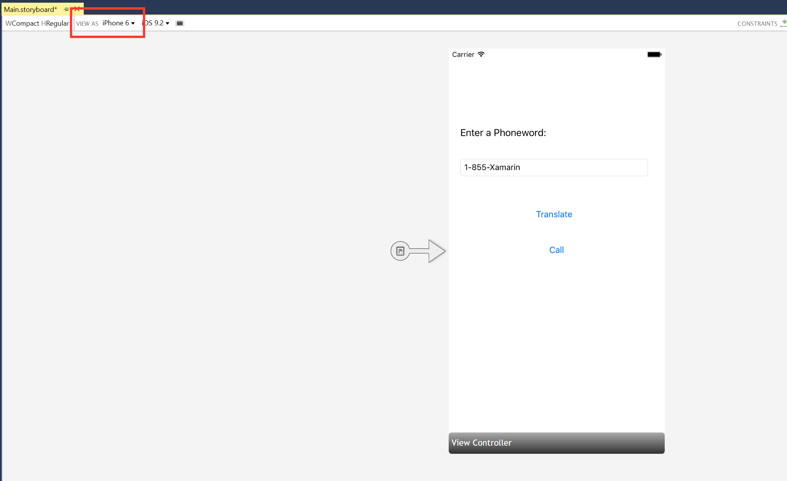

3. Drag a **navigation controller** from the **Toolbox** onto the design surface:

    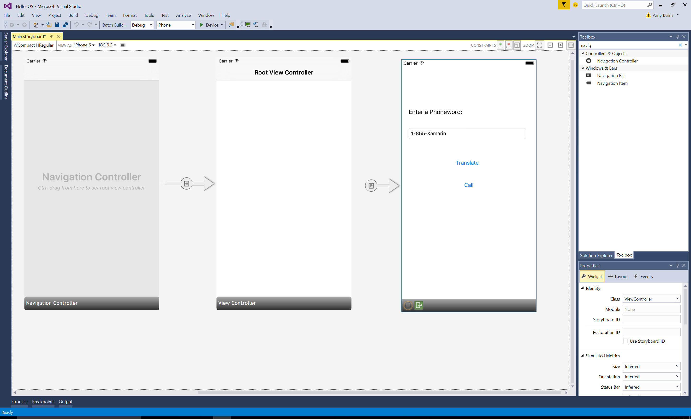

4. Drag the **Sourceless Segue** (that’s the gray arrow to the left of the **Phoneword** scene) from the **Phoneword** scene
  to the **navigation controller** to change the starting point of the application:

    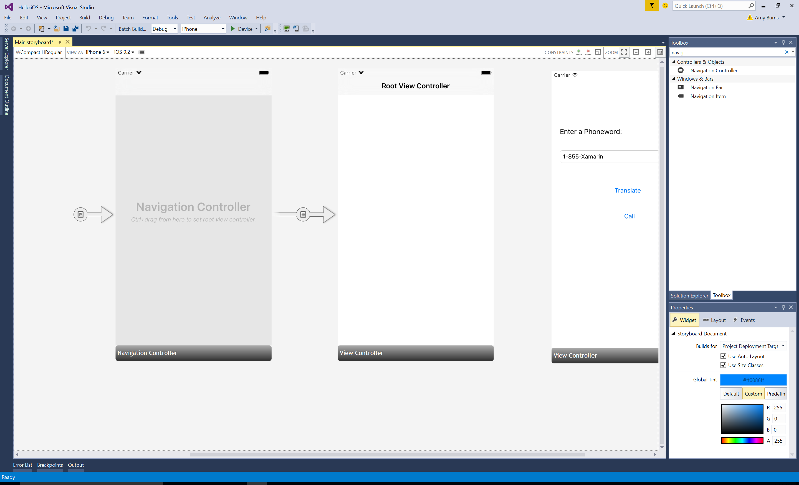

5. Select the **Root view controller** by clicking on the black bar, and press **Delete** to remove it from the design surface.
  Then, move the **Phoneword** scene next to the **navigation controller**:

    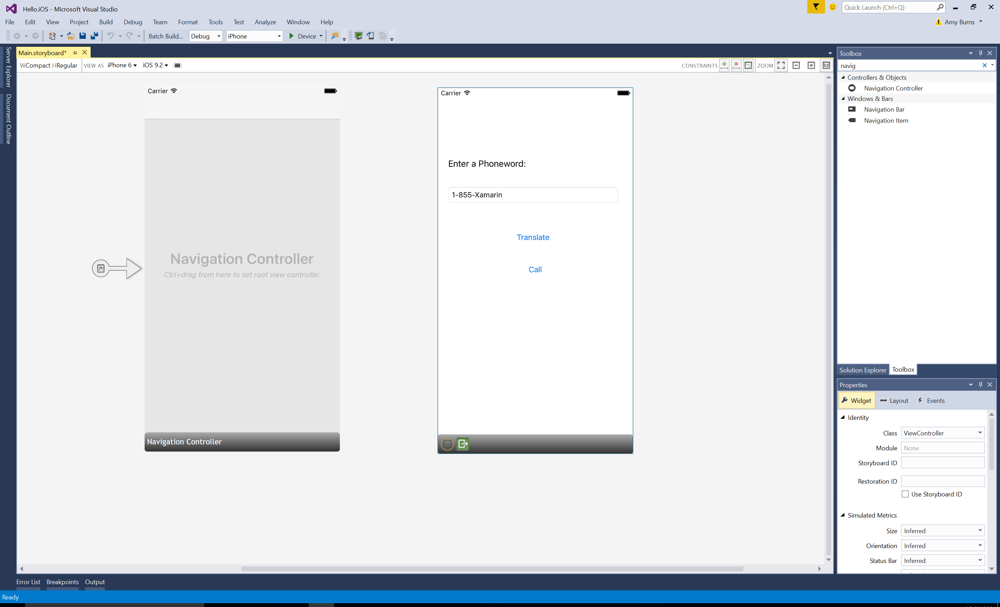

6. Set the **ViewController** as the navigation controller’s root view controller. Press the
  **Ctrl** key and click inside the **Navigation Controller**. A blue line should appear. Then, still holding down the **Ctrl**
  key, drag from the **Navigation Controller** to the **Phoneword** scene and release. This is called _Ctrl-dragging_:

    

7. From the popover, set the relationship to **Root**:

    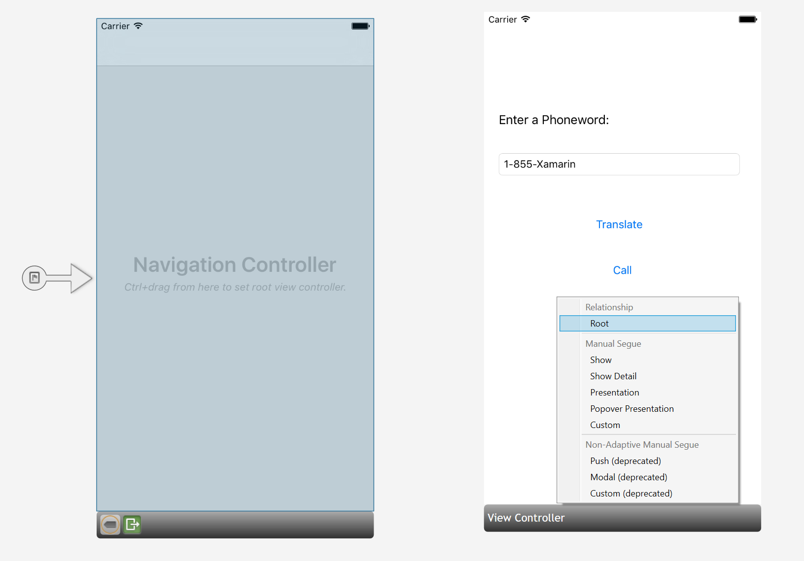

    The **ViewController** is now our **navigation controller’s Root view controller.**

8. Double-click on the **Phoneword** screen’s **Title** bar and change the **Title** to **Phoneword**:

    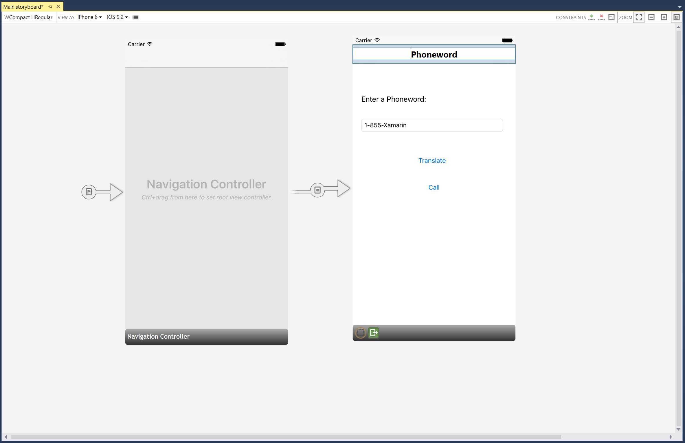

9. Drag a **Button** from the **Toolbox** and place it under the **Call Button**. Drag the
  handles to make the new **Button** the same width as the **Call Button**:

    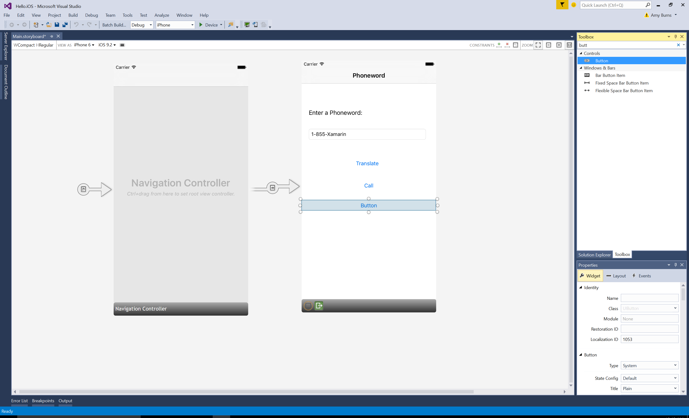

10. In the **Properties Explorer**, change the **Name** of the **Button** to `CallHistoryButton`
  and change the **Title** to **Call History**:

    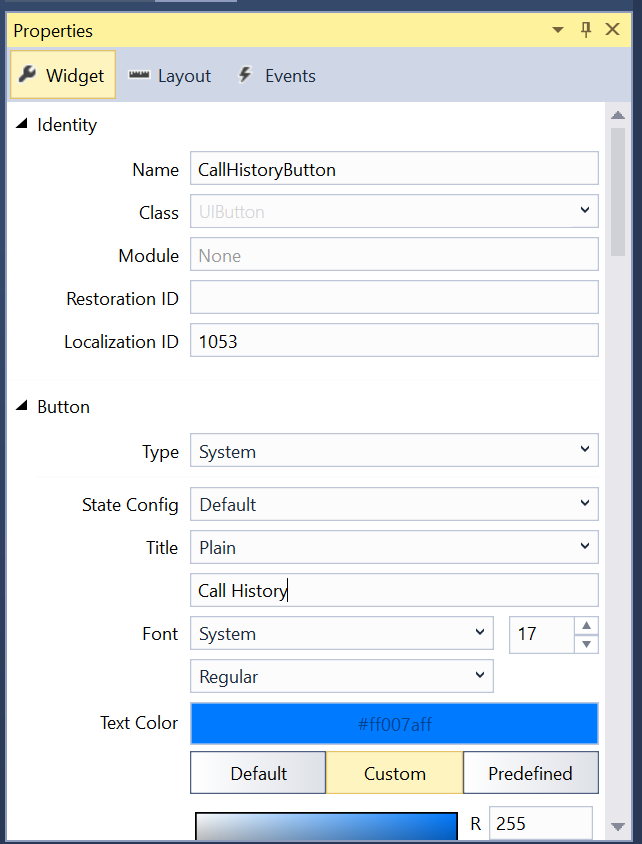

11. Create the **Call History** screen. From the **Toolbox**, drag a **table view controller**
  onto the design surface:

    

12. Select the **table view controller** by clicking on the black bar at the bottom of the scene. In the **Properties Explorer**,
  change the **table view controller’s** class to `CallHistoryController` and press **Enter**:

    

    The iOS Designer will generate a custom backing class called `CallHistoryController` to manage this screen’s content view hierarchy. The **CallHistoryController.cs** file will appear in the **Solution Explorer**:

    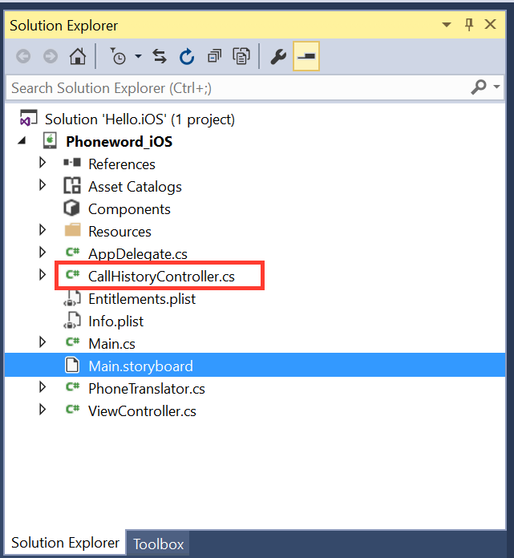

13. Double-click on the **CallHistoryController.cs** file to open it and replace the contents with the following code:

    ```csharp
    using System;
    using Foundation;
    using UIKit;
    using System.Collections.Generic;

    namespace Phoneword
    {
        public partial class CallHistoryController : UITableViewController
        {
            public List<String> PhoneNumbers { get; set; }

            static NSString callHistoryCellId = new NSString ("CallHistoryCell");

            public CallHistoryController (IntPtr handle) : base (handle)
            {
                TableView.RegisterClassForCellReuse (typeof(UITableViewCell), callHistoryCellId);
                TableView.Source = new CallHistoryDataSource (this);
                PhoneNumbers = new List<string> ();
            }

            class CallHistoryDataSource : UITableViewSource
            {
                CallHistoryController controller;

                public CallHistoryDataSource (CallHistoryController controller)
                {
                    this.controller = controller;
                }

                // Returns the number of rows in each section of the table
                public override nint RowsInSection (UITableView tableView, nint section)
                {
                    return controller.PhoneNumbers.Count;
                }

                public override UITableViewCell GetCell (UITableView tableView, NSIndexPath indexPath)
                {
                    var cell = tableView.DequeueReusableCell (CallHistoryController.callHistoryCellId);

                    int row = indexPath.Row;
                    cell.TextLabel.Text = controller.PhoneNumbers [row];
                    return cell;
                }
            }
        }
    }
    ```

    Save the application and build it to ensure there are no errors. It is okay to ignore any build warnings for now.

14. Create a _segue_ (transition) between the **Phoneword** scene and the **Call History** scene.
  In the **Phoneword scene**, select the **Call History Button** and **Ctrl-drag** from the
  **Button** to the **Call History** scene:

    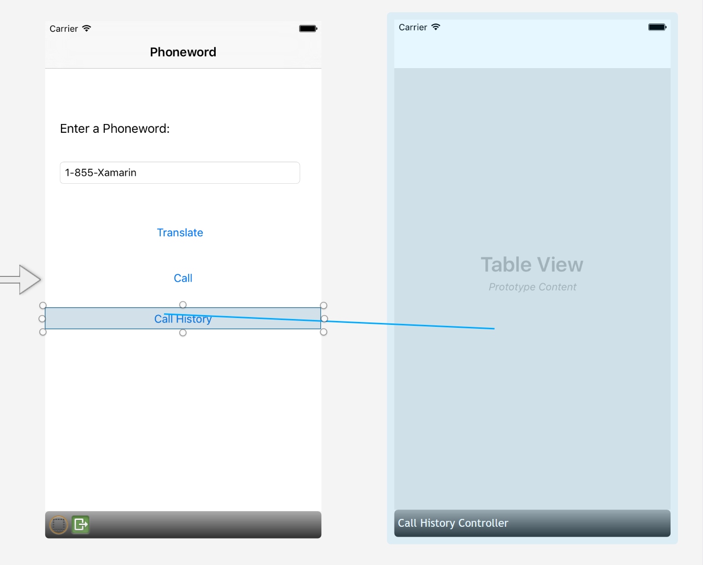

    From the **Action Segue** popover, select **Show**:

    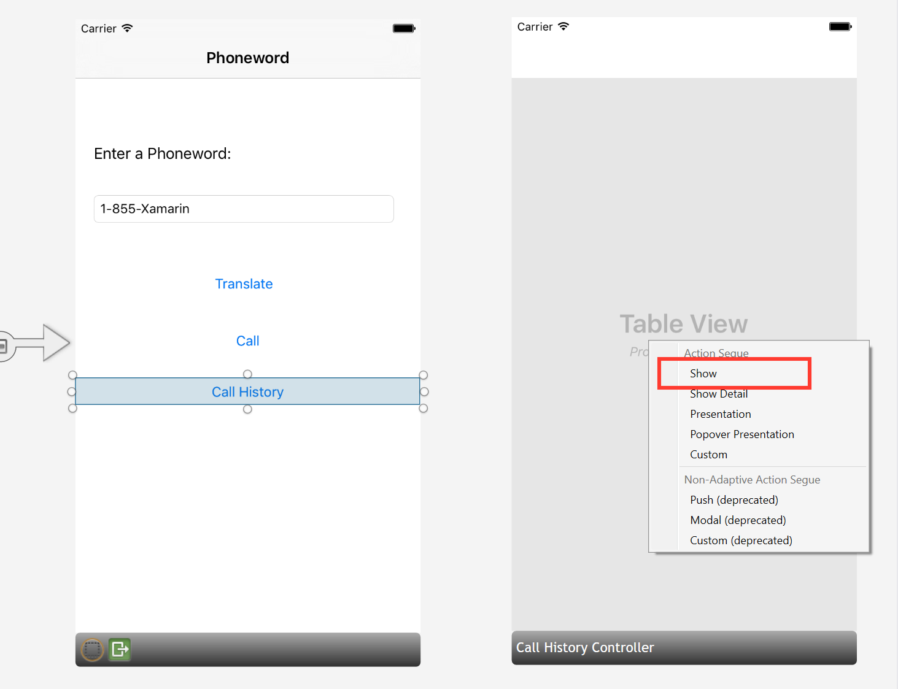

    The iOS Designer will add a segue between the two scenes:

    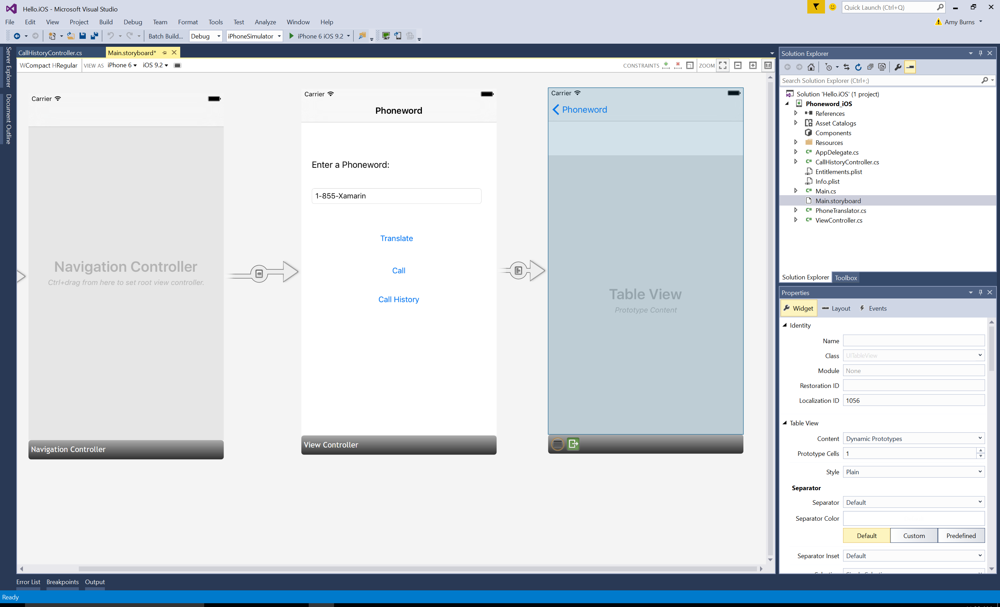

15. Add a **Title** to the **table view controller** by selecting the black bar at the bottom of the scene
  and changing **view controller > Title** to **Call History** in the **Properties Explorer**:

    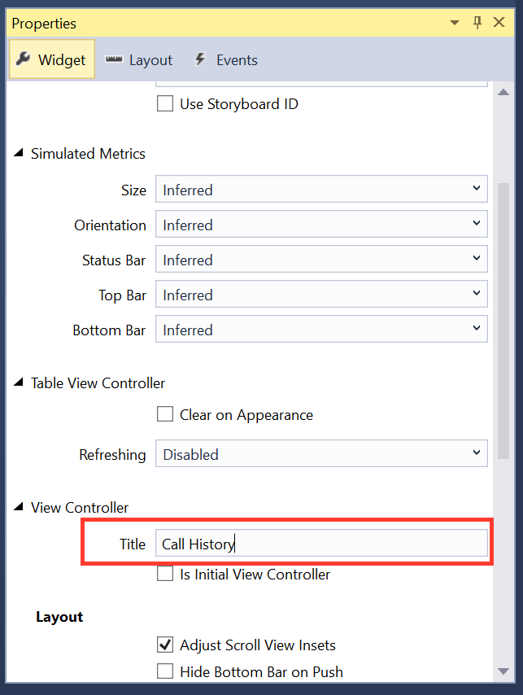

16. When the application is run, the **Call History Button** will open the **Call History** screen,
  but the table view will be empty because there is no code to keep track of and display the phone numbers.

    This app will store the phone numbers as a list of strings.

    Add a `using` directive for `System.Collections.Generic`  at the top of **ViewController**:

    ```csharp
    using System.Collections.Generic;
    ```

17. Modify the `ViewController` class with the following code:

    ```csharp
    using System;
    using System.Collections.Generic;
    using Foundation;
    using UIKit;

    namespace Phoneword_iOS
    {
      public partial class ViewController : UIViewController
      {
        string translatedNumber = "";

        public List<string> PhoneNumbers { get; set; }

        protected ViewController(IntPtr handle) : base(handle)
        {
          //initialize list of phone numbers called for Call History screen
          PhoneNumbers = new List<string>();
        }

        public override void ViewDidLoad()
        {
          base.ViewDidLoad();
          // Perform any additional setup after loading the view, typically from a nib.

          TranslateButton.TouchUpInside += (object sender, EventArgs e) => {
            // Convert the phone number with text to a number
            // using PhoneTranslator.cs
            translatedNumber = PhoneTranslator.ToNumber(
              PhoneNumberText.Text);

            // Dismiss the keyboard if text field was tapped
            PhoneNumberText.ResignFirstResponder();

            if (translatedNumber == "")
            {
              CallButton.SetTitle("Call ", UIControlState.Normal);
              CallButton.Enabled = false;
            }
            else
            {
              CallButton.SetTitle("Call " + translatedNumber,
                UIControlState.Normal);
              CallButton.Enabled = true;
            }
          };

          CallButton.TouchUpInside += (object sender, EventArgs e) => {

            //Store the phone number that we're dialing in PhoneNumbers
            PhoneNumbers.Add(translatedNumber);

            // Use URL handler with tel: prefix to invoke Apple's Phone app...
            var url = new NSUrl("tel:" + translatedNumber);

            // otherwise show an alert dialog
            if (!UIApplication.SharedApplication.OpenUrl(url))
            {
              var alert = UIAlertController.Create("Not supported", "Scheme 'tel:' is not supported on this device", UIAlertControllerStyle.Alert);
              alert.AddAction(UIAlertAction.Create("Ok", UIAlertActionStyle.Default, null));
              PresentViewController(alert, true, null);
            }
          };
        }

        public override void PrepareForSegue(UIStoryboardSegue segue, NSObject sender)
        {
          base.PrepareForSegue(segue, sender);

          // set the view controller that’s powering the screen we’re
          // transitioning to

          var callHistoryController = segue.DestinationViewController as CallHistoryController;

          //set the table view controller’s list of phone numbers to the
          // list of dialed phone numbers

          if (callHistoryController != null)
          {
            callHistoryController.PhoneNumbers = PhoneNumbers;
          }
        }
      }
    }
    ```

    There are a few things happening here
    - The variable `translatedNumber` was moved from the `ViewDidLoad` method to a _class-level variable_.
    - The  **CallButton** code was modified to add dialed numbers to the list of phone numbers by calling `PhoneNumbers.Add(translatedNumber)`
    - The `PrepareForSegue` method was added

    Save and build the application to make sure there are no errors.

    Save and build the application to make sure there are no errors.

18. Press the **Start** button to launch our application inside the **iOS Simulator**:

    

Congratulations on completing your first multi-screen Xamarin.iOS application!

::: zone-end

The app can now handle navigation using both storyboard segues and in code. Now it’s time to dissect the tools and skills we just
learned in the [Hello, iOS Multiscreen Deep Dive](~/ios/get-started/hello-ios-multiscreen/hello-ios-multiscreen-deepdive.md).

## Related Links

- [Hello, iOS (sample)](/samples/xamarin/ios-samples/hello-ios)
- [iOS Human Interface Guidelines](https://developer.apple.com/library/ios/#documentation/UserExperience/Conceptual/MobileHIG/Introduction/Introduction.html)