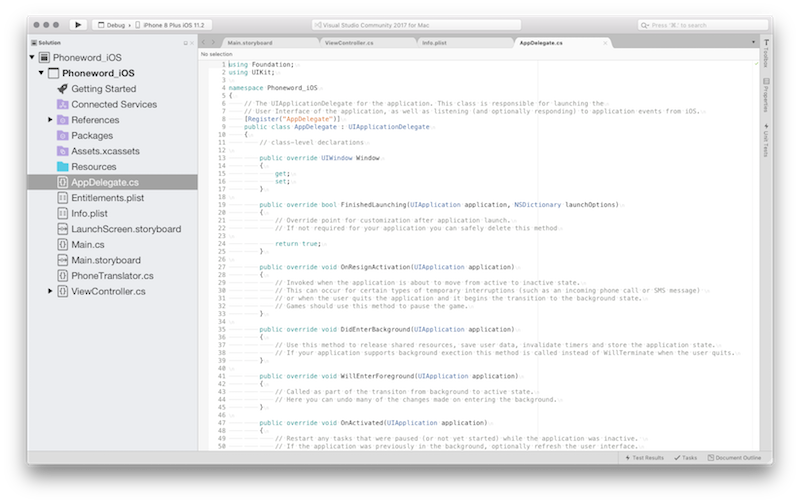
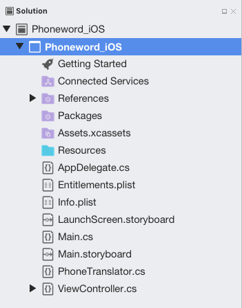
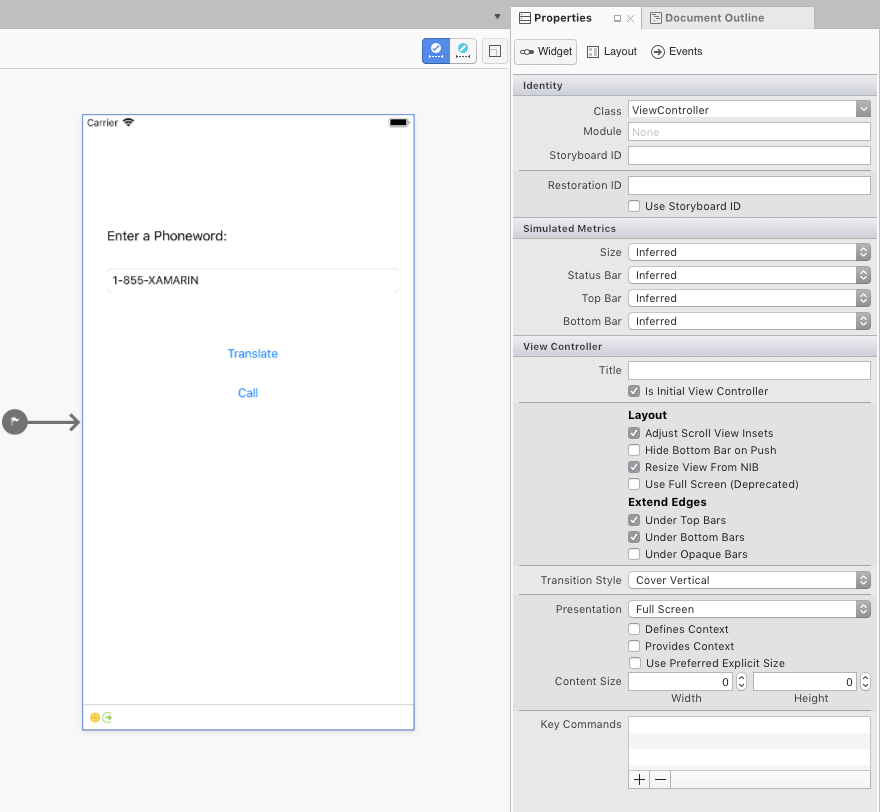
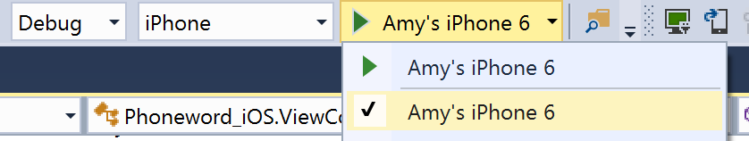

# Hello, iOS – Deep dive

The Quickstart walkthrough, introduced building and running a basic Xamarin.iOS application. Now it’s time to develop a deeper understanding of how iOS applications work so you can build more sophisticated programs. This guide reviews the steps that in the Hello, iOS walkthrough to enable understanding of the fundamental concepts of iOS application development.

This guide helps you develop the skills and knowledge required to build a single-screen iOS application. After working through it, you should have an understanding of the different parts of a Xamarin.iOS application and how they fit together.

::: zone pivot="macos"

## Introduction to Visual Studio for Mac

Visual Studio for Mac is a free, open-source IDE that combines features from Visual Studio and Xcode. It features a fully integrated visual designer, a text editor complete with refactoring tools, an assembly browser, source code integration, and more. This guide introduces some basic Visual Studio for Mac features, but if you're new to Visual Studio for Mac, check out the [Visual Studio for Mac](/visualstudio/mac/) documentation.

Visual Studio for Mac follows the Visual Studio practice of organizing code into *solutions* and *projects*. A solution is a container that can hold one or more projects. A project can be an application (such as iOS or Android), a supporting library, a test application, and more. In the Phoneword app, a new iPhone project was added using the **Single View Application** template. The initial solution looked like this:



::: zone-end
::: zone pivot="windows"

## Introduction to Visual Studio

Visual Studio is a powerful IDE from Microsoft. It features a fully integrated visual designer, a text editor complete with refactoring tools, an assembly browser, source code integration, and more. This guide introduces some basic Visual Studio features with Xamarin Tools for Visual Studio.

Visual Studio organizes code into solutions and projects. A solution is a container that can hold one or more projects. A project can be an application (such as iOS or Android), a supporting library, a test application, and more. In the Phoneword app, a new iPhone project was added using the **Single View Application** template. The initial solution looked like this:


::: zone-end

## Anatomy of a Xamarin.iOS application

::: zone pivot="macos"

On the left is the **solution Pad**, which contains the directory structure and all the files associated with the solution:



::: zone-end
::: zone pivot="windows"

On the right is the **solution Pane**, which contains the directory structure and all the files associated with the solution:


::: zone-end

In the [Hello, iOS](~/ios/get-started/hello-ios/hello-ios-quickstart.md) walkthrough, you created a solution called **Phoneword** and placed an iOS project - **Phoneword_iOS** - inside it. The items inside the project include:

- **References** - Contains the assemblies required to build and run the application. Expand the directory to see references to .NET assemblies such as  [System](/dotnet/api/system), System.Core, and [System.Xml](/dotnet/api/system.xml), as well as a reference to the Xamarin.iOS assembly.
- **Packages** - The packages directory contains ready-made NuGet packages.
- **Resources** - The resources folder stores other media.
- **Main.cs** – This contains the main entry point of the application. To start the application, the name of the main application class, the  `AppDelegate`, is passed in .
- **AppDelegate.cs** – This file contains the main application class and is responsible for creating the Window, building the user interface, and listening to events from the operating system.
- **Main.storyboard** - The Storyboard contains the visual design of the application’s user interface. Storyboard files open in a graphical editor called the iOS Designer.
- **ViewController.cs** – The view controller powers the screen (View) that a user sees and touches. The view controller is responsible for handling interactions between the user and the View.
- **ViewController.designer.cs** – The `designer.cs` is an auto-generated file that serves as the glue between controls in the View and their code representations in the view controller. Because this is an internal plumbing file, the IDE will overwrite any manual changes and most of the time this file can be ignored. 
- **Info.plist** – The **Info.plist** is where application properties such as the application name, icons, launch images, and more are set. This is a powerful file and a thorough introduction to it is available in the [Working with Property Lists](~/ios/app-fundamentals/property-lists.md) guide.
- **Entitlements.plist** - The entitlements property list lets us specify application *capabilities* (also called App Store Technologies) such as iCloud, PassKit, and more. More information on the  **Entitlements.plist** can be found in the  [Working with Property Lists](~/ios/app-fundamentals/property-lists.md) guide. For a general introduction to entitlements, refer to the  [Device Provisioning](~/ios/get-started/installation/device-provisioning/index.md) guide.

## Architecture and app fundamentals

Before an iOS application can load a user interface, two things need to be in place. First, the application needs to define an *entry point* – the first code that runs when the application’s process is loaded into memory. Second, it needs to define a class to handle application-wide events and interact with the operating system.

This section studies the relationships illustrated in the following diagram:

[](hello-ios-deepdive-images/image32.png#lightbox)

### Main method

The main entry point of an iOS application is the `Application` class. The `Application` class is defined in the **Main.cs** file and contains a static `Main` method. It creates a new Xamarin.iOS application instance and passes the name of the *Application Delegate* class that will handle OS events. The template code for the static `Main` method appears below:

```csharp
using System;
using UIKit;

namespace Phoneword_iOS
{
    public class Application
    {
        static void Main (string[] args)
        {
            UIApplication.Main (args, null, "AppDelegate");
        }
    }
}
```

### Application delegate

In iOS, the *Application Delegate* class handles system events; this class lives inside **AppDelegate.cs**. The `AppDelegate` class manages the application *Window*. The Window is a single instance of the `UIWindow` class that serves as a container for the user interface. By default, an application gets only one Window onto which to load its content, and the Window is attached to a *Screen* (single `UIScreen` instance) that provides the bounding rectangle matching the dimensions of the physical device screen.

The *AppDelegate* is also responsible for subscribing to system updates about important application events such as when the app finishes launching or when memory is low.

The template code for the AppDelegate is presented below:

```csharp
using System;
using Foundation;
using UIKit;

namespace Phoneword_iOS
{

    [Register ("AppDelegate")]
    public partial class AppDelegate : UIApplicationDelegate
    {
        public override UIWindow Window {
            get;
            set;
        }

        ...
    }
}
```

Once the application has defined its Window, it can begin loading the user interface. The next section explores UI creation.

## User interface

The user interface of an iOS app is like a storefront - the application typically gets one Window, but it can fill the Window up with as many objects at it needs, and the objects and arrangements can be changed depending on what the app wants to display. The objects in this scenario - the things that the user sees - are called Views. To build a single screen in an application, Views are stacked on top of each other in a *Content View Hierarchy*, and the hierarchy is managed by a single view controller. Applications with multiple screens have multiple Content View Hierarchies, each with its own view controller, and the application places Views in the Window to create a different Content View Hierarchy based on the screen that the user is on.

For more details about building a user interface using Storyboards, see the Designing with Storyboards 
section of [Xcode Overview](https://developer.apple.com/library/archive/documentation/ToolsLanguages/Conceptual/Xcode_Overview/DesigningwithStoryboards.html) in Apple’s iOS
Developer Library.

The diagram below illustrates the relationships between the Window, Views, Subviews, and view controller that bring the user interface to the device screen:

[](hello-ios-deepdive-images/image43.png#lightbox)

In the next section discusses how to work with Views in code and learn to program for user interaction using view controllers and the View lifecycle.

## View controllers and the view lifecycle

Every Content View Hierarchy has a corresponding view controller to power user interaction. The role of the view controller is to manage the Views in the Content View Hierarchy. The view controller is not part of the Content View Hierarchy, and it's not an element in the interface. Rather, it provides the code that powers the user's interactions with the objects on the screen.

### View controllers and storyboards

::: zone pivot="macos"

The view controller is represented in a Storyboard as a bar at the bottom of the Scene. Selecting the view controller brings up its properties in the **Properties Pad**:



A custom view controller class for the Content View Hierarchy represented by this Scene can be set by editing the **Class** property in the **Identity** section of the **Properties Pad**. For example, our **Phoneword** application sets the `ViewController` as the view controller for our first screen, as illustrated by the screenshot below:


::: zone-end
::: zone pivot="windows"

The view controller is represented in a Storyboard as a bar at the bottom of the Scene. Selecting the view controller brings up its properties in the **Properties Pane**:


A custom view controller class for the Content View Hierarchy represented by this Scene can be set by editing the **Class** property in the **Identity** section of the **Properties Pane**. For example, our **Phoneword** application sets the `ViewController` as the view controller for our first screen, as illustrated by the screenshot below:


::: zone-end

This links the Storyboard representation of the view controller to the `ViewController` C# class. Open the `ViewController.cs` file and notice view controller is a *subclass* of `UIViewController`, as illustrated by the code below:

```csharp
public partial class ViewController : UIViewController
{
    public ViewController (IntPtr handle) : base (handle)
    {

    }
}
```

The `ViewController` now drives the interactions of the content view hierarchy associated with this view controller in the storyboard. Next you’ll learn about the view controller's role in managing the Views by introducing a process called the view lifecycle.

> [!NOTE]
> For visual-only screens that don’t require user interaction, the **Class** property can be left blank in the **Properties Pad**. This sets the view controller's backing class as the default implementation of a `UIViewController`, which is appropriate if you don’t plan on adding custom code.

### View lifecycle

The view controller is in charge of loading and unloading content view hierarchies from the window. When something of importance happens to a view in the content view hierarchy, the operating system notifies the view controller through events in the view lifecycle. By overriding methods in the view lifecycle, you can interact with the objects on the screen and create a dynamic, responsive user interface.

These are the basic lifecycle methods and their function:

- **ViewDidLoad** - Called  *once* the first time the view controller loads its Content View Hierarchy into memory. This is a good place to do initial setup because it is when Subviews first become available in code.
- **ViewWillAppear** - Called every time a view controller's View is about to be added to a Content View Hierarchy and appear on the screen.
- **ViewWillDisappear** - Called every time a view controller's View is about to be removed from a Content View Hierarchy and disappear from the screen. This lifecycle event is used for cleanup and saving state.
- **ViewDidAppear** and  **ViewDidDisappear** - Called when a View gets added or removed from the Content View Hierarchy, respectively.

When custom code is added to any stage of the lifecycle, that lifecycle method’s *base implementation* must be *overridden*. This is achieved by tapping into the existing lifecycle method, which has some code already attached to it, and  extending it with additional code. The base implementation is called from inside the method to make sure the original code runs before the new code. An example of this is demonstrated in the next section.

For more information on working with view controllers, refer to Apple's [view controller Programming Guide for iOS](https://developer.apple.com/library/archive/featuredarticles/ViewControllerPGforiPhoneOS/index.html#//apple_ref/doc/uid/TP40007457-CH2-SW1) and the [UIViewController reference](https://developer.apple.com/documentation/uikit/uiviewcontroller?language=objc).

### Responding to user interaction

The most important role of the view controller is responding to user interaction, such as button presses, navigation, and more. The simplest way to handle user interaction is to wire up a control to listen to user input and attach an event handler to respond to the input. For example, a button could be wired up to respond to a touch event, as demonstrated in the Phoneword app.

Let's explore how this works.
In the `Phoneword_iOS` project, a button was added called `TranslateButton` to the Content View Hierarchy:

[](hello-ios-deepdive-images/image1.png#lightbox)

When a referencing outlet is created using Xcode Interface Builder, Xcode Sync automatically maps it to a control in the **ViewController.designer.cs**, making the `TranslateButton` available inside the `ViewController` class.  Controls first become available in the `ViewDidLoad` stage of the View lifecycle, so this lifecycle method is used to respond to the user's touch:

```csharp
public override void ViewDidLoad ()
{
    base.ViewDidLoad ();

    // wire up TranslateButton here
}
```

The Phoneword app uses a touch event called `TouchUpInside` to listen to the user's touch. `TouchUpInside` listens for a touch up event (finger lifting off the screen) that follows a touch down (finger touching the screen) inside the bounds of the control. The opposite of `TouchUpInside` is the `TouchDown` event, which fires when the user presses down on a control. The `TouchDown` event captures a lot of noise and gives the user no option to cancel the touch by sliding their finger off the control. `TouchUpInside` is the most common way to respond to a **Button** touch and creates the experience the user expects when pressing a button. More information on this is available in Apple’s [iOS Human Interface Guidelines](https://developer.apple.com/library/ios/documentation/userexperience/conceptual/MobileHIG/index.html).

The app handled the `TouchUpInside` event with a lambda, but a delegate or a named event handler could have also been used. The final Button code resembled the following:

```csharp
public override void ViewDidLoad ()
{
    base.ViewDidLoad ();
    string translatedNumber = "";

    TranslateButton.TouchUpInside += (object sender, EventArgs e) => {
      translatedNumber = Core.PhonewordTranslator.ToNumber(PhoneNumberText.Text);
      PhoneNumberText.ResignFirstResponder ();

      if (translatedNumber == "") {
        CallButton.SetTitle ("Call", UIControlState.Normal);
        CallButton.Enabled = false;
      } else {
        CallButton.SetTitle ("Call " + translatedNumber, UIControlState.Normal);
        CallButton.Enabled = true;
      }
  };
}
```

## Additional concepts introduced in Phoneword

The Phoneword application introduced several concepts not covered in this guide. These concepts include:

- **Change Button Text** – The Phoneword app demonstrated how to change the text of a **Button** by calling `SetTitle` on the **Button** and passing in the new text and the **Button**’s _Control State_. For example, the following code changes the CallButton’s text to “Call”:

    ```csharp
    CallButton.SetTitle ("Call", UIControlState.Normal);
    ```

- **Enable and Disable Buttons** – **Buttons** can be in an `Enabled` or `Disabled` state. A disabled **Button** won’t respond to user input. For example, the following code disables the `CallButton`:

    ```csharp
    CallButton.Enabled = false;
    ```

    For more information on buttons, refer to the [Buttons](~/ios/user-interface/controls/buttons.md) guide.

- **Dismiss the Keyboard** – When the user taps the Text Field, iOS displays the keyboard to let the user enter input. Unfortunately, there is no built-in functionality to dismiss the keyboard. The following code is added to the `TranslateButton` to dismiss the keyboard when the user presses the `TranslateButton`:

    ```csharp
    PhoneNumberText.ResignFirstResponder ();
    ```

    For another example of dismissing the keyboard, refer to the [Dismiss the Keyboard](https://github.com/xamarin/recipes/tree/master/Recipes/ios/input/keyboards/dismiss_the_keyboard) recipe.

- **Place Phone Call with URL** – In the Phoneword app, an Apple URL scheme is used to launch the system phone app. The custom URL scheme consists of a “tel:” prefix and the translated phone number, as illustrated by the code below:

    ```csharp
    var url = new NSUrl ("tel:" + translatedNumber);
    if (!UIApplication.SharedApplication.OpenUrl (url))
    {
        // show alert Controller
    }
    ```

- **Show an Alert** – When a user tries to place a phone call on a device that doesn’t support calls – for example the simulator or an iPod Touch – an alert dialog is displayed to let the user know the phone call can’t be placed. The code below creates and populates an alert controller:

    ```csharp
    if (!UIApplication.SharedApplication.OpenUrl (url)) {
                    var alert = UIAlertController.Create ("Not supported", "Scheme 'tel:' is not supported on this device", UIAlertControllerStyle.Alert);
                    alert.AddAction (UIAlertAction.Create ("Ok", UIAlertActionStyle.Default, null));
                    PresentViewController (alert, true, null);
                }
    ```

    For more information on iOS alert views, refer to the [Alert Controller recipe](https://github.com/xamarin/recipes/tree/master/Recipes/ios/standard_controls/alertcontroller).

## Testing, deployment, and finishing touches

Both Visual Studio for Mac and Visual Studio provide many options for testing and deploying an application. This section covers debugging options, demonstrates testing applications on device, and introduces tools for creating custom app icons and launch images.

### Debugging tools

Sometimes issues in application code are difficult to diagnose. To help diagnose complex code issues, you could [Set a Breakpoint](https://github.com/xamarin/recipes/tree/master/Recipes/cross-platform/ide/debugging/set_a_breakpoint), [Step Through Code](https://github.com/xamarin/recipes/tree/master/Recipes/cross-platform/ide/debugging/step_through_code), or [Output Information to the Log Window](https://github.com/xamarin/recipes/tree/master/Recipes/cross-platform/ide/debugging/output_information_to_log_window).

### Deploy to a device

The iOS Simulator is a quick way to test an application. The Simulator has a number of useful optimizations for testing, including mock location, [simulating movement](https://github.com/xamarin/recipes/tree/master/Recipes/ios/multitasking/test_location_changes_in_simulator), and more. However, users will not consume the final app in a Simulator. All applications should be tested on real devices early and often.

A device takes time to provision and requires an Apple Developer Account. The [Device Provisioning](~/ios/get-started/installation/device-provisioning/index.md) guide gives thorough instructions on getting a device ready for development.

> [!NOTE]
> At present, due to a requirement from Apple, it is necessary to have a development certificate or _signing identity_ to build your code for a physical device or the simulator. Follow the steps in the [Device Provisioning guide](~/ios/get-started/installation/device-provisioning/manual-provisioning.md) to set this up.

Once the device is provisioned, you can deploy to it by plugging it in, changing the target in the build toolbar to the iOS Device, and pressing **Start** ( **Play**) as illustrated by the following screenshot:

::: zone pivot="macos"


::: zone-end
::: zone pivot="windows"



::: zone-end

The app will deploy to the iOS device:

[](hello-ios-deepdive-images/image1.png#lightbox)

### Generate custom icons and launch images

Not everyone has a designer available to create the custom icons and launch images an app needs to stand out. Here are several alternate approaches to generating custom app artwork:

::: zone pivot="macos"

- [**Pixelmator**](https://www.pixelmator.com/) – A versatile image editing app for Mac that costs about $30.
- [**Fiverr**](https://www.fiverr.com/) – Choose from a variety of designers to create an icon set for you, starting at $5. Can be hit or miss but a good resource if you need icons designed on the fly

::: zone-end
::: zone pivot="windows"

- Visual Studio – You can use this to create a simple icon set for your app directly in the IDE.
- [**Fiverr**](https://www.fiverr.com/) – Choose from a variety of designers to create an icon set for you, starting at $5. Can be hit or miss but a good resource if you need icons designed on the fly

::: zone-end

For more information about icon and launch image sizes and requirements, refer to the [Working with Images guide](~/ios/app-fundamentals/images-icons/index.md).

## Summary

Congratulations! You now have a solid understanding of the components of a Xamarin.iOS application as well as the tools used to create them.
In the [next tutorial in the Getting Started series](~/ios/get-started/hello-ios-multiscreen/index.md), you’ll extend our application to handle multiple screens. Along the way you’ll implement a Navigation Controller, learn about Storyboard Segues, and introduce the Model, View, Controller (MVC) pattern as you extend your application to handle multiple screens.

## Related links

- [Hello, iOS (sample)](/samples/xamarin/ios-samples/hello-ios)
- [iOS Human Interface Guidelines](https://developer.apple.com/design/human-interface-guidelines/ios/overview/themes/)
- [iOS Provisioning Portal](https://developer.apple.com/account/#/overview)
