# Hello, iOS – Quickstart

This guide describes how to create an application that translates an alphanumeric phone number entered by the user into a numeric phone number, and then calls that number. The final application looks like this:

 [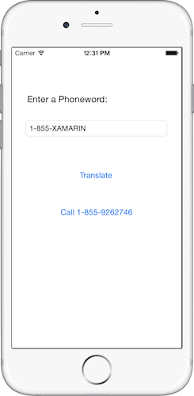](hello-ios-quickstart-images/image1.png#lightbox)

## Requirements

iOS development with Xamarin requires:

- A Mac running macOS HIgh Sierra (10.13) or above.
- Latest version of Xcode and iOS SDK installed from the [App Store](https://itunes.apple.com/us/app/xcode/id497799835?mt=12) .

::: zone pivot="macos"

Xamarin.iOS works with the following setup:

- Latest version of Visual Studio for Mac that fits the above specifications.

The [Xamarin.iOS Mac Installation guide](~/ios/get-started/installation/mac.md) is available for step-by-step installation instructions

::: zone-end
::: zone pivot="windows"

Xamarin.iOS works with the following setup:

- Latest version of Visual Studio 2017 Community, Professional, or Enterprise on Windows 10, paired with a Mac build host that fits the above specifications.

The [Xamarin.iOS Windows Installation guide](~/ios/get-started/installation/windows/index.md) is available for step-by-step installation instructions.

::: zone-end

Before getting started, download the [Xamarin App Icons set](https://github.com/xamarin/ios-samples/blob/master/Hello_iOS/Resources/XamarinAppIconsandLaunchImages.zip?raw=true).

::: zone pivot="macos"

## Visual Studio for Mac Walkthrough

This walkthrough describes how to create an application called Phoneword that translates an alphanumeric phone number into a numeric phone number.

1. Launch Visual Studio for Mac from the **Applications** folder or **Spotlight**:

    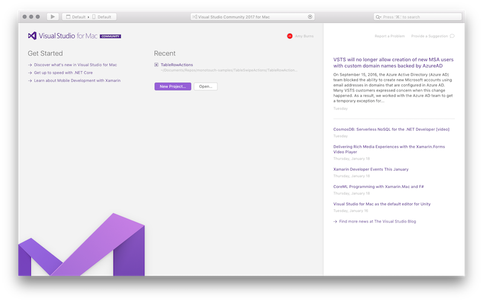

    On the Launch Screen, click **New Project...** to create a new Xamarin.iOS solution:

    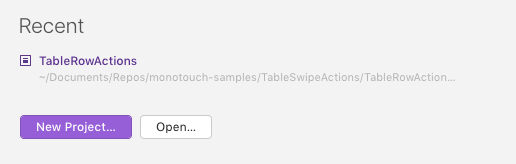

2. From the **New Solution dialog**, choose the **iOS > App > Single View Application** template, ensuring that C# is selected. Click **Next**:

    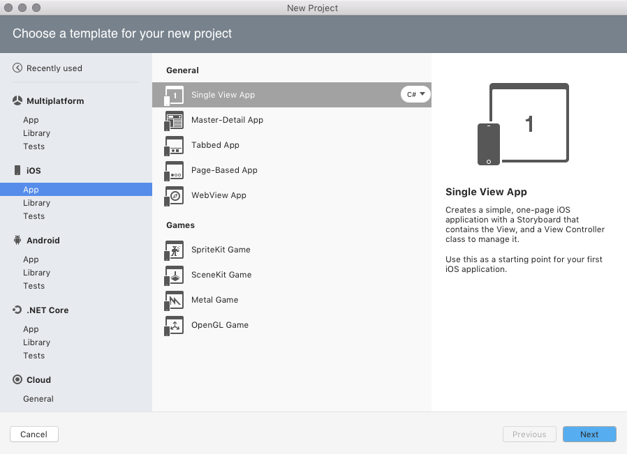

3. Configure the app. Give it the **Name** `Phoneword_iOS`, and leave everything else as default. Click **Next**:

    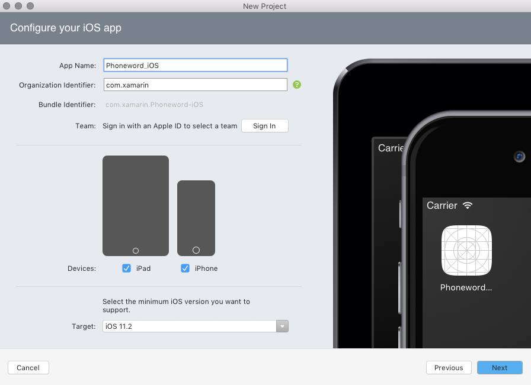

4. Leave the Project and Solution Name as is. Choose the location of the project here, or keep it as the default:

    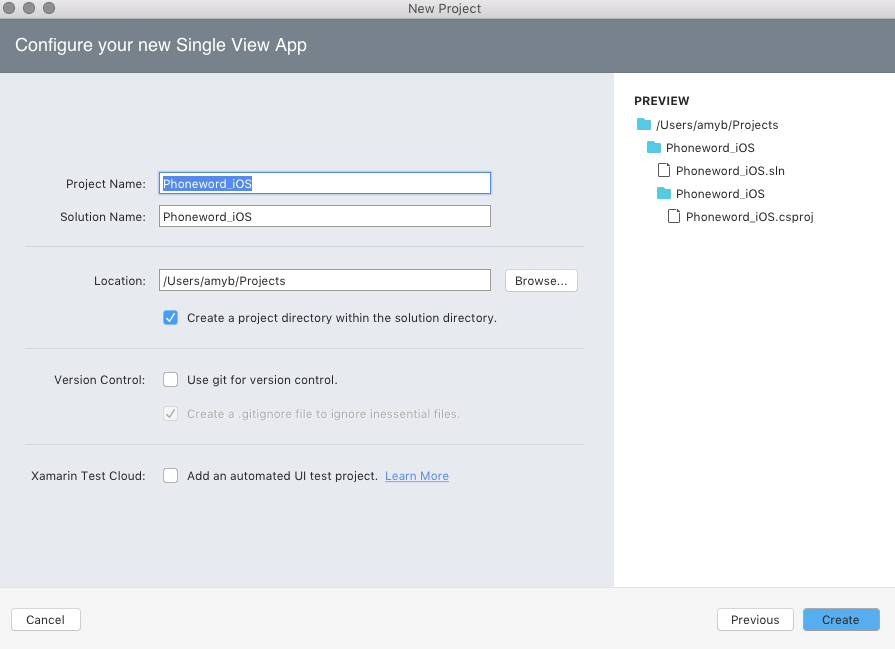

5. Click **Create** to make the **Solution**.

6. Open the **Main.storyboard** file by double-clicking on it in the **Solution Pad**. This provides a way to visually to create a UI:

    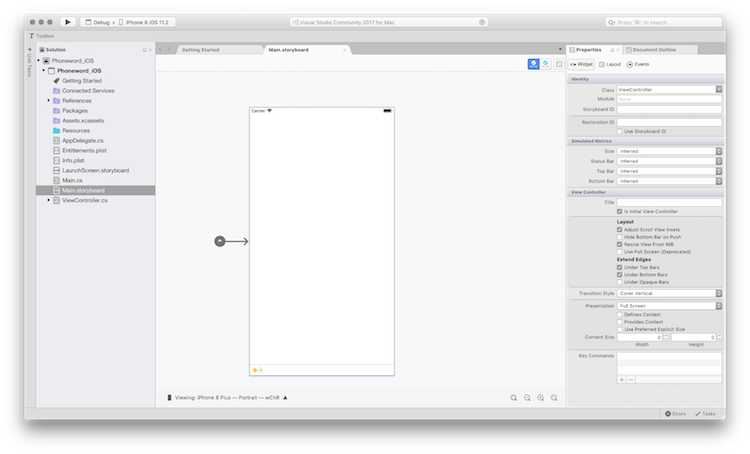

    Note that _size classes_ are enabled by default. Refer to the [Unified Storyboards](~/ios/user-interface/storyboards/unified-storyboards.md) guide to learn more about them.

8. In the **Toolbox Pad**, type "label" into the search bar and drag a **Label** onto the design surface (the area in the center):

    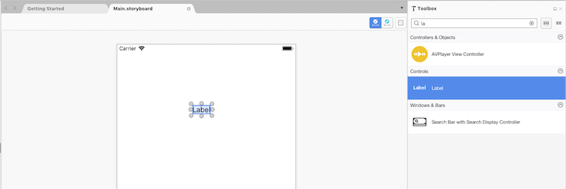

    > [!NOTE]
    > You can bring up the **Properties Pad** or **Toolbox** at any time by navigating to **View > Pads**.

9. Grab the handles of the *Dragging Controls* (the circles around the control) and make the label wider:

    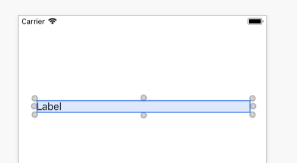

10. With the **Label** selected on the design surface, use the **Properties Pad** to change the **Text** property of the **Label** to "Enter a Phoneword:"

    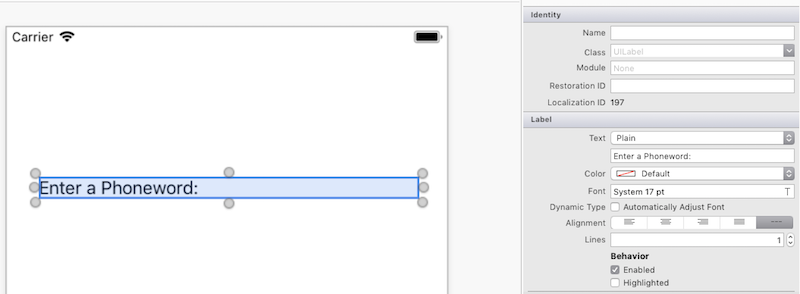

11. Search for “text field” inside the Toolbox and drag a **Text Field** from the **Toolbox** onto the design surface and place it under the **Label**. Adjust the width until the **Text Field** is the same width as the **Label**:

    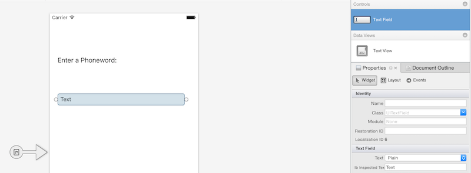

12. With the **Text Field** selected on the design surface, change the **Text Field**’s **Name** property in the Identity section of the **Properties Pad** to `PhoneNumberText`, and change the **Text** property to "1-855-XAMARIN":

    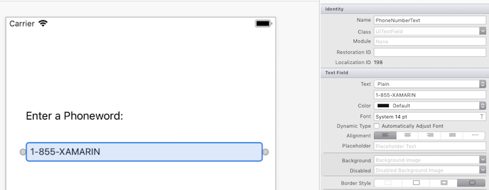

13. Drag a **Button** from the **Toolbox** onto the design surface and place it under the **Text Field**. Adjust the width so the **Button** is as wide as the **Text Field** and **Label**:

    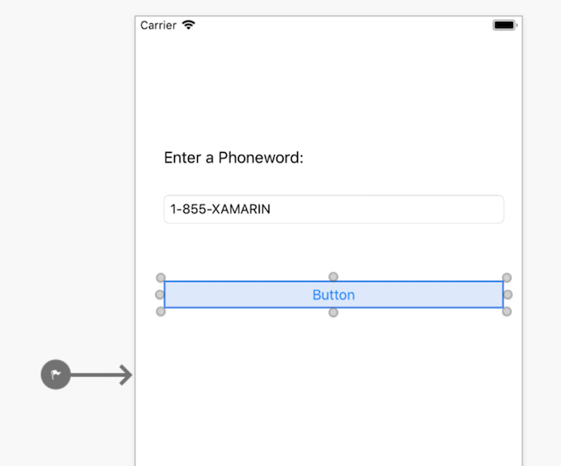

14. With the **Button** selected on the design surface, change the **Name** property in the **Identity** section of the **Properties Pad** to `TranslateButton`. Change the **Title** property to "Translate":

    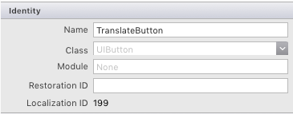

15. Repeat the two steps above and drag a **Button** from the **Toolbox** onto the design surface and place it under the first **Button**. Adjust the width so the **Button** is as wide as the first **Button**:

    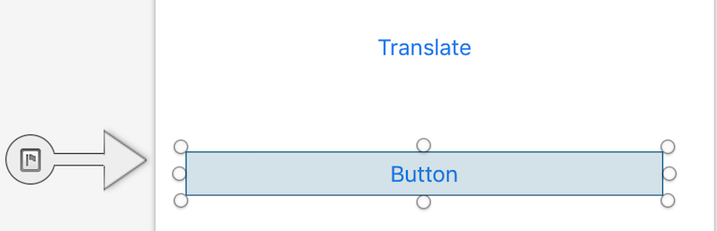

16. With the second **Button** selected on the design surface, change the **Name** property in the **Identity** section of the **Properties Pad** to `CallButton`. Change the **Title** property to "Call":

    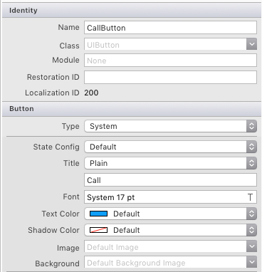

    Save the changes by navigating to **File > Save** or by pressing **⌘ + s**.

17. Some logic needs to be added to the app to translate phone numbers from alphanumeric to numeric. Add a new file to the Project by right clicking on the **Phoneword_iOS** Project in the **Solution Pad** and choosing **Add > New File...** or pressing **⌘ + n**:

    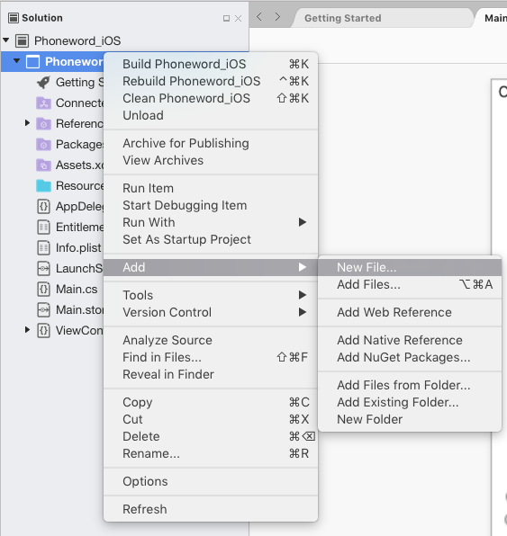

18. In the **New File** dialog, select **General > Empty Class** and name the new file `PhoneTranslator`:

    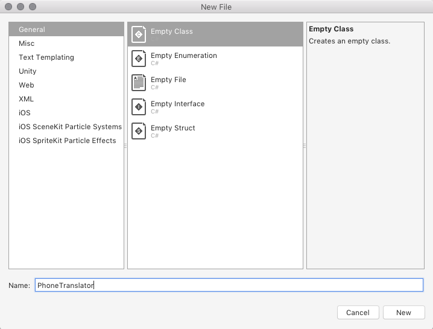

19. This creates a new, empty C# class for us. Remove all the template code and replace it with the following code:

    ```csharp
    using System.Text;
    using System;

    namespace Phoneword_iOS
    {
        public static class PhoneTranslator
        {
            public static string ToNumber(string raw)
            {
                if (string.IsNullOrWhiteSpace(raw)) {
                    return "";
                } else {
                    raw = raw.ToUpperInvariant();
                }

                var newNumber = new StringBuilder();
                foreach (var c in raw)
                {
                    if (" -0123456789".Contains(c)) {
                        newNumber.Append(c);
                    } else {
                        var result = TranslateToNumber(c);
                        if (result != null) {
                            newNumber.Append(result);
                        }
                    }
                    // otherwise we've skipped a non-numeric char
                }
                return newNumber.ToString();
            }

            static bool Contains (this string keyString, char c)
            {
                return keyString.IndexOf(c) >= 0;
            }

            static int? TranslateToNumber(char c)
            {
                if ("ABC".Contains(c)) {
                    return 2;
                } else if ("DEF".Contains(c)) {
                    return 3;
                } else if ("GHI".Contains(c)) {
                    return 4;
                } else if ("JKL".Contains(c)) {
                    return 5;
                } else if ("MNO".Contains(c)) {
                    return 6;
                } else if ("PQRS".Contains(c)) {
                    return 7;
                } else if ("TUV".Contains(c)) {
                    return 8;
                } else if ("WXYZ".Contains(c)) {
                    return 9;
                }
                return null;
            }
        }
    }
    ```

    Save the **PhoneTranslator.cs** file and close it.

20. Add code to wire up the user interface. To do this double-click on **ViewController.cs** in the **Solution Pad** to open it:

    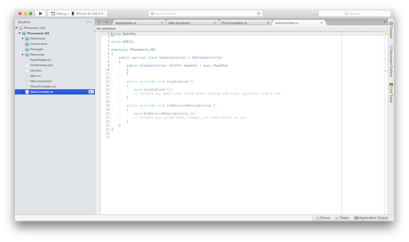

21. Begin by wiring up the `TranslateButton`. In the **ViewController** class, find the `ViewDidLoad` method and add the following code beneath the `base.ViewDidLoad()` call:

    ```csharp
    string translatedNumber = "";

    TranslateButton.TouchUpInside += (object sender, EventArgs e) => {
        // Convert the phone number with text to a number
        // using PhoneTranslator.cs
        translatedNumber = PhoneTranslator.ToNumber(
            PhoneNumberText.Text);

        // Dismiss the keyboard if text field was tapped
        PhoneNumberText.ResignFirstResponder ();

        if (translatedNumber == "") {
            CallButton.SetTitle ("Call ", UIControlState.Normal);
            CallButton.Enabled = false;
        } else {
            CallButton.SetTitle ("Call " + translatedNumber,
                UIControlState.Normal);
            CallButton.Enabled = true;
        }
    };
    ```

    Include `using Phoneword_iOS;` if the file's namespace is different.

22. Add code to respond to the user pressing the second button,
which is named `CallButton`. Place the following code below the
code for the `TranslateButton` and add `using Foundation;`
to the top of the file:

    ```csharp
        CallButton.TouchUpInside += (object sender, EventArgs e) => {
            // Use URL handler with tel: prefix to invoke Apple's Phone app...
            var url = new NSUrl ("tel:" + translatedNumber);

            // ...otherwise show an alert dialog
            if (!UIApplication.SharedApplication.OpenUrl (url)) {
                var alert = UIAlertController.Create ("Not supported", "Scheme 'tel:' is not supported on this device", UIAlertControllerStyle.Alert);
                alert.AddAction (UIAlertAction.Create ("Ok", UIAlertActionStyle.Default, null));
                PresentViewController (alert, true, null);
            }
        };
    ```

23. Save the changes and then build the application by choosing **Build > Build All** or pressing **⌘ + B**.  If the application compiles, a success message will appear at the top of the IDE:

    

    If there are errors, go through the previous steps and correct any mistakes until the application builds successfully.

27. Finally, test the application in the **iOS Simulator**. In the top left of the IDE, choose **Debug** from the first dropdown, and **iPhone XR iOS 12.0** (or other available simulator) from the second dropdown, and press **Start** (the triangular button that resembles a Play button):

    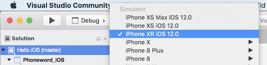

    > [!NOTE]
    > At present, due to a requirement from Apple, it may be necessary to have a development certificate or *signing identity* to build you code for device or simulator. Follow the steps in the [Device Provisioning guide](~/ios/get-started/installation/device-provisioning/manual-provisioning.md) to set this up.

28. This will launch the application inside the iOS Simulator:

    

    Phone calls are not supported in the iOS Simulator; instead, you will see an alert dialog when trying to place a call:

    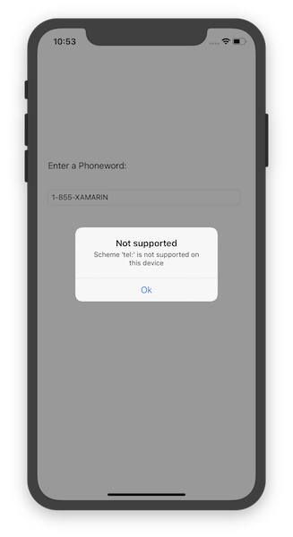

::: zone-end
::: zone pivot="windows"

## Visual Studio Walkthrough

This walkthrough describes how to create an application called Phoneword that translates an alphanumeric phone number into a numeric phone number.

**Note**: This walkthrough uses Visual Studio Enterprise 2017 on a Windows 10 Virtual Machine. Your set up can differ from this, as long as it meets the requirements above, but be aware that some screenshots may look different to your set up.

> [!NOTE]
> Before proceeding with this walkthrough, you must have already connected to your Mac from Visual Studio. This is because Xamarin.iOS relies on Apple's tooling to build and launch the iOS Designer and applications. To get set up, follow the steps in the [Pair to Mac](~/ios/get-started/installation/windows/connecting-to-mac/index.md) guide.

1. Launch Visual Studio from the **Start** menu:

    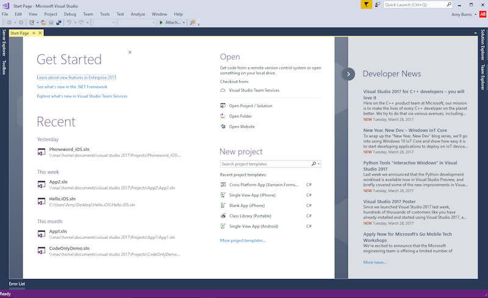

    Create a new Xamarin.iOS solution by selecting **File > New > Project... > Visual C# > iPhone & iPad > iOS App (Xamari**:

     project type")

    In the next dialog that appears, select the **Single View App** template and press **OK** to create the project:

    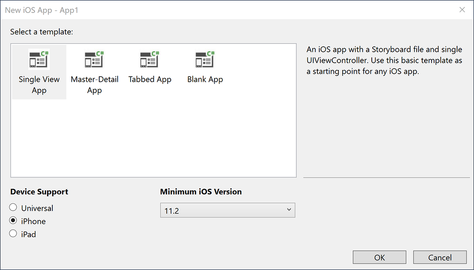

1. Confirm that the Xamarin Mac Agent icon in the toolbar is green.

    

    If it isn't, this means that there is no connection to your Mac build host, follow the steps in the [configuration guide](~/ios/get-started/installation/windows/connecting-to-mac/index.md) to get connected.

1. Open the **Main.storyboard** file in the iOS Designer by double-clicking on it in the **Solution Explorer**:

    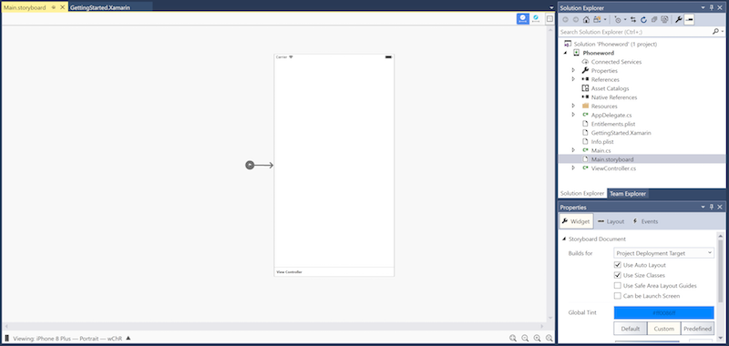

1. Open the **Toolbox** tab, type “label” into the search bar and drag a **Label** onto the design surface (the area in the center):

    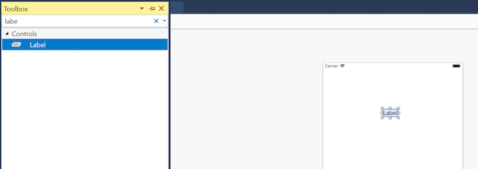

1. Next, grab the handles of the *Dragging Controls* and make the label wider:

    

1. With the **Label** selected on the design surface, use the **Properties Windows** to change the **Text** property of the **Label** to "Enter a Phoneword:"

    

    > [!NOTE]
    > You can bring up the **Properties** or **Toolbox** at any time by navigating to the **View** menu.

1. Search for “text field” inside the Toolbox and drag a **Text Field** from the **Toolbox** onto the design surface and place it under the **Label**. Adjust the width until the **Text Field** is the same width as the **Label**:

    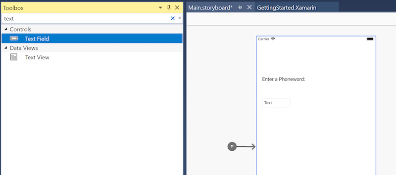

10. With the **Text Field** selected on the design surface, change the **Text Field**’s **Name** property in the Identity section of the **Properties** to `PhoneNumberText`, and change the **Text** property to "1-855-XAMARIN":

    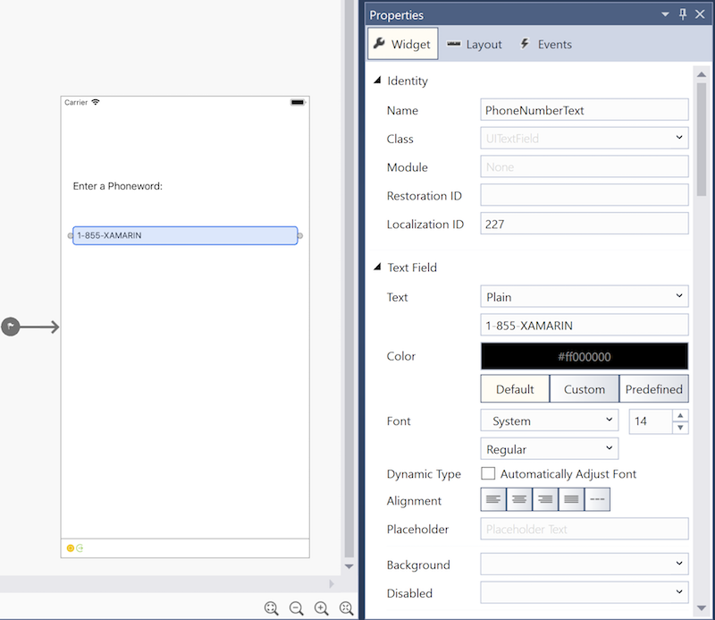

11. Drag a **Button** from the **Toolbox** onto the design surface and place it under the **Text Field**. Adjust the width so the **Button** is as wide as the **Text Field** and **Label**:

    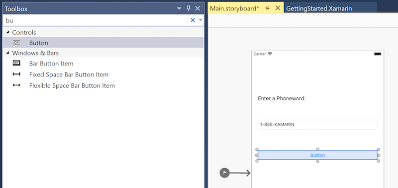


12. With the **Button** selected on the design surface, change the **Name** property in the **Identity** section of the **Properties** to `TranslateButton`. Change the **Title** property to "Translate":

    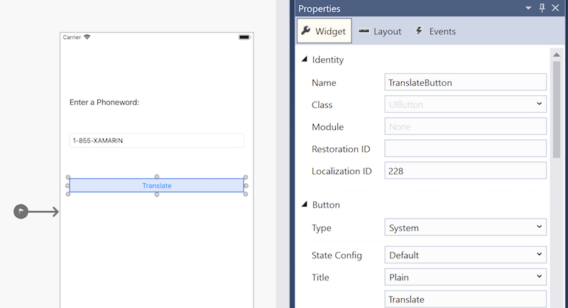

13. Repeat the previous two steps and drag a **Button** from the **Toolbox** onto the design surface and place it under the first **Button**. Adjust the width so the **Button** is as wide as the first **Button**:

    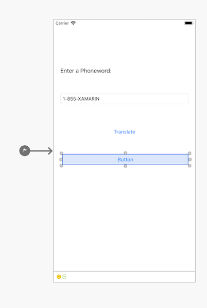

14. With the second **Button** selected on the design surface, change the **Name** property in the **Identity** section of the **Properties** to `CallButton`. Change the **Title** property to "Call":

    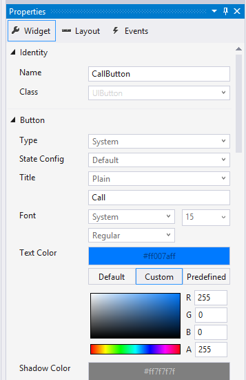

    Save the changes by navigating to **File > Save All** or by pressing **Ctrl + s**.

15. Add some code to translate phone numbers from alphanumeric to numeric. To do this, first add a new file to the Project by right-clicking on the **Phoneword** Project in the **Solution Explorer** and choosing **Add > New Item...** or pressing **Ctrl + Shift + A**:

    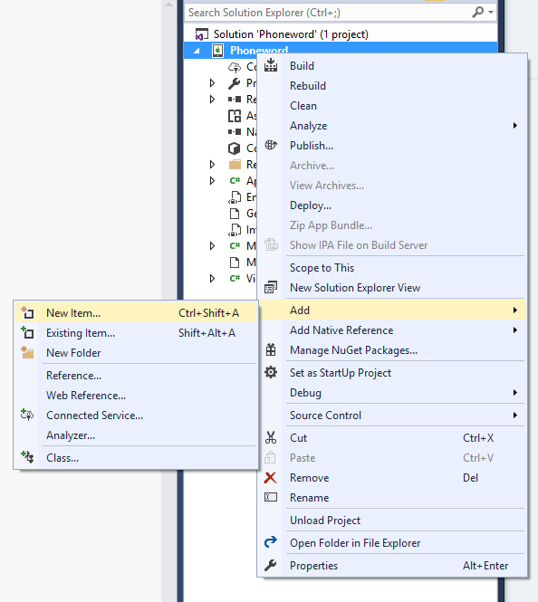

16. In the **Add New Item** dialog (right click on the project, choose Add > New Item...), select **Apple > Class** and name the new file `PhoneTranslator`:

    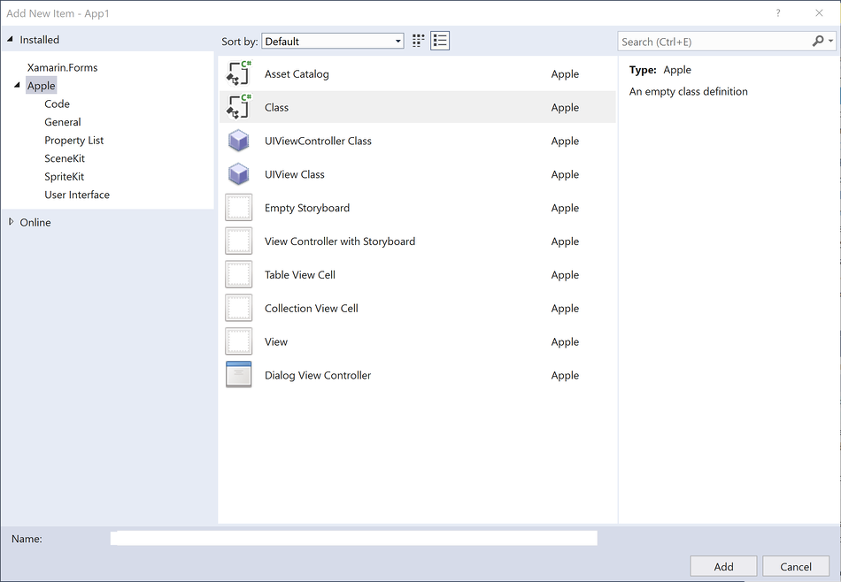

    > [!IMPORTANT]
    > Make sure that you select the 'class' template that has a C# in the icon. Otherwise you may not be able to reference this new class.

17. This creates a new C# class. Remove all the template code and replace it with the following code:

    ```csharp
    using System.Text;
    using System;

    namespace Phoneword
    {
        public static class PhoneTranslator
        {
            public static string ToNumber(string raw)
            {
                if (string.IsNullOrWhiteSpace(raw)) {
                    return "";
                } else {
                    raw = raw.ToUpperInvariant();
                }

                var newNumber = new StringBuilder();
                foreach (var c in raw)
                {
                    if (" -0123456789".Contains(c)) {
                        newNumber.Append(c);
                    } else {
                        var result = TranslateToNumber(c);
                        if (result != null) {
                            newNumber.Append(result);
                        }
                    }
                    // otherwise we've skipped a non-numeric char
                }
                return newNumber.ToString();
            }

            static bool Contains (this string keyString, char c)
            {
                return keyString.IndexOf(c) >= 0;
            }

            static int? TranslateToNumber(char c)
            {
                if ("ABC".Contains(c)) {
                    return 2;
                } else if ("DEF".Contains(c)) {
                    return 3;
                } else if ("GHI".Contains(c)) {
                    return 4;
                } else if ("JKL".Contains(c)) {
                    return 5;
                } else if ("MNO".Contains(c)) {
                    return 6;
                } else if ("PQRS".Contains(c)) {
                    return 7;
                } else if ("TUV".Contains(c)) {
                    return 8;
                } else if ("WXYZ".Contains(c)) {
                    return 9;
                }
                return null;
            }
        }
    }
    ```

    Save the **PhoneTranslator.cs** file and close it.

18. Double-click on **ViewController.cs** in the **Solution Explorer** to open it, so that logic can be added to handles interactions with the buttons:

    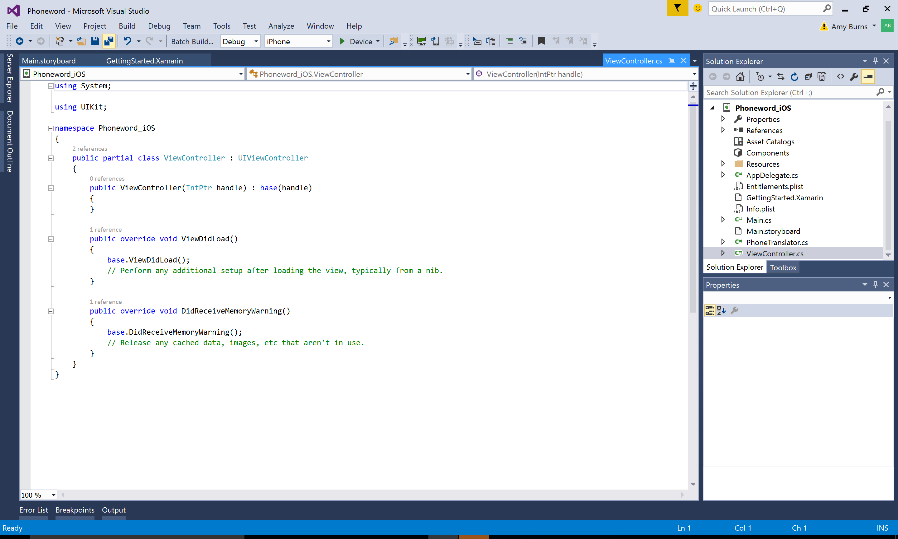


19. Begin by wiring up the `TranslateButton`. In the **ViewController** class, find the `ViewDidLoad` method. Add  the following button code inside `ViewDidLoad`, beneath the `base.ViewDidLoad()` call:

    ```csharp
    string translatedNumber = "";

    TranslateButton.TouchUpInside += (object sender, EventArgs e) => {

        // Convert the phone number with text to a number
        // using PhoneTranslator.cs
        translatedNumber = PhoneTranslator.ToNumber(PhoneNumberText.Text);

        // Dismiss the keyboard if text field was tapped
        PhoneNumberText.ResignFirstResponder ();

        if (translatedNumber == "") {
            CallButton.SetTitle ("Call", UIControlState.Normal);
            CallButton.Enabled = false;
            }
        else {
            CallButton.SetTitle ("Call " + translatedNumber, UIControlState.Normal);
            CallButton.Enabled = true;
            }
    };
    ```
    Include `using Phoneword;` if the file's namespace is different.

20. Add code to respond to the user pressing the second button,
which is named `CallButton`. Place the following code below the
code for the `TranslateButton` and add `using Foundation;`
to the top of the file:

    ```csharp
    CallButton.TouchUpInside += (object sender, EventArgs e) => {
        var url = new NSUrl ("tel:" + translatedNumber);

            // Use URL handler with tel: prefix to invoke Apple's Phone app,
            // otherwise show an alert dialog

        if (!UIApplication.SharedApplication.OpenUrl (url)) {
                        var alert = UIAlertController.Create ("Not supported", "Scheme 'tel:' is not supported on this device", UIAlertControllerStyle.Alert);
                        alert.AddAction (UIAlertAction.Create ("Ok", UIAlertActionStyle.Default, null));
                        PresentViewController (alert, true, null);
                    }
    };
    ```

21. Save the changes, and then build the application by choosing **Build > Build Solution** or pressing **Ctrl + Shift + B**.  If the application compiles, a success message will appear at the bottom of the IDE:

    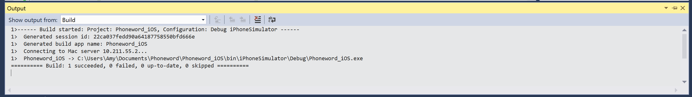

    If there are errors, go through the previous steps and correct any mistakes until the application builds successfully.

22. Finally, test the application in the **Remoted iOS Simulator**. In the IDE toolbar, choose **Debug** and **iPhone 8 Plus iOS x.x** from the drop down menus, and press **Start** (the green triangle that resembles a Play button):

    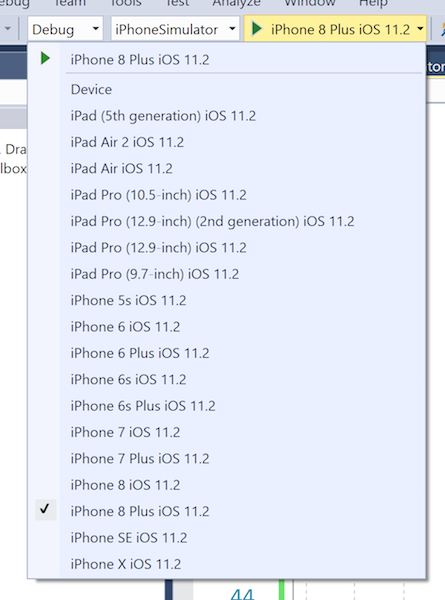

23. This will launch the application inside the iOS Simulator:

    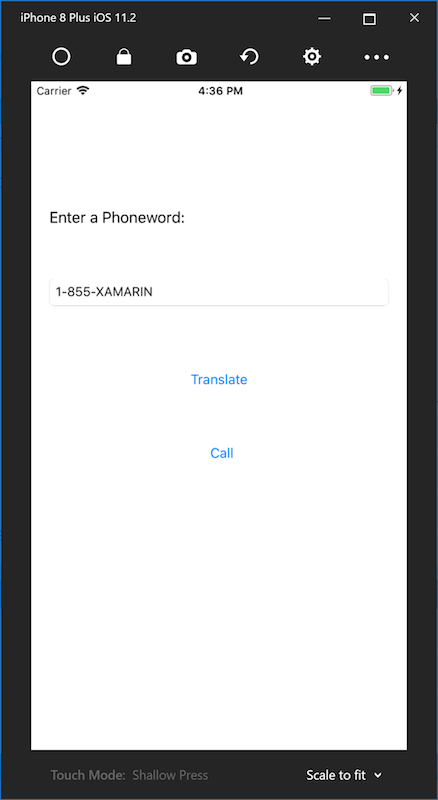

    Phone calls are not supported in the iOS Simulator; instead, an alert dialog will display when trying to place a call:

    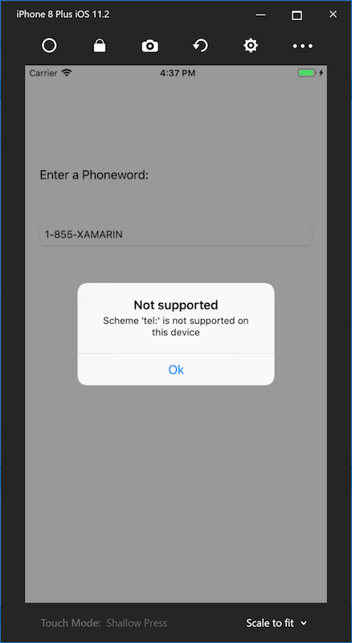

::: zone-end

Congratulations on completing your first Xamarin.iOS application!

Now it’s time to dissect the tools and skills shown in this guide in the [Hello, iOS Deep Dive](~/ios/get-started/hello-ios/hello-ios-deepdive.md).

## Related Links

- [Xamarin App Icons and Launch Images (sample)](https://github.com/xamarin/ios-samples/blob/master/Hello_iOS/Resources/XamarinAppIconsandLaunchImages.zip?raw=true)
- [Hello, iOS (sample)](https://developer.xamarin.com/samples/monotouch/Hello_iOS/)
- [iOS Human Interface Guidelines](http://developer.apple.com/library/ios/#documentation/UserExperience/Conceptual/MobileHIG/Introduction/Introduction.html)
- [iOS Provisioning Portal](https://developer.apple.com/ios/manage/overview/index.action)
