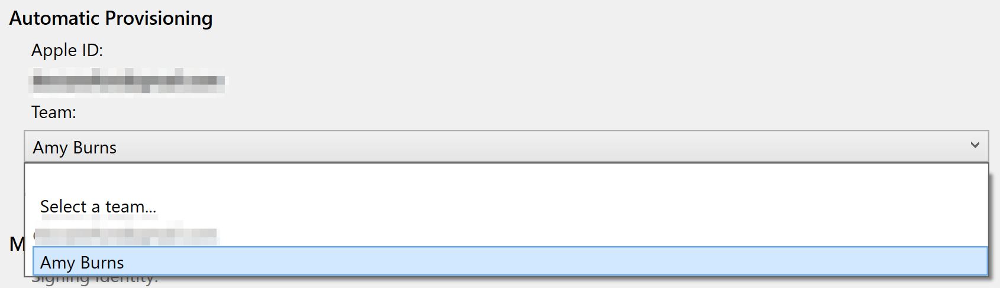

# Automatic Provisioning for Xamarin.iOS

_Once Xamarin.iOS has been successfully installed, the next step in iOS development is to provision your iOS device. This guide explores using Automatic Signing to request development certificates and profiles._

## Requirements

# [Visual Studio for Mac](#tab/macos)

- Visual Studio for Mac 7.3 or greater
- Xcode 9 or greater

# [Visual Studio](#tab/windows)

- Visual Studio 2017 Version 15.7 (or greater)

You must also be paired to a Mac build host that has the following:

- Xcode 9 or greater

-----

## Enabling Automatic Signing

Before you start the automatic signing process, you should ensure that you have an Apple ID added in Visual Studio, as described in the [Apple Account Management](~/cross-platform/macios/apple-account-management.md) guide. Once you've added an Apple ID, you can use any associated _Team_. This allows certificates, profiles, and other IDs to be made against the team. The team ID is also used to create a the prefix for an App ID that will be included in the provisioning profile. Having this allows Apple to verify that you are who you say you are.

> [!IMPORTANT]
> Before you begin, make sure to sign in to either [iTunes Connect](https://itunesconnect.apple.com/) or [appleid.apple.com](https://appleid.apple.com) to check that you have accepted the latest Apple account policies. If prompted, complete the steps to accept any new account agreements from Apple. If you don't accept the privacy agreement from May 2018, you'll see one of the following alerts when trying to provision your device:
> ```
> Unexpected authentication failure. Reason: {
> "authType" : "sa"
> }
> ```
> or
> ```
> Authentication Service Is Unavailable
> ```

To automatically sign your app for deployment on an iOS device, do the following:

# [Visual Studio for Mac](#tab/macos)

1. Open an iOS project in Visual Studio for Mac.

2. Open the **Info.plist** file.

3. In the **Signing** section, select **Automatic Provisioning**:

    

4. Select your team from the **Team** dropdown.

6. After a few seconds a Signing Certificate and Provisioning profile will be created:

    

    If the automatic signing fails the **Automatic signing pad** will display the reason for the error.

# [Visual Studio](#tab/windows)

1. Pair Visual Studio 2017 to a Mac as described in the [Pair to Mac](~/ios/get-started/installation/windows/connecting-to-mac/index.md) guide.

2. In the **Solution Explorer**, right-click the project name and select **Properties**. Then, navigate to the **iOS Bundle Signing** tab.

3. Select the **Automatic Provisioning** scheme:

    

4. Select your team from the **Team** combo box to start the automatic signing process.

    

4. This starts the automatic signing process. Visual Studio then attempts to generate an App ID, provisioning profile, and a signing identity to use these artifacts for signing. You can see the generation process in the Build output:

    

-----

## Triggering Automatic Provisioning

When automatic signing has been enabled, Visual Studio for Mac will update these artifacts if necessary when any of the following things happen:

* An iOS device is plugged into your Mac
    - This automatically checks to see if the device is registered on the Apple Developer Portal. If it isn’t, it will add it and generate a new provisioning profile that contains it.
* The Bundle ID of your app is changed
    - This updates the app ID. A new provisioning profile containing this app ID is created.
* A supported capability is enabled in the Entitlements.plist file.
    - This capability will be added to the app ID and a new provisioning profile with the updated app ID is generated.
    - Not all capabilities are currently supported. For more information on the ones that are supported, check out the [Working with Capabilities](~/ios/deploy-test/provisioning/capabilities/index.md) guide.

## Wildcard App IDs

Starting with Visual Studio for Mac 7.6, automatic provisioning will by
default attempt to create and use a wildcard App ID and provisioning
profile instead of an explicit App ID based on the **Bundle Identifier**
specified in **Info.plist**. Wildcard App IDs reduce the number of profiles
and IDs to maintain in the Apple Developer Portal.

In some cases, an app's entitlements require an explicit App ID. The
following entitlements do not support wildcard App IDs:

- App Groups
- Associated Domains
- Apple Pay
- Game Center
- HealthKit
- HomeKit
- Hotspot
- In-App purchase
- Multipath
- NFC
- Personal VPN
- Push Notifications
- Wireless Accessory Configuration

If your app uses one of these entitlements, Visual Studio for Mac will
attempt to create an explicit (instead of a wildcard) App ID.

> [!NOTE]
> Automatic provisioning with wildcard App IDs is currently only available
> in Visual Studio for Mac.

## Related Links

- [Free Provisioning](~/ios/get-started/installation/device-provisioning/free-provisioning.md)
- [App Distribution](~/ios/deploy-test/app-distribution/index.md)
- [Troubleshooting](~/ios/deploy-test/troubleshooting.md)
- [Apple - App Distribution Guide](https://developer.apple.com/library/ios/documentation/IDEs/Conceptual/AppDistributionGuide/Introduction/Introduction.html)

## Related Video

> [!Video https://channel9.msdn.com/Shows/XamarinShow/Snack-Pack-Simplified-iOS-Provisioning-in-Visual-Studio-with-fastlane/player]

[!include[](~/essentials/includes/xamarin-show-essentials.md)]
