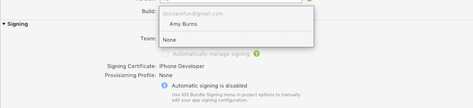
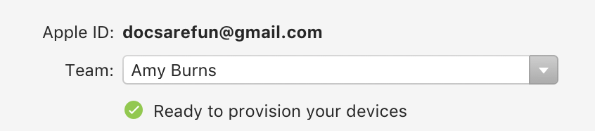
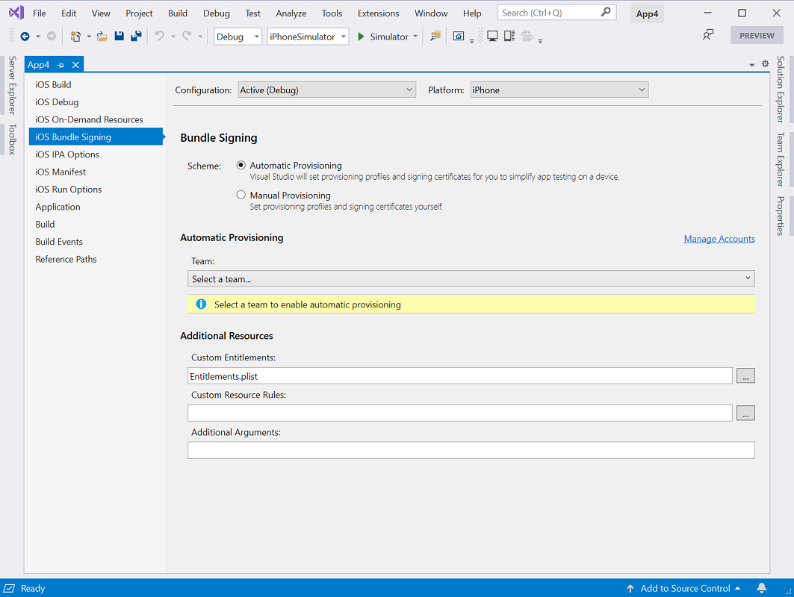
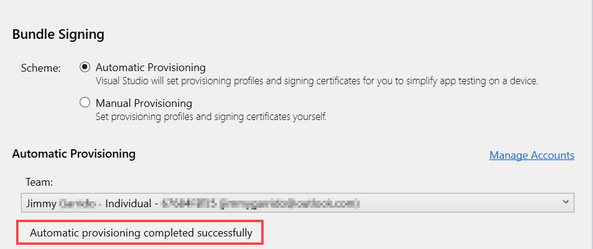

# Automatic Provisioning for Xamarin.iOS

_Once Xamarin.iOS has been successfully installed, the next step in iOS development is to provision your iOS device. This guide explores using automatic provisioning to request development certificates and profiles._

## Requirements

Automatic provisioning is available on Visual Studio for Mac, Visual Studio 2019, and Visual Studio 2017 (Version 15.7 and higher). 

> [!NOTE]
> You must also have a paid Apple Developer account to use this feature. More information on Apple developer accounts is available in the [Device Provisioning](~/ios/get-started/installation/device-provisioning/index.md) guide.
> If you do not have a paid Apple developer account, see the [Free Provisioning for Xamarin.iOS](~/ios/get-started/installation/device-provisioning/free-provisioning.md) guide.

> [!NOTE]
> Before you begin, be sure to first accept any license agreements in either the [Apple Developer portal](https://developer.apple.com/account/) or [App Store Connect](https://appstoreconnect.apple.com/).

## Enable automatic provisioning

Before starting the automatic signing process, you should ensure that you have an Apple ID added in Visual Studio, as described in the [Apple Account Management](~/cross-platform/macios/apple-account-management.md) guide. 

Once you've added an Apple ID, you can use any associated _Team_. This allows certificates, profiles, and other IDs to be made against the team. The team ID is also used to create a prefix for an App ID that will be included in the provisioning profile. Having this allows Apple to verify that you are who you say you are.

To automatically sign your app for deployment on an iOS device, do the following:

# [Visual Studio for Mac](#tab/macos)

1. Open an iOS project in Visual Studio for Mac.

2. Open the **Info.plist** file.

3. Select the **Application** tab.

4. In the **Signing** section, select **Automatic Provisioning**:

    

5. Select your team from the **Team** dropdown.

6. After a few seconds a Signing Certificate and Provisioning profile will be created:

    

    If the automatic signing fails the **Automatic signing pad** will display the reason for the error.

# [Visual Studio](#tab/windows)

> [!NOTE]
> If you are using Visual Studio 2017 or Visual Studio 2019 (version 16.4 and older), you will need to be [Paired to a Mac build host](~/ios/get-started/installation/windows/connecting-to-mac/index.md) before proceeding.

1. In the **Solution Explorer**, right-click the iOS project name and select **Properties**. Then, navigate to the **iOS Bundle Signing** tab:

    

2. Select the **Automatic Provisioning** scheme.

3. Select your team from the **Team** drop down menu to start the automatic signing process. Visual Studio will indicate if the process completed successfully:

    

-----

## Run automatic provisioning

When automatic provisioning is enabled, Visual Studio will re-run the process if necessary when any of the following things happen:

- An iOS device is plugged into your Mac
  - This automatically checks to see if the device is registered on the Apple Developer Portal. If it isn't, it will add it and generate a new provisioning profile that contains it.
- The Bundle ID of your app is changed
  - This updates the app ID. A new provisioning profile containing this app ID is created.
- A supported capability is enabled in the Entitlements.plist file.
  - This capability will be added to the app ID and a new provisioning profile with the updated app ID is generated.
  - Not all capabilities are currently supported. For more information on the ones that are supported, check out the [Working with Capabilities](~/ios/deploy-test/provisioning/capabilities/index.md) guide.

## Wildcard App IDs

In Visual Studio for Mac and Visual Studio 2019 (version 16.5 or greater), automatic provisioning will by
default attempt to create and use a wildcard App ID and provisioning
profile instead of an explicit App ID based on the **Bundle Identifier**
specified in **Info.plist**. Wildcard App IDs reduce the number of profiles
and IDs to maintain in the Apple Developer Portal.

In some cases, an app's entitlements require an explicit App ID. The
following entitlements do not support wildcard App IDs:

- App Groups
- Associated Domains
- Apple Pay
- Game Center
- HealthKit
- HomeKit
- Hotspot
- In-App purchase
- Multipath
- NFC
- Personal VPN
- Push Notifications
- Wireless Accessory Configuration

If your app uses one of these entitlements, Visual Studio will
attempt to create an explicit (instead of a wildcard) App ID.

## Troubleshoot 

- It may take several hours for a new Apple developer account to be approved. You will not be able to enable automatic provisioning until the account has been approved.
- If the automatic provisioning process fails with the error message `Authentication Service Is Unavailable`, sign in to either [App Store Connect](https://appstoreconnect.apple.com/) or [appleid.apple.com](https://appleid.apple.com) to check that you have accepted the latest service agreements.
- If you get the error message `Authentication Error: Xcode 7.3 or later is required to continue developing with your Apple ID.`, make sure that the team selected has an active paid membership to the Apple Developer Program. To use a paid Apple developer account, please see the [Free provisioning for Xamarin.iOS apps](~/ios/get-started/installation/device-provisioning/free-provisioning.md) guide.

## Related Links

- [Free Provisioning](~/ios/get-started/installation/device-provisioning/free-provisioning.md)
- [App Distribution](~/ios/deploy-test/app-distribution/index.md)
- [Troubleshooting](~/ios/deploy-test/troubleshooting.md)
- [Apple - App Distribution Guide](https://developer.apple.com/library/ios/documentation/IDEs/Conceptual/AppDistributionGuide/Introduction/Introduction.html)
