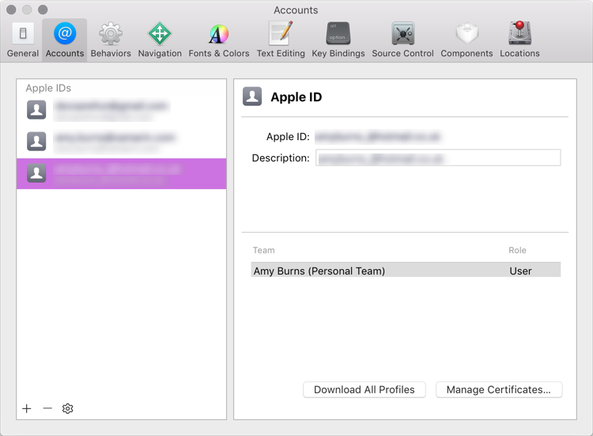
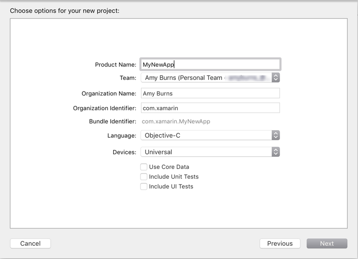
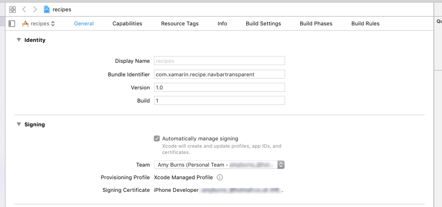
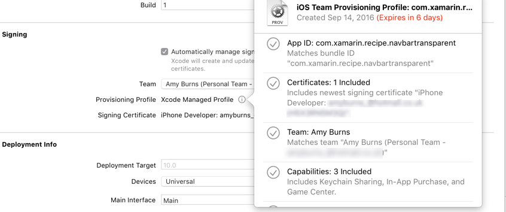
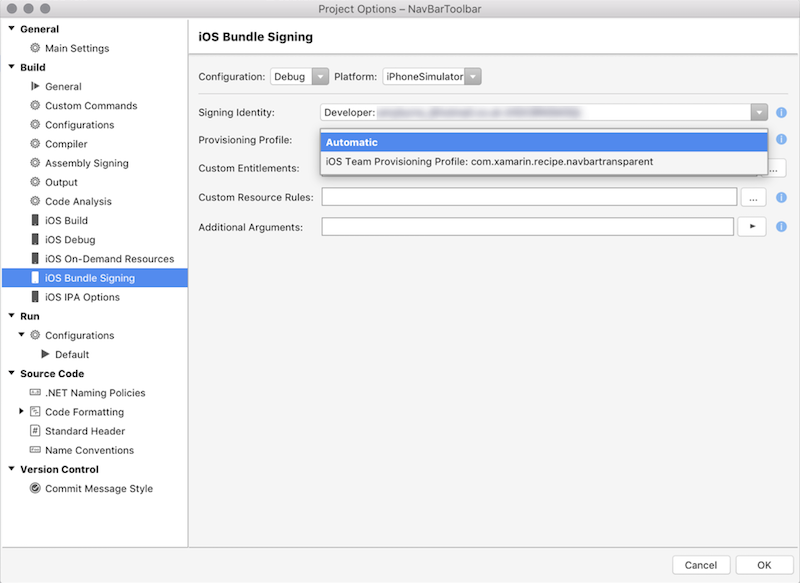
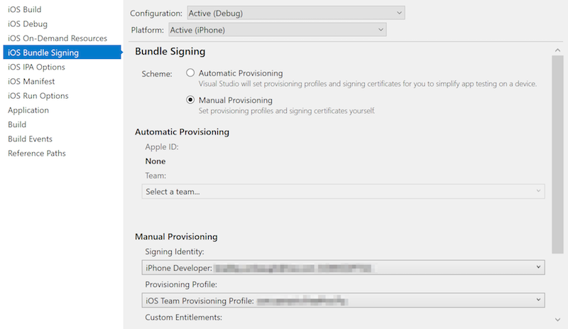

# Free provisioning for Xamarin.iOS apps

Free provisioning allows Xamarin.iOS developers to deploy and test their
apps on iOS devices **without** being part of the **Apple Developer Program**.
While simulator testing is valuable and convenient, it is also essential to
test apps on physical iOS devices to verify that they function properly
under real-world memory, storage, and network connectivity constraints.

To use free provisioning to deploy an app to a device:

- Use Xcode to create the necessary *signing identity* (developer
  certificate and private key) and *provisioning profile* (containing an
  explicit App ID and the UDID of a connected iOS device).
- Use the signing identity and provisioning profile created by Xcode in
  Visual Studio for Mac or Visual Studio 2019 to deploy your Xamarin.iOS
  application.

> [!IMPORTANT]
> [Automatic provisioning](~/ios/get-started/installation/device-provisioning/automatic-provisioning.md)
> allows Visual Studio for Mac or Visual Studio 2019 to automatically set
> up a device for developer testing. However, automatic provisioning is not
> compatible with free provisioning. In order to use automatic provisioning,
> you must have a paid Apple Developer Program account.

## Requirements

To deploy your Xamarin.iOS applications to a device with free provisioning:

- The Apple ID being used must not be connected to the Apple Developer Program.
- Your Xamarin.iOS app must use an explicit App ID, not a wildcard App ID.
- The bundle identifier used in your Xamarin.iOS app must be unique and cannot have been used in another app previously. Any bundle identifier used with free provisioning **cannot** be re-used.
- If you have already distributed an app, you cannot deploy that app with free provisioning.
- If your app uses App Services, you will need to create a provisioning profile as detailed in the [device provisioning](~/ios/get-started/installation/device-provisioning/index.md#provisioning-for-application-services) guide.

Take a look at the [Limitations](#limitations) section of this document
for more information about limitations associated with free provisioning,
and refer to the [App distribution
guides](~/ios/deploy-test/app-distribution/index.md) for more information
about distributing iOS applications.

## Testing on device with free provisioning

Follow these steps below to test your Xamarin.iOS app with free provisioning.

### Use Xcode to create a signing identity and provisioning profile

1. If you do not have an Apple ID, [create one](https://appleid.apple.com).
2. Open Xcode and navigate to **Xcode > Preferences**.
3. Under **Accounts**, use the **+** button to add your existing Apple ID. It should look similar to the screenshot below:

    

4. Close Xcode preferences.
5. Plug in the iOS device to which you'd like to deploy your app.
6. In Xcode, create a new project. Choose **File > New > Project** and select **Single View App**.
7. In the new project dialog, set **Team** to the Apple ID that you just added. In the drop-down list, it should look similar to **Your Name (Personal Team)**:

    

8. Once the new project has been created, choose an Xcode build scheme that targets your iOS device (rather than a simulator).

    

9. Open your app's project settings by selecting its top-level node in Xcode's **Project Navigator**.
10. Under **General > Identity**, make sure that the **Bundle Identifier** _exactly matches_ your Xamarin.iOS app's bundle identifier found in Info.plist.

    

    > [!IMPORTANT]
    > Xcode will only create a provisioning profile for an explicit App
    > ID, and it must be identical to the App ID of your Xamarin.iOS app.
    > If they differ, you will not be able to use free provisioning to
    > deploy your Xamarin.iOS app.

11. Under **Deployment Info**, ensure that the deployment target matches or is lower than the version of iOS installed on your connected iOS device.
12. Under **Signing**, select **Automatically manage signing** and select your team from the drop-down list:

    

    Xcode will automatically generate a provisioning profile and signing identity for you. You can view this by clicking on the information icon next to provisioning profile:

    

    > [!TIP]
    > If there is a failure when Xcode attempts to generate a provisioning
    > profile, make sure that Xcode's currently-selected build scheme
    > targets the connected iOS device rather than a simulator.

13. To test in Xcode, deploy the blank application to your device by clicking the run button.

### Deploy your Xamarin.iOS app

# [Visual Studio for Mac](#tab/macos)

1. Connect your iOS device to the Mac build host via USB or [wirelessly](~/ios/deploy-test/wireless-deployment.md).
2. In the Visual Studio for Mac **Solution Pad**, double-click on **Info.plist**.
3. In **Signing**, select **Manual Provisioning**.
4. Click the **iOS Bundle Signing…** button.
5. For **Configuration**, select **Debug**.
6. For **Platform**, select **iPhone**.
7. Select the **Signing Identity** created by Xcode.
8. Select the **Provisioning Profile** created by Xcode.

    

    > [!TIP]
    > If you cannot see your signing identity or the correct provisioning
    > profile, you may need to restart Visual Studio for Mac.

9. Click **OK** to save and close the **Project Options**.
10. Select your iOS device and run the app.

# [Visual Studio](#tab/windows)

1. Make sure that Visual Studio 2019 or Visual Studio 2017 has been [paired to a Mac build host](~/ios/get-started/installation/windows/connecting-to-mac/index.md).
2. Connect your iOS device to the Mac build host via USB or [wirelessly](~/ios/deploy-test/wireless-deployment.md).
3. In the Visual Studio 2019 or Visual Studio 2017 **Solution Explorer**, right-click on your Xamarin.iOS project and select **Properties**.
4. Navigate to **iOS Bundle Signing**.
5. For **Configuration**, select **Debug**.
6. For **Platform**, select **iPhone**.
7. Select **Manual Provisioning**.
8. Select the **Signing Identity** created by Xcode.
9. Select the **Provisioning Profile** created by Xcode.

    

    > [!TIP]
    > Xcode created this signing identity and provisioning profile and
    > stored them on your Mac build host. They are accessible to
    > Visual Studio 2019 or Visual Studio 2017 since it has been [paired](~/ios/get-started/installation/windows/connecting-to-mac/index.md)
    > to the Mac build host. If they are not listed, you may need to restart
    > Visual Studio 2019 or Visual Studio 2017.

10. Save and close the project properties.
11. Select your iOS device and run the app.

-----

## Limitations

Apple has imposed a number of limitations on when and how you can use free provisioning to run your application on an iOS device, ensuring that you can only deploy to *your* device:

- Access to iTunes Connect is limited and therefore services such as publishing to the App Store and TestFlight are unavailable to developers provisioning their applications freely. An Apple Developer Account (Enterprise or Personal) is required to distribute via Ad Hoc and In-House means.
- Provisioning profiles created with free provisioning will expire after one week, and signing identities will expire after one year.
- Since Xcode will only create provisioning profiles for explicit App IDs, you will need to follow the [instructions above](#testing-on-device-with-free-provisioning) for every app that you wish to install.
- Provisioning for most application services is not possible with free provisioning. This includes Apple Pay, Game Center, iCloud, In-App Purchasing, Push Notifications, and Wallet. Apple provides a full list of capabilities in the [Supported capabilities (iOS)](https://help.apple.com/developer-account/#/dev21218dfd6) guide. To provision your app for use with application services, visit the [Working with capabilities](~/ios/deploy-test/provisioning/capabilities/index.md) guides.

## Summary

This guide explored the advantages and limitations of using free provisioning to install applications on an iOS device. It provided a step-by-step walkthrough that demonstrated how to use free provisioning to install a Xamarin.iOS app.

## Related links

- [Device provisioning](~/ios/get-started/installation/device-provisioning/index.md)
- [Provisioning for application services](~/ios/get-started/installation/device-provisioning/index.md#provisioning-for-application-services)
