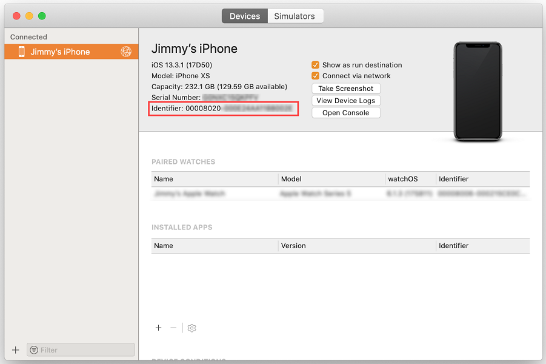
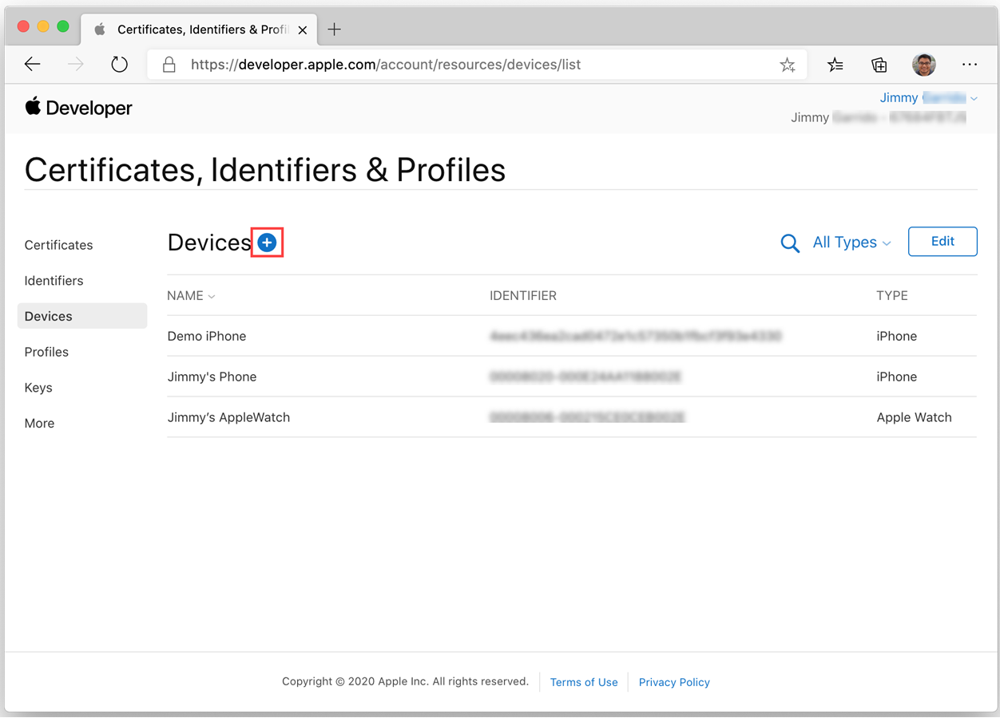
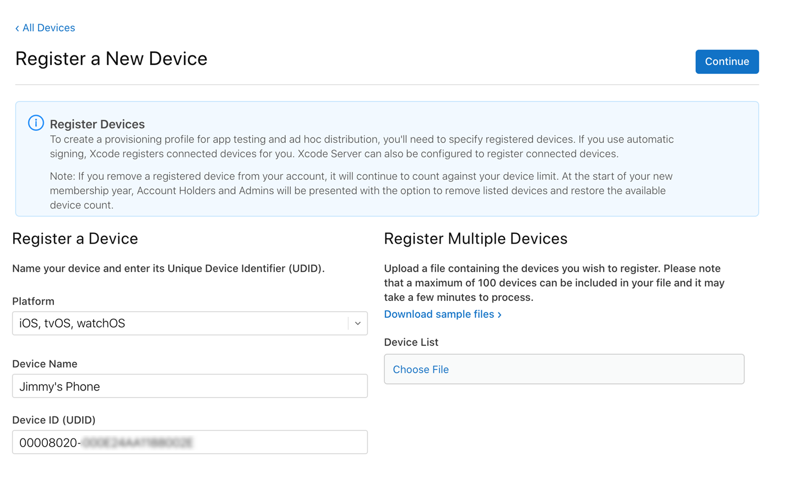
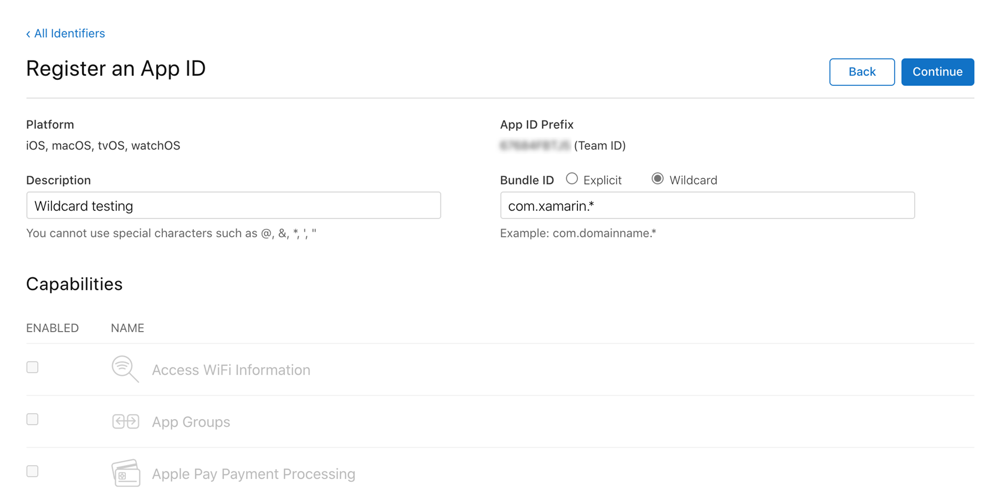
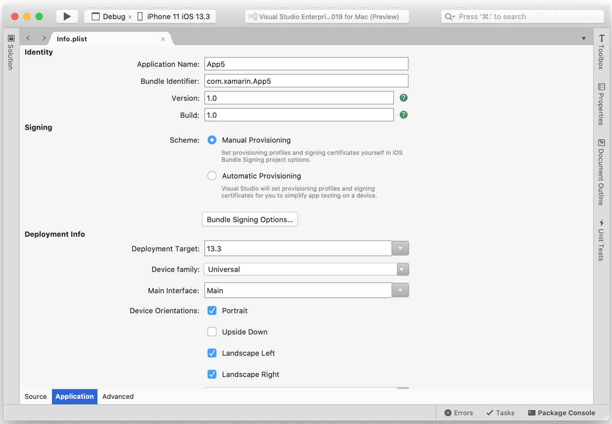
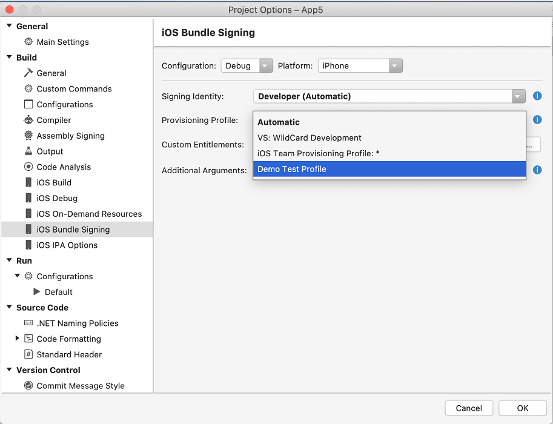
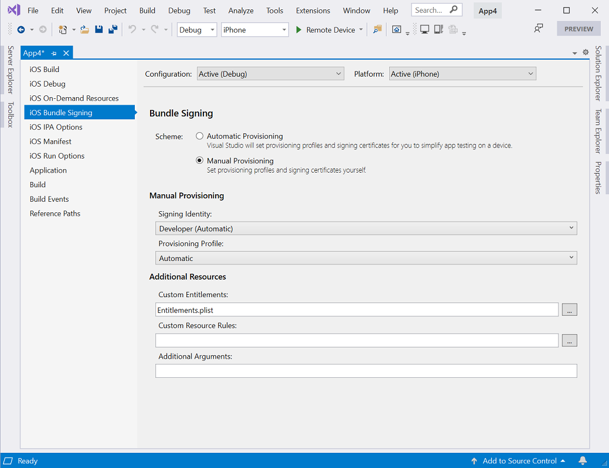

# Manual provisioning for Xamarin.iOS

_Once Xamarin.iOS has been successfully installed, the next step in iOS development is to provision your iOS device. This guide explores using manual provisioning to set up development certificates and profiles._

> [!NOTE]
> The instructions on this page are relevant for developers who have
> paid access to the Apple Developer Program. If you have a free account,
> please take a look at the [Free provisioning](~/ios/get-started/installation/device-provisioning/free-provisioning.md)
> guide for more information about on-device testing.

## Create a development certificate

The first step in setting up a development device is to create a signing certificate. A signing certificate consists of two things:

- A Development Certificate
- A private key

Development certificates and associated [keys](#understanding-certificate-key-pairs) are critical for an iOS developer: they establish your identity with Apple and associate you with a given device and profile for development, akin to putting your digital signature on your applications. Apple checks for certificates to control access to the devices you are allowed to deploy.

Development teams, certificates, and profiles can be managed by accessing the [Certificates, Identifiers & Profiles](https://developer.apple.com/account/resources/certificates/list) (login required) section of Apple's Member Center. Apple requires you to have a signing identity to build your code for device or simulator.  

> [!IMPORTANT]
> It is important to note that you can only have two iOS Development certificates at any one time. If you need to create any more, you will need to revoke an existing one. Any machine using a revoked certificate will not be able to sign their app.

Before starting the manual provisioning process, you should ensure that you have an Apple developer account added in Visual Studio, as described in the [Apple Account Management](~/cross-platform/macios/apple-account-management.md) guide. Once you have added your Apple developer account, do the following to generate a signing certificate:

1. Go to Apple developer accounts window in Visual Studio.
    1. Mac: **Visual Studio > Preferences > Apple Developer Account**
    2. Windows: **Tools > Options > Xamarin > Apple Accounts**

2. Select a team and click **View Details…**
3. Click **Create Certificate** and select **Apple Development** or **iOS Development**. If you have the correct permissions a new signing identity will appear after a few seconds.

### Understanding certificate key pairs

The Developer Profile contains certificates, their associated keys, and any provisioning profiles associated with the account. There are actually two versions of a Developer Profile — one is on the Developer Portal, and the other lives on a local Mac. The difference between the two is the type of keys they contain: _the Profile on the Portal houses all the public keys associated with your certificates, while the copy on your local Mac contains all the private keys_. For the certificates to be valid, the key pairs must match.

> [!WARNING]
> Losing the certificate and associated keys can be incredibly disruptive, as it will require revoking existing certificates and re-provisioning any associated devices, including those registered for ad-hoc deployment. After successfully setting up  Development Certificates, export a backup copy and store them in a safe place. For more information on how to do this, refer to the Exporting and Importing Certificates and Profiles section of the [Maintaining Certificates](https://developer.apple.com/library/ios/documentation/IDEs/Conceptual/AppDistributionGuide/MaintainingCertificates/MaintainingCertificates.html) guide in Apple's docs.

## Provision an iOS device for development

Now that you've established your identity with Apple and have a development certificate, you must set up a provisioning profile and the required entities so it is possible to deploy an app to an Apple device. The device must be running a version of iOS that is supported by Xcode — it may be necessary to update the device, Xcode or both.

## Add a device

When creating a provisioning profile for development, we must state which devices can run the application. To enable this, up to 100 devices per calendar year can be added to our Developer Portal, and from here we can select the devices to be added to a particular provisioning profile. Follow the steps below on your Mac to add a device to the Developer Portal

1. Connect the device to be provisioned to the Mac with its supplied USB cable.
2. Open Xcode, and go to **Window > Devices and Simulators**.
3. Under the **Devices** tab, select the device from the menu on the left side.
4. Highlight the **Identifier** string and copy it to the clipboard:

   

5. In a web browser, go to the [Devices section in the developer portal](https://developer.apple.com/account/resources/devices/list) and click the **+** button:

   

6. Set the correct **Platform** and provide a name for the new device. Paste the identifier copied earlier into the **Device ID** field:

    

7. Click **Continue**.
8. Review the information, then click **Register**.

Repeat the above steps for any iOS device that will be used to test or debug a Xamarin.iOS application.

## Create a development provisioning profile

After adding the device to the developer portal, it is necessary to create a provisioning profile and add the device to it. 

Before creating a provisioning profile, an *App ID* must be made. An App ID is a reverse-DNS style string that uniquely identifies an application. The steps below will demonstrate how to create a **Wildcard App ID**, which can be used to build and install most applications. **Explicit App IDs** only allow the installation of one application (with the matching bundle ID), and are generally used for certain iOS features such as Apple Pay and HealthKit. For  information on creating Explicit App IDs, refer to the [Working with Capabilities](~/ios/deploy-test/provisioning/capabilities/index.md) guide.

### New wildcard App ID

1. Go to the [Identifiers section in the developer portal](https://developer.apple.com/account/resources/identifiers/list) and click the **+** button.
2. Select **App IDs** and click **Continue**.
3. Provide a **Description**. Then set **Bundle ID** to **Wildcard** and enter an ID in the format `com.[DomainName].*`:

   

4. Click **Continue**.
5. Review the information, then click **Register**.

### New provisioning profile

Once the App ID has been created, the provisioning profile can be created. This provisioning profile contains information on *what* app (or apps, if it's a wildcard app ID) this profile relates to, *who* can use the profile (depending on what developer certificates are added), and *what* devices can install the app.

To manually create a provisioning profile for development, do the following:

1. Go to the [Profiles section in the developer portal](https://developer.apple.com/account/resources/profiles/list) and click the **+** button.

2. Under **Development**, select **iOS App Development** and click **Continue**.

3. Select the App ID to use from the dropdown menu then click **Continue**.

4. Select the Certificate(s) to include in the provisioning profile then click **Continue**.

5. Select all the devices that the app will be installed on then click **Continue**.

6. Provide **Provisioning Profile Name** then click **Generate**.

7. You can optionally click **Download** on the next page to download the provisioning profile onto the Mac.

## Download provisioning profiles in Visual Studio

After creating a new provisioning profile in the Apple Developer Portal, use Visual Studio to download it so it is available for bundle signing in your app.

1. Go to Apple developer accounts window in Visual Studio.
    1. Mac: **Visual Studio > Preferences > Apple Developer Account**
    2. Windows: **Tools > Options > Xamarin > Apple Accounts**

2. Select the team and click **View Details…**
3. Verify that the new profile appears in the **Provisioning Profiles** list. You may need to restart Visual Studio to refresh the list. 
4. Click **Download All Profiles**.

The new provisioning profile will now be available in Visual Studio and ready to use.

## Deploy to a device

At this point provisioning should be complete, and the app is ready to be deployed to the device. To do this, follow these steps:

# [Visual Studio for Mac](#tab/macos)

1. Connect your device to the Mac.
2. Open **Info.plist** and make sure the **Bundle Identifier** matches the App ID created earlier (unless the App ID is a wildcard).
3. In the **Signing** section, select **Manual Provisioning** as the **Scheme**:

    

4. Click **Bundle Signing Options...**
5. Make sure the build configuration is set to **Debug|iPhone**. Open both the **Signing Identity** and **Provisioning Profile** dropdown menus to verify that the correct certificates and provisioning profiles are listed: 

   

6. Select a specific identity and profile to use, or leave it as **Automatic**. When set to **Automatic**, Visual Studio for Mac will select the identity and profile based on the **Bundle Identifier** in **Info.plist**. 
7. Click **OK**.
8. Click **Run** to deploy the app to your device.

# [Visual Studio](#tab/windows)

1. Connect your device to the Mac build host.
2. Open **Info.plist** and make sure the **Bundle Identifier** matches the App ID created earlier (unless the App ID is a wildcard).
3. In the **Solution Explorer**, right-click the iOS project name, select **Properties** and navigate to the **iOS Bundle Signing** tab.
4. Make sure the build configuration is set to **Debug|iPhone**. Under **Bundle Signing**, select **Manual Provisioning** as the **Scheme**:

    

5. Open both the **Signing Identity** and **Provisioning Profile** dropdown menus to verify that the correct certificates and provisioning profiles are listed.
6. Select a specific identity and profile to use, or leave it as **Automatic**. When set to **Automatic**, Visual Studio will select the identity and profile based on the **Bundle Identifier** in **Info.plist**. 
7. Click **Run** to deploy the app to your device.

-----

## Provisioning for application services

Apple provides a selection of special Application Services, also called capabilities, that can be activated for a Xamarin.iOS application. These Application Services must be configured on both the iOS Provisioning Portal when the **App ID** is created and in the **Entitlements.plist** file that is part of the Xamarin.iOS application's project. For information on adding Application Services to your app, refer to the [Introduction to Capabilities](~/ios/deploy-test/provisioning/capabilities/index.md) guide and the [Working with Entitlements](~/ios/deploy-test/provisioning/entitlements.md) guide.

- Create an App ID with the required app services.
- Create a new [provisioning profile](#provisioningprofile) that contains this App ID.
- Set Entitlements in the Xamarin.iOS Project

## Related links

- [Free Provisioning](~/ios/get-started/installation/device-provisioning/free-provisioning.md)
- [App Distribution](~/ios/deploy-test/app-distribution/index.md)
- [Troubleshooting](~/ios/deploy-test/troubleshooting.md)
- [Apple - App Distribution Guide](https://developer.apple.com/library/ios/documentation/IDEs/Conceptual/AppDistributionGuide/Introduction/Introduction.html)
