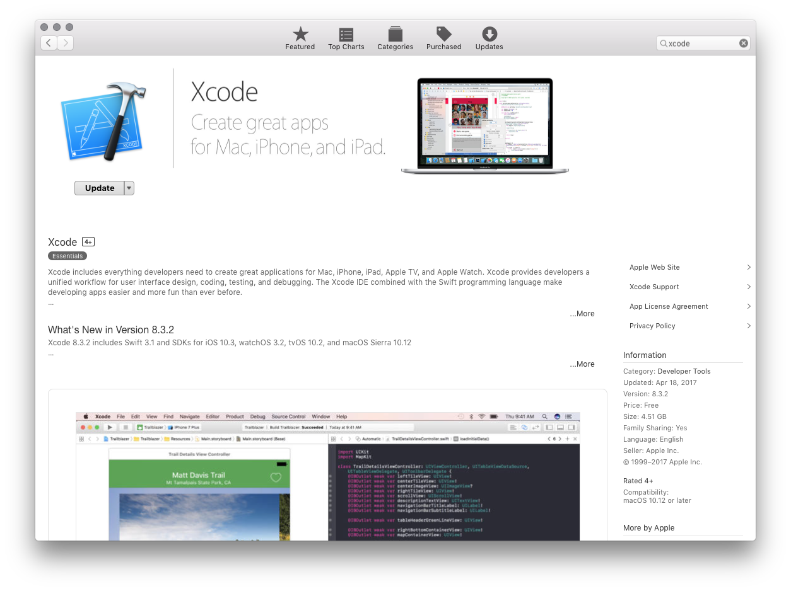

# Xamarin.iOS Installation

## Required Components

To build for Xamarin.iOS, the following are required:

- the latest iOS SDK
- the latest version of Xcode
- macOS High Sierra (10.13) and above

The latest version of Xcode can be downloaded from the [iOS Developer Center](https://developer.apple.com/devcenter/ios/index.action#downloads) (login required), or via the Mac App Store:

## Mac Installation

For instructions on installing Xamarin.iOS on a Mac, visit the [Mac Installation](https://docs.microsoft.com/visualstudio/mac/installation) guide.

## Windows Installation

For instructions on installing Xamarin.iOS on a Windows machine, visit the [Windows Installation](~/ios/get-started/installation/windows/index.md) guide.

## Development and Device Provisioning

Once you have successfully installed Xamarin.iOS, learn how to provision your iOS device so that you can develop and test a Xamarin.iOS application on device.

* [Set Up Device for Development](device-provisioning/index.md)
* [Free Provisioning](~/ios/get-started/installation/device-provisioning/free-provisioning.md)
