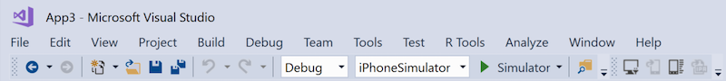

# Configuring Visual Studio for iOS development

_This article describes various Xamarin.iOS configuration options for Visual
Studio._

## Using matching Xamarin.iOS versions

Visual Studio 2019 or Visual Studio 2017 must use the same version of Xamarin.iOS that is installed
on the Mac build host. To make sure this is true:

- If you use Visual Studio 2019 or Visual Studio 2017, select the **Stable** updates channel in Visual Studio for Mac.

- If you use Visual Studio 2019 Preview, select the **Alpha** updates channel in Visual Studio for Mac.

> [!NOTE]
> Starting with [Visual Studio 2017 version
> 15.6](/visualstudio/releasenotes/vs2017-relnotes#automatic-macos-provisioning),
> Visual Studio 2017 automatically detects if the Mac build host is using the
> same version of Xamarin.iOS as Windows. If there is a version mismatch,
> Visual Studio 2017 offers to remotely install the correct version on the Mac
> build host. For more information, take a look at the [Automatic Mac
> provisioning](~/ios/get-started/installation/windows/connecting-to-mac/index.md#automatic-mac-provisioning)
> section of the [Pair to
> Mac](~/ios/get-started/installation/windows/connecting-to-mac/index.md)
> guide.

## iOS toolbar

When an iOS project is open in Visual Studio 2019 or Visual Studio 2017, the iOS toolbar should be
visible.  By default, it contains four buttons that are useful for
Xamarin.iOS development:

- **Pair to Mac** – Opens the Pair to Mac dialog. Enabled when an iOS
  project is open in Visual Studio 2019 or Visual Studio 2017.
- **Show iOS Simulator** – On the Mac build host, brings the iOS Simulator
  to the front. Enabled when an iOS project is open in Visual Studio 2019 or Visual Studio 2017.
- **Device Log** – Brings up a window that allows you to inspect device 
  logs. Enabled when an iOS project is open in Visual Studio 2019 or Visual Studio 2017.
- **Show IPA File on Build Server** – Opens a window on the Mac build
  host, showing the location of the .ipa file for the app. Enabled after
  completing a build for which an .ipa was created.

If this toolbar does not appear, open the **View** menu in Visual Studio 2019 or Visual Studio 2017,
and choose **Toolbars > iOS**:

## Solution Platforms drop-down menu

The **Solution Platforms** drop-down menu allows you to choose whether
your next build will target a physical device or a simulator.

To make sure this drop-down menu is visible on the Standard toolbar:

- In Visual Studio 2019 or Visual Studio 2017, click the down arrow at the right edge of the Standard toolbar.
- Choose **Add or Remove Buttons** 
- Make sure the **Solution Platforms** item is checked:

With an iOS project open, the **Standard** and **iOS** toolbars should now 
resemble the following screenshot:

