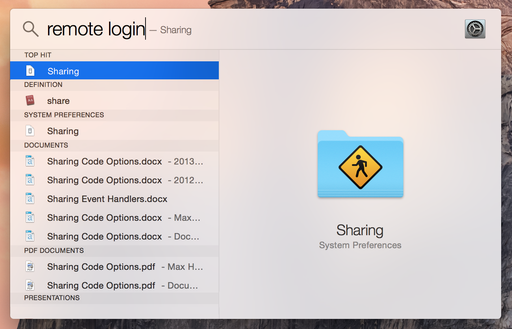
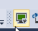
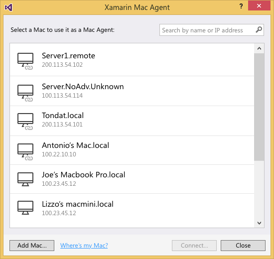
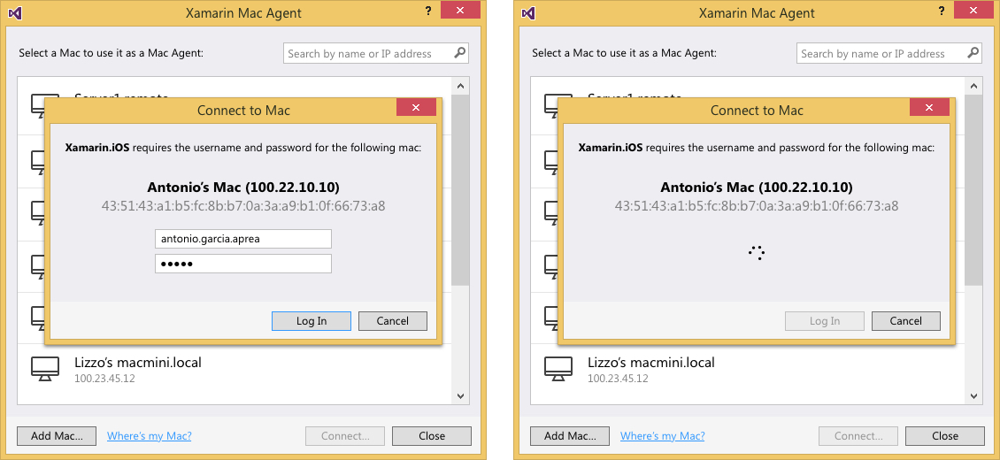
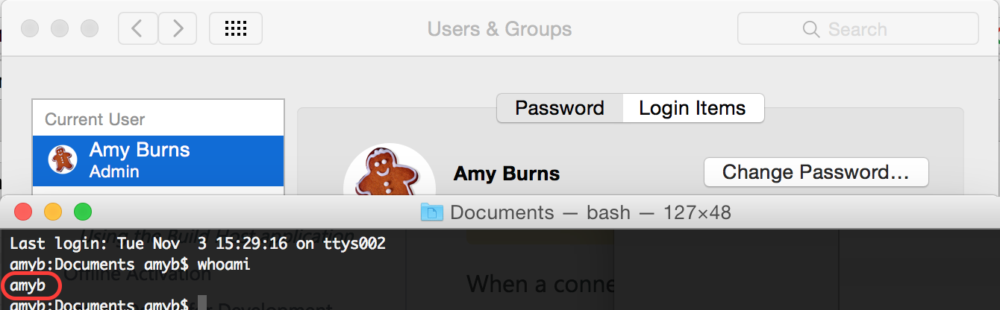
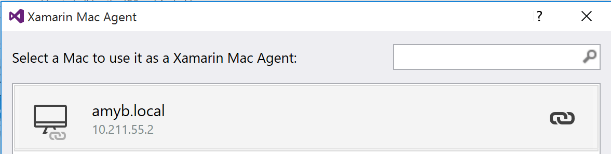
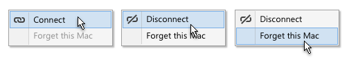
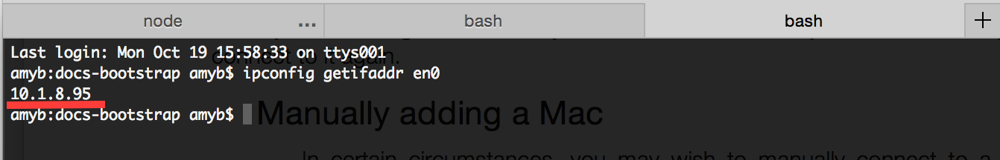
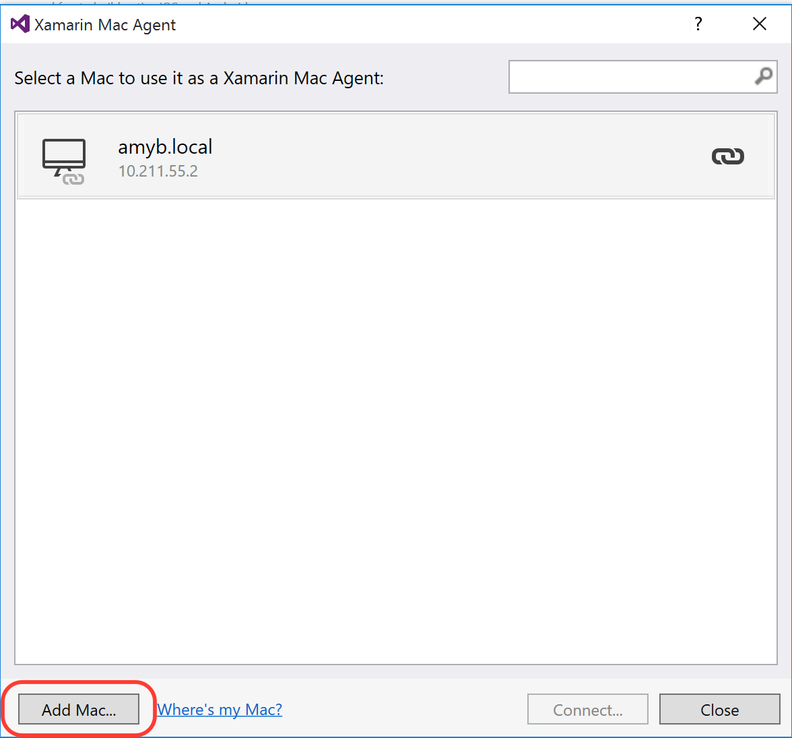
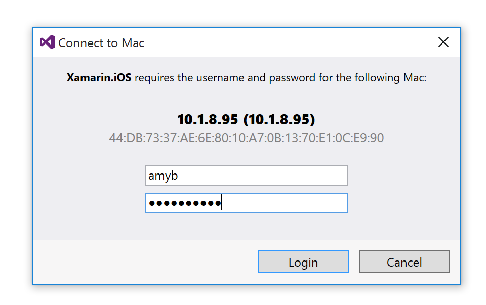

# Connecting to the Mac

_Xamarin.iOS for Visual Studio lets developers create, build, and debug iOS applications on a Windows computer using the Visual Studio IDE. This guide explains the features provided Xamarin.iOS for Visual Studio and how the connection to the Mac build host is made._

Visual Studio connects to the Mac over SSH, which provides several benefits,
including:

- Visual Studio can launch and control the build agent directly. There is no
  longer a user-visible application that requires a manual start and stop.

- The new Connection Manager in Visual Studio will discover, authenticate,
  and remember the Mac build host.

- Since all communication is tunneled securely via SSH, only a single port
  connection to port 22 is required.

- Visual Studio is notified of changes as soon as they happen. For example,
  when an iOS device is plugged in the toolbar will update instantly.

- Multiple instances of Visual Studio can connect simultaneously.

- The connection will not intrude on development. It will only prompt for a
  connection to the Mac when performing an operation for which the Mac is
  required, such as debugging or using the iOS Designer.

The connection to the Mac is made up of multiple processes for the different
parts of its functionality – for example, the iOS designer agent, and the
build agent – that are controlled by a broker. This broker is controlled and
updated by Visual Studio, and will restart any of the independent processes
automatically if they were to crash.

The diagram below shows a simple overview of the Xamarin.iOS development
workflow:

[](images/xma2.png#lightbox)

> [!IMPORTANT]
>  Visual Studio actually launches a separate MSBuild process to build the
> projects. This process creates a new connection to the Mac, meaning there
> are actually two SSH connections from Windows to Mac when Visual Studio
> builds. Building from the [command-line](#commandline) only creates the
> one MSBuild process. For the simplicity of this diagram, all the
> connections are simply represented by one arrow.

## Requirements

Xamarin.iOS for Visual Studio accomplishes an amazing feat: it lets
developers create, build, and debug iOS applications on a Windows computer
using the Visual Studio IDE. It cannot do this alone – iOS applications
cannot be created without Apple’s compiler, and they cannot be deployed
without Apple’s certificates and code-signing tools. This means that your
Xamarin.iOS for Visual Studio installation requires a connection to a
networked Mac OS X computer (which is refered to as the *host* or *build
host*) to perform these tasks for you. Once configured, Xamarin’s tools will
make the process as seamless as possible.

### System Requirements

The system requirements can be found in the [Installing Xamarin.iOS on Windows](~/ios/get-started/installation/windows/index.md#system-requirements) guide


#### Compatibility

> [!IMPORTANT]
>  The Windows machine must be using the same version of Xamarin.iOS as
>    the Mac to which it is connected. To ensure this is true:                                                    
>                                                                                                                 
> - **Visual Studio 2015 and earlier**: Ensure that you are on the same
>   [updates channel](https://developer.xamarin.com/recipes/cross-platform/ide/change_updates_channel/)
>   as Visual Studio for Mac.
>                                                                                                                 
> - **Visual Studio 2017, Release Version**: Ensure that you are on the
>   **Stable** channel of Visual Studio for Mac.
>                                                                                                                 
> - **Visual Studio 2017, Preview Version**: Ensure that you are on the
>   **Alpha** channel of Visual Studio for Mac. Visual Studio will not check
>   that the Xamarin.iOS SDK and Xcode exist and have compatible versions.
>   That will be checked by the build agent, resulting in build errors; and
>   by the iOS Designer agent, resulting in designer errors.

### Connecting to the Mac

#### Mac Setup

To set up the Mac host, you must enable communication between the Xamarin
extension for Visual Studio and your Mac. To do this, allow **Remote Login**
on your Mac by following the steps below:

1. Open *Spotlight* (**⌘-Space**) and search for *Remote Login* and then
   select the *Sharing* result. This will open *System Preferences* at the
   *Sharing* panel:

   [](images/spotlight.png#lightbox)

2. Tick the *Remote Login* option in the *Service* list on the left to allow
   Xamarin for Visual Studio to connect to the Mac:

   [](images/sharing.png#lightbox)

3. Make sure that *Remote Login* is set to allow access for *All* users, or
   that your Mac username or group is included in the list of allowed users
   in the list on the right.

In addition to this, if you have the OS X firewall set to block signed
applications by default, you may need to allow `mono-sgen` to receive
incoming connections. An alert dialog will appear to prompt you if this is
the case.

Providing there is a current, open session on your Mac, it should now be
discoverable by Visual Studio if it's on the same network.

Visual Studio will start and stop the agent on your Mac, so there is nothing
else that you, as a user, need to run.

### Windows Setup

Make sure to [install](~/ios/get-started/installation/windows/index.md)
Xamarin tools on your Windows machine.

### Connecting to the Mac build host

There are two ways to connect to the Mac build host:

On the iOS toolbar:

[](images/image1.png#lightbox)

Or by browsing to **Tools > Options** in Visual Studio, selecting 
**Xamarin > iOS Settings** and clicking the **Find Xamarin Mac Agent** 
button:

[](images/image2.png#lightbox)

Navigating either way will lead to the **Mac Agent** dialog, illustrated
below:

[](images/image3.png#lightbox)

This will display a list of all the machines that have either been
previously connected and are stored as known machines, or machines that are
available for *Remote Login*.

Select a Mac by double-clicking on it to connect to it. The first time that
you connect to a Mac, you will be prompted to enter your Mac user
credentials to allow the remote connection:

[](images/image4.png#lightbox)

The agent will use these credentials to create a new SSH connection to the
Mac. If it succeeds, an SSH key will be created, and will be
[registered](#commandline) in the `authorized_keys` file on that Mac. On
subsequent connections the agent will use the username and key file to
connect to the most recently connected known build host.

> [!NOTE]
>  **Note**: You must use the _username_ and not the _full name_ when
> entering your credentials.  You can find this out by using the `whoami`
> command in Terminal.  For example, from the screenshot below, the account
> name will be **amyb** and not **Amy Burns**:
>
> 

When a connection has been successfully made, it will display in the Host
Selection dialog with a **connected** icon next to it, as illustrated below:

[](images/image6.png#lightbox)

There can only be one connected Mac at any one time.

Each machine in the list, whether connected or otherwise, will display a
context menu on right-click, allowing you to **Connect**, **Disconnect**, or
**Forget the Mac** as needed:

[](images/image7.png#lightbox)

If you choose to **Forget this Mac**, you will need to re-enter your
credentials to connect to it again.

<a name="manual-add"/>

### Manually adding a Mac

In certain circumstances, you may wish to manually add a Mac if you cannot
see its mDNS name listed in the Host Selection dialog. To do this, follow
the steps below:

1. Locate your Mac’s IP address by either browsing to the **System
   Preferences > Sharing > Remote Login** on your Mac:

   [](images/image8.png#lightbox)

   Or, if you prefer to use the command line you can find out your IP
   address by entering `ipconfig getifaddr en0` into Terminal (Note that
   depending on the type of connection the variable might be `en1`, `en2`
   etc.):

   [](images/image9.png#lightbox)

2. Return to Visual Studio and in the Host Selection dialog, select **Add Mac...**:

   [](images/image10.png#lightbox)

3. Enter the IP address of you Mac into the Add Mac dialog and click **Add**:

   [](images/image11.png#lightbox)

4. Finally, enter the username (not full name) of your Mac admin account and
   the corresponding password:

   [](images/image12.png#lightbox)

Once you click **Login**, Visual Studio will log into the Mac machine using
SSH and will add this Mac as a known machine.

<a name="commandline"/>

### Command Line Support

The agent also supports building a Xamarin.iOS configuration from the
command line.  To use it, you will need to pass the following required
parameters to MSBuild:

- `ServerAddress` – The IP address of the Mac server.

- `ServerUser` – The Username (not Full Name) to be used to log in to the
   Mac Server.

- `ServerPassword` – The Password used to log in to the Mac host (optional).

The `ServerPassword` parameter is not required.

Instead, the first time a password has been passed, either by using Visual
Studio or the Command Line, for that particular Windows, Mac, and user
configuration a key pair will be generated and stored on the Windows machine
for future use. It will be located in
**%localappdata%\Xamarin\MonoTouch\id_rsa**.  If you do not pass the
`ServerPassword` parameter, the `id_rsa` keyfile will be used for
authenticating.

An example command to connect to Mac 10.211.55.2 using **xamUser** account
with password **mypassword** is shown below:

```bash
C:\samples\App1>msbuild App1.sln /p:ServerAddress=10.211.55.2 /p:ServerUser=xamUser /p:Platform=iPhoneSimulator /p:ServerPassword=mypassword
```

### Summary

This article explored connection between Visual Studio and the iOS build and
designer tools on the Mac, allowing you to build Xamarin.iOS apps using
Visual Studio.

### Related Links

- [Installation](~/ios/get-started/installation/windows/index.md)
- [Connection Troubleshooting](~/ios/get-started/installation/windows/connecting-to-mac/troubleshooting.md)
- [Connecting a Mac to your Visual Studio environment with XMA (video)](https://university.xamarin.com/lightninglectures/xamarin-mac-agent)
