# Pair to Mac for Xamarin.iOS development

_This guide describes how to use Pair to Mac to connect Visual Studio 2019
to a Mac build host. The same instructions apply to Visual Studio 2017._

## Overview

Building native iOS applications requires access to Apple's build tools,
which only run on a Mac. Because of this, Visual Studio 2019 must connect to
a network-accessible Mac to build Xamarin.iOS applications.

Visual Studio 2019's Pair to Mac feature discovers, connects to,
authenticates with, and remembers Mac build hosts so that Windows-based
iOS developers can work productively.

Pair to Mac enables the following development workflow:

- Developers can write Xamarin.iOS code in Visual Studio 2019.

- Visual Studio 2019 opens a network connection to a Mac build host and
  uses the build tools on that machine to compile and sign the iOS app.

- There is no need to run a separate application on the Mac – Visual
  Studio 2019 invokes Mac builds securely over SSH.

- Visual Studio 2019 is notified of changes as soon as they happen. For
  example, when an iOS device is plugged in to the Mac or becomes available
  on the network, the iOS Toolbar updates instantly.

- Multiple instances of Visual Studio 2019 can connect to the Mac
  simultaneously.

- It's possible to use the Windows command-line to build iOS applications.

> [!NOTE]
>
> Before following the instructions in this guide, complete the following steps:
>
> - On a Windows machine, [install Visual Studio 2019](~/get-started/installation/windows.md)
> - On a Mac, [install Xcode](https://itunes.apple.com/us/app/xcode/id497799835?mt=12) and [Visual Studio for Mac](/visualstudio/mac/installation)
>   - _You must manually open Xcode after installing_ so that it can add any additional components.
>
> If you would prefer not to install Visual Studio for Mac, Visual Studio 2019
> can automatically configure the Mac build host with Xamarin.iOS and Mono.
> You must still install and run Xcode.
> For more information, see [Automatic Mac provisioning](#automatic-mac-provisioning).

## Enable remote login on the Mac

To set up the Mac build host, first enable remote login:

1. On the Mac, open System Preferences and go to the **Sharing** pane.

2. Check **Remote Login** in the **Service** list.

    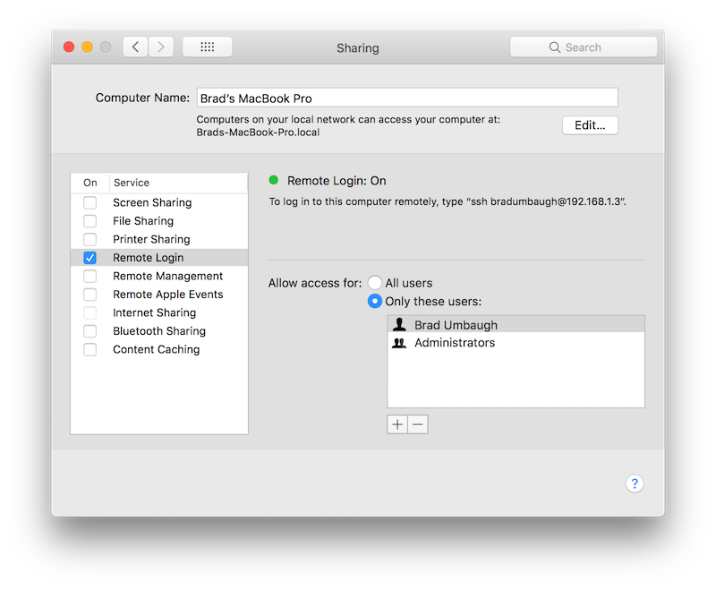

    Make sure that it is configured to allow access for **All users**, or
    that your Mac username or group is included in the list of allowed
    users.

3. If prompted, configure the macOS firewall.

    If you have set the macOS firewall to block incoming connections, you
    may need to allow `mono-sgen` to receive incoming connections. An alert
    appears to prompt you if this is the case.

4. If it is on the same network as the Windows machine, the Mac should
   now be discoverable by Visual Studio 2019. If the Mac is still not
   discoverable, try [manually adding a Mac](#manually-add-a-mac) or take
   a look at the [troubleshooting guide](~/ios/get-started/installation/windows/connecting-to-mac/troubleshooting.md).

## Connect to the Mac from Visual Studio 2019

Now that remote login is enabled, connect Visual Studio 2019 to the Mac.

1. In Visual Studio 2019, open an existing iOS project or create a new one
   by choosing **File > New > Project** and then selecting an iOS project
   template.

2. Open the **Pair to Mac** dialog.

    - Use the **Pair to Mac** button iOS toolbar:

      

    - Or, select **Tools > iOS > Pair to Mac**.

    - The **Pair to Mac** dialog displays a list of all previously-connected
      and currently-available Mac build hosts:

      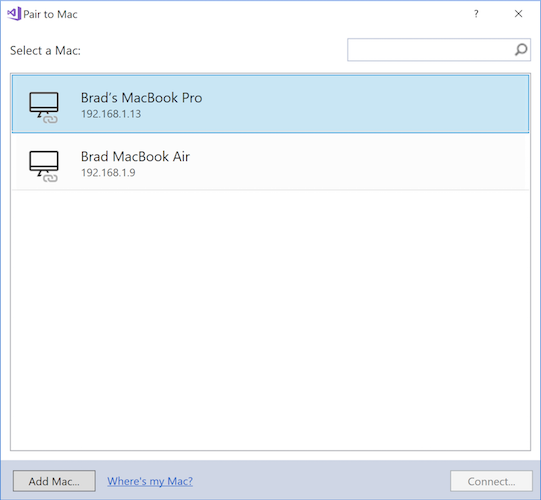

3. Select a Mac in the list. Click **Connect**.

4. Enter your username and password.

    - The first time you connect to any particular Mac, you are
      prompted to enter your username and password for that machine:

      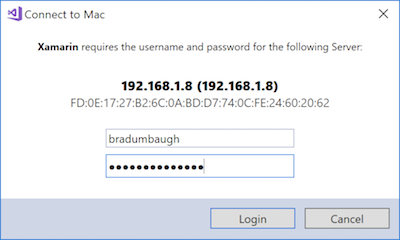

      > [!TIP]
      > When logging in, use your system username rather than full name.

    - Pair to Mac uses these credentials to create a new SSH connection
      to the Mac. If it succeeds, a key is added to the **authorized_keys**
      file on the Mac. Subsequent connections to the same Mac will login
      automatically.

5. Pair to Mac automatically configures the Mac.

    [Starting with Visual Studio 2019 version
    15.6](/visualstudio/releasenotes/vs2017-relnotes#automatic-macos-provisioning),
    Visual Studio 2019 installs or updates Mono and Xamarin.iOS on a
    connected Mac build host as needed (note that Xcode must still be
    installed manually). See [Automatic Mac
    provisioning](#automatic-mac-provisioning) for more details.

6. Look for the connection status icon.

    - When Visual Studio 2019 is connected to a Mac, that Mac's item
      in the **Pair to Mac** dialog displays an icon indicating that
      it is currently connected:

      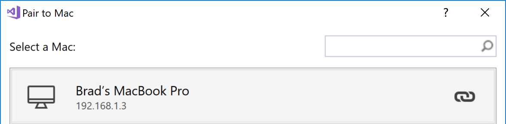

      There can be only one connected Mac at a time.

      > [!TIP]
      > Right-clicking any Mac in the **Pair to Mac** list brings up a context
      > menu that allows you to **Connect...**, **Forget this Mac**, or
      > **Disconnect**:
      >
      > 
      >
      > If you choose **Forget this Mac**, your credentials for the selected
      > Mac will be forgotten. To reconnect to that Mac, you will need to re-enter
      > your username and password.

If you have successfully paired to a Mac build host, you are ready to build
Xamarin.iOS apps in Visual Studio 2019. Take a look at the
[Introduction to Xamarin.iOS for Visual Studio](~/ios/get-started/installation/windows/introduction-to-xamarin-ios-for-visual-studio.md)
guide.

If you have not been able to pair a Mac, try [manually adding a
Mac](#manually-add-a-mac) or take a look at the [troubleshooting
guide](~/ios/get-started/installation/windows/connecting-to-mac/troubleshooting.md).

## Manually add a Mac

If you do not see a particular Mac listed in the **Pair to Mac** dialog,
add it manually:

1. Locate your Mac’s IP address.

    - Open **System Preferences > Sharing > Remote Login** on your Mac:

      [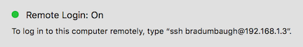](images/sharing.png#lightbox)

    - Alternatively, use the command line. In Terminal, issue this command:

      ```bash
      $ ipconfig getifaddr en0
      196.168.1.8
      ```

      Depending on your network configuration, you may need to use an
      interface name other than `en0`. For example: `en1`, `en2`, etc.

2. In Visual Studio 2019's **Pair to Mac** dialog, select **Add Mac...**:

    [](images/addtomac-large.png#lightbox)

3. Enter the Mac's IP address and click **Add**:

    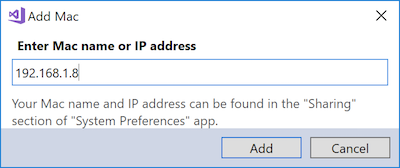

4. Enter your username and password for the Mac:

    

   > [!TIP]
   > When logging in, use your system username rather than full name.

5. Click **Login** to connect Visual Studio 2019 to the Mac over SSH and add
   it to the list of known machines.

## Automatic Mac provisioning

Starting with [Visual Studio 2019 version 15.6](/visualstudio/releasenotes/vs2017-relnotes#automatic-macos-provisioning),
Pair to Mac automatically provisions a Mac with software necessary for
building Xamarin.iOS applications: Mono, Xamarin.iOS (the software
framework, not the Visual Studio for Mac IDE), and various Xcode-related
tools (but not Xcode itself).

> [!IMPORTANT]
>
> - Pair to Mac cannot install Xcode; you must manually install it on the
>   Mac build host. It is required for Xamarin.iOS development.
> - Automatic Mac provisioning requires that remote login is
>   enabled on the Mac, and the Mac must be network-accessible to the Windows
>   machine. See [Enabling remote login on the Mac](#enable-remote-login-on-the-mac)
>   for more details.
> - Automatic Mac provisioning requires 3GB of free space on the Mac to install Xamarin.iOS.

Pair to Mac performs necessary software installations/updates when Visual
Studio 2019 is [connecting to the
Mac](#connect-to-the-mac-from-visual-studio-2019).

### Mono

Pair to Mac will check to make sure that Mono is installed. If it is not
installed, Pair to Mac will download and install the latest stable version
of Mono on the Mac.

Progress is indicated by various prompts, as shown by the following
screenshots (click to zoom):

|Mono|Install Check|Downloading|Installing
|---|---|---|---|
||[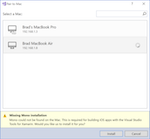](images/mono-missing-large.png#lightbox)|[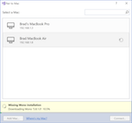](images/mono-downloading-large.png#lightbox)|[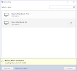](images/mono-installing-large.png#lightbox)|

### Xamarin.iOS

Pair to Mac upgrades Xamarin.iOS on the Mac to match the version
installed on the Windows machine.

> [!IMPORTANT]
> Pair to Mac will not downgrade Xamarin.iOS on the Mac from alpha/beta
> to stable. If you have Visual Studio for Mac installed, set your
> [release channel](/visualstudio/mac/update) as
> follows:
>
> - If you use Visual Studio 2019, select the **Stable** updates channel in
>   Visual Studio for Mac.
> - If you use Visual Studio 2019 Preview, select the **Alpha** updates
>   channel in Visual Studio for Mac.

Progress is indicated by various prompts, as shown by the following
screenshots (click to zoom):

|Xamarin.iOS|Install Check|Downloading|Installing
|---|---|---|---|
||[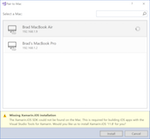](images/xamios-missing-large.png#lightbox)|[](images/xamios-downloading-large.png#lightbox)|[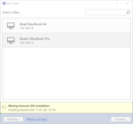](images/xamios-installing-large.png#lightbox)|

### Xcode tools and license

Pair to Mac will also check to determine whether Xcode has been installed
and its license accepted. While Pair to Mac does not install Xcode, it
does prompt for license acceptance, as shown in the following screenshots
(click to zoom):

|Xcode|Install Check|License Acceptance|
|---|---|---|
||[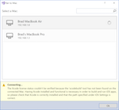](images/xcode-missing-large.png#lightbox)|[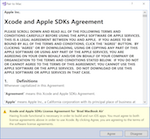](images/xcode-license-large.png#lightbox)|

Additionally, Pair to Mac will install or update various packages
distributed with Xcode. For example:

- **MobileDeviceDevelopment.pkg**
- **XcodeExtensionSupport.pkg**
- **MobileDevice.pkg**
- **XcodeSystemResources.pkg**

The installation of these packages happens quickly and without a prompt.

> [!NOTE]
> These tools are distinct from the Xcode Command Line Tools, which
> as of macOS 10.9 are
> [installed with Xcode](https://developer.apple.com/library/content/technotes/tn2339/_index.html).

### Troubleshooting automatic Mac provisioning

If you encounter any trouble using automatic Mac provisioning, take a look
at the Visual Studio 2019 IDE logs, stored in
**%LOCALAPPDATA%\Xamarin\Logs\16.0**. These logs may contain error messages
to help you better diagnose the failure or get support.

## Build iOS apps from the Windows command-line

Pair to Mac supports building Xamarin.iOS applications from the command
line. For example:

```bash
C:\samples\App1>msbuild App1.sln /p:ServerAddress=10.211.55.2 /p:ServerUser=xamUser /p:Platform=iPhoneSimulator /p:ServerPassword=mypassword
```

The parameters passed to `msbuild` in the above example are:

- `ServerAddress` – The IP address of the Mac build host.
- `ServerUser` – The username to use when logging in to the Mac build host.
  Use your system username rather than your full name.
- `ServerPassword` – The password to use when logging in to the Mac build host.

> [!NOTE]
> Visual Studio 2019 stores `msbuild` in the following directory:
> **C:\Program Files (x86)\Microsoft Visual Studio\2019\\&lt;Version&gt;\MSBuild\Current\Bin**

The first time Pair to Mac logs in to a particular Mac build host from
either Visual Studio 2019 or the command-line, it sets up SSH keys. With these
keys, future logins will not require a username or password. Newly
created keys are stored in **%LOCALAPPDATA%\Xamarin\MonoTouch**.

If the `ServerPassword` parameter is omitted from a command-line build
invocation, Pair to Mac attempts to log in to the Mac build host
using the saved SSH keys.

## Summary

This article described how to use Pair to Mac to connect Visual Studio 2019 to a
Mac build host, enabling Visual Studio 2019 developers to build native iOS
applications with Xamarin.iOS.

## Next steps

- [Connection Troubleshooting](~/ios/get-started/installation/windows/connecting-to-mac/troubleshooting.md)
- [Xamarin Mac Build Agent video](https://www.youtube.com/watch?v=MBAPBtxkjFQ)
- [Introduction to Xamarin.iOS for Visual Studio](~/ios/get-started/installation/windows/introduction-to-xamarin-ios-for-visual-studio.md)
- [Remoted iOS Simulator for Windows](~/tools/ios-simulator/index.md)
- [Wireless Deployment](~/ios/deploy-test/wireless-deployment.md)