# Connection Troubleshooting for a Xamarin.iOS Build Host

_This guide provides troubleshooting steps for issues that may be encountered using the new connection manager, including connectivity and SSH issues._

## Log File Location

- **Mac** – `~/Library/Logs/Xamarin-[MAJOR.MINOR]`
- **Windows** – `%LOCALAPPDATA%\Xamarin\Logs`

The log files can be located by browsing to **Help &gt; Xamarin &gt; Zip Logs** in Visual Studio.

## Where's the Xamarin Build Host App?

The Xamarin Build Host from older versions of Xamarin.iOS is no longer required. Visual Studio now automatically deploys the agent over Remote Login and runs it in the background. There is no additional app that will run on either the Mac or Windows machines.

## Troubleshooting Remote Login

> [!IMPORTANT]
> These troubleshooting steps are primarily intended for problems that happen during the initial setup on a new system.  If you had previously been using the connection successfully in a particular environment and then the connection suddenly or intermittently stops working, you can (in most cases) skip straight to checking if any of the following helps: 
>
> - Kill the leftover processes as described below under [Errors due to existing Build Host Processes](#errors). 
> - Clear the agents as described under [Clearing the Broker, IDB, Build, and Designer Agents](#clearing), and then use a wired internet connection and connect directly via the IP address as described under [Couldn't connect to MacBuildHost.local. Please try again.](#tryagain).  
> If none of those options fix the issue, then please follow the instructions in [step 9](#stepnine) to file a new bug report.

1. Check that you have compatible Xamarin.iOS versions installed on your Mac. To do this with Visual Studio 2017 ensure that you are on the **Stable** distribution channel in Visual Studio for Mac. In Visual Studio 2015 and earlier make sure that you are on the same distribution channel on both IDEs.
    - In Visual Studio for Mac, go to **Visual Studio for Mac > Check for Updates...** to view or change the **Update channel**.
    - In Visual Studio 2015 and earlier, check the distribution channel under **Tools > Options > Xamarin > Other**.

2. Make sure that **Remote Login** is enabled on the Mac. Set access for **Only these users**, and make sure your Mac user is included in the list or group:

    [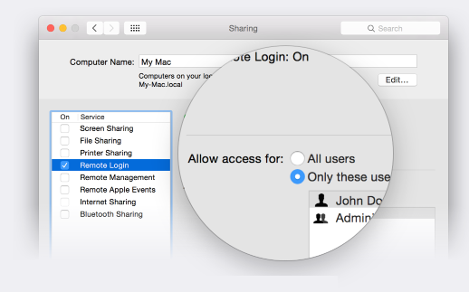](troubleshooting-images/troubleshooting-image1.png#lightbox)

3. Check that your firewall allows incoming connections through port 22 - the default for SSH:

    [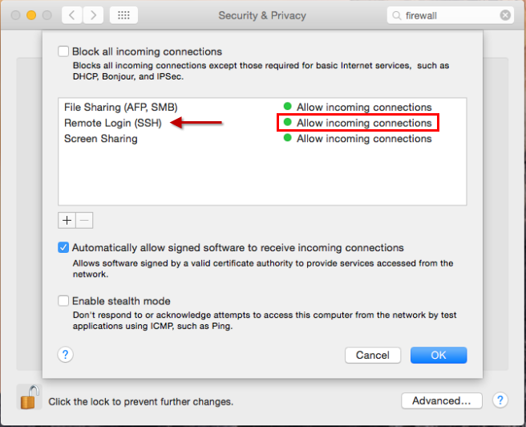](troubleshooting-images/troubleshooting-image2.png#lightbox)

    If you have disabled **Automatically allow signed software to receive incoming connections**, OS X will present a dialog during the pairing process asking to allow `mono-sgen` or `mono-sgen32` to receive incoming connections. Be sure to click **Allow** on this dialog:

    [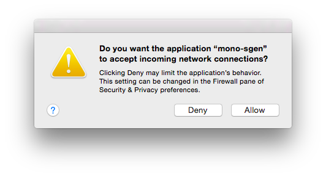](troubleshooting-images/troubleshooting-image4a.png#lightbox)

4. Confirm that you are logged in to the user account on that Mac and have an active GUI session.

5. Make sure you are connecting to the Mac with the _username_ rather than the _Full Name_. This avoids a known limitation for full names that include accented characters.

    You can find your _username_ by running the `whoami` command in **Terminal.app**.

    For example, from the screenshot below, the account name will be **amyb** and not **Amy Burns**:

    [](troubleshooting-images/troubleshooting-image5a.png#lightbox)

6. Check that the IP address you are using for the Mac is correct. You can find the IP address under **System Preferences > Sharing > Remote Login** on the Mac.

    [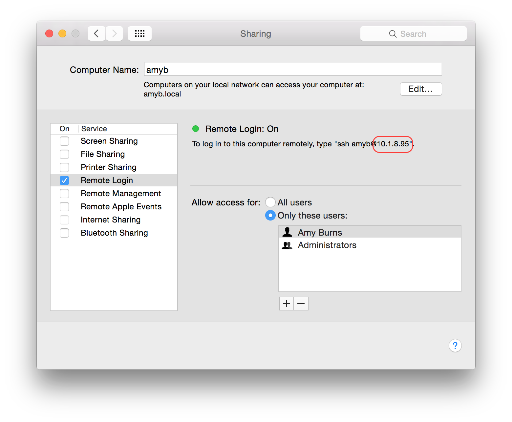](troubleshooting-images/troubleshooting-image17.png#lightbox)

7. Once you have confirmed the IP address of the Mac, try a `ping` to that address in `cmd.exe` on Windows:

    ```
    ping 10.1.8.95
    ```
    
    If the ping fails, then the Mac is not _routable_ from the Windows computer. That problem will need to be solved at the level of the local area network configuration between the 2 computers. Ensure that both machines are on the same Local Network.

8. Next, test if the `ssh` client from OpenSSH can connect successfully to the Mac from Windows. One way to install this program is to install [Git for Windows](https://git-for-windows.github.io/). You can then start a **Git Bash** command prompt and attempt to `ssh` in to the Mac with your username and IP address:

    ```bash
    ssh amyb@10.1.8.95
    ```

    <a name="stepnine"></a>

9. If **step 8 succeeds**, you can try running a simple command like `ls` over the connection:

    ```bash
    ssh amyb@10.1.8.95 'ls'
    ```
    
    This should list the contents of your home directory on the Mac. If the `ls` command works correctly but the Visual Studio connection still fails, you can check the [Known Issues and Limitations](#knownissues) section about complications specific to Xamarin. If none of those match your problem, please file a new bug report on Developer Community by going to **Help > Send Feedback > Report a problem** in Visual Studio and attach the logs described under [Check the Verbose Log Files](#verboselogs).

10. If **step 8 fails**, you can run the following command in Terminal on the Mac to see if the SSH server is accepting _any_ connections:

    ```bash
    ssh localhost
    ```
    
11. If step 8 fails but **step 10 succeeds**, then the problem is most likely that port 22 on the Mac build host is not accessible from Windows due to the network configuration. Possible configuration issues include:

    - The OS X firewall settings are disallowing the connection. Be sure to double-check step 3.

        Occasionally the per-app configuration for the OS X firewall can also end up in an invalid state where the settings shown in System Preferences do not reflect the actual behavior. Deleting the configuration file (**/Library/Preferences/com.apple.alf.plist**) and rebooting the computer can help restore the default behavior. One way to delete the file is to enter **/Library/Preferences** under **Go &gt; Go to Folder** in Finder, and then move the **com.apple.alf.plist** file to the Trash.

    - The firewall settings of one of the routers between the Mac and the Windows computer is blocking the connection.

    - Windows itself is disallowing outbound connections to remote port 22. This would be unusual. It is possible to configure the Windows Firewall to disallow outbound connections, but the default setting is to allow all outbound connections.

    - The Mac build host is disallowing access to port 22 from all external hosts via a `pfctl` rule. This is unlikely unless you know you have configured `pfctl` in the past.

12. If step 8 fails and **step 10 fails**, then the problem is likely that the SSH server process on the Mac is not running or is not configured to allow the current user to log in. In this case be sure to double-check the Remote Login settings from step 2 before you investigate any more complicated possibilities.

<a name="knownissues"></a>

### Known Issues and Limitations

> [!NOTE]
> This section only applies if you have already connected successfully to the Mac build host with your Mac username and password using the OpenSSH SSH client, as discussed in steps 8 and 9 above.

#### "Invalid credentials. Please try again."

Known causes:

- **Limitation** – This error can appear when attempting to log in to the build host using the account _Full Name_ if the name includes an accented character. This is a limitation of the [SSH.NET library](https://sshnet.codeplex.com/) that Xamarin uses for the SSH connection. **Workaround**: See step 5 above.

#### "Unable to authenticate with SSH keys. Please try to log in with credentials first"

Known cause:

- **SSH security restriction** – This message most often means that one of the files or directories in the fully qualified path of **$HOME/.ssh/authorized\_keys** on the Mac has write permissions enabled for _other_ or _group_ members. **Common fix**: Run `chmod og-w "$HOME"` in a Terminal command prompt on the Mac. For details about which particular file or directory is causing the problem, run `grep sshd /var/log/system.log > "$HOME/Desktop/sshd.log"` in Terminal, and then open the **sshd.log** file from your Desktop and look for "Authentication refused: bad ownership or modes".

#### "Trying to connect..." never completes

- **Bug [#52264](https://bugzilla.xamarin.com/show_bug.cgi?id=52264)** – This problem can happen on Xamarin 4.1 if the **Login shell** in the **Advanced Options** context menu for the Mac user in **System Preferences &gt; Users &amp; Groups** is set to a value other than **/bin/bash**. (Starting with Xamarin 4.2, this scenario instead leads to the "Couldn't connect" error message.) **Workaround**: Change the **Login shell** back to the original default of **/bin/bash**.

<a name="tryagain"></a>

#### "Couldn't connect to MacBuildHost.local. Please try again."

Reported causes:

- **Bug** – A few users have seen this error message along with a more detailed error in the log files "An unexpected error occurred while configuring SSH for the user ... Session operation has timed out" when attempting to log in to the build host using an Active Directory or other directory service domain user account. **Workaround:** Log in to the build host using a local user account instead.

- **Bug** – Some users have seen this error when attempting to connect to the build host by double-clicking the name of the Mac in the connection dialog. **Possible workaround**: [Manually add the Mac](~/ios/get-started/installation/windows/connecting-to-mac/index.md#manually-add-a-mac) using the IP address.

- **Bug [#35971](https://bugzilla.xamarin.com/show_bug.cgi?id=35971)** – Some users have run across this error when using a wireless network connection between the Mac build host and Windows. **Possible workaround**: Move both computers to a wired network connection.

- **Bug [#36642](https://bugzilla.xamarin.com/show_bug.cgi?id=36642)** – On Xamarin 4.0, this message will appear anytime the **$HOME/.bashrc** file on the Mac contains an error. (Starting with Xamarin 4.1, errors in the **.bashrc** file will no longer affect the connection process.) **Workaround**: Move the **.bashrc** file to a backup location (or delete it if you know you don't need it).

- **Bug [#52264](https://bugzilla.xamarin.com/show_bug.cgi?id=52264)** – This error can appear if the **Login shell** in the **Advanced Options** context menu for the Mac user in **System Preferences > Users & Groups** is set to a value other than **/bin/bash**. **Workaround**: Change the **Login shell** back to the original default of **/bin/bash**.

- **Limitation** – This error can appear if the Mac build host is connected to a router that has no access to the internet (or if the Mac is using a DNS server that times out when asked for the reverse-DNS lookup of the Windows computer). Visual Studio will take roughly 30 seconds to retrieve the SSH fingerprint and eventually fail to connect.

    **Possible workaround**: Add "UseDNS no" to the **sshd\_config** file. Be sure to read about this SSH setting before changing it. See for example [unix.stackexchange.com/questions/56941/what-is-the-point-of-sshd-usedns-option](https://unix.stackexchange.com/questions/56941/what-is-the-point-of-sshd-usedns-option).

    The following steps describe one way to change the setting. You will need to be logged in to an administrator account on the Mac to complete the steps.

    1. Confirm the location of the **sshd\_config** file by running `ls /etc/ssh/sshd_config` and `ls /etc/sshd_config` in a Terminal command prompt. For all of the remaining steps, be sure to use the location that does _not_ return "No such file or directory".

        [](troubleshooting-images/troubleshooting-image18.png#lightbox)

    2. Run `cp /etc/ssh/sshd_config "$HOME/Desktop/"` in Terminal to copy the file to your desktop.

    3. Open the file from your Desktop in a text editor. For example you can run `open -a TextEdit "$HOME/Desktop/sshd_config"` in Terminal.

    4. Add the following line at the bottom of the file:

        ```
        UseDNS no
        ```

    5. Remove any lines that say `UseDNS yes` to make sure the new setting takes effect.

    6. Save the file.

    7. Run `sudo cp "$HOME/Desktop/sshd_config" /etc/ssh/sshd_config` in Terminal to copy the edited file back into place. Enter your password if prompted.

    8. Disable and re-enable **Remote Login** under **System Preferences &gt; Sharing &gt; Remote Login** to restart the SSH server.

<a name="clearing"></a>

#### Clearing the Broker, IDB, Build, and Designer Agents on the Mac

If your log files show a problem during the "Installing", "Uploading", or "Starting" steps for any of Mac agents, you can try deleting the **XMA** cache folder to force Visual Studio to re-upload them.

1. Run the following command in Terminal on the Mac:

    ```bash
    open "$HOME/Library/Caches/Xamarin"
    ```
    
2. Control-click the **XMA** folder and select **Move to Trash**:

    [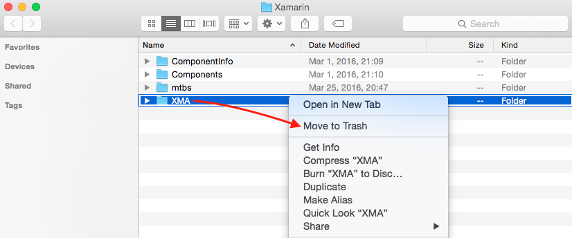](troubleshooting-images/troubleshooting-image8.png#lightbox)

3. There is a cache on Windows as well that it may help to clear. Open a cmd prompt as Administrator on Windows:

    ```
    del %localappdata%\Temp\Xamarin\XMA
    ```
    
### Warning Messages

This section discusses a few messages that can appear in the Output windows and logs that you can usually ignore.

#### "There is a mismatch between the installed Xamarin.iOS ... and the local Xamarin.iOS"

As long as you have confirmed that both Mac and Windows are updated to the same Xamarin distribution channel, this warning is ignorable.

#### "Failed to execute 'ls /usr/bin/mono': ExitStatus=1"

This message is ignorable as long as the Mac is running OS X 10.11 (El Capitan) or newer. This message is not a problem on OS X 10.11 because Xamarin also checks **/usr/local/bin/mono**, which is the correct expected location for `mono` on OS X 10.11.

#### "Bonjour service 'MacBuildHost' did not respond with its IP address."

This message is ignorable unless you notice that the connection dialog does not display the IP address of Mac build host. If the IP address _is_ missing in that dialog, you can still [manually add the Mac](~/ios/get-started/installation/windows/connecting-to-mac/index.md#manually-add-a-mac).

#### "Invalid user a from 10.1.8.95" and "input\_userauth\_request: invalid user a [preauth]"

You might notice this messages if you look in the **sshd.log**. These messages are part of the normal connection process. They appear because Xamarin uses the username **a** temporarily when retrieving the _SSH Fingerprint_.

### Output Window and Log Files

If Visual Studio hits an error when connecting to the build host, there are 2 locations to check for additional messages: the Output window and the log files.

#### Output Window

The Output window is the best place to start. It displays messages about the main connection steps and errors. To view the Xamarin messages in the Output window:

1. Select **View > Output** from the menus or click the **Output** tab.
2. Click the **Show output from** drop-down menu.
3. Select **Xamarin**.

[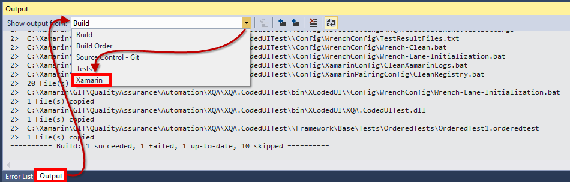](troubleshooting-images/troubleshooting-image11.png#lightbox)

#### Log Files

If the Output window does not include enough information to diagnose the problem, the log files are the next place to look. The log files contain additional diagnostic messages that do not appear in the Output window. To view the log files:

1. Start Visual Studio.

    > [!IMPORTANT]
    > Note that **.svclogs** are not enabled by default. To access them you will need to start Visual Studio with verbose logs as explained in the [Version Logs](~/cross-platform/troubleshooting/questions/version-logs.md#visual-studio-startup-verbose-logs) guide. For more information, refer to the [Troubleshooting Extensions with the Activity Log](https://blogs.msdn.microsoft.com/visualstudio/2010/02/24/troubleshooting-extensions-with-the-activity-log/) blog.

2. Attempt to connect to the build host.

3. After Visual Studio hits the connection error, collect the logs from **Help > Xamarin > Zip Logs**:

    [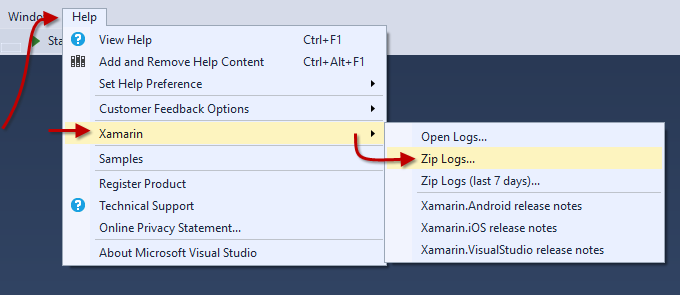](troubleshooting-images/troubleshooting-image12.png#lightbox)

4. When you open the .zip file, you will see a list of files similar to the example below. For connection errors, the most important files are the **\*Ide.log** and **\*Ide.svclog** files. These files contain the same messages in two slightly different formats. The **.svclog** is XML and is useful if you want to browse through the messages. The **.log** is plain text and is useful if you want to filter the messages using command line tools.

    To browse through all the messages, select and open the **.svclog** file:

    [](troubleshooting-images/troubleshooting-image13.png#lightbox)

5. The **.svclog** file will open in **Microsoft Service Trace Viewer**. You can browse the messages by thread to see related groups of messages. To browse by thread, first select the **Graph** tab, then click the **Layout Mode** drop-down menu and select **Thread**:

    [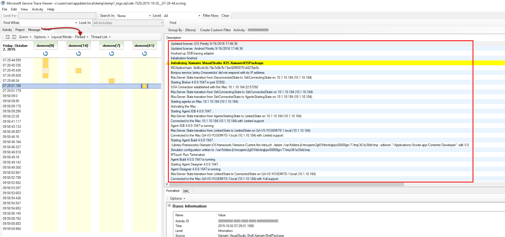](troubleshooting-images/troubleshooting-image14.png#lightbox)

<a name="verboselogs"></a>

#### Verbose Log Files

If the normal log files still do not provide sufficient information to diagnose the problem, one last technique to try is to enable verbose logging. The verbose logs are also preferred on bug reports.

1. Quit Visual Studio.

2. Start a [**Developer Command Prompt**](/dotnet/framework/tools/developer-command-prompt-for-vs).

3. Run the following command in the command prompt to launch Visual Studio with verbose logging:

    ```bash
    devenv /log
    ```

4. Attempt to connect to the build host from Visual Studio.

5. After Visual Studio hits the connection error, collect the logs from **Help > Xamarin > Zip Logs**.

6. Run the following command in Terminal on the Mac to copy any recent log messages from the SSH server into a file on your Desktop:

    ```bash
    grep sshd /var/log/system.log > "$HOME/Desktop/sshd.log"
   ```

If these verbose log files do not provide enough clues to resolve the issue directly, please [file a new bug report](https://bugzilla.xamarin.com/newbug) and attach both the .zip file from step 5 and the .log file from step 6.

## Troubleshooting automatic Mac provisioning

### IDE log files

If you encounter any trouble using [automatic Mac
provisioning](~/ios/get-started/installation/windows/connecting-to-mac/index.md#automatic-mac-provisioning),
take a look at the Visual Studio 2017 IDE logs, stored in
**%LOCALAPPDATA%\Xamarin\Logs\15.0**.

## Troubleshooting Build and Deployment Errors

This section covers a few problems that can happen after Visual Studio connects successfully to the build host.

### "Unable to connect to Address='192.168.1.2:22' with User='macuser'"

Known causes:

- **Xamarin 4.1 security feature** – This error _will_ happen if you downgrade to Xamarin 4.0 after using Xamarin 4.1 or higher. In this case the error will be accompanied by the additional warning "Private key is encrypted but passphrase is empty". This is an _intentional_ change due to a new security feature in Xamarin 4.1. **Recommended fix**: Delete **id\_rsa** and **id\_rsa.pub** from **%LOCALAPPDATA%\Xamarin\MonoTouch**, and then reconnect to the Mac build host.

- **SSH security restriction** – When this message is accompanied by the additional warning "Could not authenticate the user using the existing ssh keys", it most often means one of the files or directories in the fully qualified path of **$HOME/.ssh/authorized\_keys** on the Mac has write permissions enabled for _other_ or _group_ members. **Common fix**: Run `chmod og-w "$HOME"` in a Terminal command prompt on the Mac. For details about which particular file or directory is causing the problem, run `grep sshd /var/log/system.log > "$HOME/Desktop/sshd.log"` in Terminal, and then open the **sshd.log** file from your Desktop and look for "Authentication refused: bad ownership or modes".

### Solutions cannot be loaded from a Network Share

Solutions will only be compiled if they are on the local Windows file system or a mapped drive.

Solutions that are saved in a network share might throw errors, or completely refuse to compile. Any **.sln** files used in Visual Studio should be saved on the local Windows file system.

The following error is thrown because of this problem:

```bash
error : Building from a network share path is not supported at the moment. Please map a network drive to '\\SharedSources\HelloWorld\HelloWorld' or copy the source to a local directory.
```

related bug: [#36195](https://bugzilla.xamarin.com/show_bug.cgi?id=36195)

### Missing Provisioning Profiles or "Failed to create the a fat library" Error

Launch Xcode on the Mac and ensure that your Apple developer account is logged in and your iOS Development Profile is downloaded:

[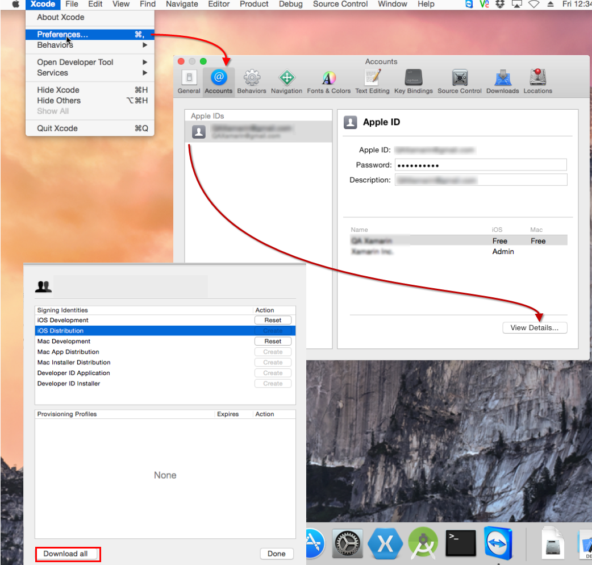](troubleshooting-images/troubleshooting-image7.png#lightbox)

### "A socket operation was attempted to an unreachable network"

Reported causes:

- **Enhancement [#36118](https://bugzilla.xamarin.com/show_bug.cgi?id=36118)** – This error can prevent successful builds when Visual Studio is using an IPv6 address to connect to the build host. (The build host connection does not yet support IPv6 addresses.)

### Xamarin.iOS Visual Studio plugin fails to load after reinstallation of beta/alpha channel

Relevant bug [#40781](https://bugzilla.xamarin.com/show_bug.cgi?id=40781).

This issue may happen when Visual Studio fails to refresh the MEF component cache. If that's the case, installing this Visual Studio extension may help: [https://visualstudiogallery.msdn.microsoft.com/22b94661-70c7-4a93-9ca3-8b6dd45f47cd](https://visualstudiogallery.msdn.microsoft.com/22b94661-70c7-4a93-9ca3-8b6dd45f47cd)

This will clear the Visual Studio MEF component cache to fix issues with cache corruption.

<a name="errors"></a>

### Errors due to existing Build Host Processes on the Mac

Processes from previous build host connections can sometimes interfere with the behavior of the current active connection. To check for any existing processes, close Visual Studio and then run the following commands in Terminal on the Mac:

```bash
ps -A | grep mono
```

[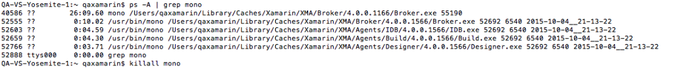](troubleshooting-images/troubleshooting-image10.png#lightbox)

To kill the existing processes use the following command:

```bash
killall mono
```

### Clearing the Mac Build Cache

If you are troubleshooting a build problem and want to make sure the behavior is not related to any of temporary build files stored on the Mac, you can delete the build cache folder.

1. Run the following command in Terminal on the Mac:

    ```bash
    open "$HOME/Library/Caches/Xamarin"
    ```

2. Control-click the **mtbs** folder and select **Move to Trash**:

    [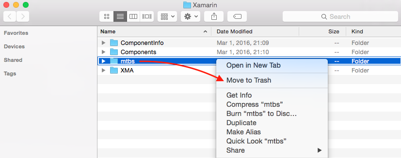](troubleshooting-images/troubleshooting-image9.png#lightbox)

## Related Links

- [Pair to Mac](~/ios/get-started/installation/windows/connecting-to-mac/index.md)
- [Xamarin Mac Build Agent video](https://www.youtube.com/watch?v=MBAPBtxkjFQ)