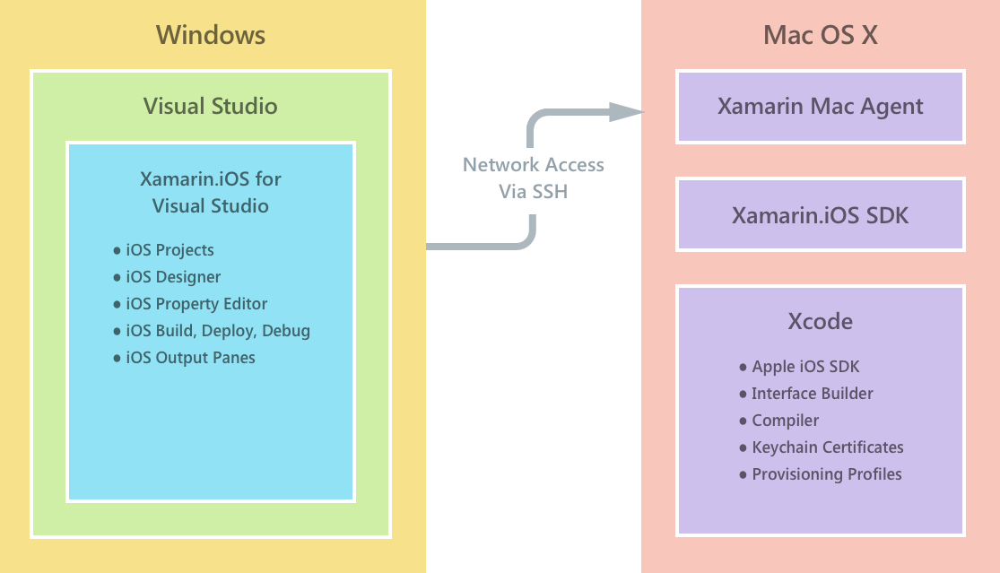
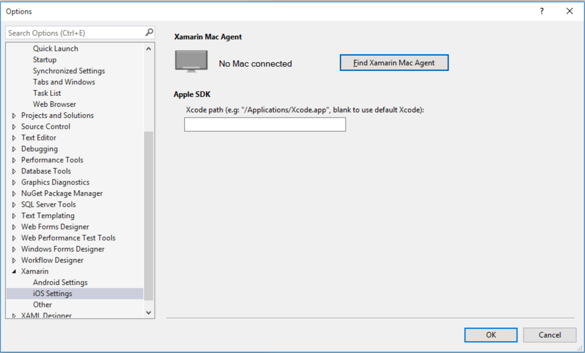
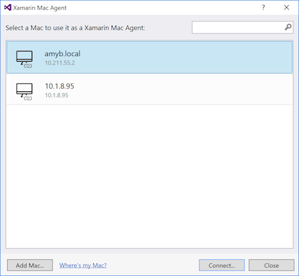
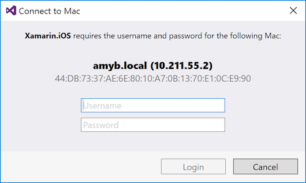
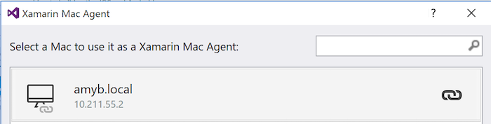
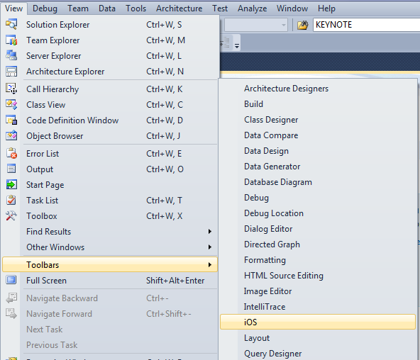
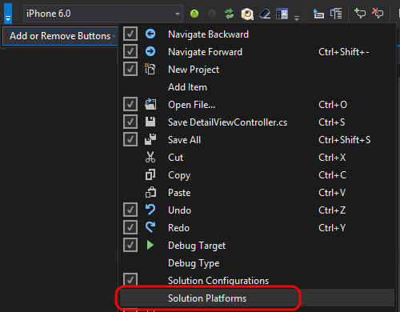

# Installing Xamarin.iOS on Windows

_This article shows how to set up Xamarin.iOS for Visual Studio. It covers the installation process for the Xamarin extension for Visual Studio, and discusses connecting to the Apple SDK installed on the Mac._

## Overview

Xamarin.iOS for Visual Studio allows iOS applications to be written and
tested on Windows computers, with a networked Mac providing the build and
deployment service.

Developing for iOS inside Visual Studio provides the ability to:

- Create cross-platform solutions for iOS, Android, and Windows
  applications.
- Use Visual Studio tools (such as *Resharper* and *Team Foundation
  Server*) for all your cross-platform projects, including iOS source
  code.
- Work with a familiar IDE, while taking advantage of Xamarin.iOS bindings
  of all Apple’s APIs

Xamarin.iOS for Visual Studio supports configurations where Visual Studio is
running inside a Windows virtual machine on a Mac (using Parallels or
VMWare), or when it is on a separate machine that is visible on the same
network as a Mac. Regardless of which configuration works best for you,
Visual Studio will connect to the Mac promptly and securely using SSH.

This article covers the steps to install and configure the Xamarin.iOS tools
on both the Mac and Windows machine, as well as the steps to connect to the
Mac host so that developers can build, debug, and deploy Xamarin.iOS
applications using Visual Studio.

The diagram below shows a simple overview of the Xamarin.iOS development
workflow:

> [!IMPORTANT]
> Visual Studio actually launches a separate MSBuild process to build the
> projects. This process creates a new connection to the Mac, meaning there
> are actually two SSH connections from Windows to Mac when Visual Studio
> builds. Building from the
> [command-line](~/ios/get-started/installation/windows/connecting-to-mac/index.md)
> only creates the one MSBuild process. For the simplicity of this diagram,
> all the connections are simply represented by one arrow.

## Requirements

Xamarin.iOS for Visual Studio accomplishes an amazing feat: it lets
developers create, build, and debug iOS applications on a Windows computer
using the Visual Studio IDE. It cannot do this alone – iOS applications
cannot be created without Apple’s compiler, and they cannot be deployed
without Apple’s certificates and code-signing tools. This means that a
Xamarin.iOS for Visual Studio installation requires a connection to a
networked Mac OS X computer to perform these tasks. Once configured,
Xamarin’s tools will make the process as seamless as possible.

<a name="system-requirements"/>

### System Requirements

The system requirements are:

### Windows

1. Windows 7 or higher.

2. Visual Studio 2015 Professional or higher

    a. If you have an Enterprise license, you will need to install Visual
       Studio Enterprise.

3. Xamarin for Visual Studio.

The Xamarin tools cannot be used with Express editions of Visual Studio due
to lack of plug-in support. Xamarin is supported in Visual Studio Community.

### Mac

1. A Mac running macOS Sierra (10.12) or higher (although the latest
   stable version is recommended).

2. Xamarin iOS SDK. This is installed when downloading Visual Studio for Mac

3. Apple’s Xcode IDE and iOS SDK (The latest stable version
   from the Mac App Store is recommended).

**The Windows computer must be able to reach the Mac via the network.**

### Apple Developer Account

To deploy applications to a device or to submit them to the App Store, an
Apple Developer account is required. The relevant developer certificates and
provisioning profiles must be created and installed on the networked Mac
before Xamarin.iOS for Visual Studio can work. See the [Device
Provisioning](~/ios/get-started/installation/device-provisioning/index.md)
article for steps to obtain a development certificate and to provision a
device.

## Features 

Xamarin.iOS for Visual Studio enables the creation, editing, building, and
deployment of Xamarin.iOS projects from Windows. This includes the following
features:

- Create new iOS projects.

- Edit iOS projects and cross-platform solutions that also include
  Xamarin.Android and UWP projects.

- Compile iOS projects and cross-platform solutions that also include
  Xamarin.Android and UWP projects.

- Storyboard and .xib support using the iOS Designer.

- Deploy and debug iOS applications, where the app itself runs in a
  simulator, or on a device connected to the
  Mac.

- iOS simulator on Windows – For more information on using the iOS simulator
  on Windows, refer to [this guide](~/tools/ios-simulator.md).

<a name="configuring" />

## Configuring your Mac

<a name="installation"/>

### Installation

To install Xamarin.iOS tools on your mac host you must [install Visual Studio for Mac](https://docs.microsoft.com/visualstudio/mac/installation).

Once the software is installed, follow the steps in the next sections to
configure Xamarin.iOS on macOS to allow Xamarin for Visual Studio to connect
to it.

> [!IMPORTANT]
> The Windows machine must be using the same version of Xamarin.iOS as 
> the Mac to which it is connected. To ensure this is true:
>
> - **Visual Studio 2015 and earlier**: Ensure that you are on the same
>   [updates channel](https://developer.xamarin.com/recipes/cross-platform/ide/change_updates_channel/)
>   as Visual Studio for Mac.
>
> - **Visual Studio 2017, Release Version**: Ensure that you are on the
>   **Stable** channel of Visual Studio for Mac.
>
> - **Visual Studio 2017, Preview Version**: Ensure that you are on the 
>   **Alpha** channel of Visual Studio for Mac.

<a name="configuration" />

### Configuration

To access communication between the Xamarin extension for Visual Studio and
your Mac, you will need to allow **Remote Login** on your Mac. Follow the
steps below to set this up:

1. Open *Spotlight* (**Cmd-Space**) and search for **Remote Login** and then
   select the **Sharing** result. This will open the **System Preferences**
   at the **Sharing** panel.

2. Tick the **Remote Login** option in the **Service** list on the left in
   order to allow Xamarin for Visual Studio to connect to the Mac.

3. Make sure that **Remote Login** is set to allow access for **All users**,
or that your Mac username or group is included in the list of allowed users
in the list on the right.

The Mac should now be discoverable by Visual Studio if it's on the same
network.

> [!NOTE]
> If you have the macOS firewall set to block signed applications by 
> default, you may need to allow `mono-sgen` to receive incoming
> connections. An alert dialog will appear to prompt you if this is the case.

<a name="developersetup"/>

### iOS Developer Setup

For iOS development, it is important that the Mac machine is configured with
the relevant signing identities. This allows you to correctly sign your apps
so that they can be distributed either via the App Store or Ad Hoc. Follow
the link below for instructions on setting up a Mac for iOS development with
Xamarin:

- [Device Provisioning](~/ios/get-started/installation/device-provisioning/index.md?ide=vs)

Once your Mac is configured, it’s time to set up your Windows computer.

<a name="windowsinstallation"/>

## Windows Installation

Xamarin can be installed as part of your Visual Studio 2017 or 2015
installation. To install Visual Studio tools for Xamarin, see the [Windows
Installation](~/cross-platform/get-started/installation/windows.md)
guide.

## Installation Complete

After the installation process is complete, there are still a few more steps
required to get everything working:

- [Connect Visual Studio to the Mac](#connectingtomac) – Visual Studio
  must be connected to the Mac build host before it can build Xamarin.iOS
  projects.
- [Configure the Visual Studio Toolbar](#toolbar) – This will let you easily 
  access Xamarin.iOS features in Visual Studio.

<a name="connectingtomac" /> 

### Connecting to the Mac

A connection is made from Xamarin.iOS for Visual Studio to your Mac build
host via an SSH connection between machines. For more information on the connection, refer to the [Connecting
to Mac](~/ios/get-started/installation/windows/connecting-to-mac/index.md)
guide.

To connect your Mac, follow the steps below:

- Browse to **Tools > Options** and under **Xamarin** select **iOS Settings**:

  

- Provided the Mac has been correctly
  [configured](#configuration)
  to allow **Remote Login**, you should be able to select your Mac in the
  list:

  

- This will prompt for the administrative credentials of your Mac host:

  

- When you have connected, it will display the 'Connection Successful' icon
  next to the machine name:

  

You will be reconnected each time you start Visual Studio.

<a name="toolbar" />

## Visual Studio Toolbar Configuration

When an iOS project is open the iOS Toolbar will be visible by default, and
does not need to be configured.

The steps below can be used if the iOS toolbar does not appear.

To configure the toolbar first open the **View > Toolbars** menu and make
sure the **iOS** entry is selected. Choose the menu item as shown in this
screenshot—it should be ticked to indicate that the toolbar is visible:

### Visual Studio 2015

In versions earlier than Visual Studio 2017, the **Solution Platforms**
button may need to be added to the Standard toolbar. This allows an iOS
Device or the iOS Simulator to be selected when debugging. Follow the
instructions below to set this up

Click the menu button at the right side of the Standard bar:

- Choose **Add or Remove Buttons**
- Select **Solution Platforms**

The **Standard** and **iOS** toolbars should now resemble this screenshot:

Once the toolbar configuration is complete, you are ready to begin using
Xamarin iOS for Visual Studio.

## Summary

This article presented a step-by-step guide to installing, configuring, and
using Xamarin iOS for Visual Studio.

It covered installing and configuring the prerequisite tools on Windows and
Mac OS X.

## Related Links

- [Installation](~/cross-platform/get-started/installation/windows.md)
- [Device Provisioning](~/ios/get-started/installation/device-provisioning/index.md)
- [Introduction to Xamarin.iOS for Visual Studio](~/ios/get-started/installation/windows/introduction-to-xamarin-ios-for-visual-studio.md)
- [Connecting a Mac to your Visual Studio environment with XMA (video)](https://university.xamarin.com/lightninglectures/xamarin-mac-agent)
