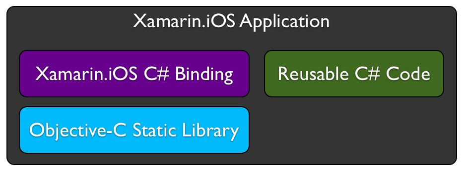

# Xamarin for Objective-C Developers

Xamarin offers a path for developers targeting iOS to move their non-user interface code to platform agnostic C# so that it can be used anywhere C# is available, including Android via Xamarin.Android and the various flavors of Windows. However, just because you use C# with Xamarin doesn't mean you can't leverage existing skills and Objective-C code. In fact, knowing Objective-C makes you a better Xamarin.iOS developer because Xamarin exposes all the native iOS and OS X platform APIs you know and love, such as UIKit, Core Animation, Core Foundation and Core Graphics to name a few. At the same time, you get the power of the C# language, including features like LINQ and Generics, as well as rich .NET base class libraries to use in your native applications.

Additionally, Xamarin allows you to leverage existing Objective-C assets via a technology know as bindings. You simply create a static library in Objective-C and expose it to C# via a binding, as illustrated in the following diagram:

 

This doesn't need to be limited to non-UI code. Bindings can expose user interface code developed in Objective-C as well.

## Transitioning from Objective-C

You'll find a plethora of information on our documentation site to help ease the transition to Xamarin, showing how to integrate C# code with what you already know. Some highlights to get you started include:

- [C# Primer for Objective-C Developers](primer.md) - A short primer for Objective-C developers looking to move to Xamarin and the C# language. 
- [Walkthrough: Binding an Objective-C Library](~/ios/platform/binding-objective-c/walkthrough.md) - A step-by-step walkthrough for reusing existing Objective-C code in a Xamarin.iOS application. 

## Binding Objective-C

Once you have a grasp of how C# compares to Objective-C and have worked through the binding walkthrough above, you'll be in good shape for transitioning to the Xamarin platform. As a follow up, more detailed information on Xamarin.iOS binding technologies, including a comprehensive binding reference is available in the [Binding Objective-C](~/ios/platform/binding-objective-c/index.md) section.

## Cross-Platform Development

Finally, after moving to Xamarin.iOS, you'll want to check out the cross-platform guidance we have, including case studies of reference applications we have developed, along with best practices for creating reusable, cross-platform code contained in the [Building Cross-Platform Applications section](~/cross-platform/app-fundamentals/building-cross-platform-applications/index.md).
