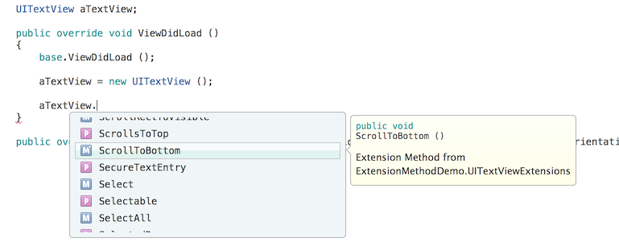

# C# Primer for Objective-C Developers

_Xamarin.iOS allows platform-agnostic code written in C# to be shared across platforms. However, existing iOS applications may want to leverage Objective-C code that has already been created. This article serves as a short primer for Objective-C developers looking to move to Xamarin and the C# language._

iOS and macOS applications developed in Objective-C can benefit from Xamarin by leveraging C# in places where platform-specific code is not required, allowing such code to be used on non-Apple devices. Things such as web services, JSON and XML parsing, and custom algorithms can then be used in a cross-platform manner.

To take advantage of Xamarin while maintaining existing Objective-C assets, the former can be exposed to C# in a technology from Xamarin known as bindings, which surface Objective-C code to the managed, C# world. Also, if desired, code can be ported line-by-line to C# as well. Regardless of the approach however, whether it be binding or porting, some knowledge of both Objective-C and C# is necessary to effectively leverage existing Objective-C code with Xamarin.iOS.

## Objective-C Interop

There is currently no supported mechanism to create a library in C# using Xamarin.iOS that can be called from Objective-C. The main reason for this is the Mono runtime is also required in addition to the binding. However, you can still create the majority of your logic in Objective-C, including user interfaces. To do this, wrap the Objective-C code in a library and create a binding to it. Xamarin.iOS is needed to bootstrap the application (meaning it must create the `Main` entry point). After that, any other logic can be in Objective-C, exposed to C# through the binding (or via P/Invoke). This way, you can keep the platform specific logic in Objective-C and develop the platform agnostic parts in C#.

This article highlights some key similarities, as well as contrasts several differences in both languages to serve as a primer when moving to C# with Xamarin.iOS, whether binding to existing Objective-C code, or porting it to C#.

For details on creating bindings see the other documents in [Binding Objective-C](~/ios/platform/binding-objective-c/index.md).

## Language Comparison

Objective-C and C# are very different languages both syntactically and from a runtime standpoint. Objective-C is a dynamic language and uses a message passing scheme, whereas C# is statically typed. Syntax-wise, Objective-C is like Smalltalk, whereas C# derives much of its fundamental syntax from Java, although it has matured to include many capabilities beyond Java in recent years.

That said there are several language features of both Objective-C and C# that are similar in function. When creating a binding to Objective-C code from C# or when porting Objective-C to C#, understanding these similarities is useful.

### Protocols vs. Interfaces

Both Objective-C and C# are single inheritance languages. However, both languages have support for implementing multiple interfaces in a given class. In Objective-C these logical interfaces are called *protocols* whereas in C# they are called *interfaces*. Implementation-wise, the main difference between a C# interface and an Objective-C protocol is the latter can have optional methods. For more information see the [Events, Delegates and Protocols](~/ios/app-fundamentals/delegates-protocols-and-events.md) article.

### Categories vs. Extension methods

Objective-C allows methods to be added to a class for which you may not have the implementation code using *Categories*. In C# a similar concept is available through what’s known as *extension methods*.

Extension methods let you add static methods to a class, where static methods in C# are analogous to class methods in Objective-C. For example, the following code adds a method named `ScrollToBottom` to the `UITextView` class, which in turn is a managed class that is bound to the Objective-C `UITextView` class from UIKit:

```csharp
public static class UITextViewExtensions
{
    public static void ScrollToBottom (this UITextView textView)
    {
        // code to scroll textView
    }
}
```

Then, when an instance of a `UITextView` is created in code, the method will be available in the autocomplete list as shown below:

 

When the extension method is called the instance is passed to the argument, such as the `textView` in this example.

### Frameworks vs. Assemblies

Objective-C packages related classes in special directories known as frameworks. In C# and .NET however, assemblies are used to provide reusable bits of precompiled code. In environments outside of iOS, assemblies contain intermediate language code (IL) that is just in time (JIT) compiled at runtime. However, Apple does not allow execution of JIT compiled code in iOS applications released on the App Store. Therefore C# code targeting iOS with Xamarin is ahead of time compiled (AOT), producing a single Unix executable along with metadata files that are included in the application bundle.

### Selectors vs. Named Parameters

Objective-C methods inherently include parameter names in selectors by their very nature. For example a selector such as `AddCrayon:WithColor:` makes it clear what each parameter means when used in code. C# optionally supports named arguments as well.

For example, similar code in C# using named arguments would be:

```csharp
AddCrayon (crayon: myCrayon, color: UIColor.Blue);
```

Although C# added this support in version 4.0 of the language, in practice it isn’t used very often. However, if you want to be explicit in your code, the support for it is there.

### Headers and Namespaces

Being a superset of C, Objective-C uses headers for public declarations that are separate from the implementation file. C# does not use header files. Unlike Objective-C, C# code is contained in namespaces. If you want to include code available in some namespace, you add either a using directive to the top of the implementation file, or you qualify the type with the full namespace.

For example, the following code includes the `UIKit` namespace, making every class in that namespace available to the implementation:

```csharp
using UIKit;
namespace MyAppNamespace
{
    // implementation of classes
}
```

Also, the namespace keyword in the above code sets the namespace used for the implementation file itself. If multiple implementation files share the same namespace, there’s no need to include the namespace in a using directive as well, as it is implied.

### Properties

Both Objective-C and C# have the concept of properties to provide a high-level abstraction around accessor methods. In Objective-C the @property compiler directive is used to effectively generate the accessor methods. In contrast, C# includes support for properties within the language itself. A C# property can be implemented using either a longer style that accesses a backing field, or using a shorter, automatic property syntax, as shown in the following examples:

```csharp
// automatic property syntax
public string Name { get; set; }

// property implemented with a backing field
string address;
public string Address {
    get {
        // could add additional code here
        return address;
    }
    set {
        address = value;
    }
}
```

### Static Keyword

The *static* keyword has very different meaning between Objective-C and C#. In Objective-C static functions are used to limit the scope of a function to the current file. In C# however, scope is maintained through the *public*, *private* and *internal* keywords.

When the static keyword is applied to a variable in Objective-C, the variable maintains its value across function calls.

C# also has a static keyword. When applied to a method, it effectively does the same thing that the `+` modifier does in Objective-C. Namely, it creates a class method. Similarly, when applied to other constructs such as fields, properties and events, it makes those part of the type they are declared within rather than with any instance of that type. You can also make a static class, in which all the methods defined in the class must be static as well.

### NSArray vs. List Initialization

Objective-C now includes literal syntax for use with `NSArray`, making it easier to initialize. C# however has a richer type called a `List` which is *generic*, meaning the type the list holds can be provided by the code that creates the list (like templates in C++). Additionally, lists support auto-initialization syntax as shown below:

```csharp
MyClass object1 = new MyClass ();
MyClass object2 = new MyClass ();
List<MyClass> myList = new List<MyClass>{ object1, object2 };
```

### Blocks vs. Lambda Expressions

Objective-C uses *blocks* to create closures, where you can create a function inline that can make use of the state where it is enclosed. C# has a similar concept through the use of lambda expressions. In C# lambda expressions are created with the `=>` operator as shown below:

```csharp
(args) => {
    //  implementation code
};
```

For more information on lambda expressions, see Microsoft’s [C# Programming Guide](/dotnet/csharp/language-reference/operators/lambda-expressions).

## Summary

In this article a variety of language features were contrasted between Objective-C and C#. In some cases, it called out analogous features that exist between both languages, such as blocks to lambda expressions, and categories to extension methods. Additionally, it contrasted places where the languages diverge, such as with namespaces in C# and the meaning of the static keyword.