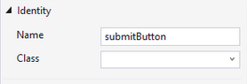

# Xamarin.iOS API Design

In addition to the core Base Class Libraries that are part of Mono,
[Xamarin.iOS](~/ios/index.yml) ships with bindings for
various iOS APIs to allow developers to create native iOS
applications with Mono.

At the core of Xamarin.iOS, there is an interop engine that bridges
the C# world with the Objective-C world, as well as bindings for the
iOS C-based APIs like CoreGraphics and [OpenGL ES](#opengles).

The low-level runtime to communicate with Objective-C code is in
[MonoTouch.ObjCRuntime](#objcruntime). On top of this,
bindings for [Foundation](#foundation), CoreFoundation, and
[UIKit](#uikit) are provided.

## Design Principles

These are some of our design principles for the Xamarin.iOS bindings
(they also apply to Xamarin.Mac, the Mono bindings for Objective-C on
macOS):

- Follow the [Framework Design Guidelines](/dotnet/standard/design-guidelines)
- Allow developers to subclass Objective-C classes:

  - Derive from an existing class
  - Call the base constructor to chain
  - Overriding methods should be done with C#'s override system
  - Subclassing should work with C# standard constructs

- Do not expose developers to Objective-C selectors
- Provide a mechanism to call arbitrary Objective-C libraries
- Make common Objective-C tasks easy and hard Objective-C tasks possible
- Expose Objective-C properties as C# properties
- Expose a strongly-typed API:

  - Increase type safety
  - Minimize runtime errors
  - Get IDE IntelliSense on return types
  - Allows for IDE popup documentation

- Encourage in-IDE exploration of the APIs:

  - For example, instead of exposing a weakly-typed array like this:

    ```objc
    NSArray *getViews
    ```

    Expose a strong type, like this:

    ```csharp
    NSView [] Views { get; set; }
    ```

    This gives Visual Studio for Mac the ability to do auto-completion while
    browsing the API, makes all of the `System.Array` operations available
    on the returned value, and allows the return value to participate in
    LINQ.

- Native C# types:

  - [`NSString` becomes `string`](~/ios/internals/api-design/nsstring.md)
  - Turn `int` and `uint` parameters that should have been enums into C#
    enumerations and C# enumerations with `[Flags]` attributes
  - Instead of type-neutral `NSArray` objects, expose arrays as
    strongly-typed arrays.
  - For events and notifications, give users a choice between:

    - A strongly-typed version by default
    - A weakly-typed version for advanced use cases

- Support the Objective-C delegate pattern:

  - C# event system
  - Expose C# delegates (lambdas, anonymous methods, and `System.Delegate`)
    to Objective-C APIs as blocks

### Assemblies

Xamarin.iOS includes a number of assemblies that constitute the
*Xamarin.iOS Profile*. The
[Assemblies](~/cross-platform/internals/available-assemblies.md) page has more
information.

### Major Namespaces

#### ObjCRuntime

The [ObjCRuntime](xref:ObjCRuntime)
namespace allows developers to bridge the worlds between C# and Objective-C.
This is a new binding, designed specifically for the iOS, based on the experience from Cocoa# and Gtk#.

#### Foundation

The [Foundation](xref:Foundation)
namespace provides the basic data types designed to interoperate with the
Objective-C Foundation framework that is part of the iOS and it is the base
for object oriented programming in Objective-C.

Xamarin.iOS mirrors in C# the hierarchy of classes from
Objective-C. For example, the Objective-C base class
NSObject is usable from C# via [Foundation.NSObject](xref:Foundation.NSObject).

Although this namespace provides bindings for the underlying
Objective-C Foundation types, in a few cases we have mapped the
underlying types to .NET types. For example:

- Instead of dealing with NSString and [NSArray](https://developer.apple.com/library/ios/#documentation/Cocoa/Reference/Foundation/Classes/NSArray_Class/NSArray.html), the runtime exposes these as C#  [string](xref:System.String)s and strongly typed  [array](xref:System.Array)s throughout the API.

- Various helper APIs are exposed here to allow developers to bind third party Objective-C APIs, other iOS APIs or APIs that are not currently bound by Xamarin.iOS.

For more details on binding APIs, see the [Xamarin.iOS Binding
Generator](~/cross-platform/macios/binding/binding-types-reference.md)
section.

##### NSObject

The [NSObject](xref:Foundation.NSObject)
type is the foundation for all the Objective-C bindings. Xamarin.iOS types mirror
two classes of types from the iOS CocoaTouch APIs: the C types (typically
referred to as CoreFoundation types) and the Objective-C types (these all derive
from the NSObject class).

For each type that mirrors an unmanaged type, it is possible to obtain
the native object through the
[Handle](xref:Foundation.NSObject.Handle)
property.

While Mono will provide garbage collection for all of your objects,
the `Foundation.NSObject` implements the
[System.IDisposable](xref:System.IDisposable)
interface. This means that you can explicitly release the resources of
any given NSObject without having to wait for the Garbage Collector to
kick-in. This is important when you are using heavy NSObjects, for
example, UIImages that might hold pointers to large blocks of data.

If your type needs to perform deterministic finalization, override the
[NSObject.Dispose(bool)
method](xref:Foundation.NSObject.Dispose(System.Boolean))
The parameter to Dispose is "bool disposing", and if set to true it
means that your Dispose method is being called because the user
explicitly called Dispose () on the object. If the value is false,
this means that your Dispose(bool disposing) method is being called
from the finalizer on the finalizer thread.

##### Categories

Starting with Xamarin.iOS 8.10 it is possible to create
Objective-C categories from C#.

This is done using the `Category` attribute, specifying the type to
extend as an argument to the attribute. The following example will for
instance extend NSString.

```csharp
[Category (typeof (NSString))]
```

Each category method is using the normal mechanism for exporting
methods to Objective-C using the `Export` attribute:

```csharp
[Export ("today")]
public static string Today ()
{
    return "Today";
}
```

All managed extension methods must be static, but it’s possible to
create Objective-C instance methods using the standard syntax for
extension methods in C#:

```csharp
[Export ("toUpper")]
public static string ToUpper (this NSString self)
{
    return self.ToString ().ToUpper ();
}
```

and the first argument to the extension method will be the instance on
which the method was invoked.

Complete example:

```csharp
[Category (typeof (NSString))]
public static class MyStringCategory
{
    [Export ("toUpper")]
    static string ToUpper (this NSString self)
    {
        return self.ToString ().ToUpper ();
    }
}
```

This example will add a native toUpper instance method to the NSString
class, which can be invoked from Objective-C.

```csharp
[Category (typeof (UIViewController))]
public static class MyViewControllerCategory
{
    [Export ("shouldAutoRotate")]
    static bool GlobalRotate ()
    {
        return true;
    }
}
```

One scenario where this is useful is adding a method to an entire set
of classes in your codebase, for example, this would make all
`UIViewController` instances report that they can rotate:

```csharp
[Category (typeof (UINavigationController))]
class Rotation_IOS6 {
      [Export ("shouldAutorotate:")]
      static bool ShouldAutoRotate (this UINavigationController self)
      {
          return true;
      }
}
```

##### PreserveAttribute

PreserveAttribute is a custom attribute that is used to tell mtouch – the Xamarin.iOS deployment tool – to preserve a type, or a member of a type, during the phase when the application is processed to reduce its size.

Every member that is not statically linked by the application is subject to be removed. Hence, this attribute is used to mark members that are not statically referenced, but that are still needed by your application.

For instance, if you instantiate types dynamically, you may want to preserve
the default constructor of your types. If you use XML serialization, you may
want to preserve the properties of your types.

You can apply this attribute on every member of a type, or on the type
itself. If you want to preserve the whole type, you can use the syntax [Preserve
(AllMembers = true)] on the type.

#### UIKit

The [UIKit](xref:UIKit)
namespace contains a one-to-one mapping to all of the UI components that make up
CocoaTouch in the form of C# classes. The API has been modified to follow the
conventions used in the C# language.

C# delegates are provided for common operations. See the [delegates](#delegates) section for more information.

#### OpenGLES

For OpenGLES, we distribute a [modified version](xref:OpenTK)
of the [OpenTK](https://opentk.net/) API, an object-oriented
binding to OpenGL that has been modified to use CoreGraphics data types and
structures, as well as only exposing the functionality that is available on iOS.

OpenGLES 1.1 functionality is available through the [ES11.GL type](xref:OpenTK.Graphics.ES11.GL).

OpenGLES 2.0 functionality is available through the [ES20.GL type](xref:OpenTK.Graphics.ES20.GL).

OpenGLES 3.0 functionality is available through the [ES30.GL type](xref:OpenTK.Graphics.ES30.GL).

### Binding Design

Xamarin.iOS is not merely a binding to the underlying Objective-C platform. It
extends the .NET type system and dispatch system to better blend C# and
Objective-C.

Just as P/Invoke is a useful tool to invoke native libraries on Windows and Linux, or as IJW support can be used for COM interop on Windows, Xamarin.iOS extends the runtime to support binding C# objects to Objective-C objects.

The discussion in the next few sections is not necessary for users that are
creating Xamarin.iOS applications, but will help developers understand how things
are done and will assist them when creating more complicated applications.

#### Types

Where it made sense, C# types are exposed instead of low-level Foundation types, to the C# universe.  This means that [the API uses the C# "string" type instead of NSString](~/ios/internals/api-design/nsstring.md) and it uses strongly typed C# arrays instead of
exposing NSArray.

In general, in the Xamarin.iOS and Xamarin.Mac design, the underlying `NSArray`
object is not exposed. Instead, the runtime automatically converts `NSArray`s to
strongly typed arrays of some `NSObject` class. So, Xamarin.iOS does not expose a weakly-typed method like GetViews to return an NSArray:

```csharp
NSArray GetViews ();
```

Instead, the binding exposes a strongly typed return value, like this:

```csharp
UIView [] GetViews ();
```

There are a few of methods exposed in `NSArray`, for the corner cases where
you might want to use an `NSArray` directly, but their use is discouraged in the
API binding.

Additionally, in the **Classic API** instead of exposing `CGRect`, `CGPoint` and `CGSize` from the
CoreGraphics API, we replaced those with the `System.Drawing` implementations
`RectangleF`, `PointF` and `SizeF` as they would help developers preserve existing OpenGL code that uses OpenTK. When using the new 64-bit **Unified API**, the CoreGraphics API should be used.

#### Inheritance

The Xamarin.iOS API design allows developers to extend native Objective-C types in the same way that they would extend a C# type, using the "override" keyword on a derived class, as well as chaining up to the base implementation using the "base" C# keyword.

This design allows developers to avoid dealing with Objective-C selectors as part of their development process, because the entire Objective-C system is already wrapped inside the Xamarin.iOS libraries.

#### Types and Interface Builder

When you create .NET classes that are instances of types created by Interface
Builder, you need to provide a constructor that takes a single `IntPtr` parameter.
This is required to bind the managed object instance with the unmanaged object.
The code consists of a single line, like this:

```csharp
public partial class void MyView : UIView {
   // This is the constructor that you need to add.
   public MyView (IntPtr handle) : base (handle) {}
}
```

#### Delegates

Objective-C and C# have different meanings for the word delegate in each
language.

In the Objective-C world, and in the documentation that you will find online
about CocoaTouch, a delegate is typically an instance of a class that will
respond to a set of methods. This is very similar to a C# interface, with the
difference being that the methods are not always mandatory.

These delegates play an important role in UIKit and other CocoaTouch APIs. They are used to accomplish various tasks:

- To provide notifications to your code (Similar to event delivery in C# or Gtk+).
- To implement models for data visualization controls.
- To drive the behavior of a control.

The programming pattern was designed to minimize the creation of derived
classes to alter behavior for a control. This solution is similar in spirit to
what other GUI toolkits have done over the years: Gtk's signals, Qt slots,
Winforms events, WPF/Silverlight events and so on. To avoid having hundreds of
interfaces (one for each action) or requiring developers to implement too many
methods they do not need, Objective-C supports optional method definitions. This
is different than C# interfaces that require all methods to be implemented.

In Objective-C classes, you will see that classes that use this programming pattern expose a property, usually called `delegate`, which is required to implement the mandatory parts of the interface and zero, or more, of the optional parts.

In Xamarin.iOS three mutually exclusive mechanisms to bind to these
delegates are offered:

1. [Via events](#via-events).
2. [Strongly typed via a `Delegate` property](#strongly-typed-via-a-delegate-property)
3. [Loosely typed via a `WeakDelegate` property](#loosely-typed-via-the-weakdelegate-property)

For example, consider the UIWebView class. This dispatches to a UIWebViewDelegate instance, which is assigned to the delegate property.

##### Via Events

For many types, Xamarin.iOS will automatically create an appropriate delegate
which will forward the `UIWebViewDelegate` calls onto C# events. For
`UIWebView`:

- The webViewDidStartLoad method is mapped to the  [UIWebView.LoadStarted](xref:UIKit.UIWebView.LoadStarted) event.
- The webViewDidFinishLoad method is mapped to the  [UIWebView.LoadFinished](xref:UIKit.UIWebView.LoadFinished) event.
- The webView:didFailLoadWithError method is mapped to the  [UIWebView.LoadError](xref:UIKit.UIWebView.LoadError) event.

For example, this simple program records the start and end times when loading a web view:

```csharp
DateTime startTime, endTime;
var web = new UIWebView (new CGRect (0, 0, 200, 200));
web.LoadStarted += (o, e) => startTime = DateTime.Now;
web.LoadFinished += (o, e) => endTime = DateTime.Now;
```

##### Via Properties

Events are useful when there might be more than one subscriber to the event. Also, events are limited to cases where there is no return value from the code.

For cases where the code is expected to return a value, we opted instead for
properties. This means that only one method can be set at a given time in an
object.

For example, you can use this mechanism to dismiss the keyboard on the screen on the handler for a `UITextField`:

```csharp
void SetupTextField (UITextField tf)
{
    tf.ShouldReturn = delegate (textfield) {
        textfield.ResignFirstResponder ();
        return true;
    }
}
```

The `UITextField`'s `ShouldReturn` property in this case takes as an argument a
delegate that returns a bool value and determines whether the TextField should
do something with the Return button being pressed. In our method, we return *true*
to the caller, but we also remove the keyboard from the screen (this happens
when the textfield calls `ResignFirstResponder`).

##### Strongly Typed via a Delegate Property

If you would prefer not to use events, you can provide your own [UIWebViewDelegate](xref:UIKit.UIWebViewDelegate)
subclass and assign it to the [UIWebView.Delegate](xref:UIKit.UIWebView.Delegate)
property. Once UIWebView.Delegate has been assigned, the UIWebView event
dispatch mechanism will no longer function, and the UIWebViewDelegate methods
will be invoked when the corresponding events occur.

For example, this simple type records the time it takes to load a web
view:

```csharp
class Notifier : UIWebViewDelegate  {
    DateTime startTime, endTime;

    public override LoadStarted (UIWebView webview)
    {
        startTime = DateTime.Now;
    }

    public override LoadingFinished (UIWebView webView)
    {
        endTime= DateTime.Now;
    }
}
```

The above is used in code like this:

```csharp
var web = new UIWebView (new CGRect (0, 0, 200, 200));
web.Delegate = new Notifier ();
```

The above will create a UIWebViewer and it will instruct it to send messages
to an instance of Notifier, a class that we created to respond to messages.

This pattern is also used to control behavior for certain controls, for
example in the UIWebView case, the [UIWebView.ShouldStartLoad](xref:UIKit.UIWebView.ShouldStartLoad)
property allows the `UIWebView` instance to control whether the `UIWebView` will
load a page or not.

The pattern is also used to provide the data on demand for a few controls. For example, the [UITableView](xref:UIKit.UITableView)
control is a powerful table-rendering control – and both the look and the contents are driven by an instance of a [UITableViewDataSource](xref:UIKit.UITableViewDataSource)

### Loosely Typed via the WeakDelegate Property

In addition to the strongly typed property, there is also a weak typed
delegate that allows the developer to bind things differently if desired.
Everywhere a strongly typed `Delegate` property is exposed in
Xamarin.iOS's binding, a corresponding `WeakDelegate` property is also
exposed.

When using the `WeakDelegate`, you are responsible for properly
decorating your class using the [Export](xref:Foundation.ExportAttribute)
attribute to specify the selector. For example:

```csharp
class Notifier : NSObject  {
    DateTime startTime, endTime;

    [Export ("webViewDidStartLoad:")]
    public void LoadStarted (UIWebView webview)
    {
        startTime = DateTime.Now;
    }

    [Export ("webViewDidFinishLoad:")]
    public void LoadingFinished (UIWebView webView)
    {
        endTime= DateTime.Now;
    }
}

[...]

var web = new UIWebView (new CGRect (0, 0, 200, 200));
web.WeakDelegate = new Notifier ();
```

Note that once the `WeakDelegate` property has been assigned, the `Delegate` property will not be used. Additionally, if you implement
the method in an inherited base class that you wish to [Export], you must make it
a public method.

## Mapping of the Objective-C delegate pattern to C\#

When you see Objective-C samples that look like this:

```objc
foo.delegate = [[SomethingDelegate] alloc] init]
```

This instructs the language to create and construct an instance of the class
"SomethingDelegate" and assign the value to the delegate property on the foo
variable. This mechanism is supported by Xamarin.iOS and C# the syntax is:

```csharp
foo.Delegate = new SomethingDelegate ();
```

In Xamarin.iOS we have provided strongly-typed classes that map to the
Objective-C delegate classes. To use them, you will be subclassing and
overriding the methods defined by Xamarin.iOS's implementation. For more
information on how they work, see the section "Models" below.

### Mapping Delegates to C\#

UIKit in general uses Objective-C delegates in two forms.

The first form provides an interface to a component's model. For example, as a mechanism to provide data on demand for a view, such as the data storage facility for a List view.  In these cases, you should always create
an instance of the proper class and assign the variable.

In the following example, we provide the `UIPickerView` with an implementation
for a model that uses strings:

```csharp
public class SampleTitleModel : UIPickerViewTitleModel {

    public override string TitleForRow (UIPickerView picker, nint row, nint component)
    {
        return String.Format ("At {0} {1}", row, component);
    }
}

[...]

pickerView.Model = new MyPickerModel ();
```

The second form is to provide notification for events. In those cases,
although we still expose the API in the form outlined above, we also provide C#
events, which should be simpler to use for quick operations and integrated with
anonymous delegates and lambda expressions in C#.

For example, you can subscribe to `UIAccelerometer` events:

```csharp
UIAccelerometer.SharedAccelerometer.Acceleration += (sender, args) => {
   UIAcceleration acc = args.Acceleration;
   Console.WriteLine ("Time={0} at {1},{2},{3}", acc.Time, acc.X, acc.Y, acc.Z);
}
```

The two options are available where they make sense, but as a programmer you
must pick one or the other. If you create your own instance of a strongly typed
responder/delegate and assign it, the C# events will not be functional. If you
use the C# events, the methods in your responder/delegate class will never be
called.

The previous example that used `UIWebView` can be written using C# 3.0 lambdas
like this:

```csharp
var web = new UIWebView (new CGRect (0, 0, 200, 200));
web.LoadStarted += () => { startTime = DateTime.Now; }
web.LoadFinished += () => { endTime = DateTime.Now; }
```

#### Responding to Events

In Objective-C code, sometimes event handlers for multiple controls
and providers of information for multiple controls, will be hosted in
the same class. This is possible because classes respond to messages,
and as long as classes respond to messages, it is possible to link
objects together.

As previously detailed, Xamarin.iOS supports both the C# event-based
programming model, and the Objective-C delegate pattern, where you can
create a new class that implements the delegate and overrides the
desired methods.

It is also possible to support Objective-C's pattern where responders for
multiple different operations are all hosted in the same instance of a class. To
do this though, you will have to use low-level features of the Xamarin.iOS
binding.

For example, if you wanted your class to respond to both the
`UITextFieldDelegate.textFieldShouldClear`: message and the
`UIWebViewDelegate.webViewDidStartLoad`: in the same instance of a
class, you would have to use the [Export] attribute declaration:

```csharp
public class MyCallbacks : NSObject {
    [Export ("textFieldShouldClear:"]
    public bool should_we_clear (UITextField tf)
    {
        return true;
    }

    [Export ("webViewDidStartLoad:")]
    public void OnWebViewStart (UIWebView view)
    {
        Console.WriteLine ("Loading started");
    }
}
```

The C# names for the methods are not important; all that matters are
the strings passed to the [Export] attribute.

When using this style of programming, ensure that the C# parameters
match the actual types that the runtime engine will pass.

#### Models

In UIKit storage facilities, or in responders that are implemented
using helper classes, these are usually referred in the Objective-C
code as delegates, and they are implemented as protocols.

Objective-C protocols are like interfaces, but they support optional
methods – that is, not all of the methods need to be implemented for
the protocol to work.

There are two ways of implementing a model. You can either implement
it manually or use the existing strongly typed definitions.

The manual mechanism is necessary when you try to implement a class
that has not been bound by Xamarin.iOS. It is very easy to do:

- Flag your class for registration with the runtime
- Apply the [Export] attribute with the actual selector name on each method you want to override
- Instantiate the class, and pass it.

For example, the following implement only one of the optional methods
in the UIApplicationDelegate protocol definition:

```csharp
public class MyAppController : NSObject {
        [Export ("applicationDidFinishLaunching:")]
        public void FinishedLaunching (UIApplication app)
        {
                SetupWindow ();
        }
}
```

The Objective-C selector name ("applicationDidFinishLaunching:") is declared
with the Export attribute and the class is registered with the `[Register]`
attribute.

Xamarin.iOS provides strongly typed declarations, ready to use, that do
not require manual binding. To support this programming model, the Xamarin.iOS
runtime supports the [Model] attribute on a class declaration. This informs the
runtime that it should not wire up all the methods in the class, unless the
methods are is explicitly implemented.

This means that in UIKit, the classes that represent a protocol with
optional methods are written like this:

```csharp
[Model]
public class SomeViewModel : NSObject {
    [Export ("someMethod:")]
    public virtual int SomeMethod (TheView view) {
       throw new ModelNotImplementedException ();
    }
    ...
}
```

When you want to implement a model that only implements some of the methods,
all you have to do is to override the methods that you are interested in, and
ignore the other methods. The runtime will only hook up the overwritten methods,
not the original methods to the Objective-C world.

The equivalent to the previous manual sample is:

```csharp
public class AppController : UIApplicationDelegate {
    public override void FinishedLaunching (UIApplication uia)
    {
     ...
    }
}
```

The advantages are that there is no need to dig into the Objective-C header
files to find the selector, the types of the arguments, or the mapping to C#, and that you get intellisense from Visual Studio for Mac, along with strong types

#### XIB Outlets and C\#

> [!IMPORTANT]
> This section explains the IDE integration with outlets when using XIB files. When using the Xamarin Designer for iOS, this is all replaced by entering a name under **Identity > Name** in the Properties section of your IDE, as shown below:
>
> [](images/designeroutlet.png#lightbox)
>
>For more information on the iOS Designer, please review the [Introduction to the iOS Designer](~/ios/user-interface/designer/introduction.md#how-it-works) document.

This is a low-level description of how Outlets integrate with C# and is
provided for advanced users of Xamarin.iOS. When using Visual Studio for Mac the mapping is
done automatically behind the scenes using generated code on the flight for
you.

When you design your user interface with Interface Builder, you will only be
designing the look of the application and will establish some default
connections. If you want to programmatically fetch information, alter the
behavior of a control at runtime or modify the control at runtime, it is
necessary to bind some of the controls to your managed code.

This is done in a few steps:

1. Add the **outlet declaration** to your **File's owner**.
1. Connect your control to the **File's owner**.
1. Store the UI plus the connections into your XIB/NIB file.
1. Load the NIB file at runtime.
1. Access the outlet variable.

The steps (1) through (3) are covered in Apple's documentation for building
interfaces with Interface Builder.

When using Xamarin.iOS, your application will need to create a class that
derives from UIViewController. It is implemented it like this:

```csharp
public class MyViewController : UIViewController {
    public MyViewController (string nibName, NSBundle bundle) : base (nibName, bundle)
    {
        // You can have as many arguments as you want, but you need to call
        // the base constructor with the provided nibName and bundle.
    }
}
```

Then to load your ViewController from a NIB file, you do this:

```csharp
var controller = new MyViewController ("HelloWorld", NSBundle.MainBundle, this);
```

This loads the user interface from the NIB. Now, to access the
outlets, it is necessary to inform the runtime that we want to access
them. To do this, the `UIViewController` subclass needs to declare the
properties and annotate them with the [Connect] attribute. Like this:

```csharp
[Connect]
UITextField UserName {
    get {
        return (UITextField) GetNativeField ("UserName");
    }
    set {
        SetNativeField ("UserName", value);
    }
}
```

The property implementation is the one that actually fetches and stores the
value for the actual native type.

You do not need to worry about this when using Visual Studio for Mac and
InterfaceBuilder. Visual Studio for Mac automatically mirrors all the declared outlets
with code in a partial class that is compiled as part of your project.

#### Selectors

A core concept of Objective-C programming is selectors. You will often come
across APIs that require you to pass a selector, or expects your code to respond
to a selector.

Creating new selectors in C# is very easy – you just create a new instance of
the `ObjCRuntime.Selector` class and use the result in any
place in the API that requires it. For example:

```csharp
var selector_add = new Selector ("add:plus:");
```

For a C# method respond to a selector call, it must inherit from the
`NSObject` type and the C# method must be decorated with the selector
name using the `[Export]` attribute. For example:

```csharp
public class MyMath : NSObject {
    [Export ("add:plus:")]
    int Add (int first, int second)
    {
         return first + second;
    }
}
```

Note that selector names **must** match exactly, including all
intermediate and trailing colons (":"), if present.

#### NSObject Constructors

Most classes in Xamarin.iOS that derive from `NSObject` will expose constructors
specific to the functionality of the object, but they will also expose various
constructors that are not immediately obvious.

The constructors are used as follows:

```csharp
public Foo (IntPtr handle)
```

This constructor is used to instantiate your class when the runtime
needs to map your class to an unmanaged class. This happens when you
load a XIB/NIB file.  At this point, the Objective-C runtime will have
created an object in the unmanaged world, and this constructor will be
called to initialize the managed side.

Typically, all you need to do is call the base constructor with the handle parameter, and in the body, do any initialization that is necessary.

```csharp
public Foo ()
```

This is the default constructor for a class, and in Xamarin.iOS provided classes, this initializes the Foundation.NSObject class and all of the classes in between, and at the end, chains this to the Objective-C `init` method on the class.

```csharp
public Foo (NSObjectFlag x)
```

This constructor is used to initialize the instance, but prevent the code
from calling the Objective-C "init" method at the end. You typically use this
when you already have registered for initialization (when you use `[Export]` on
your constructor) or when you have already done your initialization through
another mean.

```csharp
public Foo (NSCoder coder)
```

This constructor is provided for the cases where the object is being
initialized from an NSCoding instance.

#### Exceptions

The Xamarin.iOS API design does not raise Objective-C exceptions as C#
exceptions. The design enforces that no garbage be sent to the Objective-C world
in the first place and that any exceptions that must be produced are produced by
the binding itself before invalid data is ever passed to the Objective-C
world.

#### Notifications

In both iOS and OS X, developers can subscribe to notifications that are
broadcast by the underlying platform. This is done by using the
`NSNotificationCenter.DefaultCenter.AddObserver` method. The `AddObserver` method
takes two parameters; one is the notification that you want to subscribe to;
the other is the method to be invoked when the notification is raised.

In both Xamarin.iOS and Xamarin.Mac, the keys for the various notifications are
hosted on the class that triggers the notifications. For example, the
notifications raised by the `UIMenuController` are hosted as `static NSString`
properties in the `UIMenuController` classes that end with the name
"Notification".

### Memory Management

Xamarin.iOS has a garbage collector that will take care of releasing resources
for you when they are no longer in use. In addition to the garbage collector,
all objects that derive from `NSObject` implement the `System.IDisposable`
interface.

#### NSObject and IDisposable

Exposing the `IDisposable` interface is a convenient way of assisting
developers in releasing objects that might encapsulate large blocks of memory
(for example, a `UIImage` might look like just an innocent pointer, but could be
pointing to a 2 megabyte image) and other important and finite resources
(like a video decoding buffer).

NSObject implements the IDisposable interface and also the [.NET
Dispose
pattern](/dotnet/standard/garbage-collection/implementing-dispose). This
allows developers that subclass NSObject to override the Dispose
behavior and release their own resources on demand. For example,
consider this view controller that keeps around a bunch of images:

```csharp
class MenuViewController : UIViewController {
    UIImage breakfast, lunch, dinner;
    [...]
    public override void Dispose (bool disposing)
    {
        if (disposing){
             if (breakfast != null) breakfast.Dispose (); breakfast = null;
             if (lunch != null) lunch.Dispose (); lunch = null;
             if (dinner != null) dinner.Dispose (); dinner = null;
        }
        base.Dispose (disposing)
    }
}
```

When a managed object is disposed, it is no longer useful. You might still
have a reference to the objects, but the object is for all intents and purposes
invalid at this point. Some .NET APIs ensure this by throwing an
ObjectDisposedException if you try to access any methods on a disposed object,
for example:

```csharp
var image = UIImage.FromFile ("demo.png");
image.Dispose ();
image.XXX = false;  // this at this point is an invalid operation
```

Even if you can still access the variable "image", it is really an invalid
reference and no longer points to the Objective-C object that held the
image.

But disposing an object in C# does not mean that the object will necessarily
be destroyed. All you do is release the reference that C# had to the object. It
is possible that the Cocoa environment might have kept a reference around for
its own use. For example, if you set a UIImageView's Image property to an image, and then you dispose the image, the underlying UIImageView had taken its own reference and will keep a reference to this object until it is finished using it.

#### When to call Dispose

You should call Dispose when you need Mono in getting rid of your object. A
possible use case is when Mono has no knowledge that your NSObject is actually
holding a reference to an important resource like memory, or an information
pool. In those cases, you should call Dispose to immediately release the
reference to the memory, instead of waiting for Mono to perform a garbage
collection cycle.

Internally, when Mono creates [NSString references from C#
strings](~/ios/internals/api-design/nsstring.md), it will dispose them immediately to
reduce the amount of work that the garbage collector has to do. The
fewer objects around to deal with, the faster the GC will run.

#### When to Keep References to Objects

One side-effect that automatic memory management has is that the GC will get
rid of unused objects as long as there are no references to them. This sometimes
can have surprising side effects, for example, if you create a local variable to
hold your top level view controller, or your top level window, and then having
those vanish behind your back.

If you do not keep a reference in your static or instance variables to your
objects, Mono will happily call the Dispose() method on them, and they will
release the reference to the object. Since this might be the only outstanding
reference, the Objective-C runtime will destroy the object for you.

## Related Links

- [Binding Fields](~/cross-platform/macios/binding/objective-c-libraries.md#Binding_Fields)