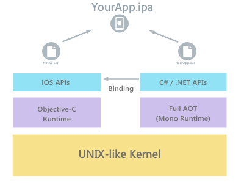
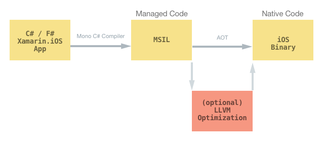
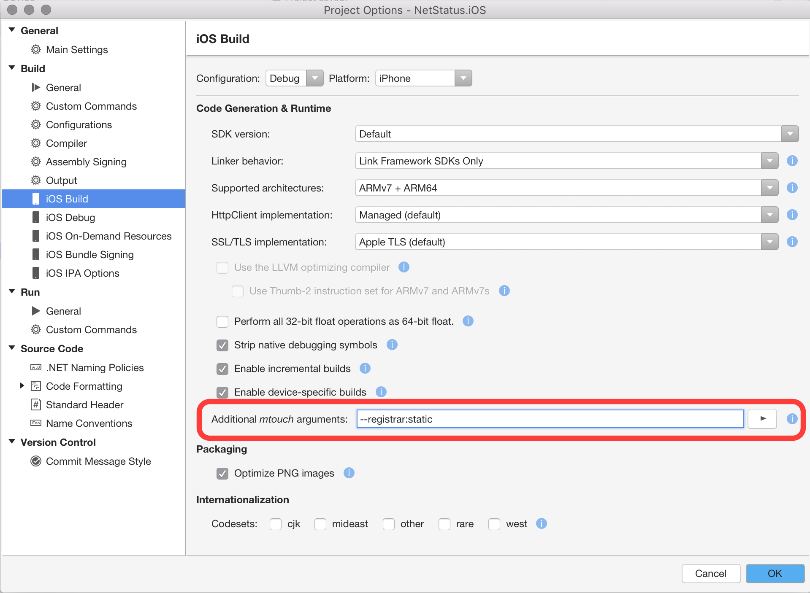

# iOS App Architecture

Xamarin.iOS applications run within the Mono execution environment,
and use full Ahead of Time (AOT) compilation  to compile C# code to ARM assembly
language. This runs side-by-side with the [Objective-C Runtime](https://developer.apple.com/library/mac/documentation/Cocoa/Reference/ObjCRuntimeRef/). Both runtime
environments run on top of a UNIX-like kernel, specifically [XNU](https://en.wikipedia.org/wiki/XNU), and expose
various APIs to the user code allowing developers to access the underlying
native or managed system.

The diagram below shows a basic overview of this architecture:

[](architecture-images/ios-arch.png#lightbox)

## Native and Managed code: An Explanation

When developing for Xamarin the terms *native and managed* code are often used. [Managed
code](/archive/blogs/brada/what-is-managed-code) is code that has its execution managed by the [.NET Framework Common
Language Runtime](/dotnet/standard/clr), or in Xamarin’s case: the Mono Runtime. This is what we call
an intermediate language.

Native code is code that will run natively
on the specific platform (for example, Objective-C or even AOT compiled code, on
an ARM chip). This guide explores how AOT compiles your managed code to native
code, and explains how a Xamarin.iOS application works, making full use of
Apple’s iOS APIs through the use of bindings, while also having access to .NET’s
BCL and a sophisticated language such as C#.

## AOT

When you compile any Xamarin platform application, the Mono C# (or F#)
compiler will run and will compile your C# and F# code into Microsoft
Intermediate Language (MSIL). If you are running a Xamarin.Android, a
Xamarin.Mac application, or even a Xamarin.iOS application on the simulator, the
[.NET Common Language Runtime (CLR)](/dotnet/standard/clr) compiles the MSIL using a Just in Time (JIT)
compiler. At runtime this is compiled into a native code, which can run on the
correct architecture for your application.

However, there is a security
restriction on iOS, set by Apple, which disallows the execution of dynamically
generated code on a device.
To ensure that we adhere to these safety protocols,
Xamarin.iOS instead uses an Ahead of Time (AOT) compiler to compile the managed
code. This produces a native iOS binary, optionally optimized with LLVM for devices, that
can be deployed on Apple’s ARM-based processor. A rough diagram of how this fits
together is illustrated below:

[](architecture-images/aot-large.png#lightbox)

Using AOT has a number of limitations, which are detailed in the [Limitations](~/ios/internals/limitations.md)
guide. It also provides a number of improvements over JIT through a reduction in the startup time, and various performance optimizations

Now that we have explored how the code is compiled from source to native code, let’s
take a look under the hood to see how Xamarin.iOS allows us to write fully
native iOS applications

## Selectors

With Xamarin, we have two separate ecosystems, .NET and Apple, that we need
to bring together to seem as streamlined as possible, to ensure that the end
goal is a smooth user experience. We have seen in the section above how the two
runtimes communicate, and you may very well have heard of the term ‘bindings’
which allows the native iOS APIs to be used in Xamarin. Bindings are explained
in depth in our [Objective-C binding](~/cross-platform/macios/binding/overview.md) documentation, so for now let’s explore how
iOS works under the hood.

First, there has to be a way to expose Objective-C to
C#, which is done via Selectors. A selector is a message which is sent to an
object or class. With Objective-C this is done via the [objc_msgSend](~/cross-platform/macios/binding/overview.md) functions.
For more information on using Selectors, refer to the [Objective-C Selectors](~/ios/internals/objective-c-selectors.md)
guide. There also has to be a way to expose managed code to Objective-C, which
is more complicated due to the fact that Objective-C doesn’t know anything about
the managed code. To get around this, we use *Registrars*. These are explained in
more detail in the next section.

## Registrars

As mentioned above, the registrar is
code that exposes managed code to Objective-C. It does this by creating a
list of every managed class that derives from NSObject:

- For all classes that
are not wrapping an existing Objective-C class, it creates a new Objective-C
class with Objective-C members mirroring all the managed members that have an
[`Export`] attribute.

- In the implementations for each Objective–C member,
code is added automatically to call the mirrored managed member.

The pseudo-code below shows an example
of how this is done:

**C# (Managed Code)**

```csharp
 class MyViewController : UIViewController{
     [Export ("myFunc")]
     public void MyFunc ()
     {
     }
 }
```

**Objective-C:**

```objectivec
@interface MyViewController : UIViewController { }

    -(void)myFunc;
@end

@implementation MyViewController {}

    -(void) myFunc
    {
        /* code to call the managed MyViewController.MyFunc method */
    }
@end

```

The managed code can contain the attributes, `[Register]` and `[Export]`, that the
registrar uses to know that the object needs to be exposed to Objective-C.
The `[Register]` attribute is used to specify the name of the generated Objective-C class
in case the default generated name is not suitable. All classes derived from NSObject
are automatically registered with Objective-C.
The required `[Export]` attribute contains a string, which is the selector used in the
generated Objective-C class.

There are two types of registrars used in Xamarin.iOS – dynamic and static:

- **Dynamic registrars** – The dynamic registrar does the registration of all types in
your assembly at runtime. It does this by using functions provided by
[Objective-C’s runtime API](https://developer.apple.com/library/mac/documentation/Cocoa/Reference/ObjCRuntimeRef/). The dynamic registrar therefore has a slower startup,
but a faster build time. This is default for the iOS Simulator. Native functions
(usually in C), called trampolines, are used as method implementations when
using the dynamic registrars. They vary between different architectures.

- **Static registrars** – The static registrar generates Objective-C code during the
build, which is then compiled into a static library and linked into the
executable. This allows for a quicker startup, but takes longer during build
time. This is used by default for device builds. The static registrar can also
be used with the iOS simulator by passing `--registrar:static` as an `mtouch`
attribute in your project’s build options, as shown below:

    [](architecture-images/image1.png#lightbox)

For more information on the specifics of the iOS Type Registration system used
by Xamarin.iOS, refer to the [Type Registrar](~/ios/internals/registrar.md) guide.

## Application Launch

The entry point of all Xamarin.iOS executables is provided by a function called `xamarin_main`, which initializes mono.

Depending on the project type, the following is done:

- For regular iOS and tvOS applications, the managed Main method, provided by the Xamarin app is called. This managed Main method then calls `UIApplication.Main`, which is the entry point for Objective-C. UIApplication.Main is the binding for Objective-C's `UIApplicationMain` method.
- For extensions, the native function – `NSExtensionMain` or (`NSExtensionmain` for WatchOS extensions) – provided by Apple libraries is called. Since these projects are class libraries and not executable projects, there are no managed Main methods to execute.

All of this launch sequence is compiled into a static library, which is then
linked into your final executable so your app knows how to get off the ground.

At this point our app has started up, Mono is running, we are in managed code
and we know how to call native code and be called back. The next thing we need
to do is to actually start adding controls and make the app interactive.

## Generator

Xamarin.iOS contains definitions for every single iOS API. You can
browse through any of these on the [MaciOS github repo](https://github.com/xamarin/xamarin-macios/tree/master/src). These definitions contain
interfaces with attributes, as well as any necessary methods and properties. For
example, the following code is used to define a UIToolbar in the UIKit
[namespace](https://github.com/xamarin/xamarin-macios/blob/master/src/uikit.cs#L11277-L11327). Notice that it is an interface with a number of methods and
properties:

```csharp
[BaseType (typeof (UIView))]
public interface UIToolbar : UIBarPositioning {
    [Export ("initWithFrame:")]
    IntPtr Constructor (CGRect frame);

    [Export ("barStyle")]
    UIBarStyle BarStyle { get; set; }

    [Export ("items", ArgumentSemantic.Copy)][NullAllowed]
    UIBarButtonItem [] Items { get; set; }

    [Export ("translucent", ArgumentSemantic.Assign)]
    bool Translucent { [Bind ("isTranslucent")] get; set; }

    // done manually so we can keep this "in sync" with 'Items' property
    //[Export ("setItems:animated:")][PostGet ("Items")]
    //void SetItems (UIBarButtonItem [] items, bool animated);

    [Since (5,0)]
    [Export ("setBackgroundImage:forToolbarPosition:barMetrics:")]
    [Appearance]
    void SetBackgroundImage ([NullAllowed] UIImage backgroundImage, UIToolbarPosition position, UIBarMetrics barMetrics);

    [Since (5,0)]
    [Export ("backgroundImageForToolbarPosition:barMetrics:")]
    [Appearance]
    UIImage GetBackgroundImage (UIToolbarPosition position, UIBarMetrics barMetrics);

    ...
}
```

The Generator, called [`btouch`](https://github.com/xamarin/xamarin-macios/blob/master/src/btouch.cs) in Xamarin.iOS, takes these definition
files and uses .NET tools to [compile them into a temporary assembly](https://github.com/xamarin/xamarin-macios/blob/master/src/btouch.cs#L318). However, this temporary assembly is not useable to call Objective-C code. The generator then reads the temporary assembly and generates C# code that can be used at runtime.
This is why, for example, if you add a random attribute to your definition .cs
file, it won’t show up in the outputted code. The generator doesn’t know about
it and therefore `btouch` doesn't know to look for it in the temporary assembly to
output it.

Once the Xamarin.iOS.dll has been created, mtouch will bundle all the components together.

At a high level, it achieves this by executing the following
tasks:

- Create an app bundle structure.
- Copy in your managed assemblies.
- If linking is enabled, run the managed linker to optimize your assemblies by
ripping unused parts out.
- AOT compilation.
- Create a native executable, which outputs a series of static libraries (one for each assembly) that are linked into the native executable, so that the native executable consists of the launcher code, the registrar code (if static), and all the outputs from the AOT compiler

For more detailed information on the linker and how it is
used, refer to the [Linker](~/ios/deploy-test/linker.md) guide.

## Summary

This guide looked at AOT compilation of Xamarin.iOS apps, and explored
Xamarin.iOS and its relationship to Objective-C in depth.

## Related Links

- [Limitations](~/ios/internals/limitations.md)
- [Binding Objective-C](~/cross-platform/macios/binding/overview.md)
- [Objective-C Selectors](~/ios/internals/objective-c-selectors.md)
- [Type Registrar](~/ios/internals/registrar.md)
- [Linker](~/ios/deploy-test/linker.md)