# Walkthrough: Binding an iOS Objective-C Library

> [!IMPORTANT]
> We're currently investigating custom binding usage on the Xamarin platform. Please take [**this survey**](https://www.surveymonkey.com/r/KKBHNLT) to inform future development efforts.

_This article provides a hands-on walkthrough of creating a Xamarin.iOS binding for an existing Objective-C library, InfColorPicker. It covers topics such as compiling a static Objective-C library, binding it, and using the binding in a Xamarin.iOS application._

When working on iOS, you might encounter cases where you want to consume a third-party Objective-C library. In those situations, you can use a Xamarin.iOS _Binding Project_ to create a [C# binding](~/cross-platform/macios/binding/overview.md) that will allow you to consume the library in your Xamarin.iOS applications.

Generally in the iOS ecosystem you can find libraries in 3 flavors:

- As a precompiled static library file with `.a` extension together with its header(s) (.h files). For example, [Google’s Analytics Library](https://developers.google.com/analytics/devguides/collection/ios/v3/sdk-download?hl=es#download_sdk)
- As a precompiled Framework. This is just a folder containing the static library, headers and sometimes additional resources with `.framework` extension. For example, [Google’s AdMob Library](https://developers.google.com/admob/ios/download).
- As just source code files. For example, a library containing just `.m` and `.h` Objective C files.

In the first and second scenario there will already be a precompiled CocoaTouch Static Library so in this article we will focus on the third scenario. Remember, before you start to create a binding, always check the licence provided with the library to ensure that you are free to bind it.

This article provides a step-by-step walkthrough of creating a binding project using the open source [InfColorPicker](https://github.com/InfinitApps/InfColorPicker) Objective-C project as an example, however all information in this guide can be adapted for use with any third-party Objective-C library. The InfColorPicker library provides a reusable view controller that allows the user to select a color based on its HSB representation, making color selection more user-friendly.

[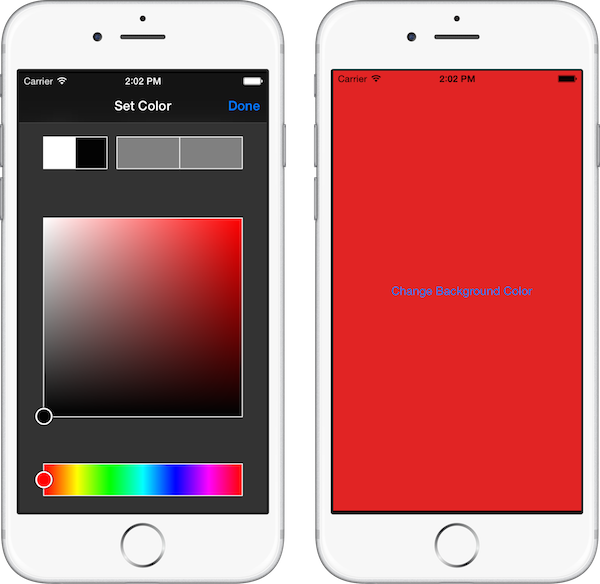](walkthrough-images/run01.png#lightbox)

We'll cover all the necessary steps to consume this particular Objective-C API in Xamarin.iOS:

- First, we'll create an Objective-C static library using Xcode.
- Then, we'll bind this static library with Xamarin.iOS.
- Next, show how Objective Sharpie can reduce the workload by automatically generating some (but not all) of the necessary API definitions required by the Xamarin.iOS binding.
- Finally, we'll create a Xamarin.iOS application that uses the binding.

The sample application will demonstrate how to use a strong delegate for communication between the InfColorPicker API and our C# code. After we've seen how to use a strong delegate, we'll cover how to use weak delegates to perform the same tasks.

## Requirements

This article assumes that you have some familiarity with Xcode and the Objective-C language and you have read our
[Binding Objective-C](~/cross-platform/macios/binding/index.md)
documentation. Additionally, the following is required to complete the steps presented:

- **Xcode and iOS SDK** - Apple's Xcode and the latest iOS API need to be installed and configured on the developer's computer.
- **[Xcode Command Line Tools](#Installing_the_Xcode_Command_Line_Tools)** - The Xcode Command Line Tools must be installed for the currently installed version of Xcode (see below for installation details).
- **Visual Studio for Mac or Visual Studio** - The latest version of Visual Studio for Mac or Visual Studio should be installed and configured on the development computer. An Apple Mac is required for developing a Xamarin.iOS application, and when using Visual Studio you must be connected to [a Xamarin.iOS build host](~/ios/get-started/installation/windows/connecting-to-mac/index.md)
- **The latest version of Objective Sharpie** - A current copy of the Objective Sharpie tool
  downloaded from [here](~/cross-platform/macios/binding/objective-sharpie/get-started.md). If you already have Objective Sharpie installed, you can update it to the latest version by using the `sharpie update`

<a name="Installing_the_Xcode_Command_Line_Tools"></a>

## Installing the Xcode Command Line Tools

# [Visual Studio for Mac](#tab/macos)

As stated above, we'll be using Xcode Command Line Tools (specifically `make` and `lipo`) in this walkthrough. The `make` command is a very common Unix utility that will automate the compilation of executable programs and libraries by using a _makefile_ that specifies how the program should be built. The `lipo` command is an OS X command line utility for creating multi-architecture files; it will combine multiple `.a` files into one file that can be used by all hardware architectures.

# [Visual Studio](#tab/windows)

As stated above, we'll be using Xcode Command Line Tools on the **Mac Build Host** (specifically `make` and `lipo`) in this walkthrough. The `make` command is a very common Unix utility that will automate the compilation of executable programs and libraries by using a _makefile_ to specifies how to build the program. The `lipo` command is an OS X command line utility for creating multi-architecture files; it will combine multiple `.a` files into one file that can be used by all hardware architectures.

-----

According to Apple's [Building from the Command Line with Xcode FAQ](https://developer.apple.com/library/ios/technotes/tn2339/_index.html) documentation, in OS X 10.9 and greater, the **Downloads** pane of Xcode **Preferences** dialog not longer supports the downloading command-line tools.

You'll need to use one of the following methods to install the tools:

- **Install Xcode** - When you install Xcode, it comes bundled with all your command-line tools. In OS X 10.9  shims (installed in `/usr/bin`), can map any tool included in `/usr/bin` to the corresponding tool inside Xcode. For example, the `xcrun` command, which allows you to find or run any tool inside Xcode from the command line.
- **The Terminal Application** - From the Terminal application, you can install the command line tools by running the `xcode-select --install` command:
  - Start the Terminal Application.
  - Type `xcode-select --install` and press **Enter**, for example:

  ```bash
  Europa:~ kmullins$ xcode-select --install
  ```

  - You'll be asked to install the command line tools, click the **Install** button:
    [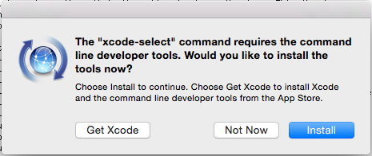](walkthrough-images/xcode01.png#lightbox)

  - The tools will be downloaded and installed from Apple's servers:
    [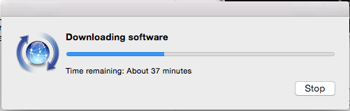](walkthrough-images/xcode02.png#lightbox)

- **Downloads for Apple Developers** - The Command Line Tools package is available the [Downloads for Apple Developers](https://developer.apple.com/downloads/index.action) web page. Log in with your Apple ID, then search for and download the Command Line Tools:
[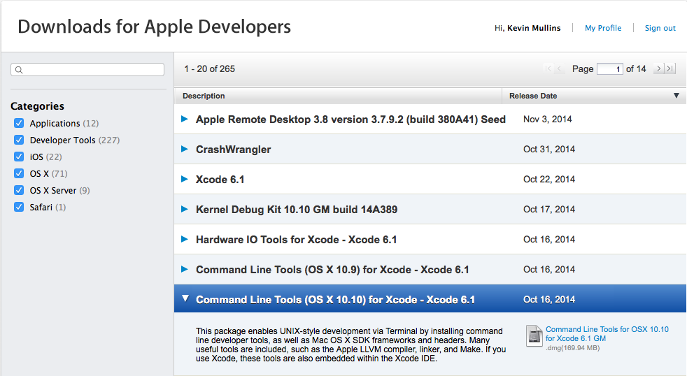](walkthrough-images/xcode03.png#lightbox)

With the Command Line Tools installed, we're ready to continue on with the walkthrough.

## Walkthrough

In this walkthrough, we'll cover the following steps:

- **[Create a Static Library](#Creating_A_Static_Library)** - This step involves creating a static library of the **InfColorPicker** Objective-C code. The static library will have the `.a` file extension, and will be embedded into the .NET assembly of the library project.
- **[Create a Xamarin.iOS Binding Project](#Create_a_Xamarin.iOS_Binding_Project)** - Once we have a static library, we will use it to create a Xamarin.iOS binding project. The binding project consists of the static library we just created and metadata in the form of C# code that explains how the Objective-C API can be used. This metadata is commonly referred to as the API definitions. We'll use **[Objective Sharpie](#Using_Objective_Sharpie)** to help us with create the API definitions.
- **[Normalize the API Definitions](#Normalize_the_API_Definitions)** - Objective Sharpie does a great job of helping us, but it can't do everything. We'll discuss some changes that we need to make to the API definitions before they can be used.
- **[Use the Binding Library](#Using_the_Binding)** - Finally, we'll create a Xamarin.iOS application to show how to use our newly created binding project.

Now that we understand what steps are involved, let's move on to the rest of the walkthrough.

<a name="Creating_A_Static_Library"></a>

## Creating A Static Library

If we inspect the code for InfColorPicker in Github:

[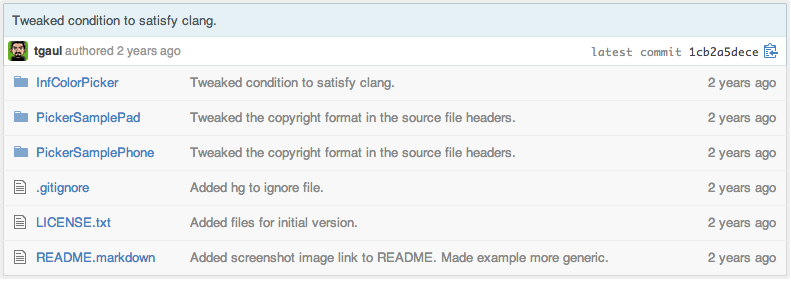](walkthrough-images/image02.png#lightbox)

We can see the following three directories in the project:

- **InfColorPicker** - This directory contains the Objective-C code for the project.
- **PickerSamplePad** - This directory contains a sample iPad project.
- **PickerSamplePhone** - This directory contains a sample iPhone project.

Let's download the InfColorPicker project from [GitHub](https://github.com/InfinitApps/InfColorPicker/archive/master.zip) and unzip it in the directory of our choosing. Opening up the Xcode target for `PickerSamplePhone` project, we see the following project structure in the Xcode Navigator:

[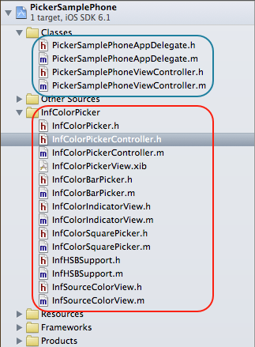](walkthrough-images/image03.png#lightbox)

This project achieves code reuse by directly adding the InfColorPicker source code (in the red box) into each sample project. The code for the sample project is inside the blue box. Because this particular project does not provide us with a static library, it is necessary for us create an Xcode project to compile the static library.

The first step is for us to add the InfoColorPicker source code into the Static Library. To achieve this let's do the following:

1. Start Xcode.
2. From the **File** menu select **New** > **Project...**:

    [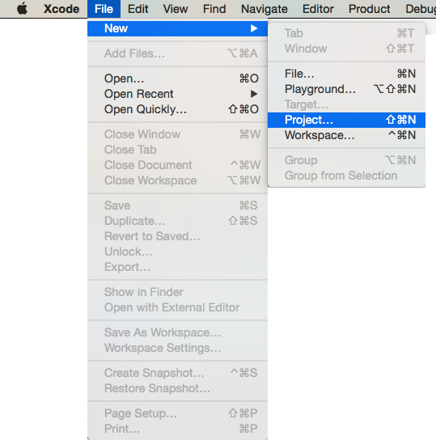](walkthrough-images/image04.png#lightbox)
3. Select **Framework & Library**, the **Cocoa Touch Static Library** template and click the **Next** button:

    [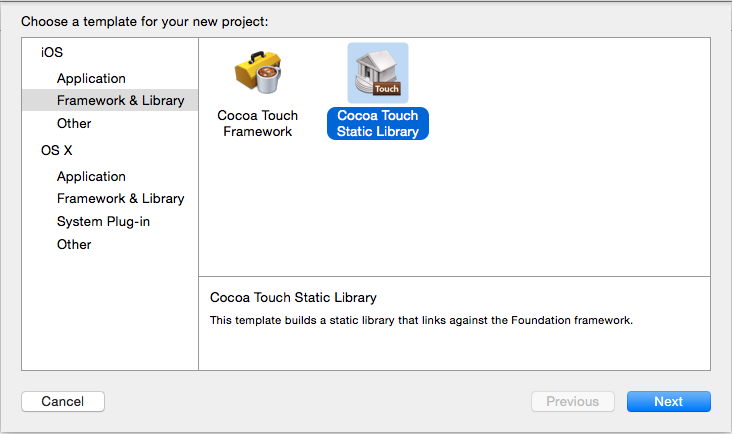](walkthrough-images/image05.png#lightbox)

4. Enter `InfColorPicker` for the **Project Name** and click the **Next** button:

    [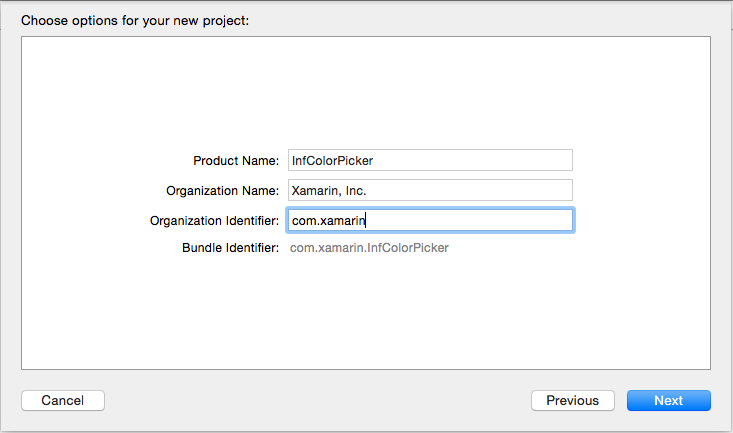](walkthrough-images/image06.png#lightbox)
5. Select a location to save the project and click the **OK** button.
6. Now we need to add the source from the InfColorPicker project to our static library project. Because the **InfColorPicker.h** file already exists in our static library (by default), Xcode will not allow us to overwrite it. From the **Finder**, navigate to the InfColorPicker source code in the original project that we unzipped from GitHub, copy all of the InfColorPicker files and paste them into our new static library project:

    [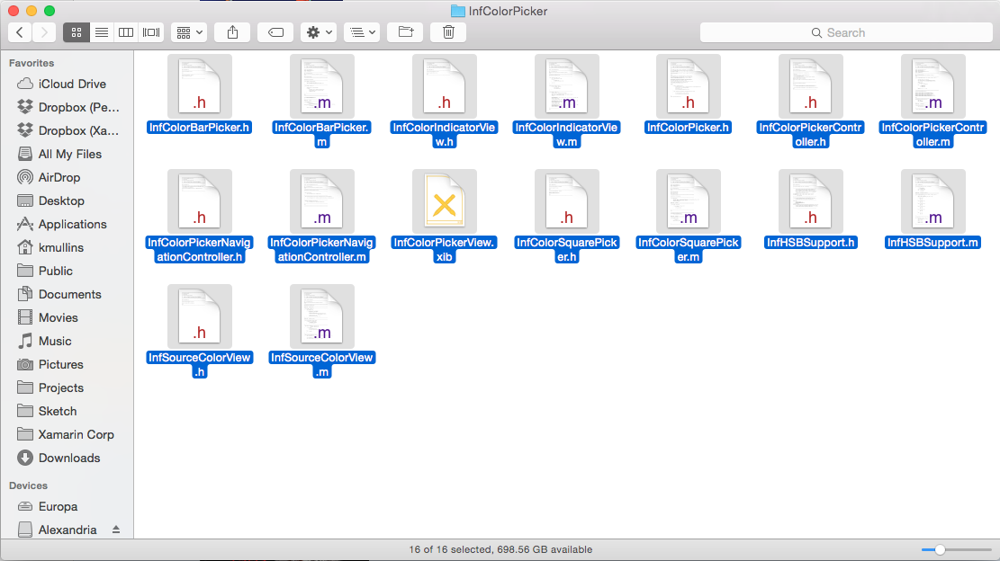](walkthrough-images/image12.png#lightbox)

7. Return to Xcode, right click on the **InfColorPicker** folder and select **Add files to "InfColorPicker..."**:

    [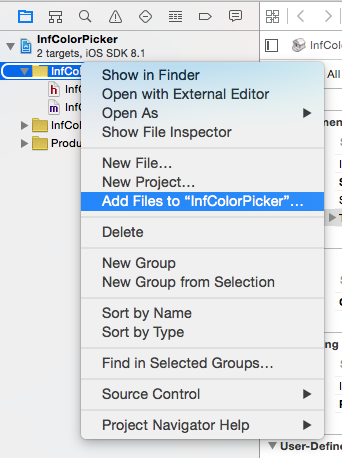](walkthrough-images/image08.png#lightbox)

8. From the Add Files dialog box, navigate to the InfColorPicker source code files that we just copied, select them all and click the **Add** button:

    [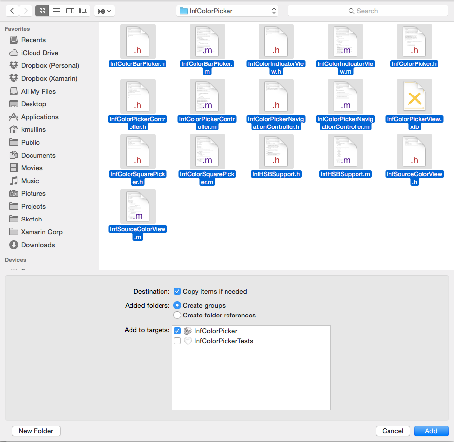](walkthrough-images/image09.png#lightbox)

9. The source code will be copied into our project:

    [](walkthrough-images/image10.png#lightbox)

10. From the Xcode Project Navigator, select the **InfColorPicker.m** file and comment out the last two lines (because of the way this library was written, this file is not used):

    [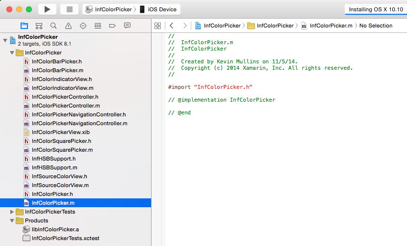](walkthrough-images/image14.png#lightbox)

11. We now need to check if there are any Frameworks required by the library. You can find this information either in the README, or by opening one of the sample projects provided. This example uses `Foundation.framework`, `UIKit.framework`, and `CoreGraphics.framework` so let's add them.

12. Select the **InfColorPicker target > Build Phases** and expand the **Link Binary With Libraries** section:

    [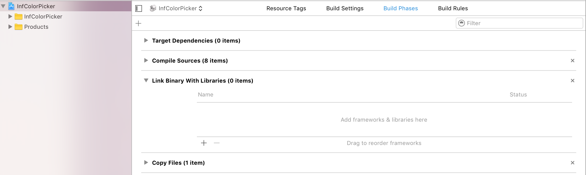](walkthrough-images/image16b.png#lightbox)

13. Use the **+** button to open the dialog allowing you to add the required frames frameworks listed above:

    [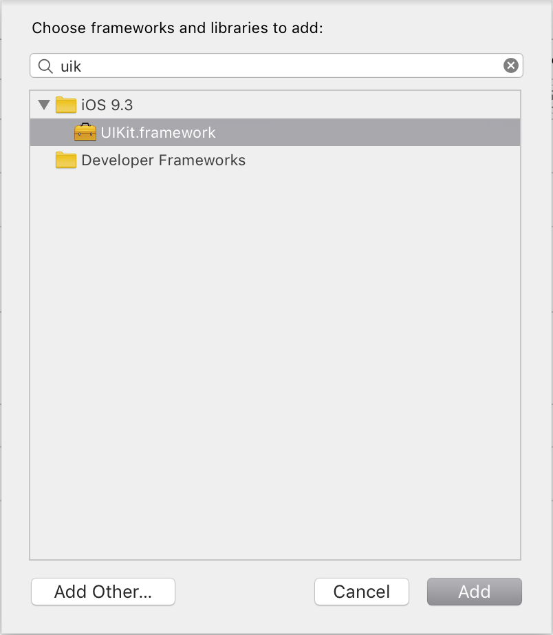](walkthrough-images/image16c.png#lightbox)

14. The **Link Binary With Libraries** section should now look like the image below:

    [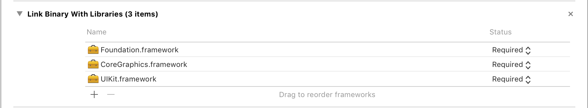](walkthrough-images/image16d.png#lightbox)

At this point we're close, but we're not quite done. The static library has been created, but we need to build it to create a Fat binary that includes all of the required architectures for both iOS device and iOS simulator.

### Creating a Fat Binary

All iOS devices have processors powered by ARM architecture that have developed over time. Each new architecture added new instructions and other improvements while still maintaining backwards compatibility. iOS devices have armv6, armv7, armv7s, arm64 instruction sets – although [armv6 not used any more](~/ios/deploy-test/compiling-for-different-devices.md). The iOS simulator is not powered by ARM and is instead a x86 and x86_64 powered simulator. That means libraries must be provided for each instruction set.

A Fat library is `.a` file containing all the supported architectures.

Creating a fat binary is a three step process:

- Compile an ARM 7 & ARM64 version of the static library.
- Compile an x86 and x84_64 version of the static library.
- Use the `lipo` command line tool to combine the two static libraries into one.

While these three steps are rather straightforward, it may be necessary to repeat them in the future when the Objective-C library receives updates or if we require bug fixes. If you decide to automate these steps, it will simplify the future maintenance and support of the iOS binding project.

There are many tools available to automate such tasks - a shell script, [rake](https://rake.rubyforge.org/), [xbuild](https://www.mono-project.com/docs/tools+libraries/tools/xbuild/), and make. When the Xcode Command Line tools are installed, `make` is also installed, so that is the build system that will be used for this walkthrough. Here is a **Makefile** that you can use to create a multi-architecture shared library that will work on an iOS device and the simulator for any library:

<!--markdownlint-disable MD010 -->
```makefile
XBUILD=/Applications/Xcode.app/Contents/Developer/usr/bin/xcodebuild
PROJECT_ROOT=./YOUR-PROJECT-NAME
PROJECT=$(PROJECT_ROOT)/YOUR-PROJECT-NAME.xcodeproj
TARGET=YOUR-PROJECT-NAME

all: lib$(TARGET).a

lib$(TARGET)-i386.a:
	$(XBUILD) -project $(PROJECT) -target $(TARGET) -sdk iphonesimulator -configuration Release clean build
	-mv $(PROJECT_ROOT)/build/Release-iphonesimulator/lib$(TARGET).a $@

lib$(TARGET)-armv7.a:
	$(XBUILD) -project $(PROJECT) -target $(TARGET) -sdk iphoneos -arch armv7 -configuration Release clean build
	-mv $(PROJECT_ROOT)/build/Release-iphoneos/lib$(TARGET).a $@

lib$(TARGET)-arm64.a:
	$(XBUILD) -project $(PROJECT) -target $(TARGET) -sdk iphoneos -arch arm64 -configuration Release clean build
	-mv $(PROJECT_ROOT)/build/Release-iphoneos/lib$(TARGET).a $@

lib$(TARGET).a: lib$(TARGET)-i386.a lib$(TARGET)-armv7.a lib$(TARGET)-arm64.a
	xcrun -sdk iphoneos lipo -create -output $@ $^

clean:
	-rm -f *.a *.dll
```
<!--markdownlint-enable MD010 -->

Enter the **Makefile** commands in the plain text editor of your choosing, and update the sections with **YOUR-PROJECT-NAME** with the name of your project. It is also important to ensure that you paste the instructions above exactly, with the tabs within the instructions preserved.

Save the file with the name **Makefile** to the same location as the InfColorPicker Xcode Static Library we created above:

[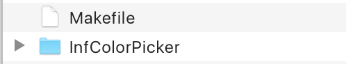](walkthrough-images/lib00.png#lightbox)

Open the Terminal Application on your Mac and navigate to the location of your Makefile. Type `make` into the Terminal, press **Enter** and the **Makefile** will be executed:

[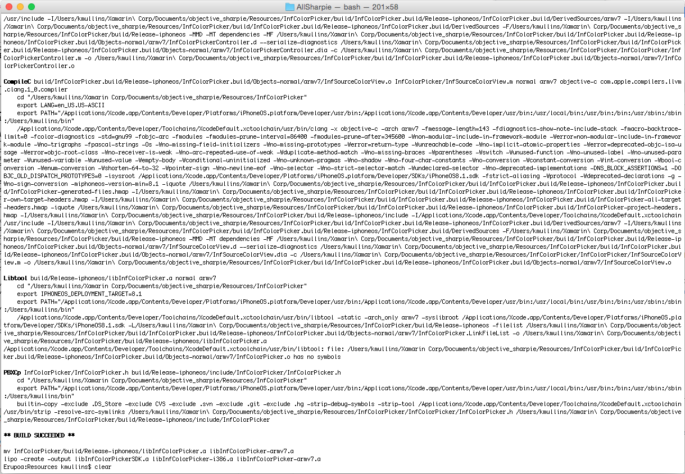](walkthrough-images/lib01.png#lightbox)

When you run make, you will see a lot of text scrolling by. If everything worked correctly, you'll see the words **BUILD SUCCEEDED** and the `libInfColorPicker-armv7.a`, `libInfColorPicker-i386.a` and `libInfColorPickerSDK.a` files will be copied to the same location as the **Makefile**:

[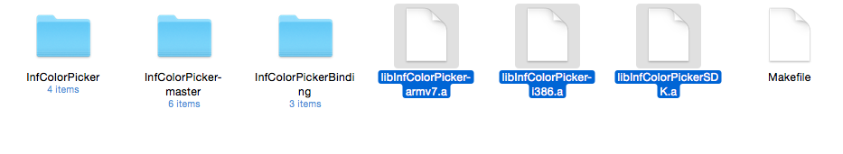](walkthrough-images/lib02.png#lightbox)

You can confirm the architectures within your Fat binary by using the following command:

```bash
xcrun -sdk iphoneos lipo -info libInfColorPicker.a
```

This should display the following:

```bash
Architectures in the fat file: libInfColorPicker.a are: i386 armv7 x86_64 arm64
```

At this point, we've completed the first step of our iOS binding by creating a static library using Xcode and the Xcode Command Line tools `make` and `lipo`. Let's move to the next step and use **Objective-Sharpie** to automate the creation of the API bindings for us.

<a name="Create_a_Xamarin.iOS_Binding_Project"></a>

## Create a Xamarin.iOS Binding Project

Before we can use **Objective-Sharpie** to automate the binding process, we need to create a Xamarin.iOS Binding Project to house the API Definitions (that we'll be using **Objective-Sharpie** to help us build) and create the C# binding for us.

Let's do the following:

# [Visual Studio for Mac](#tab/macos)

1. Start Visual Studio for Mac.
1. From the **File** menu, select **New** > **Solution...**:

    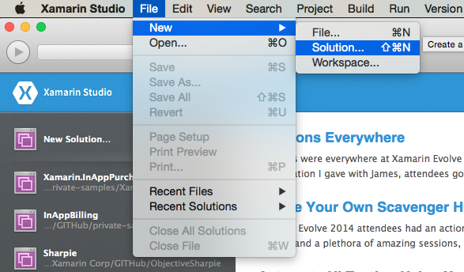

1. From the New Solution dialog box, select **Library** > **iOS Binding Project**:

    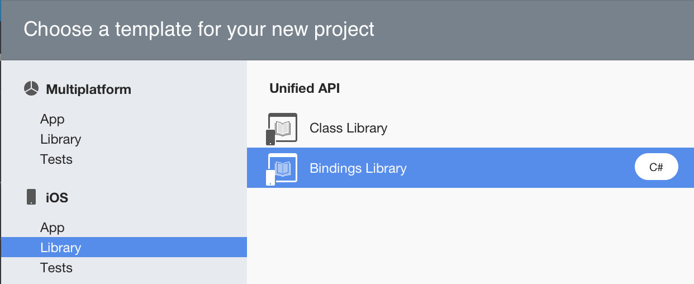

1. Click the **Next** button.

1. Enter "InfColorPickerBinding" as the **Project Name** and click the **Create** button to create the solution:

    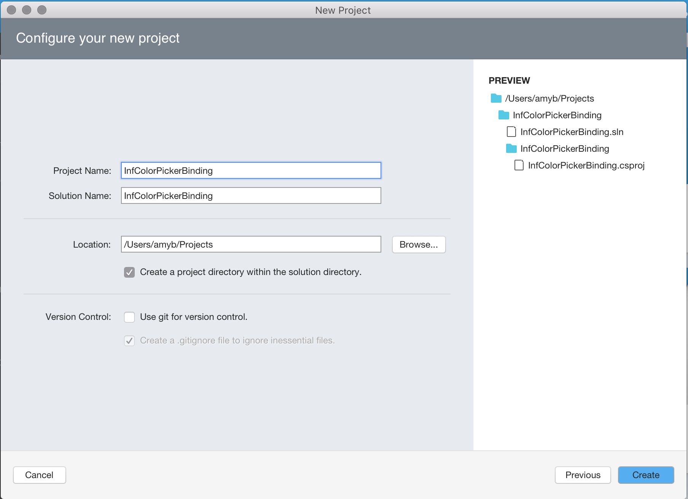

The solution will be created and two default files will be included:

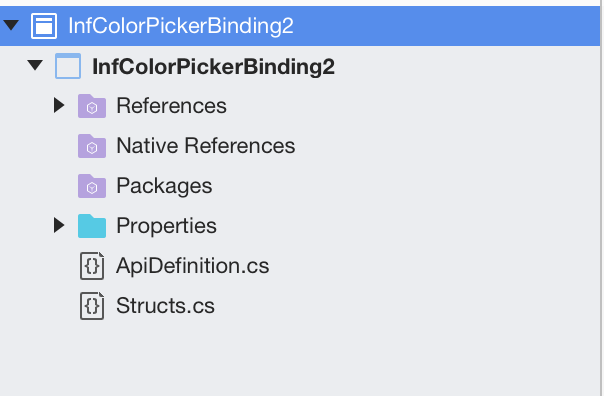

# [Visual Studio](#tab/windows)

1. Start Visual Studio.

1. From the **File** menu, select **New** > **Project...**:

    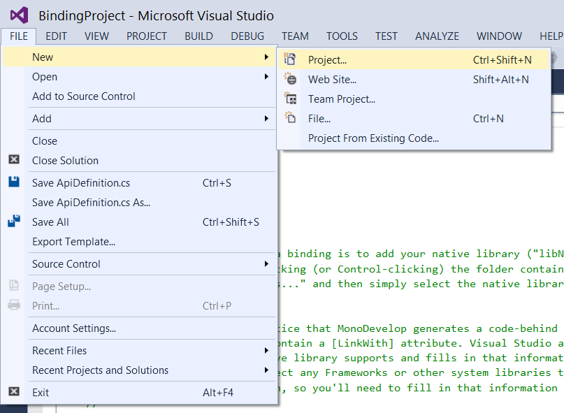

1. From the New Project dialog box, select **Visual C# > iPhone & iPad > iOS Bindings Library (Xamarin)**:

    [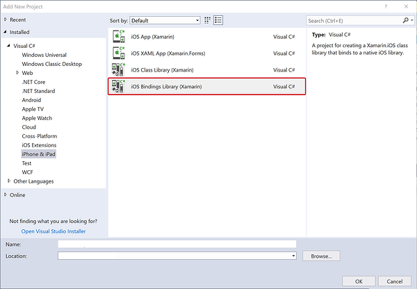](walkthrough-images/bind02.w157.png#lightbox)

1. Enter "InfColorPickerBinding" as the **Name** and click the **OK** button to create the solution.

The solution will be created and two default files will be included:

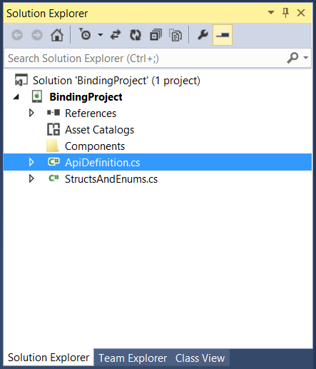

-----

- **ApiDefinition.cs** - This file will contain the contracts that define how Objective-C API's will be wrapped in C#.
- **Structs.cs** - This file will hold any structures or enumeration values that are required by the interfaces and delegates.

We'll be working with these two files later in the walkthrough. First, we need to add the InfColorPicker library to the binding project.

### Including the Static Library in the Binding Project

Now we have our base Binding Project ready, we need to add the Fat Binary library we created above for the **InfColorPicker** library.

Follow these steps to add the library:

# [Visual Studio for Mac](#tab/macos)

1. Right-click on the **Native References** folder in the Solution Pad and select **Add Native References**:

    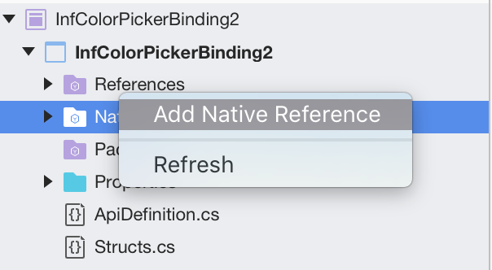

1. Navigate to the Fat Binary we made earlier (`libInfColorPickerSDK.a`) and press the **Open** button:

    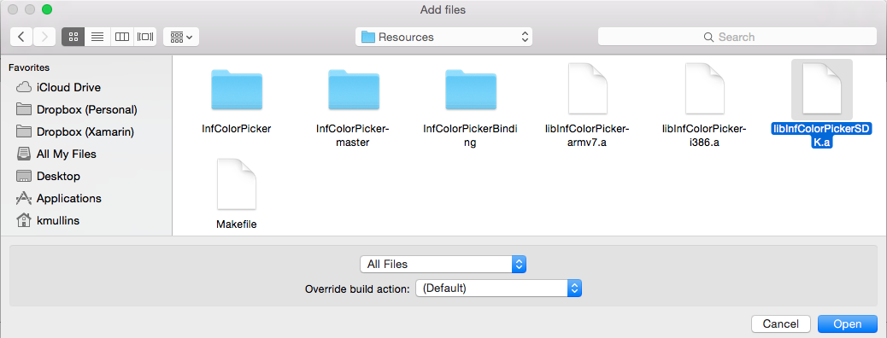
1. The file will be included in the project:

    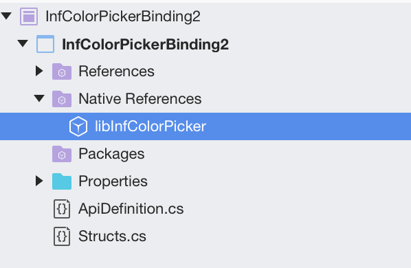

# [Visual Studio](#tab/windows)

1. Copy the `libInfColorPickerSDK.a` from your **Mac Build Host** and paste it into your binding project.

1. Right-click on the project and choose **Add > Existing Item...**:

    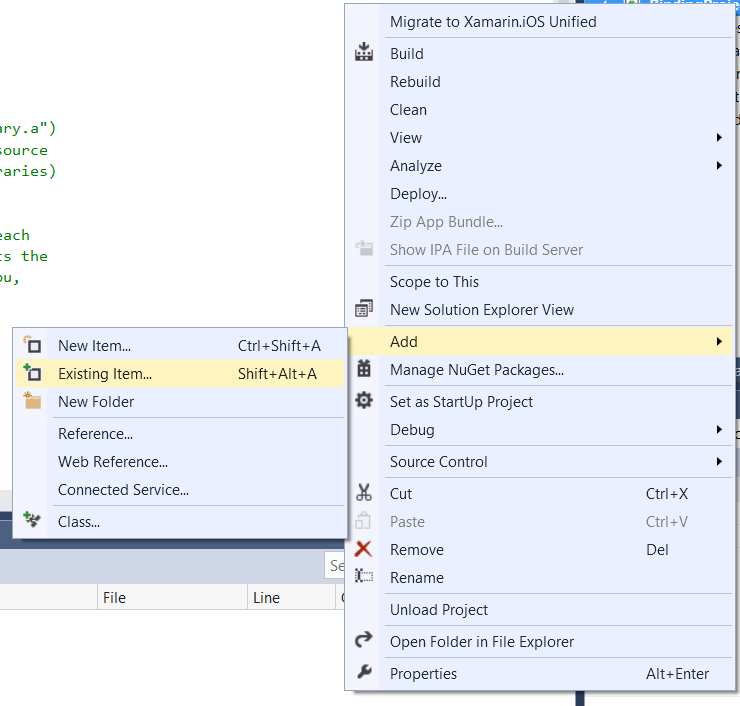

1. Navigate to the `libInfColorPickerSDK.a` and press the **Add** button:

    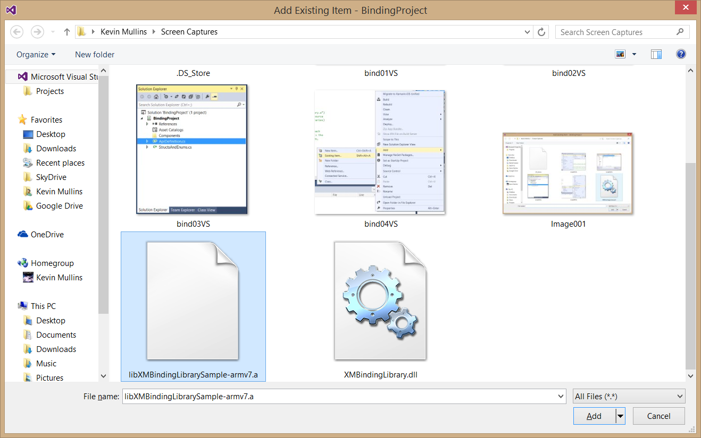

1. The file will be included in the project.

-----

When the **.a** file is added to the project, Xamarin.iOS will automatically set the **Build Action** of the file to **ObjcBindingNativeLibrary**, and create a special file called `libInfColorPickerSDK.linkwith.cs`.

This file contains the `LinkWith` attribute that tells Xamarin.iOS how handle the static library that we just added. The contents of this file are shown in the following code snippet:

```csharp
using ObjCRuntime;

[assembly: LinkWith ("libInfColorPickerSDK.a", SmartLink = true, ForceLoad = true)]
```

The `LinkWith` attribute identifies the static library for the project and some important linker flags.

The next thing we need to do is to create the API definitions for the InfColorPicker project. For the purposes of this walkthrough, we will use Objective Sharpie to generate the file **ApiDefinition.cs**.

<a name="Using_Objective_Sharpie"></a>

## Using Objective Sharpie

# [Visual Studio for Mac](#tab/macos)

Objective Sharpie is a command line tool (provided by Xamarin) that can assist in creating the definitions required to bind a 3rd party Objective-C library to C#. In this section, we'll use Objective Sharpie to create the initial **ApiDefinition.cs** for the InfColorPicker project.

# [Visual Studio](#tab/windows)

Objective Sharpie is a command line tool (provided by Xamarin) that can assist in creating the definitions required to bind a 3rd party Objective-C library to C#. In this section, we'll use Objective Sharpie on our **Mac Build Host** to create the initial **ApiDefinition.cs** for the InfColorPicker project.

-----

To get started, let's download Objective Sharpie installer file as detailed in this [guide](~/cross-platform/macios/binding/objective-sharpie/get-started.md#installing). Run the installer and follow all of the onscreen prompts from the install wizard to install Objective Sharpie on our development computer.

After we have Objective Sharpie successfully installed, let's start the Terminal app and enter the following command to get help on all of the tools that it provides to assist in binding:

```bash
sharpie -help
```

If we execute the above command, the following output will be generated:

```bash
Europa:Resources kmullins$ sharpie -help
usage: sharpie [OPTIONS] TOOL [TOOL_OPTIONS]

Options:
  -h, --helpShow detailed help
  -v, --versionShow version information

Available Tools:
  xcode              Get information about Xcode installations and available SDKs.
  pod                Create a Xamarin C# binding to Objective-C CocoaPods
  bind               Create a Xamarin C# binding to Objective-C APIs
  update             Update to the latest release of Objective Sharpie
  verify-docs        Show cross reference documentation for [Verify] attributes
  docs               Open the Objective Sharpie online documentation
```

For the purpose of this walkthrough, we will be using the following Objective Sharpie tools:

- **xcode** - This tools gives us information about our current Xcode install and the versions of iOS and Mac APIs that we have installed. We will be using this information later when we generate our bindings.
- **bind** - We'll use this tool to parse the **.h** files in the InfColorPicker project into the initial **ApiDefinition.cs** and **StructsAndEnums.cs** files.

To get help on a specific Objective Sharpie tool, enter the name of the tool and the `-help` option. For example, `sharpie xcode -help` returns the following output:

```bash
Europa:Resources kmullins$ sharpie xcode -help
usage: sharpie xcode [OPTIONS]+

Options:
  -h, -help           Show detailed help
  -v, -verbose        Be verbose with output

Xcode Options:
  -sdks               List all available Xcode SDKs. Pass -verbose for more
                        details.
  -sdkpath SDK        Output the path of the SDK
  -frameworks SDK     List all available framework directories in a given SDK.
```

Before we can start the binding process, we need to get information about our current installed SDKs by entering the following command into the Terminal `sharpie xcode -sdks`:

```bash
amyb:Desktop amyb$ sharpie xcode -sdks
sdk: appletvos9.2    arch: arm64
sdk: iphoneos9.3     arch: arm64   armv7
sdk: macosx10.11     arch: x86_64  i386
sdk: watchos2.2      arch: armv7
```

From the above, we can see that we have the `iphoneos9.3` SDK installed on our machine. With this information in place, we are ready to parse the InfColorPicker project `.h` files into the initial **ApiDefinition.cs** and `StructsAndEnums.cs` for the InfColorPicker project.

Enter the following command in the Terminal app:

```bash
sharpie bind --output=InfColorPicker --namespace=InfColorPicker --sdk=[iphone-os] -scope [full-path-to-project]/InfColorPicker/InfColorPicker [full-path-to-project]/InfColorPicker/InfColorPicker/*.h
```

Where `[full-path-to-project]` is the full path to the directory where the **InfColorPicker** Xcode project file is located on our computer, and [iphone-os] is the iOS SDK that we have installed, as noted by the `sharpie xcode -sdks` command. Note that in this example we've passed **\*.h** as a parameter, which includes *all* the header files in this directory - normally you should NOT do this, but instead carefully read through the header files to find the top-level **.h** file that references all the other relevant files, and just pass that to Objective Sharpie. 

> [!TIP] 
> For the `-scope` argument, pass in the folder that has the headers you want to bind. 
> Without the `-scope` argument, Objective Sharpie will try to generate bindings for any 
> iOS SDK headers that are imported, e.g. `#import <UIKit.h>`, resulting in a huge definitions 
> file that will likely generate errors when compiling the binding project. With the `-scope` 
> argument set, Objective Sharpie will not generate bindings for any headers outside of the 
> scoped folder. 

The following [output](walkthrough-images/os05.png) will be generated in the terminal:

```bash
Europa:Resources kmullins$ sharpie bind -output InfColorPicker -namespace InfColorPicker -sdk iphoneos8.1 /Users/kmullins/Projects/InfColorPicker/InfColorPicker/InfColorPicker.h -unified
Compiler configuration:
    -isysroot /Applications/Xcode.app/Contents/Developer/Platforms/iPhoneOS.platform/Developer/SDKs/iPhoneOS.sdk -miphoneos-version-min=8.1 -resource-dir /Library/Frameworks/ObjectiveSharpie.framework/Versions/1.1.1/clang-resources -arch armv7 -ObjC

[  0%] parsing /Users/kmullins/Projects/InfColorPicker/InfColorPicker/InfColorPicker.h
In file included from /Users/kmullins/Projects/InfColorPicker/InfColorPicker/InfColorPicker.h:60:
/Users/kmullins/Projects/InfColorPicker/InfColorPicker/InfColorPickerController.h:28:1: warning: no 'assign',
      'retain', or 'copy' attribute is specified - 'assign' is assumed [-Wobjc-property-no-attribute]
@property (nonatomic) UIColor* sourceColor;
^
/Users/kmullins/Projects/InfColorPicker/InfColorPicker/InfColorPickerController.h:28:1: warning: default property
      attribute 'assign' not appropriate for non-GC object [-Wobjc-property-no-attribute]
/Users/kmullins/Projects/InfColorPicker/InfColorPicker/InfColorPickerController.h:29:1: warning: no 'assign',
      'retain', or 'copy' attribute is specified - 'assign' is assumed [-Wobjc-property-no-attribute]
@property (nonatomic) UIColor* resultColor;
^
/Users/kmullins/Projects/InfColorPicker/InfColorPicker/InfColorPickerController.h:29:1: warning: default property
      attribute 'assign' not appropriate for non-GC object [-Wobjc-property-no-attribute]
4 warnings generated.
[100%] parsing complete
[bind] InfColorPicker.cs
Europa:Resources kmullins$
```

And the **InfColorPicker.enums.cs** and **InfColorPicker.cs** files will be created in our directory:

[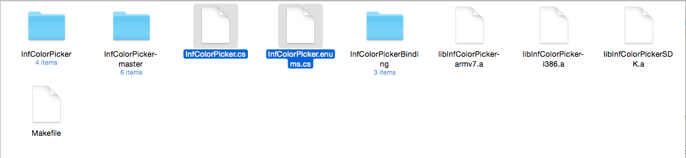](walkthrough-images/os06.png#lightbox)

# [Visual Studio for Mac](#tab/macos)

Open both of these files in the Binding project that we created above. Copy the contents of the **InfColorPicker.cs** file and paste it into the **ApiDefinition.cs** file, replacing the existing `namespace ...` code block with the contents of the **InfColorPicker.cs** file (leaving the `using` statements intact):

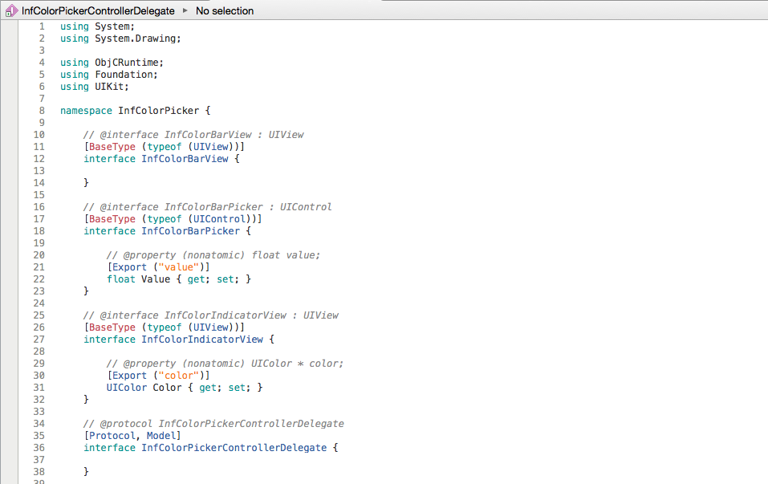

# [Visual Studio](#tab/windows)

Open both of these files in the Binding project that we created above. Copy the contents of the **InfColorPicker.cs** file (from the **Mac Build Host**) and paste it into the **ApiDefinition.cs** file, replacing the existing `namespace ...` code block with the contents of the **InfColorPicker.cs** file (leaving the `using` statements intact).

-----

<a name="Normalize_the_API_Definitions"></a>

## Normalize the API Definitions

Objective Sharpie sometimes has an issue translating `Delegates`, so we will need to modify the definition of the `InfColorPickerControllerDelegate` interface and replace the `[Protocol, Model]` line with the following:

```csharp
[BaseType(typeof(NSObject))]
[Model]
```

So that the definition looks like:

[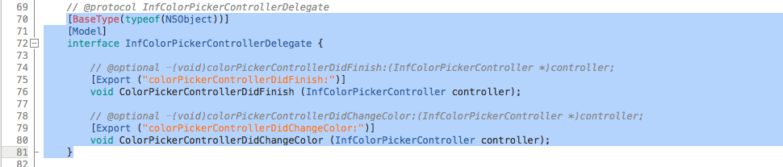](walkthrough-images/os11.png#lightbox)

Next, we do the same thing with the contents of the `InfColorPicker.enums.cs` file, copying and pasting them in the `StructsAndEnums.cs` file leaving the `using` statements intact:

[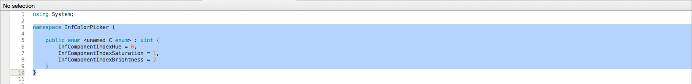](walkthrough-images/os09.png#lightbox)

You may also find that Objective Sharpie has annotated the binding with `[Verify]` attributes. These attributes indicate that you should verify that Objective Sharpie did the correct thing by comparing the binding with the original C/Objective-C declaration (which will be provided in a comment above the bound declaration). Once you have verified the bindings, you should remove the verify attribute. For more information, refer to the [Verify](~/cross-platform/macios/binding/objective-sharpie/platform/verify.md) guide.

# [Visual Studio for Mac](#tab/macos)

At this point, our binding project should be complete and ready to build. Let's build our binding project and make sure that we ended up with no errors:

[Build the binding project and make sure there are no errors](walkthrough-images/os12.png)

# [Visual Studio](#tab/windows)

At this point, our binding project should be complete and ready to build. Let's build our binding project and make sure that we ended up with no errors.

-----

<a name="Using_the_Binding"></a>

## Using the Binding

Follow these steps to create a sample iPhone application to use the iOS Binding Library created above:

# [Visual Studio for Mac](#tab/macos)

1. **Create Xamarin.iOS Project** - Add a new Xamarin.iOS project called **InfColorPickerSample** to the solution, as shown in the following screenshots:

    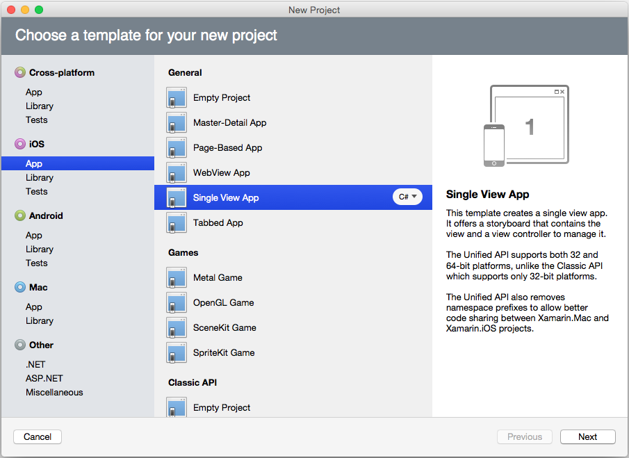

    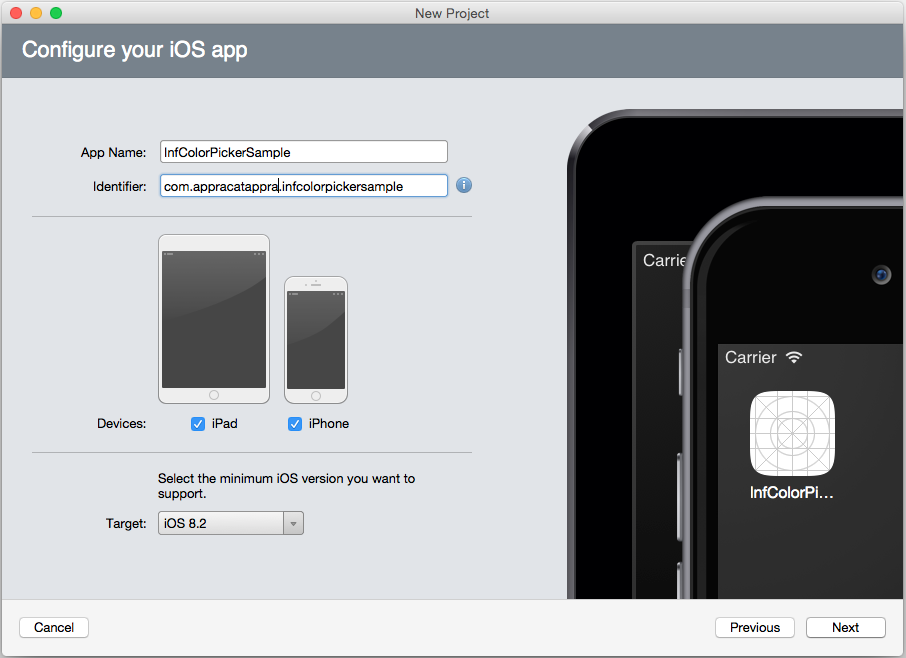

1. **Add Reference to the Binding Project** - Update the **InfColorPickerSample** project so that it has a reference to the **InfColorPickerBinding** project:

    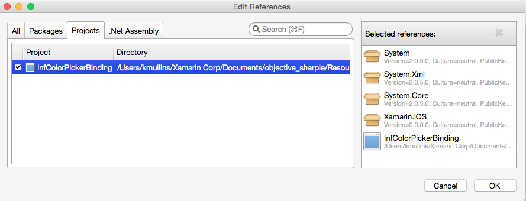

1. **Create the iPhone User Interface** - Double click on the **MainStoryboard.storyboard** file in the **InfColorPickerSample** project to edit it in the iOS Designer. Add a **Button** to the view and call it `ChangeColorButton`, as shown in the following:

    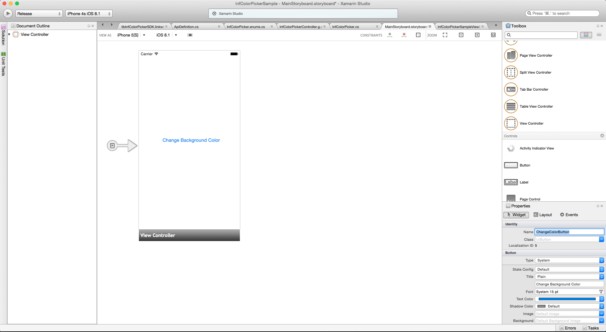

1. **Add the InfColorPickerView.xib** - The InfColorPicker Objective-C library includes a **.xib** file. Xamarin.iOS will not include this **.xib** in the binding project, which will cause run-time errors in our sample application. The workaround for this is to add the **.xib** file to our Xamarin.iOS project. Select the Xamarin.iOS project, right-click and select **Add > Add Files**, and add the **.xib** file as shown in the following screenshot:

    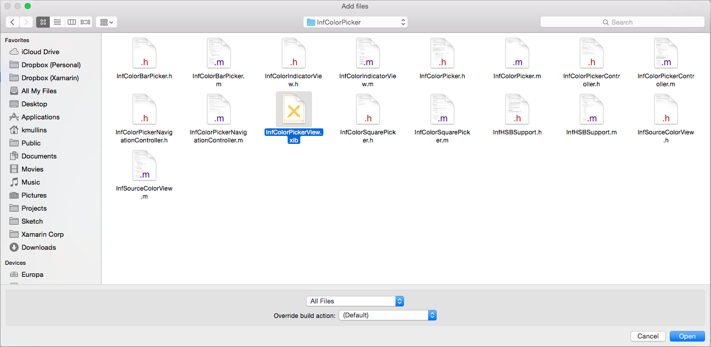

1. When asked, copy the **.xib** file into the project.

# [Visual Studio](#tab/windows)

1. **Create Xamarin.iOS Project** - Add a new Xamarin.iOS project named **InfColorPickerSample** using the **Single View App** template:

    [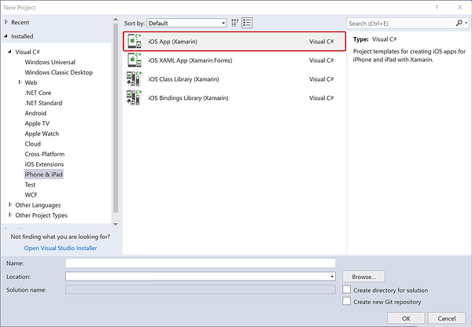](walkthrough-images/use01.w157.png#lightbox)

    [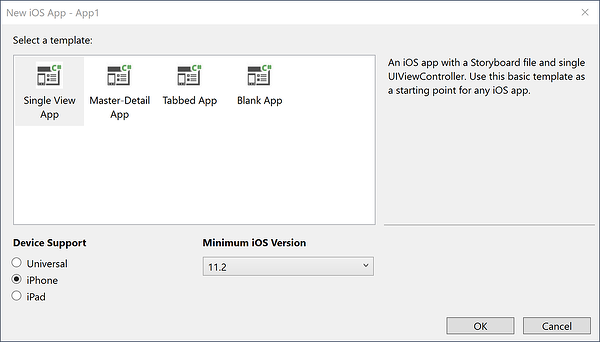](walkthrough-images/use01-2.w157.png#lightbox)

1. **Add Reference to the Binding Project** - Update the **InfColorPickerSample** project so that it has a reference to the **InfColorPickerBinding** project:

    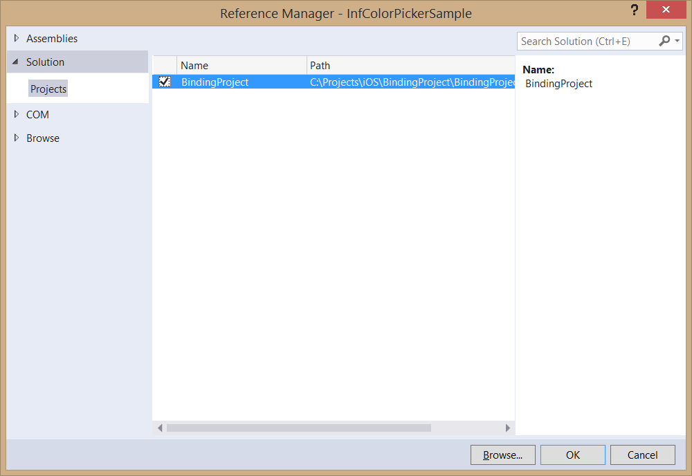

1. **Create the iPhone User Interface** - Double click on the **MainStoryboard.storyboard** file in the **InfColorPickerSample** project to edit it in the iOS Designer. Add a **Button** to the view and call it `ChangeColorButton`, as shown in the following:

    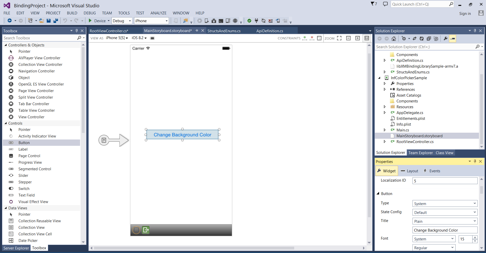

1. **Add the InfColorPickerView.xib** - The InfColorPicker Objective-C library includes a **.xib** file. Xamarin.iOS will not include this **.xib** in the binding project, which will cause run-time errors in our sample application. The workaround for this is to add the **.xib** file to our Xamarin.iOS project from our **Mac Build Host**. Select the Xamarin.iOS project, right-click and select **Add** > **Existing Item...**, and add the **.xib** file.

-----

Next, let's take a quick look at Protocols in Objective-C and how we handle them in binding and C# code.

### Protocols and Xamarin.iOS

In Objective-C, a protocol defines methods (or messages) that can be used in certain circumstances. Conceptually, they are very similar to interfaces in C#. One major difference between an Objective-C protocol and a C# interface is that protocols can have optional methods - methods that a class does not have to implement. Objective-C uses the @optional keyword is used to indicate which methods are optional. For more information on protocols see [Events, Protocols and Delegates](~/ios/app-fundamentals/delegates-protocols-and-events.md).

**InfColorPickerController** has one such protocol, shown in the code snippet below:

```csharp
@protocol InfColorPickerControllerDelegate

@optional

- (void) colorPickerControllerDidFinish: (InfColorPickerController*) controller;
// This is only called when the color picker is presented modally.

- (void) colorPickerControllerDidChangeColor: (InfColorPickerController*) controller;

@end
```

This protocol is used by **InfColorPickerController** to inform clients that the user has picked a new color and that the **InfColorPickerController** is finished. Objective Sharpie mapped this protocol as shown in the following code snippet:

```csharp
[BaseType(typeof(NSObject))]
[Model]
public partial interface InfColorPickerControllerDelegate {

    [Export ("colorPickerControllerDidFinish:")]
    void ColorPickerControllerDidFinish (InfColorPickerController controller);

    [Export ("colorPickerControllerDidChangeColor:")]
    void ColorPickerControllerDidChangeColor (InfColorPickerController controller);
}

```

When the binding library is compiled, Xamarin.iOS will create an abstract base class called `InfColorPickerControllerDelegate`, which implements this interface with virtual methods.

There are two ways that we can implement this interface in a Xamarin.iOS application:

- **Strong Delegate** - Using a strong delegate involves creating a C# class that subclasses `InfColorPickerControllerDelegate` and overrides the appropriate methods. **InfColorPickerController** will use an instance of this class to communicate with its clients.
- **Weak Delegate** - A weak delegate is a slightly different technique that involves creating a public method on some class (such as `InfColorPickerSampleViewController`) and then exposing that method to the `InfColorPickerDelegate` protocol via an `Export` attribute.

Strong delegates provide Intellisense, type safety, and better encapsulation. For these reasons, you should use strong delegates where you can, instead of a weak delegate.

In this walkthrough we will discuss both techniques: first implementing a strong delegate, and then explaining how to implement a weak delegate.

### Implementing a Strong Delegate

Finish the Xamarin.iOS application by using a strong delegate to respond to the `colorPickerControllerDidFinish:` message:

**Subclass InfColorPickerControllerDelegate** - Add a new class to the project called `ColorSelectedDelegate`. Edit the class so that it has the following code:

```csharp
using InfColorPickerBinding;
using UIKit;

namespace InfColorPickerSample
{
  public class ColorSelectedDelegate:InfColorPickerControllerDelegate
  {
    readonly UIViewController parent;

    public ColorSelectedDelegate (UIViewController parent)
    {
      this.parent = parent;
    }

    public override void ColorPickerControllerDidFinish (InfColorPickerController controller)
    {
      parent.View.BackgroundColor = controller.ResultColor;
      parent.DismissViewController (false, null);
    }
  }
}
```

Xamarin.iOS will bind the Objective-C delegate by creating an abstract base class called `InfColorPickerControllerDelegate`. Subclass this type and override the `ColorPickerControllerDidFinish` method to access the value of the `ResultColor` property of `InfColorPickerController`.

**Create a instance of ColorSelectedDelegate** - Our event handler will need an instance of the `ColorSelectedDelegate` type that we created in the previous step. Edit the class `InfColorPickerSampleViewController` and add the following instance variable to the class:

```csharp
ColorSelectedDelegate selector;
```

**Initialize the ColorSelectedDelegate variable** - To ensure that `selector` is a valid instance, update the method `ViewDidLoad` in `ViewController` to match the following snippet:

```csharp
public override void ViewDidLoad ()
{
  base.ViewDidLoad ();
  ChangeColorButton.TouchUpInside += HandleTouchUpInsideWithStrongDelegate;
  selector = new ColorSelectedDelegate (this);
}
```

**Implement the method HandleTouchUpInsideWithStrongDelegate** - Next implement the event handler for when the user touches **ColorChangeButton**. Edit `ViewController`, and add the following method:

```csharp
using InfColorPicker;
...

private void HandleTouchUpInsideWithStrongDelegate (object sender, EventArgs e)
{
    InfColorPickerController picker = InfColorPickerController.ColorPickerViewController();
    picker.Delegate = selector;
    picker.PresentModallyOverViewController (this);
}

```

We first obtain an instance of `InfColorPickerController` via a static method, and make that instance aware of our strong delegate via the property `InfColorPickerController.Delegate`. This property was automatically generated for us by Objective Sharpie. Finally we call `PresentModallyOverViewController` to show the view `InfColorPickerSampleViewController.xib` so that the user may select a color.

**Run the Application** - At this point we're done with all of our code. If you run the application, you should be able to change the background color of the `InfColorColorPickerSampleView` as shown in the following screenshots:

[](walkthrough-images/run01.png#lightbox)

Congratulations! At this point you've successfully created and bound an Objective-C library for use in a Xamarin.iOS application. Next, let's learn about using weak delegates.

### Implementing a Weak Delegate

Instead of subclassing a class bound to the Objective-C protocol for a particular delegate, Xamarin.iOS also lets you implement the protocol methods in any class that derives from `NSObject`, decorating your methods with the `ExportAttribute`, and then supplying the appropriate selectors. When you take this approach, you assign an instance of your class to the `WeakDelegate` property instead of to the `Delegate` property. A weak delegate offers you the flexibility to take your delegate class down a different inheritance hierarchy. Let’s see how to implement and use a weak delegate in our Xamarin.iOS application.

**Create Event Handler for TouchUpInside** - Let's create a new event handler for the `TouchUpInside` event of the Change Background Color button. This handler will fill the same role as the `HandleTouchUpInsideWithStrongDelegate` handler that we created in the previous section, but will use a weak delegate instead of a strong delegate. Edit the class `ViewController`, and add the following method:

```csharp
private void HandleTouchUpInsideWithWeakDelegate (object sender, EventArgs e)
{
    InfColorPickerController picker = InfColorPickerController.ColorPickerViewController();
    picker.WeakDelegate = this;
    picker.SourceColor = this.View.BackgroundColor;
    picker.PresentModallyOverViewController (this);
}
```

**Update ViewDidLoad** - We must change `ViewDidLoad` so that it uses the event handler that we just created. Edit `ViewController` and change `ViewDidLoad` to resemble the following code snippet:

```csharp
public override void ViewDidLoad ()
{
    base.ViewDidLoad ();
    ChangeColorButton.TouchUpInside += HandleTouchUpInsideWithWeakDelegate;
}

```

**Handle the colorPickerControllerDidFinish: Message** - When the `ViewController` is finished, iOS will send the message `colorPickerControllerDidFinish:` to the `WeakDelegate`. We need to create a C# method that can handle this message. To do this, we create a C# method and then adorn it with the `ExportAttribute`. Edit `ViewController`, and add the following method to the class:

```csharp
[Export("colorPickerControllerDidFinish:")]
public void ColorPickerControllerDidFinish (InfColorPickerController controller)
{
    View.BackgroundColor = controller.ResultColor;
    DismissViewController (false, null);
}

```

Run the application. It should now behave exactly as it did before, but it's using a weak delegate instead of the strong delegate. At this point you've successfully completed this walkthrough. You should now have an understanding of how to create and consume a Xamarin.iOS binding project.

## Summary

This article walked through the process of creating and using a Xamarin.iOS binding project. First we discussed how to compile an existing Objective-C library into a static library. Then we covered how to create a Xamarin.iOS binding project, and how to use Objective Sharpie to generate the API definitions for the Objective-C library. We discussed how to update and tweak the generated API definitions to make them suitable for public consumption. After the Xamarin.iOS binding project was finished, we moved on to consuming that binding in a Xamarin.iOS application, with a focus on using strong delegates and weak delegates.

## Related Links

- [Binding Objective-C Libraries](~/cross-platform/macios/binding/objective-c-libraries.md)
- [Binding Details](~/cross-platform/macios/binding/overview.md)
- [Binding Types Reference Guide](~/cross-platform/macios/binding/binding-types-reference.md)
- [Xamarin for Objective-C Developers](~/ios/get-started/objective-c-developers/index.md)
- [Framework Design Guidelines](/dotnet/standard/design-guidelines/)