# Walkthrough: Bind an iOS Swift library

> [!IMPORTANT]
> We're currently investigating custom binding usage on the Xamarin platform. Please take [**this survey**](https://www.surveymonkey.com/r/KKBHNLT) to inform future development efforts.

Xamarin enables mobile developers to create cross-platform native mobile experiences using Visual Studio and C#. You can use the iOS platform SDK components out of the box. But in many cases, you also want to use third-party SDKs developed for that platform, which Xamarin allows you to do via bindings. In order to incorporate a third-party Objective-C framework into your Xamarin.iOS application, you need to create a Xamarin.iOS binding for it before you can use it in your applications.

The iOS platform, along with its native languages and tooling, are constantly evolving and Swift is one of the most dynamic areas in the iOS development world right now. There are a number of third-party SDKs, which have already been migrated from Objective-C to Swift and it presents us with new challenges. Even though the Swift binding process is similar to Objective-C, it requires additional steps and configuration settings to successfully build and run a Xamarin.iOS application that is acceptable to the AppStore.

The goal of this document is to outline a high-level approach for addressing this scenario and provide a detailed step-by-step guide with a simple example.

## Background

Swift was initially introduced by Apple in 2014 and is now on version 5.1 with adoption by third-party frameworks growing rapidly. You have a few options for binding a Swift framework and this document outlines the approach using Objective-C generated interface header. The header is automatically created by the Xcode tools when a framework is created, and it's used as a way to communicate from the managed world to the Swift world.

## Prerequisites

In order to complete this walk-through, you need:

- [Xcode](https://apps.apple.com/us/app/xcode/id497799835)
- [Visual Studio for Mac](https://visualstudio.microsoft.com/downloads)
- [Objective Sharpie](../../../cross-platform/macios/binding/objective-sharpie/get-started.md#installing-objective-sharpie)
- [AppCenter CLI](/appcenter/test-cloud/) (optional)

## Build a native library

The first step is to build a native Swift Framework with Objective-C header enabled. The framework is usually provided by a third-party developer and has the header embedded into the package in the following directory: **\<FrameworkName>.framework/Headers/\<FrameworkName>-Swift.h**.

This header exposes the public interfaces, which will be used to created Xamarin.iOS binding metadata and generate C# classes exposing the Swift framework members. If the header doesn't exist or has an incomplete public interface (for example, you don't see classes/members) you have two options:

- Update the Swift source code to generate the header and mark the required members with `@objc` attribute
- Build a proxy framework where you control the public interface and proxy all the calls to underlying framework

In this tutorial, the second approach is described as it has fewer dependencies on third-party source code, which is not always available. Another reason to avoid the first approach is the additional effort required to support future framework changes. Once you start adding changes to the third-party source code, you are responsible for supporting these changes and potentially merging them with every future update.

As an example, in this tutorial a binding for the [Gigya Swift SDK](https://developers.gigya.com/display/GD/Swift+SDK) is created:

1. Open Xcode and create new Swift framework, which will be a proxy between Xamarin.iOS code and third-party Swift framework. Click **File > New > Project** and follow the wizard steps:

    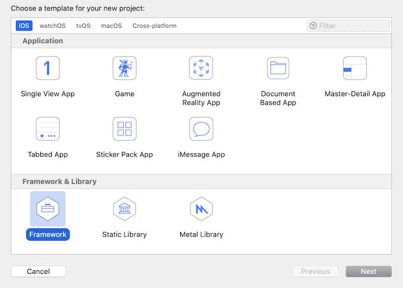

    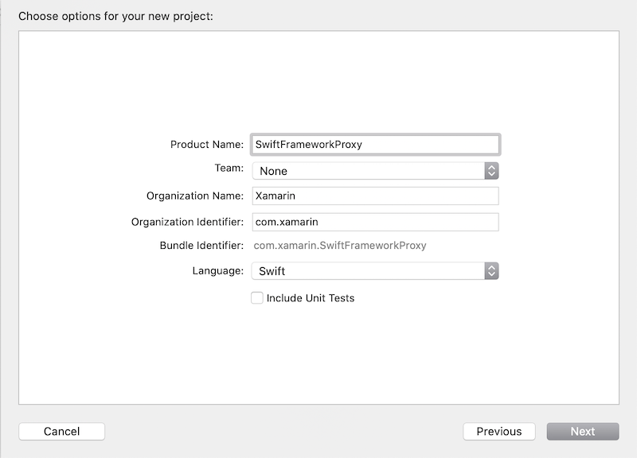

1. Download the [Gigya framework](https://developers.gigya.com/display/GD/Swift+SDK) from the developer website and unpack it. At time of writing, the latest version is [Gigya Swift SDK 1.0.9](https://downloads.gigya.com/predownload?fileName=Swift-Core-framework-1.0.9.zip)

1. Select the **SwiftFrameworkProxy** from the project files explorer then select the General tab

1. Drag and drop the **Gigya.framework** package to the Xcode Frameworks and Libraries list under the General tab check the **Copy items if needed** option while adding the framework:

    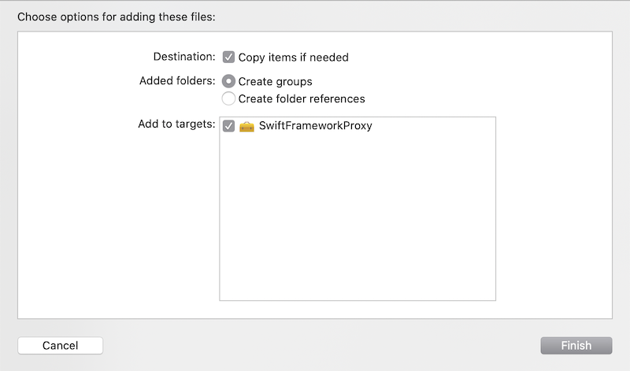

    Verify that the Swift framework has been added to the project otherwise the following options won't be available.

1. Ensure that the **Do Not Embed** option is selected, which will be later controlled manually:

    [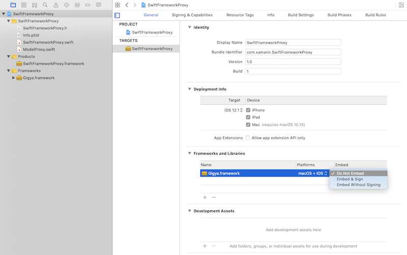](walkthrough-images/xcode-donotembed-option.png#lightbox)

1. Ensure that the Build Settings option **Always Embed Swift Standard Libraries**, which includes Swift libraries with the framework is set to No. It will be later manually controlled, which Swift dylibs are included into the final package:

    [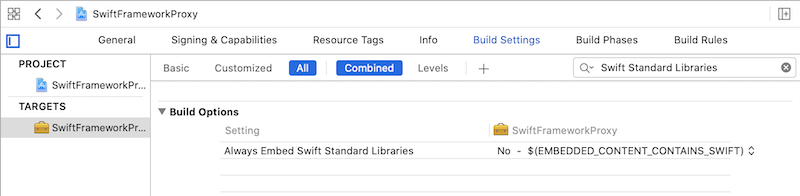](walkthrough-images/xcode-alwaysembedfalse-option.png#lightbox)

1. Ensure that the **Enable  Bitcode** option is set to **No**. As of right now Xamarin.iOS doesn't include Bitcode while Apple requires all libraries to support the same architectures:

    [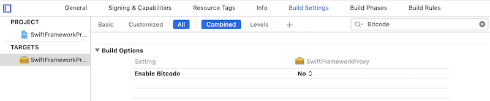](walkthrough-images/xcode-enablebitcodefalse-option.png#lightbox)

    You can verify that the resulted framework has the Bitcode option disabled by running the following terminal command against the framework:

    ```bash
    otool -l SwiftFrameworkProxy.framework/SwiftFrameworkProxy | grep __LLVM
    ```

    The output should be empty otherwise you want to review the project settings for your specific configuration.

1. Ensure that the **Objective-C Generated interface Header Name** option is enabled and specifies a header name. The default name is **\<FrameworkName>-Swift.h**:

    [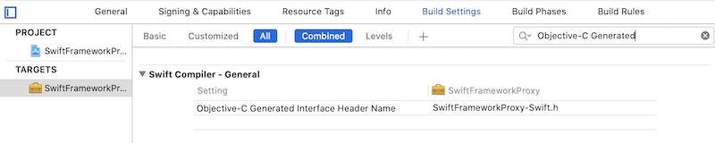](walkthrough-images/xcode-objcheaderenabled-option.png#lightbox)

1. Expose desired methods and mark them with `@objc` attribute and apply additional rules defined below. If you build the framework without this step, the generated Objective-C header will be empty and Xamarin.iOS won't be able to access the Swift framework members. Expose the initialization logic for the underlying Gigya Swift SDK by creating a new Swift file **SwiftFrameworkProxy.swift** and defining the following code:

    ```swift
    import Foundation
    import UIKit
    import Gigya

    @objc(SwiftFrameworkProxy)
    public class SwiftFrameworkProxy : NSObject {

        @objc
        public func initFor(apiKey: String) -> String {
            Gigya.sharedInstance().initFor(apiKey: apiKey)
            let gigyaDomain = Gigya.sharedInstance().config.apiDomain
            let result = "Gigya initialized with domain: \(gigyaDomain)"
            return result
        }
    }
    ```

    A few important notes on the code above:

    - Import Gigya module here from the original third-party Gigya SDK and now can access any member of the framework.
    - Mark SwiftFrameworkProxy class with the `@objc` attribute specifying a name, otherwise a unique unreadable name will be generated, such as `_TtC19SwiftFrameworkProxy19SwiftFrameworkProxy`. The type name should be clearly defined because it will be used later by its name.
    - Inherit the proxy class from `NSObject`, otherwise it won't be generated in the Objective-C header file.
    - Mark all the members to be exposed as `public`.

1. Change the scheme build configuration from **Debug** to **Release**. In order to do that, open the **Xcode > Target > Edit Scheme** dialog and then set the **Build Configuration** option to **Release**:

    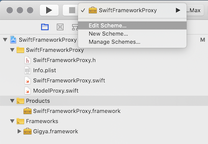

    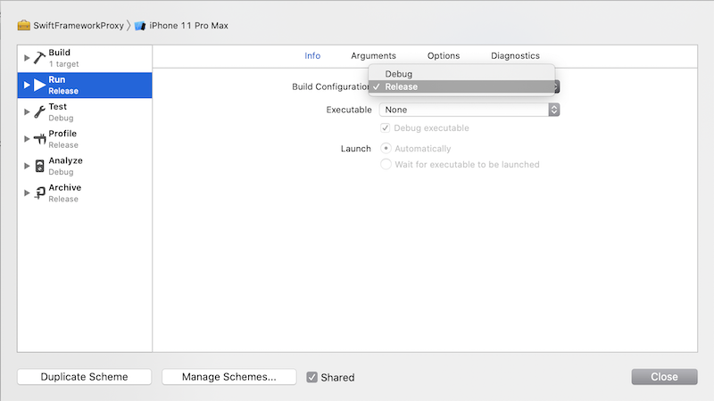

1. At this point, the Framework is ready to be created. Build the framework for both simulator and device architectures and then combine the outputs as a single framework package. Identify installed SDK versions in order to build the source code using **xcodebuild** tool:

    ```bash
    xcodebuild -showsdks
    ```

    The output will be similar to the following:

    ```bash
    iOS SDKs:
            iOS 13.2                        -sdk iphoneos13.2
    iOS Simulator SDKs:
            Simulator - iOS 13.2            -sdk iphonesimulator13.2
    macOS SDKs:
            DriverKit 19.0                  -sdk driverkit.macosx19.0
            macOS 10.15                     -sdk macosx10.15
    tvOS SDKs:
            tvOS 13.2                       -sdk appletvos13.2
    tvOS Simulator SDKs:
            Simulator - tvOS 13.2           -sdk appletvsimulator13.2
    watchOS SDKs:
            watchOS 6.1                     -sdk watchos6.1
    watchOS Simulator SDKs:
            Simulator - watchOS 6.1         -sdk watchsimulator6.1
    ```

    Pick a desired iOS SDK and iOS Simulator SDK version, in this case version 13.2 and execute the build with the following command

    ```bash
    xcodebuild -sdk iphonesimulator13.2 -project "Swift/SwiftFrameworkProxy/SwiftFrameworkProxy.xcodeproj" -configuration Release
    xcodebuild -sdk iphoneos13.2 -project "Swift/SwiftFrameworkProxy/SwiftFrameworkProxy.xcodeproj" -configuration Release
    ```

    > [!TIP]
    > If you have a workspace instead of project, build the workspace and specify the target as a required parameter. You also want to specify an output directory because for workspaces this directory will be different than for project builds.

    > [!TIP]
    > You can also use [the helper script](https://github.com/alexeystrakh/xamarin-binding-swift-framework/blob/master/Swift/Scripts/build.fat.sh#L3-L14) to build the framework for all applicable architectures or just build it from the Xcode switching Simulator and Device in the target selector.

1. There are two Swift frameworks, one for each platform, combine them as a single package to be embedded into a Xamarin.iOS binding project later. In order to create a fat framework, which combines both architectures, you need to do the following steps. The framework package is just a folder so you can do all types of operations, such as adding, removing, and replacing files:

    - Navigate to the build output folder with **Release-iphoneos** and **Release-iphonesimulator** subfolders and copy one of the frameworks as an initial version of the final output (fat framework).

        ```bash
        cp -R "Release-iphoneos" "Release-fat"
        ```

    - Combine modules from another build with the fat framework modules

        ```bash
        cp -R "Release-iphonesimulator/SwiftFrameworkProxy.framework/Modules/SwiftFrameworkProxy.swiftmodule/" "Release-fat/SwiftFrameworkProxy.framework/Modules/SwiftFrameworkProxy.swiftmodule/"
        ```

    - Combine iphoneos + iphonesimulator configuration as a fat framework

        ```bash
        lipo -create -output "Release-fat/SwiftFrameworkProxy.framework/SwiftFrameworkProxy" "Release-iphoneos/SwiftFrameworkProxy.framework/SwiftFrameworkProxy" "Release-iphonesimulator/SwiftFrameworkProxy.framework/SwiftFrameworkProxy"
        ```

    - Verify results

        ```bash
        lipo -info "Release-fat/SwiftFrameworkProxy.framework/SwiftFrameworkProxy"
        ```

        The output should render the following, reflecting the name of the framework and included architectures:

        ```bash
        Architectures in the fat file: Release-fat/SwiftFrameworkProxy.framework/SwiftFrameworkProxy are: x86_64 arm64
        ```

    > [!TIP]
    > If you want to support just a single platform (for example, you are building an app, which can be run on a device only) you can skip the step to create the fat library and use the output framework from the device build earlier.

    > [!TIP]
    > You can also use [the helper script](https://github.com/alexeystrakh/xamarin-binding-swift-framework/blob/master/Swift/Scripts/build.fat.sh#L16-L24) to create the fat framework, which automates all steps above.

## Prepare metadata

At this time, you should have the framework with the Objective-C generated interface header ready to be consumed by a Xamarin.iOS binding.  The next step is to prepare the API definition interfaces, which are used by a binding project to generate C# classes. These definitions could be created manually or automatically by the [Objective Sharpie](../../../cross-platform/macios/binding/objective-sharpie/index.md) tool and the generated header file. Use Sharpie to generate the metadata:

1. Download the latest [Objective Sharpie](../../../cross-platform/macios/binding/objective-sharpie/index.md) tool from the official downloads website and install it by following the wizard. Once the installation is completed, you can verify it by running the sharpie command:

    ```bash
    sharpie -v
    ```

1. Generate metadata using sharpie and the autogenerated Objective-C header file:

    ```bash
    sharpie bind --sdk=iphoneos13.2 --output="XamarinApiDef" --namespace="Binding" --scope="Release-fat/SwiftFrameworkProxy.framework/Headers/" "Release-fat/SwiftFrameworkProxy.framework/Headers/SwiftFrameworkProxy-Swift.h"
    ```

    The output reflects the metadata files being generated: **ApiDefinitions.cs** and **StructsAndEnums.cs**. Save these files for the next step to include them into a Xamarin.iOS binding project along with the native references:

    ```bash
    Parsing 1 header files...
    Binding...
        [write] ApiDefinitions.cs
        [write] StructsAndEnums.cs
    ```

    The tool will generate C# metadata for each exposed Objective-C member, which will look similar to the following code. As you can see it could be defined manually because it has a human-readable format and straightforward members mapping:

    ```csharp
    [Export ("initForApiKey:")]
    string InitForApiKey (string apiKey);
    ```

    > [!TIP]
    > The header file name could be different if you changed the default Xcode settings for the header name. By default it has the name of a project with the **-Swift** suffix. You can always check the file and its name by navigating to the headers folder of the framework package.

    > [!TIP]
    > As part of the automation process you can use [the helper script](https://github.com/alexeystrakh/xamarin-binding-swift-framework/blob/master/Swift/Scripts/build.fat.sh#L35) to generate metadata automatically once the fat framework is created.

## Build a binding library

The next step is to create a Xamarin.iOS binding project using the Visual Studio binding template, add required metadata, native references and then build the project to produce a consumable library:

1. Open Visual Studio for Mac and create a new Xamarin.iOS binding library project, give it a name, in this case SwiftFrameworkProxy.Binding and complete the wizard. The Xamarin.iOS binding template is located by the following path: **iOS > Library > Binding Library**:

    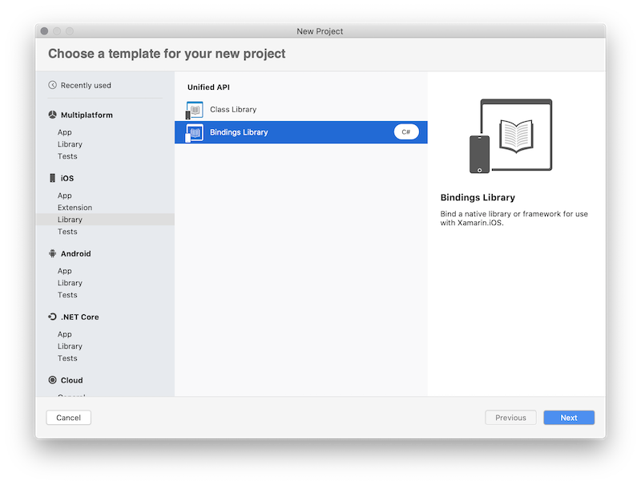

1. Delete existing metadata files **ApiDefinition.cs** and **Structs.cs** as they will be replaced completely with the metadata generated by the Objective Sharpie tool.
1. Copy metadata generated by Sharpie at one of the previous steps, select the following Build Action in the properties window: **ObjBindingApiDefinition** for the **ApiDefinitions.cs** file and **ObjBindingCoreSource** for the **StructsAndEnums.cs** file:

    

    The metadata itself describes each exposed Objective-C class and member using C# language. You are able to see the original Objective-C header definition alongside with the C# declaration:

    ```csharp
    // @interface SwiftFrameworkProxy : NSObject
    [BaseType (typeof(NSObject))]
    interface SwiftFrameworkProxy
    {
        // -(NSString * _Nonnull)initForApiKey:(NSString * _Nonnull)apiKey __attribute__((objc_method_family("none"))) __attribute__((warn_unused_result));
        [Export ("initForApiKey:")]
        string InitForApiKey (string apiKey);
    }
    ```

    Even though it's a valid C# code, it's not used as is but instead is used by Xamarin.iOS tools to generate C# classes based on this metadata definition. As a result, instead of the interface SwiftFrameworkProxy you get a C# class with the same name, which can be instantiated by your Xamarin.iOS code. This class gets methods, properties, and other members defined by your metadata, which you will call in a C# manner.

1. Add native reference to the generated earlier fat framework, as well as each dependency of that framework. In this case, add both SwiftFrameworkProxy and Gigya framework native references to the binding project:

    - To add native framework references, open finder and navigate to the folder with the frameworks. Drag and drop the frameworks under the Native References location in the Solution Explorer. Alternatively, you can use the context menu option on the Native References folder and click **Add Native Reference** to look up the frameworks and add them:

    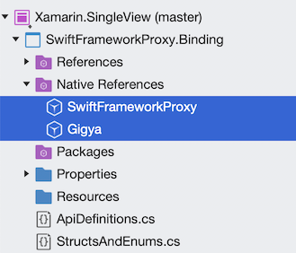

    - Update properties of every native reference and check three important options:

        - Set Smart Link = true
        - Set Force Load = false
        - Set list of Frameworks used to create the original frameworks. In this case each framework has only two dependencies: Foundation and UIKit. Set it to the Frameworks field:

        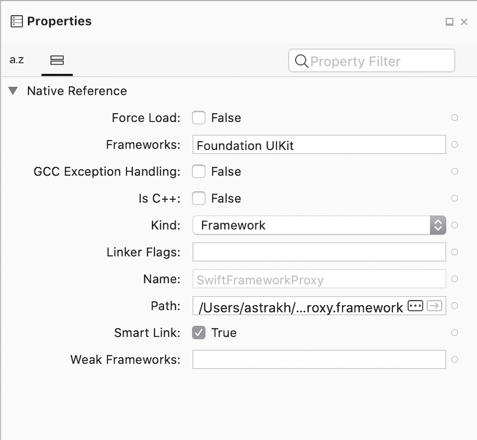

        If you have any additional linker flags to specify, set them in the linker flags field. In this case, keep it empty.

    - Specify additional linker flags when needed. If the library you’re binding exposes only Objective-C APIs but internally is using Swift, then you might be seeing issues like:

        ```Console
        error MT5209 : Native linking error : warning: Auto-Linking library not found for -lswiftCore
        error MT5209 : Native linking error : warning: Auto-Linking library not found for -lswiftQuartzCore
        error MT5209 : Native linking error : warning: Auto-Linking library not found for -lswiftCoreImage
        ```

        In the binding project's properties for the native library the following values must be added to Linker Flags:

        ```Linker
        L/Applications/Xcode.app/Contents/Developer/Toolchains/XcodeDefault.xctoolchain/usr/lib/swift/iphonesimulator/ -L/Applications/Xcode.app/Contents/Developer/Toolchains/XcodeDefault.xctoolchain/usr/lib/swift/iphoneos -Wl,-rpath -Wl,@executable_path/Frameworks
        ```

        The first two options (the `-L ...` ones) tell the native compiler where to find the swift libraries. The native compiler will ignore libraries that don't have the correct architecture, which means that it's possible to pass the location for both simulator libraries and device libraries at the same time, so that it works for both simulator and device builds (these paths are only correct for iOS; for tvOS and watchOS they have to be updated). One downside is that this approach requires that the correct Xcode is in /Application/Xcode.app, if the consumer of the binding library has Xcode in a different location, it won't work. The alternative solution is to add these options in the additional mtouch arguments in the executable project's iOS Build options (`--gcc_flags -L... -L...`). The third option makes the native linker store the location of the swift libraries in the executable, so that the OS can find them.

1. The final action is to build the library and make sure you don't have any compilation errors. You will often find that bindings metadata produced by Objective Sharpie will be annotated with the `[Verify]` attribute. These attributes indicate that you should verify that Objective Sharpie did the correct thing by comparing the binding with the original Objective-C declaration (which will be provided in a comment above the bound declaration). You can learn more about members marked with the attribute by [the following link](../../../cross-platform/macios/binding/objective-sharpie/platform/verify.md). Once the project is built, it can be consumed by a Xamarin.iOS application.

## Consume the binding library

The final step is to consume the Xamarin.iOS binding library in a Xamarin.iOS application. Create a new Xamarin.iOS project, add reference to the binding library, and activate Gigya Swift SDK:

1. Create Xamarin.iOS project. You can use the **iOS > App > Single View App** as a starting point:

    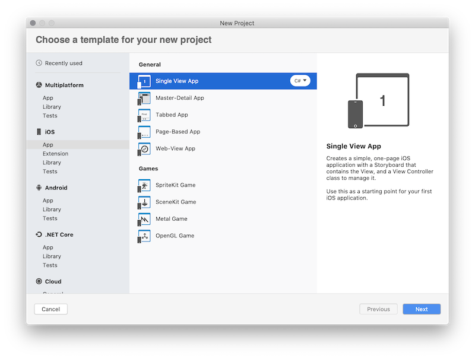

1. Add a binding project reference to the target project or .dll created previously. Treat the binding library as a regular Xamarin.iOS library:

    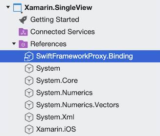

1. Update the source code of the app and add the initialization logic to the primary ViewController, which activates Gigya SDK

    ```csharp
    public override void ViewDidLoad()
    {
        base.ViewDidLoad();
        var proxy = new SwiftFrameworkProxy();
        var result = proxy.InitForApiKey("APIKey");
        System.Diagnostics.Debug.WriteLine(result);
    }
    ```

1. Create a button with a name **btnLogin** and add the following button click handler to activate an authentication flow:

    ```csharp
    private void btnLogin_Tap(object sender, EventArgs e)
    {
        _proxy.LoginWithProvider(GigyaSocialProvidersProxy.Instagram, this, (result, error) =>
        {
            // process your login result here
        });
    }
    ```

1. Run the app, in the debug output you should see the following line: `Gigya initialized with domain: us1.gigya.com`. Click the button to activate the authentication flow:

    [](walkthrough-images/swiftproxy-result.png#lightbox)

Congratulations! You have successfully created a Xamarin.iOS app and a binding library, which consumes a Swift framework. The application above will successfully run on iOS 12.2+ because starting from this iOS version [Apple introduced ABI stability](https://swift.org/blog/swift-5-1-released/) and every iOS starting 12.2+ includes Swift runtime libraries, which could be used to run your application compiled with Swift 5.1+. If you need to add support for earlier iOS versions, there are a few more steps to accomplish:

1. In order to add support for iOS 12.1 and earlier, you want to ship specific Swift dylibs used to compile your framework. Use the [Xamarin.iOS.SwiftRuntimeSupport](https://www.nuget.org/packages/Xamarin.iOS.SwiftRuntimeSupport/) NuGet package to process and copy required libs with your IPA. Add the NuGet reference to your target project and rebuild the application. No further steps are required, the NuGet package will install specific tasks, which are executed with the build process, identify required Swift dylibs and package them with the final IPA.

1. In order to submit the app to the app store you want to use Xcode and distribute option, which will update the IPA file and **SwiftSupport** folder dylibs so it will be accepted by the AppStore:

    ○ Archive the app. From the Visual Studio for Mac menu select **Build > Archive for Publishing**:

    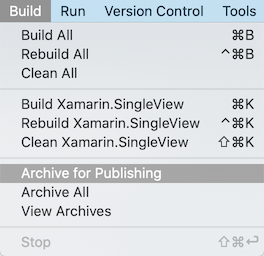

    This action builds the project and achieves it to the Organizer, which is accessible by Xcode for distribution.

    ○ Distribute via Xcode. Open Xcode and navigate to the **Window > Organizer** menu option:

    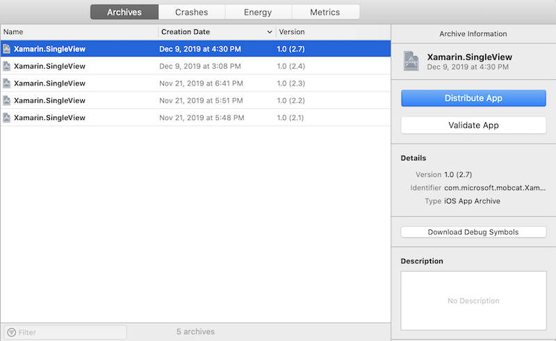

    Select the archive created at the previous step and click the Distribute App button. Follow the wizard to upload the application to the AppStore.

1. This step is optional but it's important to verify that your app can run on iOS 12.1 and earlier as well as 12.2. You can do it with help of Test Cloud and UITest framework. Create a UITest project and a basic UI test, which runs the app:

    - Create a UITest project and configure it for your Xamarin.iOS application:

        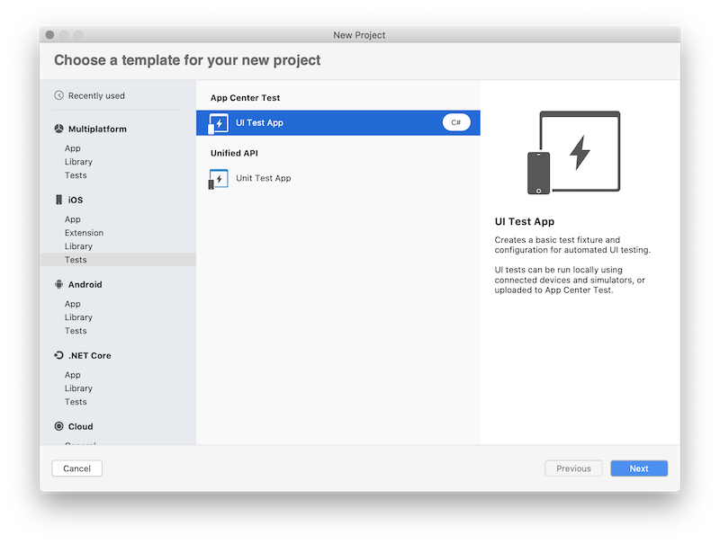

        > [!TIP]
        > You can find more information on how to create a UITest project and configure it for your app by [the following link](/appcenter/test-cloud/preparing-for-upload/xamarin-ios-uitest).

    - Create a basic test to run the app and use some of the Swift SDK features. This test activates the app, tries to log in and then presses the cancel button:

        ```csharp
        [Test]
        public void HappyPath()
        {
            app.WaitForElement(StatusLabel);
            app.WaitForElement(LoginButton);
            app.Screenshot("App loaded.");
            Assert.AreEqual(app.Query(StatusLabel).FirstOrDefault().Text, "Gigya initialized with domain: us1.gigya.com");

            app.Tap(LoginButton);
            app.WaitForElement(GigyaWebView);
            app.Screenshot("Login activated.");

            app.Tap(CancelButton);
            app.WaitForElement(LoginButton);
            app.Screenshot("Login cancelled.");
        }
        ```

        > [!TIP]
        > Read more about UITests framework and UI Automation by [the following link](/appcenter/test-cloud/uitest/).

    - Create an iOS app in app center, create a new test run with a new device set to run the test:

        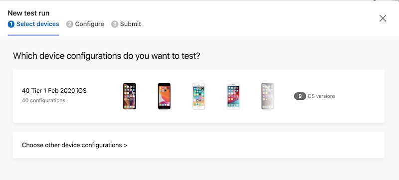

        > [!TIP]
        > Learn more about AppCenter Test Cloud by [the following link](/appcenter/test-cloud/).

    - Install the appcenter CLI

        ```bash
        npm install -g appcenter-cli
        ```

        > [!IMPORTANT]
        > Make sure you have node v6.3 or later installed

    - Run the test using the following command. Also make sure your appcenter command line is currently logged in.

        ```bash
        appcenter test run uitest --app "Mobile-Customer-Advisory-Team/SwiftBinding.iOS" --devices a7e7cb50 --app-path "Xamarin.SingleView.ipa" --test-series "master" --locale "en_US" --build-dir "Xamarin/Xamarin.SingleView.UITests/bin/Debug/"
        ```

    - Verify the result. In the AppCenter portal, navigate to the **App > Test > Test runs**:

        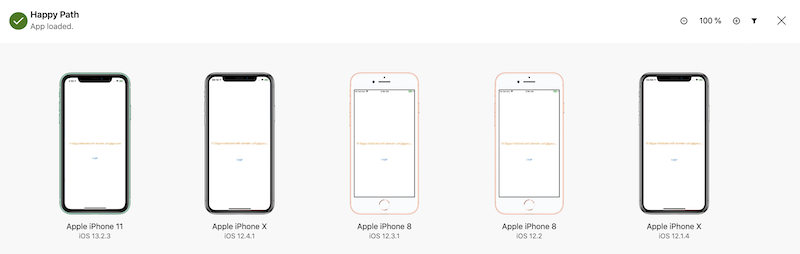

        And select the desired test run and verify the result:

        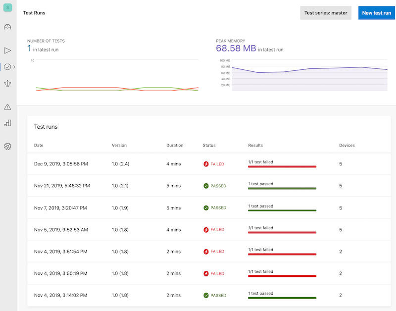

You have developed a basic Xamarin.iOS application that uses a native Swift framework via a Xamarin.iOS binding library. The example provides a simplistic way to use the selected framework and in real application you will be required to expose more APIs and prepare metadata for these APIs. The script to generate metadata will simplify the future changes to the framework APIs.

## Related links

- [Xcode](https://apps.apple.com/us/app/xcode/id497799835)
- [Visual Studio for Mac](https://visualstudio.microsoft.com/downloads)
- [Objective Sharpie](../../../cross-platform/macios/binding/objective-sharpie/index.md)
- [Sharpie Metadata Verification](../../../cross-platform/macios/binding/objective-sharpie/platform/verify.md)
- [Binding Objective-C Framework](../binding-objective-c/walkthrough.md)
- [Gigya iOS SDK (Swift framework)](https://developers.gigya.com/display/GD/Swift+SDK)
- [Swift 5.1 ABI Stability](https://swift.org/blog/swift-5-1-released/)
- [SwiftRuntimeSupport NuGet](https://www.nuget.org/packages/Xamarin.iOS.SwiftRuntimeSupport/)
- [Xamarin UITest automation](/appcenter/test-cloud/uitest/)
- [Xamarin.iOS UITest configuration](/appcenter/test-cloud/preparing-for-upload/xamarin-ios-uitest)
- [AppCenter Test Cloud](/appcenter/test-cloud/preparing-for-upload/xamarin-ios-uitest)
- [Sample project repository](https://github.com/alexeystrakh/xamarin-binding-swift-framework)