# CallKit in Xamarin.iOS

The new CallKit API in iOS 10 provides a way for VOIP apps to integrate with the iPhone UI and provide a familiar interface and experience to the end user. With this API users can view and interact with VOIP calls from the iOS device's Lock Screen and manage contacts using the Phone app's **Favorites** and **Recents** views.

## About CallKit

According to Apple, CallKit is a new framework that will elevate 3rd party Voice Over IP (VOIP) apps to a 1st party experience on iOS 10. The CallKit API allows VOIP apps to integrate with the iPhone UI and provide a familiar interface and experience to the end user. Just like the built-in Phone app, a user can view and interact with VOIP calls from the iOS device's Lock Screen and manage contacts using the Phone app's **Favorites** and **Recents** views.

Additionally, the CallKit API provides the ability to create App Extensions that can associate a phone number with a name (Caller ID) or tell the system when a number should be blocked (Call Blocking).

### The existing VOIP app experience

Before discussing the new CallKit API and its abilities, take a look at the current user experience with a 3rd party VOIP app in iOS 9 (and lesser) using a fictitious VOIP app called MonkeyCall. MonkeyCall is a simple app that allows the user to send and receive VOIP calls using the existing iOS APIs.

Currently, if the user is receiving an incoming call on MonkeyCall and their iPhone is locked, the notification received on the Lock screen is indistinguishable from any other type of notification (like those from the Messages or Mail apps for example).

If the user wanted to answer the call, they'd have to slide the MonkeyCall notification to open the app and enter their passcode (or user Touch ID) to unlock the phone before they could accept the call and start the conversation.

The experience is equally cumbersome if the phone is unlocked. Again, the incoming MonkeyCall call is displayed as a standard notification banner that slides in from the top of the screen. Since the notification is temporary, it can be easily missed by the user forcing them to either open the Notification Center and find the specific notification to answer then call or find and launch the MonkeyCall app manually.

### The CallKit VOIP app experience

By implementing the new CallKit APIs in the MonkeyCall app, the user's experience with an incoming VOIP call can be greatly improved in iOS 10. Take the example of the user receiving a VOIP call when their phone is locked from above. By implementing CallKit, the call will appear on the iPhone's Lock screen, just as it would if the call was being received from the built-in Phone app, with the full-screen, native UI and standard swipe-to-answer functionality.

Again, if the iPhone is unlocked when a MonkeyCall VOIP call is received, the same full-screen, native UI and standard swipe-to-answer and tap-to-decline functionality of the built-in Phone app is presented and MonkeyCall has the option of playing a custom ringtone.

CallKit provides additional functionality to MonkeyCall, allowing its VOIP calls to interact with other types of calls, to appear in the built in Recents and Favorite lists, to use the built-in Do Not Disturb and Block features, start MonkeyCall calls from Siri and offers the ability for users to assign MonkeyCall calls to people in the Contacts app.

The following sections will cover the CallKit architecture, the incoming and outgoing call flows and the CallKit API in detail.

## The CallKit architecture

In iOS 10, Apple has adopted CallKit in all of the System Services such that calls made on CarPlay, for example, are known to the System UI via CallKit. In the example given below, since MonkeyCall adopts CallKit, it is known to the System in the same way as these built-in System Services and gets all of the same features:

[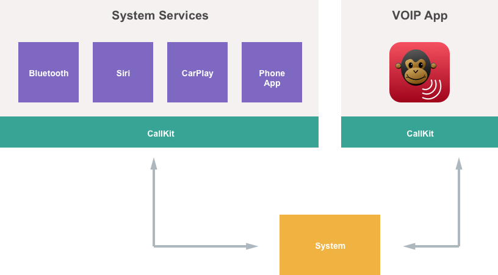](callkit-images/callkit01.png#lightbox)

Take a closer look at the MonkeyCall App from the diagram above. The app contains all of its code to communicate with its own network and contains its own User Interfaces. It links in CallKit to communicate with the system:

[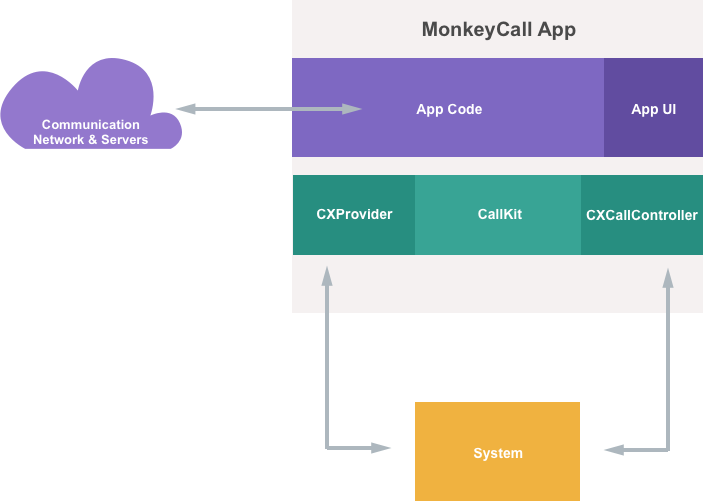](callkit-images/callkit02.png#lightbox)

There are two main interfaces in CallKit that the app uses:

- `CXProvider` - This allows the MonkeyCall app to inform the system of any out-of-band notifications that might occur.
- `CXCallController` - Allows the MonkeyCall app to inform the system of local user actions.

### The CXProvider

As stated above, `CXProvider` allows an app to inform the system of any out-of-band notifications that might occur. These are notification that do not occur due to local user actions, but occur due to external events such as incoming calls.

An app should use the `CXProvider` for the following:

- Report an incoming call to the System.
- Report an that outgoing call has connected to the System.
- Report the remote user ending the call to the System.

When the app wants to communicate to the system, it uses the `CXCallUpdate` class and when the System needs to communicate with the app, it uses the `CXAction` class:

[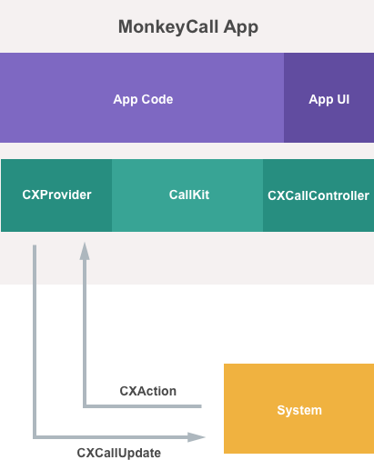](callkit-images/callkit03.png#lightbox)

### The CXCallController

The `CXCallController` allows an app to inform the system of local user actions such as the user starting a VOIP call. By implementing a `CXCallController` the app gets to interplay with other types of calls in the system. For example, if there is already an active telephony call in progress, `CXCallController` can allow the VOIP app to place that call on hold and start or answer a VOIP call.

An app should use the `CXCallController` for the following:

- Report when the user has started an outgoing call to the System.
- Report when the user answers an incoming call to the System.
- Report when the user ends a call to the System.

When the app wants to communicate local user actions to the system, it uses the `CXTransaction` class:

[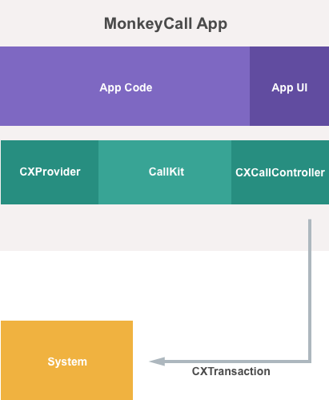](callkit-images/callkit04.png#lightbox)

## Implementing CallKit

The following sections will show how to implement CallKit in a Xamarin.iOS VOIP app. For the sake of example, this document will be using code from the fictitious MonkeyCall VOIP app. The code presented here represents several supporting classes, the CallKit specific parts will covered in detail in the following sections.

### The ActiveCall class

The `ActiveCall` class is used by the MonkeyCall app to hold all of the information about a VOIP call that is currently active as follows:

```csharp
using System;
using CoreFoundation;
using Foundation;

namespace MonkeyCall
{
    public class ActiveCall
    {
        #region Private Variables
        private bool isConnecting;
        private bool isConnected;
        private bool isOnhold;
        #endregion

        #region Computed Properties
        public NSUuid UUID { get; set; }
        public bool isOutgoing { get; set; }
        public string Handle { get; set; }
        public DateTime StartedConnectingOn { get; set;}
        public DateTime ConnectedOn { get; set;}
        public DateTime EndedOn { get; set; }

        public bool IsConnecting {
            get { return isConnecting; }
            set {
                isConnecting = value;
                if (isConnecting) StartedConnectingOn = DateTime.Now;
                RaiseStartingConnectionChanged ();
            }
        }

        public bool IsConnected {
            get { return isConnected; }
            set {
                isConnected = value;
                if (isConnected) {
                    ConnectedOn = DateTime.Now;
                } else {
                    EndedOn = DateTime.Now;
                }
                RaiseConnectedChanged ();
            }
        }

        public bool IsOnHold {
            get { return isOnhold; }
            set {
                isOnhold = value;
            }
        }
        #endregion

        #region Constructors
        public ActiveCall ()
        {
        }

        public ActiveCall (NSUuid uuid, string handle, bool outgoing)
        {
            // Initialize
            this.UUID = uuid;
            this.Handle = handle;
            this.isOutgoing = outgoing;
        }
        #endregion

        #region Public Methods
        public void StartCall (ActiveCallbackDelegate completionHandler)
        {
            // Simulate the call starting successfully
            completionHandler (true);

            // Simulate making a starting and completing a connection
            DispatchQueue.MainQueue.DispatchAfter (new DispatchTime(DispatchTime.Now, 3000), () => {
                // Note that the call is starting
                IsConnecting = true;

                // Simulate pause before connecting
                DispatchQueue.MainQueue.DispatchAfter (new DispatchTime (DispatchTime.Now, 1500), () => {
                    // Note that the call has connected
                    IsConnecting = false;
                    IsConnected = true;
                });
            });
        }

        public void AnswerCall (ActiveCallbackDelegate completionHandler)
        {
            // Simulate the call being answered
            IsConnected = true;
            completionHandler (true);
        }

        public void EndCall (ActiveCallbackDelegate completionHandler)
        {
            // Simulate the call ending
            IsConnected = false;
            completionHandler (true);
        }
        #endregion

        #region Events
        public delegate void ActiveCallbackDelegate (bool successful);
        public delegate void ActiveCallStateChangedDelegate (ActiveCall call);

        public event ActiveCallStateChangedDelegate StartingConnectionChanged;
        internal void RaiseStartingConnectionChanged ()
        {
            if (this.StartingConnectionChanged != null) this.StartingConnectionChanged (this);
        }

        public event ActiveCallStateChangedDelegate ConnectedChanged;
        internal void RaiseConnectedChanged ()
        {
            if (this.ConnectedChanged != null) this.ConnectedChanged (this);
        }
        #endregion
    }
}
```

`ActiveCall` holds several properties that define the state of the call and two events that can be raised when the call state changes. Since this is an example only, there are three methods used to simulated starting, answering and ending a call.

### The StartCallRequest class

The `StartCallRequest` static class, provides a few helper methods that will be used when working with outgoing calls:

```csharp
using System;
using Foundation;
using Intents;

namespace MonkeyCall
{
    public static class StartCallRequest
    {
        public static string URLScheme {
            get { return "monkeycall"; }
        }

        public static string ActivityType {
            get { return INIntentIdentifier.StartAudioCall.GetConstant ().ToString (); }
        }

        public static string CallHandleFromURL (NSUrl url)
        {
            // Is this a MonkeyCall handle?
            if (url.Scheme == URLScheme) {
                // Yes, return host
                return url.Host;
            } else {
                // Not handled
                return null;
            }
        }

        public static string CallHandleFromActivity (NSUserActivity activity)
        {
            // Is this a start call activity?
            if (activity.ActivityType == ActivityType) {
                // Yes, trap any errors
                try {
                    // Get first contact
                    var interaction = activity.GetInteraction ();
                    var startAudioCallIntent = interaction.Intent as INStartAudioCallIntent;
                    var contact = startAudioCallIntent.Contacts [0];

                    // Get the person handle
                    return contact.PersonHandle.Value;
                } catch {
                    // Error, report null
                    return null;
                }
            } else {
                // Not handled
                return null;
            }
        }
    }
}
```

The `CallHandleFromURL` and `CallHandleFromActivity` classes are used in the AppDelegate to get the contact handle of the person being called in an outgoing call. For more information, please see the [Handling Outgoing Calls](#handling-outgoing-calls) section below.

### The ActiveCallManager class

The `ActiveCallManager` class handles all open calls in the MonkeyCall app.

```csharp
using System;
using System.Collections.Generic;
using Foundation;
using CallKit;

namespace MonkeyCall
{
    public class ActiveCallManager
    {
        #region Private Variables
        private CXCallController CallController = new CXCallController ();
        #endregion

        #region Computed Properties
        public List<ActiveCall> Calls { get; set; }
        #endregion

        #region Constructors
        public ActiveCallManager ()
        {
            // Initialize
            this.Calls = new List<ActiveCall> ();
        }
        #endregion

        #region Private Methods
        private void SendTransactionRequest (CXTransaction transaction)
        {
            // Send request to call controller
            CallController.RequestTransaction (transaction, (error) => {
                // Was there an error?
                if (error == null) {
                    // No, report success
                    Console.WriteLine ("Transaction request sent successfully.");
                } else {
                    // Yes, report error
                    Console.WriteLine ("Error requesting transaction: {0}", error);
                }
            });
        }
        #endregion

        #region Public Methods
        public ActiveCall FindCall (NSUuid uuid)
        {
            // Scan for requested call
            foreach (ActiveCall call in Calls) {
                if (call.UUID.Equals(uuid)) return call;
            }

            // Not found
            return null;
        }

        public void StartCall (string contact)
        {
            // Build call action
            var handle = new CXHandle (CXHandleType.Generic, contact);
            var startCallAction = new CXStartCallAction (new NSUuid (), handle);

            // Create transaction
            var transaction = new CXTransaction (startCallAction);

            // Inform system of call request
            SendTransactionRequest (transaction);
        }

        public void EndCall (ActiveCall call)
        {
            // Build action
            var endCallAction = new CXEndCallAction (call.UUID);

            // Create transaction
            var transaction = new CXTransaction (endCallAction);

            // Inform system of call request
            SendTransactionRequest (transaction);
        }

        public void PlaceCallOnHold (ActiveCall call)
        {
            // Build action
            var holdCallAction = new CXSetHeldCallAction (call.UUID, true);

            // Create transaction
            var transaction = new CXTransaction (holdCallAction);

            // Inform system of call request
            SendTransactionRequest (transaction);
        }

        public void RemoveCallFromOnHold (ActiveCall call)
        {
            // Build action
            var holdCallAction = new CXSetHeldCallAction (call.UUID, false);

            // Create transaction
            var transaction = new CXTransaction (holdCallAction);

            // Inform system of call request
            SendTransactionRequest (transaction);
        }
        #endregion
    }
}
```

Again, since this is a simulation only, the `ActiveCallManager` only maintains a collection of `ActiveCall` objects and has a routine for finding a given call by its `UUID` property. It also includes methods to start, end and change the on-hold state of an outgoing call. For more information, please see the [Handling Outgoing Calls](#handling-outgoing-calls) section below.

### The ProviderDelegate class

As discussed above, a `CXProvider` provides two-way communication between the app and the System for out-of-band notifications. The developer needs to provide a custom `CXProviderDelegate` and attach it to the `CXProvider` for the app to handle out-of-band CallKit events. MonkeyCall uses the following `CXProviderDelegate`:

```csharp
using System;
using Foundation;
using CallKit;
using UIKit;

namespace MonkeyCall
{
    public class ProviderDelegate : CXProviderDelegate
    {
        #region Computed Properties
        public ActiveCallManager CallManager { get; set;}
        public CXProviderConfiguration Configuration { get; set; }
        public CXProvider Provider { get; set; }
        #endregion

        #region Constructors
        public ProviderDelegate (ActiveCallManager callManager)
        {
            // Save connection to call manager
            CallManager = callManager;

            // Define handle types
            var handleTypes = new [] { (NSNumber)(int)CXHandleType.PhoneNumber };

            // Get Image Template
            var templateImage = UIImage.FromFile ("telephone_receiver.png");

            // Setup the initial configurations
            Configuration = new CXProviderConfiguration ("MonkeyCall") {
                MaximumCallsPerCallGroup = 1,
                SupportedHandleTypes = new NSSet<NSNumber> (handleTypes),
                IconTemplateImageData = templateImage.AsPNG(),
                RingtoneSound = "musicloop01.wav"
            };

            // Create a new provider
            Provider = new CXProvider (Configuration);

            // Attach this delegate
            Provider.SetDelegate (this, null);

        }
        #endregion

        #region Override Methods
        public override void DidReset (CXProvider provider)
        {
            // Remove all calls
            CallManager.Calls.Clear ();
        }

        public override void PerformStartCallAction (CXProvider provider, CXStartCallAction action)
        {
            // Create new call record
            var activeCall = new ActiveCall (action.CallUuid, action.CallHandle.Value, true);

            // Monitor state changes
            activeCall.StartingConnectionChanged += (call) => {
                if (call.isConnecting) {
                    // Inform system that the call is starting
                    Provider.ReportConnectingOutgoingCall (call.UUID, call.StartedConnectingOn.ToNSDate());
                }
            };

            activeCall.ConnectedChanged += (call) => {
                if (call.isConnected) {
                    // Inform system that the call has connected
                    provider.ReportConnectedOutgoingCall (call.UUID, call.ConnectedOn.ToNSDate ());
                }
            };

            // Start call
            activeCall.StartCall ((successful) => {
                // Was the call able to be started?
                if (successful) {
                    // Yes, inform the system
                    action.Fulfill ();

                    // Add call to manager
                    CallManager.Calls.Add (activeCall);
                } else {
                    // No, inform system
                    action.Fail ();
                }
            });
        }

        public override void PerformAnswerCallAction (CXProvider provider, CXAnswerCallAction action)
        {
            // Find requested call
            var call = CallManager.FindCall (action.CallUuid);

            // Found?
            if (call == null) {
                // No, inform system and exit
                action.Fail ();
                return;
            }

            // Attempt to answer call
            call.AnswerCall ((successful) => {
                // Was the call successfully answered?
                if (successful) {
                    // Yes, inform system
                    action.Fulfill ();
                } else {
                    // No, inform system
                    action.Fail ();
                }
            });
        }

        public override void PerformEndCallAction (CXProvider provider, CXEndCallAction action)
        {
            // Find requested call
            var call = CallManager.FindCall (action.CallUuid);

            // Found?
            if (call == null) {
                // No, inform system and exit
                action.Fail ();
                return;
            }

            // Attempt to answer call
            call.EndCall ((successful) => {
                // Was the call successfully answered?
                if (successful) {
                    // Remove call from manager's queue
                    CallManager.Calls.Remove (call);

                    // Yes, inform system
                    action.Fulfill ();
                } else {
                    // No, inform system
                    action.Fail ();
                }
            });
        }

        public override void PerformSetHeldCallAction (CXProvider provider, CXSetHeldCallAction action)
        {
            // Find requested call
            var call = CallManager.FindCall (action.CallUuid);

            // Found?
            if (call == null) {
                // No, inform system and exit
                action.Fail ();
                return;
            }

            // Update hold status
            call.isOnHold = action.OnHold;

            // Inform system of success
            action.Fulfill ();
        }

        public override void TimedOutPerformingAction (CXProvider provider, CXAction action)
        {
            // Inform user that the action has timed out
        }

        public override void DidActivateAudioSession (CXProvider provider, AVFoundation.AVAudioSession audioSession)
        {
            // Start the calls audio session here
        }

        public override void DidDeactivateAudioSession (CXProvider provider, AVFoundation.AVAudioSession audioSession)
        {
            // End the calls audio session and restart any non-call
            // related audio
        }
        #endregion

        #region Public Methods
        public void ReportIncomingCall (NSUuid uuid, string handle)
        {
            // Create update to describe the incoming call and caller
            var update = new CXCallUpdate ();
            update.RemoteHandle = new CXHandle (CXHandleType.Generic, handle);

            // Report incoming call to system
            Provider.ReportNewIncomingCall (uuid, update, (error) => {
                // Was the call accepted
                if (error == null) {
                    // Yes, report to call manager
                    CallManager.Calls.Add (new ActiveCall (uuid, handle, false));
                } else {
                    // Report error to user here
                    Console.WriteLine ("Error: {0}", error);
                }
            });
        }
        #endregion
    }
}
```

When an instance of this delegate is created, it's passed the `ActiveCallManager` that it will use to handle any call activity. Next, it defines the handle types (`CXHandleType`) that the `CXProvider` will respond to:

```csharp
// Define handle types
var handleTypes = new [] { (NSNumber)(int)CXHandleType.PhoneNumber };
```

And it gets the template image that will be applied to the app's icon when a call is in progress:

```csharp
// Get Image Template
var templateImage = UIImage.FromFile ("telephone_receiver.png");
```

These values get bundled into a `CXProviderConfiguration` that will be used to configure the `CXProvider`:

```csharp
// Setup the initial configurations
Configuration = new CXProviderConfiguration ("MonkeyCall") {
    MaximumCallsPerCallGroup = 1,
    SupportedHandleTypes = new NSSet<NSNumber> (handleTypes),
    IconTemplateImageData = templateImage.AsPNG(),
    RingtoneSound = "musicloop01.wav"
};
```

The delegate then creates a new `CXProvider` with these configurations and attaches itself to it:

```csharp
// Create a new provider
Provider = new CXProvider (Configuration);

// Attach this delegate
Provider.SetDelegate (this, null);
```

When using CallKit, the app will no longer create and handle its own audio sessions, instead it will need to configure and use an audio session that the System will create and handle for it.

If this were a real app, the `DidActivateAudioSession` method would be used to start the call with a pre-configured `AVAudioSession` that the System provided:

```csharp
public override void DidActivateAudioSession (CXProvider provider, AVFoundation.AVAudioSession audioSession)
{
    // Start the call's audio session here...
}
```

It would also use the `DidDeactivateAudioSession` method to finalize and release its connection to the System provided audio session:

```csharp
public override void DidDeactivateAudioSession (CXProvider provider, AVFoundation.AVAudioSession audioSession)
{
    // End the calls audio session and restart any non-call
    // releated audio
}
```

The rest of the code will be covered in detail in the sections that follow.

### The AppDelegate class

MonkeyCall uses the AppDelegate to hold instances of the `ActiveCallManager` and `CXProviderDelegate` that will be used throughout the app:

```csharp
using Foundation;
using UIKit;
using Intents;
using System;

namespace MonkeyCall
{
    [Register ("AppDelegate")]
    public class AppDelegate : UIApplicationDelegate
    {
        #region Constructors
        public override UIWindow Window { get; set; }
        public ActiveCallManager CallManager { get; set; }
        public ProviderDelegate CallProviderDelegate { get; set; }
        #endregion

        #region Override Methods
        public override bool FinishedLaunching (UIApplication application, NSDictionary launchOptions)
        {
            // Initialize the call handlers
            CallManager = new ActiveCallManager ();
            CallProviderDelegate = new ProviderDelegate (CallManager);

            return true;
        }

        public override bool OpenUrl (UIApplication app, NSUrl url, NSDictionary options)
        {
            // Get handle from url
            var handle = StartCallRequest.CallHandleFromURL (url);

            // Found?
            if (handle == null) {
                // No, report to system
                Console.WriteLine ("Unable to get call handle from URL: {0}", url);
                return false;
            } else {
                // Yes, start call and inform system
                CallManager.StartCall (handle);
                return true;
            }
        }

        public override bool ContinueUserActivity (UIApplication application, NSUserActivity userActivity, UIApplicationRestorationHandler completionHandler)
        {
            var handle = StartCallRequest.CallHandleFromActivity (userActivity);

            // Found?
            if (handle == null) {
                // No, report to system
                Console.WriteLine ("Unable to get call handle from User Activity: {0}", userActivity);
                return false;
            } else {
                // Yes, start call and inform system
                CallManager.StartCall (handle);
                return true;
            }
        }

        ...
        #endregion
    }
}
```

The `OpenUrl` and `ContinueUserActivity` override methods are used when the app is processing an outgoing call. For more information, please see the [Handling Outgoing Calls](#handling-outgoing-calls) section below.

## Handling incoming calls

There are several states and processes that an incoming VOIP call can go through during a typical incoming call workflow such as:

- Informing the user (and the System) that an incoming call exists.
- Receiving notification when the user wants to answer the call and initializing the call with the other user.
- Inform the System and the Communication Network when the user wants to end the current call.

The following sections will take a detailed look at how an app can use CallKit to handle the incoming call workflow, again using the MonkeyCall VOIP app as an example.

### Informing user of incoming call

When a remote user has started a VOIP conversation with the local user, the following occurs:

[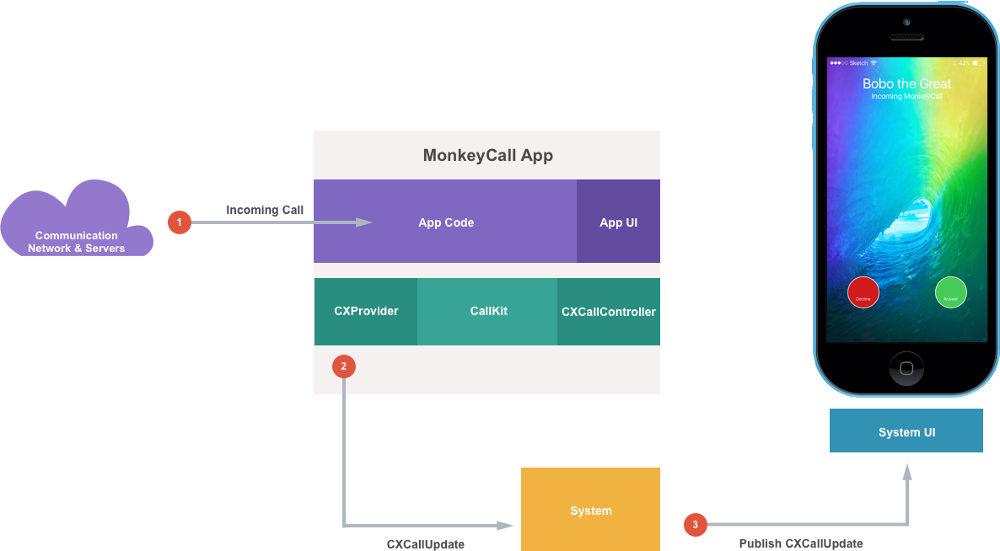](callkit-images/callkit05.png#lightbox)

1. The app gets a notification from its Communications Network that there is an incoming VOIP call.
2. The app uses the `CXProvider` to send a `CXCallUpdate` to the System informing it of the call.
3. The System publishes the call to the System UI, System Services and any other VOIP apps using CallKit.

For example, in the `CXProviderDelegate`:

```csharp
public void ReportIncomingCall (NSUuid uuid, string handle)
{
    // Create update to describe the incoming call and caller
    var update = new CXCallUpdate ();
    update.RemoteHandle = new CXHandle (CXHandleType.Generic, handle);

    // Report incoming call to system
    Provider.ReportNewIncomingCall (uuid, update, (error) => {
        // Was the call accepted
        if (error == null) {
            // Yes, report to call manager
            CallManager.Calls.Add (new ActiveCall (uuid, handle, false));
        } else {
            // Report error to user here
            Console.WriteLine ("Error: {0}", error);
        }
    });
}
```

This code creates a new `CXCallUpdate` instance and attaches a handle to it that will identify the caller. Next, it uses the `ReportNewIncomingCall` method of the `CXProvider` class to inform the system of the call. If it is successful, the call is added to the app's collection of active calls, if it isn't, the error needs to be reported to the user.

### User answering incoming call

If the user wants to answer the incoming VOIP call, the following occurs:

[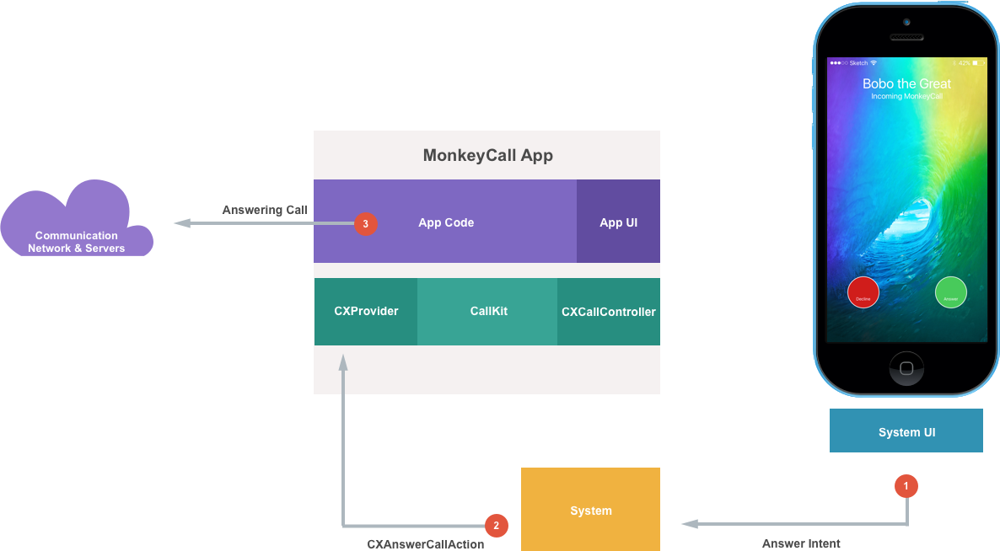](callkit-images/callkit06.png#lightbox)

1. The System UI informs the System that the user wants to answer the VOIP call.
2. The System sends a `CXAnswerCallAction` to the app's `CXProvider` informing it of the Answer Intent.
3. The app informs its Communication Network that the user is answering the call and the VOIP call proceeds as usual.

For example, in the `CXProviderDelegate`:

```csharp
public override void PerformAnswerCallAction (CXProvider provider, CXAnswerCallAction action)
{
    // Find requested call
    var call = CallManager.FindCall (action.CallUuid);

    // Found?
    if (call == null) {
        // No, inform system and exit
        action.Fail ();
        return;
    }

    // Attempt to answer call
    call.AnswerCall ((successful) => {
        // Was the call successfully answered?
        if (successful) {
            // Yes, inform system
            action.Fulfill ();
        } else {
            // No, inform system
            action.Fail ();
        }
    });
}
```

This code first searches for the given call in its list of active calls. If the call can't be found, the system is notified and the method exits. If it is found, the `AnswerCall` method of the `ActiveCall` class is called to start the call and the System is information if it succeeds or fails.

### User ending incoming call

If the user wishes to terminate the call from within the app's UI, the following occurs:

[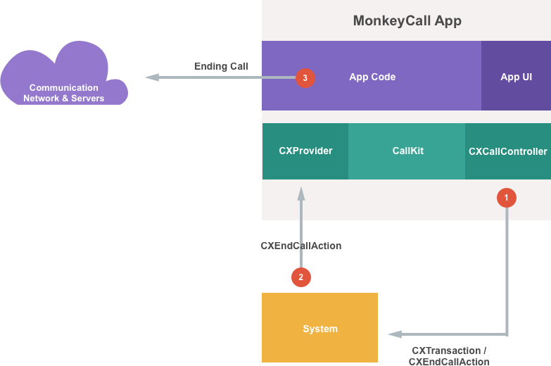](callkit-images/callkit07.png#lightbox)

1. The app creates `CXEndCallAction` that gets bundled into a `CXTransaction` that is sent to the System to inform it that the call is ending.
2. The System verifies the End Call Intent and sends the `CXEndCallAction` back to the app via the `CXProvider`.
3. The app then informs its Communication Network that the call is ending.

For example, in the `CXProviderDelegate`:

```csharp
public override void PerformEndCallAction (CXProvider provider, CXEndCallAction action)
{
    // Find requested call
    var call = CallManager.FindCall (action.CallUuid);

    // Found?
    if (call == null) {
        // No, inform system and exit
        action.Fail ();
        return;
    }

    // Attempt to answer call
    call.EndCall ((successful) => {
        // Was the call successfully answered?
        if (successful) {
            // Remove call from manager's queue
            CallManager.Calls.Remove (call);

            // Yes, inform system
            action.Fulfill ();
        } else {
            // No, inform system
            action.Fail ();
        }
    });
}
```

This code first searches for the given call in its list of active calls. If the call can't be found, the system is notified and the method exits. If it is found, the `EndCall` method of the `ActiveCall` class is called to end the call and the System is information if it succeeds or fails. If successful, the call is removed from the collection of active calls.

## Managing multiple calls

Most VOIP apps can handle multiple calls at once. For example, if there is currently an active VOIP call and the app gets notification that a there is a new incoming call, the user can pause or hang-up on the first call to answer the second one.

In the situation give above, the System will send a `CXTransaction` to the app that will include a list of multiple actions (such as the `CXEndCallAction` and the `CXAnswerCallAction`). All of these actions will need to be fulfilled individually, so that the System can update the UI appropriately.

## Handling outgoing calls

If the user taps an entry from the Recents list (in the Phone app), for example, that is from a call belonging to the app, it will be sent a _Start Call Intent_ by the system:

[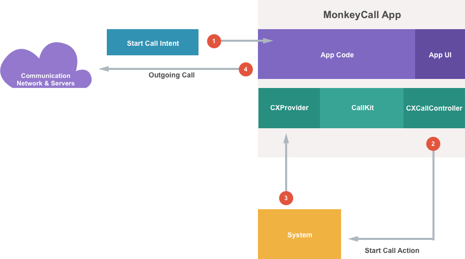](callkit-images/callkit08.png#lightbox)

1. The app will create a _Start Call Action_ based on the Start Call Intent that it received from the System.
2. The app will use the `CXCallController` to request the Start Call Action from the system.
3. If the System accepts the Action, it will be returned to the app via the `XCProvider` delegate.
4. The app starts the outgoing call with its Communication Network.

For more information on Intents, please see our [Intents and Intents UI Extensions](~/ios/platform/sirikit/understanding-sirikit.md) documentation.

### The outgoing call lifecycle

When working with CallKit and an outgoing call, the app will need to inform the System of the following lifecycle events:

1. **Starting** - Inform the system that an outgoing call is about to start.
2. **Started** - Inform the system that an outgoing call has started.
3. **Connecting** - Inform the system that the outgoing call is connecting.
4. **Connected** - Inform the outgoing call has connected and that both parties can talk now.

For example, the following code will start an outgoing call:

```csharp
private CXCallController CallController = new CXCallController ();
...

private void SendTransactionRequest (CXTransaction transaction)
{
    // Send request to call controller
    CallController.RequestTransaction (transaction, (error) => {
        // Was there an error?
        if (error == null) {
            // No, report success
            Console.WriteLine ("Transaction request sent successfully.");
        } else {
            // Yes, report error
            Console.WriteLine ("Error requesting transaction: {0}", error);
        }
    });
}

public void StartCall (string contact)
{
    // Build call action
    var handle = new CXHandle (CXHandleType.Generic, contact);
    var startCallAction = new CXStartCallAction (new NSUuid (), handle);

    // Create transaction
    var transaction = new CXTransaction (startCallAction);

    // Inform system of call request
    SendTransactionRequest (transaction);
}
```

It creates a `CXHandle` and uses it to configure a `CXStartCallAction` which is bundled into a `CXTransaction` that is sent to the System using the `RequestTransaction` method of the `CXCallController` class. By calling the `RequestTransaction` method, the System can place any existing calls on-hold, no matter the source (Phone app, FaceTime, VOIP, etc.), before the new call starts.

The request to start an outgoing VOIP call can come from several different sources, such as Siri, an entry on a Contact card (in the Contacts app) or from the Recents list (in the Phone app). In these situations, the app will be sent a Start Call Intent inside a `NSUserActivity` and the AppDelegate will need to handle it:

```csharp
public override bool ContinueUserActivity (UIApplication application, NSUserActivity userActivity, UIApplicationRestorationHandler completionHandler)
{
    var handle = StartCallRequest.CallHandleFromActivity (userActivity);

    // Found?
    if (handle == null) {
        // No, report to system
        Console.WriteLine ("Unable to get call handle from User Activity: {0}", userActivity);
        return false;
    } else {
        // Yes, start call and inform system
        CallManager.StartCall (handle);
        return true;
    }
}
```

Here the `CallHandleFromActivity` method of the helper class `StartCallRequest` is being used to get the handle to the person being called (see [The StartCallRequest Class](#the-startcallrequest-class) above).

The `PerformStartCallAction` method of the [ProviderDelegate Class](#the-providerdelegate-class) is used to finally start the actual outgoing call and inform the System of its lifecycle:

```csharp
public override void PerformStartCallAction (CXProvider provider, CXStartCallAction action)
{
    // Create new call record
    var activeCall = new ActiveCall (action.CallUuid, action.CallHandle.Value, true);

    // Monitor state changes
    activeCall.StartingConnectionChanged += (call) => {
        if (call.IsConnecting) {
            // Inform system that the call is starting
            Provider.ReportConnectingOutgoingCall (call.UUID, call.StartedConnectingOn.ToNSDate());
        }
    };

    activeCall.ConnectedChanged += (call) => {
        if (call.IsConnected) {
            // Inform system that the call has connected
            Provider.ReportConnectedOutgoingCall (call.UUID, call.ConnectedOn.ToNSDate ());
        }
    };

    // Start call
    activeCall.StartCall ((successful) => {
        // Was the call able to be started?
        if (successful) {
            // Yes, inform the system
            action.Fulfill ();

            // Add call to manager
            CallManager.Calls.Add (activeCall);
        } else {
            // No, inform system
            action.Fail ();
        }
    });
}
```

It creates an instance of the `ActiveCall` class (to hold information about the call in progress) and populates with the person being called. The `StartingConnectionChanged` and `ConnectedChanged` events are used to monitor and report the outgoing call lifecycle. The call is started and the System informed that the Action was fulfilled.

### Ending an outgoing call

When the user has finished with an outgoing call and wishes to end it, the following code can be used:

```csharp
private CXCallController CallController = new CXCallController ();
...

private void SendTransactionRequest (CXTransaction transaction)
{
    // Send request to call controller
    CallController.RequestTransaction (transaction, (error) => {
        // Was there an error?
        if (error == null) {
            // No, report success
            Console.WriteLine ("Transaction request sent successfully.");
        } else {
            // Yes, report error
            Console.WriteLine ("Error requesting transaction: {0}", error);
        }
    });
}

public void EndCall (ActiveCall call)
{
    // Build action
    var endCallAction = new CXEndCallAction (call.UUID);

    // Create transaction
    var transaction = new CXTransaction (endCallAction);

    // Inform system of call request
    SendTransactionRequest (transaction);
}
```

If creates a `CXEndCallAction` with the UUID of the call to end, bundles it in a `CXTransaction` that is sent to the System using the `RequestTransaction` method of the `CXCallController` class.

## Additional CallKit details

This section will cover some additional details that the developer will need to take into consideration when working with CallKit such as:

- Provider Configuration
- Action Errors
- System Restrictions
- VOIP Audio

### Provider configuration

The provider configuration allows an iOS 10 VOIP app to customize the user experience (inside the native In-Call UI) when working with CallKit.

An app can make the following types of customizations:

- Display a localized name.
- Enable video call support.
- Customize the buttons on the In-Call UI by presenting its own template image icon. User interaction with custom buttons is sent directly to the app to be processed.

### Action errors

iOS 10 VOIP apps using CallKit need to handle Actions failing gracefully and keep the user informed of the Action state at all times.

Take the following example into consideration:

1. The app has received a Start Call Action and has begun the process of initializing a new VOIP call with its Communication Network.
2. Because of limited or no network communication capability, this connection fails.
3. The app *must* send the **Fail** message back to the Start Call Action (`Action.Fail()`) to inform the System of the failure.
4. This allows the System to inform the user of the status of the call. For example, to display the Call Failure UI.

Additionally, an iOS 10 VOIP app will need to respond to _Timeout Errors_ that can occur when an expected Action cannot be processed within a given amount of time. Each Action Type provided by CallKit has a maximum Timeout value associated with it. These Timeout values ensure that any CallKit Action requested by the user is handled in a responsive fashion, thus keeping the OS fluid and responsive as well.

There are several methods on the Provider Delegate (`CXProviderDelegate`) that should be overridden to gracefully handle this Timeout situations as well.

### System restrictions

Based on the current state of the iOS device running the iOS 10 VOIP app, certain system restrictions may be enforced.

For example, an incoming VOIP call can be restricted by the System if:

1. The person calling is on the user's Blocked Caller List.
2. The user's iOS device is in the Do-Not-Disturb mode.

If a VOIP call is restricted by any of these situations, use the following code to handle it:

```csharp
public class ProviderDelegate : CXProviderDelegate
{
...

    public void ReportIncomingCall (NSUuid uuid, string handle)
    {
        // Create update to describe the incoming call and caller
        var update = new CXCallUpdate ();
        update.RemoteHandle = new CXHandle (CXHandleType.Generic, handle);

        // Report incoming call to system
        Provider.ReportNewIncomingCall (uuid, update, (error) => {
            // Was the call accepted
            if (error == null) {
                // Yes, report to call manager
                CallManager.Calls.Add (new ActiveCall (uuid, handle, false));
            } else {
                // Report error to user here
                if (error.Code == (int)CXErrorCodeIncomingCallError.CallUuidAlreadyExists) {
                    // Handle duplicate call ID
                } else if (error.Code == (int)CXErrorCodeIncomingCallError.FilteredByBlockList) {
                    // Handle call from blocked user
                } else if (error.Code == (int)CXErrorCodeIncomingCallError.FilteredByDoNotDisturb) {
                    // Handle call while in do-not-disturb mode
                } else {
                    // Handle unknown error
                }
            }
        });
    }

}
```

### VOIP audio

CallKit provides several benefits for handling the audio resources that an iOS 10 VOIP app will require during a live VOIP call. One of the biggest benefits is the app's audio session will have elevated priorities when running in iOS 10. This is the same priority level as the built in Phone and FaceTime apps and this enhanced priority level will prevent other running apps from interrupting the VOIP app's audio session.

Additionally, CallKit has access to other audio routing hints that can enhance the performance and intelligently route VOIP audio to specific output devices during a live call based on user preferences and device states. For example, based on attached devices such as bluetooth headphones, a live CarPlay connection or Accessibility settings.

During the lifecycle of a typical VOIP call using CallKit, the app will need to configure the Audio Stream that CallKit will provide it. Take a look at the following example:

[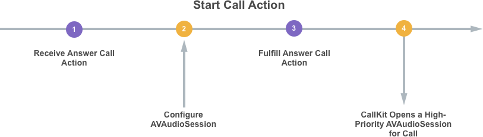](callkit-images/callkit09.png#lightbox)

1. A Start Call Action is received by the app to answer an incoming call.
2. Before this Action is fulfilled by the app, it provides the configuration that is will require for its `AVAudioSession`.
3. The app informs the System that the Action has been fulfilled.
4. Before the call connects, CallKit provides a high-priority `AVAudioSession` matching the configuration that the app requested. The app will be notified via the `DidActivateAudioSession` method of its `CXProviderDelegate`.

## Working with call directory extensions

When working with CallKit, _Call Directory Extensions_ provide a way to add blocked call numbers and identify numbers that are specific to a given VOIP app to contacts in the Contact app on the iOS device.

### Implementing a Call directory extension

To implement a Call Directory Extension in a Xamarin.iOS app, do the following:

# [Visual Studio for Mac](#tab/macos)

1. Open the app's solution in Visual Studio for Mac.
2. Right-click on the Solution Name in the **Solution Explorer** and select **Add** > **Add New Project**.
3. Select **iOS** > **Extensions** > **Call Directory Extensions** and click the **Next** button:

    [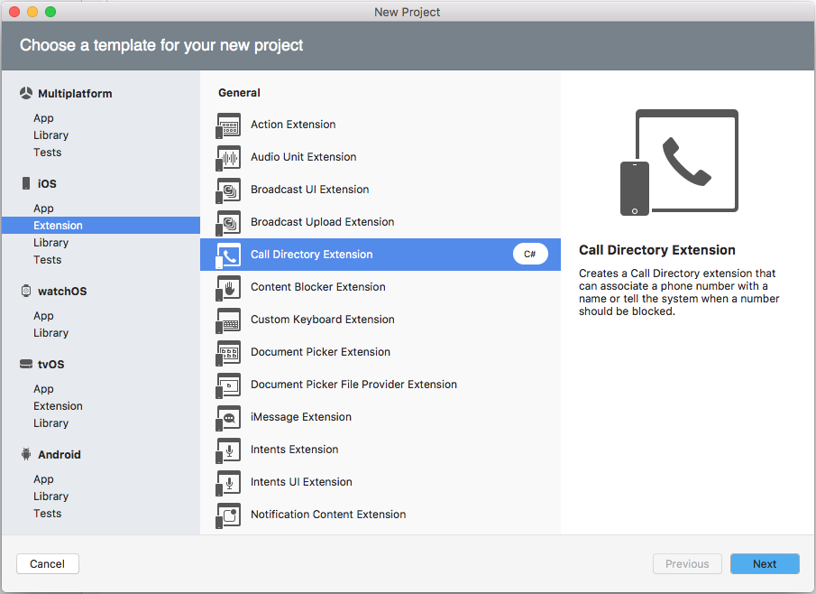](callkit-images/calldir01.png#lightbox)
4. Enter a **Name** for the extension and click the **Next** button:

    [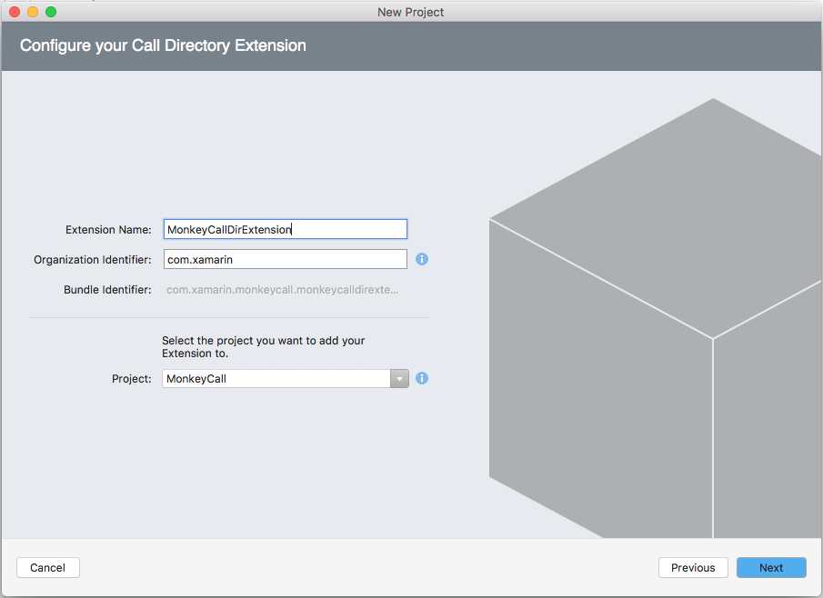](callkit-images/calldir02.png#lightbox)
5. Adjust the **Project Name** and/or **Solution Name** if required and click the **Create** button:

    [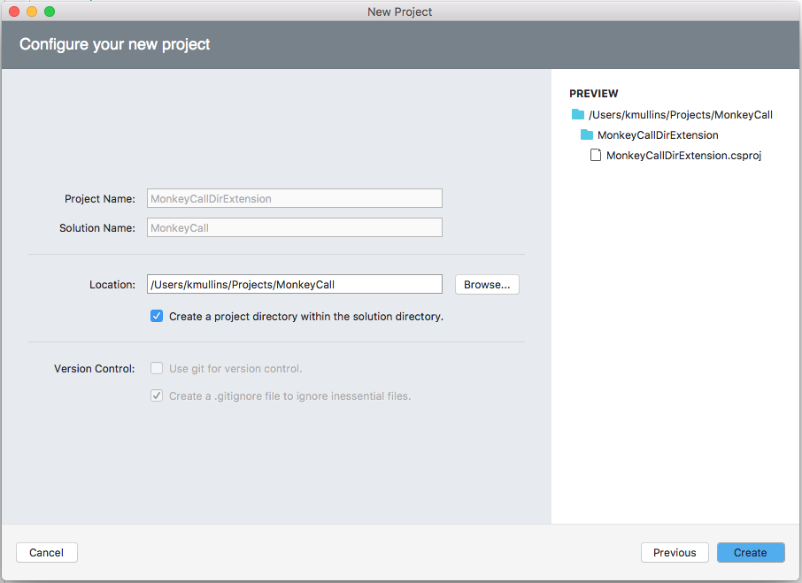](callkit-images/calldir03.png#lightbox)

# [Visual Studio](#tab/windows)

1. Open the app's solution in Visual Studio.
2. Right-click on the Solution Name in the **Solution Explorer** and select **Add** > **Add New Project**.
3. Select **iOS** > **Extensions** > **Call Directory Extensions** and click the **Next** button:

    [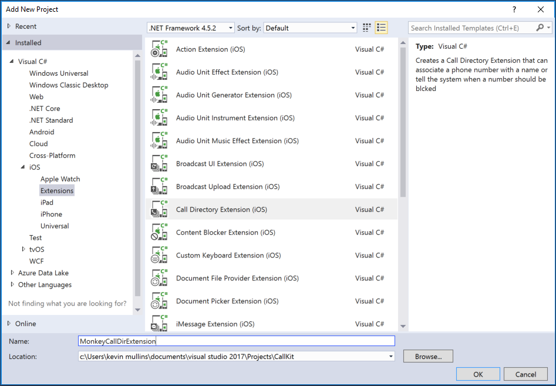](callkit-images/calldir01.png#lightbox)
4. Enter a **Name** for the extension and click the **OK** button

-----

This will add a `CallDirectoryHandler.cs` class to the project that looks like the following:

```csharp
using System;

using Foundation;
using CallKit;

namespace MonkeyCallDirExtension
{
    [Register ("CallDirectoryHandler")]
    public class CallDirectoryHandler : CXCallDirectoryProvider, ICXCallDirectoryExtensionContextDelegate
    {
        #region Constructors
        protected CallDirectoryHandler (IntPtr handle) : base (handle)
        {
            // Note: this .ctor should not contain any initialization logic.
        }
        #endregion

        #region Override Methods
        public override void BeginRequest (CXCallDirectoryExtensionContext context)
        {
            context.Delegate = this;

            if (!AddBlockingPhoneNumbers (context)) {
                Console.WriteLine ("Unable to add blocking phone numbers");
                var error = new NSError (new NSString ("CallDirectoryHandler"), 1, null);
                context.CancelRequest (error);
                return;
            }

            if (!AddIdentificationPhoneNumbers (context)) {
                Console.WriteLine ("Unable to add identification phone numbers");
                var error = new NSError (new NSString ("CallDirectoryHandler"), 2, null);
                context.CancelRequest (error);
                return;
            }

            context.CompleteRequest (null);
        }
        #endregion

        #region Private Methods
        private bool AddBlockingPhoneNumbers (CXCallDirectoryExtensionContext context)
        {
            // Retrieve phone numbers to block from data store. For optimal performance and memory usage when there are many phone numbers,
            // consider only loading a subset of numbers at a given time and using autorelease pool(s) to release objects allocated during each batch of numbers which are loaded.
            //
            // Numbers must be provided in numerically ascending order.

            long [] phoneNumbers = { 14085555555, 18005555555 };

            foreach (var phoneNumber in phoneNumbers)
                context.AddBlockingEntry (phoneNumber);

            return true;
        }

        private bool AddIdentificationPhoneNumbers (CXCallDirectoryExtensionContext context)
        {
            // Retrieve phone numbers to identify and their identification labels from data store. For optimal performance and memory usage when there are many phone numbers,
            // consider only loading a subset of numbers at a given time and using autorelease pool(s) to release objects allocated during each batch of numbers which are loaded.
            //
            // Numbers must be provided in numerically ascending order.

            long [] phoneNumbers = { 18775555555, 18885555555 };
            string [] labels = { "Telemarketer", "Local business" };

            for (var i = 0; i < phoneNumbers.Length; i++) {
                long phoneNumber = phoneNumbers [i];
                string label = labels [i];
                context.AddIdentificationEntry (phoneNumber, label);
            }

            return true;
        }
        #endregion

        #region Public Methods
        public void RequestFailed (CXCallDirectoryExtensionContext extensionContext, NSError error)
        {
            // An error occurred while adding blocking or identification entries, check the NSError for details.
            // For Call Directory error codes, see the CXErrorCodeCallDirectoryManagerError enum.
            //
            // This may be used to store the error details in a location accessible by the extension's containing app, so that the
            // app may be notified about errors which occurred while loading data even if the request to load data was initiated by
            // the user in Settings instead of via the app itself.
        }
        #endregion
    }
}
```

The `BeginRequest` method in the Call Directory Handler will need to be modified to provide the required functionality. In the case of the sample above, it attempts to set the list of blocked and available numbers in the VOIP app's contacts database. If either requests fails for any reason, create an `NSError` to describe the failure and pass it the `CancelRequest` method of the `CXCallDirectoryExtensionContext` class.

To set the blocked numbers use the `AddBlockingEntry` method of the `CXCallDirectoryExtensionContext` class. The numbers provided to the method _must_ be in numerically ascending order. For optimal performance and memory usage when there are many phone numbers, consider only loading a subset of numbers at a given time and using autorelease pool(s) to release objects allocated during each batch of numbers which are loaded.

To inform to Contact app of the contact numbers known to the VOIP app, use the `AddIdentificationEntry` method of the `CXCallDirectoryExtensionContext` class and provide both the number and an identifying label. Again, the numbers provided to the method _must_ be in numerically ascending order. For optimal performance and memory usage when there are many phone numbers, consider only loading a subset of numbers at a given time and using autorelease pool(s) to release objects allocated during each batch of numbers which are loaded.

## Summary

This article has covered the new CallKit API that Apple released in iOS 10 and how to implement it in Xamarin.iOS VOIP apps. It has shown how CallKit allows an app to integrate into the iOS System, how it provides feature parity with built-in apps (such as Phone) and how it increases an app's visibility throughout iOS in locations such as the Lock and Home Screens, via Siri interactions and via the Contacts apps.

## Related links

- [iOS 10 Samples](/samples/browse/?products=xamarin&term=Xamarin.iOS%2biOS10)