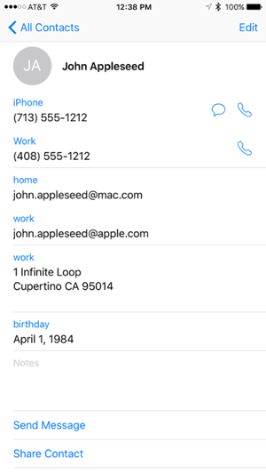
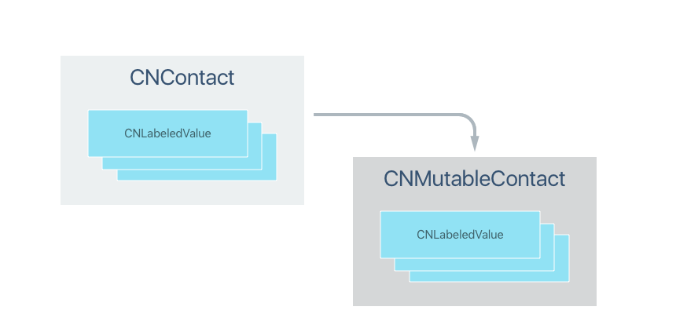
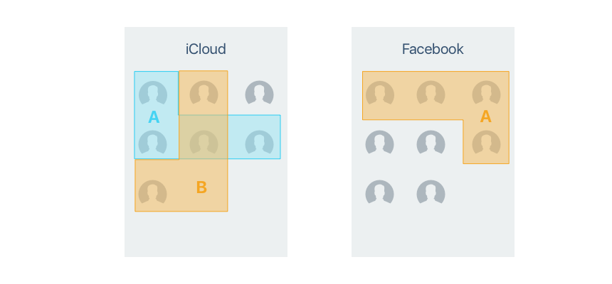

# Contacts and ContactsUI in Xamarin.iOS

_This article covers working with the new Contacts and Contacts UI frameworks in a Xamarin.iOS app. These frameworks replace the existing Address Book and Address Book UI used in previous versions of iOS._

With the introduction of iOS 9, Apple has released two new frameworks, `Contacts` and `ContactsUI`,
that replace the existing Address Book and Address Book UI frameworks used by iOS 8 and earlier.

The two new frameworks contain the following functionality:

- [**Contacts**](#contacts) - Provides access to the user's contact list data.
  Because most apps only require read-only access, this framework has been optimized for thread safe, read-only access.

- [**ContactsUI**](#contactsui) - Provides Xamarin.iOS UI elements to display, edit, select
  and create contacts on iOS devices.

[](contacts-images/add01.png#lightbox)

> [!IMPORTANT]
> The existing `AddressBook` and `AddressBookUI` frameworks use by iOS 8 (and prior) have been deprecated in iOS 9 and should be replaced with the new `Contacts` and `ContactsUI` frameworks as soon as possible for any existing Xamarin.iOS app. New apps should be written against the new frameworks.

In the following sections, we'll take a look at these new frameworks and how to
implement them in a Xamarin.iOS app.

<a name="contacts"></a>

## The Contacts Framework

The Contacts Framework provides Xamarin.iOS access to the user's contact information. Because most apps only require read-only access, this framework has been optimized for thread safe, read-only access.

<a name="Contact_Objects"></a>

### Contact Objects

The `CNContact` class provides thread safe, read-only access to a contact's properties such as Name, Address or Phone Numbers. `CNContact` functions like a `NSDictionary` and contains multiple, read-only collections of properties (such as addresses or phone numbers):

[](contacts-images/contactobjects.png#lightbox)

For any property that can have multiple values (such as email address or phone numbers), they will be represented as an array of `NSLabeledValue` objects. `NSLabeledValue` is a thread safe tuple consisting of a read-only set of labels and values where the label defines the value to the user (for example Home or Work email). The Contacts framework provides a selection of predefined labels (via the `CNLabelKey`  and `CNLabelPhoneNumberKey` static classes) that you can use in your app or you have the option of defining custom labels for your needs.

For any Xamarin.iOS app that needs to adjust the values of an existing contact (or create new ones), use the `NSMutableContact` version of the class and its sub classes (such as `CNMutablePostalAddress`).

For example, the follow code will create a new contact and add it to the user's collection of contacts:

```csharp
// Create a new Mutable Contact (read/write)
var contact = new CNMutableContact();

// Set standard properties
contact.GivenName = "John";
contact.FamilyName = "Appleseed";

// Add email addresses
var homeEmail = new CNLabeledValue<NSString>(CNLabelKey.Home, new NSString("john.appleseed@mac.com"));
var workEmail = new CNLabeledValue<NSString>(CNLabelKey.Work, new NSString("john.appleseed@apple.com"));
contact.EmailAddresses = new CNLabeledValue<NSString>[] { homeEmail, workEmail };

// Add phone numbers
var cellPhone = new CNLabeledValue<CNPhoneNumber>(CNLabelPhoneNumberKey.iPhone, new CNPhoneNumber("713-555-1212"));
var workPhone = new CNLabeledValue<CNPhoneNumber>("Work", new CNPhoneNumber("408-555-1212"));
contact.PhoneNumbers = new CNLabeledValue<CNPhoneNumber>[] { cellPhone, workPhone };

// Add work address
var workAddress = new CNMutablePostalAddress()
{
    Street = "1 Infinite Loop",
    City = "Cupertino",
    State = "CA",
    PostalCode = "95014"
};
contact.PostalAddresses = new CNLabeledValue<CNPostalAddress>[] { new CNLabeledValue<CNPostalAddress>(CNLabelKey.Work, workAddress) };

// Add birthday
var birthday = new NSDateComponents()
{
    Day = 1,
    Month = 4,
    Year = 1984
};
contact.Birthday = birthday;

// Save new contact
var store = new CNContactStore();
var saveRequest = new CNSaveRequest();
saveRequest.AddContact(contact, store.DefaultContainerIdentifier);

// Attempt to save changes
NSError error;
if (store.ExecuteSaveRequest(saveRequest, out error))
{
    Console.WriteLine("New contact saved");
}
else
{
    Console.WriteLine("Save error: {0}", error);
}
```

If this code is run on an iOS 9 device, a new contact will be added to the user's collection. For example:

[](contacts-images/add01.png#lightbox)

### Contact Formatting and Localization

The Contacts framework contains several objects and methods that can help you format and localize content for display to the user. For example, the following code would correctly format a contacts name and mailing address for display:

```csharp
Console.WriteLine(CNContactFormatter.GetStringFrom(contact, CNContactFormatterStyle.FullName));
Console.WriteLine(CNPostalAddressFormatter.GetStringFrom(workAddress, CNPostalAddressFormatterStyle.MailingAddress));
```

For property labels that you will be displaying in your app's UI, the Contact framework has methods for localizing those strings as well. Again, this is based on the current locale of the iOS device the app is being run on. For example:

```csharp
// Localized properties
Console.WriteLine(CNContact.LocalizeProperty(CNContactOptions.Nickname));
Console.WriteLine(CNLabeledValue<NSString>.LocalizeLabel(CNLabelKey.Home));
```

### Fetching Existing Contacts

By using an instance of the `CNContactStore` class, you can fetch contact information from the user's contacts database. The `CNContactStore` contains all of the methods required for fetching or updating contacts and groups from the database. Because these methods are synchronous, it is suggested that you run them on a background thread to keep from blocking the UI.

By using predicates (built from the `CNContact` class), you can filter the results returned when fetching contacts from the database. To fetch only contacts that contain  the string `Appleseed`, use the following code:

```csharp
// Create predicate to locate requested contact
var predicate = CNContact.GetPredicateForContacts("Appleseed");
```

> [!IMPORTANT]
> Generic and compound predicates are not supported by the Contacts framework.

For example, to limit the fetch to only the **GivenName** and **FamilyName** properties of the contact, use the following code:

```csharp
// Define fields to be searched
var fetchKeys = new NSString[] {CNContactKey.GivenName, CNContactKey.FamilyName};
```

Finally, to search the database and return the results, use the following code:

```csharp
// Grab matching contacts
var store = new CNContactStore();
NSError error;
var contacts = store.GetUnifiedContacts(predicate, fetchKeys, out error);
```

If this code was run after the sample that we created in the **Contacts Object** section above, it would return the "John Appleseed" contact that we just created.

### Contact Access Privacy

Because end users can grant or deny access to their contact information on a per-application basis, the first time you make a call to the `CNContactStore`, a dialog will be presented asking them to allow access for your app.

The permission request will only be presented once, the first time the app is run, and subsequent runs or calls to the `CNContactStore` will use the permission that the user selected at that time.

You should design your app so that it gracefully handles the user denying access to their contact database.

#### Fetching Partial Contacts

A _Partial Contact_ is a contact that only some of the available properties have been fetched from the contact store for. If you try to access a property that was not previously fetched, it will result in an exception.

You can easily check to see if a given contact has the desired property by using either the `IsKeyAvailable` or `AreKeysAvailable` methods of the `CNContact` instance. For example:

```csharp
// Does the contact contain the requested key?
if (!contact.IsKeyAvailable(CNContactOption.PostalAddresses)) {
    // No, re-request to pull required info
    var fetchKeys = new NSString[] {CNContactKey.GivenName, CNContactKey.FamilyName, CNContactKey.PostalAddresses};
    var store = new CNContactStore();
    NSError error;
    contact = store.GetUnifiedContact(contact.Identifier, fetchKeys, out error);
}
```

> [!IMPORTANT]
> The `GetUnifiedContact` and `GetUnifiedContacts` methods of the `CNContactStore` class _only_ return a Partial Contact limited to the properties requested from the fetch keys provided.

### Unified Contacts

A user might have different sources of contact information for a single person in their contact database (like iCloud, Facebook or Google Mail). In iOS and OS X apps, this contact information will automatically be linked together and displayed to the user as a single, _Unified Contact_:

[](contacts-images/unified01.png#lightbox)

This Unified Contact is a temporary, in-memory view of the link contact information that will be given its own unique identifier (which should be used to refetch the contact if required). By default, the Contacts framework will return a Unified Contact whenever possible.

### Creating and Updating Contacts

As we saw in the [Contact Objects](#Contact_Objects) section above, you use a `CNContactStore` and an instance of a `CNMutableContact` to create new contacts that are then written to the user's contact database using a `CNSaveRequest`:

```csharp
// Create a new Mutable Contact (read/write)
var contact = new CNMutableContact();

// Set standard properties
contact.GivenName = "John";
contact.FamilyName = "Appleseed";

// Save new contact
var store = new CNContactStore();
var saveRequest = new CNSaveRequest();
saveRequest.AddContact(contact, store.DefaultContainerIdentifier);

NSError error;
if (store.ExecuteSaveRequest(saveRequest, out error)) {
    Console.WriteLine("New contact saved");
} else {
    Console.WriteLine("Save error: {0}", error);
}
```

A `CNSaveRequest` can also be used to cache multiple contact and group changes into a single operation and batch those modifications to the `CNContactStore`.

To update a non-mutable contact obtained from a fetch operation, you must first request a mutable copy that you then modify and save back to the contact store. For example:

```csharp
// Get mutable copy of contact
var mutable = contact.MutableCopy() as CNMutableContact;
var newEmail = new CNLabeledValue<NSString>(CNLabelKey.Home, new NSString("john.appleseed@xamarin.com"));

// Append new email
var emails = new NSObject[mutable.EmailAddresses.Length+1];
mutable.EmailAddresses.CopyTo(emails,0);
emails[mutable.EmailAddresses.Length+1] = newEmail;
mutable.EmailAddresses = emails;

// Update contact
var store = new CNContactStore();
var saveRequest = new CNSaveRequest();
saveRequest.UpdateContact(mutable);

NSError error;
if (store.ExecuteSaveRequest(saveRequest, out error)) {
    Console.WriteLine("Contact updated.");
} else {
    Console.WriteLine("Update error: {0}", error);
}
```

### Contact Change Notifications

Whenever a contact is modified, the Contact Store posts a `CNContactStoreDidChangeNotification` to the Default Notification Center. If you have cached or are currently displaying any contacts, you'll need to refresh those objects from the Contact Store (`CNContactStore`).

### Containers and Groups

A user's contacts can exist either locally on the user's device or as contacts synced to the device from one or more server accounts (like Facebook or Google). Each pool of contacts has its own _Container_ and a given Contact can only exist in one container.

[](contacts-images/containers01.png#lightbox)

Some Containers allow for Contacts to be arranged into one or more _Groups_ or _Sub-Groups_. This behavior is dependent on the backing store for a given Container. For example, iCloud has only one Container but can have many Groups (but no Sub-Groups). Microsoft Exchange on the other hand, does not support groups but can have multiple Containers (one for each Exchange Folder).

[](contacts-images/containers02.png#lightbox)

<a name="contactsui"></a>

## The ContactsUI Framework

For situations where your application does not need to present a custom UI, you can use the ContactsUI framework to present UI elements to display, edit, select and create contacts in your Xamarin.iOS app.

By using Apple's built-in controls you not only reduce the amount of code that you have to create to support Contacts in your Xamarin.iOS app, but you present a consistent interface to the app's users.

### The Contact Picker View Controller

The Contact Picker View Controller (`CNContactPickerViewController`) manages the standard Contact Picker View that allows the user to select a Contact or a Contact property from the user's Contact Database. The user can select one or more contact (based on its usage) and the Contact Picker View Controller does not prompt for permission before displaying the picker.

Before you call the `CNContactPickerViewController` class, you define which properties the user can select and define predicates to control the display and selection of Contact Properties.

Use an instance of the class that inherits from `CNContactPickerDelegate` to respond to the user's interaction with the picker. For example:

```csharp
using System;
using System.Linq;
using UIKit;
using Foundation;
using Contacts;
using ContactsUI;

namespace iOS9Contacts
{
    public class ContactPickerDelegate: CNContactPickerDelegate
    {
        #region Constructors
        public ContactPickerDelegate ()
        {
        }

        public ContactPickerDelegate (IntPtr handle) : base (handle)
        {
        }
        #endregion

        #region Override Methods
        public override void ContactPickerDidCancel (CNContactPickerViewController picker)
        {
            Console.WriteLine ("User canceled picker");

        }

        public override void DidSelectContact (CNContactPickerViewController picker, CNContact contact)
        {
            Console.WriteLine ("Selected: {0}", contact);
        }

        public override void DidSelectContactProperty (CNContactPickerViewController picker, CNContactProperty contactProperty)
        {
            Console.WriteLine ("Selected Property: {0}", contactProperty);
        }
        #endregion
    }
}
```

To allow the user to select an email address from the contacts in their database, you could use the following code:

```csharp
// Create a new picker
var picker = new CNContactPickerViewController();

// Select property to pick
picker.DisplayedPropertyKeys = new NSString[] {CNContactKey.EmailAddresses};
picker.PredicateForEnablingContact = NSPredicate.FromFormat("emailAddresses.@count > 0");
picker.PredicateForSelectionOfContact = NSPredicate.FromFormat("emailAddresses.@count == 1");

// Respond to selection
picker.Delegate = new ContactPickerDelegate();

// Display picker
PresentViewController(picker,true,null);
```

### The Contact View Controller

The Contact View Controller (`CNContactViewController`) class provides a controller to present a standard Contact View to the end user. The Contact view can display new New, Unknown or Existing contacts and the type must be specified before the view is displayed by calling the correct static constructor (`FromNewContact`, `FromUnknownContact`, `FromContact`). For Example:

```csharp
// Create a new contact view
var view = CNContactViewController.FromContact(contact);

// Display the view
PresentViewController(view, true, null);
```

## Summary

This article has taken a detailed look at working with the Contact and Contact UI
frameworks in a Xamarin.iOS application. First, it covered the different types
of objects that the Contact framework provides and how you use them to create new
or access existing contacts. It also examined the Contact UI framework to select
existing contacts and display contact information.

## Related Links

- [Contacts Sample](/samples/xamarin/ios-samples/contacts/)
- [What's New in iOS 9](https://developer.apple.com/library/content/releasenotes/General/WhatsNewIniOS/Articles/iOS9.html)
- [Contacts Framework Reference](https://developer.apple.com/documentation/contacts?language=objc)
- [ContactsUI Framework Reference](https://developer.apple.com/documentation/contactsui?language=objc)